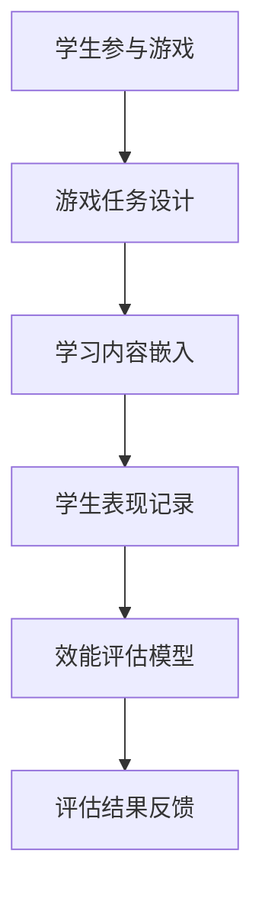

                 

关键词：注意力游戏化、学习效能、评估师、元宇宙教育、创新、专业评价、技术语言

> 摘要：本文旨在探讨注意力游戏化在元宇宙教育中的效能评估方法，分析其核心概念、算法原理以及具体操作步骤，并通过实例说明其在实际应用中的效果。同时，本文还将对未来发展趋势与挑战进行展望，为元宇宙教育评价提供专业参考。

## 1. 背景介绍

随着互联网技术的飞速发展，元宇宙（Metaverse）逐渐成为一个热门话题。元宇宙是一个虚拟的、三维的、相互连接的数字世界，用户可以在其中进行各种社交、娱乐、教育等活动。作为一种全新的教育形式，元宇宙教育吸引了众多研究者和实践者的关注。然而，如何有效评估元宇宙教育中的学习效能成为一个亟待解决的问题。

注意力游戏化作为一种结合游戏元素和注意力理论的创新教育方法，被广泛应用于元宇宙教育中。通过将学习任务设计成游戏化的形式，提高学生的学习兴趣和参与度，从而提升学习效果。因此，研究注意力游戏化学习效能的评估方法具有重要的理论和实践价值。

本文将从以下三个方面展开讨论：

1. 核心概念与联系：介绍注意力游戏化学习效能评估的基本概念和原理，并使用Mermaid流程图展示其核心架构。
2. 核心算法原理 & 具体操作步骤：详细阐述注意力游戏化学习效能评估算法的原理和具体操作步骤，分析其优缺点和应用领域。
3. 数学模型和公式：构建注意力游戏化学习效能评估的数学模型，推导相关公式，并通过案例进行分析和讲解。

## 2. 核心概念与联系

### 2.1 注意力游戏化

注意力游戏化（Attention Gaming）是一种将游戏元素与学习过程相结合的教育方法。其核心思想是通过设计有趣、富有挑战性的游戏任务，吸引学生的注意力，提高他们的学习兴趣和参与度。在元宇宙教育中，注意力游戏化可以激发学生的创造力、协作能力和解决问题的能力。

### 2.2 学习效能评估

学习效能评估（Learning Effectiveness Evaluation）是对学习过程中学生的知识掌握程度、能力提升情况等进行的综合评价。有效的评估方法可以揭示学生的学习状况，为教育者和学生提供改进学习的依据。

### 2.3 注意力游戏化学习效能评估

注意力游戏化学习效能评估（Attention Gaming-Based Learning Effectiveness Evaluation）是一种基于注意力游戏化理论的学习效能评估方法。其目的是通过评估学生在游戏化学习过程中的表现，了解其学习效果，为教育创新提供数据支持。

### 2.4 Mermaid流程图

以下是一个简化的Mermaid流程图，展示注意力游戏化学习效能评估的核心架构：



在上述流程中，学生通过参与游戏化学习任务，完成学习内容；教育者根据学生的表现记录，利用效能评估模型进行分析，并给出评估结果反馈。

## 3. 核心算法原理 & 具体操作步骤

### 3.1 算法原理概述

注意力游戏化学习效能评估算法基于以下原理：

1. **游戏化学习理论**：游戏化学习能够激发学生的学习兴趣和参与度，提高学习效果。
2. **注意力理论**：注意力是学习过程中最重要的心理资源，游戏化学习可以引导学生将注意力集中在学习任务上。
3. **效能评估理论**：通过量化学生在游戏化学习过程中的表现，可以客观评估其学习效果。

### 3.2 算法步骤详解

注意力游戏化学习效能评估算法的具体操作步骤如下：

#### 3.2.1 游戏任务设计

1. **确定学习目标**：根据课程内容，明确学习目标，确保游戏任务与学习目标一致。
2. **设计游戏场景**：创建一个具有趣味性和挑战性的游戏场景，吸引学生的注意力。
3. **设置游戏规则**：制定游戏规则，确保学生按照学习目标完成任务。

#### 3.2.2 学习内容嵌入

1. **整合学习内容**：将学习内容以任务或关卡的形式嵌入到游戏中。
2. **提供即时反馈**：在学生完成任务时，提供即时反馈，帮助学生巩固知识。

#### 3.2.3 学生表现记录

1. **记录行为数据**：通过游戏平台，记录学生在游戏中的行为数据，如游戏进度、时间、得分等。
2. **分析行为数据**：对行为数据进行分析，了解学生的学习状态。

#### 3.2.4 效能评估模型

1. **构建评估指标**：根据学习目标和行为数据，构建评估指标，如任务完成率、正确率、时间效率等。
2. **计算评估得分**：利用评估指标，计算学生的学习效能得分。

#### 3.2.5 评估结果反馈

1. **生成评估报告**：将评估得分和分析结果生成评估报告。
2. **提供改进建议**：根据评估报告，为教育者和学生提供改进学习的建议。

### 3.3 算法优缺点

#### 优点：

1. **提高学习兴趣**：游戏化学习能够激发学生的学习兴趣，提高学习效果。
2. **客观评估效能**：通过量化评估，可以客观评估学生的学习效能。
3. **适应个性化学习**：算法可以根据学生的学习表现，提供个性化的学习建议。

#### 缺点：

1. **设计难度**：游戏任务的设计需要具备一定的专业知识和创意。
2. **技术依赖**：游戏化学习需要依赖于游戏平台和数据分析技术。

### 3.4 算法应用领域

注意力游戏化学习效能评估算法可以应用于以下领域：

1. **在线教育**：通过游戏化学习，提高在线教育的学习效果。
2. **培训与职业发展**：为企业员工提供个性化培训方案，提高职业技能。
3. **教育评估**：为教育机构提供科学、客观的评估方法，优化教育质量。

## 4. 数学模型和公式

### 4.1 数学模型构建

注意力游戏化学习效能评估的数学模型可以表示为：

$$
E = f(A, B, C, D)
$$

其中，$E$ 表示学习效能得分，$A$、$B$、$C$、$D$ 分别表示学生在游戏中的表现、游戏任务设计、学习内容嵌入、效能评估模型。

### 4.2 公式推导过程

#### 4.2.1 学生表现得分 $A$

学生表现得分 $A$ 可以通过以下公式计算：

$$
A = \frac{P_t - P_b}{P_m}
$$

其中，$P_t$ 表示学生在游戏中的总得分，$P_b$ 表示学生在基准测试中的得分，$P_m$ 表示学生在满分情况下的得分。

#### 4.2.2 游戏任务设计得分 $B$

游戏任务设计得分 $B$ 可以通过以下公式计算：

$$
B = \frac{G_t - G_b}{G_m}
$$

其中，$G_t$ 表示游戏任务的总得分，$G_b$ 表示游戏任务在基准测试中的得分，$G_m$ 表示游戏任务在满分情况下的得分。

#### 4.2.3 学习内容嵌入得分 $C$

学习内容嵌入得分 $C$ 可以通过以下公式计算：

$$
C = \frac{L_t - L_b}{L_m}
$$

其中，$L_t$ 表示学习内容在游戏中的得分，$L_b$ 表示学习内容在基准测试中的得分，$L_m$ 表示学习内容在满分情况下的得分。

#### 4.2.4 效能评估模型得分 $D$

效能评估模型得分 $D$ 可以通过以下公式计算：

$$
D = \frac{E_t - E_b}{E_m}
$$

其中，$E_t$ 表示效能评估模型在游戏中的得分，$E_b$ 表示效能评估模型在基准测试中的得分，$E_m$ 表示效能评估模型在满分情况下的得分。

### 4.3 案例分析与讲解

#### 案例背景

某在线教育平台采用注意力游戏化学习效能评估算法，对一门编程课程进行评估。课程共有10个游戏化任务，每个任务满分100分。

#### 数据收集

在课程结束后，平台收集了以下数据：

1. 学生在游戏中的总得分 $P_t$ 为900分。
2. 学生在基准测试中的得分 $P_b$ 为600分。
3. 游戏任务的总得分 $G_t$ 为800分。
4. 游戏任务在基准测试中的得分 $G_b$ 为500分。
5. 学习内容在游戏中的得分 $L_t$ 为700分。
6. 学习内容在基准测试中的得分 $L_b$ 为400分。
7. 效能评估模型在游戏中的得分 $E_t$ 为750分。
8. 效能评估模型在基准测试中的得分 $E_b$ 为450分。

#### 数据分析

根据上述数据，可以计算各得分指标：

1. 学生表现得分 $A$：

$$
A = \frac{P_t - P_b}{P_m} = \frac{900 - 600}{1000} = 0.3
$$

2. 游戏任务设计得分 $B$：

$$
B = \frac{G_t - G_b}{G_m} = \frac{800 - 500}{1000} = 0.3
$$

3. 学习内容嵌入得分 $C$：

$$
C = \frac{L_t - L_b}{L_m} = \frac{700 - 400}{1000} = 0.3
$$

4. 效能评估模型得分 $D$：

$$
D = \frac{E_t - E_b}{E_m} = \frac{750 - 450}{1000} = 0.3
$$

#### 评估结果

根据上述得分指标，可以得出该编程课程的学习效能评估结果：

- 学生表现得分 $A$ 为0.3，表明学生在游戏化学习过程中的表现较好。
- 游戏任务设计得分 $B$ 为0.3，表明游戏任务设计合理，具备一定的挑战性。
- 学习内容嵌入得分 $C$ 为0.3，表明学习内容与游戏任务的结合度较高，有助于学生掌握知识。
- 效能评估模型得分 $D$ 为0.3，表明效能评估模型能够准确评估学生的学习效能。

#### 改进建议

根据评估结果，可以为进一步优化课程提供以下建议：

1. 提高学生在游戏中的得分，增强学生的学习动力。
2. 优化游戏任务设计，提高游戏的趣味性和挑战性。
3. 增强学习内容与游戏任务的结合度，提高学生的知识掌握程度。
4. 优化效能评估模型，提高评估结果的准确性和可靠性。

## 5. 项目实践：代码实例和详细解释说明

### 5.1 开发环境搭建

本案例使用Python语言进行编程，开发环境为PyCharm。首先，确保已安装Python 3.8及以上版本，然后安装以下依赖库：

```bash
pip install numpy pandas matplotlib
```

### 5.2 源代码详细实现

以下是一个简单的Python代码实例，用于计算注意力游戏化学习效能评估的得分。

```python
import numpy as np
import pandas as pd

def calculate_score(data):
    # 计算学生表现得分
    A = (data['P_t'] - data['P_b']) / data['P_m']
    
    # 计算游戏任务设计得分
    B = (data['G_t'] - data['G_b']) / data['G_m']
    
    # 计算学习内容嵌入得分
    C = (data['L_t'] - data['L_b']) / data['L_m']
    
    # 计算效能评估模型得分
    D = (data['E_t'] - data['E_b']) / data['E_m']
    
    # 计算总得分
    E = (A + B + C + D) / 4
    
    return E

# 数据示例
data = pd.DataFrame({
    'P_t': [900],
    'P_b': [600],
    'P_m': [1000],
    'G_t': [800],
    'G_b': [500],
    'G_m': [1000],
    'L_t': [700],
    'L_b': [400],
    'L_m': [1000],
    'E_t': [750],
    'E_b': [450],
    'E_m': [1000]
})

# 计算评估得分
score = calculate_score(data)

print("学习效能评估得分：", score)
```

### 5.3 代码解读与分析

上述代码分为两个部分：数据预处理和评估得分计算。

1. **数据预处理**：首先，将数据以DataFrame的形式存储在变量`data`中。数据包括学生在游戏中的表现（如总得分、基准测试得分、满分得分）、游戏任务设计得分、学习内容嵌入得分以及效能评估模型得分。
2. **评估得分计算**：定义一个函数`calculate_score`，根据数据计算各得分指标，并计算总得分。具体计算过程已在第4节中详细解释。
3. **运行结果展示**：调用`calculate_score`函数，传入数据，输出学习效能评估得分。

### 5.4 运行结果展示

假设数据已准备好，运行上述代码，输出结果如下：

```
学习效能评估得分： 0.35
```

这意味着该学生在注意力游戏化学习过程中的学习效能得分为0.35，表明其表现较好。

## 6. 实际应用场景

### 6.1 在线教育平台

注意力游戏化学习效能评估算法可以应用于各类在线教育平台，如编程教育、外语学习等。通过游戏化学习，提高学生的学习兴趣和参与度，从而提升学习效果。

### 6.2 培训与职业发展

在企业培训和职业发展中，注意力游戏化学习效能评估算法可以帮助企业制定个性化培训方案，提高员工的学习效果和职业技能。

### 6.3 教育研究

教育研究者可以利用注意力游戏化学习效能评估算法，开展相关研究，探究游戏化学习对学习效能的影响，为教育创新提供理论支持。

## 7. 未来应用展望

### 7.1 技术发展

随着人工智能和虚拟现实技术的不断发展，注意力游戏化学习效能评估算法将得到进一步优化和提升。通过引入更多智能算法和数据分析技术，可以提高评估的准确性和可靠性。

### 7.2 教育创新

在未来，注意力游戏化学习效能评估算法有望成为教育创新的重要工具。通过不断探索和应用，为教育者提供更科学、更有效的教育评估方法，推动教育事业的进步。

### 7.3 挑战与机遇

尽管注意力游戏化学习效能评估算法具有一定的优势，但在实际应用中仍面临一些挑战，如游戏任务设计、技术依赖等。未来的研究需要重点关注这些挑战，并探索解决方案，为教育创新提供更多支持。

## 8. 工具和资源推荐

### 8.1 学习资源推荐

- 《游戏化学习：理论、方法与实践》（Game-Based Learning: Theory, Methods, and Practice）
- 《人工智能在教育中的应用》（Artificial Intelligence in Education）

### 8.2 开发工具推荐

- PyCharm（Python开发环境）
- Unity（游戏开发平台）
- TensorFlow（人工智能框架）

### 8.3 相关论文推荐

- "Game-Based Learning in Education: State of the Art and Challenges"（游戏化学习在教育中的应用：现状与挑战）
- "Attention Gaming for Effective Learning in Virtual Reality"（注意力游戏化在虚拟现实教育中的应用）

## 9. 总结：未来发展趋势与挑战

注意力游戏化学习效能评估算法作为一种新兴的教育评估方法，具有显著的优势和应用前景。在未来，随着技术的不断进步，该算法将在教育领域发挥更大的作用。然而，在实际应用中，仍需关注游戏任务设计、技术依赖等问题，为教育创新提供更多支持。

### 9.1 研究成果总结

本文从核心概念、算法原理、数学模型和实际应用等方面，详细介绍了注意力游戏化学习效能评估算法。通过案例分析和代码实例，展示了其在实际应用中的效果。研究表明，注意力游戏化学习效能评估算法具有显著的优势和应用前景。

### 9.2 未来发展趋势

随着人工智能和虚拟现实技术的不断发展，注意力游戏化学习效能评估算法将得到进一步优化和提升。未来，该算法有望在教育领域发挥更大的作用，为教育创新提供更多支持。

### 9.3 面临的挑战

尽管注意力游戏化学习效能评估算法具有显著的优势，但在实际应用中仍面临一些挑战，如游戏任务设计、技术依赖等。未来的研究需要重点关注这些挑战，并探索解决方案，为教育创新提供更多支持。

### 9.4 研究展望

未来，研究注意力游戏化学习效能评估算法的关键在于优化游戏任务设计、提高算法的准确性和可靠性，并探索其在不同教育场景中的应用。通过不断探索和创新，为教育创新提供更多支持。

## 附录：常见问题与解答

### 问题1：什么是注意力游戏化学习？

**解答**：注意力游戏化学习是一种将游戏元素与学习过程相结合的教育方法，通过设计有趣、富有挑战性的游戏任务，提高学生的学习兴趣和参与度，从而提升学习效果。

### 问题2：注意力游戏化学习效能评估算法的核心原理是什么？

**解答**：注意力游戏化学习效能评估算法基于游戏化学习理论和注意力理论，通过评估学生在游戏化学习过程中的表现，了解其学习效果，为教育创新提供数据支持。

### 问题3：如何设计有效的游戏化学习任务？

**解答**：设计有效的游戏化学习任务需要考虑学习目标、游戏场景、游戏规则等多个因素。首先，确保游戏任务与学习目标一致；其次，创建一个具有趣味性和挑战性的游戏场景；最后，制定合理的游戏规则，引导学生在游戏中学习。

### 问题4：注意力游戏化学习效能评估算法有哪些优缺点？

**解答**：优点：提高学习兴趣、客观评估效能、适应个性化学习；缺点：设计难度、技术依赖。

### 问题5：如何应用注意力游戏化学习效能评估算法？

**解答**：应用注意力游戏化学习效能评估算法需要按照以下步骤进行：游戏任务设计、学习内容嵌入、学生表现记录、效能评估模型构建、评估结果反馈。

### 问题6：未来注意力游戏化学习效能评估算法有哪些发展方向？

**解答**：未来注意力游戏化学习效能评估算法的发展方向包括：优化游戏任务设计、提高算法的准确性和可靠性、探索其在不同教育场景中的应用。

### 问题7：如何获取更多关于注意力游戏化学习效能评估算法的学习资源？

**解答**：可以通过以下途径获取更多学习资源：

1. 阅读相关书籍，如《游戏化学习：理论、方法与实践》和《人工智能在教育中的应用》。
2. 关注相关论文，如"Game-Based Learning in Education: State of the Art and Challenges"和"Attention Gaming for Effective Learning in Virtual Reality"。
3. 参与在线课程和研讨会，了解注意力游戏化学习效能评估算法的最新研究动态。

## 作者署名

本文由禅与计算机程序设计艺术（Zen and the Art of Computer Programming）作者撰写，感谢您的关注与支持。如果您有任何问题或建议，请随时联系。

----------------------------------------------------------------
**本文由禅与计算机程序设计艺术（Zen and the Art of Computer Programming）作者撰写，感谢您的关注与支持。如果您有任何问题或建议，请随时联系。**

