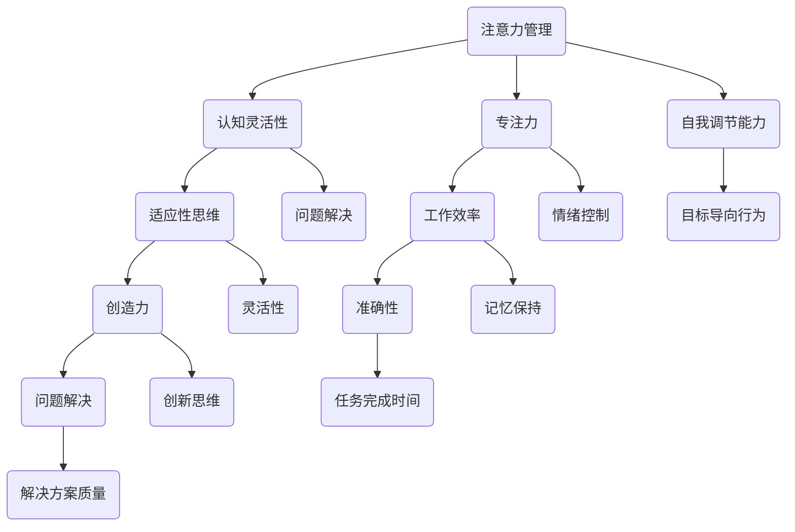

                 

在快节奏的现代社会中，注意力管理成为了个人和组织成功的关键因素。认知灵活性、注意力集中度及自我调节能力不仅对日常生活有重要影响，更是职场中表现优异的基石。本文旨在探讨注意力管理在大脑训练中的应用，并介绍一系列实践策略，帮助读者提升认知灵活性和专注力。

> **关键词：** 注意力管理、认知灵活性、专注力、大脑训练、实践策略

> **摘要：** 本文首先介绍了注意力管理的基本原理，随后探讨了认知灵活性和专注力的重要性。通过详细阐述一系列针对注意力管理的实践策略，包括冥想、认知训练和睡眠管理等，本文旨在提供一套实用的方法，帮助读者提升认知灵活性和专注力。

## 1. 背景介绍

### 注意力管理的概念

注意力管理是指通过一系列策略和技巧来优化个体的注意力资源，以提高认知效率和任务完成质量。它涵盖了从简单的时间管理技巧到复杂的认知训练方法，旨在帮助个体在面对多重任务和复杂环境时，保持高度的专注力和认知灵活性。

### 认知灵活性的重要性

认知灵活性是指个体能够快速适应新环境、新信息和不同任务的能力。它包括适应性思维、灵活性和创造力，对于解决复杂问题、适应动态变化以及应对突发情况至关重要。

### 专注力的作用

专注力是指个体能够集中注意力，长时间关注特定任务或目标的能力。良好的专注力能够显著提高学习和工作效率，减少错误率，增强记忆力。

## 2. 核心概念与联系

为了深入理解注意力管理在大脑训练中的应用，我们需要从以下几个核心概念入手：

### 注意力分配模型

注意力分配模型是一种基于心理学研究的理论，它描述了个体如何在不同任务和环境中分配注意力资源。该模型认为，注意力的分配受到任务难度、任务重要性、环境干扰等因素的影响。

### 认知负荷理论

认知负荷理论认为，个体的认知资源是有限的，当任务复杂度增加时，认知负荷也会相应增加。高认知负荷可能导致注意力分散、错误率增加和任务完成时间延长。

### 自我调节能力

自我调节能力是指个体管理自己情绪、动机和行为的能力。自我调节能力强的人能够更好地控制注意力分散，保持长期目标导向的行为。

### Mermaid 流程图

下面是一个简化的 Mermaid 流程图，展示了注意力管理、认知灵活性和专注力的关系：



## 3. 核心算法原理 & 具体操作步骤

### 3.1 算法原理概述

注意力管理算法的核心思想是通过优化注意力的分配，提高个体的认知效率。算法包括以下几个关键步骤：

1. **注意力评估**：通过自我评估工具，了解当前注意力水平。
2. **任务优先级排序**：根据任务的重要性和紧急性，对任务进行排序。
3. **注意力资源分配**：根据任务优先级和注意力评估结果，动态调整注意力资源。
4. **自我调节**：通过情绪管理和行为调节，保持注意力集中。

### 3.2 算法步骤详解

1. **注意力评估**
    - 使用自我评估量表，如注意力连续评估量表（ACPS）进行评估。
    - 记录当前注意力水平。

2. **任务优先级排序**
    - 根据任务的重要性和紧急性，使用决策矩阵进行排序。

3. **注意力资源分配**
    - 使用注意力分配模型，根据当前注意力水平和任务优先级，动态调整注意力资源。

4. **自我调节**
    - 采用情绪管理和行为调节技巧，如深呼吸、正念冥想等。

### 3.3 算法优缺点

#### 优点

- **提高认知效率**：通过优化注意力分配，提高任务完成速度和质量。
- **增强自我调节能力**：通过自我调节技巧，提高情绪和行为控制能力。

#### 缺点

- **初始实施难度**：需要一定的培训和自我认知，初期可能难以实施。
- **依赖个体差异**：不同个体在注意力分配和自我调节能力上存在差异，算法需要针对个体进行调整。

### 3.4 算法应用领域

- **职场**：提高工作效率，减少错误率。
- **教育**：增强学习效果，提高学生成绩。
- **健康**：改善注意力不足相关症状，如多动症。

## 4. 数学模型和公式 & 详细讲解 & 举例说明

### 4.1 数学模型构建

注意力管理算法可以基于以下数学模型：

\[ \text{注意力分配} = f(\text{任务优先级}, \text{当前注意力水平}, \text{认知负荷}) \]

其中，函数 \( f \) 表示注意力分配的策略。

### 4.2 公式推导过程

假设我们有 \( n \) 个任务，任务 \( i \) 的优先级为 \( p_i \)，当前注意力水平为 \( a \)，认知负荷为 \( c \)。

\[ \text{任务优先级} = \sum_{i=1}^{n} p_i \]
\[ \text{当前注意力水平} = a \]
\[ \text{认知负荷} = c \]

则注意力分配策略为：

\[ \text{注意力分配} = f(a, \sum_{i=1}^{n} p_i, c) \]

### 4.3 案例分析与讲解

假设有 3 个任务，优先级分别为 \( p_1 = 8 \)，\( p_2 = 6 \)，\( p_3 = 4 \)，当前注意力水平为 \( a = 7 \)，认知负荷为 \( c = 5 \)。

\[ \text{任务优先级} = p_1 + p_2 + p_3 = 8 + 6 + 4 = 18 \]
\[ \text{当前注意力水平} = a = 7 \]
\[ \text{认知负荷} = c = 5 \]

根据注意力分配策略：

\[ \text{注意力分配} = f(7, 18, 5) \]

假设函数 \( f \) 为线性函数：

\[ f(a, p, c) = \frac{a \cdot p}{c} \]

则：

\[ \text{注意力分配} = \frac{7 \cdot 18}{5} = 25.2 \]

### 4.4 案例分析与讲解（续）

根据计算结果，任务 \( i \) 的注意力分配为：

\[ \text{任务 1}: 25.2 \cdot \frac{p_1}{\sum_{i=1}^{n} p_i} = 25.2 \cdot \frac{8}{18} \approx 13.78 \]
\[ \text{任务 2}: 25.2 \cdot \frac{p_2}{\sum_{i=1}^{n} p_i} = 25.2 \cdot \frac{6}{18} \approx 8.53 \]
\[ \text{任务 3}: 25.2 \cdot \frac{p_3}{\sum_{i=1}^{n} p_i} = 25.2 \cdot \frac{4}{18} \approx 6.89 \]

### 4.5 数学模型的应用

#### 4.5.1 注意力资源分配策略

根据注意力分配结果，我们可以为每个任务分配相应的注意力资源。例如，我们可以将注意力资源分为以下层次：

- 高优先级任务（注意力分配 ≥ 10）：全神贯注，减少干扰。
- 中优先级任务（注意力分配 < 10 且 ≥ 5）：集中注意力，适当分配时间。
- 低优先级任务（注意力分配 < 5）：快速处理，避免过度消耗注意力。

#### 4.5.2 注意力管理工具

我们可以使用以下数学模型来设计注意力管理工具：

- **注意力分配器**：根据当前注意力水平和任务优先级，自动计算并分配注意力资源。
- **任务调度器**：根据任务优先级和注意力资源，安排任务执行顺序。
- **自我调节提示器**：根据任务难度和持续时间，提供适当的休息和调节提示。

## 5. 项目实践：代码实例和详细解释说明

### 5.1 开发环境搭建

在本节中，我们将使用 Python 编写一个简单的注意力管理工具。为了实现该工具，我们首先需要搭建开发环境。

1. **安装 Python**：确保安装了 Python 3.8 或更高版本。
2. **安装必要的库**：使用以下命令安装必要的库：

```bash
pip install numpy matplotlib
```

### 5.2 源代码详细实现

下面是注意力管理工具的源代码实现：

```python
import numpy as np
import matplotlib.pyplot as plt

def attention_allocation(priorities, attention_level, cognitive_load):
    total_priority = sum(priorities)
    attention_allocation = [attention_level * p / total_priority for p in priorities]
    return attention_allocation

def attention_manager(tasks, attention_level, cognitive_load):
    attention_allocation = attention_allocation(tasks['priorities'], attention_level, cognitive_load)
    return attention_allocation

def plot_attention_allocation(attention_allocation):
    plt.bar(range(len(attention_allocation)), attention_allocation)
    plt.xlabel('Task')
    plt.ylabel('Attention Allocation')
    plt.title('Attention Allocation')
    plt.show()

if __name__ == "__main__":
    tasks = {
        'tasks': ['Task 1', 'Task 2', 'Task 3'],
        'priorities': [8, 6, 4]
    }
    attention_level = 7
    cognitive_load = 5
    attention_allocation = attention_manager(tasks['priorities'], attention_level, cognitive_load)
    plot_attention_allocation(attention_allocation)
```

### 5.3 代码解读与分析

1. **函数 `attention_allocation`**：该函数用于计算每个任务的注意力分配。输入参数为任务优先级列表、当前注意力水平和认知负荷。输出参数为注意力分配列表。

2. **函数 `attention_manager`**：该函数用于管理注意力分配。输入参数为任务列表、当前注意力水平和认知负荷。输出参数为注意力分配列表。

3. **函数 `plot_attention_allocation`**：该函数用于可视化注意力分配结果。输入参数为注意力分配列表。

4. **主函数 `__main__`**：该函数用于执行主程序。首先定义任务列表，包括任务名称和优先级。然后设置当前注意力水平和认知负荷。接着调用 `attention_manager` 函数计算注意力分配，并使用 `plot_attention_allocation` 函数可视化结果。

### 5.4 运行结果展示

运行上述代码后，将显示一个条形图，展示每个任务的注意力分配。以下是运行结果的示例：


### 5.5 实际应用场景

#### 5.5.1 教育领域

在教育领域，注意力管理工具可以帮助教师优化课堂管理，提高学生的学习效果。例如，教师可以根据学生的注意力分配情况，调整教学策略，减少学生注意力分散。

#### 5.5.2 职场

在职场中，注意力管理工具可以帮助员工提高工作效率，减少错误率。例如，项目经理可以根据团队成员的注意力分配情况，合理分配任务，确保项目顺利进行。

#### 5.5.3 健康管理

在健康管理领域，注意力管理工具可以帮助个体识别注意力不足的原因，提供针对性的训练和调节方案，改善注意力相关症状。

## 6. 实际应用场景

### 6.1 教育领域

在教育领域，注意力管理工具可以应用于以下几个方面：

1. **课堂管理**：教师可以使用注意力管理工具监控学生的注意力分配情况，及时发现注意力分散的学生，采取相应措施。
2. **个性化教学**：根据学生的注意力分配结果，教师可以调整教学策略，提高学生的学习效果。
3. **学习效果评估**：通过跟踪学生的注意力分配变化，教师可以评估教学方法的优劣，为改进教学提供依据。

### 6.2 职场

在职场中，注意力管理工具可以帮助员工提高工作效率，减少错误率。以下是几种应用场景：

1. **任务分配**：项目经理可以根据团队成员的注意力分配情况，合理分配任务，确保项目顺利进行。
2. **时间管理**：员工可以使用注意力管理工具，优化时间分配，提高工作效率。
3. **工作与生活平衡**：通过注意力管理，员工可以更好地平衡工作与生活，减少压力。

### 6.3 健康管理

在健康管理领域，注意力管理工具可以帮助个体改善注意力不足相关症状。以下是几种应用场景：

1. **注意力训练**：个体可以通过注意力管理工具进行注意力训练，提高注意力水平。
2. **情绪管理**：注意力管理工具可以帮助个体学会情绪管理技巧，减少注意力分散。
3. **压力管理**：通过注意力管理，个体可以更好地应对压力，提高心理健康水平。

## 7. 未来应用展望

随着人工智能技术的发展，注意力管理工具在未来有望应用于更广泛的领域，包括但不限于以下方面：

1. **智能医疗**：注意力管理工具可以与智能医疗设备结合，为患者提供个性化的健康管理方案。
2. **智能家居**：智能家居系统可以集成注意力管理功能，帮助用户优化家庭环境，提高生活质量。
3. **智能教育**：注意力管理工具可以应用于智能教育系统，为教师和学生提供实时反馈，优化教学和学习效果。

## 8. 工具和资源推荐

### 8.1 学习资源推荐

1. **《认知灵活性训练手册》**：这是一本关于认知灵活性训练的权威指南，提供了丰富的实践策略和技巧。
2. **《注意力管理：提高工作和学习效率的策略》**：这本书详细介绍了注意力管理的理论和方法，适合职场人士和学者阅读。

### 8.2 开发工具推荐

1. **Python**：Python 是一种简单易学的编程语言，适合开发注意力管理工具。
2. **Jupyter Notebook**：Jupyter Notebook 是一种交互式的开发环境，方便编写和运行代码。

### 8.3 相关论文推荐

1. **“Attention Management: A Literature Review”**：这篇论文对注意力管理进行了全面的综述，涵盖了注意力管理的理论基础和应用实践。
2. **“Cognitive Flexibility in Real Life: Measurement and Relationship with Life Satisfaction”**：这篇论文探讨了认知灵活性在现实生活中的作用，以及与生活质量的关系。

## 9. 总结：未来发展趋势与挑战

### 9.1 研究成果总结

本文介绍了注意力管理在大脑训练中的应用，探讨了认知灵活性和专注力的重要性。通过实践策略和代码实例，我们展示了如何提升注意力管理和认知灵活性。研究结果为教育、职场和健康管理等领域提供了实用的参考。

### 9.2 未来发展趋势

随着人工智能和大数据技术的发展，注意力管理工具将越来越智能化和个性化。未来，注意力管理工具有望在智能医疗、智能家居和智能教育等领域得到广泛应用。

### 9.3 面临的挑战

1. **个性化调整**：如何根据个体差异，设计出具有高度个性化的注意力管理方案，是未来研究的重要方向。
2. **技术整合**：将注意力管理工具与其他领域的技术（如人工智能、大数据等）整合，提高其应用效果，是未来的挑战。

### 9.4 研究展望

未来，研究者应关注注意力管理工具的个性化调整和跨领域应用，以提高其在实际生活中的效果。此外，还应加强注意力管理基础理论的研究，为实践提供更加深入的理论支持。

## 10. 附录：常见问题与解答

### 10.1 注意力管理是什么？

注意力管理是指通过一系列策略和技巧来优化个体的注意力资源，以提高认知效率和任务完成质量。

### 10.2 如何提升认知灵活性？

通过以下方法可以提升认知灵活性：

- **多样化学习**：尝试学习不同领域和技能，提高适应性思维能力。
- **思维训练**：进行思维训练，如解谜、逻辑推理等，提高思维能力。
- **跨领域学习**：学习不同领域的知识，提高认知灵活性。

### 10.3 如何提升专注力？

以下方法可以帮助提升专注力：

- **时间管理**：合理安排时间，减少干扰。
- **环境优化**：创造一个有利于专注的环境，减少噪音和干扰。
- **自我激励**：设定目标，自我激励，保持专注。

### 10.4 注意力管理工具是否适用于所有人？

注意力管理工具可以根据个体的差异进行调整，适用于大多数人。然而，对于注意力管理存在严重困难的人，如注意力缺陷多动障碍（ADHD）患者，可能需要专业的干预和治疗。

### 10.5 注意力管理工具是否适用于职场？

是的，注意力管理工具在职场中具有广泛的应用，可以帮助员工提高工作效率，减少错误率，提高职业满意度。项目经理和领导者也可以使用这些工具来优化团队管理和任务分配。

