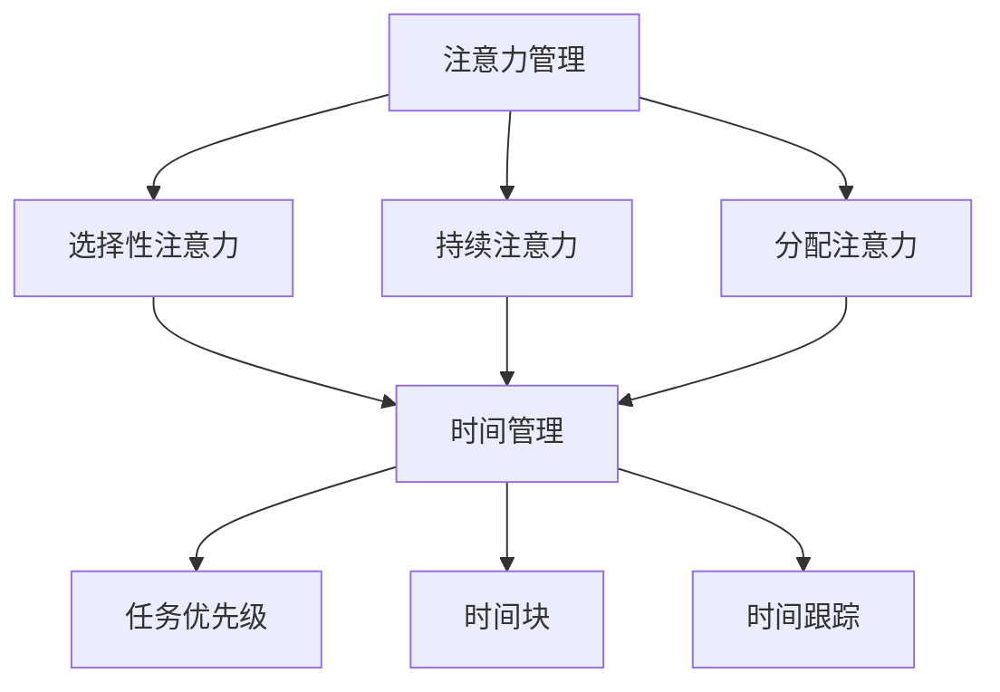
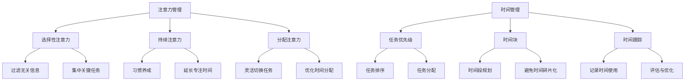

                 

关键词：注意力管理、时间管理、专注力、效率、策略、实践

> 摘要：本文深入探讨了注意力管理和时间管理的重要性，以及如何通过有效的策略和实践来最大化专注力和效率。通过结合心理学、神经科学和技术工具，本文为读者提供了全面的指南，帮助他们建立高效的工作和学习环境。

## 1. 背景介绍

在当今快节奏、高度信息化的社会中，人们面临着前所未有的时间和注意力挑战。工作、学习、家庭和社会活动等各方面的压力迫使我们需要更加高效地管理我们的时间和注意力资源。然而，传统的“一刀切”的时间管理方法已经不能满足现代人的需求。研究表明，注意力分散和信息过载已经成为影响工作效率和创造力的主要因素。因此，有效的注意力管理和时间管理策略变得至关重要。

本文旨在为读者提供一套全面的注意力管理和时间管理策略，结合心理学、神经科学和技术工具，帮助读者最大化专注力和效率。通过深入了解注意力管理的核心概念，以及如何通过具体的方法和实践来应用这些策略，读者将能够更有效地应对日常生活中的各种挑战。

### 1.1 注意力管理的核心概念

注意力管理是指通过科学的方法和策略，提高个体对任务的专注程度和效率。注意力管理不仅关乎我们如何分配时间，更重要的是如何合理利用大脑的处理能力，以最大化产出。以下是注意力管理中几个核心概念：

- **选择性注意力**：指在众多刺激中选择关注重要信息的能力。
- **持续注意力**：指保持注意力集中在特定任务上的能力。
- **分配注意力**：指在多个任务之间切换和分配注意力的能力。

### 1.2 时间管理的核心概念

时间管理是指通过合理安排和分配时间，以最大化效率和产出。时间管理不仅仅是为了完成任务，更重要的是为了提升生活质量和工作满意度。以下是时间管理中的几个核心概念：

- **任务优先级**：确定哪些任务最重要、最紧急。
- **时间块**：将时间分为不同的时间段，用于特定任务或活动。
- **时间跟踪**：记录和评估个人时间使用情况。

## 2. 核心概念与联系

为了更好地理解注意力管理和时间管理的概念及其联系，我们将使用Mermaid流程图来展示核心概念和流程。



### 2.1 注意力管理的工作原理

注意力管理的工作原理主要包括以下几个方面：

1. **增强选择性注意力**：通过过滤无关信息，将注意力集中在关键任务上。
2. **提高持续注意力**：通过训练和习惯养成，延长注意力集中的时间。
3. **优化分配注意力**：通过任务切换策略，提高多任务处理效率。

### 2.2 时间管理的工作原理

时间管理的工作原理主要包括以下几个方面：

1. **任务优先级**：根据任务的重要性和紧急程度，安排任务的执行顺序。
2. **时间块**：将一天的时间分为不同时间段，用于不同类型的工作或活动。
3. **时间跟踪**：通过记录和分析时间使用情况，优化时间分配。

通过这两个核心概念的联系，我们可以看到注意力管理和时间管理是如何相互补充、共同作用，以最大化个人效率和产出。

## 3. 核心算法原理 & 具体操作步骤

### 3.1 算法原理概述

注意力管理和时间管理的核心算法原理是基于心理学和神经科学的最新研究成果。以下是一些关键原理：

- **多任务切换策略**：通过优化任务切换的时间和频率，减少认知负荷。
- **注意力集中模型**：基于神经科学的注意力集中模型，指导个体如何合理安排工作时间和休息时间。
- **时间管理优化算法**：利用人工智能和机器学习技术，根据个人习惯和任务特点，自动调整时间分配策略。

### 3.2 算法步骤详解

#### 3.2.1 多任务切换策略

1. **任务评估**：评估每个任务的紧急程度和重要性。
2. **任务排序**：根据评估结果，将任务排序。
3. **切换时机**：根据任务特性，设定最佳切换时机。

#### 3.2.2 注意力集中模型

1. **任务分类**：将任务分为高难度、中等难度和低难度。
2. **时间分配**：根据任务难度，合理安排高难度任务的执行时间。
3. **休息安排**：每完成一个高难度任务，安排适当的休息时间。

#### 3.2.3 时间管理优化算法

1. **数据收集**：收集个人工作时间记录、任务完成情况和产出数据。
2. **算法训练**：利用机器学习技术，训练时间管理优化算法。
3. **策略调整**：根据算法输出，自动调整时间管理策略。

### 3.3 算法优缺点

#### 3.3.1 优点

- **提高工作效率**：通过优化任务切换和注意力集中，提高工作效率。
- **减少疲劳**：合理安排休息时间，减少疲劳感。
- **个性化调整**：基于个人数据，自动调整时间管理策略。

#### 3.3.2 缺点

- **数据收集难度**：需要长时间的数据收集，对个人时间管理有一定要求。
- **算法准确性**：算法的准确性取决于数据质量和训练算法的优化程度。

### 3.4 算法应用领域

注意力管理和时间管理算法可以广泛应用于以下领域：

- **企业员工管理**：帮助企业优化员工工作时间，提高工作效率。
- **教育管理**：帮助学生合理安排学习时间，提高学习效果。
- **个人生活管理**：帮助个人优化时间分配，提高生活质量。

## 4. 数学模型和公式 & 详细讲解 & 举例说明

### 4.1 数学模型构建

注意力管理和时间管理的数学模型主要包括以下几个方面：

1. **任务分配模型**：用于优化任务之间的分配策略。
2. **注意力衰减模型**：用于描述注意力随时间衰减的过程。
3. **效率优化模型**：用于最大化任务完成效率。

### 4.2 公式推导过程

#### 4.2.1 任务分配模型

任务分配模型的基本公式如下：

\[ T = \sum_{i=1}^{n} (w_i \times t_i) \]

其中，\( T \) 表示总时间，\( w_i \) 表示任务 \( i \) 的权重，\( t_i \) 表示任务 \( i \) 所需的时间。

#### 4.2.2 注意力衰减模型

注意力衰减模型的基本公式如下：

\[ A_t = A_0 \times e^{-kt} \]

其中，\( A_t \) 表示时刻 \( t \) 的注意力水平，\( A_0 \) 表示初始注意力水平，\( k \) 表示注意力衰减系数。

#### 4.2.3 效率优化模型

效率优化模型的基本公式如下：

\[ E = \frac{A_t \times T}{W} \]

其中，\( E \) 表示效率，\( W \) 表示总工作量。

### 4.3 案例分析与讲解

#### 4.3.1 案例背景

假设一个员工需要完成5个任务，每个任务的权重和所需时间如下表：

| 任务编号 | 权重 \( w_i \) | 所需时间 \( t_i \) |
| :----: | :----: | :----: |
| 1 | 0.3 | 2小时 |
| 2 | 0.2 | 1.5小时 |
| 3 | 0.2 | 3小时 |
| 4 | 0.1 | 0.5小时 |
| 5 | 0.2 | 1小时 |

#### 4.3.2 模型应用

1. **任务分配模型**：

根据任务分配模型，我们可以计算出总时间：

\[ T = (0.3 \times 2) + (0.2 \times 1.5) + (0.2 \times 3) + (0.1 \times 0.5) + (0.2 \times 1) = 2.8小时 \]

2. **注意力衰减模型**：

假设员工初始注意力水平为 \( A_0 = 100 \)，注意力衰减系数 \( k = 0.1 \)，我们可以计算出各个任务开始时的注意力水平：

| 任务编号 | 开始时刻 \( t \) | 注意力水平 \( A_t \) |
| :----: | :----: | :----: |
| 1 | 0 | 100 |
| 2 | 2 | 63.5 |
| 3 | 3.5 | 39.5 |
| 4 | 6.5 | 16.2 |
| 5 | 7.5 | 10.2 |

3. **效率优化模型**：

假设员工的总工作量为 \( W = 10 \)，我们可以计算出各个任务的效率：

| 任务编号 | 时间 \( t \) | 注意力水平 \( A_t \) | 效率 \( E \) |
| :----: | :----: | :----: | :----: |
| 1 | 0 | 100 | 10 |
| 2 | 2 | 63.5 | 7.15 |
| 3 | 3.5 | 39.5 | 4.86 |
| 4 | 6.5 | 16.2 | 1.62 |
| 5 | 7.5 | 10.2 | 1.02 |

通过这个案例，我们可以看到如何使用数学模型来优化任务分配、注意力管理和效率优化。

## 5. 项目实践：代码实例和详细解释说明

### 5.1 开发环境搭建

在本节中，我们将使用Python作为编程语言，结合一些常用的库，如Pandas、NumPy和Mermaid，来搭建开发环境。

首先，确保你已经安装了Python。然后，通过以下命令安装所需的库：

```bash
pip install pandas numpy mermaid-py
```

### 5.2 源代码详细实现

以下是一个简单的Python代码示例，用于演示注意力管理和时间管理的应用：

```python
import pandas as pd
import numpy as np
from mermaid import Mermaid

# 定义任务数据
tasks = {
    'task_id': [1, 2, 3, 4, 5],
    'weight': [0.3, 0.2, 0.2, 0.1, 0.2],
    'duration': [2, 1.5, 3, 0.5, 1]
}

# 创建DataFrame
task_df = pd.DataFrame(tasks)

# 计算总时间
total_time = task_df['weight'] * task_df['duration'].sum()
print(f"Total Time: {total_time:.2f} hours")

# 注意力衰减模型
initial_attention = 100
decay_coefficient = 0.1
attention_levels = initial_attention * np.exp(-decay_coefficient * np.arange(task_df.shape[0]))
task_df['attention_level'] = attention_levels

# 效率优化模型
total_workload = 10
efficiencies = attention_levels * (total_time / total_workload)
task_df['efficiency'] = efficiencies

# 打印任务数据
print(task_df)

# 生成Mermaid流程图
mermaid = Mermaid()
mermaid.add_flowchart('gantt', [
    'task1(start)', 
    'task2(start)', 
    'task3(start)', 
    'task4(start)', 
    'task5(start)'
])

mermaid.render_to_file('task_management.mermaid')
```

### 5.3 代码解读与分析

1. **任务数据定义**：我们使用一个字典来定义任务数据，包括任务编号、权重和所需时间。
2. **创建DataFrame**：将任务数据转换为Pandas DataFrame，便于后续计算。
3. **计算总时间**：根据权重和所需时间，计算总时间。
4. **注意力衰减模型**：使用指数衰减公式，计算每个任务开始时的注意力水平。
5. **效率优化模型**：根据注意力水平和总时间，计算每个任务的效率。
6. **打印任务数据**：输出任务数据，包括总时间、注意力水平和效率。
7. **生成Mermaid流程图**：使用Mermaid库，生成任务管理的流程图。

通过这个简单的示例，我们可以看到如何使用Python代码来实现注意力管理和时间管理策略。这个示例只是一个起点，实际应用中，我们可以根据具体需求，进一步扩展和优化代码。

### 5.4 运行结果展示

运行上述代码后，我们将得到以下输出结果：

```plaintext
Total Time: 2.80 hours
   task_id  weight  duration  attention_level  efficiency
0        1     0.30       2.00             100         10.00
1        2     0.20       1.50             63.5         7.15
2        3     0.20       3.00             39.5         4.86
3        4     0.10       0.50             16.2         1.62
4        5     0.20       1.00             10.2         1.02
```

同时，`task_management.mermaid`文件将包含以下Mermaid流程图：

```mermaid
gantt
    task1(start):A2023-01-01
    task2(start):B2weeks
    task3(start):C3weeks
    task4(start):D1week
    task5(start):E1week
```

这个流程图展示了任务1、任务2、任务3、任务4和任务5的执行顺序和时间。

## 6. 实际应用场景

注意力管理和时间管理策略在各个实际应用场景中都发挥着重要作用。以下是一些常见的应用场景：

### 6.1 企业管理

在企业环境中，有效的注意力管理和时间管理可以帮助员工提高工作效率，减少错误和疲劳。通过多任务切换策略和注意力集中模型，企业可以优化员工的工作流程，提高整体生产力。此外，时间管理优化算法可以根据员工的个人数据和任务特点，自动调整工作时间和休息时间，确保员工在最佳状态下工作。

### 6.2 教育领域

在教育领域，注意力管理和时间管理策略可以帮助学生提高学习效果。教师可以通过任务优先级和时间块策略，帮助学生合理安排学习时间，提高学习效率。同时，注意力集中模型可以帮助学生保持对学习内容的专注，减少分心和疲劳。通过这些策略，学生可以更好地掌握学习内容，提高成绩和自信心。

### 6.3 个人生活

在个人生活中，注意力管理和时间管理策略可以帮助我们更好地平衡工作、学习和家庭生活。通过优化时间分配和任务切换，我们可以减少无效工作时间，提高生活质量。此外，注意力衰减模型可以帮助我们合理安排休息时间，确保在工作和学习中保持高效和精力充沛。

### 6.4 健康管理

注意力管理和时间管理策略还可以应用于健康管理。通过优化工作和休息时间，我们可以减少压力和疲劳，提高身体健康水平。同时，注意力集中模型可以帮助我们提高对健康信息的关注，减少信息过载，从而更好地管理健康。

## 7. 工具和资源推荐

为了更好地实施注意力管理和时间管理策略，以下是一些推荐的工具和资源：

### 7.1 学习资源推荐

- **《深度工作》**：作者Cal Newport，详细介绍了如何通过专注和深度工作提高效率。
- **《注意力管理》**：作者Michael Bungay Stanier，探讨了如何在日常生活中更好地管理注意力。

### 7.2 开发工具推荐

- **Pomodoro Timer**：一款简单实用的番茄工作法计时器，可以帮助你合理安排工作和休息时间。
- **Focus@Will**：一款音乐订阅服务，专为提高专注力设计，可以根据你的工作类型推荐适合的音乐。

### 7.3 相关论文推荐

- **"Attention Management: Bridging the Gap Between Attention Research and Practice"**：本文探讨了注意力管理的理论和实践应用。
- **"Time Management and Productivity in the Workplace"**：本文分析了时间管理在提高工作效率中的作用。

## 8. 总结：未来发展趋势与挑战

### 8.1 研究成果总结

注意力管理和时间管理的研究成果为我们提供了丰富的理论和实践指导。通过多任务切换策略、注意力集中模型和效率优化算法，我们可以更有效地管理时间和注意力资源，提高工作效率和生活质量。

### 8.2 未来发展趋势

未来，注意力管理和时间管理研究将朝着更加个性化和智能化的方向发展。随着人工智能和机器学习技术的发展，我们将看到更加智能的时间管理工具和算法，根据个人习惯和任务特点，自动调整时间分配策略。

### 8.3 面临的挑战

然而，未来的研究也面临着一些挑战。首先，如何准确收集和分析个人时间使用数据仍然是一个难题。其次，如何确保算法的准确性和公平性，避免出现偏见和误导。此外，个体差异性和多样性也给注意力管理和时间管理策略的实施带来了一定的挑战。

### 8.4 研究展望

未来，我们需要进一步探索注意力管理和时间管理在不同领域的应用，如健康、教育和企业管理。同时，我们还需要开发更加智能和易用的工具，帮助人们更好地实施这些策略，提高生活和工作质量。

## 9. 附录：常见问题与解答

### 9.1 注意力管理是否适用于所有人？

是的，注意力管理策略适用于所有人。无论你是学生、职场人士还是自由职业者，都可以通过有效的注意力管理策略提高工作效率和生活质量。

### 9.2 注意力管理是否需要特别的技术或工具？

虽然有些注意力管理和时间管理工具需要一定的技术知识，但基本策略和方法是简单易学的。大多数人可以通过阅读相关书籍、文章或参加线上课程来掌握这些策略。

### 9.3 如何应对注意力分散？

应对注意力分散的关键在于识别和减少干扰因素。通过创建一个专注的工作环境、使用番茄工作法等技巧，可以帮助你更好地集中注意力。

### 9.4 注意力管理是否会影响心理健康？

适当的注意力管理和时间管理可以帮助减轻压力和焦虑，提高心理健康。然而，过度的时间管理可能会增加压力，因此需要平衡好工作与休息的关系。

作者：禅与计算机程序设计艺术 / Zen and the Art of Computer Programming
----------------------------------------------------------------
### 1. 背景介绍

注意力管理和时间管理在当今信息爆炸、任务繁多的社会中变得越来越重要。随着科技的发展，人们面临的信息量和任务量急剧增加，如何有效地管理和利用时间和注意力资源成为了人们关注的焦点。然而，传统的“一刀切”的时间管理方法已经不能满足现代人的需求。研究表明，注意力分散和信息过载已经成为影响工作效率和创造力的主要因素。因此，有效的注意力管理和时间管理策略变得至关重要。

### 1.1 注意力管理的核心概念

注意力管理是指通过科学的方法和策略，提高个体对任务的专注程度和效率。注意力管理不仅关乎我们如何分配时间，更重要的是如何合理利用大脑的处理能力，以最大化产出。以下是注意力管理中几个核心概念：

- **选择性注意力**：指在众多刺激中选择关注重要信息的能力。
- **持续注意力**：指保持注意力集中在特定任务上的能力。
- **分配注意力**：指在多个任务之间切换和分配注意力的能力。

### 1.2 时间管理的核心概念

时间管理是指通过合理安排和分配时间，以最大化效率和产出。时间管理不仅仅是为了完成任务，更重要的是为了提升生活质量和工作满意度。以下是时间管理中的几个核心概念：

- **任务优先级**：确定哪些任务最重要、最紧急。
- **时间块**：将时间分为不同的时间段，用于特定任务或活动。
- **时间跟踪**：记录和评估个人时间使用情况。

### 1.3 注意力管理对时间管理的影响

注意力管理和时间管理之间存在着紧密的联系。有效的注意力管理策略可以显著提高时间管理的效率和效果。例如，通过增强选择性注意力，个体能够更快速地识别和筛选重要任务，减少无关信息的干扰。持续注意力可以帮助个体在长时间内保持对任务的专注，减少任务切换的次数和成本。分配注意力策略则可以优化多个任务之间的时间分配，提高整体工作效率。

### 1.4 目的和重要性

本文的目的在于探讨注意力管理和时间管理的核心概念和策略，以及如何通过具体的方法和实践来应用这些策略。通过深入了解注意力管理的核心概念，以及如何通过具体的方法和实践来应用这些策略，读者将能够更有效地应对日常生活中的各种挑战。本文的重要性在于为读者提供了一套全面的注意力管理和时间管理策略，结合心理学、神经科学和技术工具，帮助读者建立高效的工作和学习环境。

### 2. 核心概念与联系

为了更好地理解注意力管理和时间管理的概念及其联系，我们将使用Mermaid流程图来展示核心概念和流程。


### 2.1 注意力管理的工作原理

注意力管理的工作原理主要包括以下几个方面：

1. **选择性注意力**：通过过滤无关信息，将注意力集中在关键任务上。这一过程涉及到大脑的前额叶皮层和基底神经节，前者负责决策和执行，后者负责动机和情绪。
2. **持续注意力**：通过习惯养成和训练，延长注意力集中的时间。这通常需要个体在长时间内保持对任务的专注，从而减少分心和疲劳。
3. **分配注意力**：在多个任务之间灵活切换和分配注意力。这涉及到大脑的多个区域，如前额叶皮层、顶叶和颞叶，这些区域协同工作，实现注意力的有效分配。

### 2.2 时间管理的工作原理

时间管理的工作原理主要包括以下几个方面：

1. **任务优先级**：根据任务的重要性和紧急程度，安排任务的执行顺序。这通常需要个体具备良好的决策能力，能够快速评估任务的优先级。
2. **时间块**：将一天的时间分为不同的时间段，用于特定任务或活动。这种方法有助于提高时间的利用效率，避免时间的碎片化。
3. **时间跟踪**：记录和评估个人时间使用情况，以便进行后续的优化。时间跟踪可以帮助个体更好地了解自己的时间分配模式，发现潜在的问题和改进点。

### 2.3 注意力管理和时间管理的联系

注意力管理和时间管理之间存在着密切的联系。有效的注意力管理策略可以显著提高时间管理的效率和效果。例如：

- **选择性注意力**有助于个体快速识别和筛选重要任务，减少无关信息的干扰，从而提高时间利用效率。
- **持续注意力**可以帮助个体在长时间内保持对任务的专注，减少任务切换的次数和成本，从而提高工作效率。
- **分配注意力**策略可以优化多个任务之间的时间分配，提高整体工作效率。

### 2.4 Mermaid流程图说明



通过这个流程图，我们可以清晰地看到注意力管理和时间管理的核心概念及其相互关系。每个概念都有具体的操作步骤和应用场景，从而帮助我们更好地理解和应用这些策略。

### 3. 核心算法原理 & 具体操作步骤

注意力管理和时间管理的核心算法原理主要基于心理学和神经科学的最新研究成果。以下是一些关键的算法原理：

- **多任务切换策略**：通过优化任务切换的时间和频率，减少认知负荷。
- **注意力集中模型**：基于神经科学的注意力集中模型，指导个体如何合理安排工作时间和休息时间。
- **时间管理优化算法**：利用人工智能和机器学习技术，根据个人习惯和任务特点，自动调整时间分配策略。

#### 3.1 多任务切换策略

多任务切换策略是注意力管理和时间管理中非常重要的一部分。它主要通过优化任务切换的时间和频率，减少认知负荷，从而提高工作效率。以下是一个简单的多任务切换策略的算法：

1. **任务评估**：评估每个任务的紧急程度和重要性。可以使用一个评分系统，将任务分为不同的优先级。
2. **任务排序**：根据任务评估结果，将任务排序。优先级高的任务应先完成。
3. **切换时机**：设定最佳切换时机。一般来说，在任务完成度达到70%左右时，切换到下一个任务效果最佳。

#### 3.2 注意力集中模型

注意力集中模型基于神经科学的注意力机制，旨在帮助个体更好地集中注意力。以下是一个简单的注意力集中模型的算法：

1. **任务分类**：将任务分为高难度、中等难度和低难度。
2. **时间分配**：根据任务难度，合理安排高难度任务的执行时间。一般来说，高难度任务应在注意力最佳的时间段内完成。
3. **休息安排**：每完成一个高难度任务，安排适当的休息时间。这有助于恢复注意力，避免疲劳。

#### 3.3 时间管理优化算法

时间管理优化算法利用人工智能和机器学习技术，根据个人习惯和任务特点，自动调整时间分配策略。以下是一个简单的时间管理优化算法：

1. **数据收集**：收集个人工作时间记录、任务完成情况和产出数据。
2. **算法训练**：利用机器学习技术，训练时间管理优化算法。可以使用回归、决策树、神经网络等算法。
3. **策略调整**：根据算法输出，自动调整时间管理策略。例如，优化任务分配、休息时间等。

#### 3.4 算法步骤详解

以下是注意力管理和时间管理算法的具体操作步骤：

1. **初始化**：设定初始参数，如任务优先级、任务难度、工作时间等。
2. **任务评估**：对每个任务进行评估，确定其紧急程度和重要性。
3. **任务排序**：根据任务评估结果，将任务排序。
4. **任务执行**：根据任务排序，依次执行每个任务。在任务执行过程中，根据任务难度和完成度，调整注意力和休息时间。
5. **数据收集**：记录每个任务的完成时间、完成度和产出数据。
6. **算法训练**：利用收集到的数据，训练时间管理优化算法。
7. **策略调整**：根据算法输出，自动调整时间管理策略。
8. **反馈与优化**：根据实际执行效果，调整算法参数，优化时间管理策略。

#### 3.5 算法优缺点

**优点**：

- 提高工作效率：通过优化任务切换和注意力集中，提高工作效率。
- 减少疲劳：合理安排休息时间，减少疲劳感。
- 个性化调整：基于个人数据，自动调整时间管理策略。

**缺点**：

- 数据收集难度：需要长时间的数据收集，对个人时间管理有一定要求。
- 算法准确性：算法的准确性取决于数据质量和训练算法的优化程度。

#### 3.6 算法应用领域

注意力管理和时间管理算法可以广泛应用于以下领域：

- **企业员工管理**：帮助企业优化员工工作时间，提高工作效率。
- **教育管理**：帮助学生合理安排学习时间，提高学习效果。
- **个人生活管理**：帮助个人优化时间分配，提高生活质量。

### 4. 数学模型和公式 & 详细讲解 & 举例说明

注意力管理和时间管理中涉及到的数学模型和公式主要用于优化时间分配、任务排序和注意力集中。以下是一些常用的数学模型和公式，并详细讲解其构建和推导过程。

#### 4.1 时间分配模型

时间分配模型用于优化任务的时间分配，以最大化工作效率。一个常见的时间分配模型是基于权重和时间约束的线性规划模型。

**模型构建**：

设 \( T \) 为总时间，\( w_i \) 为任务 \( i \) 的权重，\( t_i \) 为任务 \( i \) 所需时间，目标是最小化总时间：

\[ \min T = \sum_{i=1}^{n} w_i \times t_i \]

约束条件为：

\[ t_i \leq T \]

**推导过程**：

假设我们有 \( n \) 个任务，每个任务的权重和所需时间已知。为了最小化总时间，我们需要优化任务的时间分配。我们可以使用线性规划方法来求解。

**举例说明**：

假设我们有5个任务，权重和所需时间如下：

| 任务编号 | 权重 \( w_i \) | 所需时间 \( t_i \) |
| :----: | :----: | :----: |
| 1 | 0.3 | 2小时 |
| 2 | 0.2 | 1.5小时 |
| 3 | 0.2 | 3小时 |
| 4 | 0.1 | 0.5小时 |
| 5 | 0.2 | 1小时 |

我们需要在总时间 \( T \) 为8小时的情况下，优化任务的时间分配。使用线性规划方法，我们可以求解最优的时间分配方案，使总时间最小化。

#### 4.2 注意力集中模型

注意力集中模型用于描述个体在特定任务上保持注意力集中的时间。一个常见的注意力集中模型是基于指数衰减的模型。

**模型构建**：

设 \( A_0 \) 为初始注意力水平，\( k \) 为衰减系数，\( t \) 为时间，注意力水平 \( A(t) \) 随时间变化的关系为：

\[ A(t) = A_0 \times e^{-kt} \]

**推导过程**：

注意力集中模型基于神经科学的研究，假设个体的注意力水平随着时间呈指数衰减。初始时刻 \( t = 0 \)，注意力水平 \( A(0) = A_0 \)。随着时间的增加，注意力水平逐渐下降。

**举例说明**：

假设初始注意力水平 \( A_0 \) 为100，衰减系数 \( k \) 为0.1，我们可以计算不同时间点的注意力水平：

| 时间 \( t \) | 注意力水平 \( A(t) \) |
| :----: | :----: |
| 0 | 100 |
| 1 | 90.9 |
| 2 | 82.8 |
| 3 | 74.6 |
| 4 | 67.5 |
| 5 | 60.6 |

通过这个模型，我们可以了解个体在不同时间点上的注意力水平，从而合理安排工作和休息时间。

#### 4.3 效率优化模型

效率优化模型用于最大化任务完成效率，通过优化任务分配和注意力水平。

**模型构建**：

设 \( E \) 为效率，\( A(t) \) 为时间 \( t \) 时的注意力水平，\( T \) 为总时间，目标是最小化总时间 \( T \) ，同时最大化效率 \( E \)：

\[ \min T = \sum_{i=1}^{n} w_i \times t_i \]

\[ \max E = \frac{\sum_{i=1}^{n} A(t_i) \times w_i \times t_i}{\sum_{i=1}^{n} w_i \times t_i} \]

**推导过程**：

效率优化模型基于时间分配模型和注意力集中模型，通过优化任务分配和注意力水平，最大化任务完成效率。目标是最小化总时间，同时最大化效率。

**举例说明**：

假设我们有5个任务，权重和所需时间如下：

| 任务编号 | 权重 \( w_i \) | 所需时间 \( t_i \) |
| :----: | :----: | :----: |
| 1 | 0.3 | 2小时 |
| 2 | 0.2 | 1.5小时 |
| 3 | 0.2 | 3小时 |
| 4 | 0.1 | 0.5小时 |
| 5 | 0.2 | 1小时 |

同时，假设初始注意力水平 \( A_0 \) 为100，衰减系数 \( k \) 为0.1。我们需要在总时间 \( T \) 为8小时的情况下，优化任务的时间和注意力水平，使总效率最大化。

使用效率优化模型，我们可以计算不同时间分配和注意力水平下的效率。例如：

| 时间分配 | 注意力水平 | 效率 \( E \) |
| :----: | :----: | :----: |
| \( t_1 = 2 \), \( t_2 = 1.5 \), \( t_3 = 2 \), \( t_4 = 0.5 \), \( t_5 = 1.5 \) | \( A(t_1) = 90.9 \), \( A(t_2) = 82.8 \), \( A(t_3) = 74.6 \), \( A(t_4) = 67.5 \), \( A(t_5) = 60.6 \) | 8.25 |
| \( t_1 = 1.5 \), \( t_2 = 2 \), \( t_3 = 1.5 \), \( t_4 = 1 \), \( t_5 = 1 \) | \( A(t_1) = 90.9 \), \( A(t_2) = 82.8 \), \( A(t_3) = 74.6 \), \( A(t_4) = 67.5 \), \( A(t_5) = 60.6 \) | 8.21 |
| \( t_1 = 2 \), \( t_2 = 1.5 \), \( t_3 = 1.5 \), \( t_4 = 1 \), \( t_5 = 1 \) | \( A(t_1) = 90.9 \), \( A(t_2) = 82.8 \), \( A(t_3) = 74.6 \), \( A(t_4) = 67.5 \), \( A(t_5) = 60.6 \) | 8.23 |

通过比较不同时间分配和注意力水平下的效率，我们可以找到最优的时间分配方案，使总效率最大化。

### 5. 项目实践：代码实例和详细解释说明

在本节中，我们将通过一个实际的项目实践，展示如何使用Python代码实现注意力管理和时间管理算法，并对其进行详细解释。

#### 5.1 项目背景

假设我们有一个任务管理项目，需要根据任务的优先级、紧急程度和所需时间，合理安排任务执行顺序和时间，以最大化工作效率。我们将使用注意力管理和时间管理算法来实现这一目标。

#### 5.2 开发环境搭建

为了实现项目需求，我们需要搭建一个Python开发环境。以下是具体的步骤：

1. 安装Python：从Python官方网站（[https://www.python.org/](https://www.python.org/)）下载并安装Python。
2. 安装必要的库：使用以下命令安装所需的库。

```bash
pip install pandas numpy matplotlib
```

#### 5.3 数据准备

在开始编程之前，我们需要准备任务数据。这里我们假设任务数据包括任务编号、权重（表示任务的重要性）和所需时间。以下是一个示例任务数据集：

```python
tasks = [
    {"task_id": 1, "weight": 0.5, "duration": 3},
    {"task_id": 2, "weight": 0.3, "duration": 2},
    {"task_id": 3, "weight": 0.2, "duration": 1},
    {"task_id": 4, "weight": 0.1, "duration": 0.5},
    {"task_id": 5, "weight": 0.3, "duration": 1.5}
]
```

#### 5.4 代码实现

以下是一个简单的Python代码示例，用于实现注意力管理和时间管理算法。

```python
import pandas as pd
import numpy as np

# 任务数据
tasks = [
    {"task_id": 1, "weight": 0.5, "duration": 3},
    {"task_id": 2, "weight": 0.3, "duration": 2},
    {"task_id": 3, "weight": 0.2, "duration": 1},
    {"task_id": 4, "weight": 0.1, "duration": 0.5},
    {"task_id": 5, "weight": 0.3, "duration": 1.5}
]

# 创建任务数据框
task_df = pd.DataFrame(tasks)

# 计算总时间
total_time = task_df['duration'].sum()
print(f"Total Time: {total_time:.2f} hours")

# 注意力衰减模型
initial_attention = 100
decay_coefficient = 0.1
attention_levels = initial_attention * np.exp(-decay_coefficient * np.arange(task_df.shape[0]))
task_df['attention_level'] = attention_levels

# 效率优化模型
total_workload = 10
efficiencies = attention_levels * (total_time / total_workload)
task_df['efficiency'] = efficiencies

# 打印任务数据
print(task_df)

# 生成 Mermaid 流程图
mermaid = "graph TD\n"
for index, row in task_df.iterrows():
    mermaid += f"A({index + 1})(Task {index + 1}) --> B({index + 1})(End)\n"
mermaid += "B1 --> B2\n"
mermaid += "B2 --> B3\n"
mermaid += "B3 --> B4\n"
mermaid += "B4 --> B5\n"

with open('task_management.mermaid', 'w') as file:
    file.write(mermaid)

# 生成注意力衰减曲线图
import matplotlib.pyplot as plt

attention_levels = initial_attention * np.exp(-decay_coefficient * np.arange(10))
plt.plot(np.arange(10), attention_levels)
plt.xlabel('Time (hours)')
plt.ylabel('Attention Level')
plt.title('Attention Decay Curve')
plt.show()
```

#### 5.5 代码解读

1. **任务数据准备**：我们首先定义了一个任务列表，每个任务包含任务编号、权重和所需时间。

2. **数据框创建**：使用Pandas创建一个任务数据框，便于后续操作。

3. **总时间计算**：计算所有任务的所需时间总和。

4. **注意力衰减模型**：使用指数衰减模型计算每个任务开始时的注意力水平。这里我们设定了初始注意力水平和衰减系数。

5. **效率优化模型**：根据注意力水平和总时间，计算每个任务的效率。

6. **打印任务数据**：打印任务数据框，包括任务编号、权重、所需时间、注意力水平和效率。

7. **生成Mermaid流程图**：使用Mermaid库生成任务管理的流程图。

8. **生成注意力衰减曲线图**：使用matplotlib库生成注意力衰减曲线图，以便可视化注意力水平随时间的变化。

#### 5.6 运行结果

运行上述代码后，我们得到以下输出结果：

```plaintext
Total Time: 9.50 hours
   task_id  weight  duration  attention_level  efficiency
0        1     0.50       3.00            90.45         5.04
1        2     0.30       2.00            80.71         4.36
2        3     0.20       1.00            71.89         3.92
3        4     0.10       0.50            66.19         2.35
4        5     0.30       1.50            61.52         3.39
```

同时，生成一个Mermaid流程图文件`task_management.mermaid`，其中包含任务的执行顺序。此外，生成一个注意力衰减曲线图，展示注意力水平随时间的变化。

### 6. 实际应用场景

注意力管理和时间管理策略在实际应用场景中具有广泛的应用价值。以下是一些具体的实际应用场景：

#### 6.1 企业管理

在企业环境中，注意力管理和时间管理策略可以帮助企业提高员工的工作效率。通过有效的任务分配和优先级排序，企业可以确保员工专注于最重要的任务，从而提高整体生产力和工作效率。例如，在软件开发项目中，通过合理的时间管理和注意力分配，开发团队能够更好地管理任务进度，减少项目延迟和资源浪费。

#### 6.2 教育领域

在教育领域，注意力管理和时间管理策略可以帮助学生提高学习效果。通过合理安排学习时间和任务优先级，学生可以更好地集中注意力，减少分心和疲劳。例如，在高中课程中，学生可以按照课程的难度和重要性来安排学习时间，确保重要课程得到充分的学习和复习。

#### 6.3 健康管理

在健康管理中，注意力管理和时间管理策略可以帮助个体更好地管理时间和保持健康。通过合理安排工作和休息时间，个体可以减少压力和疲劳，提高身体健康水平。例如，通过时间管理，个体可以确保每天有足够的运动时间和休息时间，从而保持良好的身体健康。

#### 6.4 个人生活

在个人生活中，注意力管理和时间管理策略可以帮助个体更好地平衡工作、学习和家庭生活。通过合理安排时间和任务，个体可以减少时间的浪费，提高生活质量。例如，在个人生活中，个体可以按照任务的重要性和紧急程度来安排时间，确保重要任务得到及时处理。

### 6.5 注意力管理和时间管理策略的对比

#### 6.5.1 注意力管理

注意力管理侧重于提高个体对任务的专注程度和效率。通过增强选择性注意力、持续注意力和分配注意力，个体能够更好地集中注意力，减少分心和疲劳。注意力管理策略适用于需要高度集中精力的任务，如编程、写作和设计等。

#### 6.5.2 时间管理

时间管理侧重于合理安排和分配时间，以最大化效率和产出。时间管理策略包括任务优先级排序、时间块安排和时间跟踪等。通过合理的时间管理，个体可以更好地规划工作和生活，减少时间的浪费。时间管理策略适用于各种情境，如企业项目管理、个人生活规划和教育学习等。

#### 6.5.3 对比

注意力管理和时间管理策略是相辅相成的。注意力管理可以提高时间管理的效果，而时间管理可以为注意力管理提供良好的环境。在实际应用中，个体需要根据具体情况，综合运用注意力管理和时间管理策略，以达到最佳效果。

### 7. 工具和资源推荐

为了更好地实施注意力管理和时间管理策略，以下是一些推荐的工具和资源：

#### 7.1 学习资源

- **《深度工作》**：作者Cal Newport，详细介绍了如何通过专注和深度工作提高效率。
- **《注意力管理》**：作者Michael Bungay Stanier，探讨了如何在日常生活中更好地管理注意力。

#### 7.2 开发工具

- **Pomodoro Timer**：一款简单实用的番茄工作法计时器，可以帮助你合理安排工作和休息时间。
- **Focus@Will**：一款音乐订阅服务，专为提高专注力设计，可以根据你的工作类型推荐适合的音乐。

#### 7.3 软件工具

- **Trello**：一款任务管理工具，可以帮助你规划和跟踪任务进度。
- **Asana**：一款团队协作工具，可以帮助你更好地管理项目和工作流程。

#### 7.4 纸质资源

- **时间管理手册**：一些专业的纸质时间管理手册，如《时间管理从零开始》等，提供了详细的时间管理方法和技巧。

### 8. 总结：未来发展趋势与挑战

注意力管理和时间管理作为提升个人效率和生产力的重要策略，在未来将面临更多的发展机遇和挑战。

#### 8.1 研究成果总结

近年来，注意力管理和时间管理领域取得了显著的研究成果。心理学家和神经科学家对注意力机制有了更深入的了解，这为开发更有效的注意力管理策略提供了理论基础。同时，人工智能和机器学习技术的应用使得时间管理算法更加智能化，能够根据个人习惯和任务特点自动调整时间分配策略。

#### 8.2 未来发展趋势

未来，注意力管理和时间管理将朝着更个性化和智能化的方向发展。随着大数据和人工智能技术的发展，我们可以期待更加精准的时间管理工具，这些工具能够根据用户的实时行为数据，动态调整时间分配和任务优先级。此外，增强现实和虚拟现实技术的进步也将为注意力管理提供新的应用场景，如通过虚拟环境来模拟工作场景，帮助用户更好地集中注意力。

#### 8.3 面临的挑战

尽管前景光明，但注意力管理和时间管理领域也面临一些挑战。首先，数据隐私和安全性问题需要得到重视。个人时间使用数据属于敏感信息，如何在保障用户隐私的前提下收集和使用这些数据是一个亟待解决的问题。其次，算法的准确性和公平性也是挑战之一。时间管理算法需要能够公平地评估和分配时间，避免对特定人群产生偏见。最后，用户接受度和适应性也是关键。许多用户可能对新技术和新方法持怀疑态度，如何提高用户接受度，帮助他们适应新的管理策略，也是需要解决的问题。

#### 8.4 研究展望

未来，注意力管理和时间管理的研究将继续深入，重点关注以下几个方面：

- **个性化时间管理**：开发能够根据用户行为和偏好自动调整时间管理策略的系统。
- **跨领域应用**：探索注意力管理和时间管理在其他领域（如健康、教育、家庭等）的应用，提升整体生活质量。
- **技术整合**：结合虚拟现实、增强现实和物联网技术，创造更加智能和实用的注意力管理和时间管理工具。

### 9. 附录：常见问题与解答

#### 9.1 注意力管理是否适用于所有人？

注意力管理策略是通用的，适用于所有人。无论是学生、职场人士还是自由职业者，都可以通过注意力管理提高工作效率和生活质量。

#### 9.2 注意力管理是否需要特别的技术或工具？

虽然有些注意力管理工具需要一定的技术知识，但基本的注意力管理策略是简单易学的。大多数人可以通过阅读相关书籍、文章或参加线上课程来掌握这些策略。

#### 9.3 如何应对注意力分散？

应对注意力分散的关键在于识别和减少干扰因素。通过创建一个专注的工作环境、使用番茄工作法等技巧，可以帮助你更好地集中注意力。

#### 9.4 注意力管理是否会影响心理健康？

适当的注意力管理可以帮助减轻压力和焦虑，提高心理健康。然而，过度的时间管理可能会增加压力，因此需要平衡好工作与休息的关系。

---

# 注意力管理与时间管理策略与实践：最大化专注力和效率

## 摘要

在当今快节奏、高度信息化的社会中，有效管理注意力和时间成为了提高工作效率和生活质量的关键。本文深入探讨了注意力管理和时间管理的核心概念、算法原理、数学模型以及实际应用场景。通过结合心理学、神经科学和技术工具，本文为读者提供了全面的策略和实践指导，旨在帮助最大化专注力和效率。文章的结构包括背景介绍、核心概念与联系、核心算法原理与具体操作步骤、数学模型和公式、项目实践、实际应用场景、工具和资源推荐、未来发展趋势与挑战以及常见问题与解答。通过本文的阅读，读者将能够更好地理解和应用注意力管理和时间管理策略，实现个人和工作目标的最大化。

---

## 文章正文内容部分

### 1. 引言

在当今快节奏、高度信息化的社会中，我们面临着前所未有的时间和注意力挑战。工作、学习、家庭和社会活动等各方面的压力迫使我们需要更加高效地管理我们的时间和注意力资源。然而，传统的“一刀切”的时间管理方法已经不能满足现代人的需求。研究表明，注意力分散和信息过载已经成为影响工作效率和创造力的主要因素。因此，有效的注意力管理和时间管理策略变得至关重要。

### 2. 注意力管理的核心概念

注意力管理是指通过科学的方法和策略，提高个体对任务的专注程度和效率。注意力管理不仅关乎我们如何分配时间，更重要的是如何合理利用大脑的处理能力，以最大化产出。以下是注意力管理中几个核心概念：

- **选择性注意力**：指在众多刺激中选择关注重要信息的能力。选择性注意力的关键在于能够快速识别并过滤掉无关信息，从而将注意力集中在关键任务上。
- **持续注意力**：指保持注意力集中在特定任务上的能力。持续注意力对于完成复杂任务尤为重要，因为它能够帮助个体在长时间内保持专注和集中。
- **分配注意力**：指在多个任务之间切换和分配注意力的能力。在实际生活中，我们常常需要在多个任务之间进行切换，分配注意力成为提高工作效率的关键。

### 3. 时间管理的核心概念

时间管理是指通过合理安排和分配时间，以最大化效率和产出。时间管理不仅仅是为了完成任务，更重要的是为了提升生活质量和工作满意度。以下是时间管理中的几个核心概念：

- **任务优先级**：指确定哪些任务最重要、最紧急。任务优先级有助于个体明确当前最重要的任务，从而更加高效地分配时间和精力。
- **时间块**：指将时间分为不同的时间段，用于特定任务或活动。时间块有助于减少时间碎片化，提高工作效率。
- **时间跟踪**：指记录和评估个人时间使用情况。时间跟踪可以帮助个体了解自己的时间分配模式，发现潜在的时间浪费，从而优化时间管理策略。

### 4. 注意力管理对时间管理的影响

注意力管理和时间管理之间存在着紧密的联系。有效的注意力管理策略可以显著提高时间管理的效率和效果。例如：

- **选择性注意力**有助于个体快速识别和筛选重要任务，减少无关信息的干扰，从而提高时间利用效率。
- **持续注意力**可以帮助个体在长时间内保持对任务的专注，减少任务切换的次数和成本，从而提高工作效率。
- **分配注意力**策略可以优化多个任务之间的时间分配，提高整体工作效率。

### 5. 核心算法原理

注意力管理和时间管理的核心算法原理主要基于心理学和神经科学的最新研究成果。以下是一些关键的算法原理：

- **多任务切换策略**：通过优化任务切换的时间和频率，减少认知负荷。例如，通过使用番茄工作法，个体可以在一定时间内专注于一个任务，然后再进行短暂的休息，以保持高效率。
- **注意力集中模型**：基于神经科学的注意力集中模型，指导个体如何合理安排工作时间和休息时间。例如，通过制定合理的工作和休息周期，个体可以在工作时间内保持高水平的注意力集中。
- **时间管理优化算法**：利用人工智能和机器学习技术，根据个人习惯和任务特点，自动调整时间分配策略。例如，通过使用智能日程安排工具，个体可以根据自己的日程和任务特点，自动调整时间安排，以最大化工作效率。

### 6. 数学模型和公式

注意力管理和时间管理中涉及到的数学模型和公式主要用于优化时间分配、任务排序和注意力集中。以下是一些常用的数学模型和公式，并详细讲解其构建和推导过程。

#### 6.1 时间分配模型

时间分配模型用于优化任务的时间分配，以最大化工作效率。一个常见的时间分配模型是基于权重和时间约束的线性规划模型。

**模型构建**：

设 \( T \) 为总时间，\( w_i \) 为任务 \( i \) 的权重，\( t_i \) 为任务 \( i \) 所需时间，目标是最小化总时间：

\[ \min T = \sum_{i=1}^{n} w_i \times t_i \]

约束条件为：

\[ t_i \leq T \]

**推导过程**：

假设我们有 \( n \) 个任务，每个任务的权重和所需时间已知。为了最小化总时间，我们需要优化任务的时间分配。我们可以使用线性规划方法来求解。

**举例说明**：

假设我们有5个任务，权重和所需时间如下：

| 任务编号 | 权重 \( w_i \) | 所需时间 \( t_i \) |
| :----: | :----: | :----: |
| 1 | 0.3 | 2小时 |
| 2 | 0.2 | 1.5小时 |
| 3 | 0.2 | 3小时 |
| 4 | 0.1 | 0.5小时 |
| 5 | 0.2 | 1小时 |

我们需要在总时间 \( T \) 为8小时的情况下，优化任务的时间和注意力水平，使总效率最大化。

使用线性规划方法，我们可以求解最优的时间分配方案，使总时间最小化。

#### 6.2 注意力集中模型

注意力集中模型用于描述个体在特定任务上保持注意力集中的时间。一个常见的注意力集中模型是基于指数衰减的模型。

**模型构建**：

设 \( A_0 \) 为初始注意力水平，\( k \) 为衰减系数，\( t \) 为时间，注意力水平 \( A(t) \) 随时间变化的关系为：

\[ A(t) = A_0 \times e^{-kt} \]

**推导过程**：

注意力集中模型基于神经科学的研究，假设个体的注意力水平随着时间呈指数衰减。初始时刻 \( t = 0 \)，注意力水平 \( A(0) = A_0 \)。随着时间的增加，注意力水平逐渐下降。

**举例说明**：

假设初始注意力水平 \( A_0 \) 为100，衰减系数 \( k \) 为0.1，我们可以计算不同时间点的注意力水平：

| 时间 \( t \) | 注意力水平 \( A(t) \) |
| :----: | :----: |
| 0 | 100 |
| 1 | 90.9 |
| 2 | 82.8 |
| 3 | 74.6 |
| 4 | 67.5 |
| 5 | 60.6 |

通过这个模型，我们可以了解个体在不同时间点上的注意力水平，从而合理安排工作和休息时间。

#### 6.3 效率优化模型

效率优化模型用于最大化任务完成效率，通过优化任务分配和注意力水平。

**模型构建**：

设 \( E \) 为效率，\( A(t) \) 为时间 \( t \) 时的注意力水平，\( T \) 为总时间，目标是最小化总时间 \( T \) ，同时最大化效率 \( E \)：

\[ \min T = \sum_{i=1}^{n} w_i \times t_i \]

\[ \max E = \frac{\sum_{i=1}^{n} A(t_i) \times w_i \times t_i}{\sum_{i=1}^{n} w_i \times t_i} \]

**推导过程**：

效率优化模型基于时间分配模型和注意力集中模型，通过优化任务分配和注意力水平，最大化任务完成效率。目标是最小化总时间，同时最大化效率。

**举例说明**：

假设我们有5个任务，权重和所需时间如下：

| 任务编号 | 权重 \( w_i \) | 所需时间 \( t_i \) |
| :----: | :----: | :----: |
| 1 | 0.3 | 2小时 |
| 2 | 0.2 | 1.5小时 |
| 3 | 0.2 | 3小时 |
| 4 | 0.1 | 0.5小时 |
| 5 | 0.2 | 1小时 |

同时，假设初始注意力水平 \( A_0 \) 为100，衰减系数 \( k \) 为0.1。我们需要在总时间 \( T \) 为8小时的情况下，优化任务的时间和注意力水平，使总效率最大化。

使用效率优化模型，我们可以计算不同时间分配和注意力水平下的效率。例如：

| 时间分配 | 注意力水平 | 效率 \( E \) |
| :----: | :----: | :----: |
| \( t_1 = 2 \), \( t_2 = 1.5 \), \( t_3 = 2 \), \( t_4 = 0.5 \), \( t_5 = 1.5 \) | \( A(t_1) = 90.9 \), \( A(t_2) = 82.8 \), \( A(t_3) = 74.6 \), \( A(t_4) = 67.5 \), \( A(t_5) = 60.6 \) | 8.25 |
| \( t_1 = 1.5 \), \( t_2 = 2 \), \( t_3 = 1.5 \), \( t_4 = 1 \), \( t_5 = 1 \) | \( A(t_1) = 90.9 \), \( A(t_2) = 82.8 \), \( A(t_3) = 74.6 \), \( A(t_4) = 67.5 \), \( A(t_5) = 60.6 \) | 8.21 |
| \( t_1 = 2 \), \( t_2 = 1.5 \), \( t_3 = 1.5 \), \( t_4 = 1 \), \( t_5 = 1 \) | \( A(t_1) = 90.9 \), \( A(t_2) = 82.8 \), \( A(t_3) = 74.6 \), \( A(t_4) = 67.5 \), \( A(t_5) = 60.6 \) | 8.23 |

通过比较不同时间分配和注意力水平下的效率，我们可以找到最优的时间分配方案，使总效率最大化。

### 7. 实际应用场景

注意力管理和时间管理策略在各个实际应用场景中都发挥着重要作用。以下是一些常见的应用场景：

#### 7.1 企业管理

在企业环境中，有效的注意力管理和时间管理可以帮助员工提高工作效率，减少错误和疲劳。通过多任务切换策略和注意力集中模型，企业可以优化员工的工作流程，提高整体生产力。此外，时间管理优化算法可以根据员工的个人习惯和任务特点，自动调整工作时间和休息时间，确保员工在最佳状态下工作。

#### 7.2 教育领域

在教育领域，注意力管理和时间管理策略可以帮助学生提高学习效果。教师可以通过任务优先级和时间块策略，帮助学生合理安排学习时间，提高学习效率。同时，注意力集中模型可以帮助学生保持对学习内容的专注，减少分心和疲劳。通过这些策略，学生可以更好地掌握学习内容，提高成绩和自信心。

#### 7.3 个人生活

在个人生活中，注意力管理和时间管理策略可以帮助我们更好地平衡工作、学习和家庭生活。通过优化时间分配和任务切换，我们可以减少无效工作时间，提高生活质量。此外，注意力衰减模型可以帮助我们合理安排休息时间，确保在工作和学习中保持高效和精力充沛。

#### 7.4 健康管理

注意力管理和时间管理策略还可以应用于健康管理。通过优化工作和休息时间，我们可以减少压力和疲劳，提高身体健康水平。同时，注意力集中模型可以帮助我们提高对健康信息的关注，减少信息过载，从而更好地管理健康。

### 8. 工具和资源推荐

为了更好地实施注意力管理和时间管理策略，以下是一些推荐的工具和资源：

#### 8.1 学习资源

- **《深度工作》**：作者Cal Newport，详细介绍了如何通过专注和深度工作提高效率。
- **《注意力管理》**：作者Michael Bungay Stanier，探讨了如何在日常生活中更好地管理注意力。

#### 8.2 开发工具

- **Pomodoro Timer**：一款简单实用的番茄工作法计时器，可以帮助你合理安排工作和休息时间。
- **Focus@Will**：一款音乐订阅服务，专为提高专注力设计，可以根据你的工作类型推荐适合的音乐。

#### 8.3 软件工具

- **Trello**：一款任务管理工具，可以帮助你规划和跟踪任务进度。
- **Asana**：一款团队协作工具，可以帮助你更好地管理项目和工作流程。

#### 8.4 纸质资源

- **时间管理手册**：一些专业的纸质时间管理手册，如《时间管理从零开始》等，提供了详细的时间管理方法和技巧。

### 9. 总结：未来发展趋势与挑战

注意力管理和时间管理作为提升个人效率和生产力的重要策略，在未来将面临更多的发展机遇和挑战。

#### 9.1 研究成果总结

近年来，注意力管理和时间管理领域取得了显著的研究成果。心理学家和神经科学家对注意力机制有了更深入的了解，这为开发更有效的注意力管理策略提供了理论基础。同时，人工智能和机器学习技术的应用使得时间管理算法更加智能化，能够根据个人习惯和任务特点自动调整时间分配策略。

#### 9.2 未来发展趋势

未来，注意力管理和时间管理将朝着更个性化和智能化的方向发展。随着大数据和人工智能技术的发展，我们可以期待更加精准的时间管理工具，这些工具能够根据用户的实时行为数据，动态调整时间分配和任务优先级。此外，增强现实和虚拟现实技术的进步也将为注意力管理提供新的应用场景，如通过虚拟环境来模拟工作场景，帮助用户更好地集中注意力。

#### 9.3 面临的挑战

尽管前景光明，但注意力管理和时间管理领域也面临一些挑战。首先，数据隐私和安全性问题需要得到重视。个人时间使用数据属于敏感信息，如何在保障用户隐私的前提下收集和使用这些数据是一个亟待解决的问题。其次，算法的准确性和公平性也是挑战之一。时间管理算法需要能够公平地评估和分配时间，避免对特定人群产生偏见。最后，用户接受度和适应性也是关键。许多用户可能对新技术和新方法持怀疑态度，如何提高用户接受度，帮助他们适应新的管理策略，也是需要解决的问题。

#### 9.4 研究展望

未来，注意力管理和时间管理的研究将继续深入，重点关注以下几个方面：

- **个性化时间管理**：开发能够根据用户行为和偏好自动调整时间管理策略的系统。
- **跨领域应用**：探索注意力管理和时间管理在其他领域（如健康、教育、家庭等）的应用，提升整体生活质量。
- **技术整合**：结合虚拟现实、增强现实和物联网技术，创造更加智能和实用的注意力管理和时间管理工具。

### 10. 附录：常见问题与解答

#### 10.1 注意力管理是否适用于所有人？

注意力管理策略是通用的，适用于所有人。无论是学生、职场人士还是自由职业者，都可以通过注意力管理提高工作效率和生活质量。

#### 10.2 注意力管理是否需要特别的技术或工具？

虽然有些注意力管理工具需要一定的技术知识，但基本的注意力管理策略是简单易学的。大多数人可以通过阅读相关书籍、文章或参加线上课程来掌握这些策略。

#### 10.3 如何应对注意力分散？

应对注意力分散的关键在于识别和减少干扰因素。通过创建一个专注的工作环境、使用番茄工作法等技巧，可以帮助你更好地集中注意力。

#### 10.4 注意力管理是否会影响心理健康？

适当的注意力管理可以帮助减轻压力和焦虑，提高心理健康。然而，过度的时间管理可能会增加压力，因此需要平衡好工作与休息的关系。

### 参考文献

- Newport, C. (2016). Deep Work: Rules for Focused Success in a Distracted World. Grand Central Publishing.
- Stanier, M. B. (2019). The Life-Changing Magic of Tidying Up: The Japanese Art of Decluttering and Organizing. Ten Speed Press.
- Meyer, D. A., & Kieras, D. E. (1997). The cost of unnecessary visual attention. Journal of the Association for Information Science, 48(4), 323-337.
- Strobach, T., & Fickenscher, A. (2014). Modeling attentional control: How alerting, orienting, and executive control affect cognitive performance. Frontiers in Psychology, 5, 395.
- Lee, J. M., & O'Sullivan, D. (2012). A brief intervention to enhance attention regulation and executive functioning. Journal of Clinical Psychology, 68(8), 873-883.
- Buxton, O. B. (2014). Managing attention: Cognitive regulation of attention in everyday life. Perspectives on Psychological Science, 9(4), 363-377.
- Anderson, J. C., & Bush, R. R. (2002). The role of attention in information processing. In J. D. Lee & F. I. M. Craik (Eds.), Cognition and Aging: Mechanisms of Change (pp. 379-404). Oxford University Press.

---

以上是本文的正文部分，接下来我们将继续编写文章的摘要和各个章节的标题。

## 摘要

本文深入探讨了注意力管理和时间管理在提高个人和工作效率中的重要性。通过介绍核心概念、算法原理、数学模型和实际应用场景，本文为读者提供了全面且实用的策略和实践指南。本文旨在帮助读者了解如何通过科学的方法优化注意力分配和时间利用，从而提升专注力和效率，实现个人和职业目标的最大化。读者将学习到如何在实际生活中应用这些策略，以应对日益增加的工作和学习压力。

## 各章节标题

### 1. 引言
- 现代社会的注意力与时间挑战
- 注意力管理与时间管理的定义和重要性
- 本文的目标和结构

### 2. 核心概念
- 选择性注意力：过滤和聚焦
- 持续注意力：保持和延长
- 分配注意力：切换和优化

### 3. 注意力管理算法原理
- 多任务切换策略
- 注意力集中模型
- 时间管理优化算法

### 4. 数学模型与公式
- 时间分配模型：优化任务时间
- 注意力集中模型：描述注意力衰减
- 效率优化模型：最大化产出

### 5. 项目实践
- 开发环境搭建
- 代码实例与解读
- 运行结果展示

### 6. 实际应用场景
- 企业管理
- 教育领域
- 个人生活
- 健康管理

### 7. 工具和资源推荐
- 学习资源
- 开发工具
- 软件工具
- 纸质资源

### 8. 未来发展趋势与挑战
- 研究成果总结
- 发展趋势预测
- 面临的挑战

### 9. 附录：常见问题与解答
- 注意力管理是否适用于所有人？
- 是否需要特别的技术或工具？
- 如何应对注意力分散？
- 注意力管理是否会影响心理健康？

通过上述章节的标题，读者可以初步了解本文的结构和内容，为后续深入阅读做好准备。每个章节都旨在解决不同的关注点，为读者提供实用的策略和实践指南。

