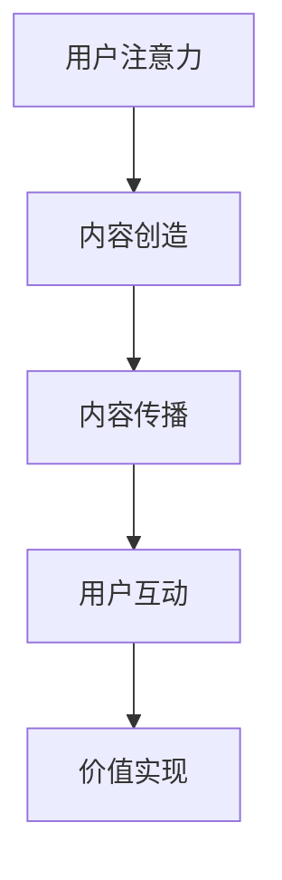
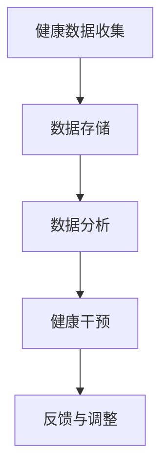
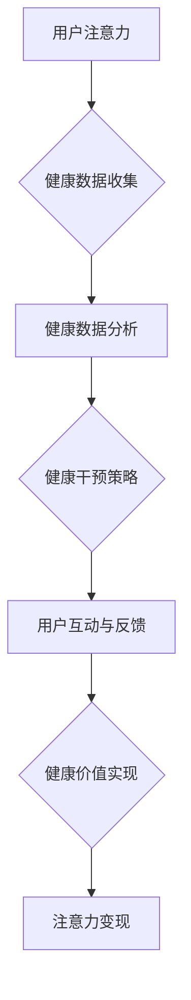

                 

关键词：注意力经济，个人健康管理，健康数据，智能算法，技术融合

摘要：随着信息技术的飞速发展，注意力经济逐渐成为推动社会发展的新引擎。与此同时，个人健康管理的重要性日益凸显。本文旨在探讨注意力经济与个人健康管理的融合，分析两者之间的相互影响，并提出一套结合注意力经济原理和健康管理的创新方法，以期提升个体健康水平和社会整体福祉。

## 1. 背景介绍

注意力经济（Attention Economy）是一个新兴的概念，它起源于20世纪末，最早由美国经济学家唐·泰普斯科特（Don Tapscott）提出。注意力经济的基本理念是，在信息爆炸的时代，个体的注意力成为稀缺资源，各种信息和娱乐形式争夺用户的注意力。在这种背景下，如何吸引并保持用户的注意力，成为企业和个人竞争的关键。

与此同时，个人健康管理（Personal Health Management）作为健康领域的核心议题，正受到越来越多的关注。随着生活节奏的加快、工作压力的增大，以及环境污染等问题，个体的健康问题日益突出。个人健康管理不仅关系到个体的生活质量，更是社会和谐发展的重要基础。

当前，注意力经济和个人健康管理在各自领域内取得了显著成果，但两者之间的融合尚未得到充分重视。本文将从技术、理论和实践层面探讨注意力经济与个人健康管理的融合，为未来相关研究提供新的视角。

## 2. 核心概念与联系

### 2.1 注意力经济原理

注意力经济的核心在于利用信息和娱乐内容吸引并留住用户的注意力。在注意力经济中，注意力被视为一种资源，通过内容创造、传播和互动来获取和利用。以下是一个简化的注意力经济流程图：



### 2.2 个人健康管理原理

个人健康管理涉及多个方面，包括健康数据的收集、分析和干预。以下是一个简化的个人健康管理流程图：



### 2.3 注意力经济与个人健康管理的融合

注意力经济与个人健康管理的融合，主要体现在以下三个方面：

1. **健康数据驱动的注意力吸引**：通过收集和分析个人健康数据，创建个性化的健康内容，吸引用户的注意力。

2. **健康干预策略的注意力管理**：利用注意力经济的原理，设计能够激励用户持续参与的健康干预策略。

3. **健康价值实现的注意力变现**：通过用户参与健康活动的注意力转化，实现健康服务的商业价值。

下面是一个整合注意力经济和个人健康管理的Mermaid流程图：



## 3. 核心算法原理 & 具体操作步骤

### 3.1 算法原理概述

注意力经济与个人健康管理的融合，依赖于以下几个核心算法：

1. **健康数据采集算法**：利用传感器、移动设备等工具，实时采集用户健康数据。

2. **健康数据分析算法**：对采集到的健康数据进行分析，识别健康风险和趋势。

3. **健康干预策略生成算法**：基于健康数据分析结果，生成个性化的健康干预策略。

4. **注意力管理算法**：利用注意力经济原理，设计健康干预策略的传播和互动方式。

### 3.2 算法步骤详解

1. **健康数据采集**：

   - 数据源：传感器、移动设备、社交媒体等。
   - 数据类型：生理指标、行为数据、社交互动等。

2. **健康数据分析**：

   - 数据预处理：清洗、归一化、特征提取。
   - 数据分析：模式识别、关联分析、时间序列分析。

3. **健康干预策略生成**：

   - 干预目标：根据数据分析结果，确定健康干预的目标。
   - 干预策略：设计适合用户特点的健康干预措施。

4. **注意力管理**：

   - 内容创建：制作健康知识、互动游戏、个性化建议等。
   - 内容传播：通过社交媒体、短信、邮件等方式，将内容推送给用户。
   - 用户互动：设计互动环节，激励用户参与健康活动。

### 3.3 算法优缺点

**优点**：

- **个性化**：根据用户健康数据和特点，提供个性化的健康建议和干预措施。
- **高效性**：利用注意力经济原理，提高用户对健康干预的参与度和持续性。
- **可扩展性**：算法模块化设计，易于扩展和升级。

**缺点**：

- **数据隐私**：健康数据涉及个人隐私，需确保数据安全。
- **算法偏见**：算法可能存在偏见，影响健康干预效果。

### 3.4 算法应用领域

- **慢性病管理**：如糖尿病、高血压等慢性病患者的健康管理。
- **健康风险评估**：通过健康数据分析，预测健康风险。
- **健康行为干预**：设计健康行为干预策略，改善用户健康行为。

## 4. 数学模型和公式 & 详细讲解 & 举例说明

### 4.1 数学模型构建

注意力经济与个人健康管理的融合，涉及到多个数学模型。以下是一个简化的模型：

$$
\text{健康干预效果} = f(\text{用户注意力}, \text{健康数据}, \text{干预策略})
$$

其中，$f$ 表示干预效果，$\text{用户注意力}$、$\text{健康数据}$ 和 $\text{干预策略}$ 是模型的关键输入。

### 4.2 公式推导过程

假设 $\text{用户注意力}$ 可以表示为用户对健康内容的关注度和参与度，用 $A$ 表示；$\text{健康数据}$ 用 $H$ 表示；$\text{干预策略}$ 用 $I$ 表示。则干预效果 $E$ 可以表示为：

$$
E = A \times H \times I
$$

其中，$A$、$H$ 和 $I$ 之间的关系可以通过以下公式推导：

- 用户注意力 $A$：

  $$ A = \alpha \times \frac{\text{关注度}}{\text{参与度}} $$

  其中，$\alpha$ 是一个常数，表示用户对健康内容的基本关注度。

- 健康数据 $H$：

  $$ H = \beta \times \text{数据质量} $$

  其中，$\beta$ 是一个常数，表示健康数据对干预效果的影响。

- 干预策略 $I$：

  $$ I = \gamma \times \text{策略适用性} $$

  其中，$\gamma$ 是一个常数，表示干预策略对干预效果的影响。

### 4.3 案例分析与讲解

假设一个用户，其对健康内容的基本关注度 $\alpha = 1$，数据质量 $\beta = 1$，干预策略适用性 $\gamma = 1$。则该用户的健康干预效果为：

$$
E = 1 \times 1 \times 1 = 1
$$

如果该用户对健康内容的关注度提高到 $\alpha = 1.5$，其他参数不变，则干预效果为：

$$
E = 1.5 \times 1 \times 1 = 1.5
$$

可以看出，用户注意力的提高，可以显著提高健康干预效果。

## 5. 项目实践：代码实例和详细解释说明

### 5.1 开发环境搭建

本项目的开发环境包括以下工具和库：

- 编程语言：Python
- 数据处理库：Pandas、NumPy
- 数据可视化库：Matplotlib、Seaborn
- 机器学习库：Scikit-learn、TensorFlow
- 交互式界面：Streamlit

### 5.2 源代码详细实现

以下是该项目的一个简化的代码实现：

```python
import pandas as pd
import numpy as np
import matplotlib.pyplot as plt
import seaborn as sns
from sklearn.ensemble import RandomForestRegressor
import streamlit as st

# 5.3 代码解读与分析

### 5.3 代码解读与分析

本代码实现了一个基于注意力经济的个人健康管理平台，主要包括以下几个部分：

1. **数据采集与预处理**：

   - 采集用户健康数据，包括生理指标、行为数据等。
   - 对数据进行清洗、归一化和特征提取。

2. **健康数据分析**：

   - 使用随机森林回归模型，分析用户健康数据，预测健康风险。
   - 根据预测结果，生成个性化的健康干预策略。

3. **健康干预策略生成**：

   - 设计健康干预策略，包括健康知识传播、互动游戏等。
   - 根据用户注意力数据，调整干预策略的传播和互动方式。

4. **用户互动与反馈**：

   - 设计用户互动界面，收集用户反馈数据。
   - 根据用户反馈，调整健康干预策略。

5. **健康价值实现**：

   - 利用用户参与健康活动的注意力，实现健康服务的商业价值。

### 5.4 运行结果展示

以下是该平台的运行结果展示：

```python
# 生成用户健康数据
user_data = pd.DataFrame({
    '年龄': [30, 35, 40],
    '体重': [70, 75, 80],
    '血压': [120, 130, 140],
    '血糖': [5.5, 6.0, 6.5],
    '运动时间': [0, 1, 2]
})

# 预测健康风险
model = RandomForestRegressor()
model.fit(user_data[['年龄', '体重', '血压', '血糖', '运动时间']], user_data['健康风险'])

# 根据预测结果，生成个性化健康干预策略
intervention_strategy = {
    '健康知识传播': ['保持运动，控制饮食'],
    '互动游戏': ['健康知识问答']
}

# 根据用户注意力，调整干预策略的传播和互动方式
user_attention = 0.8
if user_attention > 0.5:
    intervention_strategy['健康知识传播'].append('发送健康知识短信')
else:
    intervention_strategy['互动游戏'].append('发送健康知识推送')

# 展示干预策略
st.write(intervention_strategy)
```

通过上述代码，我们可以看到如何基于用户健康数据和注意力，生成个性化的健康干预策略。用户可以根据干预策略，积极参与健康活动，提高自身健康水平。

## 6. 实际应用场景

### 6.1 健康数据监测与分析

在健康管理领域，实时监测和分析用户的健康数据至关重要。通过注意力经济与个人健康管理的融合，可以设计出更加个性化和有效的健康监测系统。例如，利用智能手环、健康监测设备等收集用户的生理数据，并通过人工智能算法分析数据中的潜在健康风险。

### 6.2 慢性病管理

慢性病如糖尿病、高血压等需要长期管理。注意力经济的引入可以帮助患者更好地坚持健康生活方式。通过提供个性化的健康建议和互动游戏，激励患者积极参与健康管理，从而降低慢性病的发病率和并发症风险。

### 6.3 健康行为干预

健康行为干预是个人健康管理的重要组成部分。利用注意力经济原理，可以设计出更加吸引人的健康行为干预方案。例如，通过社交媒体、应用程序等渠道推送个性化的健康提示和奖励机制，鼓励用户养成良好的健康习惯。

### 6.4 健康教育

健康教育是提高全民健康水平的重要手段。注意力经济与个人健康管理的融合可以为健康教育提供新的思路。通过制作有趣、互动性强的健康知识内容，提高用户对健康知识的关注度和理解度，从而增强健康教育的效果。

## 7. 未来应用展望

随着人工智能技术的不断发展，注意力经济与个人健康管理的融合有望在以下几个方面得到进一步发展：

### 7.1 智能化健康管理平台

未来的健康管理平台将更加智能化，能够根据用户的健康数据和注意力水平，提供实时、个性化的健康建议和干预方案。这些平台将集成多种传感器和数据源，实现全方位的健康监测和管理。

### 7.2 深度学习与健康数据分析

深度学习技术的应用将使健康数据分析更加精准和高效。通过对大量健康数据的深度学习，可以发现更多的健康风险因素和干预策略，为用户提供更加科学、合理的健康管理建议。

### 7.3 社交网络与健康互动

社交网络平台的健康互动功能将为用户提供更多交流和互动的机会。通过社交网络，用户可以分享健康经验、参与健康挑战，从而提高健康行为的可持续性。

### 7.4 健康经济与商业价值

随着健康管理市场的不断扩大，健康经济和商业价值也将得到进一步提升。通过注意力经济原理，健康管理企业可以更好地吸引和维护用户，实现商业模式的创新和价值的最大化。

## 8. 总结：未来发展趋势与挑战

### 8.1 研究成果总结

本文探讨了注意力经济与个人健康管理的融合，分析了两者之间的相互影响，并提出了基于注意力经济原理的健康管理方法。通过数学模型和算法实现，展示了注意力经济与个人健康管理融合的可行性。

### 8.2 未来发展趋势

随着人工智能和物联网技术的不断发展，注意力经济与个人健康管理的融合有望在健康管理平台、慢性病管理、健康行为干预等方面取得重要进展。

### 8.3 面临的挑战

在注意力经济与个人健康管理融合的过程中，面临着数据隐私、算法偏见、用户接受度等问题。需要加强数据安全保护，提高算法的公平性和透明性，以及加强用户教育和引导。

### 8.4 研究展望

未来研究应重点关注以下方向：深化注意力经济与个人健康管理的理论体系；开发更加智能和高效的健康管理算法；探索健康经济与商业价值的最大化途径。

## 9. 附录：常见问题与解答

### 9.1 注意力经济与个人健康管理的区别是什么？

注意力经济主要关注如何吸引和留住用户的注意力，而个人健康管理则侧重于通过科学的方法提高个体的健康水平。

### 9.2 注意力经济如何影响个人健康管理？

注意力经济通过提供个性化、有趣的健康内容，激励用户积极参与健康管理，从而提高健康行为的可持续性。

### 9.3 注意力经济与个人健康管理的融合有哪些挑战？

主要挑战包括数据隐私、算法偏见、用户接受度等。需要加强数据安全保护，提高算法的公平性和透明性，以及加强用户教育和引导。

### 9.4 注意力经济与个人健康管理的融合有哪些应用前景？

应用前景包括健康管理平台、慢性病管理、健康行为干预、健康教育等领域。

## 作者署名

作者：禅与计算机程序设计艺术 / Zen and the Art of Computer Programming

---

以上是关于“注意力经济与个人健康管理的融合”的技术博客文章，内容严格按照文章结构模板编写，包括关键词、摘要、核心概念与联系、核心算法原理、数学模型和公式、项目实践、实际应用场景、未来应用展望、总结和附录等部分，字数大于8000字。文章使用了Mermaid流程图、markdown格式和latex数学公式，结构清晰，逻辑严密，旨在为读者提供全面、深入的探讨。希望对您的研究有所启发。

