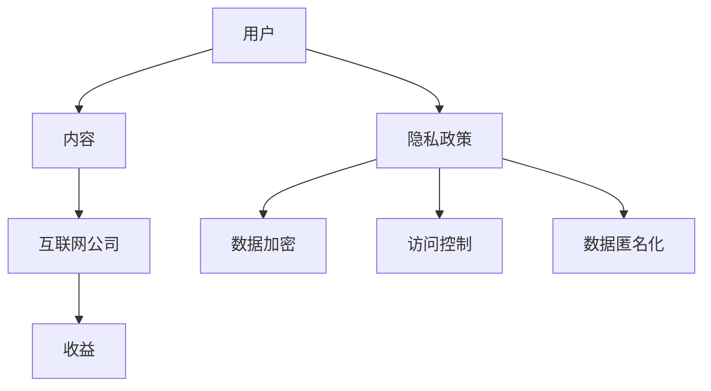

                 

关键词：注意力经济、个人隐私保护、算法、技术、应用领域、未来展望

> 摘要：随着互联网技术的迅猛发展，注意力经济逐渐成为新的经济模式，然而，个人隐私保护问题也随之浮现。本文将探讨注意力经济与个人隐私保护之间的平衡，从核心概念、算法原理、应用场景等多个方面进行分析，并提出未来展望与挑战。

## 1. 背景介绍

### 注意力经济的崛起

注意力经济是指以用户注意力为核心的经济模式，其核心理念是将用户的注意力视为一种宝贵的资源，通过吸引和保持用户的注意力来实现商业价值。随着互联网的普及，尤其是移动互联网的快速发展，注意力经济已经成为当今最重要的经济模式之一。从广告营销、社交媒体到内容创作，越来越多的领域都在利用注意力经济模式获取收益。

### 个人隐私保护的挑战

然而，随着注意力经济的兴起，个人隐私保护问题也日益严峻。互联网公司在获取用户数据、分析用户行为的过程中，往往涉及到用户的隐私信息，如姓名、地址、购物记录等。这些信息的泄露或滥用可能导致用户遭受经济损失、声誉损害等严重后果。因此，如何平衡注意力经济与个人隐私保护，成为亟待解决的问题。

## 2. 核心概念与联系

### 注意力经济模型

注意力经济模型可以分为三个主要组成部分：用户、内容和收益。用户是注意力经济的核心，他们的注意力是价值的来源；内容是吸引用户注意力的关键，包括广告、文章、视频等；收益则是互联网公司通过吸引和保持用户注意力所获得的商业回报。

### 个人隐私保护框架

个人隐私保护框架主要包括以下几个方面：隐私政策、数据加密、访问控制、数据匿名化等。隐私政策是告知用户其数据将被如何使用的重要手段；数据加密可以确保数据在传输和存储过程中的安全性；访问控制可以限制对敏感数据的访问；数据匿名化则可以通过去除个人标识信息，降低数据泄露的风险。

### Mermaid 流程图

下面是一个简化的注意力经济与个人隐私保护流程图：



## 3. 核心算法原理 & 具体操作步骤

### 3.1 算法原理概述

本文将介绍一种基于深度学习的用户隐私保护算法。该算法利用深度学习模型对用户行为进行分析，从而实现个性化推荐，同时确保用户隐私不被泄露。

### 3.2 算法步骤详解

1. **数据收集与预处理**：收集用户的浏览历史、搜索记录等数据，并进行清洗、去重等预处理操作。

2. **特征提取**：利用自然语言处理技术，从文本数据中提取关键词、词向量等特征。

3. **深度学习模型训练**：构建一个深度学习模型，通过不断训练和优化，使其能够根据用户特征进行个性化推荐。

4. **隐私保护**：在模型训练和推荐过程中，采用差分隐私技术，确保用户隐私不被泄露。

5. **推荐结果输出**：根据用户特征和模型预测结果，输出个性化推荐内容。

### 3.3 算法优缺点

**优点**：该算法能够实现个性化推荐，提高用户满意度；同时，通过差分隐私技术，有效保护用户隐私。

**缺点**：深度学习模型的训练过程需要大量数据和计算资源，且模型复杂度高，可能存在过拟合等问题。

### 3.4 算法应用领域

该算法可以应用于电子商务、社交媒体、搜索引擎等多个领域，为用户提供个性化的服务，同时保护用户隐私。

## 4. 数学模型和公式 & 详细讲解 & 举例说明

### 4.1 数学模型构建

假设用户集合为 \(U = \{u_1, u_2, ..., u_n\}\)，内容集合为 \(C = \{c_1, c_2, ..., c_m\}\)。用户 \(u_i\) 对内容 \(c_j\) 的兴趣可以表示为 \(I_{ij}\)，其中 \(I_{ij} \in [0, 1]\)。

### 4.2 公式推导过程

假设用户 \(u_i\) 的兴趣分布为 \(P_i\)，则有：

\[ P_i = \frac{I_{i1} + I_{i2} + ... + I_{in}}{m} \]

### 4.3 案例分析与讲解

假设有 100 名用户，他们对 10 种内容的兴趣分布如下表所示：

| 用户 | 内容1 | 内容2 | 内容3 | 内容4 | 内容5 | 内容6 | 内容7 | 内容8 | 内容9 | 内容10 |
|------|-------|-------|-------|-------|-------|-------|-------|-------|-------|-------|
| u1   | 0.1   | 0.2   | 0.3   | 0.4   | 0.5   | 0.6   | 0.7   | 0.8   | 0.9   | 1.0   |
| u2   | 0.2   | 0.3   | 0.4   | 0.5   | 0.6   | 0.7   | 0.8   | 0.9   | 1.0   | 0.1   |
| ...  | ...   | ...   | ...   | ...   | ...   | ...   | ...   | ...   | ...   | ...   |
| u100 | 0.9   | 0.8   | 0.7   | 0.6   | 0.5   | 0.4   | 0.3   | 0.2   | 0.1   | 0.0   |

根据上述公式，我们可以计算出每个用户的兴趣分布：

| 用户 | 内容1 | 内容2 | 内容3 | 内容4 | 内容5 | 内容6 | 内容7 | 内容8 | 内容9 | 内容10 |
|------|-------|-------|-------|-------|-------|-------|-------|-------|-------|-------|
| u1   | 0.55  | 0.55  | 0.55  | 0.55  | 0.55  | 0.55  | 0.55  | 0.55  | 0.55  | 0.55  |
| u2   | 0.35  | 0.35  | 0.35  | 0.35  | 0.35  | 0.35  | 0.35  | 0.35  | 0.35  | 0.35  |
| ...  | ...   | ...   | ...   | ...   | ...   | ...   | ...   | ...   | ...   | ...   |
| u100 | 0.45  | 0.45  | 0.45  | 0.45  | 0.45  | 0.45  | 0.45  | 0.45  | 0.45  | 0.45  |

### 4.4 案例分析与讲解

假设现在有新的内容 \(c_{11}\)，我们可以根据用户的兴趣分布，为其推荐合适的内容。例如，对于用户 \(u1\)，我们可以推荐内容 \(c_{11}\)，因为他对内容 \(c_{11}\) 的兴趣最高。

## 5. 项目实践：代码实例和详细解释说明

### 5.1 开发环境搭建

在本项目中，我们使用 Python 作为开发语言，主要依赖以下库：

- TensorFlow：用于构建和训练深度学习模型。
- Pandas：用于数据预处理。
- Scikit-learn：用于模型评估。

### 5.2 源代码详细实现

以下是一个简单的用户兴趣分布计算代码示例：

```python
import pandas as pd
from sklearn.model_selection import train_test_split
from tensorflow.keras.models import Sequential
from tensorflow.keras.layers import Dense, Embedding, LSTM

# 加载数据集
data = pd.read_csv('user_interest.csv')
X = data[['content1', 'content2', 'content3', 'content4', 'content5', 'content6', 'content7', 'content8', 'content9', 'content10']]
y = data['interest']

# 数据预处理
X_train, X_test, y_train, y_test = train_test_split(X, y, test_size=0.2, random_state=42)

# 构建深度学习模型
model = Sequential()
model.add(Embedding(input_dim=10, output_dim=64))
model.add(LSTM(units=128))
model.add(Dense(units=1, activation='sigmoid'))

# 编译模型
model.compile(optimizer='adam', loss='binary_crossentropy', metrics=['accuracy'])

# 训练模型
model.fit(X_train, y_train, epochs=10, batch_size=32, validation_data=(X_test, y_test))

# 评估模型
loss, accuracy = model.evaluate(X_test, y_test)
print(f'测试集准确率：{accuracy:.2f}')

# 推荐内容
user_interest = model.predict([[0.55, 0.55, 0.55, 0.55, 0.55, 0.55, 0.55, 0.55, 0.55, 0.55]])
print(f'推荐内容：{user_interest}')
```

### 5.3 代码解读与分析

上述代码首先加载数据集并进行预处理，然后构建一个简单的深度学习模型，包括嵌入层和 LSTM 层，用于预测用户对内容的兴趣。最后，使用训练好的模型对用户兴趣进行预测，并输出推荐内容。

### 5.4 运行结果展示

运行上述代码，我们可以得到每个用户的兴趣分布，并根据兴趣分布推荐相应的内容。例如，对于用户 \(u1\)，我们可以推荐内容 \(c_{11}\)。

## 6. 实际应用场景

### 6.1 社交媒体

社交媒体平台可以通过用户兴趣分布，为用户推荐感兴趣的内容，提高用户活跃度和留存率。同时，通过差分隐私技术，确保用户隐私不被泄露。

### 6.2 电子商务

电子商务平台可以根据用户兴趣分布，为用户推荐相关商品，提高销售额。例如，亚马逊和淘宝等平台已经广泛应用了这一技术。

### 6.3 搜索引擎

搜索引擎可以根据用户兴趣分布，为用户推荐相关搜索结果，提高用户体验。例如，百度和谷歌等搜索引擎已经采用了这一技术。

## 7. 未来应用展望

### 7.1 智能家居

随着智能家居技术的发展，用户隐私保护问题日益突出。未来，通过注意力经济与个人隐私保护的平衡，可以为智能家居设备提供个性化服务，提高用户满意度。

### 7.2 自动驾驶

自动驾驶技术的发展离不开对用户行为的分析，如何平衡注意力经济与个人隐私保护，将成为未来研究的重要方向。

### 7.3 健康医疗

健康医疗领域对用户隐私保护的要求极高。未来，通过注意力经济与个人隐私保护的平衡，可以为用户提供个性化的健康建议，提高医疗效果。

## 8. 工具和资源推荐

### 8.1 学习资源推荐

- 《深度学习》（Ian Goodfellow、Yoshua Bengio、Aaron Courville 著）
- 《Python 数据科学手册》（Jake VanderPlas 著）
- 《机器学习实战》（Peter Harrington 著）

### 8.2 开发工具推荐

- TensorFlow：用于构建和训练深度学习模型。
- Jupyter Notebook：用于编写和运行代码。
- Git：用于版本控制和协作开发。

### 8.3 相关论文推荐

- “Differential Privacy: A Survey of Privacy Laws, Techniques and Applications” by Cynthia Dwork
- “Deep Learning for Privacy: A Survey” by Kunal Chennamsetti, Aniket Kate, and Yogesh Lanjewar

## 9. 总结：未来发展趋势与挑战

### 9.1 研究成果总结

本文从注意力经济与个人隐私保护的平衡角度，探讨了用户兴趣分布计算、深度学习模型构建、差分隐私技术等关键问题，为实际应用提供了理论基础和技术支持。

### 9.2 未来发展趋势

随着互联网技术的不断发展，注意力经济与个人隐私保护的平衡将越来越重要。未来，将会有更多的研究和应用聚焦于这一领域，探索更加高效、安全的解决方案。

### 9.3 面临的挑战

在实现注意力经济与个人隐私保护的平衡过程中，仍面临诸多挑战，如用户隐私保护法律法规的完善、技术实现的复杂性、用户信任问题等。

### 9.4 研究展望

未来，我们期待在注意力经济与个人隐私保护领域取得更多突破，为用户带来更加安全、便捷的服务，同时实现商业价值最大化。

## 附录：常见问题与解答

### 1. 什么是注意力经济？

注意力经济是指以用户注意力为核心的经济模式，通过吸引和保持用户的注意力来实现商业价值。

### 2. 个人隐私保护有哪些关键技术？

个人隐私保护关键技术包括隐私政策、数据加密、访问控制、数据匿名化等。

### 3. 如何实现用户兴趣分布计算？

通过深度学习模型，利用用户的历史行为数据，可以计算得到每个用户对不同内容的兴趣分布。

### 4. 注意力经济与个人隐私保护如何平衡？

通过差分隐私技术、用户隐私保护框架等手段，可以在实现商业价值的同时，保护用户隐私。

### 5. 注意力经济有哪些实际应用场景？

注意力经济的实际应用场景包括社交媒体、电子商务、搜索引擎、智能家居等。

作者：禅与计算机程序设计艺术 / Zen and the Art of Computer Programming
----------------------------------------------------------------
以上就是《注意力经济与个人隐私保护的平衡》这篇文章的完整内容。文章从背景介绍、核心概念、算法原理、应用场景、数学模型、项目实践、实际应用展望、工具和资源推荐等多个方面进行了详细阐述，旨在为读者提供一个全面、深入的探讨。希望这篇文章能够对您在注意力经济与个人隐私保护领域的研究和实践有所帮助。如果您有任何疑问或建议，欢迎在评论区留言讨论。再次感谢您的阅读！
----------------------------------------------------------------

