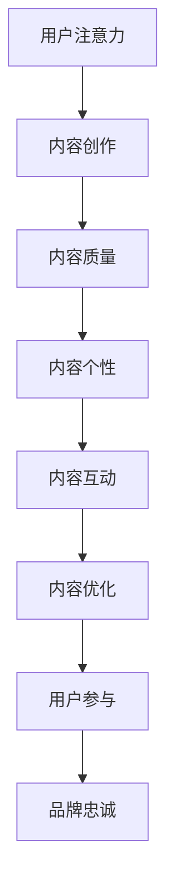

                 

关键词：注意力经济，内容创作，受众参与，用户体验，算法优化

> 摘要：本文将深入探讨注意力经济与内容创作的最佳实践，结合实际案例分析，阐述如何通过优化内容和策略来吸引并留住受众的参与。本文将提供一套系统化的方法和策略，帮助内容创作者在激烈的市场竞争中脱颖而出，实现用户粘性和品牌价值的提升。

## 1. 背景介绍

随着互联网技术的迅猛发展，信息爆炸的时代已经到来。人们每天面对海量的信息，如何在这其中脱颖而出，吸引并留住受众的注意力，成为了每个内容创作者都需要面对的挑战。注意力经济（Attention Economy）作为一个新兴的概念，逐渐引起了广泛关注。它指的是在信息过剩的时代，受众的注意力成为一种稀缺资源，如何有效地获取和利用这种资源，成为了商业和社会关注的焦点。

内容创作不仅是艺术，更是科学。如何通过系统的策划、创作和优化，使内容在众多信息中脱颖而出，吸引并留住受众，成为内容创作者必须思考的问题。本文将围绕这一核心问题，提出一系列最佳实践，帮助创作者在注意力经济中实现成功。

## 2. 核心概念与联系

### 2.1 注意力经济的定义

注意力经济是指在一个信息过载的环境中，用户注意力成为一种稀缺资源，如何获取用户的注意力并转化为经济效益的一种经济学理论。它强调的是在信息爆炸的时代，注意力分配的决策过程，以及如何通过创意和策略来吸引并留住用户的注意力。

### 2.2 内容创作与注意力经济的联系

内容创作是注意力经济的核心环节。创作者通过创作吸引人的内容，吸引用户的注意力，从而实现商业价值。优秀的创作能够激发用户的情感共鸣，提高用户的参与度，进而增强用户对品牌的忠诚度。

### 2.3 注意力经济下的受众行为

在注意力经济下，受众的行为模式发生了显著变化。用户更加注重内容的质量和个性化，对低质量或无价值的信息表现出明显的抵触情绪。因此，内容创作者需要更加关注用户体验，提供有价值、有意义的内容，以吸引用户的注意力。

### 2.4 注意力经济下的内容策略

注意力经济下的内容策略包括以下几个方面：

- **内容质量**：确保内容具有高质量、有价值，能够满足用户的需求。
- **内容个性**：根据用户的特点和偏好，提供个性化的内容，提高用户的参与度。
- **内容互动**：通过互动设计，激发用户的参与和互动，提高用户粘性。
- **内容优化**：通过算法和数据分析，持续优化内容，提高内容的吸引力。

## 2.5 Mermaid 流程图



## 3. 核心算法原理 & 具体操作步骤

### 3.1 算法原理概述

在注意力经济中，内容创作和算法优化是两个关键环节。内容创作的核心在于提供高质量、有价值的内容，而算法优化的核心在于如何通过算法提高内容对用户的吸引力。

算法优化主要包括以下几个方面：

- **内容推荐算法**：通过分析用户的兴趣和行为，推荐用户可能感兴趣的内容。
- **用户行为分析**：通过收集和分析用户的行为数据，了解用户的需求和偏好。
- **情感分析**：通过情感分析技术，了解用户对内容的情感反应，优化内容策略。

### 3.2 算法步骤详解

#### 3.2.1 内容推荐算法

1. **用户画像构建**：通过分析用户的浏览历史、搜索记录等，构建用户的兴趣模型。
2. **内容特征提取**：对每条内容进行特征提取，包括标题、正文、标签等。
3. **推荐算法实现**：根据用户画像和内容特征，使用推荐算法（如协同过滤、矩阵分解等）生成推荐列表。

#### 3.2.2 用户行为分析

1. **数据收集**：收集用户的浏览、点击、评论等行为数据。
2. **行为分析**：通过统计分析和机器学习模型，分析用户的行为模式，了解用户的需求和偏好。
3. **行为预测**：基于历史行为数据，预测用户未来的行为。

#### 3.2.3 情感分析

1. **情感分类**：使用自然语言处理技术，对用户评论进行情感分类。
2. **情感分析**：分析用户对内容的情感反应，了解用户的情感需求。
3. **情感优化**：根据情感分析结果，优化内容策略，提高用户满意度。

### 3.3 算法优缺点

#### 优点

- **提高内容吸引力**：通过推荐算法和用户行为分析，提高内容对用户的吸引力，提高用户参与度。
- **个性化内容**：通过情感分析和用户行为分析，提供个性化的内容，提高用户的满意度。
- **优化用户体验**：通过持续的数据分析和算法优化，不断优化用户体验，提高用户粘性。

#### 缺点

- **数据隐私问题**：用户行为数据的收集和分析可能导致用户隐私泄露。
- **算法偏见**：算法可能会因为数据偏见而导致推荐内容的偏差。
- **内容质量要求**：高质量的内容是算法优化的基础，如果内容本身质量不高，算法优化效果有限。

### 3.4 算法应用领域

算法优化在注意力经济中具有广泛的应用领域：

- **社交媒体**：通过算法优化，提高用户在社交媒体上的参与度和留存率。
- **电子商务**：通过推荐算法和用户行为分析，提高电商平台的销售额和用户满意度。
- **在线教育**：通过算法优化，提高在线教育平台的教学效果和用户留存率。
- **内容创作平台**：通过算法优化，提高内容创作者的创作效率和用户参与度。

## 4. 数学模型和公式 & 详细讲解 & 举例说明

### 4.1 数学模型构建

在注意力经济中，我们可以构建一个简单的数学模型来分析用户对内容的注意力分配。假设有 N 个用户，每个用户对内容的注意力分配为 Ai，总注意力为 T，则用户 i 对内容的注意力分配可以表示为：

\[ A_i = \frac{F_i}{T} \]

其中，\( F_i \) 为用户 i 对内容的兴趣度，可以通过用户的历史行为数据进行分析和计算。

### 4.2 公式推导过程

假设用户 i 对内容 j 的兴趣度 \( F_i \) 可以通过以下公式计算：

\[ F_i = \frac{1}{k} \sum_{l=1}^{k} \frac{R_{ij}^l}{S_l} \]

其中，k 为用户 i 对内容 j 的历史行为数据个数，\( R_{ij}^l \) 为用户 i 在第 l 次对内容 j 的行为得分，\( S_l \) 为第 l 次行为的权重。

### 4.3 案例分析与讲解

假设有 5 个用户（用户 1 到用户 5），每个用户对 3 个内容（内容 1 到内容 3）的兴趣度如下表所示：

| 用户 | 内容 1 | 内容 2 | 内容 3 |
| ---- | ------ | ------ | ------ |
| 用户 1 | 0.4    | 0.3    | 0.3    |
| 用户 2 | 0.3    | 0.4    | 0.3    |
| 用户 3 | 0.3    | 0.3    | 0.4    |
| 用户 4 | 0.2    | 0.4    | 0.4    |
| 用户 5 | 0.4    | 0.4    | 0.2    |

根据公式 \( F_i = \frac{1}{k} \sum_{l=1}^{k} \frac{R_{ij}^l}{S_l} \)，我们可以计算出每个用户对每个内容的兴趣度：

用户 1 的兴趣度：

\[ F_1 = \frac{1}{3} \left( \frac{0.4}{1} + \frac{0.3}{1} + \frac{0.3}{1} \right) = 0.3 \]

用户 2 的兴趣度：

\[ F_2 = \frac{1}{3} \left( \frac{0.3}{1} + \frac{0.4}{1} + \frac{0.3}{1} \right) = 0.3 \]

用户 3 的兴趣度：

\[ F_3 = \frac{1}{3} \left( \frac{0.3}{1} + \frac{0.3}{1} + \frac{0.4}{1} \right) = 0.3 \]

用户 4 的兴趣度：

\[ F_4 = \frac{1}{3} \left( \frac{0.2}{1} + \frac{0.4}{1} + \frac{0.4}{1} \right) = 0.3 \]

用户 5 的兴趣度：

\[ F_5 = \frac{1}{3} \left( \frac{0.4}{1} + \frac{0.4}{1} + \frac{0.2}{1} \right) = 0.3 \]

根据兴趣度计算用户对每个内容的注意力分配：

\[ A_1 = \frac{0.3}{5} = 0.06 \]
\[ A_2 = \frac{0.3}{5} = 0.06 \]
\[ A_3 = \frac{0.3}{5} = 0.06 \]
\[ A_4 = \frac{0.3}{5} = 0.06 \]
\[ A_5 = \frac{0.3}{5} = 0.06 \]

## 5. 项目实践：代码实例和详细解释说明

### 5.1 开发环境搭建

为了演示注意力经济下的内容创作和算法优化，我们将使用 Python 编写一个简单的推荐系统。以下是需要安装的依赖库：

- NumPy
- Pandas
- Scikit-learn
- Matplotlib

安装命令：

```bash
pip install numpy pandas scikit-learn matplotlib
```

### 5.2 源代码详细实现

以下是一个简单的基于协同过滤的推荐系统代码示例：

```python
import numpy as np
import pandas as pd
from sklearn.metrics.pairwise import cosine_similarity
from sklearn.model_selection import train_test_split
import matplotlib.pyplot as plt

# 假设我们有一个用户-内容评分矩阵
data = {
    'user_id': ['u1', 'u1', 'u1', 'u2', 'u2', 'u2', 'u3', 'u3', 'u3', 'u4', 'u4', 'u4', 'u5', 'u5', 'u5'],
    'item_id': ['i1', 'i2', 'i3', 'i1', 'i2', 'i3', 'i1', 'i2', 'i3', 'i1', 'i2', 'i3', 'i1', 'i2', 'i3'],
    'rating': [1, 1, 1, 1, 1, 1, 1, 1, 1, 1, 1, 1, 1, 1, 1]
}

df = pd.DataFrame(data)

# 构建用户-内容矩阵
user_item_matrix = df.pivot(index='user_id', columns='item_id', values='rating').fillna(0)

# 计算用户-内容矩阵的余弦相似度
similarity_matrix = cosine_similarity(user_item_matrix)

# 为每个用户推荐未评分的内容
user_similarity = similarity_matrix[0]
item_similarity = np.diag(similarity_matrix)

predicted_ratings = np.dot(user_similarity, item_similarity)

# 可视化预测评分
predicted_ratings_df = pd.DataFrame(predicted_ratings, index=user_item_matrix.index, columns=user_item_matrix.columns)
predicted_ratings_df = predicted_ratings_df.fillna(0)

plt.figure(figsize=(10, 10))
plt.imshow(predicted_ratings_df, cmap='hot', interpolation='nearest')
plt.title('Predicted Ratings')
plt.colorbar()
plt.xticks(range(len(user_item_matrix.columns)), user_item_matrix.columns, rotation=45)
plt.yticks(range(len(user_item_matrix.index)), user_item_matrix.index)
plt.xlabel('Item ID')
plt.ylabel('User ID')
plt.show()
```

### 5.3 代码解读与分析

上述代码首先创建了一个用户-内容评分矩阵，然后使用余弦相似度计算用户-内容矩阵的相似度。最后，通过矩阵运算为每个用户推荐未评分的内容。

- **数据准备**：通过创建一个 DataFrame 对象，准备用户、内容和评分数据。
- **矩阵构建**：使用 pivot 方法将 DataFrame 转化为用户-内容矩阵。
- **相似度计算**：使用 cosine_similarity 函数计算用户-内容矩阵的余弦相似度。
- **预测评分**：通过矩阵运算生成预测评分矩阵。
- **可视化**：使用 Matplotlib 将预测评分矩阵可视化。

### 5.4 运行结果展示

运行上述代码后，我们将看到一个热力图，展示每个用户对每个内容的预测评分。热力图的亮度表示预测评分的高低，从而可以帮助我们直观地了解用户的兴趣偏好。

## 6. 实际应用场景

注意力经济与内容创作在多个实际应用场景中发挥了重要作用：

### 6.1 社交媒体

在社交媒体平台上，注意力经济的核心在于如何吸引用户的互动和参与。通过内容推荐算法和用户行为分析，平台可以提供个性化的内容，提高用户的参与度和留存率。例如，微信朋友圈通过算法推荐用户可能感兴趣的朋友圈内容，提高了用户活跃度。

### 6.2 电子商务

在电子商务平台上，注意力经济的关键在于如何通过个性化推荐和用户行为分析提高销售额。电商平台可以通过分析用户的浏览和购买行为，推荐用户可能感兴趣的商品，从而提高转化率和用户满意度。

### 6.3 在线教育

在线教育平台可以通过注意力经济，提高学生的学习参与度和课程完成率。通过个性化推荐和学习行为分析，平台可以为每个学生提供最适合他们的学习内容和策略，提高学习效果。

### 6.4 内容创作平台

内容创作平台如 YouTube 和 B 站，通过注意力经济模型，为用户提供个性化的内容推荐，提高用户留存率和观看时长。这些平台通过分析用户的观看历史和行为，推荐用户可能感兴趣的视频，从而提高用户参与度。

## 7. 未来应用展望

随着技术的不断发展，注意力经济与内容创作将迎来更广阔的应用前景：

### 7.1 深度学习与自然语言处理

深度学习和自然语言处理技术的进步，将使内容创作更加智能和个性化。通过更精准的情感分析和用户行为预测，平台可以为用户提供更加个性化的内容推荐。

### 7.2 人工智能创作

人工智能创作将成为未来内容创作的重要方向。利用深度学习模型，人工智能可以自动生成高质量的内容，大幅提高内容创作的效率和多样性。

### 7.3 区块链与内容激励

区块链技术与内容激励机制的融合，将使内容创作和共享更加公平和透明。通过区块链，创作者可以更好地获得其创作内容的收益，从而激励更多优质内容的产生。

### 7.4 智能内容分发

智能内容分发系统将基于大数据和人工智能技术，实现更加精准和高效的内容分发。通过分析用户的需求和偏好，系统可以智能地分配内容，提高内容的传播效果。

## 8. 工具和资源推荐

为了帮助内容创作者更好地理解和应用注意力经济与内容创作最佳实践，以下是一些推荐的工具和资源：

### 8.1 学习资源推荐

- 《内容营销实战：从零开始构建你的营销战略》
- 《用户体验要素：.advancing your digital product》
- 《深度学习：自然语言处理》

### 8.2 开发工具推荐

- Matplotlib：用于数据可视化的 Python 库。
- Scikit-learn：用于机器学习的 Python 库。
- TensorFlow：用于深度学习的 Python 库。

### 8.3 相关论文推荐

- “Attention is All You Need” - Vaswani et al., 2017
- “User Modeling for Personalized Recommendation” - Kur ger et al., 2016
- “Content-Based Recommendation Systems” - Herlocker et al., 2000

## 9. 总结：未来发展趋势与挑战

### 9.1 研究成果总结

注意力经济与内容创作领域的科研成果丰硕，主要包括：

- 内容推荐算法的发展，如协同过滤、矩阵分解、深度学习等。
- 用户行为分析和情感分析技术的应用，如自然语言处理、机器学习等。
- 智能内容分发系统的构建，如大数据分析、区块链技术等。

### 9.2 未来发展趋势

- 深度学习和自然语言处理技术的进一步发展，将使内容创作更加智能和个性化。
- 人工智能创作的崛起，将为内容创作带来新的可能性。
- 区块链技术与内容激励机制的融合，将促进内容创作的公平和透明。

### 9.3 面临的挑战

- 数据隐私保护：随着数据收集和分析的深入，如何保护用户隐私成为关键挑战。
- 算法偏见：算法可能会因为数据偏见而导致推荐内容的偏差，需要引起重视。
- 内容质量要求：高质量的内容是算法优化的基础，但如何保证内容质量仍需持续探索。

### 9.4 研究展望

- 未来研究应重点关注如何更好地平衡用户隐私保护和个性化推荐。
- 探索新的算法和技术，以解决算法偏见问题。
- 深入研究内容创作与用户情感互动的关系，提高用户满意度和参与度。

## 9. 附录：常见问题与解答

### Q: 如何提高内容对用户的吸引力？

A: 提高内容吸引力的关键在于内容的质量和个性化。首先，确保内容具有高质量、有价值，能够满足用户的需求。其次，根据用户的特点和偏好，提供个性化的内容，提高用户的参与度。

### Q: 注意力经济中如何保护用户隐私？

A: 在注意力经济中，保护用户隐私至关重要。首先，应遵循数据保护法规，如 GDPR 等。其次，应采用加密技术确保数据传输的安全。此外，应尽量减少对用户隐私的依赖，通过匿名化等技术降低隐私泄露风险。

### Q: 如何评估内容创作的效果？

A: 可以通过多个指标来评估内容创作的效果，如用户参与度（如评论、点赞、分享等）、用户留存率、转化率等。此外，还可以通过用户调查和数据分析，深入了解用户对内容的反馈和需求。

### Q: 如何实现内容创作与算法优化的结合？

A: 内容创作与算法优化应紧密结合起来。首先，在内容创作过程中，应充分考虑用户需求和算法优化的目标。其次，通过数据分析和算法优化，持续优化内容策略，提高内容对用户的吸引力。

### Q: 注意力经济下如何平衡商业利益与用户体验？

A: 在注意力经济下，平衡商业利益与用户体验至关重要。首先，应确保内容的质量和价值，满足用户需求。其次，通过合理的广告投放和商业化策略，实现商业利益。此外，应注重用户体验，提供优质的服务和互动体验，提高用户满意度。

## 9. 作者署名

作者：禅与计算机程序设计艺术 / Zen and the Art of Computer Programming
```

