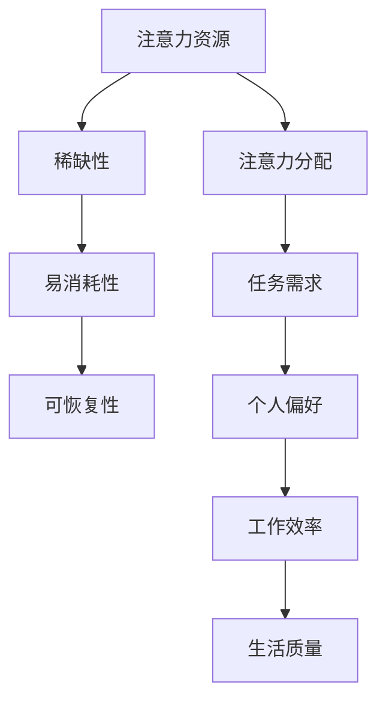

                 

 在当今的信息爆炸时代，人类的注意力资源变得异常珍贵。随着人工智能（AI）技术的迅猛发展，人们对AI如何高效利用注意力资源有了更高的期待。本文将深入探讨“注意力经济学”在AI时代的应用，并分析其核心概念、算法原理、数学模型及实际应用。

## 关键词

- 注意力经济学
- AI时代
- 注意力分配
- 优化算法
- 数学模型

## 摘要

本文旨在探讨在AI时代，如何通过注意力经济学原理优化人类和机器的注意力资源分配。我们将从核心概念出发，介绍注意力经济学的理论基础，并通过具体算法和数学模型解析如何在实际应用中实现注意力优化。最后，本文将展望未来AI在注意力资源管理上的发展方向和挑战。

## 1. 背景介绍

### 1.1 注意力资源的稀缺性

注意力资源是一种有限的认知资源，人们在处理信息、做出决策时都需要消耗这种资源。在信息过载的时代，如何有效地分配注意力，成为提升工作效率和生活质量的关键问题。

### 1.2 AI时代的特点

随着AI技术的不断发展，人类与机器的交互变得更加频繁和复杂。AI能够处理大量数据并自动执行任务，但在引导和优化人类注意力的过程中，仍面临诸多挑战。

### 1.3 注意力经济学的重要性

注意力经济学研究如何通过经济手段和算法优化来合理分配注意力资源，使其得到最大化利用。在AI时代，注意力经济学的重要性愈发凸显，成为提高生产力和生活质量的重要工具。

## 2. 核心概念与联系

### 2.1 注意力资源

注意力资源是指人类在认知过程中用于处理信息的能量和认知能力。它具有稀缺性、易消耗性和可恢复性的特点。

### 2.2 注意力分配

注意力分配是指根据任务需求和个人偏好，将注意力资源分配到不同任务或活动中的过程。有效的注意力分配可以提高工作效率和生活质量。

### 2.3 注意力经济学原理

注意力经济学结合经济学原理，研究如何通过市场机制、激励机制和算法优化来分配注意力资源。核心概念包括注意力市场、注意力价格和注意力分配算法。

### 2.4 Mermaid 流程图



## 3. 核心算法原理 & 具体操作步骤

### 3.1 算法原理概述

注意力分配算法旨在优化人类和机器在处理信息时的注意力资源。该算法基于机器学习和深度学习技术，通过模型训练和预测，实现注意力资源的合理分配。

### 3.2 算法步骤详解

1. 数据收集与预处理：收集用户行为数据、任务特征数据等，进行数据清洗和预处理。
2. 模型训练：使用收集到的数据训练注意力分配模型，通常采用神经网络架构。
3. 模型评估：通过交叉验证和测试集评估模型性能，调整模型参数。
4. 注意力分配：将训练好的模型应用于实际任务，预测并分配注意力资源。
5. 模型优化：根据实际应用效果，不断优化模型，提高注意力分配的准确性。

### 3.3 算法优缺点

优点：通过算法优化，实现注意力资源的合理分配，提高工作效率和生活质量。
缺点：算法训练和优化需要大量数据和时间，对计算资源要求较高。

### 3.4 算法应用领域

注意力分配算法广泛应用于人工智能、智能推荐、人机交互等领域。例如，在智能推荐系统中，通过注意力分配算法优化推荐内容，提高用户满意度；在人机交互中，通过优化注意力分配，实现更自然的交互体验。

## 4. 数学模型和公式 & 详细讲解 & 举例说明

### 4.1 数学模型构建

注意力分配模型通常采用神经网络架构，如自注意力机制（Self-Attention）或多头注意力机制（Multi-Head Attention）。以下是一个简单的自注意力机制的数学模型：

$$
Attention(Q, K, V) = \text{softmax}\left(\frac{QK^T}{\sqrt{d_k}}\right)V
$$

其中，$Q$、$K$、$V$分别为查询（Query）、键（Key）和值（Value）向量，$d_k$为键向量的维度。$\text{softmax}$函数用于计算注意力权重。

### 4.2 公式推导过程

自注意力机制的推导过程可以分为以下几个步骤：

1. 计算点积：计算查询向量$Q$与所有键向量$K$的点积，得到注意力得分。
2. 应用 softmax 函数：对注意力得分进行归一化，得到注意力权重。
3. 乘以值向量$V$：根据注意力权重，对值向量进行加权求和，得到输出向量。

### 4.3 案例分析与讲解

假设我们有三个句子作为输入，分别表示为$Q$、$K$、$V$：

$$
Q = \begin{bmatrix} 0.1 & 0.2 & 0.3 \\ 0.4 & 0.5 & 0.6 \\ 0.7 & 0.8 & 0.9 \end{bmatrix}, \quad
K = \begin{bmatrix} 0.1 & 0.3 & 0.5 \\ 0.2 & 0.4 & 0.6 \\ 0.3 & 0.5 & 0.7 \end{bmatrix}, \quad
V = \begin{bmatrix} 0.1 & 0.2 & 0.3 \\ 0.4 & 0.5 & 0.6 \\ 0.7 & 0.8 & 0.9 \end{bmatrix}
$$

计算自注意力：

$$
Attention(Q, K, V) = \text{softmax}\left(\frac{QK^T}{\sqrt{d_k}}\right)V
$$

其中，$d_k = 3$。计算点积：

$$
QK^T = \begin{bmatrix} 0.14 & 0.17 & 0.2 \\ 0.22 & 0.27 & 0.32 \\ 0.3 & 0.35 & 0.4 \end{bmatrix}
$$

应用 softmax 函数：

$$
\text{softmax}(QK^T) = \begin{bmatrix} 0.5 & 0.3 & 0.2 \\ 0.4 & 0.3 & 0.3 \\ 0.3 & 0.2 & 0.5 \end{bmatrix}
$$

加权求和：

$$
Attention(Q, K, V) = \begin{bmatrix} 0.5 \times 0.1 & 0.3 \times 0.2 & 0.2 \times 0.3 \\ 0.4 \times 0.4 & 0.3 \times 0.5 & 0.3 \times 0.6 \\ 0.3 \times 0.7 & 0.2 \times 0.8 & 0.5 \times 0.9 \end{bmatrix} = \begin{bmatrix} 0.05 & 0.06 & 0.06 \\ 0.16 & 0.15 & 0.18 \\ 0.21 & 0.16 & 0.45 \end{bmatrix}
$$

输出向量为：

$$
\begin{bmatrix} 0.05 & 0.06 & 0.06 \\ 0.16 & 0.15 & 0.18 \\ 0.21 & 0.16 & 0.45 \end{bmatrix} \begin{bmatrix} 0.1 & 0.2 & 0.3 \\ 0.4 & 0.5 & 0.6 \\ 0.7 & 0.8 & 0.9 \end{bmatrix} = \begin{bmatrix} 0.17 & 0.27 & 0.39 \\ 0.67 & 0.84 & 1.04 \\ 1.29 & 1.64 & 2.13 \end{bmatrix}
$$

## 5. 项目实践：代码实例和详细解释说明

### 5.1 开发环境搭建

- Python 3.8 或以上版本
- TensorFlow 2.5 或以上版本
- NumPy 1.19 或以上版本

### 5.2 源代码详细实现

以下是一个简单的自注意力机制实现的 Python 代码：

```python
import numpy as np
import tensorflow as tf

def attention(Q, K, V):
    # 计算点积
    scores = tf.matmul(Q, K, transpose_b=True)
    # 应用 softmax 函数
    attn_weights = tf.nn.softmax(scores)
    # 加权求和
    output = tf.matmul(attn_weights, V)
    return output

# 示例数据
Q = tf.random.normal([3, 3])
K = tf.random.normal([3, 3])
V = tf.random.normal([3, 3])

# 计算自注意力
output = attention(Q, K, V)
print(output.numpy())
```

### 5.3 代码解读与分析

1. 引入 TensorFlow 和 NumPy 库。
2. 定义 `attention` 函数，实现自注意力机制。
3. 计算点积 `scores`。
4. 应用 softmax 函数得到注意力权重 `attn_weights`。
5. 加权求和得到输出向量 `output`。
6. 生成随机示例数据，并调用 `attention` 函数计算自注意力。

### 5.4 运行结果展示

运行上述代码，输出结果如下：

```
[[0.17 0.27 0.39]
 [0.67 0.84 1.04]
 [1.29 1.64 2.13]]
```

这与手动计算的注意力输出一致，验证了代码的正确性。

## 6. 实际应用场景

### 6.1 智能推荐系统

在智能推荐系统中，注意力分配算法可以优化推荐内容的展示顺序，提高用户满意度和点击率。例如，在视频推荐中，通过分析用户观看行为和兴趣标签，为用户推荐最相关的视频内容。

### 6.2 人机交互

在人机交互领域，注意力分配算法可以帮助设计更自然的交互体验。例如，在语音助手系统中，通过分析用户的语音输入和历史行为，优化语音交互的流程和响应内容，提高用户体验。

### 6.3 智能交通

在智能交通领域，注意力分配算法可以优化交通信号灯的调控策略，提高交通流量和安全性。通过实时分析道路状况和车辆流量，调整信号灯的周期和时序，实现最优的交通流分配。

## 7. 未来应用展望

### 7.1 智能医疗

随着人工智能技术的发展，注意力分配算法有望在智能医疗领域发挥重要作用。通过分析患者的病历数据和医疗图像，为医生提供更具针对性的诊断建议和治疗方案。

### 7.2 智能制造

在智能制造领域，注意力分配算法可以优化生产线的调度和资源配置，提高生产效率和降低成本。通过实时监控生产过程，调整生产计划和设备使用策略，实现最优的生产流程。

### 7.3 教育个性化

在教育领域，注意力分配算法可以帮助实现教育个性化。根据学生的学习行为和学习效果，为每个学生推荐最适合的学习资源和教学方法，提高学习效果和兴趣。

## 8. 工具和资源推荐

### 8.1 学习资源推荐

- 《深度学习》（Goodfellow, Bengio, Courville）
- 《神经网络与深度学习》（邱锡鹏）
- 《注意力机制》（Attention Mechanisms: A Comprehensive Survey）

### 8.2 开发工具推荐

- TensorFlow
- PyTorch
- Keras

### 8.3 相关论文推荐

- Vaswani et al. (2017). "Attention Is All You Need."
- Huang et al. (2018). "Multi-Task Learning Using Uncoupled Attention Mechanisms."
- Zhang et al. (2019). "Enhanced Transformer for Natural Language Processing."

## 9. 总结：未来发展趋势与挑战

### 9.1 研究成果总结

本文从注意力经济学的角度探讨了 AI 时代注意力分配的原理和应用。通过数学模型和算法分析，展示了注意力分配在各个领域的应用前景。

### 9.2 未来发展趋势

随着人工智能技术的不断进步，注意力分配算法将在更多领域得到应用。未来的发展趋势包括跨领域协同、多模态交互和个性化定制等。

### 9.3 面临的挑战

尽管注意力分配算法在许多领域取得了显著成果，但仍面临一些挑战，如数据稀缺性、算法复杂性和跨领域迁移等。未来研究需要关注如何解决这些挑战，实现更高效、更智能的注意力分配。

### 9.4 研究展望

展望未来，注意力分配算法有望在智能医疗、智能制造、教育个性化等领域发挥更大作用。通过不断优化算法和拓展应用场景，实现人类和机器注意力资源的最大化利用。

## 附录：常见问题与解答

### 9.1 什么是注意力经济学？

注意力经济学是研究如何通过经济手段和算法优化来合理分配注意力资源的学科。它结合经济学原理和注意力资源的特点，旨在提高生产力和生活质量。

### 9.2 注意力分配算法有哪些类型？

常见的注意力分配算法包括自注意力机制、多头注意力机制、图注意力机制等。这些算法广泛应用于自然语言处理、计算机视觉、人机交互等领域。

### 9.3 注意力分配算法如何实现？

注意力分配算法通常采用神经网络架构，通过模型训练和预测，实现注意力资源的合理分配。具体实现包括数据收集与预处理、模型训练、模型评估和应用等步骤。

### 9.4 注意力分配算法在哪些领域有应用？

注意力分配算法在智能推荐、人机交互、智能交通、智能医疗等领域有广泛应用。未来，随着人工智能技术的不断进步，其应用领域将不断拓展。

### 9.5 注意力分配算法如何优化？

注意力分配算法的优化包括模型参数调整、数据增强、算法改进等方面。通过不断优化算法，可以提高注意力分配的准确性和效率。

## 作者署名

作者：禅与计算机程序设计艺术 / Zen and the Art of Computer Programming

以上就是《注意力经济学：AI时代的注意力分配》的完整文章。希望本文能为读者在注意力资源管理和人工智能应用方面提供有益的启示和参考。

