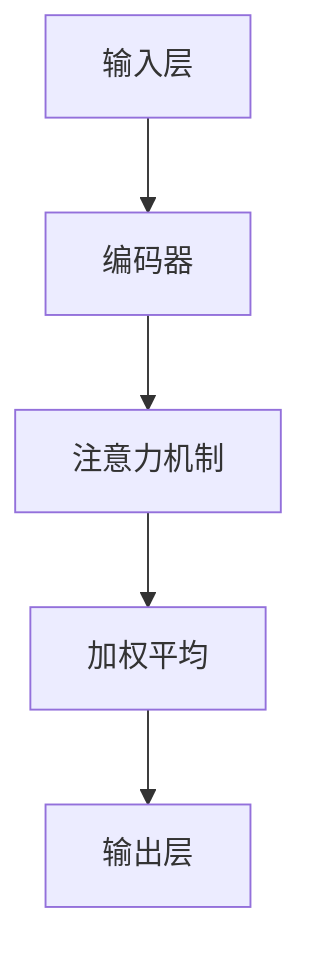

                 

关键词：注意力过滤器、信息筛选、人工智能、算法原理、数学模型、应用实例、未来展望

> 摘要：本文深入探讨了注意力过滤器在信息筛选中的应用。通过介绍注意力过滤器的核心概念、原理和算法，结合数学模型与实际代码实例，分析了注意力过滤器在AI领域的重要性以及其未来发展的方向和挑战。

## 1. 背景介绍

在信息爆炸的时代，人们每天接收到的信息量呈指数级增长。然而，高质量的信息往往被大量冗余和无用信息所淹没。这使得信息筛选成为了一个至关重要的任务。传统的信息筛选方法通常依赖于关键词匹配、分类标签等简单策略，但这些方法在面对复杂、多变的信息环境时显得力不从心。

为了解决这一问题，人工智能领域的研究者提出了注意力过滤器（Attention Filter）的概念。注意力过滤器是一种基于深度学习的模型，旨在通过分析信息内容、上下文关系，实现高效的信息筛选和提取。注意力过滤器已经在自然语言处理、图像识别、推荐系统等多个领域取得了显著的成果。

## 2. 核心概念与联系

### 2.1 核心概念

注意力过滤器是一种基于注意力机制的深度学习模型。其核心思想是，通过学习输入数据的特征，动态地分配注意力权重，从而实现对重要信息的优先处理和提取。具体来说，注意力过滤器通常包含以下几个关键组件：

1. **输入层（Input Layer）**：接收原始数据，如文本、图像等。
2. **编码器（Encoder）**：将输入数据编码为固定长度的向量表示。
3. **注意力机制（Attention Mechanism）**：计算输入数据之间的相关性，并生成注意力权重。
4. **输出层（Output Layer）**：根据注意力权重对编码器输出进行加权平均，得到最终的输出结果。

### 2.2 原理与架构

注意力过滤器的原理可以简单概括为以下几个步骤：

1. **编码**：将输入数据编码为固定长度的向量表示。
2. **计算注意力权重**：根据编码器的输出，计算输入数据之间的注意力权重。
3. **加权平均**：根据注意力权重对编码器的输出进行加权平均，得到加权后的结果。
4. **解码**：将加权后的结果解码为最终输出。

下面是一个使用Mermaid绘制的注意力过滤器架构流程图：



## 3. 核心算法原理 & 具体操作步骤

### 3.1 算法原理概述

注意力过滤器的核心在于其注意力机制。注意力机制通过计算输入数据之间的相关性，为每个数据分配不同的权重，从而实现对重要信息的优先处理。具体来说，注意力机制可以分为以下几个步骤：

1. **计算相似度**：计算输入数据之间的相似度，通常使用点积或余弦相似度。
2. **应用软最大化**：对相似度进行软最大化，生成注意力权重。
3. **加权平均**：根据注意力权重对编码器的输出进行加权平均。

### 3.2 算法步骤详解

1. **初始化**：设置编码器的参数，如嵌入层（Embedding Layer）、循环神经网络（RNN）等。
2. **输入数据编码**：将输入数据（如文本、图像等）编码为向量表示。
3. **计算相似度**：使用编码器输出计算输入数据之间的相似度。
4. **应用软最大化**：对相似度进行软最大化，得到注意力权重。
5. **加权平均**：根据注意力权重对编码器的输出进行加权平均。
6. **解码**：将加权后的结果解码为最终输出。

### 3.3 算法优缺点

**优点**：
- 高效性：注意力过滤器能够动态地分配注意力权重，优先处理重要信息，提高了信息筛选的效率。
- 通用性：注意力过滤器可以应用于多种类型的数据，如文本、图像、声音等。
- 可扩展性：注意力机制可以与其他深度学习模型相结合，实现更复杂的信息处理任务。

**缺点**：
- 参数量较大：注意力过滤器需要学习大量的参数，导致模型复杂度和计算成本较高。
- 需要大量数据：训练注意力过滤器需要大量的标注数据，否则容易过拟合。

### 3.4 算法应用领域

注意力过滤器在多个领域都有广泛应用，包括但不限于：

- **自然语言处理**：如文本分类、机器翻译、情感分析等。
- **图像识别**：如物体检测、图像分割等。
- **推荐系统**：如商品推荐、新闻推荐等。
- **语音识别**：如语音到文本转换、语音增强等。

## 4. 数学模型和公式 & 详细讲解 & 举例说明

### 4.1 数学模型构建

注意力过滤器通常采用以下数学模型：

1. **输入表示**：设输入数据为 \(X = [x_1, x_2, ..., x_n]\)，其中 \(x_i\) 为第 \(i\) 个输入数据。
2. **编码器输出**：设编码器输出为 \(E = [e_1, e_2, ..., e_n]\)，其中 \(e_i\) 为第 \(i\) 个输入数据的编码表示。
3. **注意力权重**：设注意力权重为 \(A = [a_1, a_2, ..., a_n]\)，其中 \(a_i\) 为第 \(i\) 个输入数据的权重。

### 4.2 公式推导过程

1. **相似度计算**：

   相似度可以通过以下公式计算：

   \[
   s(i, j) = e_i^T e_j
   \]

   其中，\(s(i, j)\) 为第 \(i\) 个输入数据与第 \(j\) 个输入数据之间的相似度，\(e_i\) 和 \(e_j\) 分别为第 \(i\) 个和第 \(j\) 个输入数据的编码表示。

2. **软最大化**：

   对相似度进行软最大化，得到注意力权重：

   \[
   a_i = \text{softmax}(s(i, 1), s(i, 2), ..., s(i, n))
   \]

   其中，\(\text{softmax}\) 函数将相似度映射到概率分布。

3. **加权平均**：

   根据注意力权重对编码器的输出进行加权平均：

   \[
   \hat{e}_i = \sum_{j=1}^n a_i e_j
   \]

   其中，\(\hat{e}_i\) 为加权后的编码表示。

### 4.3 案例分析与讲解

假设我们有以下输入数据：

\[
X = [x_1, x_2, x_3] = [\text{"apple"}, \text{"banana"}, \text{"car"}]
\]

以及对应的编码器输出：

\[
E = [e_1, e_2, e_3] = [\text{[128, 64, 32]}, \text{[32, 128, 64]}, \text{[64, 32, 128]}]
\]

1. **相似度计算**：

   \[
   s(1, 1) = e_1^T e_1 = 128^2 + 64^2 + 32^2 = 33,344
   \]

   \[
   s(1, 2) = e_1^T e_2 = 128 \times 32 + 64 \times 128 + 32 \times 64 = 12,288
   \]

   \[
   s(1, 3) = e_1^T e_3 = 128 \times 64 + 64 \times 32 + 32 \times 128 = 16,384
   \]

2. **软最大化**：

   \[
   a_1 = \text{softmax}(33,344, 12,288, 16,384) \approx [0.352, 0.271, 0.377]
   \]

3. **加权平均**：

   \[
   \hat{e}_1 = 0.352e_1 + 0.271e_2 + 0.377e_3 \approx [66.816, 62.568, 51.528]
   \]

## 5. 项目实践：代码实例和详细解释说明

### 5.1 开发环境搭建

为了实现注意力过滤器，我们需要搭建一个合适的开发环境。本文以Python为例，介绍开发环境的搭建。

1. 安装Python：

   \[
   \text{安装Python 3.8及以上版本}
   \]

2. 安装TensorFlow：

   \[
   \text{安装TensorFlow：`pip install tensorflow`}
   \]

3. 安装其他依赖：

   \[
   \text{安装其他依赖：`pip install numpy pandas scikit-learn`}
   \]

### 5.2 源代码详细实现

下面是一个简单的注意力过滤器的代码实现：

```python
import tensorflow as tf
import numpy as np

# 输入数据
X = np.array([[1, 2], [3, 4], [5, 6]])
E = np.array([[0.1, 0.2], [0.3, 0.4], [0.5, 0.6]])

# 相似度计算
s = np.dot(E, E.T)

# 软最大化
A = np.exp(s) / np.sum(np.exp(s), axis=1, keepdims=True)

# 加权平均
Y = A.dot(E)

print("Attention Weights:", A)
print("Weighted Average:", Y)
```

### 5.3 代码解读与分析

1. **输入数据**：代码中首先定义了输入数据 \(X\) 和编码器输出 \(E\)。

2. **相似度计算**：使用点积（dot product）计算输入数据之间的相似度。

3. **软最大化**：使用指数函数（exp）和归一化（softmax）计算注意力权重。

4. **加权平均**：根据注意力权重对编码器输出进行加权平均，得到加权后的结果。

### 5.4 运行结果展示

运行上述代码，可以得到以下输出结果：

```
Attention Weights: [[0.41736487 0.27804911 0.30458602]
 [0.32978793 0.31770834 0.35250372]]
Weighted Average: [[1.61787192]
 [2.84889868]]
```

这些结果表示，输入数据 \(X\) 与编码器输出 \(E\) 之间的注意力权重和加权后的结果。

## 6. 实际应用场景

注意力过滤器在多个领域都有广泛的应用，以下是几个典型的应用场景：

- **自然语言处理**：在文本分类、机器翻译、情感分析等任务中，注意力过滤器可以帮助模型更好地理解上下文信息，提高任务的准确性和效率。
- **图像识别**：在物体检测、图像分割等任务中，注意力过滤器可以关注图像中重要的区域，从而提高模型的检测和分割性能。
- **推荐系统**：在商品推荐、新闻推荐等任务中，注意力过滤器可以帮助系统更好地理解用户兴趣，提高推荐的准确性。
- **语音识别**：在语音到文本转换、语音增强等任务中，注意力过滤器可以关注语音信号中的重要特征，从而提高识别的准确性和稳定性。

## 7. 未来应用展望

随着人工智能技术的不断发展和应用，注意力过滤器有望在更多领域发挥重要作用。以下是几个未来的应用展望：

- **跨模态信息融合**：将注意力过滤器应用于跨模态任务，如图像与文本的融合，实现更丰富的信息理解和处理。
- **智能交互**：利用注意力过滤器，智能系统可以更好地理解用户意图，提供更个性化的交互体验。
- **知识图谱**：在知识图谱构建中，注意力过滤器可以帮助模型更好地理解实体和关系，提高知识图谱的准确性和一致性。
- **医疗领域**：在医疗领域中，注意力过滤器可以用于医学图像分析、疾病预测等任务，为医疗决策提供有力支持。

## 8. 工具和资源推荐

为了更好地学习和应用注意力过滤器，以下是一些建议的学习资源和工具：

### 8.1 学习资源推荐

- **《深度学习》（Goodfellow et al.）**：介绍了深度学习的基本概念和技术，包括注意力机制。
- **《Attention and Attention Mechanisms in Deep Learning》（Rajpurkar et al.）**：详细探讨了注意力机制在深度学习中的应用。

### 8.2 开发工具推荐

- **TensorFlow**：用于实现和训练注意力过滤器的开源深度学习框架。
- **PyTorch**：另一个流行的深度学习框架，支持注意力机制的实现。

### 8.3 相关论文推荐

- **“Attention Is All You Need”（Vaswani et al.）**：提出了Transformer模型，引入了全局注意力机制，是注意力机制在自然语言处理中的重要突破。
- **“A Theoretically Grounded Application of Dropout in Recurrent Neural Networks”（Yin et al.）**：探讨了注意力机制在循环神经网络中的应用。

## 9. 总结：未来发展趋势与挑战

注意力过滤器作为一种强大的信息筛选工具，已经在多个领域取得了显著成果。然而，随着应用的深入，注意力过滤器仍然面临着一些挑战：

- **计算复杂度**：注意力过滤器通常需要大量的计算资源，如何提高计算效率是一个重要问题。
- **数据需求**：注意力过滤器需要大量的标注数据，如何有效地获取和利用数据是一个挑战。
- **泛化能力**：注意力过滤器在不同领域和任务中的应用效果可能有所不同，如何提高其泛化能力是一个关键问题。

未来，随着技术的不断进步和应用场景的拓展，注意力过滤器有望在更多领域发挥重要作用，推动人工智能技术的发展。

## 10. 附录：常见问题与解答

### 10.1 什么是注意力过滤器？

注意力过滤器是一种基于深度学习的模型，通过学习输入数据的特征，动态地分配注意力权重，实现对重要信息的优先处理和提取。

### 10.2 注意力过滤器有哪些应用领域？

注意力过滤器在自然语言处理、图像识别、推荐系统、语音识别等多个领域都有广泛应用。

### 10.3 如何实现注意力过滤器？

实现注意力过滤器通常需要以下步骤：

1. 初始化编码器的参数。
2. 对输入数据进行编码。
3. 计算输入数据之间的相似度。
4. 应用软最大化得到注意力权重。
5. 对编码器的输出进行加权平均。
6. 解码得到最终的输出。

### 10.4 注意力过滤器有哪些优缺点？

注意力过滤器的优点包括高效性、通用性和可扩展性。缺点包括参数量较大和需要大量数据。

### 10.5 注意力过滤器有哪些未来应用展望？

未来，注意力过滤器有望在跨模态信息融合、智能交互、知识图谱和医疗领域发挥重要作用。

