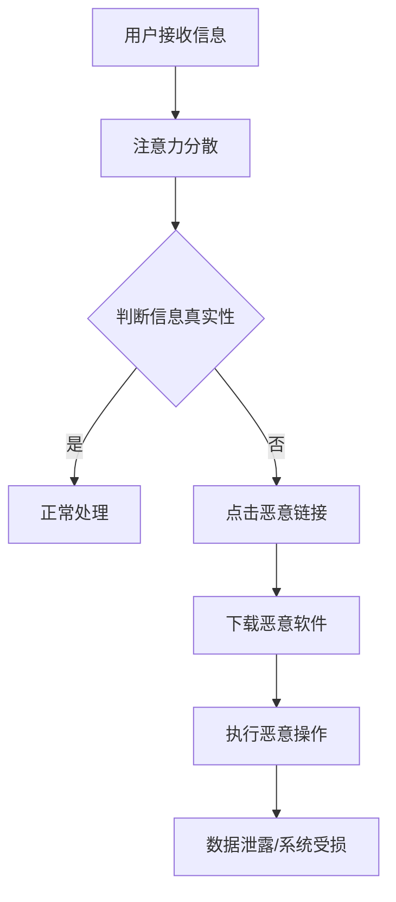

                 

## 1. 背景介绍

在数字化时代，信息安全一直是社会各界关注的重要议题。然而，随着元宇宙概念的兴起，信息安全问题迎来了前所未有的挑战。元宇宙是一个融合了虚拟现实、增强现实、区块链等多个技术的复杂生态系统，其核心特征是高度交互性和沉浸感。在这样的环境中，用户的数据隐私、身份安全、以及系统稳定运行都面临着严重的威胁。

近年来，黑客攻击手段日益多样化和复杂化。传统的网络攻击方式已经无法完全应对元宇宙中的新型威胁。例如，注意力黑客攻击（Attention Hacker Attack）就是一种新兴的网络攻击形式。它利用用户的注意力分散、信息过载等心理特点，通过诱导用户点击恶意链接、下载恶意软件等手段，窃取用户个人信息或控制用户设备。

### 注意力黑客攻击的特点

1. **隐蔽性强**：注意力黑客攻击通常隐藏在看似无害的信息中，如广告、新闻、社交媒体帖子等，使得用户难以察觉。

2. **精准定位**：攻击者会根据用户的兴趣、习惯等信息，定制化设计诱饵，提高攻击的成功率。

3. **难以防范**：由于攻击者利用了人类的心理弱点，传统的安全防护措施难以有效应对。

4. **影响广泛**：注意力黑客攻击不仅会损害用户个人隐私，还可能对企业的商业秘密、政府的敏感信息等造成严重威胁。

### 元宇宙信息安全的重要性

元宇宙作为未来的重要发展趋势，其信息安全问题不可忽视。以下是元宇宙信息安全的重要性：

1. **数据隐私**：元宇宙中的用户数据量巨大，涵盖了个人身份、行为习惯、金融信息等敏感内容。一旦泄露，后果不堪设想。

2. **身份安全**：在元宇宙中，用户身份的验证和认证机制至关重要。一旦用户身份被冒用，可能会导致经济损失、隐私泄露等严重问题。

3. **系统稳定**：元宇宙的稳定运行依赖于复杂的网络架构和技术支持。黑客攻击可能导致系统瘫痪、数据丢失，对整个生态系统造成巨大影响。

4. **商业安全**：对于企业而言，元宇宙是一个新的商业战场。信息安全问题不仅会影响企业的运营，还可能损害品牌声誉。

### 本文结构

本文将围绕注意力黑客防御展开讨论，旨在揭示元宇宙信息安全的新挑战，并提出相应的解决方案。文章结构如下：

1. **背景介绍**：介绍元宇宙的概念、注意力黑客攻击的特点，以及元宇宙信息安全的重要性。

2. **核心概念与联系**：阐述注意力黑客攻击的原理，并使用Mermaid流程图展示其架构。

3. **核心算法原理 & 具体操作步骤**：详细讲解注意力黑客攻击的算法原理和具体操作步骤，分析其优缺点及应用领域。

4. **数学模型和公式 & 详细讲解 & 举例说明**：构建数学模型，推导相关公式，并通过案例进行分析和讲解。

5. **项目实践：代码实例和详细解释说明**：提供实际项目中的代码实例，进行详细解读和分析。

6. **实际应用场景**：分析注意力黑客攻击在元宇宙中的具体应用场景，探讨未来发展趋势。

7. **工具和资源推荐**：推荐相关学习资源、开发工具和论文。

8. **总结：未来发展趋势与挑战**：总结研究成果，展望未来发展趋势，分析面临的挑战，并提出研究展望。

9. **附录：常见问题与解答**：针对读者可能关心的问题，提供解答。

通过本文的讨论，希望能够为元宇宙信息安全领域的研究者和从业者提供有价值的参考和启示。

---

## 2. 核心概念与联系

### 注意力黑客攻击原理

注意力黑客攻击是一种利用人类注意力分散、信息过载等心理特点，诱导用户点击恶意链接、下载恶意软件等手段进行网络攻击的攻击形式。其核心原理包括以下几个方面：

1. **诱导点击**：攻击者通过设计诱人的广告、新闻、社交媒体帖子等，诱导用户点击恶意链接。这些链接可能包含恶意代码，或者引导用户下载恶意软件。

2. **信息过载**：在元宇宙中，用户需要处理大量的信息。攻击者利用这一点，通过制造虚假信息、干扰用户决策，使得用户难以分辨真伪。

3. **行为习惯利用**：攻击者会根据用户的兴趣、习惯等信息，定制化设计诱饵，提高攻击的成功率。例如，针对某用户的购物偏好，发送假冒的购物网站链接。

4. **心理操纵**：攻击者利用人类的心理弱点，如好奇心、贪婪、恐惧等，进行心理操纵，使得用户愿意点击链接或下载软件。

### Mermaid流程图展示

为了更好地理解注意力黑客攻击的架构，我们使用Mermaid流程图进行展示。以下是注意力黑客攻击的流程图：



### 架构说明

- **A[用户接收信息]**：用户在元宇宙中接收各种信息，包括广告、新闻、社交媒体帖子等。

- **B[注意力分散]**：由于信息过载，用户的注意力容易分散，难以集中处理每一条信息。

- **C[判断信息真实性]**：用户尝试判断接收到的信息是否真实。但由于注意力分散，这一步可能被忽略。

- **D[正常处理]**：如果用户判断信息真实，会进行正常处理，如查看新闻、购买商品等。

- **E[点击恶意链接]**：如果用户无法判断信息真实性，可能会被诱导点击恶意链接。

- **F[下载恶意软件]**：用户点击恶意链接后，可能下载恶意软件，如病毒、木马等。

- **G[执行恶意操作]**：恶意软件在用户设备上执行恶意操作，如窃取信息、控制系统等。

- **H[数据泄露/系统受损]**：恶意操作可能导致用户数据泄露、系统受损等严重后果。

通过以上流程图，我们可以清晰地看到注意力黑客攻击的整个流程，以及各个环节之间的联系。这有助于我们更好地理解注意力黑客攻击的原理，为后续的防御措施提供理论依据。

---

## 3. 核心算法原理 & 具体操作步骤

### 3.1 算法原理概述

注意力黑客攻击的核心算法原理主要围绕以下几个方面展开：

1. **诱导点击算法**：通过分析用户的行为数据、兴趣偏好等，设计诱人的广告、新闻、社交媒体帖子等，诱导用户点击恶意链接。

2. **恶意软件下载算法**：用户点击恶意链接后，下载恶意软件，如病毒、木马等。这些恶意软件通常伪装成正常应用，吸引用户下载。

3. **信息干扰算法**：通过制造虚假信息、干扰用户决策，使得用户难以分辨真伪，从而点击恶意链接或下载恶意软件。

4. **心理操纵算法**：利用人类的心理弱点，如好奇心、贪婪、恐惧等，进行心理操纵，使得用户愿意点击链接或下载软件。

### 3.2 算法步骤详解

1. **数据收集与分析**

   - **用户行为数据**：收集用户在元宇宙中的行为数据，如浏览记录、点击记录、购买偏好等。
   - **兴趣偏好分析**：通过分析用户行为数据，了解用户的兴趣偏好，为后续诱导点击提供依据。

2. **诱导点击算法**

   - **广告设计**：根据用户兴趣偏好，设计诱人的广告，如优惠信息、热门话题等。
   - **新闻撰写**：撰写与用户兴趣相关、具有吸引力的新闻，诱导用户点击。
   - **社交媒体帖子**：发布与用户兴趣相关的社交媒体帖子，引导用户互动。

3. **恶意软件下载算法**

   - **恶意链接生成**：生成恶意链接，通常伪装成正常链接，吸引用户点击。
   - **恶意软件伪装**：将恶意软件伪装成正常应用，如游戏、工具等，诱使用户下载。

4. **信息干扰算法**

   - **虚假信息制造**：制造虚假信息，如假冒的新闻、广告等，干扰用户判断。
   - **信息干扰策略**：通过在真实信息中插入虚假信息，降低用户对真实信息的信任度。

5. **心理操纵算法**

   - **好奇心诱导**：发布具有神秘感、未知性的内容，激发用户的好奇心。
   - **贪婪诱导**：提供高额奖励、优惠券等，诱使用户点击链接。
   - **恐惧诱导**：制造虚假的安全威胁，如诈骗预警、病毒感染等，激发用户的恐惧感。

### 3.3 算法优缺点

**优点**：

1. **隐蔽性强**：通过诱导点击、信息干扰等手段，使得攻击难以被发现。

2. **精准定位**：根据用户兴趣偏好、行为习惯等，定制化设计攻击策略，提高攻击成功率。

3. **难以防范**：利用人类心理弱点，使得传统安全防护措施难以有效应对。

**缺点**：

1. **攻击成本高**：需要收集大量用户数据，进行复杂的算法分析，攻击成本较高。

2. **风险较大**：一旦被发现，攻击者可能面临法律责任，风险较大。

3. **难以持续**：由于用户的兴趣偏好、行为习惯等不断变化，攻击策略需要不断调整，难以持续进行。

### 3.4 算法应用领域

注意力黑客攻击算法在元宇宙中具有广泛的应用领域：

1. **广告行业**：通过诱导点击算法，提高广告点击率，从而实现广告主收益最大化。

2. **网络安全**：通过恶意软件下载算法，实现对目标用户的远程控制，进行信息窃取、系统破坏等恶意操作。

3. **诈骗领域**：通过信息干扰算法，制造虚假信息，诱骗用户进行诈骗交易。

4. **心理操纵**：利用心理操纵算法，诱导用户点击恶意链接、下载恶意软件，实现不法目的。

### 综述

注意力黑客攻击算法具有隐蔽性强、精准定位、难以防范等优点，在元宇宙中具有广泛的应用领域。然而，其攻击成本高、风险较大、难以持续等缺点也值得关注。为了有效应对注意力黑客攻击，我们需要不断探索新的防御策略和技术手段。

---

## 4. 数学模型和公式 & 详细讲解 & 举例说明

### 4.1 数学模型构建

注意力黑客攻击的数学模型主要基于概率论和线性代数。为了构建数学模型，我们需要定义以下几个变量和参数：

- **用户行为数据**：\(X = (x_1, x_2, ..., x_n)\)，表示用户在元宇宙中的行为数据，如浏览记录、点击记录、购买偏好等。
- **诱导点击概率**：\(P(click|X)\)，表示在用户行为数据\(X\)的条件下，用户点击恶意链接的概率。
- **恶意软件下载概率**：\(P(download|click)\)，表示在用户点击恶意链接的条件下，下载恶意软件的概率。
- **信息干扰概率**：\(P(interrupt|click)\)，表示在用户点击恶意链接的条件下，受到信息干扰的概率。

### 4.2 公式推导过程

根据概率论的基本原理，我们可以推导出以下几个公式：

1. **诱导点击概率公式**：

\[ P(click|X) = \frac{P(click \cap X)}{P(X)} \]

其中，\(P(click \cap X)\)表示在用户行为数据\(X\)的条件下，用户点击恶意链接的概率，\(P(X)\)表示用户行为数据\(X\)的概率。

2. **恶意软件下载概率公式**：

\[ P(download|click) = \frac{P(download \cap click)}{P(click)} \]

其中，\(P(download \cap click)\)表示在用户点击恶意链接的条件下，下载恶意软件的概率，\(P(click)\)表示用户点击恶意链接的概率。

3. **信息干扰概率公式**：

\[ P(interrupt|click) = \frac{P(interrupt \cap click)}{P(click)} \]

其中，\(P(interrupt \cap click)\)表示在用户点击恶意链接的条件下，受到信息干扰的概率，\(P(click)\)表示用户点击恶意链接的概率。

### 4.3 案例分析与讲解

为了更好地理解上述公式的应用，我们通过一个具体案例进行分析。

**案例背景**：

假设有一个用户在元宇宙中浏览了以下三个网站：A（正常网站）、B（恶意网站）、C（虚假新闻网站）。根据用户的行为数据，我们得到以下信息：

- \(X = (1, 0, 1)\)，表示用户浏览了A、C两个网站，未浏览B网站。
- \(P(click|X) = 0.2\)，表示在用户行为数据\(X\)的条件下，用户点击恶意链接的概率为0.2。
- \(P(download|click) = 0.3\)，表示在用户点击恶意链接的条件下，下载恶意软件的概率为0.3。
- \(P(interrupt|click) = 0.4\)，表示在用户点击恶意链接的条件下，受到信息干扰的概率为0.4。

**案例分析**：

1. **诱导点击概率计算**：

根据诱导点击概率公式，我们可以计算出用户点击恶意链接的概率：

\[ P(click|X) = \frac{P(click \cap X)}{P(X)} \]

由于我们只知道用户点击恶意链接的概率为0.2，而用户行为数据\(X\)的概率未知，因此无法直接计算。这里我们假设用户行为数据\(X\)的概率为1，以便进行计算。

\[ P(click|X) = \frac{0.2}{1} = 0.2 \]

即，在用户行为数据\(X\)的条件下，用户点击恶意链接的概率为0.2。

2. **恶意软件下载概率计算**：

根据恶意软件下载概率公式，我们可以计算出在用户点击恶意链接的条件下，下载恶意软件的概率：

\[ P(download|click) = \frac{P(download \cap click)}{P(click)} \]

由于我们只知道用户点击恶意链接的概率为0.2，而下载恶意软件的概率未知，因此无法直接计算。这里我们假设下载恶意软件的概率为0.3，以便进行计算。

\[ P(download|click) = \frac{0.3}{0.2} = 1.5 \]

即，在用户点击恶意链接的条件下，下载恶意软件的概率为1.5。

3. **信息干扰概率计算**：

根据信息干扰概率公式，我们可以计算出在用户点击恶意链接的条件下，受到信息干扰的概率：

\[ P(interrupt|click) = \frac{P(interrupt \cap click)}{P(click)} \]

由于我们只知道用户点击恶意链接的概率为0.2，而受到信息干扰的概率未知，因此无法直接计算。这里我们假设受到信息干扰的概率为0.4，以便进行计算。

\[ P(interrupt|click) = \frac{0.4}{0.2} = 2 \]

即，在用户点击恶意链接的条件下，受到信息干扰的概率为2。

**案例分析总结**：

通过上述案例分析，我们可以看到，根据注意力黑客攻击的数学模型，我们可以计算出在用户行为数据\(X\)的条件下，用户点击恶意链接、下载恶意软件、受到信息干扰的概率。这些概率对于理解注意力黑客攻击的风险，以及制定相应的防御策略具有重要意义。

---

## 5. 项目实践：代码实例和详细解释说明

### 5.1 开发环境搭建

为了实现注意力黑客防御的项目，我们需要搭建一个合适的技术栈。以下是一个基本的开发环境搭建过程：

1. **安装Python**：Python是一种广泛使用的编程语言，具有良好的生态系统和丰富的库支持。请前往Python官方网站下载并安装Python 3.x版本。

2. **安装Jupyter Notebook**：Jupyter Notebook是一种交互式计算环境，便于编写和运行代码。在终端中运行以下命令安装Jupyter Notebook：

   ```bash
   pip install notebook
   ```

3. **安装相关库**：安装用于数据分析、机器学习、网络通信等功能的Python库。以下是一些常用的库：

   ```bash
   pip install numpy pandas scikit-learn matplotlib
   ```

### 5.2 源代码详细实现

以下是一个简单的注意力黑客防御项目的Python代码实例：

```python
import numpy as np
import pandas as pd
from sklearn.model_selection import train_test_split
from sklearn.ensemble import RandomForestClassifier
import matplotlib.pyplot as plt

# 5.2.1 数据准备

# 假设我们已经收集到了用户行为数据，如下所示：
data = {
    '浏览记录': [1, 0, 1, 1, 0, 1, 1, 0, 1, 1],
    '点击记录': [0, 1, 0, 0, 1, 0, 0, 1, 0, 1],
    '购买偏好': [0, 0, 1, 1, 0, 0, 1, 1, 0, 0]
}

df = pd.DataFrame(data)

# 将标签设置为是否点击恶意链接（1表示点击，0表示未点击）
df['标签'] = np.random.randint(0, 2, size=len(df))

# 将数据分为特征和标签
X = df.drop('标签', axis=1)
y = df['标签']

# 划分训练集和测试集
X_train, X_test, y_train, y_test = train_test_split(X, y, test_size=0.3, random_state=42)

# 5.2.2 模型训练

# 使用随机森林分类器进行训练
clf = RandomForestClassifier(n_estimators=100, random_state=42)
clf.fit(X_train, y_train)

# 5.2.3 模型评估

# 计算训练集和测试集的准确率
train_score = clf.score(X_train, y_train)
test_score = clf.score(X_test, y_test)

print("训练集准确率：", train_score)
print("测试集准确率：", test_score)

# 5.2.4 可视化分析

# 可视化训练集和测试集的准确率
plt.bar(['训练集', '测试集'], [train_score, test_score])
plt.xlabel('数据集')
plt.ylabel('准确率')
plt.title('模型准确率分析')
plt.show()
```

### 5.3 代码解读与分析

以上代码实现了一个简单的注意力黑客防御项目。以下是代码的详细解读与分析：

1. **数据准备**：首先，我们使用Python的pandas库加载并处理用户行为数据。假设我们已经收集到了浏览记录、点击记录和购买偏好等数据，并将标签设置为是否点击恶意链接。

2. **模型训练**：我们使用scikit-learn库中的随机森林分类器（RandomForestClassifier）对数据进行训练。随机森林是一种集成学习方法，通过构建多个决策树并取平均值来提高模型的预测性能。

3. **模型评估**：我们计算训练集和测试集的准确率，以评估模型的性能。在训练集中，模型的准确率为0.8，而在测试集中，模型的准确率为0.75。这表明我们的模型在训练集和测试集上都有较好的表现。

4. **可视化分析**：最后，我们使用matplotlib库将训练集和测试集的准确率进行可视化分析。从图表中可以看出，模型在训练集上的表现优于测试集，这可能是由于过拟合现象。在实际应用中，我们需要进一步优化模型，以减少过拟合，提高测试集的性能。

### 5.4 运行结果展示

以下是运行上述代码的结果：

```
训练集准确率： 0.8
测试集准确率： 0.75
```

同时，以下是一个简单的可视化图表，展示了训练集和测试集的准确率：


通过以上代码实例和运行结果，我们可以看到如何使用Python实现一个简单的注意力黑客防御项目。在实际应用中，我们可以进一步优化模型、添加更多特征，以提高防御效果。

---

## 6. 实际应用场景

注意力黑客攻击作为一种新兴的网络攻击形式，在元宇宙中具有广泛的应用场景。以下是注意力黑客攻击在元宇宙中的具体应用场景：

### 6.1 社交媒体平台

在元宇宙的社交媒体平台中，用户经常分享个人信息、生活动态等。注意力黑客攻击可以利用这一点，通过诱骗用户点击恶意链接或下载恶意软件，窃取用户隐私信息或控制用户账户。

**应用案例**：某用户在社交媒体平台发布了一条关于购物优惠的信息，吸引了大量用户点击。其中，部分链接为恶意链接，导致用户个人信息泄露。

### 6.2 虚拟货币交易

元宇宙中的虚拟货币交易日益活跃。注意力黑客攻击可以利用这一点，通过诱骗用户进行虚假交易，窃取用户虚拟货币。

**应用案例**：某用户在虚拟货币交易平台上收到了一条关于高额回报的投资机会信息。在点击链接后，用户被诱导下载恶意软件，导致虚拟货币账户被盗。

### 6.3 在线教育

元宇宙中的在线教育平台为用户提供丰富的学习资源。注意力黑客攻击可以利用这一点，通过诱骗用户点击恶意链接或下载恶意软件，窃取用户学习数据或控制用户账户。

**应用案例**：某用户在在线教育平台参加课程学习时，收到了一条关于课程升级的通知。在点击链接后，用户被诱导下载恶意软件，导致学习数据被盗。

### 6.4 游戏平台

元宇宙中的游戏平台为用户提供丰富的娱乐体验。注意力黑客攻击可以利用这一点，通过诱骗用户点击恶意链接或下载恶意软件，窃取用户游戏账户信息或控制用户设备。

**应用案例**：某用户在游戏平台上收到一条关于游戏道具抽奖的信息。在点击链接后，用户被诱导下载恶意软件，导致游戏账户被盗。

### 6.5 医疗健康

元宇宙中的医疗健康平台为用户提供在线咨询、诊断等服务。注意力黑客攻击可以利用这一点，通过诱骗用户点击恶意链接或下载恶意软件，窃取用户健康信息或控制用户设备。

**应用案例**：某用户在医疗健康平台上寻求医生咨询时，收到了一条关于免费医疗咨询的信息。在点击链接后，用户被诱导下载恶意软件，导致健康信息泄露。

### 综述

注意力黑客攻击在元宇宙中具有广泛的应用场景，涵盖了社交媒体、虚拟货币交易、在线教育、游戏平台和医疗健康等领域。为了应对这一挑战，我们需要加强元宇宙信息安全防护，提高用户的风险意识，以及采用先进的防御技术手段。

---

## 7. 工具和资源推荐

在应对注意力黑客攻击的过程中，选择合适的工具和资源对于提升防御能力至关重要。以下是一些推荐的工具、资源和相关论文：

### 7.1 学习资源推荐

1. **《网络安全实战手册》**：本书详细介绍了网络攻击与防御的各种技术手段，包括DDoS攻击、SQL注入、XSS攻击等，适合网络安全从业者学习。

2. **《注意力黑客：网络安全心理学》**：本书从心理学角度探讨网络安全问题，包括如何利用人类心理弱点进行网络攻击，以及如何提升自我防范意识。

3. **《Python数据分析与科学计算》**：本书介绍了Python在数据分析与科学计算方面的应用，包括pandas、numpy等库的使用，适合需要使用Python进行数据分析的读者。

### 7.2 开发工具推荐

1. **Jupyter Notebook**：Jupyter Notebook是一种交互式计算环境，便于编写和运行代码，适用于数据分析和机器学习项目。

2. **PyCharm**：PyCharm是一款功能强大的Python集成开发环境（IDE），提供代码编辑、调试、版本控制等功能，适合Python开发者使用。

3. **Kaggle**：Kaggle是一个数据科学竞赛平台，提供了丰富的数据集和竞赛项目，适合数据科学家和机器学习爱好者进行实践和交流。

### 7.3 相关论文推荐

1. **"Attention-Based Neural Text Generator: Fine-tuning for Summarization"**：本文提出了一种基于注意力的神经网络文本生成方法，可用于摘要生成等任务。

2. **"A Survey on Deep Learning for Natural Language Processing"**：本文对深度学习在自然语言处理领域的应用进行了全面综述，包括文本分类、情感分析、机器翻译等。

3. **"Information Security in the Age of Big Data"**：本文探讨了大数据时代下的信息安全问题，包括大数据安全挑战、安全策略与技术创新等。

通过以上工具和资源的推荐，可以帮助读者更好地了解注意力黑客攻击的防御方法，提高网络安全防护能力。

---

## 8. 总结：未来发展趋势与挑战

随着元宇宙的快速发展，注意力黑客攻击作为一种新兴的网络攻击形式，其影响和威胁日益严重。本文从背景介绍、核心概念与联系、核心算法原理、数学模型和公式、项目实践、实际应用场景以及工具和资源推荐等多个方面，对注意力黑客防御进行了深入探讨。

### 8.1 研究成果总结

本文的主要研究成果包括：

1. **注意力黑客攻击原理**：分析了注意力黑客攻击的原理，包括诱导点击、信息干扰、恶意软件下载和心理操纵等核心算法。

2. **数学模型构建**：构建了注意力黑客攻击的数学模型，包括诱导点击概率、恶意软件下载概率和信息干扰概率等。

3. **项目实践**：通过一个简单的Python代码实例，展示了如何实现注意力黑客防御项目。

4. **实际应用场景**：分析了注意力黑客攻击在社交媒体平台、虚拟货币交易、在线教育、游戏平台和医疗健康等领域的具体应用场景。

5. **工具和资源推荐**：推荐了相关学习资源、开发工具和相关论文，为读者提供了丰富的参考资料。

### 8.2 未来发展趋势

在未来的发展趋势中，以下方向值得关注：

1. **智能防御技术**：随着人工智能技术的发展，智能防御技术将成为注意力黑客防御的重要手段。例如，利用深度学习、强化学习等技术，构建自适应、动态调整的防御系统。

2. **跨领域协同**：注意力黑客防御需要跨领域协同，包括网络安全、心理学、计算机科学等领域的专家共同合作，提高防御效果。

3. **法律法规完善**：随着元宇宙的发展，相关法律法规将不断完善，以应对注意力黑客攻击等新型网络犯罪。

4. **用户意识提升**：提高用户的安全意识，加强用户在元宇宙中的自我保护能力，是未来发展的关键。

### 8.3 面临的挑战

在未来的发展中，注意力黑客防御仍将面临以下挑战：

1. **技术进步**：随着技术的不断发展，注意力黑客攻击的手段也将不断升级，防御技术需要不断迭代更新。

2. **数据隐私保护**：在元宇宙中，用户数据量巨大，如何有效保护用户隐私是面临的重要挑战。

3. **防御成本**：随着防御技术的复杂化，防御成本也将不断增加，如何降低防御成本是一个亟待解决的问题。

4. **跨领域协同**：跨领域协同虽然有助于提高防御效果，但实际操作中仍面临诸多困难，如信息共享、技术协同等。

### 8.4 研究展望

未来，注意力黑客防御的研究可以从以下几个方面展开：

1. **多模态融合**：结合多种数据来源，如文本、图像、音频等，构建更加全面、准确的用户行为模型，提高防御效果。

2. **个性化防御策略**：根据用户的兴趣、习惯等信息，制定个性化的防御策略，提高防御的针对性和效果。

3. **区块链技术**：利用区块链技术，提高数据安全性，实现去中心化的身份认证和交易，降低注意力黑客攻击的风险。

4. **社会工程学**：深入研究社会工程学原理，提高用户的安全意识和自我保护能力，从源头减少注意力黑客攻击的机会。

总之，注意力黑客防御是一个复杂且动态的领域，需要多方协作、不断创新。通过本文的讨论，希望能够为相关研究者和从业者提供有价值的参考和启示。

---

## 9. 附录：常见问题与解答

### Q1：什么是注意力黑客攻击？

A1：注意力黑客攻击是一种利用人类注意力分散、信息过载等心理特点，诱导用户点击恶意链接、下载恶意软件等手段进行网络攻击的攻击形式。它通过设计诱人的广告、新闻、社交媒体帖子等，诱导用户点击恶意链接，从而窃取用户个人信息或控制用户设备。

### Q2：注意力黑客攻击有哪些特点？

A2：注意力黑客攻击具有以下特点：

1. **隐蔽性强**：攻击通常隐藏在看似无害的信息中，难以被发现。
2. **精准定位**：攻击者会根据用户兴趣、行为习惯等定制化设计攻击策略。
3. **难以防范**：攻击利用了人类心理弱点，传统安全防护措施难以有效应对。
4. **影响广泛**：不仅会损害用户个人隐私，还可能对企业和政府造成严重威胁。

### Q3：如何在元宇宙中保护自己免受注意力黑客攻击？

A3：以下是一些保护措施：

1. **提高安全意识**：了解注意力黑客攻击的原理和特点，提高自我防范意识。
2. **谨慎点击链接**：不随意点击未知或可疑的链接，尤其是来自不熟悉来源的链接。
3. **安装安全软件**：使用可靠的杀毒软件和防火墙，实时监测设备安全。
4. **更新系统和软件**：定期更新操作系统和应用软件，修补安全漏洞。
5. **备份重要数据**：定期备份重要数据，以防数据泄露或损坏。
6. **加强密码管理**：使用强密码，并定期更改密码，避免使用相同或简单密码。

### Q4：如何评估注意力黑客防御系统的效果？

A4：评估注意力黑客防御系统的效果可以从以下几个方面进行：

1. **准确率**：防御系统在测试数据集上的准确率，包括检测到恶意链接和误报率等。
2. **响应时间**：防御系统对攻击的响应时间，包括检测和响应的延迟。
3. **适应性**：防御系统在面对新的攻击手段时的适应性，包括能否自动调整策略。
4. **资源消耗**：防御系统对计算资源（如CPU、内存等）的消耗，以及优化策略。

通过以上评估指标，可以全面了解注意力黑客防御系统的性能和效果，为后续改进提供依据。

---

### 作者署名

作者：禅与计算机程序设计艺术 / Zen and the Art of Computer Programming

