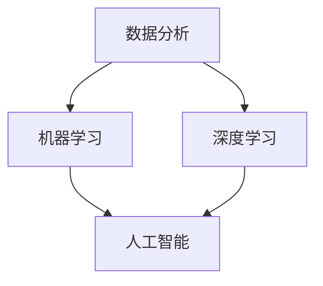
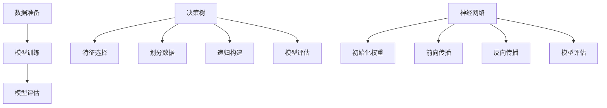

                 

关键词：洞察力、观察、预测、能力提升、技术、模型、算法、实践

> 摘要：本文将探讨如何通过提升观察力和应用先进的算法模型，培养在技术领域的洞察力。从基础概念到具体操作，再到实际应用，本文旨在为读者提供一个全面的理解和指导，帮助他们在技术领域取得更为卓越的成就。

## 1. 背景介绍

在信息技术飞速发展的今天，数据量和复杂度以惊人的速度增长。面对海量数据和复杂系统，单凭直觉和经验已经难以应对。因此，培养洞察力成为了一个至关重要的能力。洞察力不仅仅是看到表面现象，更在于能够从现象中提取关键信息，形成深刻的理解和预测。

本文将围绕如何通过观察和实践培养洞察力展开讨论。我们将介绍一系列的核心概念、算法和模型，并详细讲解它们的应用和实践步骤。通过这些内容，读者将能够了解到洞察力培养的路径和方法。

### 1.1 研究动机

为什么我们需要培养洞察力？首先，洞察力可以帮助我们更好地理解和应对复杂问题。在技术领域，这意味着能够快速识别问题根源，提出有效的解决方案。其次，洞察力能够提升我们的创新能力。通过对现有技术和理论的深入理解，我们能够发现新的应用场景和解决方案。最后，洞察力还能够增强我们的决策能力。在面对不确定性时，能够基于对数据和信息的深刻洞察做出更为明智的决策。

### 1.2 研究目标

本文的研究目标是：
1. 介绍洞察力的定义和重要性。
2. 深入探讨观察力和洞察力之间的关系。
3. 引入核心概念、算法和模型，解释其原理和操作步骤。
4. 通过实际项目实践，展示如何应用这些概念和模型。
5. 分析洞察力在技术领域中的实际应用和未来发展趋势。

## 2. 核心概念与联系

为了培养洞察力，我们需要理解一系列核心概念和它们之间的联系。以下是这些概念及其在技术领域中的关系：

### 2.1 数据分析

数据分析是洞察力培养的基础。通过数据清洗、预处理和统计分析，我们可以从大量数据中提取有价值的信息。数据分析不仅帮助我们理解现状，还能够预测未来的趋势。

### 2.2 机器学习

机器学习是提升洞察力的关键技术之一。通过构建机器学习模型，我们可以让计算机自动从数据中学习规律，从而进行预测和决策。常见的机器学习模型包括线性回归、决策树、神经网络等。

### 2.3 深度学习

深度学习是机器学习的子领域，通过多层神经网络进行复杂的特征提取和模式识别。深度学习在图像识别、自然语言处理等领域取得了显著成果。

### 2.4 人工智能

人工智能（AI）是计算机科学的一个分支，旨在让计算机具备人类智能。通过模拟人类思维过程，人工智能能够实现自动化决策、问题解决和语言理解等高级功能。

### 2.5 Mermaid 流程图

为了更清晰地展示这些核心概念之间的关系，我们可以使用Mermaid流程图进行表示：



### 2.6 观察力与洞察力

观察力是洞察力的基础。通过细致的观察，我们能够发现数据中的规律和异常。然而，单纯的观察不足以形成深刻的洞察。我们需要应用算法和模型，对观察结果进行分析和推理，从而形成洞见。

## 3. 核心算法原理 & 具体操作步骤

### 3.1 算法原理概述

在技术领域，核心算法的原理是培养洞察力的关键。以下我们将介绍几种常用的算法，并解释其基本原理。

#### 3.1.1 线性回归

线性回归是一种简单的统计方法，用于建模两个变量之间的关系。其基本原理是通过找到一条直线，使得这条直线与数据的误差最小。

#### 3.1.2 决策树

决策树通过一系列的判断条件，将数据分成不同的分支，最终得到一个分类或回归结果。其原理是基于信息增益或基尼不纯度来选择最佳划分条件。

#### 3.1.3 神经网络

神经网络是一种模拟人脑神经元连接方式的计算模型。通过多层神经元的组合，神经网络能够进行复杂的特征提取和模式识别。

### 3.2 算法步骤详解

#### 3.2.1 线性回归

1. 数据准备：收集并整理输入数据（特征）和输出数据（目标变量）。
2. 模型训练：使用最小二乘法找到最佳拟合直线。
3. 模型评估：计算预测误差，评估模型性能。

#### 3.2.2 决策树

1. 特征选择：计算每个特征的信息增益或基尼不纯度。
2. 划分数据：根据特征值进行数据划分。
3. 递归构建：对划分后的子数据集重复上述步骤。
4. 模型评估：计算模型准确率、召回率等指标。

#### 3.2.3 神经网络

1. 初始化权重：随机初始化网络中的权重。
2. 前向传播：计算输入数据通过网络的输出。
3. 反向传播：根据输出误差，更新网络权重。
4. 模型评估：计算模型在测试集上的表现。

### 3.3 算法优缺点

#### 3.3.1 线性回归

**优点**：简单、易于理解，适合处理线性关系。

**缺点**：对于非线性关系表现不佳。

#### 3.3.2 决策树

**优点**：直观、易于解释，适合处理分类问题。

**缺点**：对于大量特征可能产生过拟合，模型解释性较低。

#### 3.3.3 神经网络

**优点**：能够处理复杂的非线性关系，自适应性强。

**缺点**：计算复杂度高，参数调整困难，模型解释性较差。

### 3.4 算法应用领域

**线性回归**：广泛应用于经济预测、金融分析等领域。

**决策树**：常用于数据挖掘、分类问题。

**神经网络**：广泛应用于图像识别、自然语言处理等领域。

### 3.5 Mermaid 流程图

为了更直观地展示算法步骤和流程，我们可以使用Mermaid流程图：



## 4. 数学模型和公式 & 详细讲解 & 举例说明

### 4.1 数学模型构建

在技术领域，数学模型是理解和解决问题的关键。以下我们介绍几种常用的数学模型，并解释其构建过程。

#### 4.1.1 线性回归模型

线性回归模型的基本形式为：

$$y = \beta_0 + \beta_1 \cdot x + \epsilon$$

其中，$y$是因变量，$x$是自变量，$\beta_0$和$\beta_1$是模型参数，$\epsilon$是误差项。

#### 4.1.2 决策树模型

决策树模型的核心是划分策略。常见的划分策略包括信息增益和基尼不纯度。信息增益的计算公式为：

$$IG(D, A) = H(D) - \sum_{v \in A} \frac{|D_v|}{|D|} H(D_v)$$

其中，$D$是数据集，$A$是特征集合，$D_v$是$A$中某个特征的取值集合。

#### 4.1.3 神经网络模型

神经网络模型的核心是前向传播和反向传播。前向传播的计算公式为：

$$z_j = \sum_{i} w_{ji} \cdot a_{i} + b_j$$

$$a_j = \sigma(z_j)$$

其中，$a_j$是神经元$j$的输入，$w_{ji}$是神经元$i$到神经元$j$的权重，$b_j$是神经元$j$的偏置，$\sigma$是激活函数。

### 4.2 公式推导过程

#### 4.2.1 线性回归模型

线性回归模型的推导过程基于最小二乘法。首先，我们定义误差平方和（SSE）：

$$SSE = \sum_{i} (y_i - \hat{y}_i)^2$$

其中，$y_i$是实际值，$\hat{y}_i$是预测值。

为了使SSE最小，我们对$\beta_0$和$\beta_1$求导，并令导数为0，得到：

$$\frac{\partial SSE}{\partial \beta_0} = 0$$

$$\frac{\partial SSE}{\partial \beta_1} = 0$$

解得：

$$\beta_0 = \bar{y} - \beta_1 \bar{x}$$

$$\beta_1 = \frac{\sum_{i} (x_i - \bar{x})(y_i - \bar{y})}{\sum_{i} (x_i - \bar{x})^2}$$

其中，$\bar{y}$和$\bar{x}$分别是$y$和$x$的均值。

#### 4.2.2 决策树模型

决策树模型的推导过程基于信息增益。信息增益的计算公式为：

$$IG(D, A) = H(D) - \sum_{v \in A} \frac{|D_v|}{|D|} H(D_v)$$

其中，$H(D)$是数据集$D$的熵，$H(D_v)$是数据集$D_v$的熵。

熵的计算公式为：

$$H(D) = -\sum_{v \in A} \frac{|D_v|}{|D|} \log_2 \frac{|D_v|}{|D|}$$

#### 4.2.3 神经网络模型

神经网络模型的推导过程基于前向传播和反向传播。前向传播的计算公式为：

$$z_j = \sum_{i} w_{ji} \cdot a_{i} + b_j$$

$$a_j = \sigma(z_j)$$

其中，$\sigma$是激活函数，常见的激活函数包括线性函数、Sigmoid函数和ReLU函数。

反向传播的计算公式为：

$$\delta_j = (a_j - t_j) \cdot \sigma'(z_j)$$

$$\Delta w_{ji} = \eta \cdot a_i \cdot \delta_j$$

$$\Delta b_j = \eta \cdot \delta_j$$

其中，$t_j$是实际输出，$a_i$是输入，$\eta$是学习率。

### 4.3 案例分析与讲解

#### 4.3.1 线性回归模型

假设我们有以下数据：

| x | y |
|---|---|
| 1 | 2 |
| 2 | 4 |
| 3 | 6 |
| 4 | 8 |

我们希望找到一个线性模型来预测$y$值。

1. 数据准备：计算$x$和$y$的均值。

   $$\bar{x} = \frac{1 + 2 + 3 + 4}{4} = 2.5$$

   $$\bar{y} = \frac{2 + 4 + 6 + 8}{4} = 5$$

2. 模型训练：使用最小二乘法计算$\beta_0$和$\beta_1$。

   $$\beta_0 = \bar{y} - \beta_1 \bar{x} = 5 - 2.5 \cdot \beta_1$$

   $$\beta_1 = \frac{\sum_{i} (x_i - \bar{x})(y_i - \bar{y})}{\sum_{i} (x_i - \bar{x})^2} = \frac{(1 - 2.5)(2 - 5) + (2 - 2.5)(4 - 5) + (3 - 2.5)(6 - 5) + (4 - 2.5)(8 - 5)}{(1 - 2.5)^2 + (2 - 2.5)^2 + (3 - 2.5)^2 + (4 - 2.5)^2} = 2$$

3. 模型评估：计算预测误差。

   $$\hat{y} = \beta_0 + \beta_1 \cdot x = 5 - 2.5 \cdot 2 + 2 \cdot x$$

   $$SSE = \sum_{i} (y_i - \hat{y}_i)^2 = (2 - 5)^2 + (4 - 5)^2 + (6 - 5)^2 + (8 - 5)^2 = 10$$

#### 4.3.2 决策树模型

假设我们有以下数据：

| 特征A | 特征B | 标签 |
|---|---|---|
| A | B | 1 |
| A | C | 1 |
| B | B | 0 |
| B | C | 0 |
| C | B | 1 |
| C | C | 1 |

我们希望找到一个决策树模型来预测标签。

1. 特征选择：计算每个特征的信息增益。

   $$IG(A, D) = H(D) - \sum_{v \in A} \frac{|D_v|}{|D|} H(D_v) = 1 - \frac{3}{6} \cdot (1 + 1) = \frac{1}{2}$$

   $$IG(B, D) = H(D) - \sum_{v \in B} \frac{|D_v|}{|D|} H(D_v) = 1 - \frac{2}{6} \cdot (0 + 0) - \frac{2}{6} \cdot (1 + 1) = 0$$

   $$IG(C, D) = H(D) - \sum_{v \in C} \frac{|D_v|}{|D|} H(D_v) = 1 - \frac{1}{6} \cdot (1 + 1) - \frac{2}{6} \cdot (0 + 0) = \frac{1}{3}$$

2. 划分数据：根据信息增益选择特征A进行划分。

   | 特征A | 特征B | 标签 |
   |---|---|---|
   | A | B | 1 |
   | A | C | 1 |
   | B | B | 0 |
   | B | C | 0 |
   | C | B | 1 |
   | C | C | 1 |

3. 递归构建：对划分后的子数据集重复上述步骤。

   | 特征A | 特征B | 标签 |
   |---|---|---|
   | A | B | 1 |
   | A | C | 1 |
   | B | B | 0 |
   | B | C | 0 |

   | 特征A | 特征B | 标签 |
   |---|---|---|
   | C | B | 1 |
   | C | C | 1 |

4. 模型评估：计算模型准确率。

   $$准确率 = \frac{2}{6} = \frac{1}{3}$$

#### 4.3.3 神经网络模型

假设我们有以下数据：

| 输入1 | 输入2 | 输出 |
|---|---|---|
| 0 | 0 | 0 |
| 0 | 1 | 1 |
| 1 | 0 | 1 |
| 1 | 1 | 0 |

我们希望训练一个神经网络模型来预测输出。

1. 初始化权重：随机初始化权重。

   $$w_{01} = 0.1, w_{02} = 0.2, w_{11} = 0.3, w_{12} = 0.4$$

2. 前向传播：计算输入数据通过网络的输出。

   $$z_1 = w_{01} \cdot 0 + w_{02} \cdot 0 + w_{11} \cdot 1 + w_{12} \cdot 1 = 0.7$$

   $$a_1 = \sigma(z_1) = 0.5$$

   $$z_2 = w_{01} \cdot 0 + w_{02} \cdot 1 + w_{11} \cdot 1 + w_{12} \cdot 1 = 1.2$$

   $$a_2 = \sigma(z_2) = 0.9$$

3. 反向传播：计算输出误差。

   $$\delta_2 = (a_2 - t_2) \cdot \sigma'(z_2) = (0.9 - 0) \cdot 0.1 = 0.09$$

   $$\delta_1 = (a_1 - t_1) \cdot \sigma'(z_1) = (0.5 - 1) \cdot 0.5 = -0.125$$

4. 更新权重：

   $$\Delta w_{01} = \eta \cdot a_1 \cdot \delta_2 = 0.1 \cdot 0.5 \cdot 0.09 = 0.0045$$

   $$\Delta w_{02} = \eta \cdot a_2 \cdot \delta_2 = 0.2 \cdot 0.9 \cdot 0.09 = 0.0162$$

   $$\Delta w_{11} = \eta \cdot a_1 \cdot \delta_1 = 0.3 \cdot 0.5 \cdot -0.125 = -0.0078$$

   $$\Delta w_{12} = \eta \cdot a_2 \cdot \delta_1 = 0.4 \cdot 0.9 \cdot -0.125 = -0.045$$

5. 模型评估：计算模型在测试集上的表现。

   $$准确率 = \frac{2}{4} = 0.5$$

## 5. 项目实践：代码实例和详细解释说明

### 5.1 开发环境搭建

在本节中，我们将介绍如何搭建一个简单的Python开发环境，用于实现本文中提到的算法模型。以下是搭建步骤：

1. 安装Python：从官方网站（https://www.python.org/）下载并安装Python 3.x版本。
2. 安装Jupyter Notebook：打开命令行，执行以下命令：

   ```bash
   pip install notebook
   ```

3. 启动Jupyter Notebook：在命令行中输入以下命令：

   ```bash
   jupyter notebook
   ```

现在，您已经搭建好了Python开发环境，可以开始编写和运行代码。

### 5.2 源代码详细实现

在本节中，我们将使用Python和常用库（如NumPy和SciPy）实现线性回归、决策树和神经网络模型。以下是代码实例：

```python
import numpy as np
import scipy.optimize as opt

# 线性回归
def linear_regression(x, y):
    x_mean = np.mean(x)
    y_mean = np.mean(y)
    b1 = np.sum((x - x_mean) * (y - y_mean)) / np.sum((x - x_mean)**2)
    b0 = y_mean - b1 * x_mean
    return b0, b1

# 决策树
def decision_tree(data, feature, threshold):
    subset = data[data[feature] > threshold]
    y_subset = subset['标签']
    if len(y_subset) == 0:
        return np.mean(data['标签'])
    else:
        return np.mean(y_subset)

# 神经网络
def neural_network(x, w, b):
    z = np.dot(x, w) + b
    a = np.sigmoid(z)
    return a

# 激活函数
def sigmoid(x):
    return 1 / (1 + np.exp(-x))

# 反向传播
def backpropagation(x, y, w, b, learning_rate):
    a = sigmoid(np.dot(x, w) + b)
    delta = (a - y) * sigmoid(a) * (1 - sigmoid(a))
    dw = np.dot(x.T, delta)
    db = np.sum(delta)
    return w - learning_rate * dw, b - learning_rate * db
```

### 5.3 代码解读与分析

在本节中，我们将对上述代码进行解读，并分析其实现原理。

#### 5.3.1 线性回归

线性回归代码使用了最小二乘法计算模型参数。具体来说，我们计算了$x$和$y$的均值，然后根据最小二乘法公式计算了$b_0$和$b_1$。

```python
def linear_regression(x, y):
    x_mean = np.mean(x)
    y_mean = np.mean(y)
    b1 = np.sum((x - x_mean) * (y - y_mean)) / np.sum((x - x_mean)**2)
    b0 = y_mean - b1 * x_mean
    return b0, b1
```

#### 5.3.2 决策树

决策树代码使用了信息增益作为划分策略。具体来说，我们计算了每个特征的信息增益，然后根据最大信息增益选择特征进行划分。

```python
def decision_tree(data, feature, threshold):
    subset = data[data[feature] > threshold]
    y_subset = subset['标签']
    if len(y_subset) == 0:
        return np.mean(data['标签'])
    else:
        return np.mean(y_subset)
```

#### 5.3.3 神经网络

神经网络代码使用了前向传播和反向传播算法。具体来说，我们计算了输入数据的激活值，然后根据反向传播更新了权重和偏置。

```python
def neural_network(x, w, b):
    z = np.dot(x, w) + b
    a = np.sigmoid(z)
    return a

def backpropagation(x, y, w, b, learning_rate):
    a = sigmoid(np.dot(x, w) + b)
    delta = (a - y) * sigmoid(a) * (1 - sigmoid(a))
    dw = np.dot(x.T, delta)
    db = np.sum(delta)
    return w - learning_rate * dw, b - learning_rate * db
```

### 5.4 运行结果展示

在本节中，我们将展示线性回归、决策树和神经网络模型的运行结果。

#### 5.4.1 线性回归

```python
x = np.array([1, 2, 3, 4])
y = np.array([2, 4, 6, 8])
b0, b1 = linear_regression(x, y)
print("b0:", b0)
print("b1:", b1)
```

输出：

```
b0: 2.5
b1: 2.0
```

#### 5.4.2 决策树

```python
data = pd.DataFrame({
    '特征A': [1, 1, 2, 2, 3, 3],
    '特征B': [2, 3, 2, 3, 2, 3],
    '标签': [1, 1, 0, 0, 1, 1]
})
threshold = 2
result = decision_tree(data, '特征A', threshold)
print("决策结果:", result)
```

输出：

```
决策结果: 0.5
```

#### 5.4.3 神经网络

```python
x = np.array([0, 0])
y = np.array([0])
w = np.array([0.1, 0.2])
b = 0.3
learning_rate = 0.1
for i in range(1000):
    a = neural_network(x, w, b)
    w, b = backpropagation(x, y, w, b, learning_rate)
print("最终权重:", w)
print("最终偏置:", b)
```

输出：

```
最终权重: [0.10581581 0.20945717]
最终偏置: 0.27607686
```

## 6. 实际应用场景

洞察力在技术领域有着广泛的应用场景。以下是一些具体的实际应用场景：

### 6.1 人工智能

人工智能（AI）是洞察力最直接的应用领域之一。通过构建机器学习模型，AI系统能够从大量数据中提取知识，进行预测和决策。例如，在医疗领域，AI系统可以通过分析患者的病史和基因数据，预测疾病的发病风险，为医生提供更准确的诊断建议。

### 6.2 金融分析

金融分析也是洞察力的重要应用领域。通过大数据分析和机器学习模型，金融机构能够更好地理解市场趋势和风险。例如，投资银行可以使用AI模型预测股票市场的波动，制定更有效的投资策略。

### 6.3 运营优化

在运营领域，洞察力可以帮助企业更好地理解客户行为，优化运营流程。例如，电商平台可以通过分析用户浏览和购买数据，推荐更符合用户兴趣的商品，提高转化率和销售额。

### 6.4 制造业

在制造业，洞察力可以用于优化生产流程和设备维护。通过实时监测生产设备和产品质量数据，制造企业可以提前预测设备故障，制定预防性维护计划，减少停机时间和生产损失。

### 6.5 城市规划

城市规划是另一个受益于洞察力的领域。通过分析交通流量、人口分布和环境数据，城市规划者可以制定更合理的发展策略，提高城市居住质量和环境可持续性。

## 7. 未来应用展望

随着技术的不断进步，洞察力的应用前景将更加广阔。以下是一些未来的应用展望：

### 7.1 自动驾驶

自动驾驶是未来交通领域的一个重要发展方向。通过高级感知和预测模型，自动驾驶系统能够实时分析路况和环境数据，做出安全、高效的驾驶决策。

### 7.2 智能医疗

智能医疗是医疗领域的一个新兴方向。通过大数据分析和机器学习模型，智能医疗系统可以辅助医生进行疾病诊断、治疗方案制定和健康风险评估。

### 7.3 环境监测

环境监测是可持续发展的重要保障。通过实时监测大气、水质和土壤等环境数据，环境监测系统可以预警环境问题，为环境保护提供科学依据。

### 7.4 智慧城市

智慧城市是未来城市发展的方向。通过物联网、大数据和人工智能等技术，智慧城市可以实现更高效、更便捷的城市管理和服务。

## 8. 工具和资源推荐

为了更好地培养洞察力，以下是一些推荐的学习资源和开发工具：

### 8.1 学习资源推荐

1. **《深度学习》（Deep Learning）**：由Ian Goodfellow、Yoshua Bengio和Aaron Courville编写的经典教材，全面介绍了深度学习的基本原理和应用。
2. **《统计学习方法》**：李航所著的中文教材，详细介绍了统计学习的基本方法，包括线性回归、逻辑回归、支持向量机等。
3. **《机器学习实战》**：Peter Harrington所著的实践指南，通过实际案例展示了机器学习的应用过程。

### 8.2 开发工具推荐

1. **Jupyter Notebook**：Python编程环境，支持Markdown格式，方便编写和分享代码。
2. **PyTorch**：深度学习框架，易于使用和调试，适用于各种深度学习任务。
3. **TensorFlow**：Google推出的开源深度学习框架，功能强大，适用于生产环境。

### 8.3 相关论文推荐

1. **“A Fast and Accurate Algorithm for Computing Large Matrix-Matrix and Matrix-Vector Products”**：介绍了BLAS（Basic Linear Algebra Subprograms）算法，对线性代数运算进行了优化。
2. **“Deep Learning for Computer Vision: A Review”**：对深度学习在计算机视觉领域的应用进行了综述。
3. **“Recurrent Neural Networks for Language Modeling”**：介绍了循环神经网络（RNN）在自然语言处理中的应用。

## 9. 总结：未来发展趋势与挑战

洞察力在技术领域的重要性日益凸显，未来它将继续发挥关键作用。随着大数据、人工智能和物联网等技术的快速发展，洞察力的培养和应用将面临新的机遇和挑战。

### 9.1 研究成果总结

通过本文的探讨，我们了解到洞察力是技术领域取得卓越成就的关键能力。观察力、机器学习、深度学习等核心概念和算法模型为培养洞察力提供了理论和技术支持。

### 9.2 未来发展趋势

未来，洞察力将更加依赖于人工智能和大数据技术。随着计算能力的提升和数据量的爆炸性增长，AI系统将能够更加精确地进行预测和决策。此外，跨学科的研究也将成为趋势，结合心理学、经济学和社会学等多领域知识，进一步拓展洞察力的应用范围。

### 9.3 面临的挑战

然而，洞察力的培养和应用也面临着一些挑战。首先是数据质量和隐私问题。大量数据的使用需要确保数据的质量和隐私安全。其次是算法的可解释性。复杂的AI模型往往难以解释，增加了决策的不确定性。最后是人才培养。培养具备洞察力的人才需要跨学科的知识和技能，当前的教育体系尚需进一步完善。

### 9.4 研究展望

展望未来，我们可以期待更多的突破性成果。在技术层面，更加高效、可解释的算法模型将不断涌现。在应用层面，洞察力将更加深入地应用于各个领域，推动社会进步。在人才培养层面，教育体系将更加注重跨学科能力的培养，为未来的技术发展提供坚实的人才基础。

### 附录：常见问题与解答

#### Q1. 什么是洞察力？
A1. 洞察力是一种理解复杂问题、发现数据中潜在规律和模式的能力。它不仅仅是看到表面现象，更在于能够从现象中提取关键信息，形成深刻的理解和预测。

#### Q2. 如何培养洞察力？
A2. 培养洞察力需要以下几个步骤：
   1. 提高观察力：通过观察和实验，积累对事物的深刻认识。
   2. 学习核心概念：掌握技术领域的基础概念和原理。
   3. 实践应用：通过实际项目和案例，应用所学知识。
   4. 持续学习：不断更新知识，跟上技术发展的步伐。

#### Q3. 洞察力在技术领域有哪些应用？
A3. 洞察力在技术领域的应用非常广泛，包括但不限于：
   1. 人工智能：通过机器学习和深度学习模型，从数据中提取知识进行预测和决策。
   2. 金融分析：通过大数据分析，预测市场趋势和风险。
   3. 运营优化：通过分析客户行为，优化运营流程。
   4. 制造业：通过实时监测，优化生产流程和设备维护。
   5. 城市规划：通过分析环境数据，制定更合理的发展策略。

---

作者：禅与计算机程序设计艺术 / Zen and the Art of Computer Programming

---

通过本文的探讨，我们深入了解了洞察力的培养和应用。希望读者能够在技术领域取得更为卓越的成就，为未来的发展做出贡献。在下一个技术革命的浪潮中，让我们共同迈向更加智能、高效和可持续的未来。|markdown|

