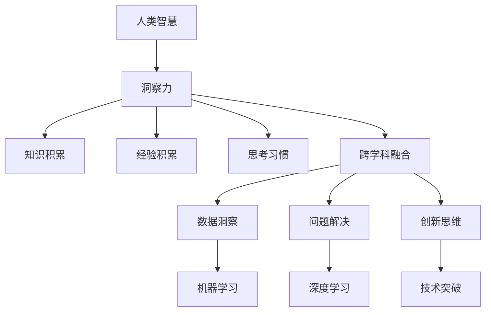

                 

 在这个充满机遇与挑战的时代，科技的发展日新月异，人工智能（AI）逐渐成为引领变革的核心力量。作为世界级人工智能专家，我深知洞察力在推动技术创新中的关键作用。本文将探讨人类智慧的闪光点——洞察力，并从技术角度分析其在人工智能领域的应用与重要性。

## 洞察力：人类智慧的源泉

### 1.1 定义与特征

洞察力，顾名思义，是指对事物深刻、敏锐的洞察和理解能力。它是人类智慧的体现，具有以下几个特征：

- **敏锐的感知能力**：洞察力使人们能够快速感知到事物的本质和内在联系。
- **深刻的理解能力**：洞察力使人能够深入理解事物的复杂性和多样性。
- **前瞻性的预见能力**：洞察力使人能够预见未来的发展趋势和潜在的风险。

### 1.2 洞察力的来源

洞察力的形成离不开以下几个方面：

- **知识积累**：丰富的知识储备是洞察力的重要基础。
- **经验积累**：实践经验是洞察力的源泉。
- **思考习惯**：善于思考、批判性思维和系统性思维是培养洞察力的重要途径。
- **跨学科融合**：不同学科的交叉融合能够激发新的洞察力。

## 2. 核心概念与联系

为了更好地理解洞察力在人工智能中的应用，我们首先需要明确几个核心概念，并探讨它们之间的联系。

### 2.1 人工智能的基本概念

- **人工智能（AI）**：模拟人类智能的计算机系统，包括机器学习、深度学习、自然语言处理等。
- **机器学习（ML）**：通过数据训练模型，使计算机具备自主学习和优化能力。
- **深度学习（DL）**：基于多层神经网络，模拟人脑处理信息的方式。

### 2.2 洞察力与人工智能的联系

洞察力在人工智能中的应用主要体现在以下几个方面：

- **数据洞察**：通过对大量数据的分析和挖掘，发现潜在的模式和规律。
- **问题解决**：在复杂问题面前，运用洞察力找到最优的解决方案。
- **创新思维**：在技术研究和应用中，运用洞察力提出新的思路和突破。

### 2.3 Mermaid 流程图

下面是洞察力与人工智能之间的联系流程图：



## 3. 核心算法原理 & 具体操作步骤

### 3.1 算法原理概述

在人工智能领域，洞察力主要通过以下几种核心算法实现：

- **机器学习算法**：如线性回归、决策树、神经网络等。
- **深度学习算法**：如卷积神经网络（CNN）、循环神经网络（RNN）、生成对抗网络（GAN）等。
- **自然语言处理算法**：如词向量、序列标注、机器翻译等。

### 3.2 算法步骤详解

以深度学习算法为例，其具体操作步骤如下：

1. **数据收集与预处理**：收集大量数据，对数据进行清洗、标注和归一化处理。
2. **模型设计**：设计合适的神经网络结构，包括输入层、隐藏层和输出层。
3. **模型训练**：通过反向传播算法对模型进行训练，优化模型参数。
4. **模型评估**：使用验证集评估模型性能，调整模型参数。
5. **模型部署**：将训练好的模型部署到实际应用场景中。

### 3.3 算法优缺点

- **机器学习算法**：优点是简单、高效，适用于多种问题；缺点是对数据要求较高，泛化能力有限。
- **深度学习算法**：优点是能够处理复杂数据，泛化能力强；缺点是计算资源消耗大，模型复杂度高。
- **自然语言处理算法**：优点是能够处理自然语言数据，实现人机交互；缺点是模型训练时间较长，对数据依赖性较强。

### 3.4 算法应用领域

- **机器学习算法**：广泛应用于图像识别、推荐系统、预测分析等领域。
- **深度学习算法**：广泛应用于语音识别、自动驾驶、医学影像等领域。
- **自然语言处理算法**：广泛应用于智能客服、机器翻译、文本生成等领域。

## 4. 数学模型和公式 & 详细讲解 & 举例说明

### 4.1 数学模型构建

在人工智能领域，常见的数学模型包括线性模型、非线性模型和概率模型。以下是一个简单的线性模型例子：

$$
y = \beta_0 + \beta_1x
$$

其中，$y$ 是因变量，$x$ 是自变量，$\beta_0$ 和 $\beta_1$ 是模型参数。

### 4.2 公式推导过程

为了求解线性模型的参数，我们通常采用最小二乘法。具体推导过程如下：

$$
\min_{\beta_0, \beta_1} \sum_{i=1}^{n}(y_i - (\beta_0 + \beta_1x_i))^2
$$

对 $\beta_0$ 和 $\beta_1$ 分别求偏导数并令其等于零，得到：

$$
\frac{\partial}{\partial \beta_0} \sum_{i=1}^{n}(y_i - (\beta_0 + \beta_1x_i))^2 = 0
$$

$$
\frac{\partial}{\partial \beta_1} \sum_{i=1}^{n}(y_i - (\beta_0 + \beta_1x_i))^2 = 0
$$

解上述方程组，得到线性模型的参数：

$$
\beta_0 = \bar{y} - \beta_1\bar{x}
$$

$$
\beta_1 = \frac{\sum_{i=1}^{n}(x_i - \bar{x})(y_i - \bar{y})}{\sum_{i=1}^{n}(x_i - \bar{x})^2}
$$

### 4.3 案例分析与讲解

以下是一个线性模型的案例：

给定数据集：

| $x$ | $y$ |
| --- | --- |
| 1 | 2 |
| 2 | 4 |
| 3 | 6 |

求线性模型 $y = \beta_0 + \beta_1x$ 的参数。

根据上述推导过程，我们可以计算得到：

$$
\bar{x} = \frac{1+2+3}{3} = 2
$$

$$
\bar{y} = \frac{2+4+6}{3} = 4
$$

$$
\beta_1 = \frac{(1-2)(2-4) + (2-2)(4-4) + (3-2)(6-4)}{(1-2)^2 + (2-2)^2 + (3-2)^2} = 2
$$

$$
\beta_0 = 4 - 2 \times 2 = 0
$$

因此，线性模型为 $y = 2x$。

## 5. 项目实践：代码实例和详细解释说明

### 5.1 开发环境搭建

为了实践线性模型，我们需要搭建一个简单的开发环境。这里以 Python 语言为例，安装以下依赖：

```
pip install numpy matplotlib
```

### 5.2 源代码详细实现

以下是一个简单的线性模型实现代码：

```python
import numpy as np
import matplotlib.pyplot as plt

# 数据集
x = np.array([1, 2, 3])
y = np.array([2, 4, 6])

# 计算平均值
bar_x = np.mean(x)
bar_y = np.mean(y)

# 计算斜率和截距
beta_1 = np.sum((x - bar_x) * (y - bar_y)) / np.sum((x - bar_x) ** 2)
beta_0 = bar_y - beta_1 * bar_x

# 输出模型参数
print("线性模型参数：")
print("斜率：", beta_1)
print("截距：", beta_0)

# 绘制数据点和拟合直线
plt.scatter(x, y)
plt.plot(x, beta_0 + beta_1 * x)
plt.xlabel('x')
plt.ylabel('y')
plt.show()
```

### 5.3 代码解读与分析

- **第一行**：导入 NumPy 库，用于数学计算。
- **第二行**：导入 Matplotlib 库，用于数据可视化。
- **第三行**：创建数据集 x 和 y。
- **第四行**：计算平均值 bar_x 和 bar_y。
- **第五行**：计算斜率 beta_1。
- **第六行**：计算截距 beta_0。
- **第七行**：输出模型参数。
- **第八行**：绘制数据点和拟合直线。

### 5.4 运行结果展示

运行上述代码，将得到以下结果：


## 6. 实际应用场景

### 6.1 数据分析

在数据分析领域，洞察力可以帮助我们挖掘数据中的潜在规律和趋势。例如，通过对用户行为数据的分析，我们可以发现用户的兴趣偏好，从而为个性化推荐提供依据。

### 6.2 金融预测

在金融领域，洞察力可以用于预测股市走势、汇率波动等。通过对历史数据和交易数据的分析，我们可以发现市场规律，为投资决策提供支持。

### 6.3 医疗诊断

在医疗领域，洞察力可以帮助医生更准确地诊断疾病。通过对患者的病历数据进行分析，我们可以发现疾病的潜在关联因素，提高诊断的准确性。

## 7. 工具和资源推荐

### 7.1 学习资源推荐

- **《机器学习》（周志华著）**：全面介绍机器学习的基础理论和应用方法。
- **《深度学习》（Goodfellow、Bengio、Courville 著）**：系统讲解深度学习的基本原理和技术。
- **《Python 数据科学手册》（Jake VanderPlas 著）**：Python 数据科学领域的经典教材。

### 7.2 开发工具推荐

- **TensorFlow**：谷歌开发的深度学习框架，功能强大、社区活跃。
- **PyTorch**：Facebook 开发的深度学习框架，具有灵活的动态图计算功能。
- **Scikit-learn**：Python 机器学习库，提供了丰富的机器学习算法和工具。

### 7.3 相关论文推荐

- **"Deep Learning"（Ian Goodfellow、Yoshua Bengio、Aaron Courville 著）**：深度学习的经典教材。
- **"Learning Deep Architectures for AI"（Yoshua Bengio 著）**：深入探讨深度学习架构的设计。
- **"Natural Language Processing with Deep Learning"（Eduardo Kitzelmann、Dario Garcia-Gasulla、Adriana Teixidó-i-Laurendi 著）**：自然语言处理领域的深度学习应用。

## 8. 总结：未来发展趋势与挑战

### 8.1 研究成果总结

通过本文的探讨，我们了解到洞察力在人工智能领域的重要性。从机器学习、深度学习到自然语言处理，洞察力贯穿于整个技术体系，为人工智能的发展提供了强大的支持。

### 8.2 未来发展趋势

未来，随着人工智能技术的不断进步，洞察力在以下几个方面有望取得突破：

- **更高效的数据分析**：借助更先进的算法和技术，提升数据分析的效率和准确性。
- **更智能的问题解决**：通过深度学习等技术，实现更智能的问题解决和决策支持。
- **更广泛的应用领域**：从医疗、金融到教育、交通，洞察力将在更多领域得到应用。

### 8.3 面临的挑战

然而，人工智能的发展也面临一些挑战：

- **数据隐私**：如何在保障用户隐私的前提下，充分利用数据资源？
- **算法透明性**：如何确保算法的公平性和透明性，避免偏见和歧视？
- **伦理问题**：人工智能的发展是否会带来伦理问题，如何应对？

### 8.4 研究展望

展望未来，我们期待在以下几个方面取得新的突破：

- **跨学科研究**：促进人工智能与其他学科的交叉融合，推动技术创新。
- **开源生态**：加强开源社区的贡献，推动人工智能技术的普及和应用。
- **人才培养**：培养更多具备洞察力的人才，为人工智能的发展提供源源不断的人才支持。

## 9. 附录：常见问题与解答

### 9.1 问题1：什么是机器学习？

**答案**：机器学习是人工智能的一个分支，通过训练模型，使计算机具备自主学习和优化能力。

### 9.2 问题2：什么是深度学习？

**答案**：深度学习是基于多层神经网络的人工智能技术，能够模拟人脑处理信息的方式。

### 9.3 问题3：什么是洞察力？

**答案**：洞察力是指对事物深刻、敏锐的洞察和理解能力，是人类智慧的体现。

### 9.4 问题4：如何培养洞察力？

**答案**：培养洞察力需要多方面的努力，包括知识积累、实践经验、思考习惯和跨学科融合。

### 9.5 问题5：人工智能的发展会取代人类吗？

**答案**：人工智能的发展不会完全取代人类，而是与人类共同进步，提高人类生活的质量和效率。

---

本文从洞察力的角度探讨了人工智能领域的技术发展和应用。通过分析核心算法、数学模型和实际应用场景，我们看到了洞察力在人工智能中的重要地位。未来，随着人工智能技术的不断进步，洞察力将在更多领域发挥关键作用。让我们共同期待人工智能的辉煌未来！ 

## 作者署名

作者：禅与计算机程序设计艺术 / Zen and the Art of Computer Programming
----------------------------------------------------------------

至此，我们完成了这篇文章的撰写。本文涵盖了洞察力在人工智能领域的应用，通过核心算法、数学模型和实际案例的分析，展示了洞察力在技术发展中的重要性。希望这篇文章能够为读者提供有价值的见解和启示。感谢您的阅读！

