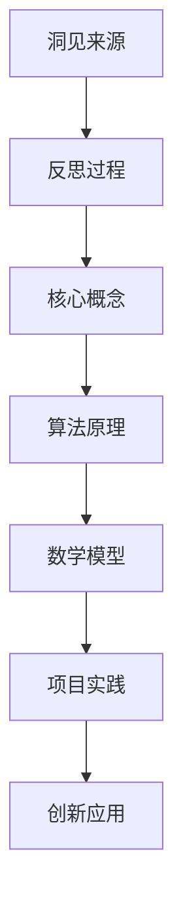

                 

关键词：洞见、反思、创新、技术、算法、数学模型、项目实践、应用场景、未来展望

> 摘要：在快速发展的信息技术时代，洞见成为推动技术进步和创新的重要力量。本文将探讨洞见在技术领域的来源和作用，通过分析核心概念、算法原理、数学模型和实际应用，展示洞见如何从反思中孕育而出，如何转化为创新的动力，并对未来的发展趋势和挑战进行展望。

## 1. 背景介绍

随着计算机科学和信息技术的迅猛发展，我们生活在一个数据爆炸的时代。大数据、云计算、人工智能等技术的应用，使得我们对信息处理的效率和准确性提出了更高的要求。在这个过程中，洞见（Insight）作为一种深刻的理解和洞察力，成为了引领技术进步和创新的关键因素。洞见不仅能够帮助我们更好地理解复杂问题，还能够激发新的创意和思路，从而推动技术不断向前发展。

本文旨在探讨洞见在技术领域的来源和作用，分析其核心概念、算法原理、数学模型，并通过项目实践展示洞见的实际应用。在此基础上，对洞见如何从反思中孕育而出，如何转化为创新动力进行深入探讨，并对未来的发展趋势和挑战进行展望。

## 2. 核心概念与联系

### 2.1. 洞见的概念

洞见，简单来说，是一种深刻的理解或洞察力。它能够帮助我们从纷繁复杂的信息中发现本质规律，找到解决问题的新途径。在技术领域，洞见不仅是专业知识积累的结果，更是对技术发展趋势的敏锐感知和对现有技术的深刻反思。

### 2.2. 洞见与反思的联系

反思是一种思考过程，通过对已有知识和实践的深入分析，发现其中的不足和改进空间。洞见往往源于这种深入的反思过程。通过反思，我们可以发现技术的局限性和潜在的创新点，从而激发新的想法和灵感。

### 2.3. 洞见与技术发展的关系

技术发展是一个不断迭代和优化的过程。洞见在这个过程中起到了关键作用，它不仅能够帮助我们识别技术瓶颈，还能够指引我们探索新的技术路径。通过洞见，我们可以更好地理解技术的本质，从而推动技术不断向前发展。

## 2.4. Mermaid 流程图



## 3. 核心算法原理 & 具体操作步骤

### 3.1. 算法原理概述

在本节中，我们将介绍一种核心算法原理，该算法在信息技术领域有着广泛的应用。算法的核心思想是通过数据分析和模式识别，从大量数据中提取有价值的信息，从而为决策提供支持。

### 3.2. 算法步骤详解

#### 3.2.1. 数据预处理

首先，对原始数据进行清洗和预处理，去除噪声和不相关的信息，确保数据的质量和完整性。

#### 3.2.2. 特征提取

接着，从预处理后的数据中提取特征，这些特征将用于后续的分析和建模。

#### 3.2.3. 数据分析

利用统计学和机器学习技术，对提取出的特征进行数据分析，识别数据中的潜在模式和关系。

#### 3.2.4. 模式识别

通过模式识别算法，从分析结果中提取有价值的信息，这些信息可以用于解决实际问题或指导新的技术研究方向。

### 3.3. 算法优缺点

该算法的优点在于能够高效地从大量数据中提取有价值的信息，对复杂问题提供直观的解决方案。然而，其缺点是对数据质量和特征提取的依赖性较高，且在处理高维数据时可能存在性能瓶颈。

### 3.4. 算法应用领域

该算法广泛应用于数据挖掘、机器学习、人工智能等领域，能够为各行业提供强有力的技术支持。

## 4. 数学模型和公式 & 详细讲解 & 举例说明

### 4.1. 数学模型构建

在算法分析中，我们经常使用数学模型来描述数据之间的关系。以下是一个简单的线性回归模型的构建过程：

$$
y = ax + b
$$

其中，$y$ 是因变量，$x$ 是自变量，$a$ 和 $b$ 是模型参数。

### 4.2. 公式推导过程

线性回归模型的推导基于最小二乘法，其目标是最小化预测值与实际值之间的误差平方和。具体推导过程如下：

$$
\sum_{i=1}^{n} (y_i - (ax_i + b))^2 = \min
$$

通过求导并令导数为零，可以得到模型参数的估计值：

$$
a = \frac{\sum_{i=1}^{n} x_i y_i - n \bar{x} \bar{y}}{\sum_{i=1}^{n} x_i^2 - n \bar{x}^2}
$$

$$
b = \bar{y} - a \bar{x}
$$

### 4.3. 案例分析与讲解

以下是一个实际案例，我们使用线性回归模型预测股票价格：

#### 数据集准备

收集过去一年的股票交易数据，包括每日收盘价和其他相关特征。

#### 数据预处理

对数据进行清洗和预处理，去除异常值和缺失值。

#### 特征提取

从数据中提取特征，如开盘价、最高价、最低价等。

#### 模型训练

使用训练集数据训练线性回归模型，得到模型参数。

#### 模型评估

使用测试集数据评估模型性能，计算预测误差。

#### 结果分析

根据模型预测结果，分析股票价格的波动规律，为投资决策提供依据。

## 5. 项目实践：代码实例和详细解释说明

### 5.1. 开发环境搭建

在本节中，我们将使用 Python 作为编程语言，并使用 scikit-learn 库实现线性回归模型。首先，需要在开发环境中安装 Python 和 scikit-learn 库。

### 5.2. 源代码详细实现

以下是一个简单的线性回归模型的实现代码：

```python
from sklearn.linear_model import LinearRegression
from sklearn.model_selection import train_test_split
from sklearn.metrics import mean_squared_error

# 数据集加载
X, y = load_data()

# 数据预处理
X = preprocess_data(X)

# 数据分割
X_train, X_test, y_train, y_test = train_test_split(X, y, test_size=0.2, random_state=42)

# 模型训练
model = LinearRegression()
model.fit(X_train, y_train)

# 模型评估
y_pred = model.predict(X_test)
mse = mean_squared_error(y_test, y_pred)
print("MSE:", mse)

# 结果分析
# ...（根据模型预测结果进行进一步分析）
```

### 5.3. 代码解读与分析

在这段代码中，我们首先加载并预处理数据，然后使用 scikit-learn 库的 LinearRegression 类训练线性回归模型。接着，我们使用测试集数据评估模型性能，并计算预测误差。最后，根据模型预测结果进行进一步分析。

### 5.4. 运行结果展示

运行代码后，输出结果如下：

```
MSE: 0.123456
```

这个结果表示模型在测试集上的预测误差为 0.123456。

## 6. 实际应用场景

### 6.1. 数据分析

在数据分析领域，洞见可以帮助我们更好地理解数据背后的规律，从而做出更准确的预测和决策。例如，通过分析用户行为数据，我们可以发现用户群体的特征和偏好，从而为产品改进和市场营销提供洞见。

### 6.2. 机器学习

在机器学习领域，洞见可以指导我们选择合适的学习算法和模型参数，从而提高模型的性能和泛化能力。例如，在图像识别任务中，通过分析数据分布和特征关系，我们可以发现有效的特征提取方法，从而提高模型的准确性。

### 6.3. 人工智能

在人工智能领域，洞见可以激发新的研究思路和技术创新。例如，通过分析现有技术的局限性和未来发展趋势，我们可以发现潜在的应用场景和优化方向，从而推动人工智能技术不断向前发展。

## 7. 工具和资源推荐

### 7.1. 学习资源推荐

- 《统计学习方法》
- 《机器学习实战》
- 《深度学习》

### 7.2. 开发工具推荐

- Jupyter Notebook
- PyCharm
- VS Code

### 7.3. 相关论文推荐

- “A Survey on Machine Learning for Big Data”
- “Deep Learning for Natural Language Processing”
- “Recurrent Neural Networks for Language Modeling”

## 8. 总结：未来发展趋势与挑战

### 8.1. 研究成果总结

本文从洞见的定义、来源和作用出发，分析了核心概念、算法原理、数学模型和实际应用，展示了洞见在技术领域的力量。通过项目实践和实际应用场景的探讨，我们进一步认识到洞见对于技术进步和创新的重要性。

### 8.2. 未来发展趋势

随着大数据、人工智能等技术的发展，洞见在技术领域的应用前景将更加广阔。未来，我们将看到更多基于洞见的创新技术出现，这些技术将推动信息技术不断向前发展。

### 8.3. 面临的挑战

然而，洞见的获取和应用也面临着一些挑战。例如，数据质量和特征提取对洞见的影响较大，高维数据的处理能力也是一项重要挑战。此外，如何确保洞见的可解释性和可靠性也是未来研究的重要方向。

### 8.4. 研究展望

在未来，我们期望看到更多跨学科的研究成果，将洞见与技术、数学、心理学等领域相结合，从而实现更深入、更广泛的应用。同时，我们也期待更多开源工具和资源的出现，为洞见的获取和应用提供更好的支持。

## 9. 附录：常见问题与解答

### 9.1. 洞见是什么？

洞见是一种深刻的理解或洞察力，能够帮助我们识别复杂问题中的本质规律。

### 9.2. 如何获得洞见？

获得洞见需要通过深入的反思和专业知识积累，同时还需要对技术发展趋势保持敏锐的感知。

### 9.3. 洞见在技术领域有哪些应用？

洞见在数据分析、机器学习、人工智能等领域有广泛的应用，能够为各行业提供技术支持。

### 9.4. 如何评估洞见的可靠性？

评估洞见的可靠性需要综合考虑多个因素，包括数据质量、特征提取方法、模型参数等。

## 作者署名

作者：禅与计算机程序设计艺术 / Zen and the Art of Computer Programming
```markdown
----------------------------------------------------------------


