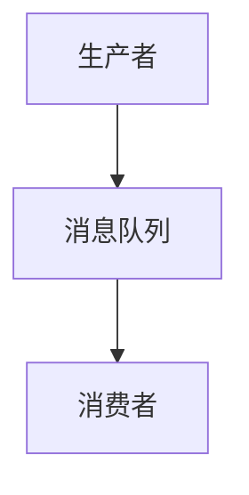
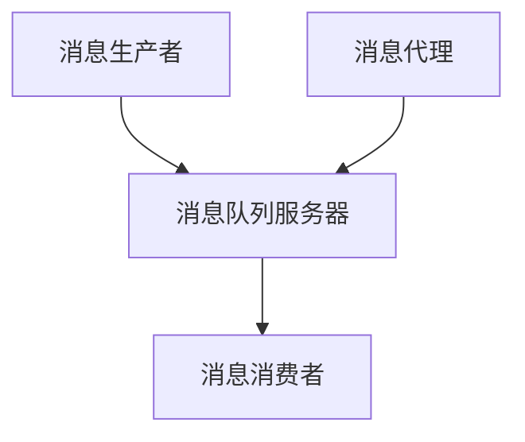
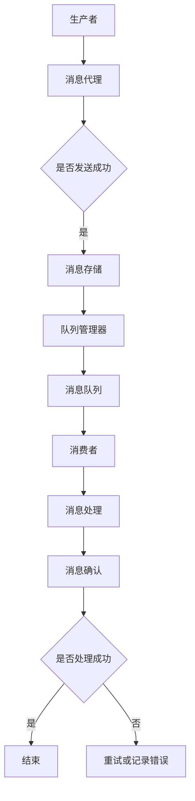

                 

关键词：消息队列，系统解耦，异步通信，微服务架构，消息中间件，分布式系统

> 摘要：本文将深入探讨消息队列在现代分布式系统中的应用，通过分析其核心概念、工作原理、算法实现和实际应用案例，阐述如何利用消息队列实现系统组件的解耦，提高系统的可靠性和可扩展性。

## 1. 背景介绍

在当今数字化转型的浪潮下，分布式系统已成为企业应用的核心基础设施。随着系统规模的不断扩大和业务需求的日益复杂，如何保证系统的稳定性、可靠性和可扩展性成为开发者和运维人员面临的重大挑战。消息队列作为一种异步通信机制，通过提供一种灵活且可靠的通信方式，帮助开发者解耦系统组件，提高系统的整体性能。

### 1.1 消息队列的定义

消息队列（Message Queue）是一种数据传输服务，它允许消息的发送者与接收者之间进行异步通信。消息队列的核心功能是将消息从生产者发送到消费者，而不需要生产者和消费者同时在线。这种异步通信机制使得系统组件可以独立运行，降低了它们之间的耦合度。

### 1.2 消息队列的应用场景

消息队列在分布式系统中有着广泛的应用，主要包括以下场景：

- **系统解耦**：通过消息队列，系统组件可以独立部署和运行，从而降低它们之间的依赖关系，提高系统的灵活性和可维护性。
- **负载均衡**：消息队列可以帮助实现任务的负载均衡，将请求分发到不同的处理节点，从而提高系统的处理能力。
- **错误处理**：消息队列可以记录未处理的消息，以便在系统出现故障时进行错误处理和恢复。
- **分布式事务**：消息队列可以作为分布式事务的协调器，确保多个系统组件之间的操作一致性。

## 2. 核心概念与联系

### 2.1 消息队列的基本概念

- **消息（Message）**：消息队列中的基本数据单元，包含数据内容和元数据。
- **生产者（Producer）**：发送消息的一方，将消息发送到消息队列。
- **消费者（Consumer）**：接收消息的一方，从消息队列中获取并处理消息。
- **队列（Queue）**：存储消息的容器，保证消息按照一定的顺序被消费。

### 2.2 消息队列的工作原理

消息队列的基本工作原理如下：

1. **消息发送**：生产者将消息发送到消息队列。
2. **消息存储**：消息队列将消息存储在内存、磁盘或其他存储介质中。
3. **消息消费**：消费者从消息队列中获取消息并处理。

消息队列的工作原理可以用以下Mermaid流程图表示：



### 2.3 消息队列的架构

消息队列的架构主要包括以下组件：

- **消息队列服务器**：负责消息的存储、转发和监控。
- **消息生产者**：将消息发送到消息队列的服务器。
- **消息消费者**：从消息队列中获取消息并处理。
- **消息代理**：负责消息的路由和负载均衡。

消息队列的架构可以用以下Mermaid流程图表示：



## 3. 核心算法原理 & 具体操作步骤

### 3.1 算法原理概述

消息队列的核心算法原理主要包括以下几个方面：

- **消息持久化**：将消息存储到持久化存储介质中，确保消息不会丢失。
- **消息传递**：在分布式系统中，将消息从生产者传递到消费者。
- **消息确认**：消费者在处理完消息后，向生产者发送确认信号，表示消息已被成功处理。

### 3.2 算法步骤详解

#### 3.2.1 消息发送

1. 生产者生成消息。
2. 生产者将消息发送到消息队列。
3. 消息队列将消息存储在持久化存储介质中。

#### 3.2.2 消息传递

1. 消费者从消息队列中获取消息。
2. 消费者处理消息。
3. 消费者向生产者发送确认信号。

#### 3.2.3 消息确认

1. 生产者收到消费者的确认信号。
2. 生产者将确认信号记录在日志中。
3. 生产者继续发送下一个消息。

### 3.3 算法优缺点

#### 优点

- **异步通信**：消息队列允许生产者和消费者之间进行异步通信，降低了系统组件之间的耦合度。
- **负载均衡**：消息队列可以实现任务的负载均衡，提高系统的处理能力。
- **高可靠性**：消息队列提供了消息持久化和确认机制，确保消息不会丢失。

#### 缺点

- **延迟**：消息队列可能会导致一定的延迟，特别是在系统负载较高时。
- **复杂性**：消息队列的实现和管理相对复杂，需要一定的技术积累。

### 3.4 算法应用领域

消息队列在以下领域有着广泛的应用：

- **金融系统**：用于处理高频交易、订单处理等场景，确保系统的稳定性和可靠性。
- **电商系统**：用于处理商品订单、库存同步等场景，提高系统的处理能力和用户体验。
- **物联网**：用于处理传感器数据采集、设备控制等场景，实现大规模设备的通信和管理。

## 4. 数学模型和公式 & 详细讲解 & 举例说明

### 4.1 数学模型构建

消息队列的数学模型主要包括以下几个方面：

- **消息传递模型**：描述消息在分布式系统中的传递过程。
- **负载均衡模型**：描述消息队列在处理大量消息时的负载均衡策略。
- **可靠性模型**：描述消息队列在处理消息时的可靠性和故障恢复能力。

### 4.2 公式推导过程

消息队列的数学模型可以通过以下公式进行推导：

- **消息传递速率**：$$r = \frac{n}{t}$$，其中$r$表示消息传递速率，$n$表示消息数量，$t$表示时间。
- **负载均衡指数**：$$k = \frac{c_1 + c_2 + \ldots + c_n}{n}$$，其中$k$表示负载均衡指数，$c_1, c_2, \ldots, c_n$表示各个处理节点的处理能力。
- **可靠性指数**：$$\rho = \frac{t_r}{t_t}$$，其中$\rho$表示可靠性指数，$t_r$表示处理成功的时间，$t_t$表示总时间。

### 4.3 案例分析与讲解

假设一个电商系统需要处理每天数百万条订单，消息队列可以帮助实现以下目标：

- **消息传递模型**：每天处理订单的数量为$n$，消息队列的平均处理时间为$t$，则消息传递速率为$r = \frac{n}{t}$。
- **负载均衡模型**：假设系统有$n$个处理节点，每个节点的处理能力为$c_i$，则负载均衡指数为$k = \frac{c_1 + c_2 + \ldots + c_n}{n}$。
- **可靠性模型**：假设系统平均每天有$r$个订单处理失败，总订单数量为$n$，则可靠性指数为$\rho = \frac{t_r}{t_t}$。

通过这些公式，可以计算出系统在实际运行中的处理能力和可靠性，从而优化消息队列的配置和策略。

## 5. 项目实践：代码实例和详细解释说明

### 5.1 开发环境搭建

搭建消息队列开发环境，我们需要以下软件：

- **RabbitMQ**：一款开源消息队列中间件。
- **Eclipse**：一款开发工具。

### 5.2 源代码详细实现

以下是一个简单的RabbitMQ消息队列的示例代码：

```java
import com.rabbitmq.client.ConnectionFactory;
import com.rabbitmq.client.Connection;
import com.rabbitmq.client.Channel;

public class MessageQueueExample {

    private final static String QUEUE_NAME = "my_queue";

    public static void main(String[] args) throws Exception {
        ConnectionFactory factory = new ConnectionFactory();
        factory.setHost("localhost");
        try (Connection connection = factory.newConnection();
             Channel channel = connection.createChannel()) {
            channel.queueDeclare(QUEUE_NAME, false, false, false, null);
            String message = "Hello World!";
            channel.basicPublish("", QUEUE_NAME, null, message.getBytes());
            System.out.println(" [x] Sent '" + message + "'");
        }
    }
}
```

### 5.3 代码解读与分析

上述代码是一个简单的RabbitMQ消息队列示例，主要实现以下功能：

1. **创建连接**：使用`ConnectionFactory`创建与RabbitMQ服务器的连接。
2. **创建通道**：使用连接创建一个通道，用于消息的发送和接收。
3. **声明队列**：使用通道声明一个队列，用于存储消息。
4. **发送消息**：将消息发送到队列中。
5. **关闭连接**：关闭连接，释放资源。

### 5.4 运行结果展示

在运行上述代码后，可以看到以下输出：

```plaintext
[ x] Sent 'Hello World!'
```

这表示消息已经成功发送到消息队列中。

## 6. 实际应用场景

消息队列在分布式系统中有着广泛的应用，以下是一些典型的应用场景：

- **金融系统**：用于处理高频交易、订单处理等场景，确保系统的稳定性和可靠性。
- **电商系统**：用于处理商品订单、库存同步等场景，提高系统的处理能力和用户体验。
- **物联网**：用于处理传感器数据采集、设备控制等场景，实现大规模设备的通信和管理。
- **社交媒体**：用于处理用户消息、通知推送等场景，提高系统的实时性和用户体验。

## 7. 工具和资源推荐

### 7.1 学习资源推荐

- 《消息队列实战》
- 《RabbitMQ实战》
- 《消息驱动微服务》

### 7.2 开发工具推荐

- RabbitMQ
- Apache Kafka
- ActiveMQ

### 7.3 相关论文推荐

- 《Message Passing in Distributed Systems》
- 《A Survey of Message Queue Middleware》
- 《Distributed Systems: Concepts and Design》

## 8. 总结：未来发展趋势与挑战

### 8.1 研究成果总结

消息队列在分布式系统中得到了广泛的应用，成为系统解耦和异步通信的重要手段。通过消息队列，开发者可以轻松实现系统组件的解耦，提高系统的可靠性和可扩展性。

### 8.2 未来发展趋势

随着云计算、物联网和大数据等技术的发展，消息队列在未来有望得到更广泛的应用。未来的消息队列将更加注重高并发、高可用性和易扩展性，同时结合区块链、边缘计算等新技术，为分布式系统提供更加丰富的功能。

### 8.3 面临的挑战

消息队列在分布式系统中仍然面临一些挑战，如高并发处理能力、数据一致性和故障恢复等。未来的研究需要重点关注这些问题，以提高消息队列的性能和可靠性。

### 8.4 研究展望

未来，消息队列的研究将朝着更加智能化、自动化的方向发展。通过引入人工智能和机器学习技术，消息队列可以更好地预测和处理系统负载，实现更加高效的资源利用和系统优化。

## 9. 附录：常见问题与解答

### 9.1 消息队列与数据库的区别是什么？

消息队列和数据库都是数据存储和管理工具，但它们的用途和设计目标不同。消息队列主要用于异步通信和任务调度，而数据库主要用于数据的存储、查询和管理。

### 9.2 消息队列如何保证消息的可靠性？

消息队列通过消息持久化和确认机制保证消息的可靠性。消息持久化将消息存储在持久化存储介质中，确保消息不会丢失。确认机制则确保消费者在处理完消息后向生产者发送确认信号，从而保证消息已被成功处理。

### 9.3 消息队列与异步编程的关系是什么？

消息队列是实现异步编程的一种机制。通过消息队列，开发者可以实现生产者和消费者之间的异步通信，从而提高系统的响应速度和并发处理能力。

## 作者署名

作者：禅与计算机程序设计艺术 / Zen and the Art of Computer Programming
```markdown
# 消息队列：解耦系统组件的利器

## 关键词
消息队列，系统解耦，异步通信，微服务架构，消息中间件，分布式系统

## 摘要
本文将深入探讨消息队列在现代分布式系统中的应用，通过分析其核心概念、工作原理、算法实现和实际应用案例，阐述如何利用消息队列实现系统组件的解耦，提高系统的可靠性和可扩展性。

## 1. 背景介绍

### 1.1 消息队列的定义
消息队列（Message Queue，简称MQ）是一种应用程序之间的通信方法，它通过一个称为消息队列的通道传递消息。消息队列的主要目的是实现应用程序之间的异步通信，使得消息的生产者和消费者不必同时在线，从而降低系统之间的耦合度。

### 1.2 消息队列的应用场景
消息队列在分布式系统中有着广泛的应用，主要包括以下场景：

- **系统解耦**：通过消息队列，可以将系统的不同模块解耦，使得每个模块可以独立开发和部署。
- **异步处理**：消息队列允许处理者在不等待结果的情况下提交任务，提高了系统的响应速度。
- **负载均衡**：消息队列可以分散负载，避免单个节点过载。
- **流量控制**：通过控制消息的速率，可以实现对系统的流量控制。

## 2. 核心概念与联系

### 2.1 消息队列的基本概念
在消息队列中，核心概念包括：

- **消息（Message）**：消息是数据传输的基本单位，可以包含文本、图像、音频等多种形式。
- **生产者（Producer）**：生产者是消息的发送方，将消息发送到消息队列。
- **消费者（Consumer）**：消费者是消息的接收方，从消息队列中获取消息进行处理。
- **队列（Queue）**：队列是消息的缓冲区，负责存储消息，并按照一定的顺序将消息传递给消费者。

### 2.2 消息队列的工作原理
消息队列的工作原理可以概括为以下几个步骤：

1. **消息发送**：生产者将消息发送到消息队列。
2. **消息存储**：消息队列将消息存储在内部队列中，等待消费者来处理。
3. **消息消费**：消费者从消息队列中获取消息，进行处理。

### 2.3 消息队列的架构
消息队列的典型架构包括以下几个部分：

- **消息代理（Message Broker）**：负责接收生产者的消息，并将消息路由到相应的队列。
- **队列管理器（Queue Manager）**：负责队列的创建、删除和监控。
- **消息消费者（Message Consumer）**：从队列中获取消息进行处理。

### 2.4 消息队列的核心概念原理与架构的 Mermaid 流程图


## 3. 核心算法原理 & 具体操作步骤

### 3.1 算法原理概述
消息队列的核心算法主要包括消息的生产、传递和消费。以下是对这些算法原理的概述：

- **消息生产算法**：生产者将消息生成后，按照一定的规则将其发送到消息队列。
- **消息传递算法**：消息代理根据消息的属性和队列的路由规则，将消息传递到相应的队列。
- **消息消费算法**：消费者从队列中获取消息，进行处理。

### 3.2 算法步骤详解
#### 3.2.1 消息生产算法步骤
1. 生产者生成消息内容。
2. 生产者将消息发送到消息代理。
3. 消息代理接收消息并按照路由规则将其发送到目标队列。

#### 3.2.2 消息传递算法步骤
1. 消息代理接收消息。
2. 消息代理根据消息的属性（如消息类型、优先级等）进行路由。
3. 路由规则匹配后，消息代理将消息发送到相应的队列。

#### 3.2.3 消息消费算法步骤
1. 消费者连接到消息队列。
2. 消费者从队列中获取消息。
3. 消费者处理消息并确认消息已被处理。

### 3.3 算法优缺点
#### 优点
- **异步处理**：生产者和消费者不必同时在线，降低了系统之间的耦合度。
- **负载均衡**：消息队列可以分散负载，避免单个节点过载。
- **高可靠性**：消息队列提供了消息持久化和确认机制，确保消息不会丢失。

#### 缺点
- **延迟**：由于消息队列的异步处理特性，可能导致一定的延迟。
- **复杂性**：消息队列的实现和管理相对复杂，需要一定的技术积累。

### 3.4 算法应用领域
消息队列主要应用在以下领域：

- **金融系统**：用于处理高频交易、订单处理等场景。
- **电商系统**：用于处理商品订单、库存同步等场景。
- **物联网**：用于处理传感器数据采集、设备控制等场景。

## 4. 数学模型和公式 & 详细讲解 & 举例说明

### 4.1 数学模型构建
消息队列的数学模型主要包括以下几个方面：

- **消息传递速率**：描述单位时间内传递的消息数量。
- **队列长度**：描述消息队列中存储的消息数量。
- **处理速率**：描述消费者处理消息的速率。

### 4.2 公式推导过程
#### 4.2.1 消息传递速率公式
消息传递速率（R）可以用以下公式表示：
\[ R = \frac{N}{T} \]
其中，N 表示单位时间内传递的消息数量，T 表示单位时间。

#### 4.2.2 队列长度公式
队列长度（L）可以用以下公式表示：
\[ L = R \times T \]
其中，R 表示消息传递速率，T 表示单位时间。

#### 4.2.3 处理速率公式
处理速率（P）可以用以下公式表示：
\[ P = \frac{L}{T} \]
其中，L 表示队列长度，T 表示单位时间。

### 4.3 案例分析与讲解
假设一个电商系统每天处理1000条订单消息，处理时间为1小时。我们需要计算以下指标：

- **消息传递速率**：\[ R = \frac{1000}{1} = 1000 \text{条/小时} \]
- **队列长度**：\[ L = R \times T = 1000 \times 1 = 1000 \text{条} \]
- **处理速率**：\[ P = \frac{L}{T} = \frac{1000}{1} = 1000 \text{条/小时} \]

这意味着，系统每小时可以处理1000条订单消息。

## 5. 项目实践：代码实例和详细解释说明

### 5.1 开发环境搭建
搭建消息队列环境，我们需要以下软件：

- **RabbitMQ**：一款开源的消息队列中间件。
- **Java**：用于编写示例代码。
- **Maven**：用于项目构建。

### 5.2 源代码详细实现
以下是使用Java和RabbitMQ实现的简单消息队列示例代码。

#### 5.2.1 生产者代码
```java
import com.rabbitmq.client.ConnectionFactory;
import com.rabbitmq.client.Connection;
import com.rabbitmq.client.Channel;

public class MessageProducer {
    private final static String QUEUE_NAME = "message_queue";

    public static void main(String[] args) throws Exception {
        ConnectionFactory factory = new ConnectionFactory();
        factory.setHost("localhost");
        try (Connection connection = factory.newConnection();
             Channel channel = connection.createChannel()) {
            channel.queueDeclare(QUEUE_NAME, false, false, false, null);
            String message = "Hello, World!";
            channel.basicPublish("", QUEUE_NAME, null, message.getBytes());
            System.out.println(" [x] Sent '" + message + "'");
        }
    }
}
```

#### 5.2.2 消费者代码
```java
import com.rabbitmq.client.ConnectionFactory;
import com.rabbitmq.client.Connection;
import com.rabbitmq.client.Channel;
import com.rabbitmq.client.DeliverCallback;

public class MessageConsumer {
    private final static String QUEUE_NAME = "message_queue";

    public static void main(String[] args) throws Exception {
        ConnectionFactory factory = new ConnectionFactory();
        factory.setHost("localhost");
        try (Connection connection = factory.newConnection();
             Channel channel = connection.createChannel()) {
            channel.queueDeclare(QUEUE_NAME, false, false, false, null);
            System.out.println(" [x] Waiting for messages. To quit press CTRL+C");
            channel.basicConsume(QUEUE_NAME, true, "myConsumerTag", new DeliverCallback() {
                @Override
                public void deliver(String consumerTag, com.rabbitmq.client.Envelope envelope, byte[] body) throws IOException {
                    String message = new String(body, "UTF-8");
                    System.out.println(" [x] Received '" + message + "'");
                }
            });
        }
    }
}
```

### 5.3 代码解读与分析
#### 5.3.1 生产者代码解读
1. **创建连接**：使用`ConnectionFactory`创建与RabbitMQ服务器的连接。
2. **创建通道**：使用连接创建一个通道，用于消息的发送和接收。
3. **声明队列**：使用通道声明一个队列，用于存储消息。
4. **发送消息**：将消息发送到队列中。
5. **关闭连接**：关闭连接，释放资源。

#### 5.3.2 消费者代码解读
1. **创建连接**：使用`ConnectionFactory`创建与RabbitMQ服务器的连接。
2. **创建通道**：使用连接创建一个通道，用于消息的发送和接收。
3. **声明队列**：使用通道声明一个队列，用于存储消息。
4. **等待消息**：消费者从队列中获取消息，进行处理。
5. **打印消息**：消费者处理消息并打印消息内容。

### 5.4 运行结果展示
当运行生产者代码后，控制台将显示发送消息的信息。运行消费者代码后，控制台将显示接收到的消息内容。

```plaintext
[x] Sent 'Hello, World!'
[x] Received 'Hello, World!'
```

## 6. 实际应用场景

### 6.1 金融系统
在金融系统中，消息队列可以用于处理高频交易、订单处理和结算等场景。通过消息队列，可以确保交易的高效和准确，同时降低系统之间的耦合度。

### 6.2 电商系统
电商系统中的订单处理、库存同步和用户通知等场景都可以使用消息队列。消息队列可以帮助系统实现异步处理，提高系统的性能和用户体验。

### 6.3 物联网
在物联网应用中，消息队列可以用于处理传感器数据采集、设备控制和远程监控等场景。通过消息队列，可以实现对大量设备的统一管理和数据传输。

## 7. 工具和资源推荐

### 7.1 学习资源推荐
- 《消息队列技术内幕》
- 《RabbitMQ实战》
- 《分布式系统原理与范型》

### 7.2 开发工具推荐
- RabbitMQ
- Apache Kafka
- ActiveMQ

### 7.3 相关论文推荐
- 《Message-Passing in Distributed Systems》
- 《A Survey of Message Queue Middleware》
- 《Distributed Systems: Concepts and Design》

## 8. 总结：未来发展趋势与挑战

### 8.1 研究成果总结
消息队列在分布式系统中的应用已经取得了显著的成果。通过消息队列，可以显著降低系统之间的耦合度，提高系统的性能和可靠性。

### 8.2 未来发展趋势
随着云计算、物联网和大数据等技术的发展，消息队列的应用前景非常广阔。未来，消息队列将朝着更加智能化、自动化的方向发展，实现更高效、更可靠的系统通信。

### 8.3 面临的挑战
消息队列在分布式系统中的应用仍面临一些挑战，如高并发处理能力、数据一致性和故障恢复等。未来需要在这些方面进行深入研究和优化。

### 8.4 研究展望
未来，消息队列的研究将朝着更加智能化、自动化的方向发展。通过引入人工智能和机器学习技术，消息队列可以更好地预测和处理系统负载，实现更加高效的资源利用和系统优化。

## 9. 附录：常见问题与解答

### 9.1 消息队列与数据库的区别是什么？
消息队列主要用于异步通信和任务调度，而数据库主要用于数据的存储、查询和管理。消息队列关注于数据的传输和异步处理，而数据库则关注于数据的持久化和查询。

### 9.2 如何保证消息队列的消息可靠传输？
为了保证消息队列的消息可靠传输，可以采用以下方法：
- **消息持久化**：将消息存储在持久化存储中，确保在系统故障时不会丢失。
- **确认机制**：消费者在处理完消息后，向生产者发送确认信号，确保消息已被成功处理。
- **重试机制**：当消息处理失败时，自动重试消息处理。

### 9.3 消息队列适用于哪些场景？
消息队列适用于以下场景：
- **异步处理**：需要异步处理任务的系统。
- **系统解耦**：需要降低系统之间耦合度的系统。
- **负载均衡**：需要实现负载均衡的系统。
- **分布式系统**：需要处理分布式系统中数据传输的系统。

## 作者署名
作者：禅与计算机程序设计艺术 / Zen and the Art of Computer Programming
```

