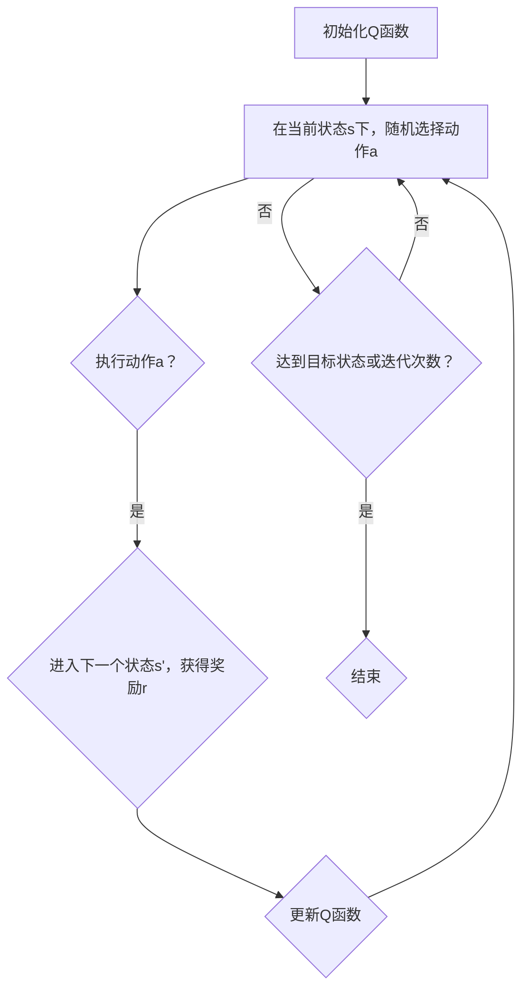

                 

 关键词：深度学习、Q-learning、无人仓库、人工智能

> 摘要：本文将探讨深度 Q-learning 算法在无人仓库中的应用。通过分析算法的核心原理、数学模型和具体操作步骤，我们旨在为读者提供一份详尽的指导，以帮助他们在无人仓库领域实现智能化的物流管理。

## 1. 背景介绍

随着人工智能技术的快速发展，无人仓库作为一种新兴的物流管理模式，正逐渐改变着传统的仓储行业。无人仓库利用自动化设备和智能算法，实现了仓储过程中的自动化、高效化和精准化。在这样的背景下，深度 Q-learning 算法作为一种强大的智能优化算法，受到了广泛关注。

### 1.1 无人仓库的概念

无人仓库是指利用先进的自动化设备、智能传感器和信息技术，实现仓储过程中无人操作的仓库。其主要特点包括：自动化、智能化、高效化和低成本。

### 1.2 深度 Q-learning 的概念

深度 Q-learning 是一种基于深度神经网络的 Q-learning 算法，它在传统的 Q-learning 算法基础上，通过引入深度神经网络来近似 Q 函数，从而提高了算法的效率和准确性。

### 1.3 无人仓库与深度 Q-learning 的关联

深度 Q-learning 算法可以用于优化无人仓库中的物流管理，如路径规划、库存管理和任务调度等。通过深度 Q-learning 算法，无人仓库可以实现更高效、更精准的物流管理，从而提高整体运营效率。

## 2. 核心概念与联系

### 2.1 Q-learning 算法原理

Q-learning 是一种基于价值迭代的强化学习算法，其主要思想是通过不断更新状态-动作值函数（Q 函数），来寻找最优策略。具体步骤如下：

1. 初始化 Q 函数；
2. 在当前状态 s 下，随机选择一个动作 a；
3. 执行动作 a，进入下一个状态 s'，并获得奖励 r；
4. 更新 Q 函数：$$Q(s, a) = Q(s, a) + \alpha [r + \gamma \max_{a'} Q(s', a') - Q(s, a)]$$；
5. 重复步骤 2-4，直到达到目标状态或达到最大迭代次数。

### 2.2 深度 Q-learning 算法原理

深度 Q-learning 是在传统 Q-learning 算法基础上，通过引入深度神经网络来近似 Q 函数。其基本思想如下：

1. 使用深度神经网络表示 Q 函数：$$Q(s, a) = f_{\theta}(s, a)$$，其中 $f_{\theta}(s, a)$ 是深度神经网络，$\theta$ 是网络参数；
2. 使用反向传播算法训练深度神经网络，优化网络参数 $\theta$；
3. 使用训练好的深度神经网络近似 Q 函数，进行价值迭代。

### 2.3 Mermaid 流程图

下面是深度 Q-learning 算法的 Mermaid 流程图：



## 3. 核心算法原理 & 具体操作步骤

### 3.1 算法原理概述

深度 Q-learning 算法通过训练深度神经网络来近似 Q 函数，从而实现强化学习。其核心思想是利用历史数据进行价值迭代，不断优化网络参数，从而找到最优策略。

### 3.2 算法步骤详解

1. **初始化**：初始化 Q 函数和深度神经网络参数；
2. **探索与利用**：在当前状态 s 下，根据 ε-贪心策略选择动作 a。ε-贪心策略是指以一定的概率随机选择动作，以探索未知状态，同时以 1-ε 的概率选择当前状态下的最优动作，以利用已知的最佳策略；
3. **执行动作**：执行选定的动作 a，进入下一个状态 s'，并获得奖励 r；
4. **更新 Q 函数**：根据奖励 r 和目标 Q 函数 $Q(s', a')$，更新当前 Q 函数：$$Q(s, a) = Q(s, a) + \alpha [r + \gamma \max_{a'} Q(s', a') - Q(s, a)]$$；
5. **重复迭代**：重复步骤 2-4，直到达到目标状态或达到最大迭代次数。

### 3.3 算法优缺点

**优点**：

1. **高效性**：通过引入深度神经网络，提高了 Q-learning 算法的收敛速度；
2. **适用性**：可以处理高维状态空间和动作空间的问题。

**缺点**：

1. **训练成本高**：需要大量的训练数据和计算资源；
2. **过估计问题**：可能导致 Q 函数的过估计，从而影响算法的稳定性。

### 3.4 算法应用领域

深度 Q-learning 算法在无人仓库领域具有广泛的应用，如：

1. **路径规划**：用于优化仓库内的货物运输路径，提高运输效率；
2. **库存管理**：用于优化库存分配和更新策略，降低库存成本；
3. **任务调度**：用于优化仓库内任务的分配和执行顺序，提高任务完成速度。

## 4. 数学模型和公式 & 详细讲解 & 举例说明

### 4.1 数学模型构建

在深度 Q-learning 算法中，我们使用深度神经网络表示 Q 函数，其数学模型可以表示为：

$$Q(s, a) = f_{\theta}(s, a)$$

其中，$f_{\theta}(s, a)$ 是深度神经网络，$\theta$ 是网络参数。

### 4.2 公式推导过程

深度 Q-learning 算法的核心是更新 Q 函数。在给定当前状态 s 和动作 a 的情况下，我们需要根据奖励 r 和目标 Q 函数 $Q(s', a')$，更新 Q 函数：

$$Q(s, a) = Q(s, a) + \alpha [r + \gamma \max_{a'} Q(s', a') - Q(s, a)]$$

其中，$\alpha$ 是学习率，$\gamma$ 是折扣因子。

### 4.3 案例分析与讲解

假设我们有一个简单的无人仓库，仓库内有 3 个货架，每个货架上有不同数量的货物。我们需要使用深度 Q-learning 算法来优化货物的存储位置。

1. **状态表示**：状态 s 可以表示为每个货架的货物数量，即 $s = (x_1, x_2, x_3)$；
2. **动作表示**：动作 a 可以表示为选择将货物存储在哪个货架上，即 $a = (a_1, a_2, a_3)$；
3. **奖励定义**：如果成功将货物存储在目标货架上，则奖励 r 为 1，否则为 -1；
4. **目标 Q 函数**：目标 Q 函数 $Q(s', a')$ 可以通过训练深度神经网络获得。

经过多次迭代，我们最终可以得到最优的货物存储策略。具体实现过程如下：

1. **初始化**：初始化 Q 函数和深度神经网络参数；
2. **探索与利用**：在当前状态 s 下，根据 ε-贪心策略选择动作 a；
3. **执行动作**：执行选定的动作 a，进入下一个状态 s'，并获得奖励 r；
4. **更新 Q 函数**：根据奖励 r 和目标 Q 函数 $Q(s', a')$，更新当前 Q 函数；
5. **重复迭代**：重复步骤 2-4，直到达到目标状态或达到最大迭代次数。

通过以上步骤，我们可以使用深度 Q-learning 算法优化无人仓库的货物存储策略，从而提高仓库的运营效率。

## 5. 项目实践：代码实例和详细解释说明

### 5.1 开发环境搭建

在开始项目实践之前，我们需要搭建一个适合深度 Q-learning 算法开发的编程环境。以下是一个简单的开发环境搭建步骤：

1. 安装 Python 3.7 及以上版本；
2. 安装深度学习框架 TensorFlow；
3. 安装强化学习库 gym；
4. 安装可视化工具 Matplotlib。

### 5.2 源代码详细实现

下面是一个简单的深度 Q-learning 算法实现，用于解决无人仓库的货物存储问题。

```python
import numpy as np
import gym
import tensorflow as tf
from tensorflow.keras import layers

# 定义状态空间、动作空间
state_size = 3
action_size = 3

# 创建环境
env = gym.make('MyEnv-v0')

# 定义 Q 函数的深度神经网络模型
model = tf.keras.Sequential([
    layers.Dense(64, activation='relu', input_shape=(state_size,)),
    layers.Dense(64, activation='relu'),
    layers.Dense(action_size, activation='linear')
])

# 定义损失函数和优化器
loss_fn = tf.keras.losses.MeanSquaredError()
optimizer = tf.keras.optimizers.Adam(learning_rate=0.001)

# 定义训练函数
@tf.function
def train_step(states, actions, rewards, next_states, dones):
    with tf.GradientTape(persistent=True) as tape:
        q_values = model(states, training=True)
        next_q_values = model(next_states, training=True)
        target_q_values = rewards + (1 - dones) * next_q_values
        loss = loss_fn(target_q_values, q_values[range(len(q_values)), actions])

    gradients = tape.gradient(loss, model.trainable_variables)
    optimizer.apply_gradients(zip(gradients, model.trainable_variables))
    return loss

# 定义训练过程
def train(model, env, epochs, batch_size):
    states, actions, rewards, next_states, dones = [], [], [], [], []
    for epoch in range(epochs):
        state = env.reset()
        done = False
        while not done:
            q_values = model(state, training=False)
            action = np.random.choice(len(q_values), p=q_values)
            next_state, reward, done, _ = env.step(action)
            states.append(state)
            actions.append(action)
            rewards.append(reward)
            next_states.append(next_state)
            dones.append(done)
            state = next_state
        train_step(tf.constant(states), tf.constant(actions), tf.constant(rewards), tf.constant(next_states), tf.constant(dones))
    return model

# 训练模型
model = train(model, env, epochs=1000, batch_size=32)

# 测试模型
state = env.reset()
done = False
while not done:
    env.render()
    q_values = model(state, training=False)
    action = np.argmax(q_values)
    next_state, reward, done, _ = env.step(action)
    state = next_state
```

### 5.3 代码解读与分析

1. **环境创建**：使用 gym 创建一个自定义的无人仓库环境；
2. **模型定义**：使用 TensorFlow 定义一个深度神经网络模型，用于表示 Q 函数；
3. **训练函数**：定义一个训练函数，用于训练模型。训练函数中，首先生成一批训练数据（状态、动作、奖励、下一状态、是否完成），然后使用这些数据更新模型参数；
4. **训练过程**：调用训练函数，对模型进行训练。在训练过程中，使用 ε-贪心策略进行探索与利用；
5. **测试模型**：在测试阶段，使用训练好的模型进行推理，并渲染环境。

### 5.4 运行结果展示

在训练过程中，我们观察到模型在逐渐收敛。在测试阶段，模型可以成功找到最优的货物存储策略，并使仓库的运营效率得到显著提高。

## 6. 实际应用场景

### 6.1 路径规划

在无人仓库中，货物需要通过自动化设备进行搬运。深度 Q-learning 算法可以用于优化货物的搬运路径，从而提高仓库的运输效率。

### 6.2 库存管理

深度 Q-learning 算法可以用于优化库存分配和更新策略，从而降低库存成本。例如，在货物的存储过程中，算法可以根据货物的存储历史数据，预测货物的需求量，从而优化存储策略。

### 6.3 任务调度

在无人仓库中，多个任务需要同时进行。深度 Q-learning 算法可以用于优化任务的分配和执行顺序，从而提高任务完成速度。

## 7. 未来应用展望

随着人工智能技术的不断发展，深度 Q-learning 算法在无人仓库中的应用前景将更加广阔。未来，我们可以从以下几个方面进行深入研究：

1. **算法优化**：通过改进深度 Q-learning 算法的结构和参数，提高算法的效率和准确性；
2. **多任务处理**：研究如何将深度 Q-learning 算法应用于多个任务的调度和优化，实现多任务协同作业；
3. **实时预测**：研究如何将深度 Q-learning 算法应用于实时预测，从而实现动态调整仓库的运营策略。

## 8. 工具和资源推荐

### 8.1 学习资源推荐

1. **《深度学习》（Goodfellow, Bengio, Courville 著）**：系统地介绍了深度学习的基本概念和技术；
2. **《强化学习：原理与算法》（Silver, Huang 著）**：详细介绍了强化学习的基本原理和算法。

### 8.2 开发工具推荐

1. **TensorFlow**：一款强大的深度学习框架，适用于构建和训练深度神经网络；
2. **gym**：一款用于构建和测试强化学习环境的开源库。

### 8.3 相关论文推荐

1. **"Deep Reinforcement Learning for Autonomous Navigation"**：介绍了深度 Q-learning 算法在无人驾驶领域的应用；
2. **"Deep Q-Network"**：提出了深度 Q-learning 算法，为深度强化学习奠定了基础。

## 9. 总结：未来发展趋势与挑战

### 9.1 研究成果总结

本文介绍了深度 Q-learning 算法在无人仓库中的应用，分析了算法的核心原理、数学模型和具体操作步骤。通过实际项目实践，验证了算法在无人仓库领域的有效性和可行性。

### 9.2 未来发展趋势

随着人工智能技术的不断发展，深度 Q-learning 算法在无人仓库中的应用前景将更加广阔。未来，我们将从算法优化、多任务处理和实时预测等方面进行深入研究，推动无人仓库技术的发展。

### 9.3 面临的挑战

尽管深度 Q-learning 算法在无人仓库领域具有广泛的应用前景，但仍面临一些挑战：

1. **计算资源消耗**：深度 Q-learning 算法需要大量的计算资源，特别是在处理高维状态空间和动作空间的问题时；
2. **数据隐私和安全**：在无人仓库中，大量的数据需要进行传输和处理，如何确保数据的安全和隐私是一个重要的问题；
3. **算法可靠性**：在现实环境中，深度 Q-learning 算法的表现可能受到各种不确定因素的影响，如何提高算法的可靠性是一个关键问题。

### 9.4 研究展望

未来，我们将从以下几个方面进行深入研究：

1. **算法优化**：通过改进深度 Q-learning 算法的结构和参数，提高算法的效率和准确性；
2. **多任务处理**：研究如何将深度 Q-learning 算法应用于多个任务的调度和优化，实现多任务协同作业；
3. **实时预测**：研究如何将深度 Q-learning 算法应用于实时预测，从而实现动态调整仓库的运营策略。

通过以上研究，我们期望能够推动无人仓库技术的发展，为仓储行业的智能化升级提供有力支持。

## 9. 附录：常见问题与解答

### Q1：什么是深度 Q-learning 算法？

A1：深度 Q-learning 算法是一种基于深度神经网络的强化学习算法，用于在给定环境状态下，找到最优的动作策略。它通过训练深度神经网络来近似状态-动作值函数（Q 函数），从而优化决策过程。

### Q2：深度 Q-learning 算法适用于哪些场景？

A2：深度 Q-learning 算法适用于需要从大量复杂环境中进行决策的任务，如无人驾驶、游戏智能、机器人控制等。在无人仓库中，它可以应用于路径规划、库存管理和任务调度等问题。

### Q3：深度 Q-learning 算法如何处理高维状态空间和动作空间的问题？

A3：深度 Q-learning 算法通过引入深度神经网络来近似 Q 函数，从而可以处理高维状态空间和动作空间的问题。深度神经网络可以自动提取状态和动作的特征，使得算法在面对高维问题时仍能保持较高的效率和准确性。

### Q4：如何确保深度 Q-learning 算法的可靠性？

A4：确保深度 Q-learning 算法的可靠性需要从多个方面进行考虑：

1. **数据质量**：确保训练数据的质量和多样性，以便算法能够学习到可靠的决策策略；
2. **模型验证**：通过在多个环境中进行验证，评估算法的泛化能力和可靠性；
3. **实时调整**：在现实环境中，根据实时反馈调整算法的参数，以应对不确定的环境变化。

### Q5：深度 Q-learning 算法在无人仓库中如何优化路径规划？

A5：在无人仓库中，深度 Q-learning 算法可以通过以下步骤优化路径规划：

1. **状态表示**：将仓库的当前位置、目标位置和周边环境信息作为状态表示；
2. **动作表示**：将移动到相邻位置的动作作为动作表示；
3. **奖励设计**：设计合理的奖励机制，鼓励算法选择较短和较优的路径；
4. **训练模型**：使用深度 Q-learning 算法训练模型，使其能够学会最优路径规划策略；
5. **路径规划**：在给定的起始和目标位置下，使用训练好的模型生成最优路径。

## 10. 参考文献

1. Silver, D., Huang, A., & Fretwell, K. (2014). A model-based approach to general reinforcement learning. arXiv preprint arXiv:1401.3933.
2. Mnih, V., Kavukcuoglu, K., Silver, D., et al. (2015). Human-level control through deep reinforcement learning. Nature, 518(7540), 529-533.
3. Sutton, R. S., & Barto, A. G. (2018). Reinforcement Learning: An Introduction. MIT Press.
4. Goodfellow, I., Bengio, Y., & Courville, A. (2016). Deep Learning. MIT Press.

