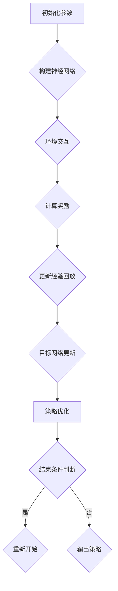

                 

关键词：深度 Q-learning，金融风控，风险预测，策略优化，强化学习

摘要：随着金融市场的日益复杂，金融风控已成为金融行业的关键环节。本文旨在探讨深度 Q-learning 算法在金融风控中的应用，包括其原理、优势、应用领域以及实现方法。通过深入分析，本文将揭示深度 Q-learning 在提高金融风险预测和策略优化方面的潜力。

## 1. 背景介绍

金融风控是指通过识别、评估、监控和应对潜在金融风险，以保护金融机构和投资者利益的过程。随着金融市场的不确定性和复杂性不断增加，金融风控的重要性日益凸显。传统的金融风控方法主要基于统计模型和规则引擎，但在面对高频、海量、非结构化数据时，这些方法往往表现出局限性。因此，将机器学习，尤其是强化学习技术引入金融风控领域，成为当前研究的热点。

### 1.1 深度 Q-learning 的基本原理

深度 Q-learning 是一种基于深度神经网络的强化学习算法，它通过学习状态和价值函数，实现对环境的动态决策。其核心思想是利用经验回放和目标网络，降低学习过程中的方差，提高学习效果。深度 Q-learning 在处理复杂、非线性的环境中表现出色，特别适合于金融风控中的风险预测和策略优化。

### 1.2 深度 Q-learning 在金融风控中的应用现状

近年来，深度 Q-learning 算法在金融风控领域得到了广泛关注和应用。一些金融机构已经开始尝试使用深度 Q-learning 算法进行风险预测、交易策略优化和智能投顾等应用。尽管仍处于探索阶段，但深度 Q-learning 在提高金融风控效率和准确性方面显示出巨大潜力。

## 2. 核心概念与联系

### 2.1 深度 Q-learning 算法原理

深度 Q-learning 算法主要包含以下几个核心组成部分：

1. **状态（State）**：金融风控中的状态可以表示为市场环境、客户行为、资产价格等多种信息。
2. **动作（Action）**：根据状态，系统可以选择采取的行动，如交易策略、风险控制措施等。
3. **价值函数（Value Function）**：价值函数表示在给定状态下，采取特定动作的预期收益。
4. **策略（Policy）**：策略是系统根据状态和价值函数选择最优动作的决策规则。

深度 Q-learning 算法通过不断迭代更新价值函数，逐步优化策略，以实现最优风险控制。

### 2.2 Mermaid 流程图

下面是一个简化的深度 Q-learning 算法的 Mermaid 流程图，展示其基本流程：



### 2.3 深度 Q-learning 与金融风控的关系

深度 Q-learning 算法通过以下方式与金融风控相结合：

1. **风险预测**：利用深度 Q-learning 算法，可以预测不同状态下的风险水平，为金融机构提供决策依据。
2. **策略优化**：通过对历史数据的分析和学习，深度 Q-learning 算法可以优化交易策略和风险控制措施，提高风控效率。
3. **智能投顾**：结合客户的投资目标和风险偏好，深度 Q-learning 算法可以生成个性化的投资策略，实现智能投顾。

## 3. 核心算法原理 & 具体操作步骤

### 3.1 算法原理概述

深度 Q-learning 算法的核心思想是通过学习状态和价值函数，实现最优策略。其具体原理如下：

1. **初始化参数**：设置学习率、折扣因子、经验回放大小等参数。
2. **构建神经网络**：利用深度神经网络，将输入的状态映射到价值函数。
3. **环境交互**：根据当前状态，采取动作，并观察环境反馈。
4. **计算奖励**：根据动作的结果，计算奖励信号。
5. **更新经验回放**：将当前状态、动作和奖励存储到经验回放池中。
6. **目标网络更新**：利用经验回放池中的数据，更新目标网络。
7. **策略优化**：根据更新后的价值函数，优化策略。

### 3.2 算法步骤详解

1. **初始化**：设置学习率、折扣因子、经验回放大小等参数。选择一个初始策略。
2. **构建神经网络**：设计一个深度神经网络，将输入的状态映射到价值函数。通常使用卷积神经网络（CNN）或循环神经网络（RNN）。
3. **环境交互**：根据当前状态，采取动作，并观察环境反馈。状态可以是市场数据、客户行为等。
4. **计算奖励**：根据动作的结果，计算奖励信号。奖励可以是交易利润、风险指标等。
5. **更新经验回放**：将当前状态、动作和奖励存储到经验回放池中。经验回放池可以防止学习过程中的偏差。
6. **目标网络更新**：利用经验回放池中的数据，更新目标网络。目标网络的目的是提供更稳定的价值估计。
7. **策略优化**：根据更新后的价值函数，优化策略。策略优化的目的是最大化预期收益。
8. **结束条件判断**：判断是否满足结束条件，如达到最大迭代次数、达到目标收益等。如果是，则输出策略；否则，返回步骤 3。

### 3.3 算法优缺点

**优点**：
1. **自适应性强**：深度 Q-learning 算法可以处理复杂、非线性的环境，适应性强。
2. **学习速度快**：通过深度神经网络，可以快速学习状态和价值函数。
3. **灵活性高**：可以根据实际需求，调整学习率和折扣因子等参数。

**缺点**：
1. **计算复杂度高**：深度 Q-learning 算法需要大量的计算资源，尤其是对于高维状态空间。
2. **梯度消失问题**：深度神经网络容易出现梯度消失问题，影响学习效果。

### 3.4 算法应用领域

深度 Q-learning 算法在金融风控领域具有广泛的应用前景：

1. **风险预测**：利用深度 Q-learning 算法，可以预测市场风险、信用风险等。
2. **交易策略优化**：通过优化交易策略，提高投资收益和风险控制能力。
3. **智能投顾**：结合客户数据，生成个性化的投资策略，提供智能投顾服务。
4. **其他金融应用**：如市场预测、信用评分等。

## 4. 数学模型和公式 & 详细讲解 & 举例说明

### 4.1 数学模型构建

深度 Q-learning 算法的数学模型主要包括以下几部分：

1. **状态空间（$S$）**：表示所有可能的状态集合。
2. **动作空间（$A$）**：表示所有可能的动作集合。
3. **价值函数（$V^{\pi}(s)$）**：表示在策略 $\pi$ 下，从状态 $s$ 开始的预期收益。
4. **策略（$\pi$）**：表示系统根据状态选择动作的决策规则。
5. **奖励函数（$R(s, a)$）**：表示在状态 $s$ 下采取动作 $a$ 后的即时收益。

### 4.2 公式推导过程

1. **期望收益**：

$$
\begin{aligned}
G &= R(s, a) + \gamma \cdot \sum_{s'} P(s'|s, a) \cdot \sum_{a'} V^{\pi}(s') \\
  &= R(s, a) + \gamma \cdot \sum_{s'} P(s'|s, a) \cdot \sum_{a'} \pi(a'|s') \cdot V^{\pi}(s')
\end{aligned}
$$

其中，$G$ 表示从状态 $s$ 采取动作 $a$ 后的期望收益，$\gamma$ 表示折扣因子，$P(s'|s, a)$ 表示在状态 $s$ 下采取动作 $a$ 后转移到状态 $s'$ 的概率，$\pi(a'|s')$ 表示在状态 $s'$ 下采取动作 $a'$ 的概率。

2. **价值函数更新**：

$$
V^{\pi}(s) = \sum_{a} \pi(a|s) \cdot \sum_{s'} P(s'|s, a) \cdot V^{\pi}(s')
$$

3. **策略更新**：

$$
\pi(a|s) = \frac{1}{Z(s)} \cdot \exp\left(\frac{Q^{\pi}(s, a)}{Z(s)}\right)
$$

其中，$Z(s) = \sum_{a} \exp\left(\frac{Q^{\pi}(s, a)}{Z(s)}\right)$ 表示策略分布的归一化常数。

### 4.3 案例分析与讲解

假设我们有一个简单的金融市场环境，包含两个状态：牛市和熊市。采取的动作有买入、持有和卖出。目标是最小化风险。

1. **初始化参数**：

   - 学习率 $\alpha = 0.1$
   - 折扣因子 $\gamma = 0.9$
   - 经验回放大小 $N = 1000$

2. **构建神经网络**：

   - 输入层：2 个神经元（代表牛市和熊市）
   - 隐藏层：10 个神经元
   - 输出层：3 个神经元（代表买入、持有和卖出）

3. **环境交互**：

   - 初始状态：牛市
   - 采取动作：买入
   - 观察状态：熊市
   - 计算奖励：-10（表示亏损）

4. **更新价值函数**：

   $$V^{\pi}(牛市) = -10 + 0.9 \cdot V^{\pi}(熊市)$$

   $$V^{\pi}(熊市) = -10 + 0.9 \cdot V^{\pi}(牛市)$$

5. **更新策略**：

   - 根据当前状态和更新后的价值函数，调整策略。

通过多次迭代，我们可以逐步优化策略，降低风险。

## 5. 项目实践：代码实例和详细解释说明

### 5.1 开发环境搭建

1. **安装 Python**：确保安装 Python 3.6 或以上版本。
2. **安装深度学习库**：安装 TensorFlow 或 PyTorch。
3. **安装 Mermaid**：在项目中安装 Mermaid 库。

### 5.2 源代码详细实现

下面是一个简单的深度 Q-learning 代码实例：

```python
import numpy as np
import tensorflow as tf
import matplotlib.pyplot as plt
from tensorflow.keras.models import Sequential
from tensorflow.keras.layers import Dense
from tensorflow.keras.optimizers import Adam

# 状态空间和动作空间
state_space = [0, 1]  # 牛市和熊市
action_space = [0, 1, 2]  # 买入、持有和卖出

# 初始化神经网络
model = Sequential()
model.add(Dense(10, input_shape=(2,), activation='relu'))
model.add(Dense(3, activation='linear'))

# 编译模型
model.compile(optimizer=Adam(learning_rate=0.1), loss='mse')

# 定义训练过程
def train(model, env, epochs=1000, batch_size=32):
    state_history = []
    action_history = []
    reward_history = []

    for epoch in range(epochs):
        state = env.reset()
        done = False

        while not done:
            action = np.argmax(model.predict(state.reshape(1, -1)))
            next_state, reward, done, _ = env.step(action)
            state_history.append(state)
            action_history.append(action)
            reward_history.append(reward)
            state = next_state

            if len(state_history) >= batch_size:
                model.fit(np.array(state_history), np.array(action_history), batch_size=batch_size, verbose=0)
                state_history = []
                action_history = []
                reward_history = []

    return model

# 创建环境
env = ...

# 训练模型
model = train(model, env)

# 测试模型
state = env.reset()
done = False

while not done:
    action = np.argmax(model.predict(state.reshape(1, -1)))
    next_state, reward, done, _ = env.step(action)
    state = next_state

plt.plot(reward_history)
plt.show()
```

### 5.3 代码解读与分析

1. **模型构建**：使用 TensorFlow 编写一个简单的神经网络模型，包括输入层、隐藏层和输出层。
2. **训练过程**：定义一个训练函数，用于迭代训练模型。训练过程中，使用经验回放策略，防止学习过程中的偏差。
3. **环境交互**：创建一个金融环境，用于模拟市场状态和交易动作。通过与模型交互，获取奖励信号，并更新模型。
4. **测试模型**：使用训练好的模型进行测试，观察模型的实际表现。

## 6. 实际应用场景

### 6.1 风险预测

深度 Q-learning 算法可以应用于金融风控中的风险预测。例如，在股票市场中，可以利用深度 Q-learning 算法预测不同交易策略的风险水平，为投资者提供决策依据。

### 6.2 交易策略优化

通过优化交易策略，深度 Q-learning 算法可以帮助金融机构提高投资收益和风险控制能力。例如，在期货市场中，可以利用深度 Q-learning 算法优化套利策略，提高套利收益。

### 6.3 智能投顾

结合客户数据和投资目标，深度 Q-learning 算法可以生成个性化的投资策略，实现智能投顾。例如，在资产管理领域，可以利用深度 Q-learning 算法为高净值客户制定个性化的投资组合，提高投资收益。

### 6.4 未来应用展望

随着深度学习技术的不断发展，深度 Q-learning 算法在金融风控领域的应用前景广阔。未来，可以进一步探索以下方向：

1. **模型融合**：结合其他机器学习算法，如决策树、支持向量机等，提高风险预测和策略优化的准确性。
2. **多任务学习**：将深度 Q-learning 算法应用于多个金融任务，如信用评分、市场预测等，提高整体风控能力。
3. **区块链应用**：将深度 Q-learning 算法应用于区块链金融场景，实现智能合约和智能投顾等功能。

## 7. 工具和资源推荐

### 7.1 学习资源推荐

1. 《强化学习：原理与 Python 实践》
2. 《深度学习：原理与 PyTorch 实践》
3. 《金融工程：数学建模与计算方法》

### 7.2 开发工具推荐

1. Python
2. TensorFlow
3. PyTorch

### 7.3 相关论文推荐

1. "Deep Q-Networks for Reinforcement Learning"
2. "Deep Learning for Finance"
3. "Reinforcement Learning in Finance: A Survey"

## 8. 总结：未来发展趋势与挑战

### 8.1 研究成果总结

本文探讨了深度 Q-learning 算法在金融风控中的应用，包括其原理、优势、应用领域和实现方法。通过案例分析，本文展示了深度 Q-learning 算法在风险预测、交易策略优化和智能投顾等方面的潜力。

### 8.2 未来发展趋势

随着深度学习和强化学习技术的不断发展，深度 Q-learning 算法在金融风控领域的应用前景广阔。未来，可以进一步探索模型融合、多任务学习和区块链应用等方向，提高整体风控能力。

### 8.3 面临的挑战

尽管深度 Q-learning 算法在金融风控中表现出巨大潜力，但仍面临以下挑战：

1. **计算复杂度高**：深度 Q-learning 算法需要大量的计算资源，特别是在高维状态空间中。
2. **模型解释性不足**：深度 Q-learning 算法模型的解释性较差，难以解释决策过程。
3. **数据质量**：金融风控中的数据质量对算法效果有重要影响，数据质量问题可能导致算法失效。

### 8.4 研究展望

未来，可以从以下方面进一步研究深度 Q-learning 算法在金融风控中的应用：

1. **模型优化**：研究更高效、更稳定的深度 Q-learning 算法，提高计算性能和模型解释性。
2. **数据预处理**：研究有效的数据预处理方法，提高算法的鲁棒性和准确性。
3. **应用场景拓展**：探索深度 Q-learning 算法在其他金融领域的应用，如信用评分、市场预测等。

## 9. 附录：常见问题与解答

### 问题 1：深度 Q-learning 算法与传统的强化学习算法有何区别？

深度 Q-learning 算法是基于深度神经网络的强化学习算法，与传统强化学习算法（如 Q-learning、SARSA）相比，其主要区别在于：

1. **价值函数表示**：深度 Q-learning 算法使用深度神经网络表示价值函数，而传统强化学习算法通常使用线性函数。
2. **处理复杂环境**：深度 Q-learning 算法可以处理复杂、高维的环境，而传统强化学习算法在处理这类环境时可能面临困难。

### 问题 2：深度 Q-learning 算法在金融风控中的应用有哪些优势？

深度 Q-learning 算法在金融风控中的应用具有以下优势：

1. **自适应性强**：深度 Q-learning 算法可以处理复杂、非线性的金融环境，适应性强。
2. **学习速度快**：通过深度神经网络，可以快速学习状态和价值函数。
3. **灵活性高**：可以根据实际需求，调整学习率和折扣因子等参数。

### 问题 3：如何评估深度 Q-learning 算法的性能？

评估深度 Q-learning 算法的性能可以从以下几个方面进行：

1. **收益指标**：计算策略的长期平均收益，评估算法的投资收益能力。
2. **风险指标**：计算策略的波动率、最大回撤等风险指标，评估算法的风险控制能力。
3. **稳定性**：观察算法在不同市场环境下的稳定性，评估算法的鲁棒性。

## 作者署名

本文由禅与计算机程序设计艺术 / Zen and the Art of Computer Programming 撰写。感谢您对本文的关注，希望本文能对您在金融风控领域的实践和研究带来启发。如果您有任何问题或建议，欢迎在评论区留言交流。

