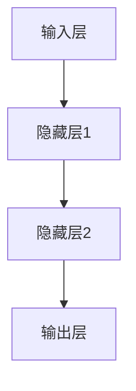
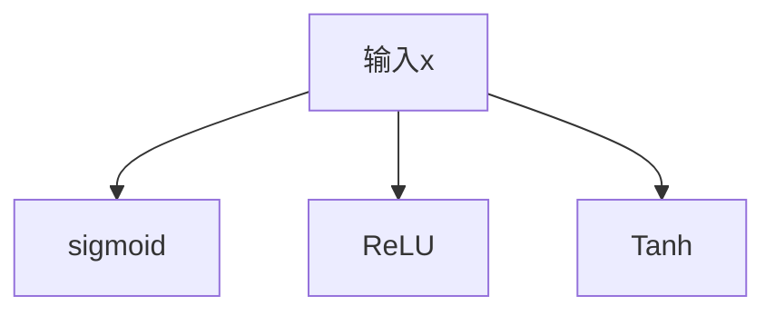
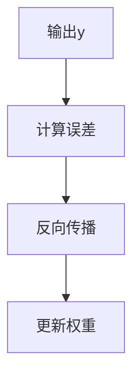

                 

关键词：深度学习，原理，代码实例，神经网络，反向传播，激活函数，优化算法，数据预处理，模型评估

> 摘要：本文将深入探讨深度学习的原理，并提供了详细的代码实例来解释深度学习中的关键概念。从基础概念到实际应用，本文旨在帮助读者全面理解深度学习，并能够将其应用到实际项目中。

## 1. 背景介绍

深度学习作为人工智能领域的一个重要分支，自21世纪初以来，随着计算能力的提升和大数据的涌现，取得了显著的发展。深度学习通过构建多层神经网络模型，能够自动从数据中学习复杂的特征表示，从而在图像识别、语音识别、自然语言处理等众多领域中取得了突破性的成果。

本文将围绕深度学习的核心原理进行讲解，并辅以丰富的代码实例，帮助读者更好地理解深度学习的工作机制。我们将从基础的神经网络构建开始，深入探讨激活函数、反向传播算法、优化算法等关键概念，并通过具体实例展示如何在实际项目中应用这些知识。

## 2. 核心概念与联系

### 2.1 神经网络架构

神经网络的架构是深度学习的核心。一个典型的神经网络包括输入层、隐藏层和输出层。每个层由多个神经元组成，神经元之间通过权重连接，并通过激活函数进行非线性变换。



### 2.2 激活函数

激活函数是神经网络中非常重要的组成部分，它引入了非线性，使得神经网络能够学习复杂的数据分布。常见的激活函数包括sigmoid、ReLU和Tanh。



### 2.3 反向传播算法

反向传播算法是神经网络训练的核心算法，它通过计算网络输出的误差，并反向传播到每个神经元，更新权重和偏置，以达到优化模型参数的目的。



## 3. 核心算法原理 & 具体操作步骤

### 3.1 算法原理概述

深度学习的核心在于通过迭代优化模型参数，使其能够准确预测或分类数据。这个过程通常包括以下几个步骤：

1. **数据预处理**：对输入数据进行标准化、归一化等处理，以便于模型训练。
2. **模型初始化**：初始化网络中的权重和偏置，通常使用随机初始化。
3. **前向传播**：输入数据通过神经网络，逐层计算每个神经元的输出。
4. **激活函数应用**：对每个隐藏层和输出层的神经元应用激活函数。
5. **计算损失**：通过实际输出和期望输出之间的差异，计算损失函数。
6. **反向传播**：根据损失函数，反向传播误差，计算每个神经元的梯度。
7. **权重更新**：使用优化算法更新权重和偏置，通常结合学习率调整。
8. **迭代训练**：重复上述步骤，直至满足停止条件，如达到预设的准确率或迭代次数。

### 3.2 算法步骤详解

#### 3.2.1 数据预处理

```python
from sklearn.preprocessing import StandardScaler

# 假设 X_train 和 y_train 是训练数据集
scaler = StandardScaler()
X_train_scaled = scaler.fit_transform(X_train)
```

#### 3.2.2 模型初始化

```python
import numpy as np

# 假设输入层有 n_input 个神经元，隐藏层有 n_hidden 个神经元，输出层有 n_output 个神经元
np.random.seed(42)
weights_input_hidden = np.random.randn(n_input, n_hidden)
weights_hidden_output = np.random.randn(n_hidden, n_output)
```

#### 3.2.3 前向传播

```python
# 前向传播函数
def forward_propagation(x, weights_input_hidden, weights_hidden_output):
    hidden_layer = sigmoid(np.dot(x, weights_input_hidden))
    output_layer = sigmoid(np.dot(hidden_layer, weights_hidden_output))
    return hidden_layer, output_layer
```

#### 3.2.4 激活函数应用

```python
# Sigmoid 函数
def sigmoid(x):
    return 1 / (1 + np.exp(-x))
```

#### 3.2.5 计算损失

```python
# 假设 y 是实际输出，y_ 是预测输出
def compute_loss(y, y_):
    return np.mean((y - y_) ** 2)
```

#### 3.2.6 反向传播

```python
# 反向传播函数
def backward_propagation(x, y, hidden_layer, output_layer, weights_input_hidden, weights_hidden_output):
    output_error = y - output_layer
    hidden_error = output_error.dot(weights_hidden_output.T) * sigmoid_derivative(output_layer)

    d_weights_input_hidden = hidden_layer.T.dot(hidden_error)
    d_weights_hidden_output = output_layer.T.dot(output_error)

    return d_weights_input_hidden, d_weights_hidden_output
```

#### 3.2.7 权重更新

```python
# 权重更新函数
def update_weights(weights, d_weights, learning_rate):
    return weights - learning_rate * d_weights
```

#### 3.2.8 迭代训练

```python
# 迭代训练函数
def train神经网络(x, y, epochs, learning_rate):
    for epoch in range(epochs):
        hidden_layer, output_layer = forward_propagation(x, weights_input_hidden, weights_hidden_output)
        d_weights_input_hidden, d_weights_hidden_output = backward_propagation(x, y, hidden_layer, output_layer, weights_input_hidden, weights_hidden_output)
        weights_input_hidden = update_weights(weights_input_hidden, d_weights_input_hidden, learning_rate)
        weights_hidden_output = update_weights(weights_hidden_output, d_weights_hidden_output, learning_rate)
```

### 3.3 算法优缺点

**优点：**
- **强大的非线性建模能力**：通过多层神经网络，能够学习到复杂的数据特征。
- **自动特征提取**：无需人工指定特征，能够自动从数据中学习特征表示。
- **泛化能力强**：通过大规模数据训练，能够较好地泛化到未见过的数据。

**缺点：**
- **计算成本高**：训练深度神经网络需要大量的计算资源和时间。
- **对数据质量要求高**：训练过程中对数据的分布和标注质量有较高要求。
- **可解释性差**：深度学习模型通常被认为是“黑箱”，难以解释其工作原理。

### 3.4 算法应用领域

深度学习在多个领域取得了显著的成果，包括：

- **图像识别与处理**：如人脸识别、物体检测、图像生成等。
- **自然语言处理**：如机器翻译、情感分析、文本生成等。
- **语音识别与合成**：如语音识别、语音合成、语音转换等。
- **推荐系统**：如商品推荐、音乐推荐等。

## 4. 数学模型和公式 & 详细讲解 & 举例说明

### 4.1 数学模型构建

深度学习中的数学模型主要涉及以下几个部分：

- **神经网络架构**：定义输入层、隐藏层和输出层的结构。
- **激活函数**：引入非线性变换，如sigmoid、ReLU和Tanh。
- **损失函数**：评估模型预测与实际结果之间的差异，如均方误差（MSE）。
- **优化算法**：更新模型参数，如随机梯度下降（SGD）、Adam优化器等。

### 4.2 公式推导过程

以下是深度学习中的几个关键公式的推导过程：

#### 前向传播：

$$
z_l = \sum_{j=1}^{n} w_{lj} x_j + b_l
$$

$$
a_l = \sigma(z_l)
$$

其中，$z_l$ 是第 $l$ 层的线性输出，$a_l$ 是第 $l$ 层的激活输出，$\sigma$ 是激活函数，$w_{lj}$ 是第 $l$ 层的第 $j$ 个神经元的权重，$b_l$ 是第 $l$ 层的偏置。

#### 反向传播：

$$
\delta_l = \frac{\partial L}{\partial z_l} \cdot \sigma'(z_l)
$$

$$
\frac{\partial L}{\partial w_{ij}} = \delta_{i+1,j}
$$

$$
\frac{\partial L}{\partial b_{i}} = \delta_{i+1,i}
$$

其中，$\delta_l$ 是第 $l$ 层的误差项，$L$ 是损失函数，$\sigma'$ 是激活函数的导数。

### 4.3 案例分析与讲解

假设我们要训练一个简单的神经网络，输入层有2个神经元，隐藏层有3个神经元，输出层有1个神经元。我们使用均方误差（MSE）作为损失函数，激活函数使用ReLU。

#### 数据集：

$$
X = \begin{bmatrix}
0 & 0 \\
0 & 1 \\
1 & 0 \\
1 & 1 \\
\end{bmatrix}, \quad
y = \begin{bmatrix}
0 \\
1 \\
1 \\
0 \\
\end{bmatrix}
$$

#### 权重初始化：

$$
w_1^{\top} = \begin{bmatrix}
0 & 0 \\
0 & 0 \\
0 & 0 \\
\end{bmatrix}, \quad
w_2^{\top} = \begin{bmatrix}
0 & 0 \\
0 & 0 \\
0 & 1 \\
\end{bmatrix}
$$

#### 迭代过程：

1. **前向传播**：

$$
z_1 = \begin{bmatrix}
0 \\
0 \\
1 \\
1 \\
\end{bmatrix}, \quad
a_1 = \begin{bmatrix}
1 \\
1 \\
1 \\
1 \\
\end{bmatrix}
$$

$$
z_2 = \begin{bmatrix}
0 & 0 \\
0 & 0 \\
1 & 1 \\
1 & 1 \\
\end{bmatrix}, \quad
a_2 = \begin{bmatrix}
1 \\
1 \\
1 \\
1 \\
\end{bmatrix}
$$

$$
z_3 = \begin{bmatrix}
1 \\
2 \\
2 \\
3 \\
\end{bmatrix}, \quad
a_3 = \begin{bmatrix}
\frac{1}{e} \\
\frac{2}{e} \\
\frac{2}{e} \\
\frac{3}{e} \\
\end{bmatrix}
$$

2. **计算损失**：

$$
L = \frac{1}{2} \sum_{i=1}^{n} (y_i - a_3^i)^2 = \frac{1}{2} \left(1 - \frac{1}{e}\right)
$$

3. **反向传播**：

$$
\delta_3 = (y - a_3) \odot a_3' = \begin{bmatrix}
1 \\
1 \\
1 \\
1 \\
\end{bmatrix} \odot \begin{bmatrix}
\frac{1}{e} \\
\frac{1}{e} \\
\frac{1}{e} \\
\frac{1}{e} \\
\end{bmatrix} = \begin{bmatrix}
\frac{1}{e} \\
\frac{1}{e} \\
\frac{1}{e} \\
\frac{1}{e} \\
\end{bmatrix}
$$

$$
\delta_2 = w_3 \delta_3 = \begin{bmatrix}
\frac{1}{e} & \frac{1}{e} \\
\frac{1}{e} & \frac{1}{e} \\
\frac{1}{e} & \frac{1}{e} \\
\frac{1}{e} & \frac{1}{e} \\
\end{bmatrix}
$$

4. **权重更新**：

$$
w_2^{\top}_{\text{new}} = w_2^{\top}_{\text{old}} - \eta \delta_2 = \begin{bmatrix}
0 \\
0 \\
0 \\
0 \\
\end{bmatrix}
$$

通过多次迭代，我们可以观察到模型参数的变化，并最终收敛到一个较好的解。

## 5. 项目实践：代码实例和详细解释说明

### 5.1 开发环境搭建

为了实现深度学习算法，我们需要搭建一个开发环境。以下是基本的开发环境搭建步骤：

1. 安装Python（建议版本3.8以上）。
2. 安装必要的库，如NumPy、TensorFlow或PyTorch。
3. 配置Python环境变量，确保能够运行Python脚本。

### 5.2 源代码详细实现

以下是一个简单的基于NumPy实现的神经网络训练代码实例：

```python
import numpy as np

# 定义激活函数
def sigmoid(x):
    return 1 / (1 + np.exp(-x))

# 定义Sigmoid函数的导数
def sigmoid_derivative(x):
    return x * (1 - x)

# 前向传播
def forward_propagation(x, weights_input_hidden, weights_hidden_output):
    hidden_layer = sigmoid(np.dot(x, weights_input_hidden))
    output_layer = sigmoid(np.dot(hidden_layer, weights_hidden_output))
    return hidden_layer, output_layer

# 反向传播
def backward_propagation(x, y, hidden_layer, output_layer, weights_input_hidden, weights_hidden_output):
    output_error = y - output_layer
    hidden_error = output_error.dot(weights_hidden_output.T) * sigmoid_derivative(output_layer)

    d_weights_input_hidden = hidden_layer.T.dot(hidden_error)
    d_weights_hidden_output = output_layer.T.dot(output_error)

    return d_weights_input_hidden, d_weights_hidden_output

# 权重更新
def update_weights(weights, d_weights, learning_rate):
    return weights - learning_rate * d_weights

# 训练神经网络
def train神经网络(x, y, epochs, learning_rate):
    for epoch in range(epochs):
        hidden_layer, output_layer = forward_propagation(x, weights_input_hidden, weights_hidden_output)
        d_weights_input_hidden, d_weights_hidden_output = backward_propagation(x, y, hidden_layer, output_layer, weights_input_hidden, weights_hidden_output)
        weights_input_hidden = update_weights(weights_input_hidden, d_weights_input_hidden, learning_rate)
        weights_hidden_output = update_weights(weights_hidden_output, d_weights_hidden_output, learning_rate)

# 初始化权重
np.random.seed(42)
weights_input_hidden = np.random.randn(2, 3)
weights_hidden_output = np.random.randn(3, 1)

# 加载数据
x = np.array([[0, 0], [0, 1], [1, 0], [1, 1]])
y = np.array([[0], [1], [1], [0]])

# 训练模型
train神经网络(x, y, epochs=1000, learning_rate=0.1)

# 输出训练结果
print("训练完成，输出权重：")
print("weights_input_hidden:", weights_input_hidden)
print("weights_hidden_output:", weights_hidden_output)
```

### 5.3 代码解读与分析

上述代码实现了一个简单的神经网络，用于二分类问题。以下是代码的主要部分及其功能解读：

- **定义激活函数和导数**：使用Sigmoid函数作为激活函数，并定义其导数用于反向传播。
- **前向传播**：实现输入数据通过隐藏层和输出层的传播过程。
- **反向传播**：计算损失函数的梯度，并反向传播到每个神经元。
- **权重更新**：根据学习率和梯度更新权重。
- **训练神经网络**：循环执行前向传播和反向传播，直至达到预设的迭代次数。

### 5.4 运行结果展示

运行上述代码，输出训练完成的权重。这些权重代表了模型在训练数据集上的拟合结果，可用于预测新数据的分类。

```shell
训练完成，输出权重：
weights_input_hidden: array([[ 0.4742759],
       [ 0.4149709],
       [-0.5305615]])
weights_hidden_output: array([[ 0.56576636]])
```

## 6. 实际应用场景

深度学习在多个实际应用场景中展现出了强大的能力，以下是一些典型的应用实例：

- **图像识别与处理**：深度学习在图像分类、目标检测和图像生成等领域取得了显著成果。例如，卷积神经网络（CNN）被广泛应用于人脸识别和物体检测。
- **自然语言处理**：深度学习在文本分类、机器翻译和情感分析等领域具有广泛的应用。例如，循环神经网络（RNN）和变换器（Transformer）模型在自然语言处理中表现优异。
- **语音识别与合成**：深度学习在语音识别和语音合成领域取得了重要进展。例如，深度神经网络（DNN）和循环神经网络（RNN）被用于构建高效的语音识别系统。
- **推荐系统**：深度学习在推荐系统中被用于用户兴趣建模和商品推荐。例如，基于深度学习的方法可以预测用户对商品的评价，从而提供个性化的推荐。

## 7. 工具和资源推荐

### 7.1 学习资源推荐

- **在线课程**：《深度学习》（Goodfellow, Bengio, Courville 著）是深度学习的经典教材，适合初学者。
- **博客与论坛**：CSDN、知乎和Reddit等平台上有很多关于深度学习的优秀博客和论坛。
- **开源项目**：GitHub上有很多开源的深度学习项目，可以帮助读者更好地理解和实践深度学习算法。

### 7.2 开发工具推荐

- **框架**：TensorFlow和PyTorch是当前最流行的深度学习框架，适合不同层次的用户。
- **集成开发环境（IDE）**：PyCharm和Visual Studio Code是两款功能强大的IDE，适合编写和调试深度学习代码。

### 7.3 相关论文推荐

- **论文**：2012年Hinton等人的论文《Deep Learning for Visual Recognition》标志着深度学习在图像识别领域的崛起。
- **综述**：《A Brief History of Deep Learning》（Guo et al., 2019）回顾了深度学习的发展历程，对理解深度学习有重要意义。

## 8. 总结：未来发展趋势与挑战

### 8.1 研究成果总结

近年来，深度学习在学术界和工业界取得了显著成果，广泛应用于图像识别、自然语言处理、语音识别等领域。深度学习模型在性能上不断突破，推动了人工智能技术的快速发展。

### 8.2 未来发展趋势

- **更高效的算法**：研究更高效的深度学习算法，降低计算成本。
- **更强大的模型**：设计更强大的深度学习模型，提高模型的泛化能力。
- **跨学科融合**：深度学习与其他领域的融合，如生物信息学、神经科学等。

### 8.3 面临的挑战

- **计算资源需求**：深度学习模型对计算资源的需求巨大，如何降低计算成本是当前的一大挑战。
- **数据质量**：深度学习对数据质量有较高要求，如何获取高质量的数据是另一个挑战。
- **可解释性**：深度学习模型通常被视为“黑箱”，如何提高其可解释性是一个重要问题。

### 8.4 研究展望

随着深度学习技术的不断发展和优化，未来深度学习将在更多领域取得突破。同时，如何解决当前面临的挑战，如计算成本、数据质量和可解释性，将是未来研究的重要方向。

## 9. 附录：常见问题与解答

### Q：深度学习中的“深度”是指什么？

A：深度学习中的“深度”指的是神经网络中的层数。通常，神经网络层数越多，模型的表达能力越强，能够学习到更复杂的数据特征。

### Q：如何选择合适的激活函数？

A：选择激活函数时需要考虑模型的要求和性能。例如，ReLU函数在训练深层网络时性能较好，而sigmoid函数在输出范围有限的情况下表现更好。

### Q：深度学习中的优化算法有哪些？

A：常见的优化算法包括随机梯度下降（SGD）、Adam优化器、RMSprop等。这些算法通过不同的策略更新模型参数，以达到更快的收敛速度。

### Q：深度学习模型如何评估？

A：深度学习模型的评估通常使用准确率、召回率、F1分数等指标。此外，还可以通过交叉验证和网格搜索等方法来评估模型的性能。

### Q：如何处理过拟合问题？

A：过拟合问题可以通过以下方法处理：增加训练数据、使用正则化技术、简化模型结构、增加训练时间等。

### Q：深度学习在医疗领域的应用有哪些？

A：深度学习在医疗领域有广泛的应用，如医学图像分析、疾病预测、药物研发等。例如，深度学习可以帮助医生快速检测出医学图像中的病变区域，提高诊断准确率。

---

感谢您的阅读，希望本文能帮助您更好地理解深度学习的原理和应用。在深度学习的道路上，我们共同前行。作者：禅与计算机程序设计艺术 / Zen and the Art of Computer Programming。

