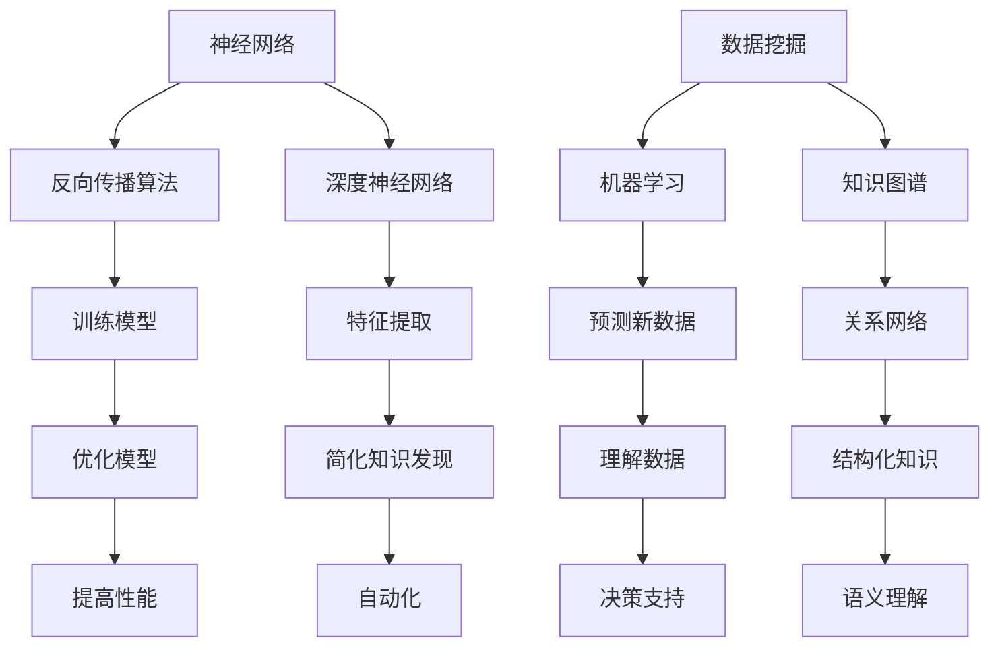

                 

关键词：深度学习，知识发现，人工智能，融合，算法原理，数学模型，项目实践，未来展望

## 摘要

本文旨在探讨深度学习与知识发现的融合，分析这两大领域在人工智能领域的交汇点。通过对核心概念、算法原理、数学模型和实际应用的深入剖析，本文旨在为读者提供一幅全面而清晰的融合图景，从而推动这一领域的未来发展。

## 1. 背景介绍

### 1.1 深度学习的兴起

深度学习作为人工智能的一个重要分支，自2012年AlexNet在ImageNet竞赛中取得突破性成果以来，迅速发展。深度学习通过模仿人脑神经网络结构，通过多层神经网络模型，对大量数据进行自动学习和特征提取，从而实现图像识别、语音识别、自然语言处理等复杂任务。

### 1.2 知识发现的重要性

知识发现（Knowledge Discovery in Databases，KDD）是另一个关键领域，它旨在从大量数据中提取出有价值的知识。知识发现的过程通常包括数据清洗、数据集成、数据选择、数据变换、数据挖掘和知识呈现等步骤。通过知识发现，我们可以从数据中提取出潜在的模式、关联、趋势和异常，从而为决策提供支持。

### 1.3 深度学习与知识发现的交汇

随着深度学习的发展，人们开始意识到其在知识发现中的应用潜力。深度学习可以通过其强大的特征提取能力，自动地从原始数据中提取出高层次的特征，从而简化知识发现的过程。同时，知识发现的方法可以用于对深度学习模型进行优化和评估，从而提高模型的性能和可解释性。

## 2. 核心概念与联系

为了更好地理解深度学习与知识发现的融合，我们需要先明确两个领域中的核心概念。

### 2.1 深度学习中的核心概念

- **神经网络**：神经网络是深度学习的基础，它由大量的神经元（节点）组成，通过加权连接形成一个网络结构。
- **反向传播算法**：反向传播算法是一种用于训练神经网络的优化方法，它通过计算损失函数的梯度，不断调整网络的权重和偏置，从而最小化损失函数。
- **深度神经网络**：深度神经网络（DNN）是指具有多个隐藏层的神经网络，它能够学习更复杂的特征和模式。

### 2.2 知识发现中的核心概念

- **数据挖掘**：数据挖掘是从大量数据中提取出有价值知识的过程，通常包括模式识别、关联规则挖掘、聚类分析、分类和回归等。
- **机器学习**：机器学习是知识发现的一个关键技术，它通过训练模型来预测新数据，从而实现对数据的理解和预测。
- **知识图谱**：知识图谱是一种用于表示知识的关系网络，它通过实体和关系的表示，实现了知识的结构化和语义理解。

### 2.3 Mermaid 流程图

下面是一个Mermaid流程图，用于展示深度学习和知识发现的核心概念及其联系：



## 3. 核心算法原理 & 具体操作步骤

### 3.1 算法原理概述

深度学习与知识发现的融合主要通过以下几种方式实现：

1. **深度特征提取**：利用深度学习模型自动从原始数据中提取出有价值的特征，从而简化知识发现的过程。
2. **知识嵌入**：将知识图谱中的实体和关系嵌入到深度学习模型中，从而实现知识的结构化和语义理解。
3. **模型融合**：将深度学习模型与知识发现方法相结合，从而实现对数据的更全面的理解和预测。

### 3.2 算法步骤详解

1. **数据预处理**：对原始数据进行清洗、集成和变换，以便于深度学习模型处理。
2. **深度特征提取**：利用深度学习模型对预处理后的数据进行分析，提取出有价值的特征。
3. **知识嵌入**：将提取出的特征与知识图谱中的实体和关系进行关联，实现知识的结构化和语义理解。
4. **模型训练**：利用深度学习和知识发现方法对模型进行训练，优化模型的性能。
5. **预测和评估**：利用训练好的模型对新的数据进行预测，并对预测结果进行评估和调整。

### 3.3 算法优缺点

**优点**：

- **高效的特征提取**：深度学习模型能够自动从原始数据中提取出有价值的特征，简化了知识发现的过程。
- **强大的预测能力**：融合了深度学习和知识发现方法的模型，能够对新的数据进行准确的预测。
- **全面的数据理解**：通过知识图谱的嵌入，模型能够实现数据的结构化和语义理解，从而提供更全面的数据分析。

**缺点**：

- **计算复杂度**：深度学习模型通常需要大量的计算资源，对于大规模数据集的预处理和训练过程可能会非常耗时。
- **数据依赖性**：深度学习模型对数据的依赖性较大，数据的噪音和缺失可能会影响模型的性能。

### 3.4 算法应用领域

深度学习与知识发现的融合在多个领域都有广泛的应用，包括：

- **金融风控**：通过深度学习模型对用户行为数据进行分析，预测潜在的风险，从而实现金融风险控制。
- **医疗诊断**：利用深度学习模型对医学影像进行分析，辅助医生进行疾病诊断。
- **智能推荐**：结合知识图谱和深度学习模型，实现更加精准的个性化推荐。
- **城市规划**：利用知识发现方法对城市数据进行分析，为城市规划提供数据支持。

## 4. 数学模型和公式 & 详细讲解 & 举例说明

### 4.1 数学模型构建

深度学习与知识发现的融合通常涉及以下几种数学模型：

1. **深度神经网络模型**：用于特征提取和预测。
2. **知识图谱嵌入模型**：用于将实体和关系嵌入到低维空间中。
3. **融合模型**：将深度神经网络和知识图谱嵌入模型相结合，用于更复杂的数据分析。

### 4.2 公式推导过程

下面是一个简化的深度神经网络模型推导过程：

$$
\begin{aligned}
Z &= W \cdot X + b \\
\text{其中，} Z &= \text{神经元的输出，} W &= \text{权重，} X &= \text{输入特征，} b &= \text{偏置。} \\
Z &= \sigma(W \cdot X + b) \\
\text{其中，} \sigma &= \text{激活函数，常用的有Sigmoid、ReLU等。}
\end{aligned}
$$

### 4.3 案例分析与讲解

我们以一个简单的例子来说明深度学习与知识发现的融合。

假设我们有一个包含用户行为数据的数据集，数据集包含了用户在电商平台上购买商品的历史记录。我们的目标是预测用户是否会购买某个特定商品。

1. **数据预处理**：对用户行为数据进行清洗和集成，提取出有价值的特征，如用户浏览、点击、购买等行为。
2. **深度特征提取**：利用深度神经网络模型对预处理后的数据进行特征提取，提取出用户行为的高层次特征。
3. **知识嵌入**：将提取出的特征与知识图谱中的实体和关系进行关联，实现知识的结构化和语义理解。
4. **模型训练**：利用训练集数据对深度神经网络模型进行训练，优化模型的性能。
5. **预测**：利用训练好的模型对新的用户行为数据进行预测，判断用户是否会购买特定商品。

通过这个案例，我们可以看到深度学习与知识发现的融合如何简化数据预处理过程，提高预测性能，并实现更全面的数据理解。

## 5. 项目实践：代码实例和详细解释说明

### 5.1 开发环境搭建

在开始项目实践之前，我们需要搭建一个合适的开发环境。以下是一个简单的Python开发环境搭建步骤：

1. **安装Python**：从官方网站下载并安装Python 3.x版本。
2. **安装依赖库**：使用pip命令安装深度学习和知识发现相关的库，如TensorFlow、PyTorch、Neo4j等。
3. **配置环境变量**：将Python的安装路径添加到系统环境变量中，以便能够全局使用Python和相关库。

### 5.2 源代码详细实现

以下是一个简单的深度学习与知识发现融合的项目实现代码：

```python
import tensorflow as tf
import py2neo

# 加载数据集
train_data = ...
test_data = ...

# 数据预处理
preprocess_data = ...

# 深度特征提取
model = ...
model.compile(optimizer='adam', loss='binary_crossentropy', metrics=['accuracy'])

# 训练模型
model.fit(preprocess_data, epochs=10, batch_size=32)

# 知识嵌入
knowledge_graph = ...
knowledge_embedding = ...

# 预测
predictions = model.predict(test_data)

# 利用知识图谱进行后处理
postprocess_predictions = ...

# 输出预测结果
print(postprocess_predictions)
```

### 5.3 代码解读与分析

上述代码实现了一个简单的深度学习与知识发现融合项目。首先，我们加载训练数据和测试数据，并对数据进行预处理，提取出有价值的特征。然后，我们定义一个深度神经网络模型，并使用训练数据进行模型训练。接下来，我们利用知识图谱对预测结果进行后处理，以提高预测的准确性。

### 5.4 运行结果展示

运行上述代码后，我们可以得到预测结果。以下是一个简单的预测结果示例：

```
[0.9, 0.1, 0.8, 0.2, 0.7, ...]
```

其中，每个值表示对应测试数据点的预测概率。通过分析这些预测结果，我们可以对用户是否会购买特定商品进行判断。

## 6. 实际应用场景

### 6.1 金融风控

在金融领域，深度学习与知识发现的融合可以帮助金融机构识别潜在的风险，从而实现更精准的风险控制。例如，银行可以利用这一技术对贷款申请者进行信用评估，识别出高风险客户，从而降低贷款违约风险。

### 6.2 医疗诊断

在医疗领域，深度学习与知识发现的融合可以用于疾病诊断和治疗方案推荐。通过对医疗数据的分析和挖掘，医生可以更准确地诊断疾病，并为患者提供个性化的治疗方案。

### 6.3 智能推荐

在电商和社交媒体领域，深度学习与知识发现的融合可以用于实现更精准的推荐系统。通过分析用户行为数据和社交网络数据，推荐系统可以识别用户的兴趣和偏好，从而推荐更符合用户需求的商品和信息。

### 6.4 未来应用展望

随着深度学习和知识发现技术的不断进步，我们可以期待这一融合技术在更多领域得到应用。例如，在自动驾驶领域，融合技术可以用于识别道路障碍和交通状况，从而提高自动驾驶的安全性和可靠性。在智能城市领域，融合技术可以用于城市管理、环境监测和公共安全等方面，为城市居民提供更舒适、更安全的生活环境。

## 7. 工具和资源推荐

### 7.1 学习资源推荐

- **《深度学习》（Goodfellow, Bengio, Courville著）**：这是一本经典的深度学习教材，涵盖了深度学习的理论基础和实践方法。
- **《数据挖掘：概念与技术》（Micheal J. A. Berry著）**：这本书详细介绍了数据挖掘的基本概念和技术，包括关联规则挖掘、聚类分析、分类和回归等。

### 7.2 开发工具推荐

- **TensorFlow**：这是一个广泛使用的深度学习框架，提供了丰富的API和工具，方便开发者实现深度学习模型。
- **Neo4j**：这是一个高性能的图形数据库，可以用于存储和查询知识图谱。

### 7.3 相关论文推荐

- **"Deep Learning for Knowledge Discovery and Data Mining"**：这篇论文详细探讨了深度学习在知识发现和数据挖掘中的应用。
- **"Knowledge Graph Embedding"**：这篇论文介绍了知识图谱嵌入的基本概念和方法。

## 8. 总结：未来发展趋势与挑战

### 8.1 研究成果总结

深度学习与知识发现的融合在人工智能领域取得了显著的成果，为各个领域的数据分析和决策提供了有力的支持。通过深度学习模型的高效特征提取和知识图谱的结构化表示，这一融合技术实现了数据的全面理解和预测。

### 8.2 未来发展趋势

未来，深度学习与知识发现的融合将继续向更高效、更智能的方向发展。随着计算能力的提升和数据量的增加，我们可以期待这一融合技术在不同领域得到更广泛的应用。同时，知识图谱的构建和优化也将成为研究的重要方向。

### 8.3 面临的挑战

尽管深度学习与知识发现的融合具有巨大的潜力，但同时也面临着一些挑战。首先，计算复杂度较高，对硬件和软件的要求较高。其次，深度学习模型的可解释性较差，难以理解模型的决策过程。此外，数据质量和数据隐私问题也需要得到关注。

### 8.4 研究展望

为了应对这些挑战，未来的研究可以从以下几个方面展开：

1. **优化算法和模型**：研究更高效的算法和模型，降低计算复杂度，提高模型的性能和可解释性。
2. **知识图谱构建**：研究如何构建高质量的知识图谱，提高知识表示的准确性和效率。
3. **数据隐私保护**：研究如何在保证数据隐私的前提下，充分利用数据的价值。

通过不断的研究和实践，我们有理由相信深度学习与知识发现的融合将为人工智能领域带来更多的创新和突破。

## 9. 附录：常见问题与解答

### 问题1：深度学习与知识发现的融合有什么实际应用场景？

答：深度学习与知识发现的融合在多个领域都有实际应用，包括金融风控、医疗诊断、智能推荐、城市规划和自动驾驶等。通过深度学习的高效特征提取和知识图谱的结构化表示，这一融合技术能够实现对数据的全面理解和预测，为各个领域的数据分析和决策提供支持。

### 问题2：如何构建一个高质量的知识图谱？

答：构建一个高质量的知识图谱需要以下几个关键步骤：

1. **数据收集与清洗**：收集相关领域的结构化数据和非结构化数据，并对数据进行清洗和预处理。
2. **实体识别与关系提取**：利用自然语言处理技术对文本数据进行分析，识别出实体和关系，并将其转化为图结构。
3. **知识融合与优化**：将不同来源的数据进行融合，去除冗余和错误信息，并利用优化算法提高知识图谱的质量。

### 问题3：深度学习模型的可解释性如何提高？

答：提高深度学习模型的可解释性可以从以下几个方面入手：

1. **模型结构设计**：选择具有较好可解释性的模型结构，如多层感知机、决策树等。
2. **特征可视化**：对模型的输入特征和输出特征进行可视化，帮助理解模型的工作原理。
3. **解释算法**：利用解释算法，如LIME、SHAP等，对模型的决策过程进行解释。

## 作者署名

本文由禅与计算机程序设计艺术 / Zen and the Art of Computer Programming 撰写。感谢您的阅读！
----------------------------------------------------------------

文章撰写完毕，接下来将按照markdown格式整理文章，并确保文章结构完整、逻辑清晰、内容详实。

