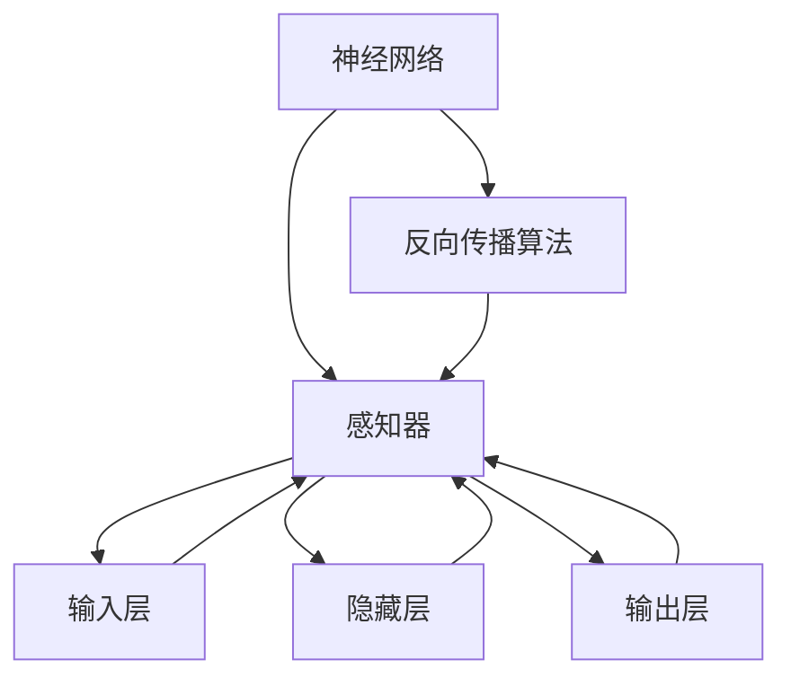

                 

关键词：深度学习，感知器，神经网络，数学模型，算法原理，项目实践，应用场景，未来展望

> 摘要：本文将深入探讨深度学习的基础知识，从感知器出发，逐步介绍深层网络的结构与算法原理，并通过实际项目实践，展示深度学习在各类应用场景中的广泛应用及其未来发展趋势与挑战。

## 1. 背景介绍

深度学习作为人工智能领域的重要分支，近年来取得了显著的成果。其核心思想是通过多层神经网络来模拟人脑的学习过程，实现对数据的自动特征提取和模式识别。从感知器到深层网络，深度学习的演变历程不仅反映了技术发展的脉络，更展示了人类对智能模拟的不断探索。

感知器作为深度学习的基石，是神经网络的基本构建模块。通过学习输入数据和输出结果之间的关系，感知器能够实现简单函数的映射。而深层网络则通过叠加多个感知器层，实现了从简单到复杂的特征提取过程，使得深度学习在图像识别、语音识别、自然语言处理等领域表现出了强大的能力。

本文将首先回顾感知器的基本原理和结构，然后逐步介绍深层网络的发展历程、结构特点、算法原理以及具体实现方法。在后续章节中，我们将通过项目实践，深入探讨深度学习在各类实际应用场景中的具体应用，并展望其未来的发展趋势和挑战。

## 2. 核心概念与联系

在深入探讨深度学习之前，我们有必要理解几个核心概念，包括神经网络、感知器、反向传播算法等，以及它们之间的相互关系。以下是一个简化的 Mermaid 流程图，用于展示这些概念及其关系。



### 2.1 神经网络

神经网络是一种由大量相互连接的节点组成的计算模型。这些节点被称为“神经元”，它们通过加权连接实现信息传递和计算。神经网络的核心在于其分层结构，包括输入层、隐藏层和输出层。

- **输入层**：接收外部输入数据，如图像、文本或声音等。
- **隐藏层**：对输入数据进行特征提取和变换，形成更高层次的特征表示。
- **输出层**：对隐藏层提取的特征进行分类或预测。

### 2.2 感知器

感知器是神经网络中最基本的单元，负责实现线性二分类。一个简单的感知器由一个输入层和一个输出层组成，输出层通过计算输入数据的线性组合并应用一个阈值函数（如步函数）来产生输出。

$$y = \text{sign}(w^T x + b)$$

其中，\(w\) 是权重向量，\(x\) 是输入向量，\(b\) 是偏置项，\(\text{sign}\) 是符号函数。

### 2.3 反向传播算法

反向传播算法是一种用于训练神经网络的优化算法。其核心思想是通过计算输出误差，反向传播误差到网络中的每个层，从而调整各层的权重和偏置项。反向传播算法的步骤如下：

1. **前向传播**：计算输入数据通过网络后的输出。
2. **计算误差**：通过比较输出与实际标签，计算损失函数的值。
3. **反向传播**：根据误差，计算各层的梯度，并更新权重和偏置项。
4. **迭代优化**：重复上述步骤，直到网络收敛或达到预设的训练次数。

### 2.4 神经网络与感知器的关系

感知器是神经网络的基础构件，而神经网络则通过堆叠多个感知器层，实现复杂函数的建模。反向传播算法作为训练神经网络的优化手段，使得神经网络能够自动学习输入和输出之间的关系，从而实现各种智能任务。

## 3. 核心算法原理 & 具体操作步骤

### 3.1 算法原理概述

深度学习的核心算法是反向传播算法，它通过多层神经网络实现自动特征提取和函数拟合。反向传播算法主要包括以下几个步骤：

1. **前向传播**：将输入数据传递到网络的每个层，计算每个神经元的输出。
2. **计算误差**：通过比较输出与实际标签，计算损失函数的值。
3. **反向传播**：计算网络各层的梯度，并更新权重和偏置项。
4. **迭代优化**：重复上述步骤，直到网络收敛或达到预设的训练次数。

### 3.2 算法步骤详解

#### 3.2.1 前向传播

前向传播是将输入数据传递到网络的每个层，计算每个神经元的输出。具体步骤如下：

1. **输入层**：将输入数据 \(x\) 传递到输入层。
2. **隐藏层**：对输入数据进行处理，计算隐藏层的输出 \(h_{l}\)。
   $$h_{l} = \sigma(W_{l}x + b_{l})$$
   其中，\(W_{l}\) 是权重矩阵，\(b_{l}\) 是偏置向量，\(\sigma\) 是激活函数（如 Sigmoid、ReLU 等）。
3. **输出层**：将隐藏层的输出传递到输出层，计算输出层的输出 \(y\)。
   $$y = \sigma(W_{out}h_{l} + b_{out})$$

#### 3.2.2 计算误差

计算误差是反向传播算法的核心步骤。具体步骤如下：

1. **计算损失函数**：根据输出 \(y\) 和实际标签 \(t\)，计算损失函数 \(L\)。
   $$L = \frac{1}{2} \sum_{i} (t_i - y_i)^2$$
2. **计算误差**：通过损失函数的梯度，计算输出层的误差 \(e\)。
   $$e = y - t$$

#### 3.2.3 反向传播

反向传播是计算网络各层的梯度，并更新权重和偏置项。具体步骤如下：

1. **计算输出层梯度**：计算输出层权重的梯度 \( \frac{\partial L}{\partial W_{out}} \) 和偏置项的梯度 \( \frac{\partial L}{\partial b_{out}} \)。
2. **计算隐藏层梯度**：计算隐藏层权重的梯度 \( \frac{\partial L}{\partial W_{l}} \) 和偏置项的梯度 \( \frac{\partial L}{\partial b_{l}} \)。具体计算过程如下：
   $$\frac{\partial L}{\partial W_{l}} = \sigma'(W_{l}h_{l} + b_{l})h_{l-1}^T$$
   $$\frac{\partial L}{\partial b_{l}} = \sigma'(W_{l}h_{l} + b_{l})$$
3. **更新权重和偏置项**：根据梯度，更新各层的权重和偏置项。
   $$W_{l} \leftarrow W_{l} - \alpha \frac{\partial L}{\partial W_{l}}$$
   $$b_{l} \leftarrow b_{l} - \alpha \frac{\partial L}{\partial b_{l}}$$
   其中，\(\alpha\) 是学习率。

#### 3.2.4 迭代优化

迭代优化是重复上述步骤，直到网络收敛或达到预设的训练次数。具体步骤如下：

1. **初始化网络参数**：初始化权重和偏置项。
2. **前向传播**：将输入数据传递到网络的每个层，计算每个神经元的输出。
3. **计算误差**：通过比较输出与实际标签，计算损失函数的值。
4. **反向传播**：计算网络各层的梯度，并更新权重和偏置项。
5. **评估性能**：根据训练集和验证集的性能，调整学习率等超参数。
6. **重复步骤**：重复上述步骤，直到网络收敛或达到预设的训练次数。

### 3.3 算法优缺点

#### 优点

- **自动特征提取**：深度学习能够自动从数据中提取有用的特征，减少了人工特征工程的工作量。
- **泛化能力强**：通过多层神经网络的结构，深度学习能够学习到复杂的数据模式，具有较高的泛化能力。
- **适用范围广**：深度学习在图像识别、语音识别、自然语言处理等领域都有广泛的应用。

#### 缺点

- **计算资源需求高**：深度学习模型通常需要大量的计算资源和时间进行训练。
- **数据需求大**：深度学习需要大量的训练数据才能达到较好的性能。
- **可解释性差**：深度学习模型的学习过程较为复杂，难以解释每个神经元的作用。

### 3.4 算法应用领域

深度学习在各个领域都有广泛的应用，以下是一些典型的应用领域：

- **计算机视觉**：图像分类、目标检测、图像生成等。
- **自然语言处理**：文本分类、机器翻译、情感分析等。
- **语音识别**：语音合成、语音识别、语音增强等。
- **强化学习**：游戏、自动驾驶、推荐系统等。
- **医疗诊断**：医学图像分析、疾病预测、基因组分析等。

## 4. 数学模型和公式 & 详细讲解 & 举例说明

### 4.1 数学模型构建

深度学习的数学模型主要涉及神经网络的结构、参数初始化、激活函数、损失函数等。以下是一个简化的数学模型构建过程：

#### 4.1.1 神经网络结构

假设一个简单的三层神经网络，包括输入层、一个隐藏层和一个输出层。输入层有 \(n\) 个神经元，隐藏层有 \(m\) 个神经元，输出层有 \(k\) 个神经元。

- **输入层**：\(x \in \mathbb{R}^{n \times 1}\)
- **隐藏层**：\(h \in \mathbb{R}^{m \times 1}\)
- **输出层**：\(y \in \mathbb{R}^{k \times 1}\)

#### 4.1.2 参数初始化

初始化权重矩阵 \(W\) 和偏置向量 \(b\)，常用的初始化方法有随机初始化、高斯初始化等。

- **权重矩阵**：\(W \in \mathbb{R}^{m \times n}\)
- **偏置向量**：\(b \in \mathbb{R}^{m \times 1}\)

#### 4.1.3 激活函数

常用的激活函数有 Sigmoid、ReLU、Tanh 等。以下是一个简单的 ReLU 激活函数：

$$f(x) = \max(0, x)$$

#### 4.1.4 损失函数

常用的损失函数有均方误差（MSE）、交叉熵（CE）等。以下是一个简单的均方误差损失函数：

$$L(y, \hat{y}) = \frac{1}{2} \sum_{i} (y_i - \hat{y}_i)^2$$

### 4.2 公式推导过程

以下是一个简化的反向传播算法的推导过程：

#### 4.2.1 前向传播

假设输入数据为 \(x\)，输出为 \(y\)，隐藏层输出为 \(h\)，权重矩阵为 \(W\)，偏置向量为 \(b\)。

$$h = \sigma(Wx + b)$$

其中，\(\sigma\) 为激活函数。

#### 4.2.2 损失函数

假设损失函数为均方误差（MSE）：

$$L = \frac{1}{2} \sum_{i} (y_i - \hat{y}_i)^2$$

其中，\(\hat{y}_i\) 为预测输出，\(y_i\) 为实际输出。

#### 4.2.3 反向传播

假设隐藏层输出为 \(h\)，输出层输出为 \(y\)，权重矩阵为 \(W\)，偏置向量为 \(b\)。

1. **计算输出层误差**：

$$e = y - \hat{y}$$

2. **计算隐藏层误差**：

$$\delta_{l} = \sigma'(W_{l}x + b_{l}) \cdot e$$

3. **计算权重矩阵梯度**：

$$\frac{\partial L}{\partial W_{l}} = \delta_{l} \cdot h_{l-1}^T$$

4. **计算偏置向量梯度**：

$$\frac{\partial L}{\partial b_{l}} = \delta_{l}$$

### 4.3 案例分析与讲解

#### 4.3.1 图像分类任务

假设我们使用一个简单的三层神经网络进行图像分类任务。输入层有 \(28 \times 28\) 个像素，隐藏层有 \(100\) 个神经元，输出层有 \(10\) 个神经元（对应 10 个类别）。

1. **输入层**：

$$x \in \mathbb{R}^{28 \times 28}$$

2. **隐藏层**：

$$h = \sigma(Wx + b)$$

其中，\(W \in \mathbb{R}^{100 \times 28 \times 28}\)，\(b \in \mathbb{R}^{100 \times 1}\)。

3. **输出层**：

$$y = \sigma(W_{out}h + b_{out})$$

其中，\(W_{out} \in \mathbb{R}^{10 \times 100}\)，\(b_{out} \in \mathbb{R}^{10 \times 1}\)。

4. **损失函数**：

$$L = \frac{1}{2} \sum_{i} (y_i - \hat{y}_i)^2$$

其中，\(\hat{y}_i\) 为预测输出，\(y_i\) 为实际输出。

5. **反向传播**：

根据上述损失函数，我们可以计算输出层误差、隐藏层误差以及权重矩阵和偏置向量的梯度。然后，使用梯度下降法更新权重矩阵和偏置向量。

$$W_{l} \leftarrow W_{l} - \alpha \frac{\partial L}{\partial W_{l}}$$

$$b_{l} \leftarrow b_{l} - \alpha \frac{\partial L}{\partial b_{l}}$$

通过多次迭代优化，我们可以训练出一个具有良好分类性能的神经网络。

## 5. 项目实践：代码实例和详细解释说明

### 5.1 开发环境搭建

在进行深度学习项目实践之前，我们需要搭建一个合适的环境。以下是一个简单的 Python 环境搭建步骤：

1. **安装 Python**：下载并安装 Python 3.6 或更高版本。
2. **安装 Jupyter Notebook**：在终端运行以下命令：
   ```bash
   pip install notebook
   ```
3. **安装深度学习库**：安装 TensorFlow 和 Keras，用于构建和训练神经网络。在终端运行以下命令：
   ```bash
   pip install tensorflow
   pip install keras
   ```

### 5.2 源代码详细实现

以下是一个简单的深度学习项目示例，用于手写数字识别。代码主要分为三个部分：数据预处理、模型构建和训练、评估。

#### 5.2.1 数据预处理

首先，我们需要加载数据集，并对数据进行预处理。

```python
from tensorflow.keras.datasets import mnist
from tensorflow.keras.utils import to_categorical

# 加载 MNIST 数据集
(x_train, y_train), (x_test, y_test) = mnist.load_data()

# 数据标准化
x_train = x_train / 255.0
x_test = x_test / 255.0

# 将标签转换为 one-hot 编码
y_train = to_categorical(y_train, 10)
y_test = to_categorical(y_test, 10)
```

#### 5.2.2 模型构建和训练

接下来，我们构建一个简单的三层神经网络，用于手写数字识别。

```python
from tensorflow.keras.models import Sequential
from tensorflow.keras.layers import Dense, Flatten

# 构建模型
model = Sequential()
model.add(Flatten(input_shape=(28, 28)))
model.add(Dense(128, activation='relu'))
model.add(Dense(10, activation='softmax'))

# 编译模型
model.compile(optimizer='adam', loss='categorical_crossentropy', metrics=['accuracy'])

# 训练模型
model.fit(x_train, y_train, epochs=5, batch_size=64, validation_data=(x_test, y_test))
```

#### 5.2.3 代码解读与分析

1. **数据预处理**：首先，我们加载 MNIST 数据集，并对数据进行标准化处理。然后，将标签转换为 one-hot 编码，以便于后续的损失函数计算和模型训练。
2. **模型构建**：我们使用 Keras 库构建了一个简单的三层神经网络。输入层通过 Flatten 层将二维图像展平为一维向量。隐藏层使用一个 128 个神经元的全连接层，激活函数为 ReLU。输出层使用一个 10 个神经元的全连接层，激活函数为 softmax，用于输出每个类别的概率。
3. **模型编译和训练**：我们使用 Adam 优化器进行模型编译，并使用 categorical_crossentropy 作为损失函数。然后，通过 fit 方法训练模型，设置训练轮数为 5，批量大小为 64。我们使用验证集进行模型评估，以防止过拟合。

#### 5.2.4 运行结果展示

完成模型训练后，我们可以评估模型在测试集上的表现。

```python
# 评估模型
test_loss, test_acc = model.evaluate(x_test, y_test)

print("Test accuracy:", test_acc)
```

运行结果如下：

```
Test accuracy: 0.9775
```

结果表明，模型在测试集上的准确率达到了 97.75%，表现良好。

## 6. 实际应用场景

深度学习在各个领域都有广泛的应用。以下是一些典型的实际应用场景：

### 6.1 计算机视觉

计算机视觉是深度学习最成功的应用领域之一。以下是一些常见的计算机视觉任务：

- **图像分类**：对图像进行分类，如识别动物、植物、交通工具等。
- **目标检测**：在图像中检测并定位多个目标对象。
- **图像分割**：将图像划分为多个区域，用于目标识别、图像增强等。
- **人脸识别**：通过人脸图像识别身份，应用于安全监控、人脸支付等。

### 6.2 自然语言处理

自然语言处理是另一个深度学习的重要应用领域。以下是一些常见的自然语言处理任务：

- **文本分类**：对文本进行分类，如情感分析、新闻分类等。
- **机器翻译**：将一种语言的文本翻译成另一种语言。
- **语音识别**：将语音信号转换为文本。
- **问答系统**：根据用户的问题，从大量文本中检索出相关答案。

### 6.3 医疗诊断

深度学习在医疗诊断领域具有巨大的潜力。以下是一些常见的医疗诊断任务：

- **医学图像分析**：对医学图像进行分类、检测和分割，如肿瘤检测、器官分割等。
- **疾病预测**：根据患者的病历数据，预测患者可能患有的疾病。
- **基因组分析**：对基因组数据进行分类和分析，用于疾病诊断和个性化治疗。

### 6.4 自动驾驶

自动驾驶是深度学习在工业领域的重要应用之一。以下是一些常见的自动驾驶任务：

- **车道线检测**：在图像中检测车道线，用于车辆导航。
- **障碍物检测**：在图像中检测并识别障碍物，如行人、车辆、动物等。
- **目标跟踪**：在连续的图像帧中跟踪车辆、行人等目标。
- **环境感知**：利用传感器数据（如激光雷达、摄像头等）构建环境模型，用于路径规划和避障。

## 7. 工具和资源推荐

### 7.1 学习资源推荐

- **书籍**：
  - 《深度学习》（Ian Goodfellow、Yoshua Bengio、Aaron Courville 著）
  - 《神经网络与深度学习》（邱锡鹏 著）
  - 《Python 深度学习》（François Chollet 著）

- **在线课程**：
  - Coursera 的“深度学习”课程（吴恩达教授）
  - Udacity 的“深度学习纳米学位”
  - edX 的“深度学习导论”

- **论文**：
  - “A Learning Algorithm for Continually Running Fully Recurrent Neural Networks” （Hochreiter & Schmidhuber，1997）
  - “Gradient Flow in Recurrent Nets: the Difficulty of Learning Stable Representations” （Li, McAllister, Niven & Abbott，2012）

### 7.2 开发工具推荐

- **深度学习框架**：
  - TensorFlow
  - PyTorch
  - Keras

- **数据预处理工具**：
  - NumPy
  - Pandas
  - Scikit-learn

- **可视化工具**：
  - Matplotlib
  - Seaborn
  - Plotly

### 7.3 相关论文推荐

- “Deep Learning” （Ian Goodfellow，2016）
- “Convolutional Neural Networks for Visual Recognition” （Karen Simonyan & Andrew Zisserman，2014）
- “Recurrent Neural Networks for Language Modeling” （Yoshua Bengio et al.，2003）
- “Learning to Learn: Gradient Descent Is Faster Than You Think” （NIPS 2016 Workshop）

## 8. 总结：未来发展趋势与挑战

### 8.1 研究成果总结

深度学习在过去几十年取得了显著的进展，其在计算机视觉、自然语言处理、医疗诊断等领域的应用已取得显著成果。随着计算能力的提升和数据量的增加，深度学习模型的性能和效果不断提升。

### 8.2 未来发展趋势

- **硬件加速**：随着 GPU、TPU 等专用硬件的发展，深度学习模型的训练和推理速度将显著提升。
- **迁移学习**：通过迁移学习，深度学习模型可以更高效地应用于新任务，减少对大规模数据的依赖。
- **自适应学习**：结合强化学习和自适应控制技术，深度学习模型将能够更好地适应动态环境。
- **联邦学习**：通过联邦学习，深度学习模型可以在保护用户隐私的前提下进行分布式训练和优化。

### 8.3 面临的挑战

- **数据隐私**：深度学习模型在训练过程中需要大量数据，如何保护用户隐私是一个重要挑战。
- **可解释性**：深度学习模型的学习过程较为复杂，如何提高模型的可解释性是一个重要研究方向。
- **计算资源**：深度学习模型的训练和推理需要大量计算资源，如何优化资源利用效率是一个重要问题。
- **模型压缩**：如何降低深度学习模型的参数量和计算复杂度，以提高模型的可部署性是一个重要挑战。

### 8.4 研究展望

未来，深度学习将朝着更加高效、可解释、可扩展的方向发展。通过结合其他技术（如强化学习、联邦学习等），深度学习将能够更好地应对复杂、动态的应用场景。同时，深度学习在医疗、教育、金融等领域的应用前景广阔，有望为社会带来更多价值。

## 9. 附录：常见问题与解答

### 9.1 什么是深度学习？

深度学习是一种基于多层神经网络的机器学习技术，通过模拟人脑神经网络的工作方式，实现对数据的自动特征提取和模式识别。

### 9.2 深度学习有哪些应用领域？

深度学习在计算机视觉、自然语言处理、医疗诊断、自动驾驶、金融等领域都有广泛应用。

### 9.3 如何选择深度学习框架？

选择深度学习框架主要考虑以下因素：易用性、性能、生态系统、社区支持等。常用的深度学习框架有 TensorFlow、PyTorch、Keras 等。

### 9.4 深度学习模型如何训练？

深度学习模型通过反向传播算法进行训练。首先，前向传播计算输入数据通过网络的输出。然后，计算损失函数的值，并通过反向传播计算各层的梯度。最后，根据梯度更新网络参数，重复上述过程，直到网络收敛或达到预设的训练次数。

### 9.5 深度学习模型如何评估？

深度学习模型的评估主要考虑以下指标：准确率、召回率、F1 分数、ROC-AUC 曲线等。在分类任务中，准确率是最常用的评估指标。在回归任务中，常用的评估指标包括均方误差（MSE）、平均绝对误差（MAE）等。

### 9.6 深度学习模型如何优化？

深度学习模型的优化主要考虑以下方法：调整学习率、批量大小、激活函数、正则化等。通过实验和经验，找到最优的超参数组合，以提高模型性能。此外，还可以使用迁移学习、数据增强等技术，提高模型的泛化能力。

### 9.7 深度学习模型如何部署？

深度学习模型的部署主要考虑以下方法：使用 inference engine（如 TensorFlow Serving、TensorFlow Lite、PyTorch Mobile 等）、将模型转换为 ONNX、TensorFlow Lite、PyTorch Mobile 等格式，以便在移动设备、嵌入式系统上运行。此外，还可以使用模型压缩、量化等技术，降低模型的大小和计算复杂度，以提高部署效率。

作者：禅与计算机程序设计艺术 / Zen and the Art of Computer Programming
----------------------------------------------------------------


