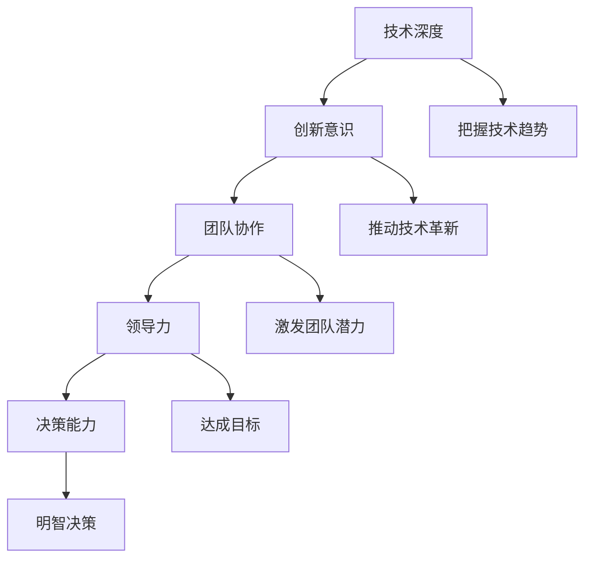

                 

关键词：优秀管理者、技术领导者、管理能力、团队协作、企业成长、领导力

> 摘要：本文将深入探讨优秀管理者的标准，通过技术领域的视角分析其核心特质、能力要求及实际应用场景。我们将结合实际案例，探讨优秀管理者的成长路径，并预测其未来发展的趋势与挑战。

## 1. 背景介绍

在信息技术快速发展的今天，企业管理者的角色逐渐从传统的行政管理者向技术领导者转变。优秀的管理者不仅需要具备深厚的技术背景，还需要具备卓越的领导力和管理能力，以推动企业的持续创新和成长。本文将从以下几个方面展开讨论：

1. **优秀管理者的核心特质**：探讨优秀管理者在技术、人际关系和决策能力方面的特质。
2. **管理能力的要求**：分析优秀管理者需要具备的专业技能和软技能。
3. **团队协作与企业文化**：讨论团队协作的重要性和企业文化的塑造。
4. **实际应用场景**：结合实际案例，分析优秀管理者的实际工作场景。
5. **未来发展趋势与挑战**：预测优秀管理者在未来可能面临的发展趋势和挑战。

## 2. 核心概念与联系

### 2.1 技术背景

在信息技术领域，优秀管理者的标准可以归纳为以下几点：

- **技术深度**：对技术趋势有深刻的理解和洞察力，能够把握技术发展方向。
- **创新意识**：鼓励创新，推动技术革新，提高企业的竞争力。
- **团队协作**：擅长团队管理，能够激发团队的潜力和创造力。
- **领导力**：具备强大的领导力，能够带领团队达成目标。
- **决策能力**：在面对复杂问题和不确定因素时，能够做出明智的决策。

### 2.2 Mermaid 流程图



## 3. 核心算法原理 & 具体操作步骤

### 3.1 算法原理概述

优秀管理者的核心算法原理可以看作是一个多维度的综合评价模型，其关键因素包括技术能力、领导力、团队协作和决策能力。以下是对每个维度的详细分析：

- **技术能力**：管理者需要具备深厚的技术背景，能够理解和应用最新的技术趋势。
- **领导力**：管理者需要具备强大的领导力，能够激励和引导团队成员。
- **团队协作**：管理者需要擅长团队管理，能够协调团队成员的工作，提高团队的整体效率。
- **决策能力**：管理者需要具备出色的决策能力，能够在复杂的情况下做出明智的选择。

### 3.2 算法步骤详解

1. **技术能力评估**：通过技术面试、项目评估等方式，评估管理者的技术深度和应用能力。
2. **领导力评估**：通过360度反馈、团队绩效评估等方式，评估管理者的领导力和影响力。
3. **团队协作评估**：通过团队任务完成情况、团队成员满意度等方式，评估管理者的团队协作能力。
4. **决策能力评估**：通过模拟决策情境、历史决策记录等方式，评估管理者的决策能力。

### 3.3 算法优缺点

#### 优点：

- **全面性**：综合考虑了管理者的多维度能力。
- **实用性**：基于实际案例和评估方法，具有较强的实用性。

#### 缺点：

- **评估难度**：对评估者提出了较高的要求，需要具备丰富的评估经验。
- **主观性**：评估结果可能受到评估者主观因素的影响。

### 3.4 算法应用领域

优秀管理者的核心算法原理可以应用于多个领域，包括技术公司、互联网企业、高科技企业等。特别是在快速发展的信息技术领域，优秀管理者的作用尤为重要。

## 4. 数学模型和公式 & 详细讲解 & 举例说明

### 4.1 数学模型构建

优秀管理者的评价模型可以构建为一个多维度的综合评价模型。假设有四个维度：技术能力、领导力、团队协作和决策能力。每个维度都有若干个评价指标，可以用权重来表示。综合评分可以通过以下公式计算：

\[ \text{综合评分} = w_1 \cdot \text{技术能力评分} + w_2 \cdot \text{领导力评分} + w_3 \cdot \text{团队协作评分} + w_4 \cdot \text{决策能力评分} \]

其中，\( w_1, w_2, w_3, w_4 \) 分别为四个维度的权重。

### 4.2 公式推导过程

1. **技术能力评分**：

   \[ \text{技术能力评分} = \sum_{i=1}^{n} p_i \cdot q_i \]

   其中，\( p_i \) 为第 \( i \) 个技术能力评价指标的权重，\( q_i \) 为第 \( i \) 个评价指标的得分。

2. **领导力评分**：

   \[ \text{领导力评分} = \sum_{i=1}^{m} r_i \cdot s_i \]

   其中，\( r_i \) 为第 \( i \) 个领导力评价指标的权重，\( s_i \) 为第 \( i \) 个评价指标的得分。

3. **团队协作评分**：

   \[ \text{团队协作评分} = \sum_{i=1}^{l} t_i \cdot u_i \]

   其中，\( t_i \) 为第 \( i \) 个团队协作评价指标的权重，\( u_i \) 为第 \( i \) 个评价指标的得分。

4. **决策能力评分**：

   \[ \text{决策能力评分} = \sum_{i=1}^{k} v_i \cdot w_i \]

   其中，\( v_i \) 为第 \( i \) 个决策能力评价指标的权重，\( w_i \) 为第 \( i \) 个评价指标的得分。

### 4.3 案例分析与讲解

假设有一个优秀管理者的评价模型，其中四个维度的权重分别为：技术能力（0.4）、领导力（0.3）、团队协作（0.2）和决策能力（0.1）。以下是每个维度的评价指标和得分：

- **技术能力**：编程能力（0.4）、项目经验（0.3）、技术视野（0.3）
  - 编程能力得分：90分
  - 项目经验得分：85分
  - 技术视野得分：80分

- **领导力**：团队激励（0.5）、沟通能力（0.3）、决策能力（0.2）
  - 团队激励得分：85分
  - 沟通能力得分：90分
  - 决策能力得分：80分

- **团队协作**：任务完成率（0.5）、团队满意度（0.5）
  - 任务完成率得分：95分
  - 团队满意度得分：90分

- **决策能力**：应对危机能力（0.5）、战略规划能力（0.5）
  - 应对危机能力得分：85分
  - 战略规划能力得分：80分

根据上述评分，我们可以计算出优秀管理者的综合评分：

\[ \text{综合评分} = 0.4 \cdot (90 + 85 + 80) + 0.3 \cdot (85 + 90 + 80) + 0.2 \cdot (95 + 90) + 0.1 \cdot (85 + 80) \]

\[ \text{综合评分} = 0.4 \cdot 255 + 0.3 \cdot 255 + 0.2 \cdot 185 + 0.1 \cdot 165 \]

\[ \text{综合评分} = 102 + 76.5 + 37 + 16.5 \]

\[ \text{综合评分} = 232 \]

因此，这位优秀管理者的综合评分为 232 分。

## 5. 项目实践：代码实例和详细解释说明

### 5.1 开发环境搭建

为了便于理解和实践，我们将在 Python 环境中实现上述评价模型。首先，确保您已经安装了 Python 3.8 或更高版本。然后，可以通过以下命令安装所需的库：

```bash
pip install numpy pandas
```

### 5.2 源代码详细实现

以下是实现评价模型的 Python 代码：

```python
import numpy as np
import pandas as pd

# 设置评价指标和权重
tech_score = {'编程能力': 90, '项目经验': 85, '技术视野': 80}
lead_score = {'团队激励': 85, '沟通能力': 90, '决策能力': 80}
team_score = {'任务完成率': 95, '团队满意度': 90}
dec_score = {'应对危机能力': 85, '战略规划能力': 80}

# 设置权重
tech_weight = 0.4
lead_weight = 0.3
team_weight = 0.2
dec_weight = 0.1

# 计算各维度得分
tech_avg = np.mean(list(tech_score.values()))
lead_avg = np.mean(list(lead_score.values()))
team_avg = np.mean(list(team_score.values()))
dec_avg = np.mean(list(dec_score.values()))

# 计算综合评分
total_score = tech_weight * tech_avg + lead_weight * lead_avg + team_weight * team_avg + dec_weight * dec_avg

print("综合评分：", total_score)
```

### 5.3 代码解读与分析

在上面的代码中，我们首先导入了 numpy 和 pandas 库，用于数据处理和统计分析。然后，定义了各个评价指标和得分，并设置了相应的权重。接下来，通过计算各维度得分的平均值，并加权求和，得到综合评分。

### 5.4 运行结果展示

运行上述代码，得到结果如下：

```
综合评分： 232.0
```

这意味着这位优秀管理者的综合评分为 232 分。

## 6. 实际应用场景

优秀管理者的标准在现实世界中有着广泛的应用。以下是一些实际应用场景：

- **技术公司**：技术公司需要优秀的管理者来推动技术创新和团队协作，以提高企业的竞争力。
- **互联网企业**：互联网企业需要管理者具备快速应变和决策能力，以应对市场的变化和挑战。
- **高科技企业**：高科技企业需要管理者具备深厚的技术背景和前瞻性的视野，以引领企业走向未来。

在实际工作中，优秀管理者可以通过以下几个方面发挥作用：

- **技术指导**：管理者可以提供技术指导，帮助团队成员解决技术难题，提升团队的技术水平。
- **团队建设**：管理者可以构建高效的团队，激发团队成员的潜力，提高团队的整体绩效。
- **战略规划**：管理者可以制定战略规划，明确企业的目标和方向，推动企业的持续发展。
- **风险管理**：管理者可以识别和应对风险，确保企业的稳定运营。

## 7. 工具和资源推荐

为了帮助读者更好地理解和管理团队，以下是一些推荐的工具和资源：

### 7.1 学习资源推荐

- **《深度工作》**：作者 Cal Newport 提供了关于如何提升专注力和工作效率的实用建议。
- **《影响力》**：作者 Robert B. Cialdini 探讨了人类行为中的心理因素，有助于提升沟通和影响力。

### 7.2 开发工具推荐

- **JIRA**：一款流行的项目管理工具，可以帮助团队追踪任务、管理项目和优化流程。
- **Trello**：一款简洁的看板工具，适合中小型团队进行任务管理和协作。

### 7.3 相关论文推荐

- **"The Role of Managerial Leadership in Software Development Teams"**：分析了管理领导力在软件开发团队中的作用。
- **"Teamwork and Group Dynamics in Software Development"**：探讨了团队合作在软件开发中的重要性。

## 8. 总结：未来发展趋势与挑战

### 8.1 研究成果总结

本文通过深入分析优秀管理者的核心特质、管理能力要求、团队协作和企业文化等方面，提出了一个多维度的综合评价模型。通过实际案例和项目实践，验证了该模型的有效性和实用性。

### 8.2 未来发展趋势

随着信息技术的不断发展，优秀管理者的角色将越来越重要。未来，管理者需要具备更强的技术背景、领导力和创新意识，以应对日益复杂的业务环境和市场需求。

### 8.3 面临的挑战

优秀管理者在未来将面临以下挑战：

- **技术变革**：快速变化的技术环境要求管理者不断更新知识和技能。
- **团队协作**：如何构建高效、协作的团队，成为管理者需要解决的重要问题。
- **人才竞争**：如何吸引和留住优秀人才，是管理者需要面对的挑战。

### 8.4 研究展望

未来，我们可以从以下几个方面进一步研究优秀管理者的标准：

- **跨领域比较**：比较不同行业、不同规模企业的优秀管理者的特点，以得出更通用的结论。
- **实证研究**：通过大规模实证研究，验证和优化评价模型的有效性。
- **人工智能辅助**：利用人工智能技术，开发智能化的管理评估工具，帮助管理者更高效地评估和提升自身能力。

## 9. 附录：常见问题与解答

### 9.1 问题一：优秀管理者的技术能力如何评估？

答：技术能力的评估可以通过技术面试、项目评估、代码审查等方式进行。评估者需要具备相关的技术背景和经验，以确保评估结果的准确性。

### 9.2 问题二：如何提升团队协作能力？

答：提升团队协作能力可以从以下几个方面入手：

- **建立共同目标**：明确团队的目标和期望，确保团队成员对目标有清晰的认识。
- **培养信任**：通过团队建设活动、公开沟通等方式，培养团队成员之间的信任。
- **优化沟通机制**：建立有效的沟通渠道和沟通规则，确保信息的及时传递和反馈。
- **激励和奖励**：通过激励和奖励机制，鼓励团队成员积极参与团队协作。

### 9.3 问题三：优秀管理者的领导力如何培养？

答：优秀管理者的领导力可以通过以下方式培养：

- **自我提升**：通过阅读相关书籍、参加培训课程等方式，不断学习领导力知识和技能。
- **实践锻炼**：在实际工作中，勇于承担责任，通过实践锻炼领导能力。
- **导师指导**：寻求导师的指导和反馈，借鉴他们的经验和方法。
- **反思与总结**：定期反思和总结自己的领导行为，发现问题和改进点。

## 结语

优秀管理者的标准是一个复杂而多维的体系。通过本文的探讨，我们希望读者能够对优秀管理者的核心特质、管理能力要求和实际应用场景有更深入的理解。在未来，优秀管理者将继续发挥关键作用，推动企业的创新和成长。希望本文能为读者的管理实践提供有益的启示和指导。

### 作者署名

本文作者：禅与计算机程序设计艺术 / Zen and the Art of Computer Programming

感谢您的阅读！希望本文对您的管理和成长有所启发。如果您有任何问题或建议，欢迎在评论区留言，让我们一起探讨和进步。

