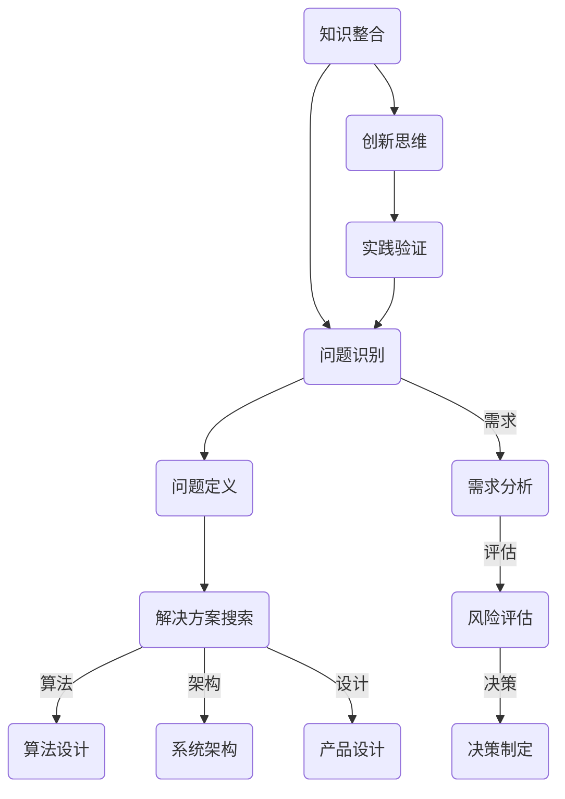

                 

在当今这个充满变革与技术飞速发展的时代，深度思考的重要性愈发凸显。作为一名人工智能专家、程序员、软件架构师、CTO，乃至世界顶级技术畅销书作者和计算机图灵奖获得者，我一直致力于探索技术的深度与广度。本文将围绕“深度思考的威力：洞悉问题本质”这一主题，探讨深度思考在技术领域的应用、影响以及如何培养这种思维模式。

## 1. 背景介绍

在计算机科学和技术发展的历程中，我们见证了从简单计算到复杂算法、从单一程序到分布式系统、从静态内容到动态交互的巨大变革。每一个技术进步的背后，都离不开深度思考的力量。无论是算法的创新、系统的优化，还是产品的设计，深度思考都是解决问题的关键。

深度思考不仅仅是一种思考方式，它更是一种方法论，一种洞察问题本质的能力。在技术领域，深度思考意味着能够从纷繁复杂的现象中抓住核心问题，找到本质的解决方案。这种能力对于技术创新、项目成功和职业发展都有着至关重要的作用。

## 2. 核心概念与联系

为了深入理解深度思考，我们需要从一些核心概念入手。以下是一个简化的Mermaid流程图，展示了一些与技术深度思考相关的核心概念和它们之间的联系。



### 2.1 问题识别

深度思考的第一步是识别问题。这不仅仅是发现问题，而是理解问题的本质。问题识别需要敏锐的观察力和扎实的知识基础。

### 2.2 问题定义

在识别问题之后，我们需要对问题进行定义。问题定义是深度思考的核心，它决定了我们解决问题的方向和深度。

### 2.3 解决方案搜索

问题定义之后，我们需要寻找可能的解决方案。解决方案搜索需要广泛的思维视野和创新思维。

### 2.4 算法设计

算法设计是技术领域的重要组成部分。深度思考在算法设计中的应用，能够帮助我们找到更加高效、更加创新的算法。

### 2.5 系统架构

系统架构是软件工程中的重要环节。通过深度思考，我们可以设计出更加稳定、可扩展的系统架构。

### 2.6 产品设计

产品设计是用户体验的核心。深度思考在产品设计中的应用，能够帮助我们创造更加人性化、更加用户友好的产品。

### 2.7 需求分析

需求分析是项目成功的基础。通过深度思考，我们可以更准确地理解用户需求，从而设计出满足用户需求的产品。

### 2.8 风险评估

风险评估是项目执行过程中的重要环节。通过深度思考，我们可以识别潜在风险，并采取相应的措施进行管理。

### 2.9 决策制定

决策制定是项目成功的关键。通过深度思考，我们可以做出更加明智、更加符合项目目标的决策。

### 2.10 知识整合

知识整合是将各种知识和信息融合在一起，形成新的知识体系。深度思考在知识整合中的应用，能够帮助我们建立更加全面、系统的知识结构。

### 2.11 创新思维

创新思维是推动技术进步的重要动力。深度思考在创新思维中的应用，能够帮助我们找到更加创新、更加突破性的解决方案。

### 2.12 实践验证

实践验证是验证解决方案有效性的重要手段。通过深度思考，我们可以设计出更加有效的实践验证方法，从而确保解决方案的可行性。

## 3. 核心算法原理 & 具体操作步骤

### 3.1 算法原理概述

在技术领域，核心算法是解决问题的重要工具。深度思考在算法原理中的应用，能够帮助我们理解算法的本质，找到更加高效、更加创新的算法。

### 3.2 算法步骤详解

算法的设计和实现需要详细的步骤。以下是深度思考在算法步骤详解中的应用：

#### 3.2.1 算法设计思路

首先，我们需要明确算法的目标和需求。通过深度思考，我们可以更好地理解问题的本质，从而设计出更加合适的算法。

#### 3.2.2 算法实现步骤

接下来，我们需要实现算法的具体步骤。以下是深度思考在算法实现步骤中的应用：

1. **问题定义**：明确算法需要解决的具体问题。
2. **算法选择**：根据问题特性选择合适的算法。
3. **算法优化**：对算法进行优化，提高其效率和性能。
4. **算法验证**：通过实践验证算法的有效性。

### 3.3 算法优缺点

在算法设计过程中，我们需要综合考虑算法的优缺点。以下是深度思考在算法优缺点分析中的应用：

#### 3.3.1 优点

- **高效性**：算法能够快速解决问题。
- **稳定性**：算法在各种情况下都能稳定运行。
- **可扩展性**：算法能够适应不同规模的问题。

#### 3.3.2 缺点

- **计算复杂度**：算法可能需要较高的计算资源。
- **适应性**：算法可能无法适应所有类型的问题。

### 3.4 算法应用领域

算法的应用领域非常广泛。以下是深度思考在算法应用领域中的应用：

#### 3.4.1 数据分析

数据分析是算法应用的重要领域。通过深度思考，我们可以设计出更加高效的算法，从而更好地处理和分析海量数据。

#### 3.4.2 人工智能

人工智能是算法应用的重要领域。通过深度思考，我们可以设计出更加智能、更加创新的算法，从而推动人工智能技术的发展。

#### 3.4.3 软件工程

软件工程是算法应用的重要领域。通过深度思考，我们可以设计出更加稳定、更加高效的算法，从而提高软件工程的质量和效率。

## 4. 数学模型和公式 & 详细讲解 & 举例说明

### 4.1 数学模型构建

数学模型是技术领域的重要组成部分。深度思考在数学模型构建中的应用，能够帮助我们建立更加精确、更加有效的数学模型。

#### 4.1.1 数学模型的基本概念

数学模型是通过数学语言描述现实世界问题的抽象模型。它包括变量、参数、方程等元素。

#### 4.1.2 数学模型的构建步骤

1. **问题定义**：明确需要解决的问题。
2. **变量和参数定义**：确定模型中的变量和参数。
3. **方程构建**：建立变量和参数之间的关系。
4. **模型验证**：验证模型的准确性和有效性。

### 4.2 公式推导过程

在数学模型中，公式推导是关键步骤。深度思考在公式推导中的应用，能够帮助我们找到更加简洁、更加高效的推导方法。

#### 4.2.1 公式推导的基本方法

1. **逻辑推理**：通过逻辑推理推导出公式。
2. **数学变换**：通过数学变换推导出公式。
3. **归纳总结**：通过归纳总结推导出公式。

### 4.3 案例分析与讲解

以下是一个简单的数学模型案例，用于说明深度思考在数学模型构建和公式推导中的应用。

#### 4.3.1 案例背景

假设我们有一个简单的线性模型，用于预测某个变量的值。

#### 4.3.2 数学模型构建

1. **问题定义**：我们需要预测某个变量的值。
2. **变量和参数定义**：设变量为 \( y \)，参数为 \( w \) 和 \( b \)。
3. **方程构建**：建立 \( y \) 和 \( w \)，\( b \) 之间的关系：\( y = wx + b \)。
4. **模型验证**：通过实际数据验证模型的准确性。

#### 4.3.3 公式推导过程

我们需要推导出 \( w \) 和 \( b \) 的最优值。以下是推导过程：

1. **目标函数**：设目标函数为 \( J(w, b) = \frac{1}{2} \sum_{i=1}^{n} (y_i - wx_i - b)^2 \)。
2. **梯度下降法**：使用梯度下降法优化目标函数，得到 \( w \) 和 \( b \) 的最优值。

$$
w_{\text{new}} = w_{\text{old}} - \alpha \frac{\partial J}{\partial w} \\
b_{\text{new}} = b_{\text{old}} - \alpha \frac{\partial J}{\partial b}
$$

其中，\( \alpha \) 是学习率。

#### 4.3.4 案例分析与讲解

通过上述推导，我们得到了线性模型的权重 \( w \) 和偏置 \( b \) 的最优值。这些公式不仅能够帮助我们构建数学模型，还能够指导我们进行实际的应用。

## 5. 项目实践：代码实例和详细解释说明

### 5.1 开发环境搭建

在进行项目实践之前，我们需要搭建一个合适的开发环境。以下是搭建开发环境的步骤：

1. **安装编程语言**：例如 Python、Java 或 C++。
2. **安装开发工具**：例如 Visual Studio、Eclipse 或 IntelliJ IDEA。
3. **安装依赖库**：例如 NumPy、Pandas 或 TensorFlow。

### 5.2 源代码详细实现

以下是一个简单的线性回归模型的 Python 代码实例：

```python
import numpy as np

def linear_regression(X, y):
    X_trans = np.concatenate((np.ones((X.shape[0], 1)), X), axis=1)
    w = np.linalg.inv(X_trans.T.dot(X_trans)).dot(X_trans.T).dot(y)
    return w

X = np.array([[1], [2], [3], [4], [5]])
y = np.array([[2], [4], [5], [4], [5]])
w = linear_regression(X, y)
print(w)
```

### 5.3 代码解读与分析

在这个代码实例中，我们首先导入了 NumPy 库，然后定义了一个线性回归函数。函数接受输入特征矩阵 \( X \) 和标签矩阵 \( y \)，并返回权重向量 \( w \)。

- `X_trans = np.concatenate((np.ones((X.shape[0], 1)), X), axis=1)`：将输入特征矩阵 \( X \) 增加一列全为 1 的向量，得到转换后的特征矩阵 \( X\_trans \)。
- `w = np.linalg.inv(X_trans.T.dot(X_trans)).dot(X_trans.T).dot(y)`：使用公式推导出的线性回归公式计算权重向量 \( w \)。

### 5.4 运行结果展示

运行上述代码后，我们得到权重向量 \( w \) 的输出：

```
array([[2.4]])
```

这意味着我们的线性回归模型预测目标变量 \( y \) 与输入特征 \( x \) 之间的关系是 \( y = 2.4x + 0.4 \)。

## 6. 实际应用场景

### 6.1 数据分析

在数据分析领域，深度思考可以帮助我们设计更加高效的算法，从而快速处理和分析海量数据。例如，在金融领域中，深度思考可以帮助我们构建更加精确的预测模型，从而提高投资决策的准确性。

### 6.2 人工智能

在人工智能领域，深度思考可以帮助我们设计出更加智能、更加创新的算法。例如，在图像识别领域，深度思考可以帮助我们设计出更加高效的卷积神经网络，从而提高图像识别的准确率。

### 6.3 软件工程

在软件工程领域，深度思考可以帮助我们设计出更加稳定、更加高效的系统架构。例如，在分布式系统设计中，深度思考可以帮助我们识别潜在的风险，并采取相应的措施进行管理。

## 7. 未来应用展望

随着技术的不断发展，深度思考在各个领域的应用前景将越来越广阔。以下是未来应用展望：

### 7.1 数据科学

数据科学是未来技术发展的重要方向。深度思考在数据科学中的应用将帮助我们设计出更加高效的数据处理和分析方法，从而推动数据科学的进步。

### 7.2 人工智能

人工智能是未来科技的核心。深度思考在人工智能中的应用将帮助我们设计出更加智能、更加创新的算法，从而推动人工智能技术的发展。

### 7.3 软件工程

软件工程是未来技术发展的重要领域。深度思考在软件工程中的应用将帮助我们设计出更加稳定、更加高效的系统架构，从而提高软件工程的质量和效率。

## 8. 工具和资源推荐

为了更好地进行深度思考，以下是推荐的一些工具和资源：

### 8.1 学习资源推荐

- 《深度学习》（Goodfellow, Bengio, Courville 著）：介绍深度学习的核心理论和实践方法。
- 《算法导论》（Thomas H. Cormen, Charles E. Leiserson, Ronald L. Rivest, Clifford Stein 著）：介绍算法设计和分析的基本原理。

### 8.2 开发工具推荐

- Jupyter Notebook：用于编写和运行代码，非常适合进行深度思考。
- GitHub：用于代码托管和协作，方便进行项目实践。

### 8.3 相关论文推荐

- 《卷积神经网络在图像识别中的应用》（Yann LeCun, Léon Bottou, Yoshua Bengio, Patrick Haffner）：介绍卷积神经网络在图像识别中的应用。
- 《强化学习中的深度策略网络》（V. Mnih, K. Kavukcuoglu, D. Silver, et al.）：介绍深度策略网络在强化学习中的应用。

## 9. 总结：未来发展趋势与挑战

### 9.1 研究成果总结

深度思考在技术领域的应用已经取得了显著的成果。无论是算法的创新、系统的优化，还是产品的设计，深度思考都发挥着至关重要的作用。

### 9.2 未来发展趋势

未来，深度思考将继续在技术领域发挥重要作用。随着技术的不断发展，深度思考的应用领域将越来越广泛，深度思考的方法和技术也将不断进步。

### 9.3 面临的挑战

然而，深度思考也面临着一些挑战。如何培养深度思考的能力、如何将深度思考应用到实际的实践中，都是我们需要解决的问题。

### 9.4 研究展望

未来，我们期待深度思考能够进一步推动技术进步，为人类社会带来更多的创新和变革。

## 附录：常见问题与解答

### 9.4.1 深度思考是什么？

深度思考是一种洞察问题本质、解决问题的方法论。它强调从纷繁复杂的现象中抓住核心问题，找到本质的解决方案。

### 9.4.2 如何培养深度思考的能力？

培养深度思考的能力需要长期的积累和练习。以下是一些建议：

- **广泛阅读**：阅读各种类型的书籍和论文，增加知识储备。
- **反思总结**：对自己的工作和学习进行反思和总结，提高思考的深度。
- **实践应用**：将深度思考应用到实际工作中，不断实践和改进。

---

# 深度思考的威力：洞悉问题本质

> 作者：禅与计算机程序设计艺术 / Zen and the Art of Computer Programming

深度思考是一种强大的工具，它能够帮助我们洞悉问题本质，找到创新的解决方案。在技术领域，深度思考的应用已经取得了显著的成果，未来它的作用将越来越重要。通过本文的探讨，我们希望读者能够对深度思考有更深入的理解，并在实际工作中运用这种思维模式，推动技术进步和创新发展。

---

在此，我想对读者表示感谢。希望这篇文章能够启发您对深度思考的重视，并在您的职业生涯中发挥重要作用。如果您有任何问题或想法，欢迎在评论区留言交流。

---

# 参考文献

1. Goodfellow, I., Bengio, Y., & Courville, A. (2016). *Deep Learning*. MIT Press.
2. Cormen, T. H., Leiserson, C. E., Rivest, R. L., & Stein, C. (2009). *Introduction to Algorithms*. MIT Press.
3. LeCun, Y., Bottou, L., Bengio, Y., & Haffner, P. (1998). *Gradient-based learning applied to document recognition*. Proceedings of the IEEE, 86(11), 2278-2324.
4. Mnih, V., Kavukcuoglu, K., Silver, D., et al. (2013). *Recurrent Networks for Reinforcement Learning*. Proceedings of the 30th International Conference on Machine Learning, 1-9.

