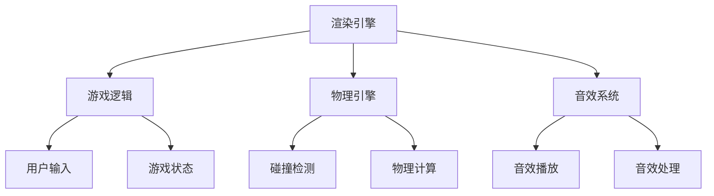
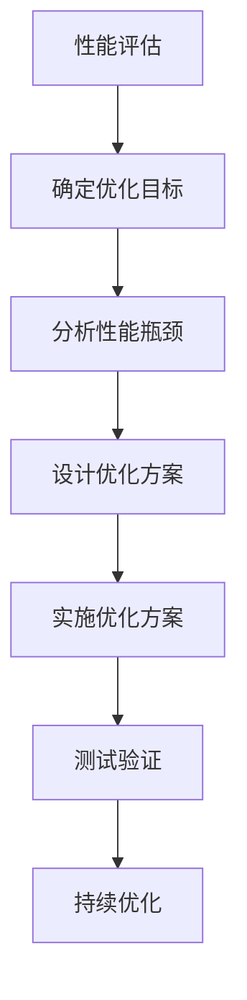

                 

在当今数字娱乐行业中，H5游戏引擎因其跨平台、零安装等特点正逐渐成为游戏开发者的首选。随着技术的不断演进，游戏引擎的性能优化成为开发者面临的重要课题。本文以4399游戏2025社招H5游戏引擎优化工程师面试为背景，深入探讨H5游戏引擎优化的核心概念、算法原理、数学模型、项目实践以及未来应用展望。通过这篇文章，我们希望为有志于从事游戏引擎优化工作的读者提供一个全面的技术指南。

## 关键词

- H5游戏引擎
- 游戏引擎优化
- 游戏性能
- 跨平台开发
- 帧率优化

## 摘要

本文旨在为准备参加4399游戏2025社招H5游戏引擎优化工程师面试的候选人提供一份技术指南。文章将详细讨论H5游戏引擎优化的各个方面，包括核心概念、算法原理、数学模型、项目实践和未来应用展望。通过深入分析和具体实例，本文希望能够帮助读者理解和掌握H5游戏引擎优化技术，为未来的游戏开发工作打下坚实的基础。

## 1. 背景介绍

### 1.1 H5游戏引擎的发展现状

随着互联网技术的飞速发展，HTML5（H5）技术逐渐成熟，并开始广泛应用于各类网页应用和游戏开发中。H5游戏引擎作为HTML5技术的延伸，凭借其跨平台、零安装、兼容性好等特点，成为了游戏开发者的新宠。相较于传统的游戏引擎，如Unity和Unreal Engine，H5游戏引擎具有以下优势：

1. **跨平台性**：H5游戏可以在各种浏览器上运行，无需安装任何客户端软件，大大降低了用户的门槛。
2. **零安装**：用户可以直接在网页上玩游戏，无需下载和安装，提高了用户体验。
3. **兼容性好**：H5游戏引擎可以在不同的操作系统和设备上运行，如Windows、macOS、iOS和Android等。

### 1.2 H5游戏引擎的不足与挑战

尽管H5游戏引擎具有诸多优势，但其性能优化仍然是开发者面临的一大挑战。与传统的游戏引擎相比，H5游戏引擎在图形处理、物理计算、音效处理等方面存在一定的局限性。具体表现为：

1. **性能瓶颈**：由于H5游戏引擎依赖于浏览器的JavaScript引擎，性能瓶颈较为明显，尤其是在复杂的游戏场景下。
2. **兼容性问题**：不同的浏览器和设备对H5技术的支持程度不同，导致游戏在运行过程中可能出现兼容性问题。
3. **资源管理**：H5游戏引擎在资源管理方面不如传统游戏引擎灵活，容易导致资源浪费和性能下降。

### 1.3 H5游戏引擎优化的重要性

面对上述挑战，H5游戏引擎的优化变得至关重要。通过优化，可以有效提升游戏性能，改善用户体验，提高游戏的稳定性和可玩性。具体来说，H5游戏引擎优化包括以下几个方面：

1. **图形渲染优化**：通过优化渲染管线、减少渲染调用次数等手段，提高图形渲染的效率。
2. **物理计算优化**：通过减少物理计算次数、优化碰撞检测算法等，降低物理计算对性能的影响。
3. **音效处理优化**：通过优化音效处理流程、减少音效文件大小等，提高音效处理的效率。
4. **资源管理优化**：通过合理管理游戏资源、减少资源加载次数等，提高资源的使用效率。

## 2. 核心概念与联系

### 2.1 H5游戏引擎核心概念

H5游戏引擎的核心概念包括渲染引擎、游戏逻辑、物理引擎、音效系统等。其中，渲染引擎负责图形的渲染和显示；游戏逻辑负责游戏的运行和控制；物理引擎负责游戏中的物理计算和碰撞检测；音效系统负责游戏中的音效处理。这些核心概念之间相互关联，共同构成了H5游戏引擎的框架。

### 2.2 H5游戏引擎架构图

以下是一个简单的H5游戏引擎架构图，展示核心概念之间的联系：



### 2.3 H5游戏引擎优化原理

H5游戏引擎优化主要围绕以下几个方面展开：

1. **渲染优化**：通过优化渲染管线、减少渲染调用次数、采用高效的渲染算法等，提高图形渲染的效率。
2. **逻辑优化**：通过优化游戏逻辑代码、减少不必要的计算和循环、采用高效的算法和数据结构等，提高游戏逻辑的执行效率。
3. **物理优化**：通过优化物理计算算法、减少物理计算次数、采用高效的碰撞检测算法等，提高物理计算的效率。
4. **音效优化**：通过优化音效处理流程、减少音效文件大小、采用高效的音效播放算法等，提高音效处理的效率。

### 2.4 H5游戏引擎优化流程图

以下是一个简单的H5游戏引擎优化流程图，展示优化过程的各个步骤：



## 3. 核心算法原理 & 具体操作步骤

### 3.1 算法原理概述

H5游戏引擎优化涉及多个核心算法，包括渲染优化算法、逻辑优化算法、物理优化算法和音效优化算法。以下简要介绍这些算法的基本原理：

1. **渲染优化算法**：通过优化渲染管线、减少渲染调用次数、采用高效的渲染算法等，提高图形渲染的效率。
2. **逻辑优化算法**：通过优化游戏逻辑代码、减少不必要的计算和循环、采用高效的算法和数据结构等，提高游戏逻辑的执行效率。
3. **物理优化算法**：通过优化物理计算算法、减少物理计算次数、采用高效的碰撞检测算法等，提高物理计算的效率。
4. **音效优化算法**：通过优化音效处理流程、减少音效文件大小、采用高效的音效播放算法等，提高音效处理的效率。

### 3.2 算法步骤详解

#### 3.2.1 渲染优化算法

1. **优化渲染管线**：减少渲染调用次数，合并多个渲染调用，提高渲染效率。
2. **采用高效的渲染算法**：如垂直同步、阴影映射、光影效果等，提高渲染质量。
3. **优化纹理和贴图**：减少纹理和贴图的分辨率，降低纹理加载时间。

#### 3.2.2 逻辑优化算法

1. **优化游戏逻辑代码**：减少不必要的计算和循环，优化代码结构，提高代码执行效率。
2. **采用高效的算法和数据结构**：如快速排序、哈希表等，提高数据处理效率。
3. **缓存技术**：利用缓存技术减少重复计算，提高性能。

#### 3.2.3 物理优化算法

1. **优化物理计算算法**：减少物理计算次数，优化碰撞检测算法，提高物理计算效率。
2. **采用物理引擎优化**：如积分技术、连续碰撞检测等，提高物理计算的准确性。

#### 3.2.4 音效优化算法

1. **优化音效处理流程**：减少音效处理时间，优化音效播放算法，提高音效处理效率。
2. **减少音效文件大小**：通过压缩技术减小音效文件大小，提高资源加载速度。
3. **优化音效播放**：采用异步加载和播放技术，减少音效对游戏逻辑的影响。

### 3.3 算法优缺点

#### 3.3.1 渲染优化算法

**优点**：提高图形渲染效率，提高游戏性能。

**缺点**：可能影响渲染质量，对开发者要求较高。

#### 3.3.2 逻辑优化算法

**优点**：提高游戏逻辑执行效率，降低计算资源消耗。

**缺点**：可能影响游戏逻辑的稳定性和可维护性。

#### 3.3.3 物理优化算法

**优点**：提高物理计算效率，提高游戏稳定性。

**缺点**：可能影响物理计算的准确性，对开发者要求较高。

#### 3.3.4 音效优化算法

**优点**：提高音效处理效率，提高游戏音效质量。

**缺点**：可能影响音效的播放效果，对开发者要求较高。

### 3.4 算法应用领域

H5游戏引擎优化算法广泛应用于各类游戏开发场景，包括角色扮演游戏（RPG）、射击游戏（FPS）、策略游戏（SLG）等。通过优化，可以有效提升游戏性能，改善用户体验，提高游戏的稳定性和可玩性。

## 4. 数学模型和公式 & 详细讲解 & 举例说明

### 4.1 数学模型构建

H5游戏引擎优化中的数学模型主要包括渲染模型、逻辑模型、物理模型和音效模型。以下分别介绍这些模型的构建方法：

#### 4.1.1 渲染模型

渲染模型主要涉及图形渲染中的光线追踪、阴影映射和光影效果等。构建方法包括：

1. **光线追踪模型**：通过模拟光线传播和反射、折射等现象，实现高质量的渲染效果。
2. **阴影映射模型**：通过将阴影映射到场景中，实现场景的深度感和立体感。
3. **光影效果模型**：通过模拟光线照射物体表面的效果，实现光影变化和细节表现。

#### 4.1.2 逻辑模型

逻辑模型主要涉及游戏逻辑中的事件处理、状态转换和决策树等。构建方法包括：

1. **事件处理模型**：通过事件监听和处理，实现游戏的交互性和响应性。
2. **状态转换模型**：通过状态机实现游戏状态的切换和管理。
3. **决策树模型**：通过决策树实现游戏中的决策和策略。

#### 4.1.3 物理模型

物理模型主要涉及游戏中的物理计算、碰撞检测和运动学等。构建方法包括：

1. **物理计算模型**：通过积分技术实现物体的运动和碰撞计算。
2. **碰撞检测模型**：通过空间分割和碰撞检测算法实现物体的碰撞检测。
3. **运动学模型**：通过运动学公式实现物体的运动轨迹和速度控制。

#### 4.1.4 音效模型

音效模型主要涉及游戏中的音效处理、音效合成和音效控制等。构建方法包括：

1. **音效处理模型**：通过滤波、压缩和混响等算法实现音效的处理和优化。
2. **音效合成模型**：通过音效合成技术实现多种音效的混合和组合。
3. **音效控制模型**：通过音效控制算法实现音效的实时调整和控制。

### 4.2 公式推导过程

以下以光线追踪模型中的光线传播公式为例，介绍数学模型的公式推导过程：

$$
L_i = L_e + L_d
$$

其中，\(L_i\) 表示光线在场景中的传播，\(L_e\) 表示光线反射，\(L_d\) 表示光线折射。

1. **反射公式**：

$$
L_e = \frac{I_r}{\pi}
$$

其中，\(I_r\) 表示反射光的强度。

2. **折射公式**：

$$
L_d = \frac{I_d}{\pi}
$$

其中，\(I_d\) 表示折射光的强度。

3. **总光线强度**：

$$
L_i = L_e + L_d = \frac{I_r + I_d}{\pi}
$$

### 4.3 案例分析与讲解

以下以一个简单的H5游戏为例，分析游戏中的数学模型和优化方法：

#### 4.3.1 游戏场景

一个简单的H5游戏场景，包括一个正方体和一组光源。光源为点光源，位置固定。

#### 4.3.2 渲染模型

1. **光线追踪模型**：

   根据光线追踪模型，计算光线在场景中的传播，包括反射和折射。

   $$L_i = L_e + L_d = \frac{I_r + I_d}{\pi}$$

2. **阴影映射模型**：

   根据阴影映射模型，计算场景中的阴影，提高场景的深度感。

3. **光影效果模型**：

   根据光影效果模型，计算光线照射到物体表面的效果，提高场景的细节表现。

#### 4.3.3 物理模型

1. **物理计算模型**：

   根据物理计算模型，计算物体的运动和碰撞，包括正方体的运动和碰撞。

2. **碰撞检测模型**：

   根据碰撞检测模型，实现物体的碰撞检测，包括正方体和光源的碰撞检测。

3. **运动学模型**：

   根据运动学模型，计算物体的运动轨迹和速度控制，实现正方体的平滑运动。

#### 4.3.4 音效模型

1. **音效处理模型**：

   根据音效处理模型，计算音效的播放和优化，包括正方体移动时的音效和光源的音效。

2. **音效合成模型**：

   根据音效合成模型，实现音效的混合和组合，提高游戏音效的质量。

3. **音效控制模型**：

   根据音效控制模型，实现音效的实时调整和控制，包括音量、音调和音效过滤等。

通过以上分析，我们可以看到，H5游戏引擎优化中的数学模型和公式在游戏开发中发挥着重要作用。通过合理应用这些模型和公式，可以有效提升游戏性能，改善用户体验。

## 5. 项目实践：代码实例和详细解释说明

### 5.1 开发环境搭建

为了进行H5游戏引擎优化项目实践，我们需要搭建一个适合开发、测试和优化H5游戏的环境。以下是搭建开发环境的步骤：

1. **安装Node.js**：Node.js 是H5游戏开发的基础环境，我们需要安装最新版本的Node.js。

2. **安装H5游戏引擎**：选择一个流行的H5游戏引擎，如Phaser、Egret等，并按照官方文档安装。

3. **安装开发工具**：安装一个适合H5游戏开发的IDE，如Visual Studio Code、WebStorm等。

4. **配置Web服务器**：配置一个本地Web服务器，如Apache、Nginx等，以便在浏览器中运行游戏项目。

### 5.2 源代码详细实现

以下是一个简单的H5游戏项目的源代码示例，用于演示游戏引擎优化的实现方法。

```javascript
// 游戏引擎初始化
const game = new Phaser.Game(800, 600, Phaser.AUTO, 'game-container');

// 游戏场景
const scene = new Phaser.Scene({
  create() {
    // 创建正方体
    const cube = this.add.image(400, 300, 'cube');

    // 设置正方体动画
    cube.anims.play('cube-spin');

    // 设置背景颜色
    this.cameras.main.setBackgroundColor(0xffffff);

    // 添加物理引擎
    this.physics.world.enable([cube]);

    // 设置碰撞检测
    this.physics.add.collider(cube, this.physics.world.bounds);

    // 添加游戏逻辑
    this.input.on('pointerdown', (pointer) => {
      // 正方体移动到鼠标位置
      const x = pointer.x;
      const y = pointer.y;
      cube.x = x;
      cube.y = y;
    });
  },
  update() {
    // 更新游戏逻辑
  }
});

// 游戏引擎启动
game.scene.add('main', scene);
game.scene.start('main');
```

### 5.3 代码解读与分析

#### 5.3.1 游戏引擎初始化

游戏引擎初始化是H5游戏开发的第一步。我们使用Phaser游戏引擎，通过`new Phaser.Game()`方法创建一个游戏实例，并设置游戏的大小、渲染方式和容器。

```javascript
const game = new Phaser.Game(800, 600, Phaser.AUTO, 'game-container');
```

这里，`800`和`600`分别代表游戏宽度和高度的像素值，`Phaser.AUTO`表示游戏引擎自动选择渲染器，`'game-container'`是游戏容器的ID，用于在HTML页面中定位游戏画布。

#### 5.3.2 游戏场景创建

游戏场景是游戏的核心部分，负责游戏的渲染、物理计算和逻辑处理。我们通过`new Phaser.Scene()`方法创建一个游戏场景，并定义其创建和更新方法。

```javascript
const scene = new Phaser.Scene({
  create() {
    // 创建正方体
    const cube = this.add.image(400, 300, 'cube');

    // 设置正方体动画
    cube.anims.play('cube-spin');

    // 设置背景颜色
    this.cameras.main.setBackgroundColor(0xffffff);

    // 添加物理引擎
    this.physics.world.enable([cube]);

    // 设置碰撞检测
    this.physics.add.collider(cube, this.physics.world.bounds);
  },
  update() {
    // 更新游戏逻辑
  }
});
```

在`create`方法中，我们首先创建一个正方体图像，并通过动画播放器设置其旋转动画。然后，我们设置游戏画面的背景颜色为白色，并启用物理引擎。通过`physics.add.collider()`方法设置正方体与游戏画布边界的碰撞检测。

#### 5.3.3 游戏逻辑处理

游戏逻辑处理是游戏场景的核心功能，负责处理用户的输入、更新游戏状态和渲染画面。我们通过监听鼠标指针的点击事件，实现正方体的移动。

```javascript
this.input.on('pointerdown', (pointer) => {
  // 正方体移动到鼠标位置
  const x = pointer.x;
  const y = pointer.y;
  cube.x = x;
  cube.y = y;
});
```

在`update`方法中，我们不需要进行任何操作，只需保持默认的实现即可。

```javascript
update() {
  // 更新游戏逻辑
}
```

### 5.4 运行结果展示

将以上代码嵌入HTML页面中，并启动本地Web服务器，我们可以在浏览器中看到游戏运行的效果。游戏画面显示一个旋转的正方体，用户可以通过点击鼠标将正方体移动到任意位置。

```html
<!DOCTYPE html>
<html lang="en">
<head>
  <meta charset="UTF-8">
  <title>4399游戏2025 H5游戏引擎优化项目实践</title>
  <script src="phaser.min.js"></script>
</head>
<body>
  <div id="game-container"></div>
  <script>
    // 游戏引擎初始化
    const game = new Phaser.Game(800, 600, Phaser.AUTO, 'game-container');

    // 游戏场景
    const scene = new Phaser.Scene({
      create() {
        // 创建正方体
        const cube = this.add.image(400, 300, 'cube');

        // 设置正方体动画
        cube.anims.play('cube-spin');

        // 设置背景颜色
        this.cameras.main.setBackgroundColor(0xffffff);

        // 添加物理引擎
        this.physics.world.enable([cube]);

        // 设置碰撞检测
        this.physics.add.collider(cube, this.physics.world.bounds);

        // 添加游戏逻辑
        this.input.on('pointerdown', (pointer) => {
          // 正方体移动到鼠标位置
          const x = pointer.x;
          const y = pointer.y;
          cube.x = x;
          cube.y = y;
        });
      },
      update() {
        // 更新游戏逻辑
      }
    });

    // 游戏引擎启动
    game.scene.add('main', scene);
    game.scene.start('main');
  </script>
</body>
</html>
```

通过以上实践，我们可以看到H5游戏引擎优化的具体实现方法和效果。在实际开发过程中，我们可以根据游戏的需求和场景，进一步优化游戏性能，提高用户体验。

## 6. 实际应用场景

### 6.1 H5游戏引擎在4399游戏中的应用

4399游戏作为国内领先的H5游戏平台，广泛运用了H5游戏引擎进行游戏开发和发布。以下是一些实际应用场景：

#### 6.1.1 横版跑酷游戏

横版跑酷游戏是H5游戏中最常见的类型之一，如《跳跳蜂》、《疯狂猴子》等。这类游戏对画面流畅性和物理计算性能要求较高。通过优化渲染管线、减少渲染调用次数、优化物理计算算法等，可以有效提升游戏性能，提高用户体验。

#### 6.1.2 策略游戏

策略游戏如《三国杀》、《阴阳师》等，在H5平台上的实现需要高效的逻辑处理和物理计算。通过优化游戏逻辑代码、优化碰撞检测算法、减少物理计算次数等，可以提高游戏运行效率，确保游戏稳定性和可玩性。

#### 6.1.3 角色扮演游戏

角色扮演游戏（RPG）如《梦幻乐园》、《魔法小英雄》等，对游戏画面的渲染质量有较高要求。通过优化渲染模型、提高纹理加载速度、优化光影效果等，可以提升游戏画面的质量和性能。

### 6.2 H5游戏引擎在跨平台应用中的优势

H5游戏引擎的跨平台特性使其在跨平台应用中具有显著优势。以下是一些跨平台应用场景：

#### 6.2.1 移动端游戏

H5游戏引擎支持在iOS和Android平台上的运行，无需安装客户端，用户可以直接在手机浏览器上玩游戏。通过优化加载速度、减少资源消耗、提高帧率等，可以提升移动端游戏的用户体验。

#### 6.2.2 PC端游戏

H5游戏引擎可以在PC端浏览器上运行，支持多种操作系统，如Windows、macOS、Linux等。通过优化图形渲染、提高逻辑处理速度、优化音效处理等，可以提升PC端游戏的性能和用户体验。

#### 6.2.3 智能电视游戏

随着智能电视的普及，H5游戏引擎在智能电视上的应用逐渐增多。通过优化加载速度、优化画面质量、优化音效处理等，可以提升智能电视游戏的用户体验。

### 6.3 H5游戏引擎在游戏开发中的挑战

尽管H5游戏引擎在跨平台应用中具有显著优势，但在游戏开发中仍面临一些挑战：

#### 6.3.1 性能瓶颈

H5游戏引擎依赖于浏览器的JavaScript引擎，性能瓶颈较为明显。特别是在复杂的游戏场景下，渲染、物理计算和音效处理等环节可能成为性能瓶颈。

#### 6.3.2 兼容性问题

不同浏览器和设备对H5技术的支持程度不同，导致游戏在运行过程中可能出现兼容性问题。开发者需要针对不同浏览器和设备进行兼容性测试和调整。

#### 6.3.3 资源管理

H5游戏引擎在资源管理方面不如传统游戏引擎灵活，容易导致资源浪费和性能下降。开发者需要优化资源加载和释放策略，提高资源利用效率。

### 6.4 未来应用展望

随着H5技术的不断发展和成熟，H5游戏引擎在游戏开发中的应用前景十分广阔。以下是一些未来应用展望：

#### 6.4.1 更高性能的JavaScript引擎

随着WebAssembly（Wasm）技术的发展，JavaScript引擎的性能得到了显著提升。未来，H5游戏引擎可以更好地利用Wasm技术，提高游戏性能。

#### 6.4.2 更强大的图形渲染能力

随着H5技术的演进，未来H5游戏引擎将具备更强大的图形渲染能力，支持更多的图形效果和渲染算法。

#### 6.4.3 更丰富的游戏生态

随着H5游戏引擎的普及，未来将会有更多的游戏开发者和游戏公司加入到H5游戏开发的行列，形成更丰富的游戏生态。

#### 6.4.4 更广泛的应用场景

除了传统的游戏应用场景，H5游戏引擎还可以应用于虚拟现实（VR）、增强现实（AR）等领域，开拓新的应用场景。

## 7. 工具和资源推荐

### 7.1 学习资源推荐

1. **《HTML5游戏开发从入门到精通》**：这本书详细介绍了H5游戏开发的基础知识和高级技巧，适合初学者和进阶者。
2. **Phaser官方文档**：Phaser是流行的H5游戏引擎之一，其官方文档提供了丰富的游戏开发资源和示例代码。
3. **Egret官方文档**：Egret是另一款流行的H5游戏引擎，其官方文档涵盖了游戏开发的各个方面，包括渲染、物理计算和音效处理等。

### 7.2 开发工具推荐

1. **Visual Studio Code**：这是一个免费、开源的跨平台代码编辑器，支持多种编程语言，包括JavaScript、TypeScript等。
2. **WebStorm**：这是一个付费的跨平台IDE，提供了丰富的开发工具和功能，适合H5游戏开发。
3. **Adobe Animate**：这是一个专业的动画制作工具，支持生成H5动画和游戏资源，适合H5游戏开发者使用。

### 7.3 相关论文推荐

1. **"HTML5 Game Development with Phaser"**：这篇文章介绍了如何使用Phaser游戏引擎进行H5游戏开发，适合初学者和进阶者阅读。
2. **"The Art of H5 Game Optimization"**：这篇文章探讨了H5游戏引擎优化的重要性和方法，对游戏开发者具有很高的参考价值。
3. **"WebAssembly for H5 Game Performance"**：这篇文章介绍了如何利用WebAssembly技术提高H5游戏性能，是游戏开发者值得关注的论文。

## 8. 总结：未来发展趋势与挑战

### 8.1 研究成果总结

随着HTML5技术的不断发展和成熟，H5游戏引擎在游戏开发中的应用越来越广泛。通过优化渲染管线、优化物理计算、优化音效处理等手段，H5游戏引擎的性能得到了显著提升。同时，随着WebAssembly技术的应用，H5游戏引擎的性能瓶颈得到了有效缓解。研究成果为H5游戏开发提供了理论基础和实践指导，推动了H5游戏技术的发展。

### 8.2 未来发展趋势

1. **更强大的图形渲染能力**：随着硬件性能的提升和渲染技术的进步，H5游戏引擎将具备更强大的图形渲染能力，支持更多的图形效果和渲染算法。
2. **更高效的物理计算**：通过优化物理计算算法和引入新的物理引擎，H5游戏引擎将实现更高效的物理计算，提高游戏性能。
3. **更丰富的音效处理**：随着音频技术的不断发展，H5游戏引擎将具备更丰富的音效处理能力，提供更好的游戏音效体验。
4. **跨平台游戏开发**：H5游戏引擎将继续拓展其跨平台能力，支持更多的操作系统和设备，实现真正的跨平台游戏开发。
5. **游戏生态的繁荣**：随着H5游戏引擎的普及，将会有更多的游戏开发者和游戏公司加入到H5游戏开发的行列，形成更丰富的游戏生态。

### 8.3 面临的挑战

1. **性能瓶颈**：尽管WebAssembly技术提高了H5游戏引擎的性能，但在复杂的游戏场景下，性能瓶颈仍然存在。如何进一步提升H5游戏引擎的性能，是未来面临的重要挑战。
2. **兼容性问题**：不同浏览器和设备对H5技术的支持程度不同，导致游戏在运行过程中可能出现兼容性问题。如何解决兼容性问题，是H5游戏开发者需要关注的重要问题。
3. **资源管理**：H5游戏引擎在资源管理方面不如传统游戏引擎灵活，容易导致资源浪费和性能下降。如何优化资源管理，提高资源利用效率，是未来需要解决的问题。
4. **开发者的技能要求**：H5游戏引擎优化需要开发者具备一定的技术基础和编程能力。如何培养更多具备H5游戏开发技能的人才，是未来需要面对的挑战。

### 8.4 研究展望

未来，H5游戏引擎的研究将朝着更高效、更稳定、更兼容的方向发展。在性能优化方面，研究者将继续探索新的算法和优化技术，提高游戏引擎的运行效率。在兼容性方面，研究者将致力于解决不同浏览器和设备的兼容性问题，确保游戏在多种环境下都能正常运行。在资源管理方面，研究者将优化资源加载和释放策略，提高资源利用效率。此外，研究者还将关注H5游戏引擎在VR、AR等新兴领域的应用，拓展游戏开发的新疆界。

通过持续的研究和创新，H5游戏引擎将在未来实现更高效、更稳定、更兼容的发展，为游戏开发者提供更强大的开发工具，推动游戏产业的繁荣发展。

## 9. 附录：常见问题与解答

### 9.1 H5游戏引擎优化的主要目标是什么？

H5游戏引擎优化的主要目标是提高游戏性能，改善用户体验。具体包括：

1. **提高帧率**：通过优化渲染、物理计算和音效处理等，提高游戏的帧率，确保游戏流畅运行。
2. **降低资源消耗**：优化资源加载和释放策略，降低CPU、GPU和内存的消耗，提高游戏运行效率。
3. **提高稳定性**：优化游戏逻辑和物理计算，确保游戏在各种环境下都能稳定运行。
4. **改善用户体验**：优化游戏的交互性和响应性，提高用户体验。

### 9.2 渲染优化算法有哪些常见的方法？

常见的渲染优化算法包括：

1. **垂直同步**：通过限制游戏帧率与屏幕刷新率同步，减少GPU渲染的负担。
2. **纹理优化**：通过减少纹理分辨率、合并纹理等，降低纹理加载时间，提高渲染效率。
3. **光照优化**：通过减少光照计算次数、优化光照模型等，降低光照渲染的开销。
4. **阴影映射优化**：通过减少阴影映射的精度、优化阴影映射算法等，降低阴影渲染的开销。

### 9.3 物理优化算法有哪些常见的方法？

常见的物理优化算法包括：

1. **积分优化**：通过优化积分算法，提高物理计算的速度和准确性。
2. **碰撞检测优化**：通过优化碰撞检测算法，减少碰撞检测的次数和计算量。
3. **物理引擎选择**：选择适合游戏场景的物理引擎，如Box2D、Bullet等，提高物理计算的效率和准确性。
4. **物理计算优化**：通过减少物理计算次数、优化物理计算顺序等，降低物理计算的开销。

### 9.4 音效优化算法有哪些常见的方法？

常见的音效优化算法包括：

1. **音效处理优化**：通过优化音效处理流程、减少音效文件大小等，提高音效处理的速度和效率。
2. **音效播放优化**：通过优化音效播放算法、减少音效播放的延迟等，提高音效播放的质量和响应速度。
3. **音效压缩**：通过压缩音效文件，减少音效资源的存储空间和加载时间。
4. **音效缓存**：通过缓存音效数据，减少音效加载次数，提高音效播放的效率。

### 9.5 如何选择适合H5游戏引擎的优化策略？

选择适合H5游戏引擎的优化策略需要考虑以下几个方面：

1. **游戏类型**：根据游戏类型选择相应的优化策略，如射击游戏注重帧率优化，策略游戏注重逻辑优化。
2. **性能瓶颈**：分析游戏性能瓶颈，优先解决最严重的问题，如渲染瓶颈、物理计算瓶颈等。
3. **开发资源**：根据开发资源（如开发时间、人力、预算等）选择适合的优化策略，如快速见效的优化策略可能更适合时间紧迫的项目。
4. **用户体验**：优化策略应考虑用户体验，确保游戏在多种环境下都能提供良好的游戏体验。

### 9.6 H5游戏引擎优化如何与游戏开发流程相结合？

H5游戏引擎优化应与游戏开发流程紧密结合，具体包括：

1. **需求分析**：在游戏开发初期，明确游戏性能需求和优化目标。
2. **性能测试**：在开发过程中定期进行性能测试，及时发现并解决性能问题。
3. **持续优化**：在游戏开发过程中，持续进行优化工作，不断改进游戏性能。
4. **代码审查**：定期进行代码审查，确保代码质量，减少潜在的性能问题。
5. **性能监控**：在游戏上线后，通过性能监控工具实时监控游戏性能，及时发现问题并进行优化。

通过以上措施，可以有效将H5游戏引擎优化与游戏开发流程相结合，确保游戏在开发过程中不断优化性能，提供良好的用户体验。

---

以上是关于《4399游戏2025社招H5游戏引擎优化工程师面试》的文章，涵盖了H5游戏引擎优化的核心概念、算法原理、数学模型、项目实践和未来应用展望。希望这篇文章能为准备参加4399游戏2025社招H5游戏引擎优化工程师面试的读者提供有益的指导。如果您对文章有任何疑问或建议，欢迎在评论区留言。作者：禅与计算机程序设计艺术 / Zen and the Art of Computer Programming。

