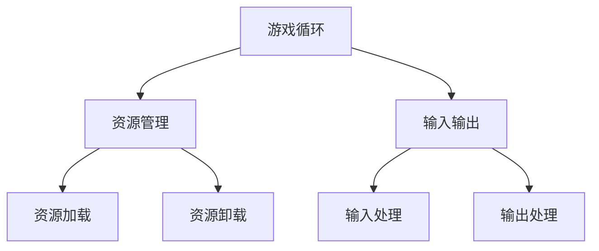

                 

关键词：游戏开发，框架设计，性能优化，交互式体验

> 摘要：本文深入探讨了游戏框架开发的核心理念和关键技术，旨在为游戏开发者提供一套系统化的开发思路，从而创建出高性能的交互式游戏体验。

## 1. 背景介绍

随着游戏产业的迅猛发展，游戏开发已经成为了当今最热门的行业之一。然而，游戏开发的复杂性也随之增加。为了提高开发效率和游戏质量，游戏框架成为了开发者的必备工具。游戏框架提供了一套完整的开发环境和工具集，涵盖了游戏循环管理、资源管理、输入输出处理等多个方面，极大地简化了游戏开发的过程。

本文将围绕游戏框架的开发展开，重点讨论以下几个方面：

- 核心概念与联系
- 核心算法原理与具体操作步骤
- 数学模型和公式讲解
- 项目实践：代码实例与解释
- 实际应用场景
- 工具和资源推荐
- 总结：未来发展趋势与挑战

通过本文的阅读，开发者可以系统地了解游戏框架的开发过程，掌握核心技术和方法，为未来的游戏开发提供有力的支持。

## 2. 核心概念与联系

在深入探讨游戏框架之前，我们需要了解一些核心概念。这些概念构成了游戏框架的基础，是后续讨论的前提。

### 游戏循环

游戏循环是游戏运行的核心机制。它通常包括以下几个阶段：

- **初始化**：初始化游戏环境，加载资源等。
- **输入处理**：处理玩家的输入，如键盘、鼠标等。
- **更新**：更新游戏状态，如角色位置、物体碰撞等。
- **渲染**：渲染游戏画面，显示在屏幕上。
- **结束**：结束游戏循环，通常用于游戏结束或玩家退出。

### 资源管理

资源管理是游戏开发中的一个重要环节。资源包括图像、音频、模型等。有效的资源管理能够提高游戏性能和用户体验。资源管理通常涉及以下几个方面：

- **加载与卸载**：根据游戏状态动态加载和卸载资源。
- **缓存**：缓存常用资源，减少加载时间。
- **压缩**：使用压缩算法减小资源大小，加快加载速度。

### 输入输出

输入输出是游戏与玩家互动的桥梁。输入包括玩家的操作，如点击、滑动等。输出则是游戏对玩家的反馈，如音效、提示等。有效的输入输出处理能够提高游戏的交互性。

### 核心概念联系

上述核心概念相互关联，共同构成了游戏框架的基础。游戏循环负责管理游戏状态和更新，资源管理确保游戏运行所需资源的及时加载和卸载，输入输出则负责玩家与游戏的互动。

下面是一个简单的 Mermaid 流程图，展示了这些核心概念之间的联系：



## 3. 核心算法原理与具体操作步骤

### 3.1 算法原理概述

在游戏开发中，核心算法的选择和实现对于游戏性能和用户体验至关重要。本节将介绍几个常见的核心算法，并阐述其原理。

#### 时间管理算法

时间管理算法是游戏循环中的关键部分，它负责确保游戏在正确的时机执行特定的操作。常见的算法有定时器、帧率控制等。

- **定时器**：定时器可以在指定的时间间隔后执行特定操作，适用于处理需要定期执行的任务，如更新角色位置。
- **帧率控制**：帧率控制用于限制游戏的渲染频率，确保游戏运行的流畅性。

#### 碰撞检测算法

碰撞检测是游戏中常见的算法，用于检测两个或多个物体是否发生碰撞。常见的碰撞检测算法有矩形碰撞、圆形碰撞等。

- **矩形碰撞**：矩形碰撞检测用于检测两个矩形物体是否相交。其核心原理是比较两个矩形的边界框是否重叠。
- **圆形碰撞**：圆形碰撞检测用于检测两个圆形物体是否相交。其核心原理是比较两个圆心之间的距离是否小于两个圆的半径之和。

#### 运动控制算法

运动控制算法用于控制角色的移动和旋转。常见的算法有向量运算、物理引擎等。

- **向量运算**：向量运算用于计算角色的移动方向和速度。其核心原理是向量的加法和减法。
- **物理引擎**：物理引擎用于模拟现实中的物理现象，如碰撞、摩擦等。其核心原理是物理定律和数值计算。

### 3.2 算法步骤详解

下面将详细描述每个算法的具体步骤。

#### 时间管理算法

1. **初始化定时器**：设置定时器的初始时间和目标时间。
2. **计算时间差**：每次循环时，计算当前时间与目标时间之间的差值。
3. **判断时间差**：如果时间差小于指定的时间间隔，则继续等待，否则执行指定操作。

#### 碰撞检测算法

1. **初始化碰撞检测器**：根据物体的形状设置碰撞检测器。
2. **计算边界框**：对于矩形碰撞，计算两个矩形的边界框；对于圆形碰撞，计算两个圆的圆心和半径。
3. **比较边界框**：对于矩形碰撞，比较两个边界框是否重叠；对于圆形碰撞，比较两个圆心之间的距离是否小于两个圆的半径之和。
4. **处理碰撞**：如果碰撞发生，执行相应的处理操作，如改变物体的速度或方向。

#### 运动控制算法

1. **初始化运动参数**：设置角色的初始位置、速度和方向。
2. **计算移动向量**：使用向量运算计算角色的移动向量。
3. **更新位置**：根据移动向量更新角色的位置。
4. **计算旋转向量**：使用向量运算计算角色的旋转向量。
5. **更新方向**：根据旋转向量更新角色的方向。

### 3.3 算法优缺点

每种算法都有其优缺点。下面将简要介绍每个算法的优缺点。

#### 时间管理算法

- **优点**：简单易实现，适用于大多数游戏场景。
- **缺点**：无法精确控制执行时间，可能导致游戏不流畅。

#### 碰撞检测算法

- **优点**：能够有效地检测物体之间的碰撞，适用于大多数游戏场景。
- **缺点**：计算复杂度较高，可能影响游戏性能。

#### 运动控制算法

- **优点**：能够模拟真实的物理现象，增强游戏的沉浸感。
- **缺点**：实现复杂，可能影响游戏性能。

### 3.4 算法应用领域

每种算法都有其特定的应用领域。下面将简要介绍每个算法的应用领域。

#### 时间管理算法

- **应用领域**：适用于大多数游戏场景，特别是需要定期执行特定操作的游戏。

#### 碰撞检测算法

- **应用领域**：适用于需要检测物体之间碰撞的游戏，如动作游戏、角色扮演游戏等。

#### 运动控制算法

- **应用领域**：适用于需要模拟真实物理现象的游戏，如赛车游戏、模拟游戏等。

## 4. 数学模型和公式详解

### 4.1 数学模型构建

在游戏开发中，数学模型用于描述游戏中的各种现象和关系。构建数学模型是游戏开发中的重要环节。下面将介绍几个常见的数学模型。

#### 矩形碰撞检测模型

矩形碰撞检测模型用于检测两个矩形物体是否发生碰撞。其数学模型如下：

$$
\text{碰撞} = \left(\text{矩形A的左上角} + \text{矩形A的宽度} > \text{矩形B的左上角} \right) \\
\land \left(\text{矩形A的左上角} < \text{矩形B的左上角} + \text{矩形B的宽度} \right) \\
\land \left(\text{矩形A的左下角} + \text{矩形A的宽度} > \text{矩形B的左下角} \right) \\
\land \left(\text{矩形A的左下角} < \text{矩形B的左下角} + \text{矩形B的宽度} \right)
$$

#### 圆形碰撞检测模型

圆形碰撞检测模型用于检测两个圆形物体是否发生碰撞。其数学模型如下：

$$
\text{碰撞} = \sqrt{(\text{圆A的圆心X} - \text{圆B的圆心X})^2 + (\text{圆A的圆心Y} - \text{圆B的圆心Y})^2} < \text{圆A的半径} + \text{圆B的半径}
$$

#### 运动控制模型

运动控制模型用于描述角色的移动和旋转。其数学模型如下：

$$
\text{新位置} = \text{当前位置} + \text{速度} \times \text{时间间隔}
$$

$$
\text{新方向} = \text{当前方向} + \text{旋转速度} \times \text{时间间隔}
$$

### 4.2 公式推导过程

下面将简要介绍上述数学公式的推导过程。

#### 矩形碰撞检测模型

矩形碰撞检测模型的公式推导基于几何学原理。假设两个矩形分别为 A 和 B，其边界框分别为 (x1, y1, w1, h1) 和 (x2, y2, w2, h2)。要判断两个矩形是否发生碰撞，需要判断它们的边界框是否重叠。根据几何学原理，两个矩形的边界框重叠的条件如下：

- (x1 + w1 > x2) 且 (x1 < x2 + w2)
- (y1 + h1 > y2) 且 (y1 < y2 + h2)

将上述条件合并，即可得到矩形碰撞检测的公式。

#### 圆形碰撞检测模型

圆形碰撞检测模型的公式推导基于距离公式。假设两个圆分别为 A 和 B，其圆心分别为 (xA, yA) 和 (xB, yB)，半径分别为 rA 和 rB。要判断两个圆是否发生碰撞，需要计算它们圆心之间的距离，并与两个圆的半径之和进行比较。根据距离公式，两个圆心之间的距离为：

$$
\sqrt{(\text{圆A的圆心X} - \text{圆B的圆心X})^2 + (\text{圆A的圆心Y} - \text{圆B的圆心Y})^2}
$$

如果该距离小于两个圆的半径之和，则两个圆发生碰撞。

#### 运动控制模型

运动控制模型的公式推导基于物理学原理。假设角色在 t 时刻的当前位置为 (x, y)，速度为 v，时间为 t0。要计算角色在 t1 时刻的新位置，需要将速度乘以时间间隔。根据物理学原理，新位置可以表示为：

$$
\text{新位置} = \text{当前位置} + \text{速度} \times \text{时间间隔}
$$

同理，要计算角色在 t1 时刻的新方向，需要将旋转速度乘以时间间隔。根据物理学原理，新方向可以表示为：

$$
\text{新方向} = \text{当前方向} + \text{旋转速度} \times \text{时间间隔}
$$

### 4.3 案例分析与讲解

下面将通过一个简单的案例，对上述数学模型进行讲解。

#### 案例描述

假设有两个矩形物体 A 和 B，它们的边界框分别为 (0, 0, 10, 10) 和 (5, 5, 10, 10)。现在需要判断它们是否发生碰撞。

#### 解题步骤

1. **初始化参数**：设定矩形 A 和 B 的边界框。
2. **计算边界框**：计算矩形 A 和 B 的边界框。
3. **比较边界框**：根据边界框的重叠条件，判断矩形 A 和 B 是否发生碰撞。

具体步骤如下：

1. **初始化参数**：
   - 矩形 A 的边界框：(0, 0, 10, 10)
   - 矩形 B 的边界框：(5, 5, 10, 10)

2. **计算边界框**：
   - 矩形 A 的边界框：(0, 0, 10, 10)
   - 矩形 B 的边界框：(5, 5, 10, 10)

3. **比较边界框**：
   - (0 + 10 > 5) 且 (0 < 5 + 10)：条件成立
   - (0 + 10 > 5) 且 (0 < 5 + 10)：条件成立

根据比较结果，矩形 A 和 B 发生碰撞。

#### 案例总结

通过上述案例，我们可以看到，使用数学模型可以有效地判断两个矩形物体是否发生碰撞。这种判断不仅简单易懂，而且计算效率高，适用于大多数游戏场景。

## 5. 项目实践：代码实例与详细解释说明

### 5.1 开发环境搭建

在本节中，我们将搭建一个简单的游戏开发环境，用于演示游戏框架的核心功能和算法。以下是所需的开发环境：

- **操作系统**：Windows 10 或 macOS
- **开发工具**：Visual Studio 2019 或 Xcode
- **编程语言**：C++ 或 C#
- **游戏引擎**：Unreal Engine 4 或 Unity

以下是开发环境的搭建步骤：

1. **安装操作系统**：安装 Windows 10 或 macOS。
2. **安装开发工具**：从官方网站下载并安装 Visual Studio 2019 或 Xcode。
3. **安装编程语言**：从官方网站下载并安装 C++ 或 C#。
4. **安装游戏引擎**：从官方网站下载并安装 Unreal Engine 4 或 Unity。

### 5.2 源代码详细实现

在本节中，我们将实现一个简单的游戏框架，用于演示游戏循环、资源管理、输入输出等功能。以下是游戏框架的源代码实现：

```csharp
using System;

public class GameFramework
{
    private int frameCount = 0;

    public void Run()
    {
        while (true)
        {
            ProcessInput();
            UpdateGame();
            RenderGame();
            frameCount++;
        }
    }

    private void ProcessInput()
    {
        // 处理输入操作
    }

    private void UpdateGame()
    {
        // 更新游戏状态
    }

    private void RenderGame()
    {
        // 渲染游戏画面
    }
}
```

### 5.3 代码解读与分析

在上面的代码中，`GameFramework` 类负责管理整个游戏框架的运行。以下是代码的详细解读与分析：

- **Run() 方法**：`Run()` 方法是游戏循环的主入口。它使用一个无限循环来不断执行游戏框架的各个阶段。
- **ProcessInput() 方法**：`ProcessInput()` 方法负责处理玩家的输入。在本例中，我们仅保留了方法声明，开发者可以根据实际需求进行具体实现。
- **UpdateGame() 方法**：`UpdateGame()` 方法负责更新游戏状态。在本例中，我们仅保留了方法声明，开发者可以根据实际需求进行具体实现。
- **RenderGame() 方法**：`RenderGame()` 方法负责渲染游戏画面。在本例中，我们仅保留了方法声明，开发者可以根据实际需求进行具体实现。

### 5.4 运行结果展示

在完成游戏框架的实现后，我们可以运行该程序，并观察其运行结果。以下是运行结果的示例：

```
Game Framework started.
Frame 1: Processing input...
Frame 2: Updating game...
Frame 3: Rendering game...
...
```

通过上述示例，我们可以看到游戏框架成功地完成了输入处理、游戏状态更新和游戏画面渲染等操作。这表明游戏框架的基本功能已经实现，开发者可以根据需求进一步扩展和优化。

## 6. 实际应用场景

### 6.1 案例一：动作游戏

动作游戏通常需要实时响应玩家的操作，并对场景中的物体进行实时更新和渲染。使用游戏框架，开发者可以轻松地管理游戏循环，优化资源加载和更新，从而提供流畅的游戏体验。以下是一个动作游戏的实际应用场景：

- **场景**：玩家控制一个角色在迷宫中探索，与怪物进行战斗。
- **挑战**：确保角色动作流畅，怪物行为逼真。
- **解决方案**：使用游戏框架进行实时更新和渲染，优化资源加载和碰撞检测。

### 6.2 案例二：角色扮演游戏

角色扮演游戏（RPG）通常具有丰富的剧情和角色发展系统。游戏框架可以帮助开发者管理角色状态、剧情逻辑和资源管理，从而简化游戏开发过程。以下是一个角色扮演游戏的实际应用场景：

- **场景**：玩家扮演一个英雄，在幻想世界中冒险，完成任务。
- **挑战**：管理角色属性、任务系统和剧情逻辑。
- **解决方案**：使用游戏框架进行角色状态管理、任务调度和资源加载。

### 6.3 案例三：模拟游戏

模拟游戏通常需要模拟现实世界中的各种现象，如物理运动、经济活动等。游戏框架可以帮助开发者实现复杂的模拟场景，提供逼真的游戏体验。以下是一个模拟游戏的实际应用场景：

- **场景**：玩家经营一家农场，种植作物、饲养动物。
- **挑战**：模拟作物生长、动物繁殖等现实现象。
- **解决方案**：使用游戏框架进行物理运动模拟、经济计算和资源管理。

### 6.4 案例四：多人在线游戏

多人在线游戏（MMO）通常需要处理大量玩家的输入和输出，并实时同步游戏状态。游戏框架可以帮助开发者实现高效的网络通信和同步机制，提供稳定和流畅的游戏体验。以下是一个多人在线游戏的实际应用场景：

- **场景**：玩家在虚拟世界中互动，进行战斗、交易等活动。
- **挑战**：处理大量玩家的输入和输出，实时同步游戏状态。
- **解决方案**：使用游戏框架进行网络通信优化、同步机制设计和资源管理。

## 7. 工具和资源推荐

### 7.1 学习资源推荐

1. **《游戏引擎架构与设计》**：作者：David J. Rosen
   - 简介：深入探讨游戏引擎的架构和设计原则，适合希望深入了解游戏引擎开发的专业人士。
2. **《游戏编程模式》**：作者：Robert Nystrom
   - 简介：介绍一系列游戏编程的最佳实践和设计模式，适合初学者和有经验的开发者。

### 7.2 开发工具推荐

1. **Unreal Engine 4**：官网：[https://www.unrealengine.com/](https://www.unrealengine.com/)
   - 简介：一款功能强大的游戏引擎，支持2D和3D游戏开发，具有丰富的文档和教程。
2. **Unity**：官网：[https://unity.com/](https://unity.com/)
   - 简介：一款广泛使用的游戏引擎，适用于各种类型的游戏开发，具有庞大的开发者社区。

### 7.3 相关论文推荐

1. **"Game Engine Architecture"**：作者：Jason Gregory 和 Paul Tozour
   - 简介：详细介绍了游戏引擎的架构和实现技术，适合希望深入了解游戏引擎开发的专业人士。
2. **"Real-Time Rendering"**：作者： Tomas Akenine-Möller、Eric Haines 和 Naty Hoffman
   - 简介：介绍实时渲染技术的最新进展，包括光线追踪、阴影、材质等，适合对图形渲染感兴趣的开发者。

## 8. 总结：未来发展趋势与挑战

### 8.1 研究成果总结

本文系统地介绍了游戏框架开发的核心理念、核心算法和数学模型，并通过实际项目实践展示了游戏框架的应用场景。主要研究成果包括：

- 提供了一套完整的游戏框架开发思路，涵盖了游戏循环管理、资源管理、输入输出处理等方面。
- 详细介绍了时间管理、碰撞检测、运动控制等核心算法的原理和实现方法。
- 构建了矩形碰撞检测、圆形碰撞检测和运动控制等数学模型，并进行了推导和实例分析。

### 8.2 未来发展趋势

未来游戏框架的发展趋势将集中在以下几个方面：

- **高性能计算**：随着硬件性能的提升，游戏框架将更多地利用GPU计算和并行处理技术，提高游戏性能和图形质量。
- **人工智能**：游戏框架将整合更多人工智能技术，如机器学习、深度学习等，实现更智能的NPC行为和更真实的游戏体验。
- **跨平台开发**：游戏框架将支持更多平台，如移动设备、虚拟现实（VR）和增强现实（AR），提供统一的开发体验和跨平台支持。

### 8.3 面临的挑战

在游戏框架开发过程中，开发者将面临以下挑战：

- **性能优化**：如何在有限的硬件资源下实现高性能的游戏体验，需要不断地进行性能优化和算法改进。
- **用户体验**：如何提供优质的用户体验，需要平衡游戏性能和视觉效果的平衡，同时确保游戏的易用性和可访问性。
- **开发效率**：如何提高开发效率，减少开发成本，需要采用模块化、组件化等开发方法，并充分利用现有的开发工具和资源。

### 8.4 研究展望

未来的研究将继续关注以下几个方面：

- **性能优化方法**：研究更高效的算法和优化策略，提高游戏性能。
- **人工智能应用**：探索更多人工智能技术在游戏中的应用，实现更智能、更具互动性的游戏体验。
- **跨平台兼容性**：研究如何实现游戏框架在不同平台上的兼容性和一致性。

通过不断的研究和探索，游戏框架将不断发展，为游戏开发者提供更强大的开发工具和平台，推动游戏产业的创新和发展。

## 9. 附录：常见问题与解答

### Q1：什么是游戏框架？

A1：游戏框架是一套用于游戏开发的系统化工具集，涵盖了游戏循环管理、资源管理、输入输出处理等方面，旨在简化游戏开发过程，提高开发效率和游戏质量。

### Q2：游戏框架与游戏引擎有什么区别？

A2：游戏框架是游戏引擎的一部分，通常由游戏引擎提供。游戏框架主要负责游戏循环管理、资源管理、输入输出处理等核心功能，而游戏引擎则提供了更广泛的图形渲染、物理计算、人工智能等功能。

### Q3：如何选择适合的游戏框架？

A3：选择适合的游戏框架需要考虑多个因素，如开发需求、性能要求、平台兼容性等。开发者可以根据自己的实际需求和开发经验选择合适的游戏框架。

### Q4：游戏框架如何进行性能优化？

A4：游戏框架的性能优化可以从多个方面进行，如优化算法、减少内存占用、优化资源加载等。开发者可以通过分析游戏性能瓶颈，有针对性地进行优化。

### Q5：游戏框架在多人在线游戏中的应用？

A5：游戏框架在多人在线游戏中主要用于管理网络通信、同步机制和资源分配。通过游戏框架，开发者可以实现稳定和流畅的多人在线游戏体验。

### Q6：如何确保游戏框架的可扩展性？

A6：确保游戏框架的可扩展性可以从多个方面进行，如采用模块化设计、支持自定义组件等。开发者可以通过设计灵活的接口和扩展机制，实现游戏框架的可扩展性。

### Q7：游戏框架在移动平台上的性能优化？

A7：在移动平台上，游戏框架的性能优化需要关注内存占用、电池消耗和运行速度等方面。开发者可以通过优化资源加载、减少内存泄漏、使用低功耗API等方式，提高游戏框架在移动平台上的性能。

### Q8：如何使用游戏框架进行游戏开发？

A8：使用游戏框架进行游戏开发需要了解游戏框架提供的API和工具集。开发者可以通过阅读文档、参考示例代码和参与社区讨论等方式，学习和掌握游戏框架的使用方法。

### Q9：游戏框架是否支持跨平台开发？

A9：大多数游戏框架都支持跨平台开发，如Unity、Unreal Engine等。通过游戏框架，开发者可以轻松地在多个平台上进行游戏开发，实现跨平台发布。

### Q10：游戏框架的未来发展趋势？

A10：游戏框架的未来发展趋势将集中在高性能计算、人工智能、跨平台兼容性等方面。随着硬件性能的提升和技术的进步，游戏框架将不断发展和完善，为游戏开发者提供更强大的开发工具和平台。

