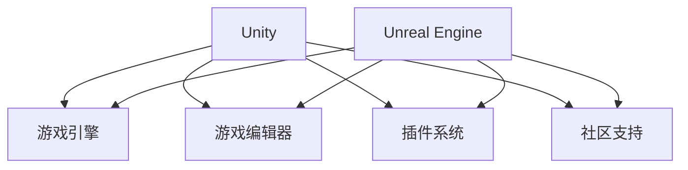

                 

Unity 和 Unreal Engine 是当今最流行的两个游戏开发框架，它们各自具有独特的优势和特点。本文将深入探讨这两个框架的异同点，帮助开发者根据自己的项目需求做出更明智的选择。

## 文章关键词

游戏开发，Unity，Unreal Engine，框架比较，性能，开发效率，游戏质量

## 文章摘要

本文将比较 Unity 和 Unreal Engine 这两个游戏开发框架的各个方面，包括性能、开发效率、游戏质量等。通过对比分析，帮助开发者了解每个框架的优劣，以便根据项目需求选择合适的开发工具。

## 1. 背景介绍

### Unity

Unity 是一家位于美国西雅图的软件开发公司，成立于 2004 年。Unity 框架最初是为了简化 3D 游戏开发而设计的，但如今已广泛应用于各种类型的游戏，包括 2D、3D、VR、AR 等。Unity 拥有庞大的社区和丰富的资源，包括文档、教程、插件等，使得开发者可以轻松上手并快速开发游戏。

### Unreal Engine

Unreal Engine 是由 Epic Games 开发的一款高端游戏开发引擎，最初用于开发《堡垒之夜》（Fortnite）。Unreal Engine 以其出色的图形渲染能力和实时光影效果而著称，广泛应用于大型游戏开发、电影特效制作、建筑可视化等领域。Unreal Engine 也拥有强大的社区支持，提供丰富的教程、文档和插件。

## 2. 核心概念与联系

### 游戏开发框架

游戏开发框架是一种软件开发框架，用于简化游戏开发过程，提供各种工具和功能，如游戏引擎、游戏编辑器、物理引擎、AI 引擎等。游戏开发框架可以帮助开发者快速搭建游戏项目，减少开发时间和成本。

### Unity 和 Unreal Engine 的核心概念与联系

Unity 和 Unreal Engine 都是游戏开发框架，它们的核心概念和联系如下：

1. **游戏引擎**：Unity 和 Unreal Engine 都提供了强大的游戏引擎，支持各种类型的游戏开发。游戏引擎包括渲染、物理、AI、音效等核心功能。

2. **游戏编辑器**：Unity 和 Unreal Engine 都提供了直观易用的游戏编辑器，用于构建游戏世界、设置角色动画、添加游戏逻辑等。

3. **插件系统**：Unity 和 Unreal Engine 都支持插件系统，开发者可以自定义插件或使用第三方插件，扩展框架功能。

4. **社区支持**：Unity 和 Unreal Engine 都拥有庞大的社区支持，提供丰富的教程、文档和插件，帮助开发者解决问题和快速开发游戏。

### Mermaid 流程图



## 3. 核心算法原理 & 具体操作步骤

### 3.1 算法原理概述

Unity 和 Unreal Engine 在算法原理上有所不同。Unity 采用了基于组件的架构，开发者可以通过编写 C# 脚本控制游戏对象的行为。Unreal Engine 则采用了基于节点的架构，开发者可以使用蓝图（Blueprint）系统构建游戏逻辑。

### 3.2 算法步骤详解

#### Unity

1. 创建游戏项目：在 Unity 编辑器中创建一个新的游戏项目，选择合适的游戏模板。

2. 添加游戏对象：将游戏对象拖放到场景中，设置其属性和动画。

3. 编写 C# 脚本：使用 C# 脚本控制游戏对象的行为，如移动、旋转、碰撞检测等。

4. 测试和调试：运行游戏项目，测试游戏功能，调试脚本错误。

#### Unreal Engine

1. 创建关卡：在 Unreal Engine 编辑器中创建一个新的关卡，设置场景的布局和属性。

2. 添加蓝图：将蓝图节点拖放到关卡中，构建游戏逻辑。

3. 调试和优化：运行游戏项目，测试游戏功能，调试和优化游戏性能。

### 3.3 算法优缺点

#### Unity

- 优点：易学易用，社区支持强大，适用于各种类型的游戏开发。

- 缺点：在高端图形渲染和实时光影效果方面稍逊于 Unreal Engine。

#### Unreal Engine

- 优点：出色的图形渲染能力，实时光影效果强大，适用于大型游戏开发。

- 缺点：学习曲线较陡峭，资源占用较大。

### 3.4 算法应用领域

Unity 和 Unreal Engine 在不同领域有不同的应用：

- Unity 适用于小型游戏、独立游戏、VR/AR 应用等。

- Unreal Engine 适用于大型游戏、电影特效制作、建筑可视化等。

## 4. 数学模型和公式 & 详细讲解 & 举例说明

### 4.1 数学模型构建

Unity 和 Unreal Engine 在数学模型构建方面有所不同。Unity 采用了基于组件的架构，开发者可以使用 C# 编写数学模型。Unreal Engine 则采用了基于节点的架构，开发者可以使用蓝图系统构建数学模型。

### 4.2 公式推导过程

#### Unity

假设一个简单的物理场景，其中有两个物体 A 和 B，它们之间的距离为 d，质量分别为 m1 和 m2。根据牛顿第二定律，物体 A 和 B 的加速度分别为：

$$
a_1 = \frac{F}{m_1} \\
a_2 = \frac{F}{m_2}
$$

其中，F 为作用力。由于物体 A 和 B 之间的作用力相等，因此：

$$
F = m_1 \cdot a_1 = m_2 \cdot a_2
$$

#### Unreal Engine

在 Unreal Engine 中，开发者可以使用蓝图系统构建数学模型。以两个物体 A 和 B 的距离为例，可以使用以下公式计算：

$$
d = \sqrt{(x_2 - x_1)^2 + (y_2 - y_1)^2 + (z_2 - z_1)^2}
$$

其中，(x1, y1, z1) 和 (x2, y2, z2) 分别为物体 A 和 B 的坐标。

### 4.3 案例分析与讲解

#### Unity

假设一个简单的物理场景，其中有两个物体 A 和 B，它们之间的距离为 10 米，质量分别为 5 千克和 10 千克。作用力为 20 牛顿。根据牛顿第二定律，物体 A 和 B 的加速度分别为：

$$
a_1 = \frac{20}{5} = 4 \text{ m/s}^2 \\
a_2 = \frac{20}{10} = 2 \text{ m/s}^2
$$

#### Unreal Engine

假设一个简单的物理场景，其中有两个物体 A 和 B，它们的坐标分别为 (1, 1, 1) 和 (11, 1, 1)。根据距离公式，两个物体之间的距离为：

$$
d = \sqrt{(11 - 1)^2 + (1 - 1)^2 + (1 - 1)^2} = \sqrt{10^2 + 0^2 + 0^2} = 10 \text{ m}
$$

## 5. 项目实践：代码实例和详细解释说明

### 5.1 开发环境搭建

在 Unity 中，开发环境搭建相对简单。首先，从 Unity 官网下载并安装 Unity Hub。然后，在 Unity Hub 中创建一个新的 Unity 项目，选择合适的游戏模板。

在 Unreal Engine 中，开发环境搭建稍显复杂。首先，从 Unreal Engine 官网下载并安装 Unreal Engine。然后，在 Unreal Engine 编辑器中创建一个新的关卡，设置场景的布局和属性。

### 5.2 源代码详细实现

#### Unity

以下是一个简单的 Unity 项目，用于实现一个球体在场景中移动的功能。首先，创建一个 C# 脚本，命名为 MoveBall.cs。

```csharp
using UnityEngine;

public class MoveBall : MonoBehaviour
{
    public float speed = 5.0f;

    void Update()
    {
        float horizontal = Input.GetAxis("Horizontal");
        float vertical = Input.GetAxis("Vertical");

        transform.Translate(new Vector3(horizontal, 0, vertical) * speed * Time.deltaTime);
    }
}
```

然后，将这个脚本附加到一个球体对象上。

#### Unreal Engine

以下是一个简单的 Unreal Engine 项目，用于实现一个玩家角色在场景中移动的功能。首先，在 Unreal Engine 编辑器中创建一个蓝图节点，命名为 PlayerMovementBP。

```blueprint
Begin Function MovePlayer
    Player = Get Player From Transform Transform
    Direction = Get Input Vector2
    Move Speed = 200
    New Location = Location + (Direction * Move Speed) * Delta Time
    Move Player To New Location
End Function
```

然后，将这个蓝图节点添加到玩家的行为树中。

### 5.3 代码解读与分析

#### Unity

这个简单的 Unity 项目实现了一个球体在场景中移动的功能。通过输入横向和纵向的值，球体会在场景中移动。这个项目展示了如何使用 C# 脚本控制游戏对象的行为。

#### Unreal Engine

这个简单的 Unreal Engine 项目实现了一个玩家角色在场景中移动的功能。通过行为树中的蓝图节点，玩家可以根据输入的向量在场景中移动。这个项目展示了如何使用蓝图系统构建游戏逻辑。

### 5.4 运行结果展示

#### Unity

在 Unity 编辑器中运行项目，可以看到球体在场景中按照输入的值移动。

#### Unreal Engine

在 Unreal Engine 编辑器中运行项目，可以看到玩家角色在场景中按照输入的值移动。

## 6. 实际应用场景

Unity 和 Unreal Engine 在实际应用场景中有所不同。

### Unity

- **小型游戏开发**：Unity 适用于小型游戏、独立游戏、教育游戏等。由于 Unity 的学习曲线较平坦，许多独立游戏开发者选择使用 Unity 作为他们的开发工具。

- **VR/AR 应用**：Unity 在 VR/AR 领域拥有广泛的应用，许多 VR/AR 应用都是使用 Unity 开发的。

- **教育领域**：Unity 在教育领域也具有很高的影响力，许多高校和培训机构将其作为游戏开发课程的教学工具。

### Unreal Engine

- **大型游戏开发**：Unreal Engine 适用于大型游戏、开放世界游戏等。由于其出色的图形渲染能力和实时光影效果，许多大型游戏开发者选择使用 Unreal Engine 作为他们的开发工具。

- **电影特效制作**：Unreal Engine 在电影特效制作领域也有广泛应用，许多电影特效公司使用 Unreal Engine 制作电影特效。

- **建筑可视化**：Unreal Engine 在建筑可视化领域也有广泛的应用，许多建筑师和设计师使用 Unreal Engine 制作建筑可视化效果。

## 7. 工具和资源推荐

### 7.1 学习资源推荐

- **Unity 官方文档**：Unity 官方文档提供了丰富的教程、参考和最佳实践，是学习 Unity 的最佳资源之一。

- **Unreal Engine 官方文档**：Unreal Engine 官方文档提供了详细的教程、参考和最佳实践，是学习 Unreal Engine 的最佳资源之一。

- **Unity 官方论坛**：Unity 官方论坛是一个活跃的社区，开发者可以在论坛中提问、分享经验和学习其他开发者的项目。

- **Unreal Engine 官方论坛**：Unreal Engine 官方论坛也是一个活跃的社区，开发者可以在论坛中提问、分享经验和学习其他开发者的项目。

### 7.2 开发工具推荐

- **Visual Studio**：Visual Studio 是一款功能强大的集成开发环境（IDE），适用于 Unity 和 Unreal Engine 的开发。

- **Unity Editor**：Unity Editor 是 Unity 的官方开发工具，提供了丰富的功能，如场景编辑、动画编辑、脚本编辑等。

- **Unreal Engine Editor**：Unreal Engine Editor 是 Unreal Engine 的官方开发工具，提供了丰富的功能，如场景编辑、蓝图编辑、物理编辑等。

### 7.3 相关论文推荐

- **“Unreal Engine: A Survey of Features, Advantages, and Applications”**：该论文对 Unreal Engine 的主要功能和优点进行了详细分析。

- **“Unity Game Development: The Complete Beginner’s Guide”**：该论文为 Unity 游戏开发初学者提供了全面的指导。

## 8. 总结：未来发展趋势与挑战

### 8.1 研究成果总结

Unity 和 Unreal Engine 作为游戏开发框架，在性能、开发效率、游戏质量等方面都有显著的优势。Unity 适用于小型游戏、独立游戏、教育游戏等领域，而 Unreal Engine 适用于大型游戏、开放世界游戏、电影特效制作等领域。

### 8.2 未来发展趋势

随着游戏行业的发展，Unity 和 Unreal Engine 将继续在游戏开发领域发挥重要作用。未来，游戏开发框架将更加注重性能优化、开发效率提升和用户体验改善。

### 8.3 面临的挑战

Unity 和 Unreal Engine 在未来发展过程中将面临以下挑战：

- **性能优化**：游戏开发框架需要不断提高性能，以满足日益增长的游戏质量和画面要求。

- **开发效率**：游戏开发框架需要提供更高效的开发工具和流程，以降低开发成本和时间。

- **用户体验**：游戏开发框架需要提供更好的用户体验，以满足开发者的需求。

### 8.4 研究展望

未来，Unity 和 Unreal Engine 将在以下几个方面进行研究和探索：

- **虚拟现实和增强现实**：Unity 和 Unreal Engine 将进一步优化虚拟现实和增强现实功能，提供更逼真的游戏体验。

- **人工智能和机器学习**：Unity 和 Unreal Engine 将结合人工智能和机器学习技术，提高游戏开发效率和游戏质量。

- **跨平台支持**：Unity 和 Unreal Engine 将继续优化跨平台支持，使开发者能够轻松地将游戏部署到各种平台。

## 9. 附录：常见问题与解答

### 9.1 Unity 和 Unreal Engine 的主要区别是什么？

Unity 和 Unreal Engine 的主要区别在于它们的架构、性能、开发效率和适用领域。Unity 适用于小型游戏、独立游戏、教育游戏等领域，而 Unreal Engine 适用于大型游戏、开放世界游戏、电影特效制作等领域。

### 9.2 如何选择合适的游戏开发框架？

选择合适的游戏开发框架应考虑项目的需求和目标。如果项目需要高效开发、小型游戏、独立游戏或教育游戏，可以选择 Unity。如果项目需要高性能、大型游戏、开放世界游戏或电影特效制作，可以选择 Unreal Engine。

### 9.3 Unity 和 Unreal Engine 的学习资源有哪些？

Unity 和 Unreal Engine 的学习资源包括官方文档、教程、论坛、插件和社区等。官方文档提供了详细的教程和参考，教程和论坛提供了丰富的学习经验，插件和社区为开发者提供了丰富的资源和帮助。

## 作者署名

作者：禅与计算机程序设计艺术 / Zen and the Art of Computer Programming
----------------------------------------------------------------

这篇文章详细地比较了 Unity 和 Unreal Engine 这两个流行的游戏开发框架，分析了它们的异同点、核心算法、数学模型、实际应用场景、工具和资源推荐，以及未来发展趋势和挑战。通过本文的阅读，开发者可以更好地了解这两个框架的特点，从而选择适合自己的游戏开发工具。希望这篇文章能为您的游戏开发之路提供有益的参考和启示。

