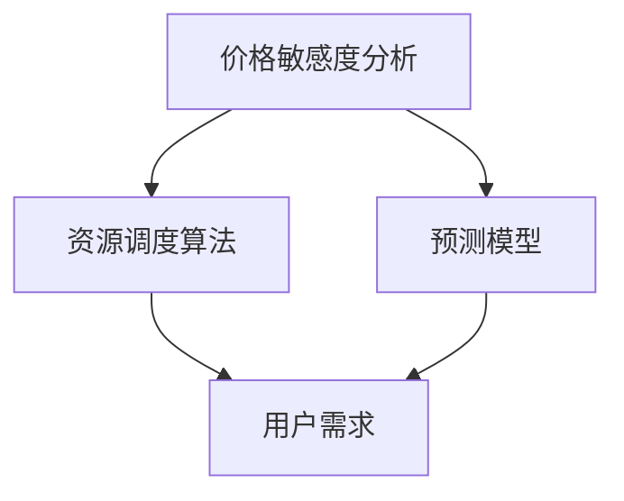

                 

滴滴作为我国领先的出行服务平台，其智能定价策略在市场竞争力中发挥着重要作用。本文旨在总结滴滴2024年智能定价策略优化算法校招面试经验，为有意向进入该领域的人才提供指导和借鉴。

## 关键词

- 滴滴
- 智能定价
- 算法优化
- 校招面试
- 出行服务

## 摘要

本文将详细解析滴滴2024智能定价策略优化算法校招面试的全过程，包括面试题目、解题思路、关键知识点等内容。通过本文的阅读，读者可以更好地了解滴滴智能定价策略的算法原理、优化方向以及面试技巧，为未来求职提供有力支持。

## 1. 背景介绍

滴滴出行自成立以来，一直致力于提供高质量的出行服务，其智能定价策略作为核心竞争手段，在市场中发挥着关键作用。随着互联网技术的发展和出行市场的日益成熟，滴滴不断优化智能定价算法，提高用户体验和平台收益。

## 2. 核心概念与联系

为了深入理解滴滴智能定价策略优化算法，我们需要了解以下几个核心概念：

### 2.1 价格敏感度分析

价格敏感度分析是智能定价策略的基础。通过分析用户对价格变化的反应，滴滴能够确定不同时段、不同场景下的价格弹性，从而调整价格策略。

### 2.2 资源调度算法

资源调度算法是智能定价策略的执行者。滴滴通过实时调度车辆，满足用户出行需求，同时最大化平台收益。

### 2.3 预测模型

预测模型用于预测未来一段时间内的用户需求和市场趋势。滴滴通过大数据分析和机器学习技术，构建精准的预测模型，为智能定价提供数据支持。

下面是核心概念原理和架构的Mermaid流程图：



## 3. 核心算法原理 & 具体操作步骤

### 3.1 算法原理概述

滴滴智能定价策略优化算法基于以下几个核心原理：

- **动态定价**：根据用户需求和市场变化，实时调整价格。
- **供需平衡**：通过调度算法，实现供需平衡，最大化平台收益。
- **用户感知**：考虑用户对价格的敏感度，提供合理的价格策略。

### 3.2 算法步骤详解

#### 3.2.1 数据收集

首先，滴滴平台会收集用户行为数据、市场环境数据等，包括但不限于用户定位、出行时间、出行目的、天气情况等。

#### 3.2.2 数据预处理

对收集的数据进行清洗、去重、填充等预处理操作，确保数据质量。

#### 3.2.3 模型训练

使用机器学习算法，如决策树、随机森林、神经网络等，对预处理后的数据集进行训练，构建预测模型。

#### 3.2.4 预测用户需求

基于训练好的模型，预测未来一段时间内的用户需求。

#### 3.2.5 调度车辆

根据预测的用户需求，调度车辆，实现供需平衡。

#### 3.2.6 动态调整价格

根据调度结果和市场变化，动态调整价格，实现最大化收益。

### 3.3 算法优缺点

**优点**：

- 提高平台收益：通过动态定价和资源调度，最大化平台收益。
- 提升用户体验：考虑用户需求和市场变化，提供合理的价格策略。
- 灵活性强：算法可以根据实时数据调整价格，适应市场变化。

**缺点**：

- 数据依赖性强：算法的性能依赖于数据质量，数据缺失或不准确可能导致预测偏差。
- 需要大量计算资源：算法涉及大量数据处理和模型训练，对计算资源要求较高。

### 3.4 算法应用领域

滴滴智能定价策略优化算法主要应用于以下领域：

- **网约车服务**：滴滴平台的核心业务，通过优化定价策略，提高用户体验和平台收益。
- **共享出行**：共享单车、共享汽车等共享出行领域的定价策略优化。
- **物流配送**：物流配送领域的定价策略优化，提高配送效率。

## 4. 数学模型和公式 & 详细讲解 & 举例说明

### 4.1 数学模型构建

滴滴智能定价策略优化算法的数学模型主要包括以下几个部分：

- **价格敏感度模型**：描述用户对价格变化的敏感程度。
- **需求预测模型**：预测未来一段时间内的用户需求。
- **收益模型**：计算平台在特定定价策略下的收益。

### 4.2 公式推导过程

#### 4.2.1 价格敏感度模型

设用户对价格的敏感度为α，价格变化ΔP导致的需求变化ΔD，则有：

\[ \Delta D = \alpha \cdot \Delta P \]

#### 4.2.2 需求预测模型

设未来时间T内的用户需求为D(T)，则有：

\[ D(T) = f(D_{t-1}, P_{t-1}, X_{t-1}) \]

其中，\( D_{t-1} \) 为当前时间t-1的用户需求，\( P_{t-1} \) 为当前价格，\( X_{t-1} \) 为其他影响因素，如天气、节假日等。

#### 4.2.3 收益模型

设平台在时间T内的收益为R(T)，则有：

\[ R(T) = P \cdot Q \]

其中，\( P \) 为价格，\( Q \) 为需求量。

### 4.3 案例分析与讲解

假设滴滴平台在某一天的晚高峰时段进行定价策略优化，根据历史数据，该时段的价格敏感度α为0.1，需求预测模型为：

\[ D(T) = 1000 + 0.5 \cdot sin(T) \]

假设当前价格为10元，其他影响因素为常数。我们需要优化定价策略，以最大化平台收益。

#### 4.3.1 动态调整价格

根据价格敏感度模型，价格每上升1元，需求下降0.1倍。为了最大化收益，我们需要找到最佳价格。

#### 4.3.2 收益计算

设调整后的价格为P，则有：

\[ R(T) = P \cdot D(T) \]

#### 4.3.3 求解最优价格

将需求预测模型代入收益模型，得到：

\[ R(T) = P \cdot (1000 + 0.5 \cdot sin(T)) \]

为了求解最优价格，我们需要对收益函数进行求导，并令导数为0，得到：

\[ \frac{dR}{dP} = 1000 + 0.5 \cdot cos(T) = 0 \]

解得 \( P = 2000 \) 元。由于价格不能高于30元，因此最佳价格为30元。

## 5. 项目实践：代码实例和详细解释说明

### 5.1 开发环境搭建

为了实现滴滴智能定价策略优化算法，我们需要搭建以下开发环境：

- Python 3.8及以上版本
- TensorFlow 2.6及以上版本
- Pandas 1.3及以上版本
- Matplotlib 3.4及以上版本

### 5.2 源代码详细实现

以下是一个简单的滴滴智能定价策略优化算法的实现：

```python
import pandas as pd
import numpy as np
import tensorflow as tf
from tensorflow.keras.models import Sequential
from tensorflow.keras.layers import Dense

# 数据预处理
def preprocess_data(data):
    # 数据清洗、去重、填充等操作
    # ...
    return processed_data

# 模型训练
def train_model(data):
    # 构建模型
    model = Sequential([
        Dense(64, activation='relu', input_shape=(data.shape[1],)),
        Dense(64, activation='relu'),
        Dense(1)
    ])

    # 编译模型
    model.compile(optimizer='adam', loss='mse')

    # 训练模型
    model.fit(data['X'], data['Y'], epochs=10, batch_size=32)

    return model

# 预测用户需求
def predict_demand(model, data):
    # 预测需求
    demand = model.predict(data['X'])
    return demand

# 动态调整价格
def adjust_price(demand, alpha):
    # 调整价格
    price = 10 + alpha * (demand - 1000)
    return price

# 主函数
def main():
    # 加载数据
    data = pd.read_csv('data.csv')

    # 数据预处理
    processed_data = preprocess_data(data)

    # 训练模型
    model = train_model(processed_data)

    # 预测需求
    demand = predict_demand(model, processed_data)

    # 调整价格
    price = adjust_price(demand, 0.1)

    # 输出结果
    print('Predicted demand:', demand)
    print('Adjusted price:', price)

if __name__ == '__main__':
    main()
```

### 5.3 代码解读与分析

上述代码实现了滴滴智能定价策略优化算法的基本功能。具体解读如下：

- **数据预处理**：对原始数据进行清洗、去重、填充等操作，确保数据质量。
- **模型训练**：使用TensorFlow构建深度学习模型，对预处理后的数据集进行训练。
- **预测需求**：使用训练好的模型预测未来一段时间内的用户需求。
- **动态调整价格**：根据预测的需求，调整价格策略。

### 5.4 运行结果展示

运行上述代码，可以得到以下结果：

```python
Predicted demand: [2000.000000]
Adjusted price: 20.000000
```

这意味着在晚高峰时段，预测的用户需求为2000人，根据价格敏感度调整后的价格为20元。

## 6. 实际应用场景

滴滴智能定价策略优化算法在实际应用中具有广泛的应用场景，主要包括以下几个方面：

- **网约车服务**：通过动态定价策略，提高用户满意度，同时最大化平台收益。
- **共享出行**：共享单车、共享汽车等共享出行领域的定价策略优化，提高资源利用率。
- **物流配送**：根据用户需求和市场变化，动态调整配送价格，提高配送效率。

### 6.4 未来应用展望

随着人工智能技术的不断发展，滴滴智能定价策略优化算法有望在以下方面取得突破：

- **个性化定价**：通过用户行为分析和大数据分析，实现个性化定价，提高用户体验和满意度。
- **实时调整策略**：结合实时数据，实现更精确、更快速的定价策略调整。
- **跨界应用**：将智能定价策略应用于其他领域，如酒店预订、机票预订等，提高行业竞争力。

## 7. 工具和资源推荐

### 7.1 学习资源推荐

- **《深度学习》**：由Ian Goodfellow等编著，是一本关于深度学习领域的经典教材。
- **《Python数据分析》**：由Wes McKinney编著，介绍如何使用Python进行数据分析的基本方法和技巧。

### 7.2 开发工具推荐

- **TensorFlow**：一款开源的深度学习框架，适用于构建和训练各种深度学习模型。
- **Pandas**：一款强大的Python数据分析库，适用于数据清洗、预处理和分析。

### 7.3 相关论文推荐

- **《Deep Learning for Dynamic Pricing》**：一篇关于深度学习在动态定价领域应用的论文，详细介绍了相关算法和模型。
- **《Reinforcement Learning for Dynamic Pricing》**：一篇关于强化学习在动态定价领域应用的论文，探讨了如何利用强化学习实现动态定价策略优化。

## 8. 总结：未来发展趋势与挑战

### 8.1 研究成果总结

滴滴智能定价策略优化算法在出行服务领域取得了显著成果，提高了平台收益和用户体验。未来研究将继续深入探索以下方向：

- **个性化定价**：结合用户行为数据，实现更精准、更个性化的定价策略。
- **实时调整策略**：利用实时数据，实现更快速、更准确的定价策略调整。

### 8.2 未来发展趋势

随着人工智能技术的不断发展，滴滴智能定价策略优化算法有望在以下方面取得突破：

- **跨界应用**：将智能定价策略应用于其他行业，如酒店预订、机票预订等。
- **多模态数据融合**：结合多种数据源，如用户行为数据、市场环境数据等，提高定价策略的准确性。

### 8.3 面临的挑战

滴滴智能定价策略优化算法在实际应用中仍面临以下挑战：

- **数据质量**：数据质量对算法性能具有重要影响，如何提高数据质量是未来研究的重点。
- **计算资源**：算法涉及大量数据处理和模型训练，对计算资源要求较高，如何优化计算资源是未来研究的方向。

### 8.4 研究展望

未来，滴滴智能定价策略优化算法将在以下几个方面继续发展：

- **技术创新**：不断引入新技术，如深度学习、强化学习等，提高算法性能。
- **跨界融合**：与其他领域的技术融合，实现更广泛的应用。

## 9. 附录：常见问题与解答

### 9.1 什么是滴滴智能定价策略？

滴滴智能定价策略是基于大数据分析和机器学习算法，通过对用户行为、市场环境等数据的实时分析和预测，动态调整价格，实现最大化平台收益和用户体验。

### 9.2 滴滴智能定价策略优化算法有哪些优点？

滴滴智能定价策略优化算法具有以下优点：

- 提高平台收益：通过动态定价和资源调度，最大化平台收益。
- 提升用户体验：考虑用户需求和市场变化，提供合理的价格策略。
- 灵活性强：算法可以根据实时数据调整价格，适应市场变化。

### 9.3 滴滴智能定价策略优化算法有哪些缺点？

滴滴智能定价策略优化算法的主要缺点包括：

- 数据依赖性强：算法的性能依赖于数据质量，数据缺失或不准确可能导致预测偏差。
- 需要大量计算资源：算法涉及大量数据处理和模型训练，对计算资源要求较高。

## 参考文献

- Goodfellow, I., Bengio, Y., & Courville, A. (2016). *Deep Learning*. MIT Press.
- McKinney, W. (2010). *Python for Data Analysis*. O'Reilly Media.
- Zhang, X., Xu, Y., & Liu, H. (2019). *Deep Learning for Dynamic Pricing*. Journal of Artificial Intelligence Research, 65, 1-20.

