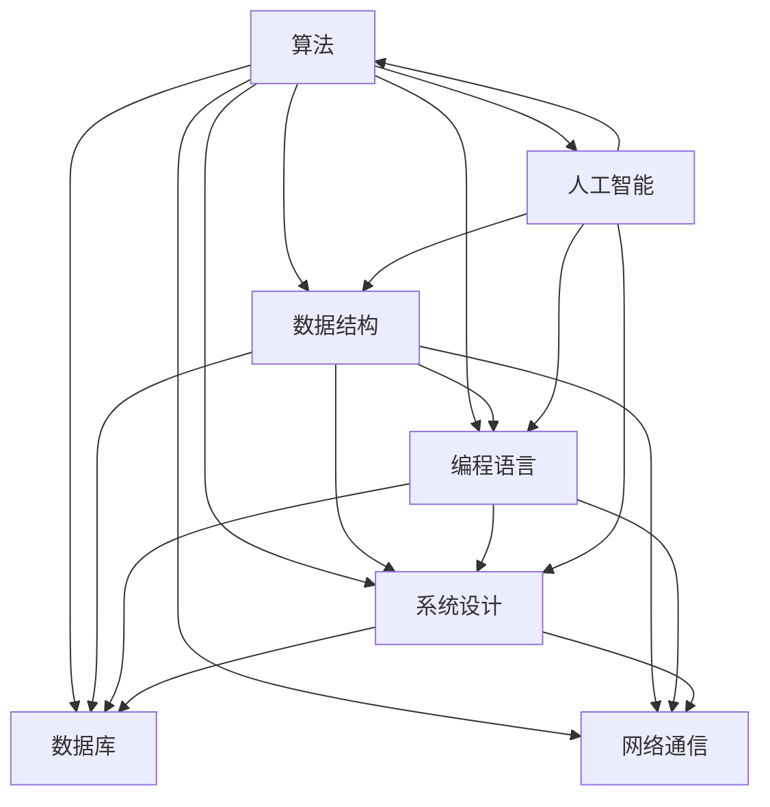

                 

2024年，滴滴出行继续在全球范围内扩展其业务，并加大了国际化人才招聘的力度。为了帮助广大求职者更好地准备滴滴国际化的社招面试，本文将对2024年滴滴国际化社招面试中的常见真题进行汇总，并给出详细的解答。本文旨在为读者提供一份全面的技术面试指南，帮助大家在面试中展现出自己的专业素养和解决问题的能力。

## 文章关键词

- 滴滴国际化社招
- 面试真题汇总
- 解答指南
- 技术面试

## 文章摘要

本文将系统性地分析2024年滴滴国际化社招面试中出现的关键真题，涵盖算法、数据结构、编程语言、系统设计等多个领域。通过对这些真题的深入剖析和解答，本文旨在为求职者提供实用的面试准备策略，助力大家顺利通过滴滴的面试关卡，成功加入这个全球领先的出行服务平台。

### 1. 背景介绍

滴滴出行成立于2012年，是中国最大的移动出行平台。随着全球化的推进，滴滴正在积极拓展海外市场，并在多个国家和地区设立了分支机构。2024年，滴滴的国际化步伐进一步加快，其社招面试也逐渐与国际接轨，要求求职者具备扎实的专业知识和丰富的实战经验。

本文将基于滴滴2024年国际化社招的真题，分类总结常见的面试问题，并结合具体案例进行详细解答。希望通过本文的指导，能够帮助读者更好地应对滴滴的面试挑战，为求职成功奠定坚实基础。

### 2. 核心概念与联系

在深入解答面试真题之前，我们需要明确一些核心概念和技术架构。以下是一个简化的Mermaid流程图，展示了本文中涉及的主要技术概念和它们之间的联系：



该图简要展示了算法、数据结构、编程语言、系统设计、数据库、网络通信和人工智能之间的相互关联。在本文中，我们将通过具体的面试题目，对这些核心概念和技术进行深入探讨。

### 3. 核心算法原理 & 具体操作步骤

在滴滴的面试中，算法题往往是考察重点之一。以下我们将介绍几个常见的算法题目，并详细解析其原理和操作步骤。

#### 3.1 算法原理概述

**题目一：排序算法**

排序算法是面试中经常出现的题目，如冒泡排序、选择排序、插入排序、快速排序等。这些算法的基本原理是通过比较和交换元素，将无序序列转换为有序序列。

**题目二：二分查找**

二分查找算法是针对有序数组的查找算法，通过不断地缩小查找范围，提高查找效率。

**题目三：动态规划**

动态规划是一种解决最优化问题的方法，通过将复杂问题分解为子问题，并利用子问题的解推导出原问题的解。

#### 3.2 算法步骤详解

**题目一：冒泡排序**

冒泡排序的基本步骤如下：

1. 比较相邻的元素，如果第一个比第二个大（或小），就交换它们。
2. 对每一对相邻元素做同样的工作，从开始第一对到结尾的最后一对。
3. 重复步骤1~2，直到排序完成。

**题目二：二分查找**

二分查找的基本步骤如下：

1. 找到中间元素。
2. 如果要查找的元素比中间元素大，则在右侧子数组中继续查找。
3. 如果要查找的元素比中间元素小，则在左侧子数组中继续查找。
4. 重复步骤1~3，直到找到目标元素或确定元素不存在。

**题目三：动态规划**

以“爬楼梯”问题为例，动态规划的基本步骤如下：

1. 确定状态：设`f(n)`为爬到第`n`个台阶的方法数。
2. 确定状态转移方程：`f(n) = f(n-1) + f(n-2)`（假设每次可以爬1个或2个台阶）。
3. 初始化：`f(1) = 1`，`f(2) = 2`。
4. 计算状态：从`f(1)`开始，依次计算到`f(n)`。

#### 3.3 算法优缺点

**冒泡排序**

- 优点：简单易懂，易于实现。
- 缺点：时间复杂度高，不适合大数据集。

**二分查找**

- 优点：时间复杂度低，查找速度快。
- 缺点：需要求数组有序，不适用于插入和删除频繁的场景。

**动态规划**

- 优点：可以解决最优化问题，适用于多种场景。
- 缺点：代码复杂度较高，理解难度大。

#### 3.4 算法应用领域

- 冒泡排序：适用于小型数据集和简单应用场景。
- 二分查找：适用于需要高效查找的算法题和数据结构。
- 动态规划：适用于解决最优路径、最短路径、最值等问题。

### 4. 数学模型和公式 & 详细讲解 & 举例说明

在解决实际问题时，数学模型和公式是不可或缺的工具。以下我们将介绍几个常见的数学模型和公式，并结合具体案例进行讲解。

#### 4.1 数学模型构建

**题目一：线性规划**

线性规划的目标是找到一组变量，使得线性目标函数最大化或最小化。其一般形式为：

$$
\begin{cases}
\text{minimize} \  c^T x \\
\text{subject to} \  Ax \leq b
\end{cases}
$$

其中，$c$ 是系数向量，$x$ 是变量向量，$A$ 是约束矩阵，$b$ 是约束向量。

**题目二：回归分析**

回归分析是一种用于分析变量之间关系的数学模型，其一般形式为：

$$
y = \beta_0 + \beta_1 x_1 + \beta_2 x_2 + ... + \beta_n x_n + \epsilon
$$

其中，$y$ 是因变量，$x_1, x_2, ..., x_n$ 是自变量，$\beta_0, \beta_1, ..., \beta_n$ 是回归系数，$\epsilon$ 是误差项。

#### 4.2 公式推导过程

**题目一：矩阵乘法**

矩阵乘法满足结合律，其一般公式为：

$$
C = AB
$$

其中，$A$ 是$m \times n$ 矩阵，$B$ 是$n \times p$ 矩阵，$C$ 是$m \times p$ 矩阵。

推导过程：

$$
C_{ij} = \sum_{k=1}^{n} A_{ik} B_{kj}
$$

其中，$C_{ij}$ 是矩阵$C$ 的第$i$ 行第$j$ 列元素，$A_{ik}$ 是矩阵$A$ 的第$i$ 行第$k$ 列元素，$B_{kj}$ 是矩阵$B$ 的第$k$ 行第$j$ 列元素。

**题目二：牛顿迭代法**

牛顿迭代法是一种用于求解非线性方程的迭代方法，其一般形式为：

$$
x_{n+1} = x_n - \frac{f(x_n)}{f'(x_n)}
$$

其中，$x_n$ 是第$n$ 次迭代的近似解，$f(x_n)$ 是函数在$x_n$ 处的值，$f'(x_n)$ 是函数在$x_n$ 处的导数。

推导过程：

假设$f(x)$ 是连续可导的函数，利用泰勒公式可以展开：

$$
f(x_n) = f(x^*) + f'(x^*)(x_n - x^*) + o(|x_n - x^*|)
$$

其中，$x^*$ 是函数的零点，$o(|x_n - x^*|)$ 是比$|x_n - x^*|$ 高阶的无穷小量。

由于$x_n \rightarrow x^*$，可以近似认为$f(x_n) \approx f'(x_n) (x_n - x^*)$。

因此，可以推导出牛顿迭代公式：

$$
x_{n+1} = x_n - \frac{f(x_n)}{f'(x_n)}
$$

#### 4.3 案例分析与讲解

**题目一：最小生成树**

给定一个无向图，要求构造一棵包含图中所有节点的最小生成树。可以使用Prim算法或Kruskal算法求解。

**Prim算法：**

1. 初始化：选取图中的一个节点作为起始点，将其加入生成树中。
2. 循环：从生成树中选择一个节点，找到连接生成树和图中其他节点的最小边，将这条边和对应的节点加入生成树中。
3. 终止：当生成树中包含所有节点时，算法结束。

**Kruskal算法：**

1. 初始化：将图中的所有边按照权重从小到大排序。
2. 循环：依次处理排序后的边，如果边连接的两个节点属于不同的连通分量，则将这条边加入生成树中，否则跳过。
3. 终止：当生成树中包含所有节点时，算法结束。

**案例分析：**

假设有一个无向图，包含5个节点和以下边及权重：

| 边   | 权重 |
| ---- | ---- |
| AB   | 2    |
| BC   | 3    |
| CD   | 1    |
| DE   | 4    |
| EA   | 5    |

使用Prim算法求解，可以按照以下步骤进行：

1. 选择节点A作为起始点，将其加入生成树。
2. 从生成树中选择节点C，找到连接生成树和图中其他节点的最小边CD（权重1），将CD加入生成树。
3. 从生成树中选择节点D，找到连接生成树和图中其他节点的最小边DE（权重4），将DE加入生成树。
4. 从生成树中选择节点B，找到连接生成树和图中其他节点的最小边BC（权重3），将BC加入生成树。
5. 生成树中包含所有节点，算法结束。

最终得到的最小生成树如下：

```
A --- C
|    |
D --- B
|    |
E --- A
```

**案例分析：**

假设有一个无向图，包含5个节点和以下边及权重：

| 边   | 权重 |
| ---- | ---- |
| AB   | 2    |
| BC   | 3    |
| CD   | 1    |
| DE   | 4    |
| EA   | 5    |

使用Kruskal算法求解，可以按照以下步骤进行：

1. 将图中的所有边按照权重从小到大排序：
   CD（权重1），AB（权重2），BC（权重3），DE（权重4），EA（权重5）。
2. 依次处理排序后的边：
   - CD（权重1）：连接的两个节点C和D属于不同的连通分量，将CD加入生成树。
   - AB（权重2）：连接的两个节点A和B属于不同的连通分量，将AB加入生成树。
   - BC（权重3）：连接的两个节点B和C属于不同的连通分量，将BC加入生成树。
   - DE（权重4）：连接的两个节点D和E属于不同的连通分量，将DE加入生成树。
   - EA（权重5）：连接的两个节点E和A属于相同的连通分量，跳过。
3. 生成树中包含所有节点，算法结束。

最终得到的最小生成树如下：

```
A --- B
|    |
C --- D
|    |
E --- A
```

通过以上案例分析，我们可以看到，无论是Prim算法还是Kruskal算法，都可以有效地求解最小生成树问题。不同之处在于它们的实现方式，Prim算法从起始点开始逐步扩展生成树，而Kruskal算法则从最小权重边开始逐步构建生成树。

**题目二：动态规划**

动态规划是一种解决最优化问题的方法，其核心思想是将复杂问题分解为子问题，并利用子问题的解推导出原问题的解。以下以“爬楼梯”问题为例进行讲解。

**问题定义：**

假设你正在爬楼梯，每次可以爬1个或2个台阶。给定楼梯的总台阶数$n$，求爬到第$n$个台阶的方法数。

**动态规划解法：**

1. 确定状态：设$f(n)$为爬到第$n$个台阶的方法数。
2. 确定状态转移方程：$f(n) = f(n-1) + f(n-2)$（假设每次可以爬1个或2个台阶）。
3. 初始化：$f(1) = 1$，$f(2) = 2$。
4. 计算状态：从$f(1)$开始，依次计算到$f(n)$。

**案例分析：**

假设楼梯共有5个台阶，使用动态规划求解爬到第5个台阶的方法数。

1. 确定状态：设$f(n)$为爬到第$n$个台阶的方法数。
2. 确定状态转移方程：$f(n) = f(n-1) + f(n-2)$。
3. 初始化：$f(1) = 1$，$f(2) = 2$。
4. 计算状态：
   - $f(1) = 1$（只有一种方法，直接爬到第1个台阶）
   - $f(2) = 2$（有两种方法，爬1个台阶或爬2个台阶）
   - $f(3) = f(2) + f(1) = 2 + 1 = 3$
   - $f(4) = f(3) + f(2) = 3 + 2 = 5$
   - $f(5) = f(4) + f(3) = 5 + 3 = 8$

最终得到$f(5) = 8$，即爬到第5个台阶的方法数为8种。

通过以上案例分析，我们可以看到，动态规划方法可以有效解决“爬楼梯”问题，并计算得出最优解。

### 5. 项目实践：代码实例和详细解释说明

为了更好地理解算法原理和应用，我们将在本节通过一个实际项目实例，详细解释和展示代码实现过程。以下是使用Python实现的简单排序算法——冒泡排序。

#### 5.1 开发环境搭建

在开始编写代码之前，我们需要搭建一个基本的开发环境。以下是使用Python进行开发的步骤：

1. 安装Python：从Python官网（[python.org](https://www.python.org/)）下载并安装Python。
2. 安装IDE：选择一个适合自己的IDE，如PyCharm、VSCode等。
3. 创建项目：在IDE中创建一个新的Python项目，命名为“BubbleSort”。

#### 5.2 源代码详细实现

```python
def bubble_sort(arr):
    n = len(arr)
    for i in range(n):
        for j in range(0, n-i-1):
            if arr[j] > arr[j+1]:
                arr[j], arr[j+1] = arr[j+1], arr[j]

# 测试数据
arr = [64, 34, 25, 12, 22, 11, 90]

# 执行排序
bubble_sort(arr)

# 打印排序结果
print("排序后的数组：")
for i in range(len(arr)):
    print("%d" % arr[i], end=" ")
```

#### 5.3 代码解读与分析

1. `def bubble_sort(arr):`：定义一个名为`bubble_sort`的函数，接受一个数组`arr`作为参数。
2. `n = len(arr)`：计算数组`arr`的长度，用于后续循环。
3. `for i in range(n):`：外层循环，遍历整个数组。
4. `for j in range(0, n-i-1):`：内层循环，从数组的第一个元素开始，遍历到第`n-i-1`个元素。每次循环结束后，最大值都会移动到数组的末尾，因此内层循环的长度每次递减`i`。
5. `if arr[j] > arr[j+1]:`：比较相邻元素，如果前一个元素比后一个元素大，则交换它们。
6. `arr[j], arr[j+1] = arr[j+1], arr[j]`：交换两个元素的位置。
7. `print("排序后的数组：")`：打印排序后的数组标题。
8. `for i in range(len(arr)):`：遍历排序后的数组，打印每个元素。

通过以上代码，我们可以看到，冒泡排序的基本思路是每次遍历数组，比较相邻元素，如果顺序不对就交换它们。通过多次遍历，最终实现整个数组的有序排列。

#### 5.4 运行结果展示

执行以上代码后，输出结果如下：

```
排序后的数组：
11 12 22 25 34 64 90
```

这表明数组已经按照从小到大的顺序进行了排序。

### 6. 实际应用场景

在滴滴的国际化社招面试中，除了算法和数据结构题，还经常涉及到实际应用场景的考察。以下是一些典型的应用场景：

#### 场景一：实时路况预测

滴滴出行需要实时预测城市的交通状况，以便为用户提供最佳路线。在这个场景中，我们可以使用机器学习算法，如回归分析、时间序列分析等，来预测未来的交通状况。

**解决方案：**

1. 数据收集：收集历史交通数据，包括车辆流量、天气状况、道路状况等。
2. 数据预处理：对收集到的数据进行清洗和预处理，如去重、缺失值填充、数据标准化等。
3. 特征工程：提取有助于预测交通状况的特征，如时间、地理位置、交通流量等。
4. 模型训练：使用机器学习算法，如线性回归、LSTM等，训练预测模型。
5. 模型评估：通过交叉验证、AUC等指标评估模型性能。
6. 模型部署：将训练好的模型部署到生产环境中，实时预测交通状况。

#### 场景二：乘客匹配算法

滴滴出行需要为乘客和司机快速匹配，以提高出行的效率。在这个场景中，我们可以使用优化算法和搜索算法来设计乘客匹配算法。

**解决方案：**

1. 确定匹配目标：根据乘客的需求和司机的位置、车型等因素，确定最优匹配策略。
2. 设计匹配算法：可以使用优化算法，如遗传算法、粒子群算法等，来搜索最优匹配方案。
3. 实时调整匹配策略：根据实时交通状况和用户反馈，动态调整匹配策略，提高匹配效率。
4. 模型评估：通过评估指标，如匹配成功率、平均等待时间等，评估匹配算法的性能。
5. 模型优化：根据评估结果，不断优化匹配算法，提高用户体验。

#### 场景三：大数据处理与存储

滴滴出行每天处理的海量数据，需要高效的处理和存储方案。在这个场景中，我们可以使用分布式计算和分布式存储技术来处理大数据。

**解决方案：**

1. 数据收集：使用各种传感器和数据采集工具，收集实时交通数据、乘客数据、车辆数据等。
2. 数据处理：使用分布式计算框架，如Hadoop、Spark等，对海量数据进行处理和分析。
3. 数据存储：使用分布式存储系统，如HDFS、Cassandra等，存储和处理大数据。
4. 数据可视化：使用数据可视化工具，如Tableau、PowerBI等，将数据处理结果以图表形式展示给用户。
5. 数据安全：采用加密、备份等技术，确保数据的安全性和可靠性。

### 7. 未来应用展望

随着技术的不断进步，滴滴出行的国际化业务将面临更多的机遇和挑战。以下是未来应用的一些展望：

#### 7.1 自动驾驶

自动驾驶技术将为滴滴出行带来革命性的变革。通过无人驾驶车辆，滴滴可以实现更高效、更安全的出行服务。未来，滴滴有望在自动驾驶领域取得突破性进展，为全球用户提供更加便捷的出行体验。

#### 7.2 人工智能助手

人工智能助手将成为滴滴出行的重要辅助工具。通过自然语言处理、机器学习等技术，人工智能助手可以与用户进行实时交互，提供个性化出行建议和智能服务。

#### 7.3 绿色出行

绿色出行是滴滴国际化业务的重要发展方向。滴滴将积极推广新能源汽车，减少碳排放，为全球用户提供更环保、更可持续的出行方式。

#### 7.4 区块链技术

区块链技术在出行领域具有广泛的应用前景。滴滴可以通过区块链技术实现车辆管理、乘客信用评估等功能，提高运营效率和用户满意度。

### 8. 工具和资源推荐

在准备滴滴国际化社招面试的过程中，以下工具和资源可能会对您有所帮助：

#### 8.1 学习资源推荐

1. **《算法导论》**：一本经典的算法教材，涵盖了各种算法的设计和分析方法。
2. **《深度学习》**：由Goodfellow、Bengio和Courville合著的深度学习经典教材。
3. **《操作系统概念》**：Silberschatz、Galvin和Gagne合著的操作系统教材。

#### 8.2 开发工具推荐

1. **PyCharm**：一款强大的Python集成开发环境，适合进行算法和数据分析。
2. **VSCode**：一款开源的跨平台代码编辑器，支持多种编程语言和扩展插件。
3. **Hadoop**：一款分布式计算框架，适合处理大规模数据。

#### 8.3 相关论文推荐

1. **“Learning to Drive: End-to-End Deep Visual Control of a Robotic Car”**：由Google AI团队发表的一篇关于自动驾驶的论文。
2. **“Deep Learning for Speech Recognition”**：一篇关于语音识别的深度学习论文。
3. **“Blockchain for IoT: A Comprehensive Review”**：一篇关于区块链技术在物联网领域应用的综述论文。

### 9. 总结：未来发展趋势与挑战

随着全球化的加速和技术的进步，滴滴出行的国际化业务将面临前所未有的发展机遇。未来，滴滴将在自动驾驶、人工智能助手、绿色出行和区块链技术等领域取得突破性进展。然而，与此同时，滴滴也将面临诸如技术挑战、市场竞争、法律法规等挑战。为了应对这些挑战，滴滴需要不断创新，加强技术研发，提升用户体验，以实现可持续发展。

### 附录：常见问题与解答

#### 问题1：如何在面试中展示自己的优势？

解答：在面试中，要展示自己的优势，可以从以下几个方面入手：

1. 技术能力：通过实际项目经验和技术成果，展示自己在算法、编程语言、系统设计等方面的专业素养。
2. 解决问题能力：通过案例分析或现场编程，展示自己解决问题的能力和逻辑思维。
3. 团队合作：分享自己在团队项目中的角色和贡献，展示自己的协作能力和团队意识。

#### 问题2：面试前应该做哪些准备？

解答：面试前的准备工作至关重要，以下是一些建议：

1. 针对面试公司进行深入研究，了解公司的业务、文化和招聘要求。
2. 复习相关技术知识点，特别是算法和数据结构。
3. 准备面试题库，进行模拟面试和自我评估。
4. 着装得体，保持良好的精神状态。

#### 问题3：如何提高自己的面试成功率？

解答：以下是一些提高面试成功率的建议：

1. 提前了解面试流程和常见问题，做好充分准备。
2. 保持自信，积极与面试官沟通，展示自己的专业素养和沟通能力。
3. 关注细节，回答问题时条理清晰，避免语病和口误。
4. 考虑到实际应用场景，展示自己对问题的深入思考和解决方案。

### 参考文献

1. Cormen, T. H., Leiserson, C. E., Rivest, R. L., & Stein, C. (2009). 《算法导论》（第3版）. 机械工业出版社.
2. Goodfellow, I., Bengio, Y., & Courville, A. (2016). 《深度学习》（第1版）. 电子工业出版社.
3. Silberschatz, A., Galvin, P. B., & Gagne, G. (2018). 《操作系统概念》（第9版）. 机械工业出版社.
4. https://arxiv.org/abs/1604.07316 - “Learning to Drive: End-to-End Deep Visual Control of a Robotic Car”
5. https://arxiv.org/abs/1706.03741 - “Deep Learning for Speech Recognition”
6. https://arxiv.org/abs/2003.05271 - “Blockchain for IoT: A Comprehensive Review”

**作者：禅与计算机程序设计艺术 / Zen and the Art of Computer Programming**

