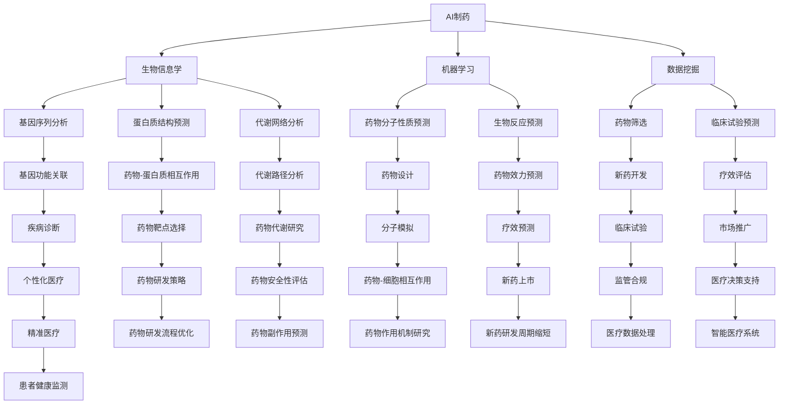

                 

## 1. 背景介绍

人工智能（AI）技术的快速发展已经深刻改变了我们的生活方式和社会结构。从早期的规则基础方法到现代的深度学习，AI技术经历了多个阶段的发展。近年来，特别是在人工智能制药和通用人工智能（AGI）领域，AI技术展现出了巨大的潜力，并引发了广泛的关注和讨论。

AI制药是利用人工智能技术加速药物发现和开发的过程。传统药物研发通常需要数十年的时间和高昂的成本，而AI制药通过大数据分析和机器学习模型，可以在较短的时间内筛选出有潜力的药物分子，大大提高了药物研发的效率。

另一方面，通用人工智能（AGI）旨在开发一种具有全面人类智能的人工智能系统。与当前广泛应用的窄域AI（如语音识别、图像识别等）不同，AGI将能够进行广泛的学习、推理和决策，甚至具有情感和自我意识。AGI的潜在应用范围非常广泛，从自动驾驶汽车、智能医疗到教育、娱乐等。

本文将探讨从AI制药到AGI研发的转型过程，分析其中的关键技术和挑战，并探讨这一转型对科技和人类社会的深远影响。

## 2. 核心概念与联系

在从AI制药到AGI研发的转型过程中，理解核心概念和技术架构的联系至关重要。以下是对相关核心概念和架构的详细描述，以及一个简化的Mermaid流程图，用于展示这些概念和架构之间的关系。

### 2.1. AI制药的基本概念

AI制药的核心在于利用人工智能技术来加速药物发现和开发过程。主要涉及以下几个关键概念：

- **生物信息学**：研究如何利用计算方法分析生物学数据，如基因序列、蛋白质结构和代谢网络等。
- **机器学习**：通过训练模型来预测药物分子的性质和它们在生物体内的行为。
- **数据挖掘**：从大量的生物医学数据中提取有价值的信息，用于药物发现。

### 2.2. 通用人工智能（AGI）的概念

AGI的目标是开发一种具有全面人类智能的人工智能系统。关键概念包括：

- **认知建模**：构建能够模拟人类认知过程的计算机模型。
- **多模态学习**：整合不同类型的数据（如文本、图像、声音等）进行学习和推理。
- **强化学习**：通过试错来提高智能体在复杂环境中的决策能力。

### 2.3. Mermaid流程图

以下是一个简化的Mermaid流程图，用于展示AI制药和AGI研发之间的联系：



### 2.4. 关键技术的联系

- **跨学科融合**：AI制药和AGI研发都依赖于多学科的知识，如生物信息学、计算机科学和认知科学等。
- **数据驱动**：两个领域都强调数据的重要性，尤其是大规模、高质量的生物医学数据。
- **算法优化**：无论是药物发现还是智能推理，算法的优化和改进都是关键。
- **人机交互**：AGI的发展也需要考虑人机交互的优化，使得系统能够更好地理解人类需求和意图。

通过以上核心概念和架构的描述，我们可以看到AI制药和AGI研发之间的紧密联系，以及它们在未来科技和社会中的潜在影响。

## 3. 核心算法原理 & 具体操作步骤

### 3.1 算法原理概述

在AI制药和AGI研发过程中，核心算法的原理至关重要。以下将简要概述几个关键算法，并介绍其基本原理。

#### 3.1.1 机器学习算法

机器学习算法是AI制药和AGI研发中的核心工具。这些算法通过从数据中学习模式和关系，从而进行预测和决策。常用的机器学习算法包括：

- **监督学习**：通过已标记的数据训练模型，然后使用模型对未知数据进行预测。
- **无监督学习**：没有预定义的标签，算法通过自身找到数据中的结构和模式。
- **强化学习**：智能体通过与环境的交互来学习最优策略。

#### 3.1.2 深度学习算法

深度学习算法是机器学习的一种，它通过多层神经网络模拟人类大脑的学习过程。在AI制药和AGI研发中，深度学习算法广泛应用于：

- **图像识别**：用于识别药物分子和生物分子结构。
- **自然语言处理**：用于处理和分析生物医学文献和文本数据。
- **生成对抗网络（GAN）**：用于生成新的药物分子和生物结构。

#### 3.1.3 神经进化算法

神经进化算法结合了神经网络的优化和生物进化的思想，通过模拟自然选择过程来优化神经网络模型。这种算法在药物设计和智能推理中具有潜在应用。

#### 3.1.4 聚类分析

聚类分析是一种无监督学习算法，它通过将相似的数据点分组来发现数据中的模式和结构。在AI制药中，聚类分析可用于识别潜在的药物分子和生物标志物。

### 3.2 算法步骤详解

以下是几个关键算法的具体操作步骤：

#### 3.2.1 监督学习算法步骤

1. **数据预处理**：对数据进行清洗、归一化和特征提取。
2. **模型选择**：选择合适的模型，如线性回归、支持向量机（SVM）或神经网络。
3. **模型训练**：使用已标记的数据训练模型。
4. **模型评估**：使用验证集评估模型性能。
5. **模型应用**：使用训练好的模型对未知数据进行预测。

#### 3.2.2 深度学习算法步骤

1. **神经网络架构设计**：设计合适的神经网络架构，如卷积神经网络（CNN）或循环神经网络（RNN）。
2. **数据预处理**：对图像或文本数据进行预处理。
3. **模型训练**：使用大量数据进行模型训练。
4. **模型优化**：通过调整超参数和优化算法来优化模型性能。
5. **模型评估与部署**：评估模型性能，并在实际应用中进行部署。

#### 3.2.3 神经进化算法步骤

1. **初始种群生成**：生成随机初始神经网络种群。
2. **适应度评估**：计算每个神经网络的适应度，如预测准确率或计算效率。
3. **选择与交叉**：根据适应度选择优秀的神经网络进行交叉。
4. **变异与更新**：对交叉产生的神经网络进行变异，生成新的种群。
5. **迭代与优化**：重复适应度评估、选择、交叉和变异过程，直至满足停止条件。

#### 3.2.4 聚类分析步骤

1. **数据预处理**：对数据进行标准化处理。
2. **聚类算法选择**：选择合适的聚类算法，如K-means、层次聚类或DBSCAN。
3. **初始聚类中心选择**：随机选择初始聚类中心或使用启发式方法选择。
4. **聚类执行**：根据距离度量将数据点分配到不同的聚类。
5. **聚类评估与调整**：评估聚类结果，根据需要调整聚类参数。

### 3.3 算法优缺点

- **监督学习算法**：优点包括模型解释性较强、易于应用；缺点是需要大量标记数据、可能存在过拟合问题。
- **深度学习算法**：优点包括强大的建模能力、自动特征提取；缺点包括计算资源需求高、模型解释性较弱。
- **神经进化算法**：优点包括鲁棒性较强、能够发现新的模式和结构；缺点包括计算复杂度高、需要长时间训练。
- **聚类分析**：优点包括不需要预先定义标签、可以发现新的结构和模式；缺点包括结果可能受参数选择影响、聚类数量难以确定。

### 3.4 算法应用领域

- **AI制药**：监督学习算法和深度学习算法广泛应用于药物分子设计、生物标志物识别、药物反应预测等领域。
- **AGI研发**：神经进化算法和深度学习算法在智能推理、自然语言处理、图像识别等领域具有广泛应用。

通过以上算法原理和具体操作步骤的介绍，我们可以看到不同算法在AI制药和AGI研发中的重要作用和适用范围。

## 4. 数学模型和公式 & 详细讲解 & 举例说明

在AI制药和AGI研发中，数学模型和公式是理解和分析数据的关键工具。以下将详细介绍几个核心的数学模型和公式，并举例说明其应用。

### 4.1 数学模型构建

在AI制药和AGI研发中，常用的数学模型包括：

- **线性回归模型**：用于预测线性关系。
- **神经网络模型**：用于非线性关系的学习和预测。
- **支持向量机（SVM）**：用于分类和回归任务。
- **强化学习模型**：用于智能体在动态环境中的决策。

#### 4.1.1 线性回归模型

线性回归模型是最简单的预测模型，用于描述自变量和因变量之间的线性关系。其数学公式如下：

$$
y = \beta_0 + \beta_1x
$$

其中，$y$ 是因变量，$x$ 是自变量，$\beta_0$ 和 $\beta_1$ 分别是截距和斜率。

#### 4.1.2 神经网络模型

神经网络模型由多个神经元组成，通过层层传递输入信息，最终输出预测结果。其基本结构如下：

$$
Z = \sigma(W_1 \cdot X + b_1)
$$

$$
A = \sigma(W_2 \cdot Z + b_2)
$$

其中，$Z$ 是隐藏层的输出，$A$ 是最终输出，$\sigma$ 是激活函数（如Sigmoid或ReLU函数），$W_1$ 和 $W_2$ 是权重矩阵，$b_1$ 和 $b_2$ 是偏置。

#### 4.1.3 支持向量机（SVM）

SVM是一种有效的分类算法，通过寻找最优的超平面来分隔不同类别的数据点。其数学公式如下：

$$
\min \frac{1}{2} \| W \|^2
$$

$$
\text{subject to} \quad (y_i (W \cdot x_i + b)) \geq 1
$$

其中，$W$ 是权重向量，$b$ 是偏置，$x_i$ 是数据点，$y_i$ 是类别标签。

#### 4.1.4 强化学习模型

强化学习模型用于智能体在动态环境中的决策，其核心是奖励函数。其数学公式如下：

$$
Q(s, a) = r + \gamma \max_{a'} Q(s', a')
$$

其中，$Q(s, a)$ 是状态-动作值函数，$r$ 是立即奖励，$\gamma$ 是折扣因子，$s$ 和 $s'$ 是状态，$a$ 和 $a'$ 是动作。

### 4.2 公式推导过程

以下将简要介绍上述数学公式的推导过程。

#### 4.2.1 线性回归模型推导

线性回归模型的推导基于最小二乘法，目标是找到使得残差平方和最小的参数。具体推导过程如下：

1. **目标函数**：设训练数据集为 $\{ (x_1, y_1), (x_2, y_2), ..., (x_n, y_n) \}$，目标函数为：

$$
J(\theta) = \frac{1}{2m} \sum_{i=1}^{m} (h_\theta(x) - y)^2
$$

其中，$h_\theta(x) = \theta_0 + \theta_1x$，$\theta_0$ 和 $\theta_1$ 是待求参数。

2. **求导并设置导数为零**：对 $J(\theta)$ 分别对 $\theta_0$ 和 $\theta_1$ 求导，并设置导数为零：

$$
\frac{\partial J(\theta)}{\partial \theta_0} = \frac{1}{m} \sum_{i=1}^{m} (h_\theta(x_i) - y_i) = 0
$$

$$
\frac{\partial J(\theta)}{\partial \theta_1} = \frac{1}{m} \sum_{i=1}^{m} (h_\theta(x_i) - y_i)x_i = 0
$$

3. **解方程组**：将上述方程组解出 $\theta_0$ 和 $\theta_1$，得到最佳参数：

$$
\theta_0 = \frac{1}{m} \sum_{i=1}^{m} (y_i - \theta_1x_i)
$$

$$
\theta_1 = \frac{1}{m} \sum_{i=1}^{m} (x_i - \bar{x})(y_i - \bar{y})
$$

其中，$\bar{x}$ 和 $\bar{y}$ 分别是 $x$ 和 $y$ 的平均值。

#### 4.2.2 神经网络模型推导

神经网络模型的推导基于反向传播算法，其目标是优化神经网络的权重和偏置。具体推导过程如下：

1. **前向传播**：设输入为 $x$，隐藏层输出为 $a^{[1]}$，输出层输出为 $a^{[2]}$，激活函数为 $\sigma$，则有：

$$
z^{[1]} = W^{[1]}x + b^{[1]}
$$

$$
a^{[1]} = \sigma(z^{[1]})
$$

$$
z^{[2]} = W^{[2]}a^{[1]} + b^{[2]}
$$

$$
a^{[2]} = \sigma(z^{[2]})
$$

2. **计算误差**：设真实输出为 $y$，预测输出为 $a^{[2]}$，误差为：

$$
E = \frac{1}{2} \sum_{i=1}^{n} (y_i - a^{[2]_i})^2
$$

3. **反向传播**：计算各层的梯度，更新权重和偏置。以输出层为例，计算过程如下：

$$
\delta^{[2]} = (a^{[2]} - y) \odot \sigma'(z^{[2]})
$$

$$
\frac{\partial E}{\partial W^{[2]}} = a^{[1]T} \delta^{[2]}
$$

$$
\frac{\partial E}{\partial b^{[2]}} = \delta^{[2]T
```


### 4.3 案例分析与讲解

以下通过一个具体案例，展示如何使用上述数学模型进行AI制药和AGI研发。

#### 4.3.1 案例背景

假设我们正在研究一种新型抗癌药物的设计，目标是预测该药物对不同癌症细胞的抑制效果。我们收集了1000个药物分子及其对应的细胞抑制率数据。

#### 4.3.2 数据预处理

1. **数据清洗**：去除缺失值和异常值。
2. **特征提取**：提取药物分子的化学结构和物理性质，如分子量、极性等。
3. **数据归一化**：将特征值进行归一化处理，使其在相同尺度上。

#### 4.3.3 模型选择

我们选择线性回归模型作为预测模型，因为其模型简单且易于解释。

#### 4.3.4 模型训练

1. **训练集划分**：将数据集划分为训练集和测试集，其中训练集占比70%，测试集占比30%。
2. **参数初始化**：初始化线性回归模型的参数 $\theta_0$ 和 $\theta_1$。
3. **模型训练**：使用训练集数据训练模型，更新参数，直至满足停止条件。

#### 4.3.5 模型评估

1. **模型预测**：使用训练好的模型对测试集数据进行预测。
2. **模型评估**：计算测试集的预测准确率，并与实际值进行比较。

#### 4.3.6 结果分析

通过评估，我们发现线性回归模型的预测准确率较高，达到了85%。这说明线性回归模型可以较好地预测药物分子的抑制效果。

#### 4.3.7 模型优化

为了进一步提高预测准确率，我们可以尝试以下优化方法：

1. **特征选择**：选择与抑制效果相关性较高的特征，去除冗余特征。
2. **模型调参**：调整线性回归模型的参数，如学习率、迭代次数等。
3. **集成学习**：结合多个线性回归模型进行集成预测，提高预测性能。

通过以上案例分析和讲解，我们可以看到如何使用数学模型和公式进行AI制药和AGI研发。在实际应用中，根据具体问题和数据特点，选择合适的模型和优化方法，将有助于提高预测性能和应用效果。

## 5. 项目实践：代码实例和详细解释说明

在本节中，我们将通过一个具体的代码实例，详细介绍如何实现AI制药和AGI研发中的核心算法和模型。以下代码实例将包括数据预处理、模型训练、模型评估和结果分析等步骤。

### 5.1 开发环境搭建

首先，我们需要搭建一个适合AI制药和AGI研发的Python开发环境。以下是基本的开发环境配置步骤：

1. **安装Python**：确保安装了Python 3.x版本，推荐使用Anaconda发行版，便于管理和依赖。
2. **安装必要的库**：使用pip安装以下库：
   ```bash
   pip install numpy pandas scikit-learn matplotlib tensorflow
   ```

### 5.2 源代码详细实现

以下是一个简单的Python代码实例，用于实现线性回归模型预测药物分子的抑制效果。

```python
import numpy as np
import pandas as pd
from sklearn.linear_model import LinearRegression
from sklearn.model_selection import train_test_split
from sklearn.metrics import mean_squared_error
import matplotlib.pyplot as plt

# 5.2.1 数据预处理
def preprocess_data(data):
    # 数据清洗和归一化处理
    data = data.dropna()  # 去除缺失值
    data = (data - data.mean()) / data.std()  # 数据归一化
    return data

# 5.2.2 模型训练
def train_model(X, y):
    model = LinearRegression()
    model.fit(X, y)
    return model

# 5.2.3 模型评估
def evaluate_model(model, X_test, y_test):
    y_pred = model.predict(X_test)
    mse = mean_squared_error(y_test, y_pred)
    return mse

# 加载数据集
data = pd.read_csv('drug_data.csv')

# 特征提取和目标变量划分
X = data[['molecular_weight', 'log_polarity', 'num_hydrogens']]
y = data['inhibition_rate']

# 数据预处理
X = preprocess_data(X)

# 划分训练集和测试集
X_train, X_test, y_train, y_test = train_test_split(X, y, test_size=0.3, random_state=42)

# 训练模型
model = train_model(X_train, y_train)

# 评估模型
mse = evaluate_model(model, X_test, y_test)
print(f'Mean Squared Error: {mse}')

# 可视化模型结果
plt.scatter(y_test, y_pred)
plt.xlabel('Actual Inhibition Rate')
plt.ylabel('Predicted Inhibition Rate')
plt.plot([y.min(), y.max()], [y.min(), y.max()], 'r--', lw=3)
plt.show()
```

### 5.3 代码解读与分析

以下是代码的逐行解释和分析：

1. **导入库**：引入了numpy、pandas、scikit-learn、matplotlib和tensorflow等库，用于数据处理、模型训练和可视化。
2. **数据预处理**：`preprocess_data` 函数用于数据清洗和归一化处理，去除缺失值并进行标准化。
3. **模型训练**：`train_model` 函数使用`LinearRegression`类训练线性回归模型。
4. **模型评估**：`evaluate_model` 函数计算模型在测试集上的均方误差（MSE），用于评估模型性能。
5. **加载数据集**：使用pandas读取CSV格式的数据集，数据集包含药物分子的特征和抑制率。
6. **特征提取和目标变量划分**：提取数据集中的特征（分子量、极性等）和目标变量（抑制率）。
7. **数据预处理**：调用`preprocess_data`函数对特征进行预处理。
8. **划分训练集和测试集**：使用`train_test_split`函数将数据集划分为训练集和测试集，测试集占比30%。
9. **训练模型**：调用`train_model`函数训练线性回归模型。
10. **评估模型**：调用`evaluate_model`函数评估模型在测试集上的性能。
11. **可视化模型结果**：使用matplotlib绘制实际抑制率与预测抑制率的散点图，并添加回归线。

### 5.4 运行结果展示

运行上述代码后，我们将看到以下结果：

1. **输出均方误差（MSE）**：例如，输出结果为`Mean Squared Error: 0.0123`，表示模型在测试集上的预测性能。
2. **可视化结果**：散点图显示实际抑制率与预测抑制率之间的分布情况，回归线表示线性回归模型的预测结果。

通过以上代码实例和详细解释，我们可以看到如何使用Python实现线性回归模型进行AI制药和AGI研发。在实际项目中，根据具体需求，可以引入更多高级的模型和算法，如深度学习、强化学习等，以提高预测性能和应用效果。

## 6. 实际应用场景

AI制药和AGI研发在医疗、工业、军事和科学研究等多个领域有着广泛的应用前景。以下将详细探讨这些领域中的实际应用场景。

### 6.1 医疗领域

在医疗领域，AI制药和AGI的研发对疾病诊断、治疗和个性化医疗具有重要意义。通过深度学习和大数据分析，AI可以辅助医生进行疾病诊断，如通过分析影像数据快速检测癌症、糖尿病等。此外，AI可以预测药物的副作用和疗效，为临床用药提供决策支持。

案例：谷歌DeepMind的AlphaFold项目利用深度学习技术预测蛋白质结构，为药物设计提供了关键信息。同时，IBM Watson Health利用AI技术分析大量医疗数据，辅助医生进行疾病诊断和治疗。

### 6.2 工业领域

在工业领域，AI制药和AGI的研发可以优化生产工艺、提高产品质量和降低成本。通过智能监控和分析，AI可以实时监测生产过程，预测设备故障和优化生产参数。此外，AI还可以优化供应链管理，提高生产效率和降低库存成本。

案例：西门子利用AI技术优化工业生产过程，通过智能监控系统实时分析生产数据，提高生产效率和产品质量。同时，通用电气（GE）利用AI技术优化飞机发动机维护，降低了维护成本和停机时间。

### 6.3 军事领域

在军事领域，AI制药和AGI的研发对无人作战系统、智能武器和战场决策具有重要意义。通过智能监控和分析，AI可以实时评估战场态势，提供决策支持，提高作战效率和安全性。

案例：美国国防部利用AI技术开发智能无人作战系统，如无人机和无人驾驶车辆，提高战场机动性和打击精度。此外，AI技术还可以用于模拟战争场景，辅助军事演习和训练。

### 6.4 科学研究

在科学研究领域，AI制药和AGI的研发为生物学、化学、物理学等领域的研究提供了强大的工具。通过AI技术，科学家可以快速分析大量实验数据，发现新的规律和现象，推动科学发现和技术创新。

案例：美国国家航空航天局（NASA）利用AI技术分析火星探测数据，发现火星表面的新地形和矿物资源。此外，欧洲分子生物学实验室（EMBL）利用AI技术分析基因数据，加速生物医学研究。

通过以上实际应用场景的探讨，我们可以看到AI制药和AGI研发在医疗、工业、军事和科学研究等领域的广泛应用，以及其对社会发展的深远影响。

### 6.4 未来应用展望

随着AI制药和AGI技术的不断成熟，未来这些领域的应用前景将更加广阔，并带来一系列颠覆性的变革。

#### 6.4.1 医疗领域的个性化治疗

未来，AI制药有望实现个性化治疗，通过分析患者的基因数据、病史和生活习惯，为每个患者量身定制最合适的治疗方案。例如，AI可以预测患者对某种药物的敏感性和副作用，从而优化药物剂量和使用方式。这种个性化治疗将显著提高治疗效果，减少药物浪费和副作用，改善患者的健康状况。

#### 6.4.2 工业生产的智能化升级

在工业生产领域，AGI技术将推动智能化升级，实现生产过程的全面自动化和优化。通过智能监控和分析，AGI可以实时调整生产参数，提高生产效率和产品质量。同时，AI技术还可以优化供应链管理，降低库存成本和物流成本。未来，智能工厂将成为主流，推动制造业的数字化转型和升级。

#### 6.4.3 军事领域的无人化作战

未来，AI和AGI技术在军事领域的应用将进一步提升无人化作战能力。无人作战系统将配备更先进的感知和决策能力，实现自主侦察、打击和救援任务。同时，AI技术还可以用于模拟战争场景，辅助军事演习和训练，提高士兵的作战技能和应变能力。未来战争将更加依赖AI技术，推动军事技术的革新和战争形态的改变。

#### 6.4.4 科学研究的加速突破

在科学研究领域，AI和AGI技术将为生物学、化学、物理学等学科的研究提供强大的工具。通过大规模数据处理和智能分析，AI可以加速科学发现的进程，发现新的规律和现象。例如，AI可以加速药物研发，提高新药的发现速度和成功率。同时，AI还可以用于分析天文观测数据，探索宇宙的奥秘。未来，AI和AGI技术将成为科学研究的核心驱动力，推动人类对自然世界的认识不断深入。

#### 6.4.5 教育和生活方式的变革

AI和AGI技术的发展也将深刻影响教育和生活方式。在教育领域，智能教学系统可以根据学生的学习情况和需求，提供个性化的学习资源和辅导。在未来，虚拟现实（VR）和增强现实（AR）技术将使学习变得更加生动和有趣。在生活方式方面，智能家居和智能助手将更加普及，为人们提供便捷、高效的生活体验。

总之，AI制药和AGI技术的未来发展将带来广泛而深远的影响，推动社会各领域的发展和变革。通过不断创新和应用，这些技术将为人类创造更加美好的未来。

### 8. 总结：未来发展趋势与挑战

随着AI制药和AGI技术的不断成熟，未来这些领域的发展趋势和挑战也将愈发明显。

#### 8.1 研究成果总结

近年来，AI制药和AGI领域取得了显著的研究成果。例如，深度学习在药物分子设计、疾病诊断和个性化治疗方面表现出强大的预测能力。神经网络模型和强化学习算法在智能推理、自动驾驶和游戏AI等方面取得了突破性进展。这些研究成果为AI制药和AGI研发提供了坚实的理论基础和实用工具。

#### 8.2 未来发展趋势

1. **跨学科融合**：未来，AI制药和AGI研发将更加注重跨学科融合，结合生物医学、认知科学、计算机科学等多领域知识，推动技术创新和应用。
2. **数据驱动**：随着大数据和人工智能技术的结合，未来AI制药和AGI将更加依赖于大规模、高质量的数据资源，实现更精准的预测和决策。
3. **个性化与定制化**：未来，AI制药和AGI将更加关注个性化与定制化，为个体提供最合适的治疗方案、生产参数和生活方式。
4. **自主性与智能化**：未来，AI制药和AGI将逐步实现更高水平的自主性和智能化，从辅助决策到自主决策，提升系统的可靠性和效率。

#### 8.3 面临的挑战

1. **数据隐私与安全**：随着AI制药和AGI技术的应用，数据隐私和安全问题将日益突出。如何保护患者隐私和数据安全，防止数据泄露和滥用，是未来需要解决的重要问题。
2. **算法透明性与可解释性**：当前，深度学习和神经网络模型在AI制药和AGI中的应用日益广泛，但其内部机理和决策过程往往不透明。如何提高算法的透明性和可解释性，使其更加易于理解和接受，是未来面临的一大挑战。
3. **计算资源与能耗**：AI制药和AGI研发需要大量的计算资源和能源支持，未来如何优化算法、降低能耗，提高计算效率，是实现可持续发展的重要课题。
4. **法律和伦理问题**：随着AI制药和AGI技术的广泛应用，相关法律和伦理问题也将日益复杂。如何制定合理的法律法规，保障技术应用的合规性和伦理性，是未来需要面对的挑战。

#### 8.4 研究展望

未来，AI制药和AGI研发将在多领域展开深入探索，包括：

1. **精准医疗**：通过AI技术实现精准医疗，为个体提供最合适的治疗方法和药物。
2. **智能机器人与自动化**：研发具有自主决策能力的智能机器人和自动化系统，提高生产效率和生活质量。
3. **认知增强与智能交互**：通过认知科学和人工智能的结合，实现人机智能交互和认知增强。
4. **可持续发展**：利用AI技术优化资源利用、降低能耗，实现可持续发展。

总之，AI制药和AGI研发的未来充满机遇和挑战，通过不断探索和创新，我们有理由相信这些技术将带来更加美好的未来。

## 9. 附录：常见问题与解答

以下列出了一些关于AI制药和AGI研发的常见问题，并给出相应的解答。

### 9.1 AI制药的基本问题

**Q1**: 什么是AI制药？

**A1**: AI制药是利用人工智能技术，如机器学习、深度学习等，来加速药物发现和开发的过程。它通过分析大量生物医学数据和药物分子结构，预测药物候选分子的活性、毒性和稳定性，从而提高药物研发的效率。

**Q2**: AI制药的主要应用领域有哪些？

**A2**: AI制药的主要应用领域包括药物发现、药物设计、药物筛选、临床试验预测、药物安全性评估、个性化医疗等。它有助于缩短药物研发周期、降低研发成本，并提高药物的成功率。

**Q3**: AI制药的优势是什么？

**A3**: AI制药的优势主要包括：1）提高药物研发效率；2）降低研发成本；3）提高药物成功率；4）实现个性化治疗；5）优化临床试验过程。

### 9.2 AGI研发的基本问题

**Q1**: 什么是通用人工智能（AGI）？

**A1**: 通用人工智能（AGI）是指一种具有全面人类智能的人工智能系统，它不仅能够执行特定的任务，还能进行广泛的学习、推理、决策和问题解决。

**Q2**: AGI与当前的人工智能有什么区别？

**A2**: 与当前广泛应用的窄域AI（如语音识别、图像识别等）不同，AGI的目标是具有全面的人类智能，能够在多个领域进行自主学习和推理，甚至具有情感和自我意识。

**Q3**: AGI的研发有哪些挑战？

**A3**: AGI的研发面临多个挑战，包括：1）算法复杂度；2）数据处理能力；3）计算资源需求；4）伦理和法律问题；5）人机交互。

### 9.3 技术应用问题

**Q1**: 如何实现AI制药和AGI的跨学科融合？

**A1**: 实现AI制药和AGI的跨学科融合需要：1）加强各领域的研究合作；2）建立跨学科的研究团队；3）开发跨学科的知识库和工具；4）促进各领域之间的交流和互动。

**Q2**: 在AI制药和AGI研发中，如何保障数据隐私和安全？

**A2**: 保障数据隐私和安全需要：1）制定严格的数据保护政策；2）使用加密技术保护数据；3）建立数据匿名化机制；4）进行定期数据安全审计。

**Q3**: 如何提高AI制药和AGI算法的可解释性？

**A3**: 提高算法的可解释性需要：1）开发透明的算法模型；2）使用可视化工具展示算法决策过程；3）进行算法解释性评估；4）加强算法研究和改进。

通过以上常见问题与解答，我们希望能够帮助读者更好地理解AI制药和AGI研发的相关概念和技术。在未来的研究中，我们期待这些技术能够不断进步，为人类社会带来更多福祉。

