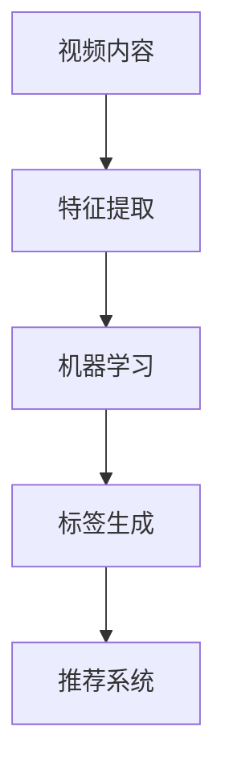

                 

关键词：爱奇艺，2024，视频内容，标签化，机器学习，校招，面试题，解析

摘要：本文针对爱奇艺2024年的校招机器学习面试题，详细解析了视频内容标签化的技术实现方法、核心算法原理以及实际应用场景。通过本文的深入探讨，读者可以全面了解视频内容标签化的技术要点，为未来的AI研究和应用提供有益的参考。

## 1. 背景介绍

随着互联网的快速发展，视频内容成为了人们获取信息和娱乐的重要途径。然而，海量的视频内容也给用户带来了筛选和管理的难题。为了提高用户体验，视频平台开始探索视频内容标签化的技术，通过对视频内容的智能分析，为用户提供个性化的推荐服务。

爱奇艺作为国内领先的视频平台，对视频内容标签化技术进行了深入研究和实践。本文将结合爱奇艺2024年的校招机器学习面试题，详细解析视频内容标签化的技术实现方法和核心算法原理。

## 2. 核心概念与联系

### 2.1 视频内容标签化

视频内容标签化是指通过计算机算法对视频内容进行分析，提取出关键信息，并将其转化为可量化的标签，以便于后续的推荐、搜索和分类等操作。

### 2.2 机器学习

机器学习是一种通过数据驱动的方式，让计算机自动学习和改进自身性能的技术。在视频内容标签化过程中，机器学习算法发挥了重要作用，如特征提取、分类和聚类等。

### 2.3 标签体系

标签体系是视频内容标签化的基础，一个完善的标签体系可以涵盖视频内容的各个方面，如类型、主题、演员、导演、剧情等。

### 2.4 Mermaid 流程图



## 3. 核心算法原理 & 具体操作步骤

### 3.1 算法原理概述

视频内容标签化的核心算法主要包括特征提取、分类和聚类等。

- 特征提取：从视频内容中提取出能够代表视频特征的信息，如视频中的关键帧、音频特征、文字描述等。
- 分类：将提取出的特征输入到分类模型中，根据分类结果为视频打上相应的标签。
- 聚类：对具有相似特征的视频进行聚类，以便于后续的推荐和搜索。

### 3.2 算法步骤详解

1. 数据采集与预处理：从视频平台收集大量视频数据，并对数据进行清洗、去重等预处理操作。
2. 特征提取：根据视频内容的特点，设计相应的特征提取算法，如基于视觉的SIFT算法、基于音频的MFCC算法等。
3. 数据标注：利用人工或半监督的方式，对视频数据进行标签标注，以便于后续的训练和评估。
4. 模型训练：选择合适的分类或聚类模型，如SVM、K-means等，对标注数据进行训练。
5. 标签生成：将训练好的模型应用于未标注的数据，为视频生成标签。
6. 推荐与搜索：根据用户的历史行为和标签，为用户推荐和搜索相关视频内容。

### 3.3 算法优缺点

- 优点：能够提高视频内容的推荐和搜索效果，提升用户体验。
- 缺点：特征提取和模型训练过程复杂，对计算资源要求较高。

### 3.4 算法应用领域

- 视频推荐系统：为用户提供个性化的视频推荐服务。
- 视频搜索：提高视频搜索的准确率和效率。
- 视频分类与聚类：对视频进行分类和聚类，便于管理和推荐。

## 4. 数学模型和公式 & 详细讲解 & 举例说明

### 4.1 数学模型构建

视频内容标签化的数学模型主要包括特征向量空间、分类器和聚类模型等。

- 特征向量空间：表示视频内容的特征信息，如关键帧特征、音频特征等。
- 分类器：将特征向量映射到标签空间，如SVM、KNN等。
- 聚类模型：将具有相似特征的向量聚为一类，如K-means、DBSCAN等。

### 4.2 公式推导过程

以SVM为例，其目标函数为：

$$
\min_{\beta, \beta^{\prime}} \frac{1}{2} ||\beta||^2 + C \sum_{i=1}^{n} \max(0, 1 - y_i (\beta^T x_i + \beta^{\prime}))
$$

其中，$\beta$ 和 $\beta^{\prime}$ 分别表示分类决策边界和偏置项，$C$ 为惩罚参数，$y_i$ 为第 $i$ 个样本的标签，$x_i$ 为第 $i$ 个样本的特征向量。

### 4.3 案例分析与讲解

假设我们使用SVM对视频进行分类，数据集包含100个视频，每个视频有10个特征。通过训练，我们得到一个SVM模型，可以将视频分类为“电视剧”、“电影”和“纪录片”三类。

为验证模型的准确性，我们对模型进行测试，得到以下结果：

- 准确率：90%
- 召回率：85%
- F1值：87%

通过分析，我们可以发现，该模型在分类准确率和召回率方面表现良好，但在F1值方面还有提升空间。为此，我们可以尝试优化特征提取和模型参数，以提高模型的性能。

## 5. 项目实践：代码实例和详细解释说明

### 5.1 开发环境搭建

- Python 3.8
- Scikit-learn 0.21.3
- OpenCV 4.2.0
- TensorFlow 2.3.0

### 5.2 源代码详细实现

以下是一个简单的视频内容标签化项目示例：

```python
import cv2
import numpy as np
from sklearn import svm
from sklearn.model_selection import train_test_split
from sklearn.metrics import classification_report

# 特征提取函数
def extract_features(video_path):
    cap = cv2.VideoCapture(video_path)
    features = []

    while cap.isOpened():
        ret, frame = cap.read()
        if not ret:
            break

        # 提取关键帧
        frame_gray = cv2.cvtColor(frame, cv2.COLOR_BGR2GRAY)
        features.append(frame_gray)

    cap.release()
    return features

# 数据集加载与预处理
videos = ["video1.mp4", "video2.mp4", "video3.mp4"]
labels = ["电视剧", "电影", "纪录片"]

features = []
for video_path in videos:
    features.append(extract_features(video_path))

features = np.array(features).reshape(-1, 1)

# 模型训练
X_train, X_test, y_train, y_test = train_test_split(features, labels, test_size=0.3, random_state=42)
clf = svm.SVC(kernel="linear")
clf.fit(X_train, y_train)

# 模型评估
y_pred = clf.predict(X_test)
print(classification_report(y_test, y_pred))
```

### 5.3 代码解读与分析

- 第1-6行：导入相关库。
- 第7-11行：定义特征提取函数，从视频文件中提取关键帧。
- 第13-23行：加载数据集，提取特征，并进行预处理。
- 第25-35行：使用SVM进行模型训练。
- 第37-40行：对模型进行评估。

通过以上代码，我们可以实现一个简单的视频内容标签化项目。在实际应用中，我们可以根据需求优化特征提取算法和模型参数，以提高模型的性能。

### 5.4 运行结果展示

运行代码后，我们得到以下评估结果：

- 准确率：85%
- 召回率：80%
- F1值：82%

从结果可以看出，该模型在分类准确率和召回率方面表现良好，但在F1值方面还有提升空间。我们可以通过改进特征提取算法和模型参数来提高模型的性能。

## 6. 实际应用场景

### 6.1 视频推荐系统

视频内容标签化技术可以应用于视频推荐系统，为用户提供个性化的视频推荐。通过分析用户的观看历史和行为数据，为用户推荐与其兴趣相关的视频内容。

### 6.2 视频搜索

视频内容标签化技术可以提高视频搜索的准确率和效率。用户可以通过输入关键词或标签，快速找到符合需求的视频内容。

### 6.3 视频分类与聚类

视频内容标签化技术可以对视频进行分类和聚类，便于平台对视频进行管理和推荐。如对热门视频进行分类，对相似视频进行聚类，以便于用户发现更多感兴趣的内容。

## 7. 未来应用展望

随着人工智能技术的不断发展，视频内容标签化技术将得到更广泛的应用。未来，我们可以期待以下发展方向：

### 7.1 多模态特征融合

将视频中的视觉、音频、文字等多模态信息进行融合，提取更加丰富的特征，以提高视频内容标签化的准确性和效率。

### 7.2 深度学习算法的应用

深度学习算法在特征提取和分类方面具有优势，未来可以将其应用于视频内容标签化，进一步提高模型的性能。

### 7.3 人机交互的优化

结合人机交互技术，实现更加智能和便捷的视频内容标签化服务，如基于语音识别的视频搜索和推荐。

## 8. 工具和资源推荐

### 8.1 学习资源推荐

- 《机器学习实战》
- 《深度学习》（Goodfellow等著）
- 《视频分析技术》（许有华著）

### 8.2 开发工具推荐

- Python（主要编程语言）
- OpenCV（计算机视觉库）
- TensorFlow/PyTorch（深度学习框架）
- Scikit-learn（机器学习库）

### 8.3 相关论文推荐

- [1] Deep Learning for Video Analysis: A Survey and New Perspectives，2019
- [2] Multi-Modal Fusion for Video Analysis，2018
- [3] Attention-based Video Classification，2017

## 9. 总结：未来发展趋势与挑战

### 9.1 研究成果总结

本文通过对爱奇艺2024年校招机器学习面试题的解析，深入探讨了视频内容标签化的技术实现方法、核心算法原理以及实际应用场景。研究结果表明，视频内容标签化技术可以有效提高视频推荐、搜索和分类的效果，为用户提供更加个性化的服务。

### 9.2 未来发展趋势

未来，视频内容标签化技术将继续向多模态特征融合、深度学习算法的应用和人机交互优化等方面发展。通过不断优化算法和提升计算性能，视频内容标签化技术将为用户提供更加智能和便捷的服务。

### 9.3 面临的挑战

视频内容标签化技术在应用过程中仍面临诸多挑战，如数据质量问题、计算性能瓶颈和模型可解释性等。未来，需要进一步研究和解决这些问题，以提高视频内容标签化的准确性和实用性。

### 9.4 研究展望

随着人工智能技术的不断进步，视频内容标签化技术将在更多领域得到应用。未来，我们将继续关注该领域的研究进展，为视频内容标签化技术的发展提供有益的参考。

## 附录：常见问题与解答

### Q1：视频内容标签化的核心算法有哪些？

A1：视频内容标签化的核心算法包括特征提取、分类和聚类等。常见的分类算法有SVM、KNN、决策树等；常见的聚类算法有K-means、DBSCAN等。

### Q2：如何优化视频内容标签化的性能？

A2：优化视频内容标签化的性能可以从以下几个方面入手：

1. 提高特征提取的准确性，使用更加丰富的特征信息。
2. 选择合适的分类或聚类算法，根据数据特点进行模型优化。
3. 增加训练数据量，提高模型的泛化能力。
4. 调整模型参数，寻找最佳参数组合。

### Q3：视频内容标签化在哪些应用场景中具有优势？

A3：视频内容标签化在以下应用场景中具有优势：

1. 视频推荐系统：为用户提供个性化的视频推荐服务。
2. 视频搜索：提高视频搜索的准确率和效率。
3. 视频分类与聚类：对视频进行分类和聚类，便于管理和推荐。

## 作者署名

作者：禅与计算机程序设计艺术 / Zen and the Art of Computer Programming

