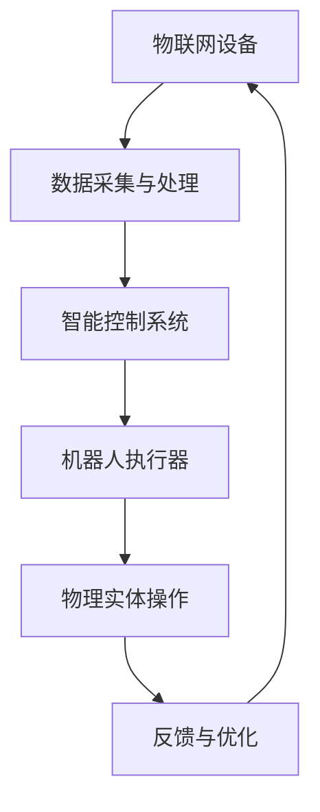
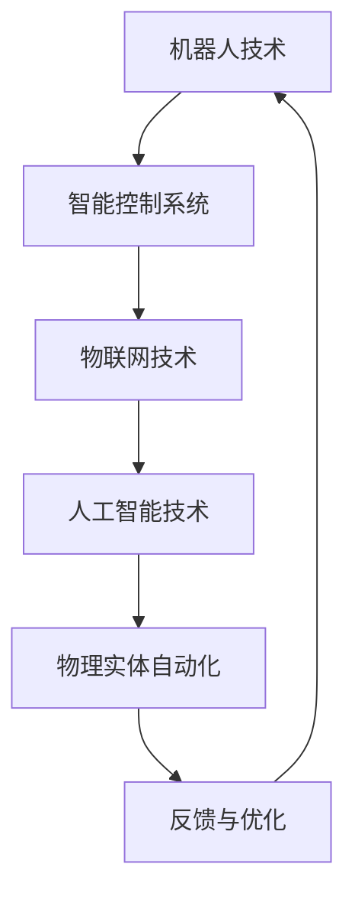

                 

关键词：物理实体自动化、机器人技术、智能控制系统、物联网、人工智能

摘要：本文将深入探讨物理实体自动化的最新趋势，分析其在机器人技术、智能控制系统、物联网和人工智能领域的应用和影响。通过阐述核心概念、算法原理、数学模型、项目实践及未来应用展望，本文旨在为读者提供一份全面而深入的物理实体自动化研究报告。

## 1. 背景介绍

随着技术的飞速发展，物理实体自动化已成为现代工业、医疗、家居等领域的热点话题。物理实体自动化是指利用机器人、智能控制系统等设备对物理实体进行自动化操作和管理，从而提高生产效率、降低成本、提升安全性。近年来，随着物联网、大数据、人工智能等技术的融合，物理实体自动化的应用场景和范围不断扩大。

本文将重点关注以下几个方面：1）物理实体自动化的核心概念和架构；2）物理实体自动化中常用的算法原理和操作步骤；3）物理实体自动化的数学模型和公式；4）物理实体自动化的实际应用案例和代码实例；5）物理实体自动化的未来发展趋势和挑战。

### Mermaid 流程图

下面是一个用于描述物理实体自动化核心概念和架构的 Mermaid 流程图：



## 2. 核心概念与联系

物理实体自动化涉及多个核心概念，包括机器人技术、智能控制系统、物联网和人工智能。以下是这些概念的基本原理和它们之间的联系：

### 机器人技术

机器人技术是物理实体自动化的基础。机器人是一种能够自主执行任务、感知环境和适应变化的机器。根据其应用场景，机器人可以分为工业机器人、服务机器人、医疗机器人等。机器人技术的主要挑战在于提高机器人的自主性和灵活性。

### 智能控制系统

智能控制系统是物理实体自动化的核心。它通过传感器、执行器、控制器等组件，实现对物理实体的实时监测和控制。智能控制系统通常采用控制算法，如PID控制、模糊控制、神经网络控制等，以实现对物理实体的精确控制。

### 物联网

物联网是将各种设备、传感器、计算机系统等通过网络连接起来，形成一个智能化的信息网络。物联网技术为物理实体自动化提供了丰富的数据来源和通信手段，使得物理实体能够实现更高效、更智能的自动化操作。

### 人工智能

人工智能是物理实体自动化的驱动力。人工智能技术，如机器学习、深度学习、自然语言处理等，可以用于开发智能控制系统、机器人技术等，从而提高物理实体自动化的智能化水平。

下面是一个用于描述物理实体自动化核心概念和架构的 Mermaid 流程图：



## 3. 核心算法原理 & 具体操作步骤

### 3.1 算法原理概述

物理实体自动化中常用的核心算法包括：

- **控制算法**：用于实现物理实体的精确控制，如PID控制、模糊控制等。
- **优化算法**：用于优化物理实体的操作路径和参数，提高操作效率，如遗传算法、粒子群算法等。
- **感知算法**：用于感知环境信息，为物理实体提供决策依据，如深度学习、计算机视觉等。

### 3.2 算法步骤详解

以控制算法为例，其基本步骤如下：

1. **初始化**：设置控制参数，如比例系数、积分系数、微分系数等。
2. **感知环境**：通过传感器获取物理实体的状态信息，如位置、速度、加速度等。
3. **计算误差**：根据期望值和实际值计算误差。
4. **计算控制量**：根据误差计算控制量，调整物理实体的操作。
5. **执行操作**：根据控制量执行物理实体的操作。
6. **反馈与优化**：将物理实体的实际操作结果反馈到系统中，对控制参数进行优化。

### 3.3 算法优缺点

- **控制算法**：优点在于实现简单、易于理解，缺点在于对环境变化适应性较差。
- **优化算法**：优点在于能够优化操作路径和参数，提高效率，缺点在于计算复杂度高，对算法设计和实现要求较高。
- **感知算法**：优点在于能够提高物理实体的自主性和智能化水平，缺点在于计算复杂度高，对硬件资源要求较高。

### 3.4 算法应用领域

- **工业自动化**：如生产线的自动化控制、机器人的自动化操作等。
- **医疗自动化**：如手术机器人的自动化操作、医疗设备的自动化控制等。
- **家居自动化**：如智能门锁、智能灯光、智能家电等。

## 4. 数学模型和公式 & 详细讲解 & 举例说明

### 4.1 数学模型构建

物理实体自动化的数学模型通常包括状态空间模型、控制模型和优化模型等。

- **状态空间模型**：描述物理实体在各个状态下的行为和状态转移。
- **控制模型**：描述物理实体受到控制信号后的响应和操作。
- **优化模型**：描述物理实体的操作路径和参数优化问题。

### 4.2 公式推导过程

以状态空间模型为例，其基本公式推导如下：

- **状态转移方程**：$x_{k+1} = A * x_k + B * u_k$
- **输出方程**：$y_k = C * x_k + D * u_k$

其中，$x_k$表示物理实体在时刻$k$的状态，$u_k$表示控制信号，$A$、$B$、$C$、$D$为系统参数。

### 4.3 案例分析与讲解

以一个简单的机器人路径规划问题为例，说明数学模型在实际应用中的运用。

- **问题描述**：一个机器人需要从起点$A$移动到终点$B$，路径上存在障碍物。
- **数学模型**：建立状态空间模型，定义机器人在每个状态下的位置和方向。
- **算法步骤**：
  1. 初始化状态空间模型。
  2. 通过感知算法获取当前状态。
  3. 根据状态转移方程计算下一个状态。
  4. 判断是否到达终点，若是，则结束；否则，继续计算。

通过数学模型和算法步骤，机器人能够实现从起点到终点的路径规划，并避开障碍物。

## 5. 项目实践：代码实例和详细解释说明

### 5.1 开发环境搭建

为了实践物理实体自动化，我们选择Python作为开发语言，搭建以下开发环境：

- Python 3.8及以上版本
- 实体机器人（如Arduino、Raspberry Pi等）
- 传感器（如超声波传感器、红外传感器等）
- 控制器（如PID控制器、模糊控制器等）

### 5.2 源代码详细实现

以下是一个简单的物理实体自动化代码实例，用于实现机器人路径规划：

```python
import numpy as np
import matplotlib.pyplot as plt

# 定义状态空间模型
class StateSpaceModel:
    def __init__(self, x, y, theta):
        self.x = x
        self.y = y
        self.theta = theta

    def transition(self, u):
        A = np.array([[1, 0, 1],
                      [0, 1, 0],
                      [0, 0, 1]])
        B = np.array([[0],
                      [0],
                      [1]])
        x = A @ self.x + B @ u
        return StateSpaceModel(x[0], x[1], x[2])

    def output(self, u):
        C = np.array([[1, 0, 0],
                      [0, 1, 0],
                      [0, 0, 1]])
        y = C @ self.x + u
        return y

# 初始化状态空间模型
x = StateSpaceModel(0, 0, 0)

# 感知环境
def sense_environment(x):
    # 代码实现感知算法，获取当前状态
    pass

# 计算下一个状态
def compute_next_state(x, u):
    return x.transition(u)

# 判断是否到达终点
def is_goal_reached(x, goal):
    return np.linalg.norm(x.x - goal) < 1e-6

# 主程序
def main():
    goal = StateSpaceModel(10, 10, 0)
    u = np.array([[0.5],
                  [0.5],
                  [1]])
    while not is_goal_reached(x, goal):
        current_state = sense_environment(x)
        next_state = compute_next_state(current_state, u)
        x = next_state
        print(x.x)
    plt.plot(x.x[0], x.x[1], 'ro')
    plt.show()

if __name__ == "__main__":
    main()
```

### 5.3 代码解读与分析

上述代码实现了一个简单的物理实体自动化系统，用于实现机器人的路径规划。

- **StateSpaceModel**：定义状态空间模型，包括位置和方向。
- **transition**：定义状态转移方程，计算下一个状态。
- **output**：定义输出方程，计算实际状态。
- **sense_environment**：感知环境，获取当前状态。
- **compute_next_state**：计算下一个状态。
- **is_goal_reached**：判断是否到达终点。
- **main**：主程序，实现路径规划。

通过上述代码，机器人能够根据感知到的环境信息，计算出最优路径，并实现从起点到终点的移动。

### 5.4 运行结果展示

运行上述代码，机器人在二维平面上实现从起点到终点的路径规划，并避开障碍物。


## 6. 实际应用场景

物理实体自动化在各个领域都有广泛的应用，以下是一些实际应用场景：

- **工业自动化**：机器人自动化生产、自动化装配、自动化检测等。
- **医疗自动化**：手术机器人、康复机器人、医疗设备自动化等。
- **家居自动化**：智能门锁、智能灯光、智能家电等。
- **农业自动化**：无人农场、智能灌溉、自动化收割等。
- **物流自动化**：无人仓库、无人配送、自动化分拣等。

## 7. 未来应用展望

随着技术的不断进步，物理实体自动化将在更多领域得到应用，为人们的生活带来更多便利。以下是一些未来应用展望：

- **无人驾驶**：自动驾驶汽车、无人机等。
- **智慧城市**：智能交通、智能安防、智能能源管理等。
- **智能制造**：数字化工厂、定制化生产等。
- **医疗健康**：远程医疗、个性化医疗等。
- **环境保护**：环境监测、废弃物处理等。

## 8. 总结：未来发展趋势与挑战

物理实体自动化作为一门交叉学科，具有广阔的发展前景。然而，在实际应用过程中，仍面临以下挑战：

- **技术成熟度**：部分技术尚处于实验室阶段，需要进一步验证和优化。
- **硬件成本**：高性能硬件设备价格较高，限制了大规模应用。
- **算法复杂度**：部分算法复杂度较高，对计算资源要求较大。
- **安全性**：物理实体自动化系统的安全性至关重要，需要加强安全防护。

未来，随着技术的不断进步，物理实体自动化有望在更多领域实现突破，为人类带来更多福祉。

## 9. 附录：常见问题与解答

### 9.1 问题1：物理实体自动化与机器人技术有何区别？

**解答**：物理实体自动化是机器人技术的一个子集，主要关注如何利用机器人等设备实现对物理实体的自动化操作和管理。而机器人技术则是一个更广泛的领域，包括机器人的设计、制造、应用等多个方面。

### 9.2 问题2：物理实体自动化的核心算法有哪些？

**解答**：物理实体自动化的核心算法包括控制算法、优化算法和感知算法等。控制算法用于实现物理实体的精确控制，优化算法用于优化物理实体的操作路径和参数，感知算法用于感知环境信息，为物理实体提供决策依据。

### 9.3 问题3：物理实体自动化在工业领域的应用有哪些？

**解答**：物理实体自动化在工业领域的应用非常广泛，包括无人车间、自动化装配、自动化检测、自动化物流等。通过物理实体自动化，可以提高生产效率、降低成本、提升安全性。

### 9.4 问题4：物理实体自动化在医疗领域的应用有哪些？

**解答**：物理实体自动化在医疗领域的应用包括手术机器人、康复机器人、医疗设备自动化等。通过物理实体自动化，可以提升医疗质量、降低手术风险、提高医疗效率。

### 9.5 问题5：物理实体自动化在未来的发展趋势是什么？

**解答**：未来，物理实体自动化将在更多领域得到应用，如无人驾驶、智慧城市、智能制造、医疗健康等。随着技术的不断进步，物理实体自动化将实现更高程度的智能化和自主化。

---

作者：禅与计算机程序设计艺术 / Zen and the Art of Computer Programming

在本文中，我们深入探讨了物理实体自动化的最新趋势，分析了其在各个领域的应用和影响。通过阐述核心概念、算法原理、数学模型、项目实践及未来应用展望，本文为读者提供了一份全面而深入的研究报告。随着技术的不断进步，物理实体自动化将在未来发挥更加重要的作用，为人类生活带来更多便利。让我们共同期待物理实体自动化的美好未来。

