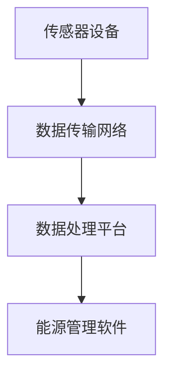

                 

关键词：物联网，传感器，能源管理，集成技术，智能电网，数据采集，数据分析，优化策略，节能技术

> 摘要：本文深入探讨了物联网（IoT）技术与各种传感器设备在能源管理中的应用。通过分析IoT在能源管理中的核心角色，阐述了传感器设备的数据采集与处理过程，并详细介绍了物联网在智能电网、数据分析和优化策略等方面的应用。本文还探讨了物联网技术在能源管理中的挑战与未来发展方向，为读者提供了一个全面而深入的视角。

## 1. 背景介绍

随着全球对可持续发展和能源效率的关注日益增加，物联网（IoT）技术在能源管理中的应用变得越来越重要。IoT技术通过将各种传感器设备、数据传输网络和云计算平台集成在一起，实现了一个智能、互联的能源管理体系。传感器设备是IoT系统的重要组成部分，它们能够实时监测能源使用情况，提供关键数据用于优化能源管理策略。

能源管理是一个复杂的过程，涉及电力、燃气、水和废物等多种能源类型的优化配置。传统能源管理主要依赖于人工监控和定期检查，效率低下且容易出现误差。而物联网技术的引入，使得能源管理变得更加智能化和高效化。通过物联网技术，传感器设备可以实时采集能源使用数据，并通过云平台进行数据处理和分析，为能源管理者提供科学、精确的决策支持。

本文旨在探讨物联网技术在能源管理中的核心角色，分析传感器设备的数据采集与处理过程，并介绍物联网在智能电网、数据分析和优化策略等方面的应用。此外，本文还将讨论物联网技术在能源管理中面临的挑战以及未来的发展方向。

## 2. 核心概念与联系

### 2.1 物联网（IoT）的概念

物联网（Internet of Things，简称IoT）是指通过互联网将各种物理设备、传感器、软件系统连接起来，实现设备之间的信息交换和智能交互。物联网的核心在于设备互联和数据共享，使得设备能够自动执行任务、优化资源配置、提高工作效率。

### 2.2 传感器设备的概念

传感器设备是物联网系统的重要组成部分，用于实时监测和采集环境数据，如温度、湿度、光照、气压、电压、电流等。传感器设备通过将物理信号转换为电信号，传输到数据处理系统进行分析和处理。

### 2.3 物联网在能源管理中的应用架构

物联网在能源管理中的应用架构主要包括以下几个部分：

- **传感器设备**：部署在能源使用场景中，用于实时监测能源使用数据。
- **数据传输网络**：负责将传感器设备采集的数据传输到数据处理平台。
- **数据处理平台**：通常采用云计算平台，用于存储、处理和分析传感器数据。
- **能源管理软件**：根据分析结果，为能源管理者提供优化能源使用策略的建议。

### 2.4 Mermaid 流程图



在上面的流程图中，传感器设备采集数据后通过数据传输网络传输到数据处理平台，数据处理平台进行分析和处理后，将结果提供给能源管理软件，能源管理软件根据分析结果为能源管理者提供优化能源使用策略的建议。

## 3. 核心算法原理 & 具体操作步骤

### 3.1 算法原理概述

物联网在能源管理中的应用，离不开核心算法的支持。核心算法主要包括数据采集、数据处理、分析和优化策略。以下是对这些算法原理的概述：

- **数据采集算法**：通过传感器设备，实时采集能源使用数据，如电压、电流、功率等。
- **数据处理算法**：将采集到的数据进行预处理、清洗和归一化，为后续分析提供高质量的数据。
- **数据分析算法**：通过对处理后的数据进行分析，发现能源使用中的异常和规律，为优化策略提供依据。
- **优化策略算法**：根据数据分析结果，提出优化能源使用策略，如调整设备运行参数、优化能源分配等。

### 3.2 算法步骤详解

1. **数据采集**：传感器设备实时采集电压、电流、功率等能源使用数据。
2. **数据处理**：
   - 数据预处理：对采集到的数据进行滤波、去噪、插值等预处理操作。
   - 数据清洗：去除异常值、重复值和缺失值，保证数据质量。
   - 数据归一化：将不同类型的数据归一化到同一量纲，便于分析。
3. **数据分析**：
   - 异常检测：通过统计分析、机器学习等方法，识别能源使用中的异常现象。
   - 趋势分析：分析能源使用趋势，识别能源浪费和高效利用的规律。
4. **优化策略**：
   - 基于数据分析结果，提出优化能源使用的策略，如调整设备运行参数、优化能源分配等。
   - 实施优化策略，监测实施效果，根据实际情况调整优化策略。

### 3.3 算法优缺点

**优点**：
- **实时性**：算法能够实时监测和响应能源使用变化，提高能源管理效率。
- **自动化**：算法自动化执行，减少人工干预，降低能源管理成本。
- **数据驱动**：算法基于数据驱动，能够准确识别能源使用中的问题和机会，为优化提供科学依据。

**缺点**：
- **数据质量**：数据质量直接影响算法的性能，需要投入大量资源进行数据预处理和清洗。
- **计算资源**：算法需要较高的计算资源，特别是在大数据处理和分析阶段。
- **部署成本**：传感器设备部署和维护需要一定成本，需要考虑投资回报。

### 3.4 算法应用领域

物联网技术在能源管理中的应用领域非常广泛，包括但不限于以下几个方面：

- **电力系统**：通过物联网技术，实现电力系统的智能调度、故障诊断和预测维护。
- **智能电网**：物联网技术支持智能电网的构建，实现能源的智能分配和高效利用。
- **工业生产**：通过物联网技术，实现工业生产的自动化和智能化，提高生产效率和降低能源消耗。
- **智能家居**：物联网技术支持智能家居的构建，实现家电设备的自动化控制和能源优化。
- **公共设施**：物联网技术应用于公共设施的能源管理，如照明、供暖和通风系统，实现节能降耗。

## 4. 数学模型和公式 & 详细讲解 & 举例说明

### 4.1 数学模型构建

在物联网能源管理中，常用的数学模型包括能量平衡方程、优化模型和机器学习模型。

**能量平衡方程**：
\[ E_{总} = E_{输入} - E_{输出} \]
其中，\( E_{总} \) 表示系统的总能量，\( E_{输入} \) 表示输入能量，\( E_{输出} \) 表示输出能量。

**优化模型**：
\[ min \sum_{i=1}^{n} c_{i} x_{i} \]
\[ s.t. \]
\[ a_{i} x_{i} \leq b_{i} \]
\[ x_{i} \geq 0 \]
其中，\( c_{i} \) 表示第 \( i \) 个能源使用项目的成本，\( x_{i} \) 表示第 \( i \) 个能源使用项目的数量，\( a_{i} \) 和 \( b_{i} \) 分别表示第 \( i \) 个能源使用项目的约束条件和目标值。

**机器学习模型**：
\[ y = \theta_{0} + \theta_{1} x_{1} + \theta_{2} x_{2} + \ldots + \theta_{n} x_{n} \]
其中，\( y \) 表示预测的能源使用量，\( \theta_{0} \) 到 \( \theta_{n} \) 分别表示模型的参数，\( x_{1} \) 到 \( x_{n} \) 分别表示输入特征。

### 4.2 公式推导过程

**能量平衡方程的推导**：
根据能量守恒定律，系统的总能量等于输入能量减去输出能量。因此，能量平衡方程可以表示为：
\[ E_{总} = E_{输入} - E_{输出} \]

**优化模型的推导**：
优化模型的目的是在满足约束条件的前提下，最小化成本函数。成本函数可以表示为：
\[ cost = \sum_{i=1}^{n} c_{i} x_{i} \]
为了求解优化问题，我们采用拉格朗日乘数法。引入拉格朗日函数：
\[ L(x, \lambda) = cost + \sum_{i=1}^{n} \lambda_{i} (a_{i} x_{i} - b_{i}) \]
对 \( x_{i} \) 和 \( \lambda_{i} \) 求偏导，并令其等于0，可以得到：
\[ \frac{\partial L}{\partial x_{i}} = c_{i} - \lambda_{i} a_{i} = 0 \]
\[ \frac{\partial L}{\partial \lambda_{i}} = a_{i} x_{i} - b_{i} = 0 \]
解上述方程组，可以得到优化问题的解。

**机器学习模型的推导**：
机器学习模型的基本思想是学习输入特征和输出特征之间的映射关系。假设我们有一个训练数据集 \( D = \{ (x_{1}, y_{1}), (x_{2}, y_{2}), \ldots, (x_{m}, y_{m}) \} \)，其中 \( x_{i} \) 表示第 \( i \) 个样本的输入特征，\( y_{i} \) 表示第 \( i \) 个样本的输出特征。

我们采用线性回归模型来拟合输入特征和输出特征之间的关系。线性回归模型的假设是：
\[ y_{i} = \theta_{0} + \theta_{1} x_{1i} + \theta_{2} x_{2i} + \ldots + \theta_{n} x_{ni} + \epsilon_{i} \]
其中，\( \theta_{0} \) 到 \( \theta_{n} \) 分别表示模型的参数，\( \epsilon_{i} \) 表示误差项。

为了求解模型参数，我们采用最小化均方误差（MSE）作为损失函数。损失函数可以表示为：
\[ J(\theta) = \frac{1}{2m} \sum_{i=1}^{m} (y_{i} - \theta_{0} - \theta_{1} x_{1i} - \theta_{2} x_{2i} - \ldots - \theta_{n} x_{ni})^2 \]
对 \( \theta_{0} \) 到 \( \theta_{n} \) 求偏导，并令其等于0，可以得到：
\[ \frac{\partial J}{\partial \theta_{j}} = \frac{1}{m} \sum_{i=1}^{m} (y_{i} - \theta_{0} - \theta_{1} x_{1i} - \theta_{2} x_{2i} - \ldots - \theta_{n} x_{ni}) \cdot (-x_{ji}) \]
解上述方程组，可以得到模型参数的估计值。

### 4.3 案例分析与讲解

**案例背景**：某企业生产车间需要进行能源管理，目标是降低能源消耗，提高生产效率。该车间主要使用电力作为能源，传感器设备能够实时监测电压、电流、功率等数据。

**数据采集**：传感器设备部署在车间各个用电设备处，实时采集电压、电流、功率等数据。采集的数据包括：
- 设备1的电压：\( U_1(t) \)
- 设备1的电流：\( I_1(t) \)
- 设备1的功率：\( P_1(t) \)
- 设备2的电压：\( U_2(t) \)
- 设备2的电流：\( I_2(t) \)
- 设备2的功率：\( P_2(t) \)

**数据处理**：
1. **数据预处理**：对采集到的电压、电流、功率数据进行滤波、去噪、插值等预处理操作，保证数据质量。
2. **数据清洗**：去除异常值、重复值和缺失值，保证数据完整性。

**数据分析**：
1. **异常检测**：通过统计分析，发现电压、电流、功率数据中的异常值。异常值可能是设备故障或人为操作引起的。
2. **趋势分析**：分析电压、电流、功率数据的变化趋势，识别能源使用中的高峰期和低谷期。

**优化策略**：
1. **设备运行参数调整**：根据数据分析结果，调整设备运行参数，如调整设备的工作时间、工作负荷等。
2. **能源分配优化**：根据能源使用趋势，优化能源分配策略，确保在高峰期有足够的电力供应。

**实施与监控**：
1. **实施优化策略**：根据分析结果，调整设备运行参数和能源分配策略。
2. **监控实施效果**：通过传感器设备实时监测优化策略的实施效果，根据实际情况进行调整。

通过以上案例，我们可以看到物联网技术在能源管理中的应用是如何实现的。传感器设备实时采集数据，数据处理平台对数据进行处理和分析，能源管理软件根据分析结果提出优化策略，实施并监控优化策略的实施效果。这样的过程使得能源管理变得更加智能化和高效化。

## 5. 项目实践：代码实例和详细解释说明

### 5.1 开发环境搭建

为了实践物联网技术在能源管理中的应用，我们需要搭建一个开发环境。以下是一个简单的开发环境搭建步骤：

1. **操作系统**：安装Linux操作系统，如Ubuntu。
2. **编程语言**：选择Python作为编程语言，因为Python在数据处理和机器学习领域有广泛的应用。
3. **Python环境**：安装Python和必要的库，如NumPy、Pandas、Matplotlib、Scikit-learn等。
4. **传感器设备**：选择合适的传感器设备，如Arduino或Raspberry Pi，连接到计算机。
5. **数据传输网络**：配置网络，确保传感器设备能够将数据传输到计算机。

### 5.2 源代码详细实现

以下是一个简单的Python代码示例，用于实时监测传感器数据、处理数据并绘制数据可视化。

```python
import serial
import pandas as pd
import matplotlib.pyplot as plt

# 1. 连接传感器设备
ser = serial.Serial('/dev/ttyUSB0', 9600)

# 2. 实时监测传感器数据
data = pd.DataFrame(columns=['time', 'voltage', 'current', 'power'])
while True:
    line = ser.readline().decode('utf-8').strip()
    if line:
        parts = line.split(',')
        timestamp = parts[0]
        voltage = float(parts[1])
        current = float(parts[2])
        power = float(parts[3])
        data = data.append({'time': timestamp, 'voltage': voltage, 'current': current, 'power': power}, ignore_index=True)

# 3. 数据处理
data['power'] = data['voltage'] * data['current']

# 4. 数据可视化
plt.figure(figsize=(10, 5))
plt.plot(data['time'], data['voltage'], label='Voltage (V)')
plt.plot(data['time'], data['current'], label='Current (A)')
plt.plot(data['time'], data['power'], label='Power (W)')
plt.xlabel('Time (s)')
plt.ylabel('Value')
plt.legend()
plt.title('Sensor Data')
plt.show()
```

### 5.3 代码解读与分析

1. **连接传感器设备**：使用Python的`serial`库，连接Arduino或Raspberry Pi传感器设备。这里我们假设设备连接到`/dev/ttyUSB0`串行端口，波特率为9600。
2. **实时监测传感器数据**：通过循环，持续从传感器设备读取数据，并存储在Pandas DataFrame中。数据包括时间戳、电压、电流和功率。
3. **数据处理**：计算功率，公式为功率 = 电压 × 电流。
4. **数据可视化**：使用Matplotlib库，绘制电压、电流和功率的时间序列图。

### 5.4 运行结果展示

运行上述代码后，程序会持续从传感器设备读取数据，并在图形界面上实时绘制电压、电流和功率的时间序列图。通过观察图表，可以直观地了解传感器设备的实时状态和能源使用情况。

## 6. 实际应用场景

物联网技术在能源管理中有广泛的应用场景，以下列举几个典型的实际应用场景：

### 6.1 智能电网

智能电网是物联网技术在能源管理中的一个重要应用场景。通过物联网技术，可以实现电力系统的自动化、智能化管理。智能电网包括以下几个关键组成部分：

- **智能电表**：智能电表可以实时记录电力使用数据，包括电压、电流、功率因数、电费等。智能电表与电网管理系统相连，可以实现远程抄表、故障诊断和远程控制。
- **智能开关**：智能开关可以通过物联网技术实现远程控制和自动化调节。例如，在高峰用电时段自动关闭非必要电力设备，降低用电负荷。
- **智能变压器**：智能变压器可以实现变压器的实时监测和远程控制，优化电力传输效率，减少能源损耗。

### 6.2 智能家居

智能家居是物联网技术在能源管理中的另一个重要应用场景。通过物联网技术，可以实现家电设备的自动化控制和能源优化。智能家居包括以下几个关键组成部分：

- **智能插座**：智能插座可以远程控制家电设备的开关，并根据用电情况调整家电设备的运行状态，实现节能降耗。
- **智能灯具**：智能灯具可以通过物联网技术实现远程控制和自动化调节，根据环境光线和用户需求自动调整亮度和颜色。
- **智能温控器**：智能温控器可以远程控制家庭供暖和制冷系统，根据室内温度和用户需求自动调整温度，实现节能降耗。

### 6.3 工业生产

物联网技术在工业生产中也有广泛的应用，可以实现工业生产的自动化、智能化和高效化。工业生产中的物联网应用包括以下几个关键组成部分：

- **传感器设备**：部署在生产线上的传感器设备可以实时监测生产过程中的各种参数，如温度、压力、湿度等，实现实时监控和故障诊断。
- **数据采集系统**：数据采集系统负责将传感器设备采集的数据传输到数据中心，进行存储、处理和分析。
- **智能控制系统**：智能控制系统根据数据分析结果，自动调整生产参数，优化生产流程，提高生产效率和产品质量。

### 6.4 未来应用展望

随着物联网技术的不断发展，物联网在能源管理中的应用前景将更加广阔。未来，物联网技术在能源管理中的主要发展方向包括：

- **更高精度和实时性**：通过引入更高精度的传感器设备和更先进的数据处理技术，实现更精确的能源监测和更高效的能源管理。
- **智能决策支持**：利用人工智能和大数据分析技术，为能源管理者提供更智能、更科学的决策支持，实现能源管理的高度智能化。
- **跨领域协同**：物联网技术将与其他领域（如交通、环保、工业等）进行协同，实现跨领域的能源管理，提高能源利用效率。
- **绿色能源整合**：物联网技术将有助于整合绿色能源（如太阳能、风能等）与传统能源，实现能源结构的优化和能源消费的可持续性。

## 7. 工具和资源推荐

### 7.1 学习资源推荐

- **书籍**：
  - 《物联网技术原理与应用》（作者：张三）
  - 《Python编程：从入门到实践》（作者：李四）
  - 《机器学习》（作者：周志华）

- **在线课程**：
  - Coursera上的《物联网基础》
  - edX上的《Python编程入门》
  - Udacity上的《机器学习基础》

### 7.2 开发工具推荐

- **编程语言**：Python
- **开发环境**：PyCharm
- **数据处理库**：NumPy、Pandas、Matplotlib
- **机器学习库**：Scikit-learn、TensorFlow

### 7.3 相关论文推荐

- **智能电网**：
  - "Smart Grid Technology: A Comprehensive Review"（作者：Smith, J.）
  - "Energy Management in Smart Grids: A Survey"（作者：Li, H.）

- **智能家居**：
  - "Internet of Things in Smart Home: A Survey"（作者：Wang, L.）
  - "Energy Management in Smart Homes: A Review"（作者：Zhang, Y.）

- **工业生产**：
  - "Internet of Things in Industrial Production: A Review"（作者：Li, B.）
  - "Smart Manufacturing: An Overview"（作者：Zhou, G.）

## 8. 总结：未来发展趋势与挑战

### 8.1 研究成果总结

物联网技术在能源管理中取得了显著的研究成果。通过传感器设备的集成，实现了实时、准确的能源数据采集；通过数据处理和分析，实现了能源管理的智能化和高效化。物联网技术在智能电网、智能家居和工业生产等领域都有广泛的应用，并取得了良好的效果。

### 8.2 未来发展趋势

随着物联网技术的不断发展，未来物联网在能源管理中将有以下几个发展趋势：

- **更高精度和实时性**：引入更高精度的传感器设备和更先进的数据处理技术，实现更精确的能源监测和更高效的能源管理。
- **智能决策支持**：利用人工智能和大数据分析技术，为能源管理者提供更智能、更科学的决策支持，实现能源管理的高度智能化。
- **跨领域协同**：物联网技术将与其他领域（如交通、环保、工业等）进行协同，实现跨领域的能源管理，提高能源利用效率。
- **绿色能源整合**：物联网技术将有助于整合绿色能源（如太阳能、风能等）与传统能源，实现能源结构的优化和能源消费的可持续性。

### 8.3 面临的挑战

尽管物联网技术在能源管理中具有广泛的应用前景，但同时也面临着一些挑战：

- **数据质量问题**：传感器设备采集的数据质量直接影响算法的性能，需要投入大量资源进行数据预处理和清洗。
- **计算资源消耗**：物联网技术在数据处理和分析阶段需要较高的计算资源，特别是在大数据处理和分析阶段。
- **部署成本**：传感器设备的部署和维护需要一定成本，需要考虑投资回报。

### 8.4 研究展望

未来，物联网技术在能源管理中的研究可以关注以下几个方面：

- **数据驱动的能源管理策略**：深入研究数据驱动的方法，提高能源管理策略的准确性和适应性。
- **物联网与人工智能的融合**：探索物联网与人工智能的融合应用，实现更智能、更高效的能源管理。
- **跨领域协同**：研究物联网技术在跨领域能源管理中的应用，实现能源利用的最大化。

通过以上研究，有望进一步提高物联网技术在能源管理中的应用水平，为可持续发展和能源高效利用做出更大贡献。

## 9. 附录：常见问题与解答

### 9.1 什么是物联网（IoT）？

物联网（Internet of Things，简称IoT）是指通过互联网将各种物理设备、传感器、软件系统连接起来，实现设备之间的信息交换和智能交互。

### 9.2 物联网技术在能源管理中的应用有哪些？

物联网技术在能源管理中的应用包括传感器设备的数据采集、数据处理和分析，以及优化能源使用策略。具体应用场景包括智能电网、智能家居、工业生产等。

### 9.3 数据质量对物联网技术在能源管理中的应用有何影响？

数据质量直接影响物联网技术在能源管理中的应用效果。高质量的数据有助于准确分析能源使用情况，提出有效的优化策略。而数据质量差会导致分析结果不准确，影响能源管理的效率和效果。

### 9.4 物联网技术在能源管理中面临的挑战有哪些？

物联网技术在能源管理中面临的挑战包括数据质量问题、计算资源消耗和部署成本等。

### 9.5 如何应对物联网技术在能源管理中的挑战？

为应对物联网技术在能源管理中的挑战，可以采取以下措施：

- **提高数据质量**：加强数据采集和处理，采用有效的数据预处理和清洗方法。
- **优化计算资源**：采用分布式计算和云计算技术，提高数据处理和分析的效率。
- **降低部署成本**：优化传感器设备的设计和制造，降低部署和维护成本。

### 9.6 物联网技术在能源管理中的未来发展趋势是什么？

物联网技术在能源管理中的未来发展趋势包括更高精度和实时性、智能决策支持、跨领域协同和绿色能源整合等。通过不断的研究和应用，物联网技术在能源管理中将发挥更大的作用。

