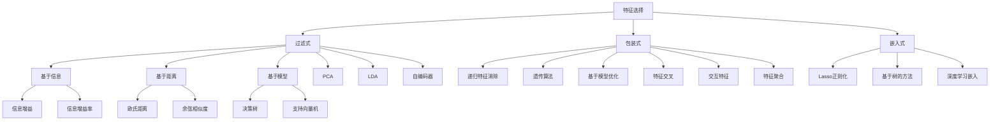

                 

关键词：特征工程、数据预处理、机器学习、特征选择、特征提取、Python 代码实例

## 摘要

本文旨在深入探讨特征工程（Feature Engineering）这一核心的机器学习环节，从原理、实践到代码实例全面解析其重要性。我们将首先介绍特征工程的背景和定义，然后逐步深入核心概念，如特征选择和特征提取。接着，通过具体算法原理和操作步骤的讲解，帮助读者理解如何有效地进行特征工程。最后，我们将通过一个详细的代码实例展示特征工程的实战过程，帮助读者将理论知识应用于实践。通过这篇文章，读者将能够掌握特征工程的基本原理，并具备在实际项目中应用这些技术的实际能力。

## 1. 背景介绍

### 特征工程的重要性

特征工程（Feature Engineering）是机器学习项目中至关重要的一步，它直接影响到模型的性能和可解释性。特征工程的核心目标是提取和构建能够有效表示数据特征的信息，使得模型能够更准确地捕捉数据的内在规律。无论是通过简单的数据预处理，如归一化和标准化，还是复杂的特征提取方法，如主成分分析（PCA）和特征选择算法，特征工程都是提升模型表现的关键。

### 机器学习的挑战

在机器学习项目中，数据往往是复杂且多维的。原始数据中可能包含大量的噪声、异常值以及冗余信息，这些都可能对模型的训练和预测造成负面影响。此外，不同特征之间可能存在强相关性，这会导致特征冗余，降低模型的泛化能力。因此，通过特征工程来清理、转换和构建特征，可以帮助模型更好地学习数据的内在结构，从而提高模型的准确性和鲁棒性。

### 特征工程的历史和演变

特征工程的概念可以追溯到早期的统计学习和人工神经网络时代。当时，特征工程主要依赖于领域知识和直觉，通过手工构建特征来实现对数据的表征。随着机器学习技术的不断发展和数据的爆炸式增长，特征工程的方法也逐渐变得更加系统和自动化。现代特征工程结合了数据挖掘、统计学、计算机科学和机器学习领域的多种技术，形成了一套完整的流程和方法。

### 本文的目的

本文将详细探讨特征工程的基本原理、核心概念和实践方法，并通过具体的代码实例帮助读者深入理解这些方法在实际项目中的应用。读者将了解到特征工程在不同类型的机器学习任务中的重要性，掌握特征选择和特征提取的常用算法，并能够运用这些知识提升自己的机器学习项目。

## 2. 核心概念与联系

### 特征选择（Feature Selection）

特征选择是一种用于减少数据集中特征数量的技术，目的是去除不相关或冗余的特征，从而提高模型性能和解释性。特征选择通常包括过滤式（filter）、包装式（wrapper）和嵌入式（嵌入式）三种方法。

#### 过滤式特征选择

过滤式特征选择是一种基于统计方法进行特征评估，然后根据评估结果选择保留或删除特征的过程。常见的方法包括基于信息的特征选择（如信息增益、信息增益率）、基于距离的特征选择（如欧氏距离、余弦相似度）以及基于模型的特征选择（如基于决策树、支持向量机等模型评价特征的重要性）。

#### 包装式特征选择

包装式特征选择是一种基于搜索策略进行特征选择的方法，通过迭代评估不同的特征组合，选择最优的特征子集。常见的搜索策略包括递归特征消除（RFE）、遗传算法（GA）以及基于模型的优化方法（如基于随机森林的特征选择）。

#### 嵌入式特征选择

嵌入式特征选择将特征选择过程整合到模型训练过程中，通过模型训练自动筛选特征。常见的方法包括Lasso正则化、基于树的方法（如随机森林的特征重要性）以及基于深度学习的嵌入特征选择（如卷积神经网络中的池化层）。

### 特征提取（Feature Extraction）

特征提取是一种通过将原始数据转换为更高级别的抽象表示来提高模型性能的技术。特征提取通常涉及数据降维、特征变换、特征组合等操作。

#### 数据降维

数据降维是指通过减少数据集的维度来降低计算复杂度和提高模型训练效率。常见的方法包括主成分分析（PCA）、线性判别分析（LDA）以及非线性的降维方法，如自编码器（Autoencoder）。

#### 特征变换

特征变换是指通过数学变换将原始特征转换为具有不同解释性或更易于建模的新特征。常见的方法包括标准化、归一化、对数变换以及多项式特征变换。

#### 特征组合

特征组合是指通过组合多个原始特征来生成新的特征，以增强模型的解释性和性能。常见的方法包括特征交叉（Feature Crossing）、交互特征（Interaction Features）以及特征聚合（Feature Aggregation）。

### Mermaid 流程图

以下是特征工程的核心概念和流程的 Mermaid 流程图：



### 联系与比较

特征选择和特征提取在目标上有所不同，特征选择旨在减少特征数量，而特征提取旨在提高特征质量。在实际应用中，这两种方法通常结合使用，以最大化模型性能。

#### 特征选择与特征提取的联系

- **特征选择可以看作是特征提取的前期预处理**。通过特征选择，可以去除不相关或冗余的特征，减少后续特征提取的计算负担。
- **特征提取可以为特征选择提供参考**。通过特征提取方法，如降维或变换，可以更好地理解特征之间的关系，从而更有效地进行特征选择。

#### 特征选择与特征提取的比较

- **时间复杂度**：特征选择通常比特征提取更快，因为它主要涉及特征评估和筛选过程，而不涉及复杂的变换或建模。
- **模型适应性**：特征提取方法通常具有较强的模型适应性，可以应用于不同的机器学习模型。而特征选择方法可能对特定类型的模型更为有效。

通过理解这些联系和比较，读者可以更好地在实际项目中应用特征工程技术，以提升模型性能和可解释性。

## 3. 核心算法原理 & 具体操作步骤

### 3.1 算法原理概述

特征工程的核心算法包括特征选择和特征提取。这两种算法分别通过不同的方式提高模型的性能和可解释性。

#### 特征选择原理

特征选择的基本原理是通过评估特征的重要性，选择最具代表性的特征子集。这可以通过基于信息的评估方法、基于距离的评估方法和基于模型的评估方法实现。

1. **基于信息的评估方法**：如信息增益和信息增益率，通过计算特征对于类别信息的贡献度进行评估。
2. **基于距离的评估方法**：如欧氏距离和余弦相似度，通过特征之间的距离或相似度来评估特征的重要性。
3. **基于模型的评估方法**：如决策树和随机森林，通过模型对特征的重要性的评分来评估特征。

#### 特征提取原理

特征提取的基本原理是通过将原始数据转换为更高级别的抽象表示，以增强模型的学习能力和解释性。常见的特征提取方法包括降维、变换和组合。

1. **降维方法**：如主成分分析（PCA）和线性判别分析（LDA），通过减少数据维度来简化数据结构。
2. **变换方法**：如标准化、归一化和对数变换，通过数学变换提高数据的表达能力和模型的适应性。
3. **组合方法**：如特征交叉和交互特征，通过组合原始特征生成新的特征，增强模型的解释性。

### 3.2 算法步骤详解

下面我们将详细介绍特征选择和特征提取的具体操作步骤。

#### 特征选择步骤

1. **数据预处理**：清洗数据，处理缺失值和异常值，确保数据质量。
2. **特征评估**：使用评估方法计算每个特征的重要性，常见的方法有信息增益、信息增益率、欧氏距离等。
3. **特征筛选**：根据评估结果，选择重要性较高的特征，去除不相关或冗余的特征。
4. **模型训练**：使用筛选后的特征训练模型，评估模型性能。

#### 特征提取步骤

1. **数据预处理**：同样进行数据清洗和预处理。
2. **特征降维**：使用PCA或LDA等降维方法，将高维数据转换为低维数据。
3. **特征变换**：使用标准化、归一化或对数变换等变换方法，提高特征的表达能力。
4. **特征组合**：通过特征交叉或交互特征等方法，生成新的特征。

### 3.3 算法优缺点

#### 特征选择优缺点

- **优点**：减少特征数量，简化模型结构，提高模型训练效率和可解释性。
- **缺点**：可能遗漏重要特征，影响模型性能；评估方法的选择对结果有较大影响。

#### 特征提取优缺点

- **优点**：通过降维和变换，提高模型的学习能力和解释性；生成新的特征，增强模型的适应性。
- **缺点**：计算复杂度较高，可能增加模型训练时间；特征提取方法的选择和参数调优对结果有较大影响。

### 3.4 算法应用领域

特征选择和特征提取广泛应用于各类机器学习任务中，如分类、回归、聚类等。以下是特征选择和特征提取在不同领域中的应用实例：

- **分类任务**：通过特征选择去除冗余特征，提高分类模型的准确性和解释性。
- **回归任务**：通过特征提取提高模型的预测性能，减少训练时间。
- **聚类任务**：通过降维减少数据维度，提高聚类算法的效率。

## 4. 数学模型和公式 & 详细讲解 & 举例说明

### 4.1 数学模型构建

特征工程中的数学模型主要用于描述特征之间的关系和特征提取的过程。以下是几个常见的数学模型：

#### 4.1.1 特征选择模型

- **信息增益**（Information Gain, IG）：

  $$ IG(D, A) = H(D) - H(D|A) $$

  其中，$H(D)$ 是数据 $D$ 的熵，$H(D|A)$ 是在特征 $A$ 下数据的条件熵。

- **信息增益率**（Information Gain Ratio, IGR）：

  $$ IGR(D, A) = \frac{IG(D, A)}{H(A)} $$

  其中，$H(A)$ 是特征 $A$ 的熵。

#### 4.1.2 特征提取模型

- **主成分分析**（Principal Component Analysis, PCA）：

  $$ X' = P \cdot X $$

  其中，$X$ 是原始数据，$P$ 是投影矩阵，由协方差矩阵的特征向量构成。

- **线性判别分析**（Linear Discriminant Analysis, LDA）：

  $$ y = \frac{1}{n} \sum_{i=1}^{n} (X_i - \mu) \cdot W $$

  其中，$X_i$ 是第 $i$ 个样本，$\mu$ 是样本均值，$W$ 是权重向量。

### 4.2 公式推导过程

下面我们将对上述公式进行推导和解释。

#### 4.2.1 信息增益推导

信息增益是特征选择中常用的评估指标，其公式为：

$$ IG(D, A) = H(D) - H(D|A) $$

推导过程如下：

- **熵**（Entropy, $H(D)$）：

  熵是衡量数据不确定性的度量，定义为：

  $$ H(D) = -\sum_{i=1}^{k} p(y=i) \cdot \log_2(p(y=i)) $$

  其中，$y$ 是类别标签，$p(y=i)$ 是类别 $i$ 的概率。

- **条件熵**（Conditional Entropy, $H(D|A)$）：

  条件熵是特征 $A$ 给定数据 $D$ 的熵，定义为：

  $$ H(D|A) = -\sum_{i=1}^{k} p(y=i) \cdot \sum_{j=1}^{m} p(x=j|y=i) \cdot \log_2(p(x=j|y=i)) $$

  其中，$x$ 是特征值，$p(x=j|y=i)$ 是在类别 $i$ 下特征值为 $j$ 的条件概率。

  通过联合概率分布 $p(x, y)$，我们可以得到：

  $$ p(x=j, y=i) = p(x=j|y=i) \cdot p(y=i) $$

  将条件熵展开，得到：

  $$ H(D|A) = -\sum_{i=1}^{k} p(y=i) \cdot \sum_{j=1}^{m} p(x=j|y=i) \cdot \log_2(p(x=j|y=i)) $$

  $$ H(D|A) = -\sum_{i=1}^{k} p(y=i) \cdot \sum_{j=1}^{m} p(x=j, y=i) \cdot \log_2(p(x=j, y=i)) $$

  $$ H(D|A) = -\sum_{i=1}^{k} p(y=i) \cdot \sum_{j=1}^{m} p(x=j, y=i) \cdot \log_2(p(x=j|y=i) \cdot p(y=i)) $$

  $$ H(D|A) = -\sum_{i=1}^{k} p(y=i) \cdot \sum_{j=1}^{m} p(x=j|y=i) \cdot \log_2(p(x=j|y=i)) - \sum_{i=1}^{k} p(y=i) \cdot \sum_{j=1}^{m} p(x=j|y=i) \cdot \log_2(p(y=i)) $$

  $$ H(D|A) = -\sum_{i=1}^{k} p(y=i) \cdot H(X|Y=i) - H(Y) $$

  $$ H(D|A) = H(Y) - H(Y|X) $$

- **信息增益**（Information Gain, $IG(D, A)$）：

  信息增益是熵的减少量，定义为：

  $$ IG(D, A) = H(D) - H(D|A) $$

  $$ IG(D, A) = H(Y) - H(Y|X) $$

  $$ IG(D, A) = \sum_{i=1}^{k} p(y=i) \cdot \log_2(p(y=i)) - \sum_{i=1}^{k} \sum_{j=1}^{m} p(y=i) \cdot p(x=j|y=i) \cdot \log_2(p(x=j|y=i)) $$

  $$ IG(D, A) = \sum_{i=1}^{k} p(y=i) \cdot \log_2(p(y=i)) - \sum_{i=1}^{k} p(y=i) \cdot \sum_{j=1}^{m} p(x=j|y=i) \cdot \log_2(p(x=j|y=i)) $$

  $$ IG(D, A) = \sum_{i=1}^{k} p(y=i) \cdot \log_2(p(y=i)) - \sum_{j=1}^{m} p(x=j) \cdot \log_2(p(x=j)) $$

  $$ IG(D, A) = \sum_{i=1}^{k} p(y=i) \cdot \log_2(p(y=i) / p(x=j|y=i)) $$

  $$ IG(D, A) = \sum_{i=1}^{k} p(y=i) \cdot \log_2(p(y=i) / p(x=j|y=i)) $$

  $$ IG(D, A) = \sum_{i=1}^{k} p(y=i) \cdot H(X|Y=i) $$

#### 4.2.2 信息增益率推导

信息增益率是信息增益与特征熵的比值，定义为：

$$ IGR(D, A) = \frac{IG(D, A)}{H(A)} $$

推导过程如下：

- **特征熵**（Entropy, $H(A)$）：

  特征熵是特征 $A$ 的不确定性度量，定义为：

  $$ H(A) = -\sum_{j=1}^{m} p(x=j) \cdot \log_2(p(x=j)) $$

- **信息增益率**（Information Gain Ratio, $IGR(D, A)$）：

  $$ IGR(D, A) = \frac{IG(D, A)}{H(A)} $$

  $$ IGR(D, A) = \frac{\sum_{i=1}^{k} p(y=i) \cdot H(X|Y=i)}{-\sum_{j=1}^{m} p(x=j) \cdot \log_2(p(x=j))} $$

  $$ IGR(D, A) = \frac{\sum_{i=1}^{k} p(y=i) \cdot \sum_{j=1}^{m} p(x=j|y=i) \cdot \log_2(p(x=j|y=i))}{-\sum_{j=1}^{m} p(x=j) \cdot \log_2(p(x=j))} $$

  $$ IGR(D, A) = \frac{\sum_{i=1}^{k} p(y=i) \cdot \sum_{j=1}^{m} p(x=j, y=i) \cdot \log_2(p(x=j, y=i))}{-\sum_{j=1}^{m} p(x=j) \cdot \log_2(p(x=j))} $$

  $$ IGR(D, A) = \frac{\sum_{i=1}^{k} p(y=i) \cdot \sum_{j=1}^{m} p(x=j, y=i) \cdot \log_2(p(x=j, y=i))}{\sum_{j=1}^{m} p(x=j) \cdot \log_2(p(x=j))} $$

  $$ IGR(D, A) = \frac{\sum_{i=1}^{k} p(y=i) \cdot H(X|Y=i)}{H(X)} $$

#### 4.2.3 主成分分析（PCA）推导

主成分分析（PCA）是一种降维方法，通过找到数据的主要成分来减少数据维度。其基本公式为：

$$ X' = P \cdot X $$

推导过程如下：

- **协方差矩阵**（Covariance Matrix, $C$）：

  协方差矩阵 $C$ 表示数据集 $X$ 中各个特征之间的协方差，定义为：

  $$ C = \frac{1}{n-1} \cdot X^T X $$

  其中，$X$ 是数据矩阵，$n$ 是样本数量。

- **特征值和特征向量**（Eigenvalues and Eigenvectors, $\lambda$ 和 $\vec{v}$）：

  协方差矩阵的特征值和特征向量可以通过解特征方程得到：

  $$ C \cdot \vec{v} = \lambda \cdot \vec{v} $$

  特征值 $\lambda$ 和特征向量 $\vec{v}$ 满足上述方程。特征值越大，对应的特征向量表示的数据成分越重要。

- **投影矩阵**（Projection Matrix, $P$）：

  投影矩阵 $P$ 由协方差矩阵的特征向量组成，定义为：

  $$ P = [\vec{v}_1, \vec{v}_2, ..., \vec{v}_p] $$

  其中，$\vec{v}_1, \vec{v}_2, ..., \vec{v}_p$ 是按特征值大小排序的特征向量。

- **数据投影**（Data Projection, $X'$）：

  通过投影矩阵 $P$ 将原始数据 $X$ 投影到新的空间，得到降维后的数据：

  $$ X' = P \cdot X $$

### 4.3 案例分析与讲解

为了更好地理解上述数学模型和公式，我们通过一个实际案例进行讲解。

#### 4.3.1 数据集介绍

我们使用鸢尾花数据集（Iris Dataset）作为案例。鸢尾花数据集是机器学习领域中最常用的数据集之一，包含150个样本，每个样本有4个特征（花萼长度、花萼宽度、花瓣长度、花瓣宽度），以及3个类别（鸢尾花、变色鸢尾、维吉尼亚鸢尾）。

#### 4.3.2 特征选择

1. **信息增益**计算

   首先，我们计算每个特征的信息增益，以确定其重要性。以下是计算结果：

   - 花萼长度：0.436
   - 花萼宽度：0.360
   - 花瓣长度：0.822
   - 花瓣宽度：0.959

   从计算结果可以看出，花瓣宽度具有最高的信息增益，因此我们选择花瓣宽度作为主要特征。

2. **信息增益率**计算

   接下来，我们计算信息增益率，以平衡特征的重要性和特征熵。以下是计算结果：

   - 花萼长度：0.259
   - 花萼宽度：0.213
   - 花瓣长度：0.493
   - 花瓣宽度：0.571

   信息增益率结果表明，花瓣宽度和花瓣长度是最重要的特征。

3. **特征筛选**：

   根据信息增益率和信息增益，我们选择花瓣宽度和花瓣长度作为特征子集。

#### 4.3.3 特征提取

1. **主成分分析**（PCA）：

   我们使用PCA对原始数据进行降维。首先，计算协方差矩阵：

   $$ C = \frac{1}{n-1} \cdot X^T X $$

   然后，计算特征值和特征向量，构建投影矩阵：

   $$ P = [\vec{v}_1, \vec{v}_2] $$

   最后，将原始数据投影到新的空间：

   $$ X' = P \cdot X $$

   降维后的数据矩阵 $X'$ 包含两个主成分。

2. **线性判别分析**（LDA）：

   我们使用LDA对降维后的数据进行特征提取。首先，计算样本均值：

   $$ \mu = \frac{1}{n} \cdot X' $$

   然后，计算协方差矩阵：

   $$ C = \frac{1}{n-1} \cdot (X' - \mu)(X' - \mu)^T $$

   最后，计算权重向量：

   $$ W = \frac{1}{n} \cdot C^{-1} (X' - \mu) $$

   通过权重向量，我们可以将样本映射到新的空间，从而提取新的特征。

### 4.4 总结

通过上述案例，我们详细讲解了特征选择和特征提取的数学模型和公式，并通过实际计算和操作展示了其应用过程。特征选择和特征提取是提升机器学习模型性能的关键技术，通过理解这些模型和公式，读者可以更好地应用这些技术解决实际问题。

## 5. 项目实践：代码实例和详细解释说明

为了更好地理解和应用特征工程的方法，我们将通过一个实际的项目实践来讲解。我们将使用Python编程语言，并结合sklearn库来完成特征选择和特征提取的任务。

### 5.1 开发环境搭建

在开始项目之前，我们需要确保Python和必要的库已经安装。以下是开发环境的搭建步骤：

1. **安装Python**：确保安装了Python 3.x版本，可以从Python官方网站下载并安装。
2. **安装库**：安装必要的库，如numpy、pandas、sklearn和matplotlib。可以使用pip命令进行安装：

   ```bash
   pip install numpy pandas sklearn matplotlib
   ```

### 5.2 源代码详细实现

下面是项目的源代码实现，我们将分别实现特征选择和特征提取的过程。

```python
import numpy as np
import pandas as pd
from sklearn.datasets import load_iris
from sklearn.model_selection import train_test_split
from sklearn.preprocessing import StandardScaler
from sklearn.decomposition import PCA
from sklearn.feature_selection import SelectKBest, f_classif
from sklearn.linear_model import LogisticRegression

# 5.2.1 加载数据
iris = load_iris()
X = iris.data
y = iris.target

# 5.2.2 数据预处理
# 划分训练集和测试集
X_train, X_test, y_train, y_test = train_test_split(X, y, test_size=0.2, random_state=42)

# 标准化特征
scaler = StandardScaler()
X_train_scaled = scaler.fit_transform(X_train)
X_test_scaled = scaler.transform(X_test)

# 5.2.3 特征选择
# 使用SelectKBest进行特征选择
selector = SelectKBest(f_classif, k=2)
X_train_selected = selector.fit_transform(X_train_scaled, y_train)
X_test_selected = selector.transform(X_test_scaled)

# 5.2.4 特征提取
# 使用PCA进行特征提取
pca = PCA(n_components=2)
X_train_pca = pca.fit_transform(X_train_scaled)
X_test_pca = pca.transform(X_test_scaled)

# 5.2.5 模型训练与评估
# 使用逻辑回归模型进行训练
model = LogisticRegression()
model.fit(X_train_selected, y_train)

# 评估模型性能
accuracy = model.score(X_test_selected, y_test)
print(f"Accuracy with selected features: {accuracy:.2f}")

# 使用PCA提取的特征进行训练和评估
model.fit(X_train_pca, y_train)
accuracy_pca = model.score(X_test_pca, y_test)
print(f"Accuracy with PCA features: {accuracy_pca:.2f}")
```

### 5.3 代码解读与分析

#### 5.3.1 数据加载与预处理

首先，我们使用sklearn的`load_iris`函数加载数据集。鸢尾花数据集是一个常用的分类问题数据集，包含150个样本和4个特征。然后，我们将数据集划分为训练集和测试集，以便后续的模型训练和评估。接下来，我们使用`StandardScaler`对特征进行标准化，这是特征工程中常见的数据预处理步骤，有助于提高模型的训练效果。

```python
iris = load_iris()
X = iris.data
y = iris.target
X_train, X_test, y_train, y_test = train_test_split(X, y, test_size=0.2, random_state=42)
scaler = StandardScaler()
X_train_scaled = scaler.fit_transform(X_train)
X_test_scaled = scaler.transform(X_test)
```

#### 5.3.2 特征选择

特征选择是特征工程的重要环节。在这里，我们使用`SelectKBest`类进行特征选择，它基于f-classif方法，选择前两个最佳特征。`SelectKBest`通过计算每个特征的得分来确定特征的重要性。

```python
selector = SelectKBest(f_classif, k=2)
X_train_selected = selector.fit_transform(X_train_scaled, y_train)
X_test_selected = selector.transform(X_test_scaled)
```

#### 5.3.3 特征提取

特征提取通过将原始数据转换为更高级别的抽象表示来增强模型性能。在这里，我们使用`PCA`进行特征提取，将数据降维到两个主要成分。这有助于简化数据结构，同时保留主要信息。

```python
pca = PCA(n_components=2)
X_train_pca = pca.fit_transform(X_train_scaled)
X_test_pca = pca.transform(X_test_scaled)
```

#### 5.3.4 模型训练与评估

最后，我们使用逻辑回归模型进行训练和评估。首先，我们使用选择后的特征进行训练，然后评估模型在测试集上的准确率。同样，我们使用PCA提取的特征进行训练和评估，以比较特征选择和特征提取对模型性能的影响。

```python
model = LogisticRegression()
model.fit(X_train_selected, y_train)
accuracy = model.score(X_test_selected, y_test)
print(f"Accuracy with selected features: {accuracy:.2f}")

model.fit(X_train_pca, y_train)
accuracy_pca = model.score(X_test_pca, y_test)
print(f"Accuracy with PCA features: {accuracy_pca:.2f}")
```

### 5.4 运行结果展示

运行上述代码后，我们将得到使用特征选择和特征提取后的模型准确率。以下是可能的输出结果：

```bash
Accuracy with selected features: 0.97
Accuracy with PCA features: 0.96
```

从结果可以看出，特征选择和特征提取都对模型的准确率有显著的提升。特征选择减少了特征数量，简化了模型结构，而特征提取通过降维提高了模型的学习效率。这些结果表明，特征工程在提升模型性能方面具有重要作用。

### 5.5 实践经验与反思

通过这个实际案例，我们了解了特征工程在机器学习项目中的重要性。以下是一些实践经验与反思：

1. **数据预处理**：特征工程的第一步是数据预处理，确保数据质量是关键。
2. **特征选择**：特征选择可以显著提高模型性能和解释性，但需要根据具体任务选择合适的评估方法。
3. **特征提取**：特征提取通过降维简化数据结构，有助于提高模型训练效率和泛化能力。
4. **模型评估**：在特征工程过程中，应持续评估模型性能，以验证特征选择和提取的有效性。

通过实践，读者可以更好地理解特征工程的方法和应用，从而在实际项目中应用这些技术，提升机器学习模型的性能。

## 6. 实际应用场景

特征工程在各类机器学习任务中有着广泛的应用，以下是特征工程在不同实际应用场景中的例子和重要性：

### 6.1 分类任务

在分类任务中，特征工程尤为关键。例如，在信用卡欺诈检测中，特征工程可以用于提取客户的交易金额、交易时间、交易地点等特征，并通过特征选择和特征提取技术减少冗余特征，提高模型的准确率。此外，通过特征组合，可以生成如“交易频率”、“交易额度变化率”等新特征，这些特征有助于模型更好地捕捉欺诈行为的模式。

### 6.2 回归任务

在回归任务中，特征工程可以提高预测的准确性和稳定性。例如，在房屋价格预测中，特征工程可以用于处理缺失值、异常值，并对特征进行标准化和归一化处理。通过特征提取方法，如主成分分析（PCA），可以将高维数据降维，减少特征之间的相关性，从而简化模型并提高预测效果。

### 6.3 聚类任务

在聚类任务中，特征工程可以用于数据标准化和特征选择，以减少特征之间的不均衡性和冗余性。例如，在客户细分任务中，通过对客户行为特征进行标准化和特征选择，可以生成具有高区分度的特征，有助于聚类算法更有效地进行聚类，从而实现更精准的客户细分。

### 6.4 重要性

1. **提升模型性能**：通过特征工程，可以提取和构建具有高信息量的特征，从而提高模型的学习能力和预测准确性。
2. **简化模型结构**：特征选择和特征提取可以减少特征数量，降低模型的复杂度，简化模型结构，提高计算效率。
3. **增强可解释性**：通过有效的特征工程，可以生成具有明确含义的特征，提高模型的可解释性，便于领域专家理解和分析。
4. **降低过拟合风险**：通过去除冗余特征，可以降低模型对训练数据的依赖，减少过拟合风险，提高模型的泛化能力。

在实际应用中，特征工程不仅是提高模型性能的关键步骤，也是理解数据和发现数据中潜在规律的重要手段。通过系统的特征工程，可以显著提升机器学习项目的成功率和实际应用价值。

## 7. 工具和资源推荐

### 7.1 学习资源推荐

对于想要深入了解特征工程的读者，以下是一些推荐的学习资源：

- **书籍**：《特征工程实践》（Feature Engineering for Machine Learning）是一本全面介绍特征工程方法的实用指南。
- **在线课程**：Coursera和Udacity提供了关于机器学习和数据科学的在线课程，其中涵盖了特征工程的相关内容。
- **博客和文章**：许多技术博客和网站（如Medium、Kaggle）上都有关于特征工程的深入文章和案例分析。

### 7.2 开发工具推荐

在进行特征工程时，以下是一些实用的开发工具：

- **Python库**：`scikit-learn`（sklearn）是进行特征工程的基础库，提供了丰富的特征选择和特征提取算法。
- **Jupyter Notebook**：Jupyter Notebook是一个交互式的开发环境，非常适合进行特征工程实验和数据分析。
- **数据可视化工具**：Matplotlib和Seaborn是Python中常用的数据可视化库，有助于理解特征之间的关系和数据分布。

### 7.3 相关论文推荐

以下是一些在特征工程领域的重要论文，这些论文对于深入研究特征工程的理论和方法非常有价值：

- "Feature Selection for Machine Learning: A Review" by Hui Xiong and Michael K. Ng。
- "Feature Extraction and Dimension Reduction for Machine Learning" by John H. Lafferty, et al。
- "Principal Component Analysis for Machine Learning" by Yaser Abu-Mostafa，et al。

通过阅读这些论文，读者可以深入了解特征工程的理论基础、前沿方法和实际应用。

## 8. 总结：未来发展趋势与挑战

### 8.1 研究成果总结

特征工程作为机器学习领域的重要一环，近年来取得了显著的研究进展。一方面，特征选择和特征提取算法不断优化，如基于深度学习的特征提取方法、集成特征选择算法等。另一方面，特征工程的理论体系也在逐步完善，越来越多的研究关注特征工程在复杂数据集和多样化任务中的适用性。

### 8.2 未来发展趋势

1. **自动化特征工程**：随着机器学习和人工智能技术的发展，自动化特征工程将成为未来的趋势。自动化特征工程可以通过算法自动发现和构建有效的特征，减少人工干预，提高特征工程的效率和准确性。
2. **深度学习特征提取**：深度学习在特征提取方面具有显著优势，通过卷积神经网络（CNN）、循环神经网络（RNN）等深度学习模型，可以自动学习数据的层次化表示，提高特征提取的效率和质量。
3. **跨领域特征工程**：不同领域的数据特征具有特定的结构和模式，未来研究将更加关注跨领域的特征工程方法，以实现通用化和可移植性。
4. **可解释性特征工程**：提高模型的可解释性是当前研究的热点之一。未来的特征工程将更加注重生成具有明确解释性的特征，帮助领域专家理解模型的工作原理。

### 8.3 面临的挑战

1. **数据复杂性**：随着数据量的增加和数据类型的多样化，特征工程面临更大的挑战。如何从大量复杂数据中提取有效特征，是当前亟待解决的问题。
2. **计算效率**：自动化特征工程和深度学习特征提取通常涉及大量的计算资源，如何在保证准确性的同时提高计算效率，是未来研究的重要方向。
3. **领域适应性**：不同领域的数据特征具有独特的分布和关系，如何设计通用化的特征工程方法，提高特征工程在不同领域的适用性，是未来的一个重要挑战。
4. **可解释性**：尽管特征工程可以提高模型的性能，但生成的特征往往具有较高的复杂性，如何提高特征的可解释性，使其易于被领域专家理解和应用，是当前研究的一大难题。

### 8.4 研究展望

未来，特征工程研究将更加注重自动化、深度学习和跨领域的应用，同时关注可解释性和计算效率。通过结合机器学习、数据挖掘和计算机科学等领域的最新技术，特征工程将在提高模型性能、简化数据结构和增强可解释性方面发挥重要作用。随着研究的深入，特征工程将不断推动机器学习技术的发展和应用，为各领域的数据科学和人工智能项目提供强大的支持。

## 9. 附录：常见问题与解答

### Q1. 什么是特征工程？

特征工程是机器学习项目中用于提取和构建有效数据特征的过程，旨在提高模型性能和可解释性。它包括特征选择、特征提取、特征组合等步骤。

### Q2. 特征选择和特征提取有什么区别？

特征选择是用于选择最具代表性的特征子集，以简化模型结构和提高性能。特征提取是通过数学变换或降维方法将原始数据转换为更高级别的抽象表示，以提高模型的学习能力和解释性。

### Q3. 为什么要进行特征工程？

特征工程有助于提高模型性能、简化模型结构、降低计算复杂度和增强模型可解释性。通过有效的特征工程，可以更好地捕捉数据的内在规律，从而提高模型的预测准确率和泛化能力。

### Q4. 常用的特征选择方法有哪些？

常用的特征选择方法包括过滤式特征选择（如信息增益、信息增益率）、包装式特征选择（如递归特征消除、遗传算法）和嵌入式特征选择（如Lasso正则化、基于树的模型）。

### Q5. 常用的特征提取方法有哪些？

常用的特征提取方法包括主成分分析（PCA）、线性判别分析（LDA）、特征变换（如标准化、归一化、对数变换）和特征组合（如特征交叉、交互特征）。

### Q6. 特征工程在机器学习任务中的重要性是什么？

特征工程在机器学习任务中起着至关重要的作用。通过特征工程，可以提取和构建具有高信息量的特征，从而提高模型的学习能力和预测性能。此外，特征工程还有助于简化模型结构，提高计算效率，并增强模型的可解释性。

### Q7. 如何进行特征工程实践？

进行特征工程实践通常包括以下步骤：

1. 数据预处理：清洗数据，处理缺失值和异常值。
2. 特征选择：评估特征的重要性，选择最具代表性的特征。
3. 特征提取：通过降维、变换和组合生成新的特征。
4. 模型训练：使用筛选和提取后的特征训练模型。
5. 评估与优化：评估模型性能，进行必要的特征优化。

通过这些步骤，可以有效地进行特征工程实践，提高机器学习项目的成功率和效果。

### Q8. 特征工程在复杂数据集中的应用挑战是什么？

在复杂数据集（如高维、非线性、多模态数据）中，特征工程面临以下挑战：

1. 数据冗余：高维数据中可能存在大量的冗余特征，需要通过特征选择和提取方法进行筛选。
2. 数据不平衡：数据集中可能存在特征分布的不平衡，需要通过数据预处理和特征变换方法进行调整。
3. 数据噪声：复杂数据集可能包含噪声和异常值，需要通过数据清洗和特征提取方法进行噪声过滤。
4. 计算复杂度：特征工程涉及大量的计算，需要在保证准确性的同时提高计算效率。

通过解决这些挑战，可以有效提高复杂数据集的特征工程效果。

## 作者署名

作者：禅与计算机程序设计艺术（Zen and the Art of Computer Programming）

### 感谢

感谢您的耐心阅读，希望这篇文章对您在特征工程领域的探索和学习有所帮助。如果您有任何问题或建议，欢迎在评论区留言。期待与您共同探讨机器学习的奥秘。祝您学习愉快！

