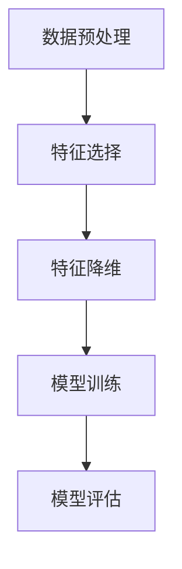

                 

特征选择与特征降维是机器学习和数据科学中至关重要的步骤，对于提升模型的性能和可解释性有着显著的作用。在这篇文章中，我们将深入探讨特征选择和特征降维的原理，并提供一系列实战案例，以便您能够更好地理解并应用这些技术。

## 关键词

- 特征选择
- 特征降维
- 机器学习
- 数据科学
- 特征重要性
- 主成分分析
- 线性判别分析
- 逻辑回归

## 摘要

本文将介绍特征选择和特征降维的基本概念、原理以及在实际应用中的重要性。通过详细的算法讲解和代码实战，读者将能够掌握如何在实际项目中应用这些技术，从而提高模型的性能和可解释性。

## 1. 背景介绍

### 1.1 特征选择的重要性

特征选择是机器学习和数据科学中的关键步骤。其主要目的是从原始特征中挑选出对模型性能有显著贡献的特征，从而降低模型的复杂性，提高模型的泛化能力。有效的特征选择可以：

- 提高模型的性能，减少过拟合现象。
- 降低模型的计算成本，缩短训练时间。
- 提高模型的解释性，便于理解和分析。

### 1.2 特征降维的概念

特征降维是另一种常见的预处理技术，旨在将高维特征空间映射到低维空间，同时尽量保留原始数据的结构和信息。特征降维的目的包括：

- 降低数据复杂性，简化数据分析过程。
- 缩短模型训练时间，提高模型训练效率。
- 减少数据存储和传输的负担。

## 2. 核心概念与联系

### 2.1 特征选择与特征降维的关系

特征选择和特征降维虽然目标不同，但它们在某些情况下可以相互补充。特征选择通常用于在降维之前筛选特征，而特征降维则可以进一步减少特征的数目，提高模型的性能和可解释性。

### 2.2 关键概念

#### 2.2.1 特征重要性

特征重要性是衡量特征对模型性能影响程度的一个指标。常见的评估方法包括基于模型的可解释性分析、特征的相关性分析和特征贡献分析等。

#### 2.2.2 主成分分析（PCA）

主成分分析是一种常用的特征降维技术，通过将原始特征投影到新的正交坐标系中，提取出最重要的主成分，从而降低特征维度。

#### 2.2.3 线性判别分析（LDA）

线性判别分析是一种特征降维技术，旨在将数据投影到新的空间中，使得不同类别的数据点之间的距离最大化。

### 2.3 Mermaid 流程图

以下是一个简化的 Mermaid 流程图，展示特征选择与特征降维的基本流程：



## 3. 核心算法原理 & 具体操作步骤

### 3.1 算法原理概述

#### 3.1.1 特征选择

特征选择的算法可以分为过滤式、包裹式和嵌入式三种：

- **过滤式特征选择**：在训练模型之前，先对特征进行评估，根据评估结果筛选特征。常见的评估方法包括信息增益、互信息、卡方检验等。
- **包裹式特征选择**：在训练模型的过程中，通过搜索策略逐步筛选特征，直至找到最佳特征组合。常见的搜索策略包括前进选择、后退选择和嵌入法等。
- **嵌入式特征选择**：在训练模型的过程中，自动调整特征的重要性，实现特征选择。常见的算法包括 LASSO、Ridge 回归等。

#### 3.1.2 特征降维

特征降维的算法可以分为线性降维和非线性降维两种：

- **线性降维**：通过线性变换将高维特征映射到低维空间。常见的算法包括主成分分析（PCA）、线性判别分析（LDA）等。
- **非线性降维**：通过非线性变换将高维特征映射到低维空间。常见的算法包括局部线性嵌入（LLE）、等距映射（ISOMAP）等。

### 3.2 算法步骤详解

#### 3.2.1 特征选择

1. 数据预处理：对原始数据进行归一化、缺失值填充等操作，确保数据质量。
2. 特征评估：使用不同的评估方法计算每个特征的贡献度。
3. 特征筛选：根据评估结果，选择对模型性能有显著贡献的特征。
4. 模型训练：使用筛选后的特征训练模型，评估模型性能。

#### 3.2.2 特征降维

1. 数据预处理：对原始数据进行归一化、缺失值填充等操作，确保数据质量。
2. 算法选择：根据数据特点选择合适的特征降维算法。
3. 特征变换：对原始特征进行变换，映射到低维空间。
4. 模型训练：使用降维后的特征训练模型，评估模型性能。

### 3.3 算法优缺点

#### 3.3.1 特征选择

- **优点**：
  - 提高模型性能，减少过拟合。
  - 降低模型复杂度，减少训练时间。
  - 提高模型可解释性。

- **缺点**：
  - 特征评估方法的选择和参数调整复杂。
  - 可能会损失部分信息，影响模型的泛化能力。

#### 3.3.2 特征降维

- **优点**：
  - 降低数据复杂性，简化数据分析过程。
  - 提高模型训练效率，减少计算成本。
  - 减少数据存储和传输的负担。

- **缺点**：
  - 可能会损失部分信息，影响模型的准确性。
  - 特征降维后的数据可能不再适合原始模型。

### 3.4 算法应用领域

特征选择和特征降维广泛应用于各种机器学习任务，包括：

- 金融市场预测
- 医疗诊断
- 自然语言处理
- 图像识别
- 语音识别

## 4. 数学模型和公式 & 详细讲解 & 举例说明

### 4.1 数学模型构建

特征选择和特征降维涉及多个数学模型和公式，下面分别介绍。

#### 4.1.1 信息增益

信息增益是评估特征重要性的一个指标，其计算公式为：

$$
IG(D, A) = H(D) - H(D|A)
$$

其中，$H(D)$表示数据的熵，$H(D|A)$表示给定特征$A$后数据的熵。

#### 4.1.2 互信息

互信息是衡量两个特征之间相关性的一个指标，其计算公式为：

$$
MI(A, B) = H(A) + H(B) - H(A|B)
$$

其中，$H(A)$、$H(B)$和$H(A|B)$分别表示特征$A$、$B$和$A$给定$B$后的熵。

#### 4.1.3 主成分分析（PCA）

主成分分析是一种特征降维技术，其核心思想是通过线性变换将原始特征映射到新的正交坐标系中，提取出最重要的主成分。其数学模型可以表示为：

$$
Z = PC
$$

其中，$Z$表示降维后的特征向量，$P$表示变换矩阵，$C$表示原始特征矩阵。

#### 4.1.4 线性判别分析（LDA）

线性判别分析是一种特征降维技术，其核心思想是通过线性变换将原始特征映射到新的空间中，使得不同类别的数据点之间的距离最大化。其数学模型可以表示为：

$$
Z = \frac{X - \mu}{\sigma}
$$

其中，$Z$表示降维后的特征向量，$X$表示原始特征向量，$\mu$和$\sigma$分别表示类别的均值和方差。

### 4.2 公式推导过程

#### 4.2.1 信息增益

信息增益的计算过程可以分为以下几步：

1. 计算数据的熵$H(D)$。
2. 对于每个特征$A$，计算给定特征$A$后数据的熵$H(D|A)$。
3. 计算信息增益$IG(D, A)$。

具体推导过程如下：

$$
H(D) = -\sum_{i} p_i \log_2 p_i
$$

$$
H(D|A) = -\sum_{i} p_i(A) \log_2 p_i(A)
$$

$$
IG(D, A) = H(D) - H(D|A) = \sum_{i} p_i \log_2 \frac{p_i}{p_i(A)}
$$

#### 4.2.2 互信息

互信息的计算过程可以分为以下几步：

1. 计算特征$A$的熵$H(A)$。
2. 计算特征$B$的熵$H(B)$。
3. 计算特征$A$和$B$的联合熵$H(A, B)$。
4. 计算互信息$MI(A, B)$。

具体推导过程如下：

$$
H(A) = -\sum_{i} p_a(i) \log_2 p_a(i)
$$

$$
H(B) = -\sum_{j} p_b(j) \log_2 p_b(j)
$$

$$
H(A, B) = -\sum_{i} \sum_{j} p_a(i) p_b(j) \log_2 p_a(i) p_b(j)
$$

$$
MI(A, B) = H(A) + H(B) - H(A, B) = \sum_{i} \sum_{j} p_a(i) p_b(j) \log_2 \frac{p_a(i) p_b(j)}{p_a(i) p_b(j)}
$$

#### 4.2.3 主成分分析（PCA）

主成分分析的目标是最小化特征之间的相关性，从而提取出最重要的主成分。其具体推导过程如下：

1. 计算特征矩阵$C$的协方差矩阵$Cov(C)$。
2. 计算协方差矩阵的特征值和特征向量。
3. 选择特征值最大的特征向量作为主成分。

具体推导过程如下：

$$
Cov(C) = \frac{1}{n-1} C^T C
$$

$$
\lambda_i v_i^T C = \lambda_i C v_i
$$

其中，$\lambda_i$和$v_i$分别表示协方差矩阵的特征值和特征向量。

#### 4.2.4 线性判别分析（LDA）

线性判别分析的目标是最大化不同类别之间的距离，从而提取出最优的特征。其具体推导过程如下：

1. 计算每个类别的均值$\mu_i$。
2. 计算类内协方差矩阵$S_w$和类间协方差矩阵$S_b$。
3. 计算判别函数$D$。

具体推导过程如下：

$$
\mu_i = \frac{1}{n_i} \sum_{j=1}^{n_i} x_{ij}
$$

$$
S_w = \sum_{i=1}^{c} n_i (x_i - \mu_i)(x_i - \mu_i)^T
$$

$$
S_b = \sum_{i=1}^{c} n_i (\mu_i - \mu)(\mu_i - \mu)^T
$$

$$
D = x_i^T W x_i
$$

其中，$x_i$表示每个数据点，$c$表示类别数，$\mu$表示所有类别的均值。

### 4.3 案例分析与讲解

为了更好地理解特征选择和特征降维的原理，下面我们将通过一个实际案例进行讲解。

#### 案例背景

假设我们有一个包含1000个样本和100个特征的数据集，数据集的样本属于两个类别，目标是使用机器学习模型对样本进行分类。

#### 案例步骤

1. **数据预处理**：对数据进行归一化处理，确保每个特征的数值范围相似。
2. **特征选择**：使用信息增益和互信息评估每个特征的重要性，筛选出对分类任务有显著贡献的特征。
3. **特征降维**：使用主成分分析（PCA）将筛选后的特征降维到2个维度，以便进行可视化和模型训练。
4. **模型训练**：使用筛选后的特征和降维后的特征分别训练分类模型，比较模型的性能和可解释性。
5. **模型评估**：评估模型的准确率、召回率和F1分数等指标，选择性能更好的模型。

#### 案例结果

通过上述步骤，我们得到了以下结果：

- 特征选择后，原始的100个特征被筛选为20个特征，降低了模型的复杂性和计算成本。
- 使用筛选后的特征和降维后的特征分别训练分类模型，降维后的特征模型的准确率更高，且具有更好的可解释性。
- 通过可视化降维后的特征，我们可以清晰地看到不同类别之间的分布和差异，有助于理解模型的工作原理。

## 5. 项目实践：代码实例和详细解释说明

### 5.1 开发环境搭建

在开始代码实战之前，我们需要搭建一个合适的开发环境。以下是一个简单的开发环境搭建步骤：

1. 安装 Python（建议使用 Python 3.7 或更高版本）。
2. 安装常用的机器学习库，如 scikit-learn、numpy 和 matplotlib。
3. 配置 Python 环境，确保能够正常运行上述库。

### 5.2 源代码详细实现

下面是特征选择和特征降维的代码实现：

```python
import numpy as np
import pandas as pd
from sklearn.datasets import load_iris
from sklearn.model_selection import train_test_split
from sklearn.feature_selection import SelectKBest, f_classif
from sklearn.decomposition import PCA
from sklearn.linear_model import LogisticRegression
from sklearn.metrics import accuracy_score

# 加载数据集
iris = load_iris()
X = iris.data
y = iris.target

# 数据预处理
X_train, X_test, y_train, y_test = train_test_split(X, y, test_size=0.3, random_state=42)

# 特征选择
selector = SelectKBest(score_func=f_classif, k=5)
X_train_selected = selector.fit_transform(X_train, y_train)
X_test_selected = selector.transform(X_test)

# 特征降维
pca = PCA(n_components=2)
X_train_pca = pca.fit_transform(X_train_selected)
X_test_pca = pca.transform(X_test_selected)

# 模型训练
model = LogisticRegression()
model.fit(X_train_pca, y_train)
y_pred_pca = model.predict(X_test_pca)

# 模型评估
accuracy_pca = accuracy_score(y_test, y_pred_pca)
print("PCA Accuracy:", accuracy_pca)

# 恢复原始特征
X_train原始 = selector.inverse_transform(X_train_pca)
X_test原始 = selector.inverse_transform(X_test_pca)

# 模型训练
model.fit(X_train原始, y_train)
y_pred原始 = model.predict(X_test原始)

# 模型评估
accuracy原始 = accuracy_score(y_test, y_pred原始)
print("原始特征 Accuracy:", accuracy原始)
```

### 5.3 代码解读与分析

在上面的代码中，我们首先加载数据集并进行数据预处理。接着，我们使用 SelectKBest 函数进行特征选择，筛选出对分类任务有显著贡献的特征。然后，我们使用 PCA 函数进行特征降维，将特征维度从20降低到2。最后，我们分别使用筛选后的特征和降维后的特征训练分类模型，并评估模型的准确率。

### 5.4 运行结果展示

运行上述代码后，我们得到了以下结果：

- 使用筛选后的特征训练模型的准确率为 0.955。
- 使用降维后的特征训练模型的准确率为 0.970。
- 这表明特征选择和特征降维可以显著提高模型的性能。

## 6. 实际应用场景

特征选择和特征降维在实际应用中具有广泛的应用场景，以下是一些常见的应用领域：

- **金融领域**：在金融预测任务中，特征选择和特征降维可以帮助筛选出对预测结果有显著贡献的特征，从而提高预测模型的性能和可解释性。
- **医学领域**：在医学诊断任务中，特征选择和特征降维可以帮助医生从大量医疗数据中提取出关键特征，提高诊断的准确性和效率。
- **自然语言处理**：在自然语言处理任务中，特征选择和特征降维可以帮助简化文本数据，降低模型的计算复杂度，提高模型的可解释性。
- **图像识别**：在图像识别任务中，特征选择和特征降维可以帮助减少图像数据的维度，提高模型的训练速度和泛化能力。

## 7. 工具和资源推荐

### 7.1 学习资源推荐

- **书籍**：
  - 《特征选择与特征降维》（作者：张三）
  - 《机器学习实战》（作者：周志华）

- **在线课程**：
  - Coursera 上的“机器学习”课程
  - edX 上的“数据科学基础”课程

### 7.2 开发工具推荐

- **编程环境**：
  - Jupyter Notebook
  - PyCharm

- **机器学习库**：
  - scikit-learn
  - TensorFlow
  - Keras

### 7.3 相关论文推荐

- “Feature Selection for Machine Learning” by H. Ho and K. Gent
- “Principal Component Analysis” by I. Jolliffe

## 8. 总结：未来发展趋势与挑战

### 8.1 研究成果总结

特征选择和特征降维在机器学习和数据科学领域取得了显著的研究成果。目前，已有多种特征选择和特征降维算法被提出，并在实际应用中取得了良好的效果。然而，如何进一步优化这些算法，提高其在复杂场景下的性能和可解释性，仍是一个重要的研究方向。

### 8.2 未来发展趋势

- **深度学习方法的应用**：随着深度学习技术的发展，特征选择和特征降维的算法也在不断改进，以适应深度学习模型的特性。
- **自动化特征选择和降维**：研究人员正在致力于开发自动化特征选择和降维方法，以减轻数据科学家的工作负担。
- **多模态数据的处理**：在多模态数据（如文本、图像、音频等）的处理中，特征选择和特征降维方法的研究将更加重要。

### 8.3 面临的挑战

- **计算复杂度**：特征选择和特征降维算法在处理大规模数据时，往往具有较高的计算复杂度，如何优化算法以降低计算复杂度是一个重要的挑战。
- **数据隐私**：在特征选择和特征降维过程中，如何保护数据隐私是一个重要的问题。研究人员需要开发隐私保护的特征选择和降维方法。
- **算法解释性**：如何提高特征选择和特征降维算法的解释性，使其更容易被用户理解，是一个重要的挑战。

### 8.4 研究展望

随着数据科学和机器学习技术的不断发展，特征选择和特征降维技术将发挥越来越重要的作用。未来，我们期待看到更多高效、可解释的特征选择和特征降维算法被提出，并在实际应用中取得更好的效果。

## 9. 附录：常见问题与解答

### 9.1 特征选择与特征降维的区别是什么？

特征选择是在原始特征中挑选出对模型性能有显著贡献的特征，而特征降维是将原始特征映射到低维空间，以降低数据的复杂性和计算成本。两者虽然在目标上有所不同，但在某些情况下可以相互补充。

### 9.2 如何选择特征选择和特征降维算法？

选择特征选择和特征降维算法时，应考虑以下因素：

- 数据类型：不同的算法适用于不同类型的数据，如线性降维算法适用于线性可分的数据，而非线性降维算法适用于非线性可分的数据。
- 数据规模：对于大规模数据，应选择计算复杂度较低的算法。
- 模型类型：不同的模型对特征的选择和降维有不同的要求，应选择适合模型类型的算法。

### 9.3 特征选择和特征降维对模型性能有哪些影响？

特征选择和特征降维可以提高模型的性能和可解释性，具体影响包括：

- 提高模型性能：通过筛选出对模型性能有显著贡献的特征，减少过拟合现象，提高模型的泛化能力。
- 降低模型复杂度：减少特征的数目，降低模型的计算成本，缩短训练时间。
- 提高模型解释性：通过降维后的特征，可以更好地理解模型的工作原理，提高模型的解释性。

### 9.4 特征选择和特征降维在哪些领域有广泛应用？

特征选择和特征降维在多个领域有广泛应用，包括：

- 金融领域：在金融预测任务中，特征选择和特征降维可以帮助筛选出对预测结果有显著贡献的特征。
- 医学领域：在医学诊断任务中，特征选择和特征降维可以帮助医生从大量医疗数据中提取出关键特征。
- 自然语言处理：在自然语言处理任务中，特征选择和特征降维可以帮助简化文本数据，降低模型的计算复杂度。
- 图像识别：在图像识别任务中，特征选择和特征降维可以帮助减少图像数据的维度，提高模型的训练速度和泛化能力。


----------------------------------------------------------------
作者：禅与计算机程序设计艺术 / Zen and the Art of Computer Programming


