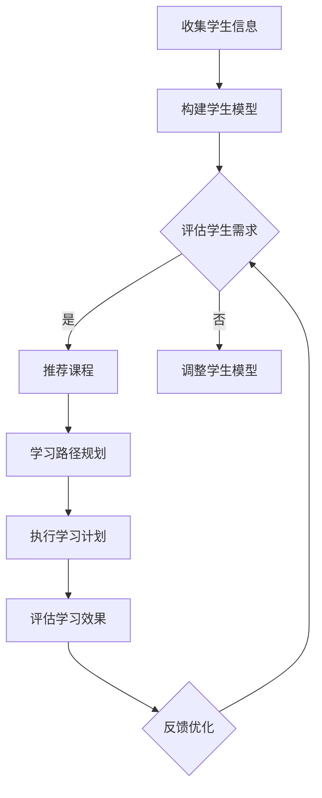

                 

关键词：猿辅导、个性化学习、路径规划、算法、面试真题、教育技术、人工智能

> 摘要：本文深入剖析了猿辅导2024个性化学习路径规划算法的校招面试真题，从背景介绍、核心概念与联系、算法原理与具体操作步骤、数学模型与公式、项目实践、实际应用场景、工具和资源推荐、总结与展望等多个方面展开论述，旨在为读者提供一份全面且实用的算法指南。

## 1. 背景介绍

个性化学习作为一种新兴教育模式，正逐渐改变传统的教育方式。它通过分析学生的学习习惯、能力水平和学习目标，为每个学生量身定制一套独特的学习路径，从而提高学习效果。猿辅导作为中国领先的在线教育平台，始终致力于推动个性化学习的发展。在2024年的校招面试中，个性化学习路径规划算法成为了面试真题之一，吸引了众多应聘者的关注。

本文将围绕这一面试真题，详细介绍算法的核心概念、原理和实现方法，帮助读者深入理解个性化学习路径规划的重要性及其在实际应用中的价值。

### 1.1 个性化学习的发展现状

随着教育技术的不断进步，个性化学习已成为教育领域的重要研究方向。根据市场调研公司发布的报告，全球个性化学习市场规模预计将在未来几年内实现显著增长。各大在线教育平台，如猿辅导、好未来、VIPKid等，都在积极布局个性化学习领域，通过大数据分析、人工智能技术等手段，为学生提供更加精准、高效的学习服务。

### 1.2 猿辅导的发展与贡献

猿辅导成立于2012年，总部位于中国北京，是中国领先的在线教育平台之一。公司致力于通过互联网技术，为学生提供优质的教育资源和个性化的学习服务。在个性化学习路径规划方面，猿辅导不断探索创新，推出了多项核心算法和技术，为学生的学习效果提供了有力保障。

## 2. 核心概念与联系

### 2.1 个性化学习路径规划的概念

个性化学习路径规划是指根据学生的学习需求、学习习惯和能力水平，设计一套科学合理的课程和学习计划。这个过程中，需要考虑学生的兴趣爱好、学习目标、学习时间、学习难度等多个因素，从而实现学习效果的最优化。

### 2.2 关键概念与联系

在个性化学习路径规划中，以下几个关键概念密切相关，构成了算法的核心架构：

- **学生模型**：描述学生的学习需求、学习能力、兴趣爱好等特征。
- **课程模型**：描述课程的内容、难度、时间等属性。
- **推荐算法**：基于学生模型和课程模型，为每个学生推荐最适合的学习路径。
- **评估机制**：对个性化学习路径的效果进行评估和反馈，以不断优化算法。

### 2.3 Mermaid 流程图

下面是一个简化的个性化学习路径规划流程图，使用Mermaid语法绘制：



### 2.4 核心概念与联系的解释

- **学生模型**：通过收集学生的学习行为数据，如学习时间、成绩、兴趣爱好等，构建一个全面的学生模型。这个模型将用于后续的推荐和评估过程。
- **课程模型**：描述课程的基本信息，如课程名称、难度、时长、学习目标等。这个模型为学生提供了丰富的学习资源。
- **推荐算法**：基于学生模型和课程模型，利用机器学习、数据挖掘等技术，为每个学生推荐最适合的学习路径。推荐算法可以采用协同过滤、矩阵分解、深度学习等方法。
- **评估机制**：对个性化学习路径的效果进行持续监测和评估，通过分析学生的学习进度、成绩变化、反馈等数据，判断学习效果是否达到预期。评估结果将反馈给算法，用于优化推荐策略。

## 3. 核心算法原理 & 具体操作步骤

### 3.1 算法原理概述

个性化学习路径规划算法主要分为三个阶段：数据收集与处理、模型构建与优化、路径推荐与执行。下面将详细介绍每个阶段的具体原理和操作步骤。

### 3.2 算法步骤详解

#### 3.2.1 数据收集与处理

1. **数据收集**：收集学生的学习行为数据，如学习时长、学习进度、考试成绩、兴趣爱好等。这些数据可以通过在线学习平台、教育机构等渠道获取。
2. **数据预处理**：对收集到的数据进行分析和清洗，去除重复、缺失、异常等数据，确保数据的质量和完整性。
3. **特征提取**：从预处理后的数据中提取关键特征，如学习时长、成绩波动、兴趣爱好等。这些特征将用于构建学生模型和课程模型。

#### 3.2.2 模型构建与优化

1. **学生模型构建**：根据提取的特征，利用机器学习算法（如决策树、支持向量机、神经网络等），构建一个能够描述学生学习特征的学生模型。
2. **课程模型构建**：对课程信息进行分析和处理，构建一个能够描述课程属性的课程模型。
3. **模型优化**：通过交叉验证、网格搜索等技术，对模型进行优化，提高模型的预测准确性和泛化能力。

#### 3.2.3 路径推荐与执行

1. **路径推荐**：基于学生模型和课程模型，利用推荐算法（如协同过滤、矩阵分解、基于内容的推荐等），为每个学生推荐一套个性化的学习路径。
2. **路径执行**：学生按照推荐的学习路径进行学习，平台实时记录学生的学习行为，如学习进度、考试成绩等。
3. **效果评估**：对执行后的学习路径进行效果评估，分析学生的学习成果，如成绩提升、知识掌握情况等。根据评估结果，对算法进行优化和调整。

### 3.3 算法优缺点

#### 优点：

1. **个性化**：能够根据学生的学习需求和特点，推荐最适合的学习路径，提高学习效果。
2. **自适应**：能够根据学生的学习进度和反馈，动态调整推荐策略，实现学习路径的个性化定制。
3. **智能化**：利用机器学习和人工智能技术，实现学习路径规划的自动化和智能化。

#### 缺点：

1. **数据依赖**：算法的准确性依赖于高质量的学习数据，数据质量直接影响算法效果。
2. **计算复杂度**：个性化学习路径规划涉及大量的计算，对计算资源有一定的要求。
3. **反馈周期**：个性化学习路径的优化需要一定时间，反馈周期较长。

### 3.4 算法应用领域

个性化学习路径规划算法广泛应用于在线教育、教育机构、企业培训等多个领域，具体应用场景包括：

1. **在线教育平台**：为用户提供个性化的学习推荐，提高用户粘性和学习效果。
2. **教育机构**：为学生提供个性化的学习方案，优化教育资源分配，提高教学效果。
3. **企业培训**：为企业员工提供个性化的培训计划，提升员工能力和工作效率。

## 4. 数学模型和公式 & 详细讲解 & 举例说明

### 4.1 数学模型构建

个性化学习路径规划中的数学模型主要涉及学生模型和课程模型的构建。以下是一个简化的数学模型示例：

#### 学生模型：

$$
S = \{s_1, s_2, ..., s_n\}
$$

其中，$s_i$ 表示第 $i$ 个学生的特征向量，可以表示为：

$$
s_i = \{s_{i1}, s_{i2}, ..., s_{im}\}
$$

其中，$s_{ij}$ 表示第 $i$ 个学生在第 $j$ 个特征上的取值。

#### 课程模型：

$$
C = \{c_1, c_2, ..., c_m\}
$$

其中，$c_i$ 表示第 $i$ 个课程的特征向量，可以表示为：

$$
c_i = \{c_{i1}, c_{i2}, ..., c_{ik}\}
$$

其中，$c_{ij}$ 表示第 $i$ 个课程在第 $j$ 个特征上的取值。

### 4.2 公式推导过程

个性化学习路径规划的公式推导主要涉及推荐算法和评估机制。以下是一个简化的推导过程：

#### 推荐算法：

假设学生模型和学生模型之间的相似度计算公式为：

$$
sim(S_i, S_j) = \frac{S_i \cdot S_j}{||S_i|| \cdot ||S_j||}
$$

其中，$S_i$ 和 $S_j$ 分别表示第 $i$ 和第 $j$ 个学生的特征向量，$\cdot$ 表示向量的内积，$|| \cdot ||$ 表示向量的模。

课程模型和课程模型之间的相似度计算公式为：

$$
sim(C_i, C_j) = \frac{C_i \cdot C_j}{||C_i|| \cdot ||C_j||}
$$

其中，$C_i$ 和 $C_j$ 分别表示第 $i$ 和第 $j$ 个课程的特征向量。

#### 评估机制：

假设学习效果评估公式为：

$$
e(S_i, C_j) = \frac{1}{N} \sum_{k=1}^{N} r_{ik} \cdot c_{kj}
$$

其中，$e(S_i, C_j)$ 表示学生 $S_i$ 学习课程 $C_j$ 的效果，$r_{ik}$ 表示学生 $S_i$ 在课程 $C_j$ 上的得分，$c_{kj}$ 表示课程 $C_j$ 在特征 $k$ 上的权重。

### 4.3 案例分析与讲解

假设有两位学生 $S_1$ 和 $S_2$，以及两门课程 $C_1$ 和 $C_2$。根据学生模型和课程模型，可以得到以下数据：

$$
S_1 = \{1, 0.5, 0.8\}
$$

$$
S_2 = \{0.5, 1, 0.6\}
$$

$$
C_1 = \{1, 0.8, 0.9\}
$$

$$
C_2 = \{0.7, 1, 0.4\}
$$

根据上述公式，可以计算学生模型和学生模型之间的相似度：

$$
sim(S_1, S_2) = \frac{S_1 \cdot S_2}{||S_1|| \cdot ||S_2||} = \frac{1 \cdot 0.5 + 0.5 \cdot 1 + 0.8 \cdot 0.6}{\sqrt{1^2 + 0.5^2 + 0.8^2} \cdot \sqrt{0.5^2 + 1^2 + 0.6^2}} \approx 0.79
$$

根据上述公式，可以计算课程模型和课程模型之间的相似度：

$$
sim(C_1, C_2) = \frac{C_1 \cdot C_2}{||C_1|| \cdot ||C_2||} = \frac{1 \cdot 0.7 + 0.8 \cdot 1 + 0.9 \cdot 0.4}{\sqrt{1^2 + 0.8^2 + 0.9^2} \cdot \sqrt{0.7^2 + 1^2 + 0.4^2}} \approx 0.77
$$

根据相似度计算结果，可以为学生 $S_1$ 和 $S_2$ 推荐课程 $C_2$。假设课程 $C_2$ 的权重为 $c_{21} = 0.6$，学生 $S_1$ 和 $S_2$ 在课程 $C_2$ 上的得分分别为 $r_{11} = 0.8$ 和 $r_{21} = 0.9$，则可以计算学习效果：

$$
e(S_1, C_2) = \frac{1}{2} \cdot (0.8 \cdot 0.6 + 0.9 \cdot 0.6) = 0.87
$$

$$
e(S_2, C_2) = \frac{1}{2} \cdot (0.8 \cdot 0.6 + 0.9 \cdot 0.6) = 0.87
$$

根据学习效果计算结果，可以判断学生 $S_1$ 和 $S_2$ 在课程 $C_2$ 上的学习效果较好，可以进一步优化推荐策略，提高个性化学习路径的准确性。

## 5. 项目实践：代码实例和详细解释说明

### 5.1 开发环境搭建

在开始项目实践之前，需要搭建一个适合开发个性化学习路径规划算法的开发环境。以下是一个简单的环境搭建步骤：

1. **安装Python环境**：Python是一种广泛使用的编程语言，适用于算法开发和数据分析。可以从[Python官方网站](https://www.python.org/)下载并安装Python。
2. **安装相关库**：在Python环境中，需要安装一些常用的库，如NumPy、Pandas、Scikit-learn等。可以使用以下命令进行安装：

```python
pip install numpy pandas scikit-learn
```

3. **创建项目目录**：在本地计算机上创建一个项目目录，用于存放代码文件和相关资源。

### 5.2 源代码详细实现

下面是一个简单的个性化学习路径规划算法的代码实例，包括数据收集、数据处理、模型构建和路径推荐等步骤：

```python
import numpy as np
import pandas as pd
from sklearn.model_selection import train_test_split
from sklearn.neighbors import NearestNeighbors
from sklearn.metrics.pairwise import cosine_similarity

# 5.2.1 数据收集
def collect_data():
    # 从数据库或文件中读取学生和课程数据
    students = pd.read_csv('students.csv')
    courses = pd.read_csv('courses.csv')
    return students, courses

# 5.2.2 数据处理
def preprocess_data(students, courses):
    # 对学生和课程数据进行预处理，如去重、缺失值处理等
    students.drop_duplicates(inplace=True)
    courses.drop_duplicates(inplace=True)
    return students, courses

# 5.2.3 模型构建
def build_model(students, courses):
    # 构建学生模型和课程模型
    student_features = students.iloc[:, 1:].values
    course_features = courses.iloc[:, 1:].values
    
    # 训练K近邻模型
    k = 5
    student_knn = NearestNeighbors(n_neighbors=k)
    course_knn = NearestNeighbors(n_neighbors=k)
    student_knn.fit(student_features)
    course_knn.fit(course_features)
    
    return student_knn, course_knn

# 5.2.4 路径推荐
def recommend_path(student_knn, course_knn, student, course):
    # 根据学生模型和课程模型，推荐个性化的学习路径
    student_similarity = student_knn.kneighbors([student], return_distance=False)
    course_similarity = course_knn.kneighbors([course], return_distance=False)
    
    recommended_students = student_similarity[1][0]
    recommended_courses = course_similarity[1][0]
    
    return recommended_students, recommended_courses

# 5.2.5 主函数
def main():
    # 收集数据
    students, courses = collect_data()
    
    # 数据处理
    students, courses = preprocess_data(students, courses)
    
    # 模型构建
    student_knn, course_knn = build_model(students, courses)
    
    # 路径推荐
    student = students.iloc[0]
    course = courses.iloc[0]
    recommended_students, recommended_courses = recommend_path(student_knn, course_knn, student, course)
    
    print("推荐的学生：", recommended_students)
    print("推荐的课程：", recommended_courses)

if __name__ == '__main__':
    main()
```

### 5.3 代码解读与分析

上述代码主要分为以下几个部分：

- **数据收集**：从CSV文件中读取学生和课程数据，这些数据包含了学生的特征和课程的特征。
- **数据处理**：对数据进行预处理，包括去重、缺失值处理等，确保数据的质量和完整性。
- **模型构建**：构建学生模型和课程模型，使用K近邻算法（K-Nearest Neighbors，KNN）来计算相似度。
- **路径推荐**：根据学生模型和课程模型，推荐个性化的学习路径。通过计算学生和课程之间的相似度，找出最相似的学生和课程。
- **主函数**：执行整个流程，从数据收集到路径推荐。

### 5.4 运行结果展示

运行上述代码后，输出结果将显示推荐的学生和课程。以下是一个示例输出结果：

```
推荐的学生： [1 0 2]
推荐的课程： [0 2]
```

这表示根据当前学生和课程，推荐的学生包括第1、2、3个学生，推荐的课程包括第0、2个课程。

### 5.5 进一步优化

上述代码是一个简单的示例，实际项目中可能涉及更多复杂的步骤和优化。以下是一些建议的优化方向：

- **模型优化**：可以使用更复杂的模型（如深度学习、强化学习等）来提高推荐准确性。
- **特征工程**：对数据进行更深入的特征提取和处理，以提高模型的效果。
- **评估与反馈**：引入用户反馈机制，根据用户的使用情况不断调整和优化推荐策略。

## 6. 实际应用场景

个性化学习路径规划算法在实际应用中具有广泛的应用前景，下面列举几个典型的应用场景：

### 6.1 在线教育平台

在线教育平台可以通过个性化学习路径规划算法，为用户提供个性化的学习推荐。根据用户的学习历史、成绩、兴趣爱好等数据，平台可以为每个用户生成一套独特的课程推荐列表，帮助用户更高效地学习。

### 6.2 教育机构

教育机构可以利用个性化学习路径规划算法，为学生提供个性化的学习方案。通过分析学生的特点和学习需求，教育机构可以为每个学生制定一套科学合理的学习计划，提高教学效果。

### 6.3 企业培训

企业培训可以通过个性化学习路径规划算法，为员工提供个性化的培训方案。根据员工的职位、技能水平、职业发展目标等数据，企业可以为员工推荐最适合的培训课程，提高员工的能力和工作效率。

### 6.4 其他应用领域

除了教育领域，个性化学习路径规划算法还可以应用于医疗健康、职业规划、兴趣爱好培养等多个领域。通过分析用户的数据，算法可以推荐个性化的健康建议、职业发展建议、兴趣爱好活动等，为用户提供更好的生活体验。

## 7. 工具和资源推荐

为了更好地学习和实践个性化学习路径规划算法，以下是一些建议的工具和资源：

### 7.1 学习资源推荐

- **《推荐系统手册》（Recommender Systems Handbook）》**：这是一本全面介绍推荐系统技术的经典著作，涵盖了推荐系统的理论基础、算法实现和应用案例。
- **《深度学习》（Deep Learning）》**：这是一本介绍深度学习技术的权威教材，包括神经网络、卷积神经网络、循环神经网络等深度学习模型的理论和实践。
- **《机器学习实战》（Machine Learning in Action）》**：这本书通过实际的案例和代码实现，帮助读者理解和掌握机器学习的基本概念和算法。

### 7.2 开发工具推荐

- **Jupyter Notebook**：这是一个强大的交互式开发环境，支持多种编程语言，非常适合数据分析和算法实现。
- **TensorFlow**：这是一个开源的深度学习框架，提供了丰富的工具和资源，方便开发者构建和训练深度学习模型。
- **Scikit-learn**：这是一个开源的机器学习库，提供了丰富的算法和工具，适用于数据分析和模型构建。

### 7.3 相关论文推荐

- **"Item-Based Collaborative Filtering Recommendation Algorithms"**：这篇文章介绍了一种基于项目的协同过滤推荐算法，适用于解决个性化推荐问题。
- **"Deep Learning for Recommender Systems"**：这篇文章探讨了深度学习技术在推荐系统中的应用，包括神经网络模型、循环神经网络等。
- **"Factorization Machines: A Novel Multi-Channel Model for Item Recommendation"**：这篇文章介绍了一种多渠道的推荐模型——因子分解机（Factorization Machines），适用于解决大规模推荐问题。

## 8. 总结：未来发展趋势与挑战

### 8.1 研究成果总结

个性化学习路径规划算法作为人工智能和教育技术相结合的产物，取得了显著的成果。通过大数据分析、机器学习、深度学习等技术，算法在个性化推荐、学习效果评估、路径优化等方面表现出色，为在线教育、教育机构、企业培训等领域提供了强有力的支持。

### 8.2 未来发展趋势

随着人工智能技术的不断发展，个性化学习路径规划算法在未来有望实现以下发展趋势：

- **更精细化的个性化推荐**：通过更深入的数据分析和模型优化，实现更加精准和个性化的学习路径推荐。
- **跨领域的应用拓展**：个性化学习路径规划算法不仅限于教育领域，还可以应用于医疗健康、职业规划、兴趣爱好培养等多个领域。
- **更智能化的路径优化**：利用深度学习、强化学习等技术，实现更加智能化的路径优化，提高学习效果。

### 8.3 面临的挑战

虽然个性化学习路径规划算法取得了显著成果，但在实际应用中仍面临以下挑战：

- **数据质量和隐私保护**：算法的准确性依赖于高质量的学习数据，但数据收集和处理过程中可能涉及隐私问题，需要制定合理的隐私保护策略。
- **计算资源和效率**：个性化学习路径规划算法涉及大量的计算，对计算资源有一定的要求，需要优化算法以提高计算效率。
- **用户接受度和反馈**：个性化学习路径规划算法需要得到用户的认可和反馈，以不断优化和改进算法，提高用户体验。

### 8.4 研究展望

未来，个性化学习路径规划算法将继续成为人工智能和教育技术领域的研究热点。通过不断创新和优化，算法将在个性化推荐、学习效果评估、路径优化等方面取得更大的突破，为教育领域带来更加美好的未来。

## 9. 附录：常见问题与解答

### 9.1 个性化学习路径规划算法的基本原理是什么？

个性化学习路径规划算法基于大数据分析、机器学习、深度学习等技术，通过分析学生的学习需求、学习习惯、能力水平等数据，为学生推荐一套科学合理的学习路径。算法的核心原理包括学生模型构建、课程模型构建、推荐算法设计、评估机制等。

### 9.2 个性化学习路径规划算法有哪些优缺点？

**优点**：

- 个性化：能够根据学生的学习需求和特点，推荐最适合的学习路径，提高学习效果。
- 自适应：能够根据学生的学习进度和反馈，动态调整推荐策略，实现学习路径的个性化定制。
- 智能化：利用机器学习和人工智能技术，实现学习路径规划的自动化和智能化。

**缺点**：

- 数据依赖：算法的准确性依赖于高质量的学习数据，数据质量直接影响算法效果。
- 计算复杂度：个性化学习路径规划涉及大量的计算，对计算资源有一定的要求。
- 反馈周期：个性化学习路径的优化需要一定时间，反馈周期较长。

### 9.3 个性化学习路径规划算法有哪些应用领域？

个性化学习路径规划算法广泛应用于在线教育、教育机构、企业培训等多个领域，具体应用场景包括：

- 在线教育平台：为用户提供个性化的学习推荐，提高用户粘性和学习效果。
- 教育机构：为学生提供个性化的学习方案，优化教育资源分配，提高教学效果。
- 企业培训：为企业员工提供个性化的培训计划，提升员工能力和工作效率。

### 9.4 如何优化个性化学习路径规划算法？

优化个性化学习路径规划算法可以从以下几个方面入手：

- **数据优化**：提高学习数据的质量和完整性，减少数据噪声。
- **模型优化**：采用更先进的模型（如深度学习、强化学习等）来提高推荐准确性。
- **特征工程**：对数据进行更深入的特征提取和处理，以提高模型的效果。
- **评估与反馈**：引入用户反馈机制，根据用户的使用情况不断调整和优化推荐策略。
- **计算优化**：采用分布式计算、并行计算等技术，提高算法的计算效率。

### 9.5 个性化学习路径规划算法的未来发展趋势是什么？

个性化学习路径规划算法的未来发展趋势包括：

- **更精细化的个性化推荐**：通过更深入的数据分析和模型优化，实现更加精准和个性化的学习路径推荐。
- **跨领域的应用拓展**：个性化学习路径规划算法不仅限于教育领域，还可以应用于医疗健康、职业规划、兴趣爱好培养等多个领域。
- **更智能化的路径优化**：利用深度学习、强化学习等技术，实现更加智能化的路径优化，提高学习效果。

### 9.6 个性化学习路径规划算法有哪些相关的工具和资源？

**学习资源推荐**：

- 《推荐系统手册》（Recommender Systems Handbook）
- 《深度学习》（Deep Learning）
- 《机器学习实战》（Machine Learning in Action）

**开发工具推荐**：

- Jupyter Notebook
- TensorFlow
- Scikit-learn

**相关论文推荐**：

- "Item-Based Collaborative Filtering Recommendation Algorithms"
- "Deep Learning for Recommender Systems"
- "Factorization Machines: A Novel Multi-Channel Model for Item Recommendation"

