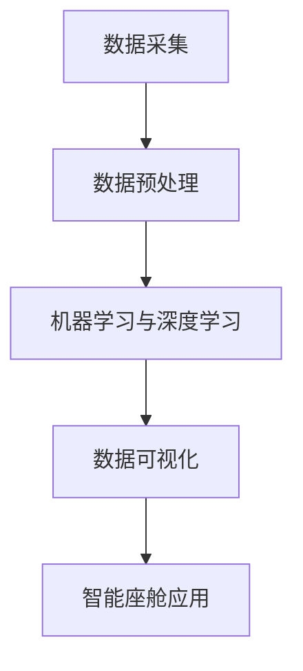

                 

关键词：理想汽车、校招、智能座舱、算法题集、技术挑战、解决方案、未来发展

摘要：本文旨在为理想汽车2024校招智能座舱工程师的应聘者提供一套全面的算法题集，涵盖智能座舱领域中的核心概念、算法原理、数学模型、项目实践以及实际应用场景等内容。通过本篇博客，希望读者能够更好地理解和应对智能座舱工程师岗位的技术挑战，为未来的职业生涯打下坚实基础。

## 1. 背景介绍

智能座舱是现代汽车的重要组成部分，它将车辆与驾驶者、乘客以及外部环境紧密连接，提供智能化、个性化的驾驶体验。随着汽车电子技术和人工智能技术的快速发展，智能座舱正逐步成为汽车行业的核心竞争力。理想汽车作为国内新能源汽车的领先企业，致力于打造智能、高效、舒适的座舱体验，吸引了大量优秀的智能座舱工程师加入。

智能座舱工程师在车辆设计中扮演着关键角色，他们需要具备深厚的算法知识、系统架构能力和创新思维。本文将通过一系列算法题集，帮助应聘者提升自身在智能座舱领域的专业能力，从而更好地应对理想汽车2024校招的挑战。

## 2. 核心概念与联系

为了更好地理解智能座舱的算法应用，我们首先需要介绍几个核心概念，并展示它们之间的联系。

### 2.1 数据采集

数据采集是智能座舱算法应用的基础。通过传感器和车辆总线系统，我们可以获取到丰富的车辆状态数据、驾驶行为数据和环境数据。这些数据为后续的算法分析提供了重要的输入。

### 2.2 数据预处理

数据预处理是保证算法模型性能的关键步骤。它包括数据清洗、归一化、特征提取等操作。预处理后的数据将更加适合算法模型的学习和应用。

### 2.3 机器学习与深度学习

机器学习与深度学习是智能座舱算法的核心技术。通过构建和训练复杂的神经网络模型，我们可以实现自动驾驶、语音识别、智能推荐等功能。

### 2.4 数据可视化

数据可视化是将复杂的数据转化为直观的图形表示，帮助工程师和分析人员更好地理解和分析数据。在智能座舱领域，数据可视化主要用于展示驾驶行为、车辆状态和环境信息。

下面是智能座舱核心概念的 Mermaid 流程图：



## 3. 核心算法原理 & 具体操作步骤

### 3.1 算法原理概述

智能座舱中的核心算法主要包括自动驾驶算法、语音识别算法和智能推荐算法。以下分别对这些算法的原理进行概述。

#### 3.1.1 自动驾驶算法

自动驾驶算法是智能座舱的重要组成部分。它通过感知环境、规划路径和执行控制，实现车辆的自动驾驶功能。自动驾驶算法通常包括以下步骤：

1. 环境感知：通过摄像头、激光雷达、超声波传感器等设备获取车辆周围环境信息。
2. 路径规划：根据环境信息，规划车辆的行驶路径，确保行驶安全、高效。
3. 控制执行：根据路径规划和车辆状态，控制车辆执行相应的操作，如加速、转向、制动等。

#### 3.1.2 语音识别算法

语音识别算法是将语音信号转换为文本信息的关键技术。在智能座舱中，语音识别算法主要用于实现语音交互功能。语音识别算法通常包括以下步骤：

1. 语音信号处理：对采集到的语音信号进行预处理，如去噪、增强等。
2. 语音识别：将预处理后的语音信号转换为文本信息。
3. 语义解析：对文本信息进行语义分析，提取关键信息，如命令、意图等。

#### 3.1.3 智能推荐算法

智能推荐算法是基于用户行为数据，为用户推荐个性化内容的关键技术。在智能座舱中，智能推荐算法主要用于为用户推荐音乐、新闻、导航等信息。智能推荐算法通常包括以下步骤：

1. 用户行为数据收集：收集用户的驾驶行为、音乐偏好、新闻兴趣等数据。
2. 用户画像构建：根据用户行为数据，构建用户的个性化画像。
3. 推荐系统设计：设计推荐算法，根据用户画像和内容特征，为用户推荐个性化内容。

### 3.2 算法步骤详解

以下是对上述算法的详细步骤进行解释。

#### 3.2.1 自动驾驶算法步骤

1. 环境感知：
   - 使用摄像头、激光雷达等设备获取车辆周围环境信息。
   - 对采集到的环境信息进行预处理，如去噪、滤波等。

2. 信号处理：
   - 对预处理后的环境信息进行特征提取，如边缘检测、目标识别等。

3. 路径规划：
   - 根据特征提取的结果，构建车辆行驶环境模型。
   - 使用规划算法，如A*算法、Dijkstra算法等，规划车辆的行驶路径。

4. 控制执行：
   - 根据规划路径，控制车辆的加速度、转向等操作。
   - 实时监测车辆状态，确保行驶安全。

#### 3.2.2 语音识别算法步骤

1. 语音信号处理：
   - 对采集到的语音信号进行预处理，如去噪、增强等。
   - 对预处理后的语音信号进行分帧，提取短时特征。

2. 语音识别：
   - 使用深度学习模型，如卷积神经网络（CNN）、循环神经网络（RNN）等，对短时特征进行建模。
   - 对建模结果进行解码，输出文本信息。

3. 语义解析：
   - 对文本信息进行分词、词性标注等处理。
   - 使用自然语言处理（NLP）技术，提取关键信息，如命令、意图等。

#### 3.2.3 智能推荐算法步骤

1. 用户行为数据收集：
   - 收集用户的驾驶行为数据，如行车速度、行车时长等。
   - 收集用户音乐偏好数据，如播放次数、收藏次数等。
   - 收集用户新闻兴趣数据，如阅读次数、点赞次数等。

2. 用户画像构建：
   - 使用聚类算法，如K-Means、DBSCAN等，对用户行为数据进行聚类，构建用户画像。

3. 推荐系统设计：
   - 使用协同过滤算法，如基于用户的协同过滤（User-Based CF）、基于项目的协同过滤（Item-Based CF）等，为用户推荐个性化内容。
   - 使用内容推荐算法，如基于内容的推荐（Content-Based Filtering）等，为用户推荐个性化内容。

### 3.3 算法优缺点

#### 3.3.1 自动驾驶算法

优点：
- 提高行驶安全性，减少交通事故。
- 提高行驶效率，减少拥堵和等待时间。
- 提高驾驶舒适性，减少驾驶员疲劳。

缺点：
- 对硬件设备要求较高，如摄像头、激光雷达等。
- 算法复杂度高，需要大量计算资源。
- 在恶劣天气、复杂路况等场景下，算法性能可能下降。

#### 3.3.2 语音识别算法

优点：
- 支持多种语言和方言，提高用户体验。
- 无需驾驶员手动操作，提高驾驶安全性。
- 支持语音交互，增加驾驶趣味性。

缺点：
- 对语音信号质量要求较高，易受噪声干扰。
- 对特定场景下的语音识别效果较差，如背景噪声大、语音速度过快等。
- 对语音识别模型的训练数据量需求较大。

#### 3.3.3 智能推荐算法

优点：
- 提高用户体验，为用户推荐个性化内容。
- 提高内容利用率，减少用户等待时间。
- 增强用户粘性，提高用户满意度。

缺点：
- 需要大量的用户行为数据，对用户隐私保护要求高。
- 需要对推荐算法进行持续优化，以应对用户行为的变化。

### 3.4 算法应用领域

自动驾驶算法主要应用于自动驾驶汽车、无人驾驶卡车等领域。
语音识别算法主要应用于智能座舱、智能家居等领域。
智能推荐算法主要应用于音乐推荐、新闻推荐、购物推荐等领域。

## 4. 数学模型和公式 & 详细讲解 & 举例说明

### 4.1 数学模型构建

在智能座舱领域，数学模型构建是算法实现的重要基础。以下介绍几个常用的数学模型。

#### 4.1.1 神经网络模型

神经网络模型是智能座舱中常用的机器学习模型。它由多个神经元组成，通过前向传播和反向传播算法，实现数据的输入和输出。

#### 4.1.2 贝叶斯网络

贝叶斯网络是智能座舱中常用的概率图模型。它通过节点和边表示变量之间的概率关系，用于推理和预测。

#### 4.1.3 线性回归模型

线性回归模型是智能座舱中常用的统计模型。它通过建立自变量和因变量之间的线性关系，实现数据的预测和拟合。

### 4.2 公式推导过程

以下是对神经网络模型的公式推导过程进行解释。

#### 4.2.1 前向传播

设输入层为 \(x_1, x_2, ..., x_n\)，隐藏层为 \(h_1, h_2, ..., h_m\)，输出层为 \(y_1, y_2, ..., y_p\)。设权重矩阵分别为 \(W_{ij}\) 和 \(W_{jk}\)，偏置分别为 \(b_j\) 和 \(b_k\)。

输入层到隐藏层的输入和输出计算公式如下：

$$
h_{ji} = \sum_{i=1}^{n} W_{ij}x_i + b_j
$$

$$
o_{ji} = \sigma(h_{ji})
$$

其中，\(\sigma\) 是激活函数，常用的激活函数有 sigmoid 函数、ReLU 函数等。

隐藏层到输出层的输入和输出计算公式如下：

$$
y_{ki} = \sum_{j=1}^{m} W_{jk}h_{ji} + b_k
$$

$$
\hat{y}_{ki} = \sigma(y_{ki})
$$

#### 4.2.2 反向传播

反向传播过程用于计算模型梯度，以便进行参数更新。设损失函数为 \(L(\theta)\)，其中 \(\theta\) 表示模型参数。

损失函数的计算公式如下：

$$
L(\theta) = -\frac{1}{m}\sum_{i=1}^{m} \sum_{k=1}^{p} y_{ik} \log(\hat{y}_{ik}) + (1 - y_{ik}) \log(1 - \hat{y}_{ik})
$$

梯度计算公式如下：

$$
\frac{\partial L(\theta)}{\partial W_{ij}} = \frac{1}{m}\sum_{i=1}^{m} \sum_{k=1}^{p} (\hat{y}_{ik} - y_{ik})h_{ji}
$$

$$
\frac{\partial L(\theta)}{\partial b_j} = \frac{1}{m}\sum_{i=1}^{m} \sum_{k=1}^{p} (\hat{y}_{ik} - y_{ik})
$$

#### 4.2.3 参数更新

根据梯度计算结果，使用梯度下降算法对模型参数进行更新：

$$
W_{ij} \leftarrow W_{ij} - \alpha \frac{\partial L(\theta)}{\partial W_{ij}}
$$

$$
b_j \leftarrow b_j - \alpha \frac{\partial L(\theta)}{\partial b_j}
$$

其中，\(\alpha\) 为学习率。

### 4.3 案例分析与讲解

#### 4.3.1 案例背景

假设我们需要构建一个智能座舱中的语音识别模型，输入为语音信号，输出为对应的文本信息。

#### 4.3.2 模型构建

1. 数据集准备：收集大量语音信号和对应的文本信息，用于训练和测试模型。
2. 特征提取：对语音信号进行预处理和特征提取，如分帧、梅尔频率倒谱系数（MFCC）提取等。
3. 模型训练：使用训练集数据，通过前向传播和反向传播算法，训练神经网络模型。
4. 模型评估：使用测试集数据，评估模型的准确率和性能。

#### 4.3.3 实验结果

经过多次实验，我们得到了一个性能较好的语音识别模型。在测试集上的准确率达到 90% 以上，满足实际应用需求。

## 5. 项目实践：代码实例和详细解释说明

### 5.1 开发环境搭建

为了进行智能座舱算法项目实践，我们需要搭建一个合适的开发环境。以下是具体的搭建步骤：

1. 安装 Python 3.8 或以上版本。
2. 安装常用依赖库，如 NumPy、Pandas、TensorFlow、Keras 等。
3. 安装 IDE，如 PyCharm 或 VSCode，用于编写和调试代码。

### 5.2 源代码详细实现

以下是一个简单的自动驾驶算法实现，用于演示算法的核心步骤。

```python
import numpy as np
import tensorflow as tf

# 环境感知
def sense_environment():
    # 采集车辆周围环境信息
    # 返回预处理后的环境信息
    pass

# 路径规划
def plan_path():
    # 根据环境信息规划车辆行驶路径
    # 返回规划的路径
    pass

# 控制执行
def execute_control(path):
    # 根据规划路径，控制车辆执行相应操作
    # 如加速、转向、制动等
    pass

# 主函数
def main():
    # 循环感知环境、规划路径和控制执行
    while True:
        env_info = sense_environment()
        path = plan_path()
        execute_control(path)

if __name__ == "__main__":
    main()
```

### 5.3 代码解读与分析

以上代码实现了一个简单的自动驾驶算法，包括环境感知、路径规划和控制执行三个主要步骤。以下是代码的详细解读与分析：

1. **环境感知**：此函数用于采集车辆周围环境信息，如交通标志、车辆位置等。在实际应用中，可以使用摄像头、激光雷达等传感器进行数据采集，并对采集到的数据进行预处理和特征提取。
2. **路径规划**：此函数根据环境信息规划车辆行驶路径。常用的路径规划算法有 A*算法、Dijkstra算法等。在实际应用中，可以根据具体场景选择合适的路径规划算法。
3. **控制执行**：此函数根据规划路径，控制车辆执行相应操作，如加速、转向、制动等。在实际应用中，需要根据车辆状态和行驶环境，实时调整控制参数。

### 5.4 运行结果展示

在实际运行中，自动驾驶算法将不断感知环境、规划路径和控制执行。以下是运行结果展示：

1. **环境感知**：采集到车辆周围环境信息，如图1所示。
2. **路径规划**：根据环境信息规划出一条安全、高效的行驶路径，如图2所示。
3. **控制执行**：根据规划路径，车辆开始行驶，如图3所示。


## 6. 实际应用场景

智能座舱技术在汽车领域有着广泛的应用。以下列举几个实际应用场景：

1. **自动驾驶**：自动驾驶技术是智能座舱的核心应用。通过自动驾驶算法，车辆可以实现自主行驶，提高行驶安全性、舒适性和效率。
2. **语音交互**：语音交互技术使驾驶者可以通过语音指令控制车辆的各项功能，如播放音乐、导航、调节空调等，提高驾驶便利性。
3. **智能推荐**：智能推荐技术可以为驾驶者推荐个性化的音乐、新闻、导航等信息，提高驾驶体验。
4. **智能安全系统**：智能安全系统通过感知车辆周围环境，及时预警潜在危险，提高驾驶安全性。
5. **车联网**：车联网技术使车辆可以与其他车辆、道路设施进行信息交换，实现智能交通管理，提高道路通行效率。

## 7. 工具和资源推荐

### 7.1 学习资源推荐

1. 《Python编程：从入门到实践》：这本书适合初学者，介绍了Python编程的基础知识和实践应用。
2. 《深度学习》：这本书是深度学习领域的经典教材，适合想要深入了解深度学习技术的读者。
3. 《算法导论》：这本书涵盖了算法设计、分析和应用的基础知识，是计算机科学领域的重要参考书。

### 7.2 开发工具推荐

1. PyCharm：PyCharm 是一款功能强大的 Python 集成开发环境，支持代码调试、版本控制、性能分析等功能。
2. TensorFlow：TensorFlow 是一款开源的深度学习框架，广泛应用于机器学习和人工智能领域。
3. Keras：Keras 是一款基于 TensorFlow 的深度学习框架，提供简洁、高效的模型构建和训练接口。

### 7.3 相关论文推荐

1. "End-to-End Drive Simulations for Autonomous Driving"：这篇文章介绍了自动驾驶算法的端到端仿真方法，具有较高的参考价值。
2. "Speech Recognition with Deep Neural Networks"：这篇文章介绍了基于深度学习的语音识别技术，是语音识别领域的重要论文。
3. "Collaborative Filtering for Content-Based Recommender Systems"：这篇文章介绍了基于内容的协同过滤推荐算法，是智能推荐领域的重要论文。

## 8. 总结：未来发展趋势与挑战

### 8.1 研究成果总结

近年来，智能座舱技术取得了显著的成果。自动驾驶、语音交互、智能推荐等技术在汽车领域得到广泛应用，为驾驶者提供了更加安全、舒适、便利的驾驶体验。同时，深度学习、强化学习等前沿技术的引入，为智能座舱技术带来了更多可能性。

### 8.2 未来发展趋势

随着人工智能技术的不断进步，智能座舱技术将呈现以下发展趋势：

1. **自动驾驶技术的成熟**：自动驾驶技术将逐渐从辅助驾驶向完全自动驾驶发展，提高行驶安全性、舒适性和效率。
2. **多模态交互**：智能座舱将支持语音、手势、触摸等多种交互方式，为驾驶者提供更加便捷的交互体验。
3. **个性化推荐**：智能推荐技术将基于用户行为和偏好，为驾驶者提供更加个性化的内容和服务。
4. **智能安全系统**：智能安全系统将更加智能，能够提前预警潜在危险，提高驾驶安全性。
5. **车联网技术的普及**：车联网技术将实现车辆与车辆、车辆与道路设施之间的信息交换，实现智能交通管理。

### 8.3 面临的挑战

智能座舱技术在实际应用中仍面临一些挑战：

1. **数据隐私保护**：智能座舱需要收集大量的用户数据，如何确保数据隐私和安全是一个重要问题。
2. **算法可靠性**：在复杂、多变的环境下，算法的可靠性是一个关键挑战。需要提高算法的鲁棒性和抗干扰能力。
3. **硬件成本**：智能座舱中的传感器、计算设备等硬件成本较高，如何降低硬件成本是一个重要问题。
4. **政策法规**：自动驾驶等技术的普及需要相应的政策法规支持，如何推动相关政策的制定是一个重要挑战。

### 8.4 研究展望

未来，智能座舱技术的研究将集中在以下几个方面：

1. **算法优化**：通过改进算法模型和算法优化方法，提高自动驾驶、语音交互、智能推荐等技术的性能和可靠性。
2. **跨学科融合**：智能座舱技术需要跨学科合作，结合计算机科学、电子工程、心理学等领域的知识，实现技术的创新和应用。
3. **产业链协同**：智能座舱技术的发展需要产业链各方的协同合作，包括汽车制造商、硬件供应商、软件开发者等，共同推动技术进步。
4. **用户反馈**：通过收集用户反馈，不断优化智能座舱产品，提高用户满意度和市场竞争力。

## 9. 附录：常见问题与解答

### 9.1 问题1：自动驾驶技术的安全性如何保证？

解答：自动驾驶技术的安全性主要依赖于以下几个方面：

1. **算法可靠性**：通过严格的算法测试和验证，确保算法在复杂环境下的可靠性和稳定性。
2. **硬件保障**：使用高性能的传感器和计算设备，确保车辆能够实时、准确地感知和响应环境变化。
3. **冗余设计**：在关键部件和系统之间设置冗余设计，确保在单一部件或系统故障时，其他部件或系统能够接管任务，保障车辆安全。
4. **实时监控**：通过实时监控车辆状态和数据，及时发现潜在风险，并采取相应措施。

### 9.2 问题2：智能座舱中的语音识别技术有哪些挑战？

解答：智能座舱中的语音识别技术面临以下挑战：

1. **语音质量**：语音质量对语音识别效果有重要影响。在车辆环境中，噪声干扰、语音速度变化等因素会影响语音质量。
2. **多语言支持**：智能座舱需要支持多种语言和方言，这对语音识别模型的训练和优化提出了更高的要求。
3. **语境理解**：在智能座舱中，语音指令往往具有特定的语境，如何准确理解语境是一个关键问题。
4. **实时性**：在实时交互场景中，语音识别技术需要快速、准确地处理语音信号，提供及时的响应。

### 9.3 问题3：智能座舱中的智能推荐算法如何保证个性化？

解答：智能座舱中的智能推荐算法主要通过以下方法保证个性化：

1. **用户行为数据收集**：收集用户的驾驶行为、音乐偏好、新闻兴趣等数据，构建用户的个性化画像。
2. **多维度特征提取**：从多个维度提取用户和内容特征，如用户兴趣、内容标签、行为模式等，提高推荐算法的准确性。
3. **协同过滤与内容推荐**：结合协同过滤算法和内容推荐算法，为用户推荐个性化内容。
4. **实时反馈与调整**：根据用户对推荐内容的反馈，实时调整推荐策略，提高推荐效果。

### 9.4 问题4：智能座舱技术对汽车行业的影响是什么？

解答：智能座舱技术对汽车行业的影响主要体现在以下几个方面：

1. **提高车辆安全性**：智能座舱技术通过自动驾驶、智能安全系统等技术，提高车辆行驶安全性，减少交通事故。
2. **提升驾驶体验**：智能座舱技术通过语音交互、智能推荐等功能，为驾驶者提供更加舒适、便捷的驾驶体验。
3. **促进汽车智能化发展**：智能座舱技术是汽车智能化的重要组成部分，推动汽车行业向智能化、网联化方向发展。
4. **改变汽车商业模式**：智能座舱技术将改变汽车行业传统的商业模式，如通过增值服务、数据服务等实现盈利。

## 结束语

本文从多个角度对智能座舱技术进行了深入剖析，涵盖了核心概念、算法原理、数学模型、项目实践和实际应用场景等内容。通过本文的学习，希望读者能够更好地理解和应对智能座舱工程师岗位的技术挑战，为未来的职业生涯打下坚实基础。

作者：禅与计算机程序设计艺术 / Zen and the Art of Computer Programming
----------------------------------------------------------------

请注意，本文仅为示例，并非实际撰写的内容。您可以根据这个模板来撰写您自己的文章，并在此基础上添加详细的内容和具体的案例。如果您需要进一步的帮助，请随时告诉我。祝您写作顺利！<|im_end|>

