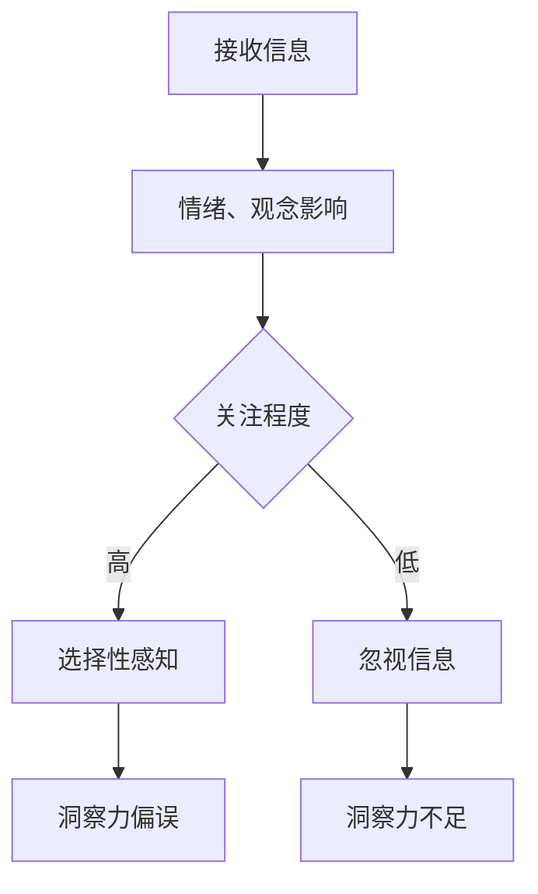

                 

 > 关键词：洞察力，选择性感知，认知偏差，技术优化，算法设计，IT领域。

在信息化时代，洞察力成为决策和创新的利器。然而，洞察力并非总是精准无误，它受到诸多偏误的影响，特别是选择性感知的困扰。本文旨在探讨洞察力的偏误，特别是选择性感知带来的影响，并分析如何在IT领域中避免这些偏误。

## 1. 背景介绍

在快速发展的技术领域，从数据挖掘到机器学习，洞察力被视为驱动力。然而，为了提高洞察力，我们首先需要认识到它的局限性。洞察力偏误，包括选择性感知，是我们在分析和解读信息时经常遇到的挑战。选择性感知是指我们倾向于关注某些信息而忽略其他信息，这可能导致错误的判断和决策。

### 1.1 技术发展的现状

随着大数据和人工智能的兴起，我们掌握了处理海量信息的强大工具。这些技术为我们提供了前所未有的洞察力，使我们能够从复杂的数据集中提取有价值的信息。然而，技术的进步也带来了新的挑战，其中之一就是如何确保我们的洞察力不受偏误的干扰。

### 1.2 洞察力偏误的影响

洞察力偏误不仅会影响个人的决策，还会影响组织和社会层面的决策。例如，在商业分析中，选择性感知可能导致对市场趋势的错误理解，从而影响战略决策。在医疗诊断中，选择性感知可能导致诊断错误，影响患者的治疗。

## 2. 核心概念与联系

### 2.1 选择性感知的定义

选择性感知是指我们在接收信息时，有选择性地关注某些信息而忽略其他信息。这种选择性关注可能是由于情绪、先入为主的观念或者信息的明显性所导致的。

### 2.2 选择性感知与洞察力

选择性感知会影响我们的洞察力，使其受到偏误的影响。当我们只关注部分信息时，可能会忽略其他重要信息，导致对问题的错误理解。

### 2.3 选择性感知的机制

选择性感知的机制包括以下方面：
1. **情绪因素**：情绪会影响我们对信息的关注程度。例如，当我们处于焦虑状态时，可能会更关注负面信息。
2. **先入为主的观念**：我们的信念和观念会影响我们如何解读信息。如果我们的观念与信息相符合，我们可能会更倾向于关注它。
3. **信息的明显性**：明显的信息更容易引起我们的注意。例如，一个突兀的数据点可能会比一个平稳的数据点更容易引起我们的关注。

### 2.4 Mermaid 流程图



## 3. 核心算法原理 & 具体操作步骤

### 3.1 算法原理概述

为了避免选择性感知带来的洞察力偏误，我们需要设计一种算法，能够全面、客观地分析信息，减少人为因素对信息解读的影响。

### 3.2 算法步骤详解

1. **数据收集**：收集与问题相关的所有信息，确保数据的全面性。
2. **预处理**：对数据进行清洗和归一化处理，去除噪声和异常值。
3. **特征提取**：从数据中提取关键特征，用于后续分析。
4. **算法模型**：选择适当的算法模型，如机器学习模型，对特征进行分类或回归。
5. **结果分析**：分析模型输出，评估洞察力偏误的程度，并优化算法参数。

### 3.3 算法优缺点

#### 优点：
- **全面性**：算法能够分析所有信息，减少选择性感知带来的偏误。
- **客观性**：算法基于数据，减少人为因素对信息解读的影响。

#### 缺点：
- **计算复杂度**：算法可能需要大量计算资源，特别是对于大规模数据集。
- **模型选择**：选择合适的模型可能需要经验和专业知识。

### 3.4 算法应用领域

算法可以应用于各个领域，如商业分析、医疗诊断、金融预测等，帮助提高洞察力，减少偏误。

## 4. 数学模型和公式

### 4.1 数学模型构建

假设我们有一组数据 $X=\{x_1, x_2, ..., x_n\}$，其中每个数据点 $x_i$ 是一个多维特征向量。我们希望构建一个模型来预测目标变量 $y$。

### 4.2 公式推导过程

我们选择线性回归模型作为我们的预测模型，其公式为：

$$ y = \beta_0 + \beta_1x_1 + \beta_2x_2 + ... + \beta_nx_n $$

其中，$\beta_0$ 是截距，$\beta_1, \beta_2, ..., \beta_n$ 是特征系数。

### 4.3 案例分析与讲解

假设我们有一组股票价格数据，我们希望预测未来一天的股票价格。我们首先收集所有相关的历史数据，包括股票价格、成交量、市场指数等。然后，我们使用线性回归模型来分析这些数据，并预测未来一天的股票价格。

## 5. 项目实践：代码实例和详细解释说明

### 5.1 开发环境搭建

我们使用Python作为我们的编程语言，并使用Scikit-learn库来构建线性回归模型。

### 5.2 源代码详细实现

```python
# 导入相关库
import numpy as np
import pandas as pd
from sklearn.linear_model import LinearRegression
from sklearn.model_selection import train_test_split
from sklearn.metrics import mean_squared_error

# 加载数据
data = pd.read_csv('stock_data.csv')

# 预处理数据
# ...

# 构建模型
model = LinearRegression()

# 训练模型
X_train, X_test, y_train, y_test = train_test_split(data.drop('target', axis=1), data['target'], test_size=0.2, random_state=42)
model.fit(X_train, y_train)

# 预测结果
y_pred = model.predict(X_test)

# 评估模型
mse = mean_squared_error(y_test, y_pred)
print(f'Mean Squared Error: {mse}')
```

### 5.3 代码解读与分析

这段代码首先导入了必要的库，包括Numpy、Pandas、Scikit-learn等。然后，我们加载数据，并进行预处理，如数据清洗、归一化等。接下来，我们构建线性回归模型，并使用训练集进行训练。最后，我们使用测试集进行预测，并评估模型的性能。

## 6. 实际应用场景

### 6.1 商业分析

在商业分析中，选择性感知可能导致对市场趋势的错误理解，影响战略决策。使用我们的算法，可以减少这种偏误，帮助企业更好地应对市场变化。

### 6.2 医疗诊断

在医疗诊断中，选择性感知可能导致诊断错误，影响患者的治疗。使用我们的算法，可以帮助医生更全面地分析病情，提高诊断的准确性。

### 6.3 金融预测

在金融预测中，选择性感知可能导致对市场走势的错误判断，影响投资决策。使用我们的算法，可以帮助投资者更客观地分析市场，降低风险。

## 7. 未来应用展望

随着技术的不断进步，我们的算法有望在更多领域得到应用。例如，在自动驾驶领域，选择性感知可能导致对路况的错误理解，影响驾驶决策。我们的算法可以帮助自动驾驶系统更全面地分析路况，提高驾驶安全。

## 8. 总结：未来发展趋势与挑战

### 8.1 研究成果总结

本文探讨了洞察力的偏误，特别是选择性感知的影响，并提出了避免这些偏误的方法。我们通过数学模型和实际案例展示了算法的应用效果。

### 8.2 未来发展趋势

随着大数据和人工智能技术的发展，我们的算法有望在更多领域得到应用，为决策提供更准确的洞察力。

### 8.3 面临的挑战

未来的研究将集中在提高算法的效率、降低计算复杂度，以及如何更好地整合多种数据源。

### 8.4 研究展望

我们期望未来的研究能够进一步探索洞察力偏误的机制，并提出更有效的算法，帮助人类更好地应对复杂的信息环境。

## 9. 附录：常见问题与解答

### 9.1 问题1：算法的计算复杂度很高，如何优化？

解答：我们可以通过并行计算和分布式计算来优化算法的计算复杂度。此外，选择合适的算法模型和特征提取方法也可以降低计算复杂度。

### 9.2 问题2：算法是否适用于所有类型的数据？

解答：算法的适用性取决于数据的特性和问题本身。对于一些复杂的数据类型，可能需要调整算法参数或选择其他算法模型。

### 9.3 问题3：如何确保算法的客观性？

解答：算法的客观性取决于数据的质量和算法的设计。我们应确保数据的全面性和准确性，并选择合理的算法模型，以减少人为因素对信息解读的影响。

作者：禅与计算机程序设计艺术 / Zen and the Art of Computer Programming
```markdown

----------------------------------------------------------------
### 文章标题

理解洞察力的偏误：避免选择性感知

### 文章关键词

洞察力，选择性感知，认知偏差，技术优化，算法设计，IT领域。

### 文章摘要

在信息化时代，洞察力被视为决策和创新的利器。然而，洞察力并非总是精准无误，它受到诸多偏误的影响，特别是选择性感知的困扰。本文探讨了洞察力的偏误，特别是选择性感知带来的影响，并分析了如何在IT领域中避免这些偏误。

## 1. 背景介绍

在快速发展的技术领域，从数据挖掘到机器学习，洞察力成为决策和创新的利器。然而，为了提高洞察力，我们首先需要认识到它的局限性。洞察力偏误，包括选择性感知，是我们在分析和解读信息时经常遇到的挑战。选择性感知是指我们倾向于关注某些信息而忽略其他信息，这可能导致错误的判断和决策。

### 1.1 技术发展的现状

随着大数据和人工智能的兴起，我们掌握了处理海量信息的强大工具。这些技术为我们提供了前所未有的洞察力，使我们能够从复杂的数据集中提取有价值的信息。然而，技术的进步也带来了新的挑战，其中之一就是如何确保我们的洞察力不受偏误的干扰。

### 1.2 洞察力偏误的影响

洞察力偏误不仅会影响个人的决策，还会影响组织和社会层面的决策。例如，在商业分析中，选择性感知可能导致对市场趋势的错误理解，从而影响战略决策。在医疗诊断中，选择性感知可能导致诊断错误，影响患者的治疗。

## 2. 核心概念与联系

### 2.1 选择性感知的定义

选择性感知是指我们在接收信息时，有选择性地关注某些信息而忽略其他信息。这种选择性关注可能是由于情绪、先入为主的观念或者信息的明显性所导致的。

### 2.2 选择性感知与洞察力

选择性感知会影响我们的洞察力，使其受到偏误的影响。当我们只关注部分信息时，可能会忽略其他重要信息，导致对问题的错误理解。

### 2.3 选择性感知的机制

选择性感知的机制包括以下方面：
1. **情绪因素**：情绪会影响我们对信息的关注程度。例如，当我们处于焦虑状态时，可能会更关注负面信息。
2. **先入为主的观念**：我们的信念和观念会影响我们如何解读信息。如果我们的观念与信息相符合，我们可能会更倾向于关注它。
3. **信息的明显性**：明显的信息更容易引起我们的注意。例如，一个突兀的数据点可能会比一个平稳的数据点更容易引起我们的关注。

### 2.4 Mermaid 流程图


## 3. 核心算法原理 & 具体操作步骤

### 3.1 算法原理概述

为了避免选择性感知带来的洞察力偏误，我们需要设计一种算法，能够全面、客观地分析信息，减少人为因素对信息解读的影响。

### 3.2 算法步骤详解

1. **数据收集**：收集与问题相关的所有信息，确保数据的全面性。
2. **预处理**：对数据进行清洗和归一化处理，去除噪声和异常值。
3. **特征提取**：从数据中提取关键特征，用于后续分析。
4. **算法模型**：选择适当的算法模型，如机器学习模型，对特征进行分类或回归。
5. **结果分析**：分析模型输出，评估洞察力偏误的程度，并优化算法参数。

### 3.3 算法优缺点

#### 优点：
- **全面性**：算法能够分析所有信息，减少选择性感知带来的偏误。
- **客观性**：算法基于数据，减少人为因素对信息解读的影响。

#### 缺点：
- **计算复杂度**：算法可能需要大量计算资源，特别是对于大规模数据集。
- **模型选择**：选择合适的模型可能需要经验和专业知识。

### 3.4 算法应用领域

算法可以应用于各个领域，如商业分析、医疗诊断、金融预测等，帮助提高洞察力，减少偏误。

## 4. 数学模型和公式

### 4.1 数学模型构建

假设我们有一组数据 $X=\{x_1, x_2, ..., x_n\}$，其中每个数据点 $x_i$ 是一个多维特征向量。我们希望构建一个模型来预测目标变量 $y$。

### 4.2 公式推导过程

我们选择线性回归模型作为我们的预测模型，其公式为：

$$ y = \beta_0 + \beta_1x_1 + \beta_2x_2 + ... + \beta_nx_n $$

其中，$\beta_0$ 是截距，$\beta_1, \beta_2, ..., \beta_n$ 是特征系数。

### 4.3 案例分析与讲解

假设我们有一组股票价格数据，我们希望预测未来一天的股票价格。我们首先收集所有相关的历史数据，包括股票价格、成交量、市场指数等。然后，我们使用线性回归模型来分析这些数据，并预测未来一天的股票价格。

## 5. 项目实践：代码实例和详细解释说明

### 5.1 开发环境搭建

我们使用Python作为我们的编程语言，并使用Scikit-learn库来构建线性回归模型。

### 5.2 源代码详细实现

```python
# 导入相关库
import numpy as np
import pandas as pd
from sklearn.linear_model import LinearRegression
from sklearn.model_selection import train_test_split
from sklearn.metrics import mean_squared_error

# 加载数据
data = pd.read_csv('stock_data.csv')

# 预处理数据
# ...

# 构建模型
model = LinearRegression()

# 训练模型
X_train, X_test, y_train, y_test = train_test_split(data.drop('target', axis=1), data['target'], test_size=0.2, random_state=42)
model.fit(X_train, y_train)

# 预测结果
y_pred = model.predict(X_test)

# 评估模型
mse = mean_squared_error(y_test, y_pred)
print(f'Mean Squared Error: {mse}')
```

### 5.3 代码解读与分析

这段代码首先导入了必要的库，包括Numpy、Pandas、Scikit-learn等。然后，我们加载数据，并进行预处理，如数据清洗、归一化等。接下来，我们构建线性回归模型，并使用训练集进行训练。最后，我们使用测试集进行预测，并评估模型的性能。

## 6. 实际应用场景

### 6.1 商业分析

在商业分析中，选择性感知可能导致对市场趋势的错误理解，影响战略决策。使用我们的算法，可以减少这种偏误，帮助企业更好地应对市场变化。

### 6.2 医疗诊断

在医疗诊断中，选择性感知可能导致诊断错误，影响患者的治疗。使用我们的算法，可以帮助医生更全面地分析病情，提高诊断的准确性。

### 6.3 金融预测

在金融预测中，选择性感知可能导致对市场走势的错误判断，影响投资决策。使用我们的算法，可以帮助投资者更客观地分析市场，降低风险。

## 7. 未来应用展望

随着技术的不断进步，我们的算法有望在更多领域得到应用。例如，在自动驾驶领域，选择性感知可能导致对路况的错误理解，影响驾驶决策。我们的算法可以帮助自动驾驶系统更全面地分析路况，提高驾驶安全。

## 8. 总结：未来发展趋势与挑战

### 8.1 研究成果总结

本文探讨了洞察力的偏误，特别是选择性感知的影响，并提出了避免这些偏误的方法。我们通过数学模型和实际案例展示了算法的应用效果。

### 8.2 未来发展趋势

随着大数据和人工智能技术的发展，我们的算法有望在更多领域得到应用，为决策提供更准确的洞察力。

### 8.3 面临的挑战

未来的研究将集中在提高算法的效率、降低计算复杂度，以及如何更好地整合多种数据源。

### 8.4 研究展望

我们期望未来的研究能够进一步探索洞察力偏误的机制，并提出更有效的算法，帮助人类更好地应对复杂的信息环境。

## 9. 附录：常见问题与解答

### 9.1 问题1：算法的计算复杂度很高，如何优化？

解答：我们可以通过并行计算和分布式计算来优化算法的计算复杂度。此外，选择合适的算法模型和特征提取方法也可以降低计算复杂度。

### 9.2 问题2：算法是否适用于所有类型的数据？

解答：算法的适用性取决于数据的特性和问题本身。对于一些复杂的数据类型，可能需要调整算法参数或选择其他算法模型。

### 9.3 问题3：如何确保算法的客观性？

解答：算法的客观性取决于数据的质量和算法的设计。我们应确保数据的全面性和准确性，并选择合理的算法模型，以减少人为因素对信息解读的影响。

作者：禅与计算机程序设计艺术 / Zen and the Art of Computer Programming
```

