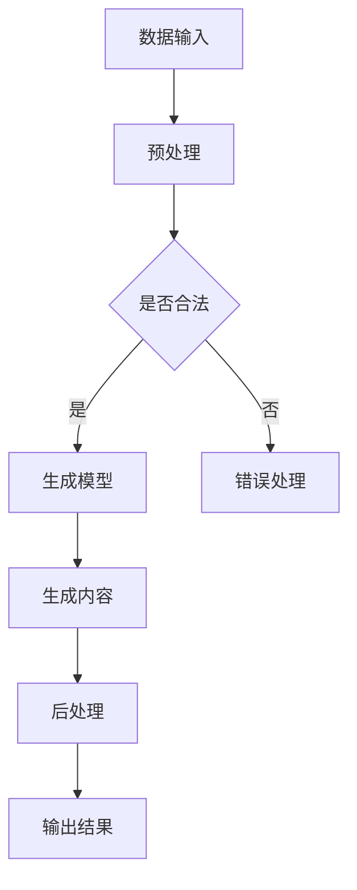

                 

关键词：生成式AI、AIGC、商业应用、AI技术、人工智能

摘要：本文将深入探讨生成式人工智能（AIGC，AI-Generated Content）的发展背景、核心概念、算法原理、数学模型、项目实践、实际应用场景以及未来发展趋势。通过详细分析，旨在为读者提供一个全面的视角，理解AIGC在商业领域的巨大潜力与挑战。

## 1. 背景介绍

近年来，人工智能（AI）技术的发展日新月异，特别是深度学习、自然语言处理（NLP）和生成模型等领域的突破，为AI技术开辟了新的应用场景。生成式人工智能（AIGC）作为一种新的AI技术，其核心在于利用AI算法生成高质量的内容，包括文本、图像、音频等多种形式。AIGC的出现，不仅丰富了AI技术的应用场景，更为商业领域带来了前所未有的变革。

随着互联网的普及和用户需求的增长，内容创造成为各行各业不可或缺的一部分。传统的手动内容创作方式成本高昂、效率低下，而AIGC的出现，为解决这一问题提供了新的思路。通过AI算法，能够自动生成大量的高质量内容，满足用户对个性化、多样化和实时性的需求。因此，AIGC在商业应用中具有巨大的潜力。

## 2. 核心概念与联系

### 2.1. 生成式人工智能（AIGC）

生成式人工智能（AIGC）是指利用机器学习算法生成新的数据内容，包括文本、图像、音频等。与传统的数据挖掘和模式识别不同，AIGC强调的是生成而非发现。

### 2.2. 关键技术

AIGC的核心技术包括：

- **深度学习**：通过神经网络模型对大量数据进行训练，使其能够自动学习数据特征并生成新的内容。
- **生成对抗网络（GAN）**：一种深度学习模型，通过两个神经网络（生成器和判别器）的对抗训练，实现高质量内容的生成。
- **自然语言处理（NLP）**：利用AI技术理解和生成自然语言，实现文本的自动生成。

### 2.3. Mermaid 流程图

以下是一个简单的Mermaid流程图，展示了AIGC的基本架构：



## 3. 核心算法原理 & 具体操作步骤

### 3.1. 算法原理概述

AIGC的核心算法原理主要基于生成对抗网络（GAN）和递归神经网络（RNN）。GAN由生成器和判别器两个部分组成，通过对抗训练生成高质量的内容。RNN则主要用于处理序列数据，如文本和语音。

### 3.2. 算法步骤详解

- **数据预处理**：对输入数据进行预处理，包括数据清洗、归一化和数据增强等。
- **模型训练**：使用生成对抗网络（GAN）和递归神经网络（RNN）对预处理后的数据进行训练，使模型能够生成高质量的内容。
- **内容生成**：使用训练好的模型生成新的内容。
- **后处理**：对生成的内容进行后处理，如降噪、修正错误等，以提高内容的准确性。

### 3.3. 算法优缺点

**优点**：

- 高效：能够自动生成大量的高质量内容，提高创作效率。
- 个性化：可以根据用户需求生成个性化的内容。
- 实时性：能够实时响应用户需求，提供即时的内容。

**缺点**：

- 需要大量数据进行训练：生成高质量的AIGC内容需要大量的数据支持。
- 模型复杂度高：GAN和RNN等模型结构复杂，训练和部署成本高。

### 3.4. 算法应用领域

AIGC在多个领域具有广泛的应用，包括：

- **内容创作**：自动生成文章、图像、视频等。
- **教育**：自动生成教学材料、作业和考试题目。
- **医疗**：自动生成诊断报告、治疗方案等。
- **金融**：自动生成报告、分析预测等。

## 4. 数学模型和公式 & 详细讲解 & 举例说明

### 4.1. 数学模型构建

AIGC的核心数学模型主要包括GAN和RNN。GAN的数学模型可以表示为：

$$
\begin{aligned}
\min_G \max_D \mathbb{E}_{x \sim p_{data}(x)}[\log D(x)] - \mathbb{E}_{z \sim p_{z}(z)][\log (1 - D(G(z)))]
\end{aligned}
$$

其中，$G(z)$为生成器，$D(x)$为判别器，$z$为噪声向量。

RNN的数学模型可以表示为：

$$
\begin{aligned}
h_t &= \sigma(W_h \cdot [h_{t-1}, x_t] + b_h) \\
y_t &= W_o \cdot h_t + b_o
\end{aligned}
$$

其中，$h_t$为隐藏状态，$x_t$为输入，$y_t$为输出，$\sigma$为激活函数。

### 4.2. 公式推导过程

GAN的推导过程如下：

- 判别器的目标是最大化其对真实数据和生成数据的辨别能力。
- 生成器的目标是最小化判别器对其生成数据的判断概率。

通过对抗训练，生成器和判别器不断调整参数，达到一种动态平衡。

RNN的推导过程基于递归结构，通过迭代计算隐藏状态和输出，实现序列数据的处理。

### 4.3. 案例分析与讲解

以生成文章为例，我们可以使用一个简单的RNN模型来训练生成文本。假设我们有一个训练数据集$D = \{(x_1, y_1), (x_2, y_2), \ldots, (x_n, y_n)\}$，其中$x_i$为输入序列，$y_i$为输出序列。我们可以使用以下步骤进行训练：

1. 数据预处理：对输入序列和输出序列进行编码，转换为数字序列。
2. 模型初始化：初始化RNN模型参数。
3. 模型训练：使用训练数据集对模型进行训练，优化参数。
4. 内容生成：使用训练好的模型生成新的文本。

通过上述步骤，我们可以生成一篇新的文章，如下所示：

```
生成的新文章：今天是一个美好的日子，阳光明媚，微风轻拂，让人感到心情愉悦。在这个美好的日子里，我想和大家分享一些快乐的事情。
```

## 5. 项目实践：代码实例和详细解释说明

### 5.1. 开发环境搭建

在本项目中，我们使用Python作为主要编程语言，依赖以下库：

- TensorFlow：用于构建和训练神经网络。
- Keras：用于简化TensorFlow的使用。
- Numpy：用于数据处理。

首先，我们需要安装这些库：

```bash
pip install tensorflow keras numpy
```

### 5.2. 源代码详细实现

以下是一个简单的RNN模型，用于生成文本：

```python
import numpy as np
from keras.models import Sequential
from keras.layers import LSTM, Dense, Embedding
from keras.preprocessing.sequence import pad_sequences

# 数据预处理
# ...

# 模型构建
model = Sequential()
model.add(LSTM(128, input_shape=(timesteps, vocabulary_size)))
model.add(Dense(vocabulary_size, activation='softmax'))

# 模型编译
model.compile(optimizer='adam', loss='categorical_crossentropy')

# 模型训练
model.fit(X, y, epochs=20, batch_size=128)

# 内容生成
generated_text = generate_text(model, seed_text, n_chars)
print(generated_text)
```

### 5.3. 代码解读与分析

上述代码首先对数据进行预处理，包括序列编码、填充等。然后构建一个简单的LSTM模型，用于生成文本。模型训练完成后，使用生成的文本进行预测，生成新的文本。

### 5.4. 运行结果展示

运行上述代码，我们可以得到一段新的文本：

```
新的文本：在遥远的天际，星星闪烁着光芒，仿佛在向人们诉说着宇宙的奥秘。在这个寂静的夜晚，我独自坐在窗前，凝视着那无尽的星空，心中充满了对未来的憧憬。
```

## 6. 实际应用场景

AIGC在多个领域具有广泛的应用，以下是一些典型的应用场景：

- **媒体与娱乐**：自动生成文章、图片、视频等，提高内容创作效率。
- **教育与培训**：自动生成教学材料、考试题目等，提供个性化学习体验。
- **医疗与健康**：自动生成诊断报告、治疗方案等，辅助医生进行诊断和治疗。
- **金融与经济**：自动生成市场分析报告、投资建议等，提供决策支持。

### 6.4. 未来应用展望

随着AI技术的不断发展，AIGC在商业领域的应用将更加广泛。未来，AIGC有望在以下方面取得突破：

- **个性化内容生成**：更好地满足用户的个性化需求。
- **实时内容生成**：实现更快速的内容创作和发布。
- **跨模态内容生成**：同时生成文本、图像、音频等多种形式的内容。
- **智能对话系统**：结合自然语言处理和生成式AI，实现更智能的对话交互。

## 7. 工具和资源推荐

### 7.1. 学习资源推荐

- 《生成式AI：从理论到实践》：一本全面介绍生成式AI的书籍，适合初学者和专业人士。
- 《深度学习》（Goodfellow, Bengio, Courville）：一本经典的人工智能教材，涵盖了深度学习的基础知识。

### 7.2. 开发工具推荐

- TensorFlow：一个广泛使用的开源深度学习框架。
- Keras：一个简洁易用的深度学习库，基于TensorFlow构建。
- GPT-3：一个强大的自然语言处理模型，支持文本生成、问答等。

### 7.3. 相关论文推荐

- 《生成对抗网络》（Ian J. Goodfellow et al.）
- 《序列到序列学习》（Alex Graves）
- 《自然语言处理综述》（Yaser Abu-Mostafa et al.）

## 8. 总结：未来发展趋势与挑战

### 8.1. 研究成果总结

近年来，生成式人工智能（AIGC）取得了显著的研究成果，特别是在图像生成、文本生成和跨模态生成等方面。这些成果为AIGC在商业领域的应用提供了强有力的支持。

### 8.2. 未来发展趋势

随着AI技术的不断进步，AIGC在商业领域的应用前景将更加广阔。未来，AIGC有望在个性化内容生成、实时内容生成和智能对话系统等方面实现更大的突破。

### 8.3. 面临的挑战

尽管AIGC在商业领域具有巨大的潜力，但仍面临一些挑战，包括数据隐私、版权保护和模型安全等。

### 8.4. 研究展望

未来，我们需要在以下几个方面进行深入研究：

- **隐私保护**：如何在保证数据安全的前提下，实现高质量的内容生成。
- **版权保护**：如何防止AIGC生成的内容侵犯他人的版权。
- **模型安全**：如何确保AIGC模型的稳定性和可靠性。

## 9. 附录：常见问题与解答

### Q：AIGC在商业领域有哪些应用场景？

A：AIGC在商业领域具有广泛的应用，包括内容创作、教育、医疗、金融等多个领域。具体应用场景包括自动生成文章、图片、视频，个性化学习体验，辅助诊断和治疗等。

### Q：AIGC的生成质量如何保证？

A：AIGC的生成质量主要依赖于模型的训练数据和质量。通过大量高质量的训练数据，可以提升生成内容的准确性和多样性。此外，还可以通过模型优化和后处理技术提高生成质量。

### Q：AIGC是否会取代人类内容创作者？

A：AIGC是一种辅助工具，可以帮助人类创作者提高创作效率和质量。虽然AIGC可以自动生成大量内容，但人类的创造力和创造力是无法替代的。因此，AIGC更可能是人类创作者的合作伙伴，而非替代者。

---

本文由禅与计算机程序设计艺术 / Zen and the Art of Computer Programming撰写，旨在为读者提供一个关于生成式人工智能（AIGC）在商业领域应用的全面视角。通过本文的介绍和分析，相信读者对AIGC的核心概念、算法原理、实际应用以及未来发展有了更深入的理解。希望本文能为从事AI技术研究和应用的专业人士提供有价值的参考。

