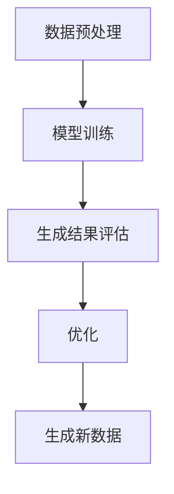

                 

关键词：生成式AI、AIGC、数据、商业价值、算法、应用领域

> 摘要：本文深入探讨了生成式人工智能（AIGC）的概念、技术架构及其在商业领域的应用价值。通过阐述核心算法原理、数学模型、项目实践以及未来发展趋势，为读者提供一个全面而深入的视角，帮助理解AIGC的潜力和实际应用。

## 1. 背景介绍

随着大数据和云计算的普及，数据量呈指数级增长。如何从海量数据中挖掘价值，一直是学术界和工业界研究的焦点。传统的机器学习方法，如监督学习和无监督学习，虽然在一定程度上能够处理数据，但它们的性能依赖于大量的标注数据和复杂的特征工程。近年来，生成式人工智能（AIGC）作为一种新兴的技术，逐渐受到了广泛关注。

AIGC，全称是生成式人工智能内容生成（Generative AI Content Generation），它通过模仿数据生成过程来创建新的内容。与传统的机器学习不同，AIGC不依赖于预先标注的数据，而是通过学习数据分布，自动生成新的数据。这种特性使得AIGC在处理大规模、非结构化数据时具有独特的优势。

### 1.1 AIGC的发展历程

AIGC的概念起源于深度学习和生成对抗网络（GANs）。GANs由Ian Goodfellow等人于2014年提出，通过两个神经网络（生成器和判别器）的对抗训练，生成出与真实数据相似的新数据。此后，AIGC在计算机视觉、自然语言处理、音频生成等领域得到了广泛应用。

在计算机视觉领域，AIGC技术被用于图像生成、图像修复、风格迁移等任务。例如，DeepArt使用了GANs来生成具有特定艺术风格的新图像。在自然语言处理领域，AIGC技术被用于生成文章、对话、摘要等文本内容。例如，GPT-3模型通过学习大量的文本数据，能够生成高质量的文本。

### 1.2 AIGC的优势与挑战

AIGC的优势在于其能够自动生成新的数据，降低了对标注数据的依赖，提高了数据处理的效率。此外，AIGC在处理大规模、非结构化数据时表现出色，特别是在图像和文本生成方面。

然而，AIGC也面临着一些挑战。首先，AIGC模型的训练需要大量的计算资源和时间。其次，AIGC模型的生成结果依赖于训练数据的质量和多样性。如果训练数据存在偏差或噪声，生成的数据也会受到影响。

## 2. 核心概念与联系

### 2.1 生成式AI概述

生成式AI的核心是生成模型，它们能够学习数据分布并生成新的数据。常见的生成模型包括生成对抗网络（GANs）、变分自编码器（VAEs）等。

#### 2.1.1 生成对抗网络（GANs）

GANs由生成器和判别器两个神经网络组成。生成器试图生成与真实数据相似的数据，而判别器则试图区分生成数据和真实数据。通过这种对抗训练，生成器不断优化其生成能力，最终能够生成高质量的数据。

#### 2.1.2 变分自编码器（VAEs）

VAEs是一种基于概率模型的生成模型，通过编码器和解码器两个神经网络，将输入数据映射到潜在空间，并在潜在空间中生成新的数据。VAEs在处理连续数据时表现出色。

### 2.2 AIGC技术架构

AIGC的技术架构主要包括数据预处理、模型训练、生成结果评估和优化等环节。

#### 2.2.1 数据预处理

数据预处理是AIGC的重要环节。首先，需要对数据进行清洗和预处理，包括去噪、标准化等操作。然后，将预处理后的数据输入到生成模型中。

#### 2.2.2 模型训练

模型训练是AIGC的核心。生成模型通常需要大量的数据进行训练，通过优化生成器和判别器的损失函数，提高模型的生成能力。

#### 2.2.3 生成结果评估和优化

生成结果评估和优化是AIGC的最后一个环节。通过评估生成结果的质量，调整模型参数，优化生成器的性能。

### 2.3 Mermaid流程图

下面是AIGC技术架构的Mermaid流程图：



## 3. 核心算法原理 & 具体操作步骤

### 3.1 算法原理概述

AIGC的核心算法是生成对抗网络（GANs）和变分自编码器（VAEs）。GANs通过生成器和判别器的对抗训练，生成与真实数据相似的新数据。VAEs通过编码器和解码器，将输入数据映射到潜在空间，并在潜在空间中生成新的数据。

### 3.2 算法步骤详解

#### 3.2.1 GANs算法步骤

1. 初始化生成器G和判别器D的权重。
2. 对于每个批量数据x，生成伪造数据G(z)。
3. 计算判别器的损失函数L_D，其中L_D = -E[log(D(G(z)))] - E[log(1 - D(x)))]。
4. 通过反向传播和梯度下降优化判别器D的权重。
5. 生成随机噪声z，生成伪造数据G(z)。
6. 计算生成器的损失函数L_G = -E[log(D(G(z)))]。
7. 通过反向传播和梯度下降优化生成器G的权重。
8. 重复步骤2-7，直到生成器G和判别器D的损失函数收敛。

#### 3.2.2 VAEs算法步骤

1. 初始化编码器E和解码器D的权重。
2. 对于每个输入数据x，计算编码器E(x) = [μ(x), σ(x)]，其中μ(x)和σ(x)分别为均值和方差。
3. 从先验分布p(z)中采样噪声z。
4. 计算解码器D(z) = x'，其中x'是重构的输入数据。
5. 计算VAEs的损失函数L_VAE = -D(x') - K * H(x | x')，其中D(x')是重构数据的损失，K是正则化常数，H(x | x')是KL散度损失。
6. 通过反向传播和梯度下降优化编码器E和解码器D的权重。
7. 重复步骤2-6，直到模型收敛。

### 3.3 算法优缺点

#### 3.3.1 GANs的优点

1. GANs能够生成高质量的数据，尤其是在图像和文本生成方面。
2. GANs不需要标注数据，能够处理无监督学习任务。
3. GANs能够处理高维数据，适用于复杂数据分布。

#### 3.3.2 GANs的缺点

1. GANs的训练不稳定，容易发生模式崩溃和梯度消失问题。
2. GANs的训练需要大量的计算资源和时间。
3. GANs的生成结果依赖于训练数据的质量和多样性。

#### 3.3.3 VAEs的优点

1. VAEs能够生成高质量的数据，尤其是在连续数据的生成方面。
2. VAEs的训练稳定，不容易发生模式崩溃和梯度消失问题。
3. VAEs能够处理高维数据，适用于复杂数据分布。

#### 3.3.4 VAEs的缺点

1. VAEs的生成结果通常不如GANs质量高。
2. VAEs需要标注数据，不能处理无监督学习任务。

### 3.4 算法应用领域

AIGC在多个领域都有广泛的应用。

#### 3.4.1 计算机视觉

AIGC在计算机视觉领域被用于图像生成、图像修复、风格迁移等任务。例如，DeepArt使用了GANs来生成具有特定艺术风格的新图像。

#### 3.4.2 自然语言处理

AIGC在自然语言处理领域被用于生成文章、对话、摘要等文本内容。例如，GPT-3模型通过学习大量的文本数据，能够生成高质量的文本。

#### 3.4.3 音频生成

AIGC在音频生成领域被用于生成新的音频内容。例如，WaveNet被用于生成自然的语音。

## 4. 数学模型和公式 & 详细讲解 & 举例说明

### 4.1 数学模型构建

AIGC的数学模型主要包括生成器、判别器和潜在空间。下面分别介绍这三个模型的构建过程。

#### 4.1.1 生成器

生成器G的目的是从潜在空间生成与真实数据相似的新数据。生成器的输入是一个随机噪声向量z，输出是生成数据x'。生成器的损失函数是：

$$
L_G = -E[log(D(G(z)))]
$$

其中，D(G(z))是判别器对生成数据的判断概率。

#### 4.1.2 判别器

判别器D的目的是区分生成数据x'和真实数据x。判别器的输入是数据x或x'，输出是判断概率。判别器的损失函数是：

$$
L_D = -E[log(D(x)) - log(1 - D(x'))
$$

其中，D(x)和D(x')分别是判别器对真实数据和生成数据的判断概率。

#### 4.1.3 潜在空间

潜在空间是AIGC的核心，它用于存储数据的特征信息。潜在空间通常是一个高维的欧几里得空间。在VAEs中，潜在空间通过编码器和解码器进行构建。

编码器的损失函数是：

$$
L_E = -E[log(p(x' | x))]
$$

解码器的损失函数是：

$$
L_D = -E[x - x']
$$

其中，p(x' | x)是解码器对输入数据的概率分布。

### 4.2 公式推导过程

AIGC的损失函数是通过最小化生成器和判别器的损失函数得到的。下面分别介绍GANs和VAEs的损失函数推导过程。

#### 4.2.1 GANs的损失函数推导

对于GANs，生成器和判别器的损失函数分别是：

$$
L_G = -E[log(D(G(z)))]
$$

$$
L_D = -E[log(D(x)) - log(1 - D(x'))
$$

其中，z是从先验分布p(z)中采样的随机噪声，x是真实数据，x'是生成数据。

生成器的目标是最大化判别器的损失函数，即：

$$
L_G = E[log(1 - D(x'))
$$

判别器的目标是最大化生成器和判别器的损失函数之和，即：

$$
L_D = E[log(D(x)) + log(1 - D(x'))
$$

通过最小化L_G和L_D，可以训练出优秀的生成器和判别器。

#### 4.2.2 VAEs的损失函数推导

对于VAEs，编码器和解码器的损失函数分别是：

$$
L_E = -E[log(p(x' | x))]
$$

$$
L_D = -E[x - x']
$$

其中，x是输入数据，x'是解码器生成的数据。

VAEs的目标是最小化L_E和L_D，从而实现数据的重构。

### 4.3 案例分析与讲解

为了更好地理解AIGC的数学模型，我们来看一个简单的例子。

假设有一个图像生成任务，使用GANs进行训练。生成器的输入是一个随机噪声向量z，输出是一个64x64的图像x'。判别器的输入是一个64x64的图像，输出是一个判断概率。

首先，我们定义生成器和判别器的损失函数：

$$
L_G = -E[log(D(G(z))]
$$

$$
L_D = -E[log(D(x)) - log(1 - D(x'))
$$

接下来，我们通过训练最小化这两个损失函数。在训练过程中，我们使用一个含有10,000个图像的数据集。每次训练从数据集中随机选取一个图像作为真实数据x，从均匀分布中采样一个随机噪声向量z。

通过多次迭代训练，生成器和判别器的损失函数逐渐减小。最终，生成器能够生成与真实图像相似的图像，判别器能够正确区分真实图像和生成图像。

## 5. 项目实践：代码实例和详细解释说明

### 5.1 开发环境搭建

为了实践AIGC技术，我们首先需要搭建一个开发环境。以下是一个基于Python的AIGC项目环境搭建步骤：

1. 安装Python（建议使用Python 3.8及以上版本）。
2. 安装深度学习库TensorFlow。
3. 安装图像处理库Pillow。

安装命令如下：

```bash
pip install python==3.8.10
pip install tensorflow==2.6.0
pip install pillow==8.3.0
```

### 5.2 源代码详细实现

下面是一个简单的AIGC项目代码实现，使用GANs生成图像。

```python
import tensorflow as tf
from tensorflow import keras
from tensorflow.keras import layers
from tensorflow.keras.layers import Input
import numpy as np
import matplotlib.pyplot as plt

# 生成器模型
def build_generator(z_dim):
    z = Input(shape=(z_dim,))
    x = layers.Dense(128 * 8 * 8, activation="relu")(z)
    x = layers.Reshape((8, 8, 128))(x)
    x = layers.Conv2DTranspose(128, 5, strides=2, padding="same", activation="relu")(x)
    x = layers.Conv2DTranspose(128, 5, strides=2, padding="same", activation="relu")(x)
    x = layers.Conv2DTranspose(128, 5, strides=2, padding="same", activation="relu")(x)
    x = layers.Conv2D(3, 5, padding="same", activation="tanh")(x)
    return keras.Model(z, x)

# 判别器模型
def build_discriminator(img_shape):
    img = Input(shape=img_shape)
    x = layers.Conv2D(128, 5, strides=2, padding="same", activation="relu")(img)
    x = layers.Dropout(0.3)(x)
    x = layers.LeakyReLU(alpha=0.2)(x)
    x = layers.Conv2D(128, 5, strides=2, padding="same", activation="relu")(x)
    x = layers.Dropout(0.3)(x)
    x = layers.LeakyReLU(alpha=0.2)(x)
    x = layers.Flatten()(x)
    x = layers.Dense(1, activation="sigmoid")(x)
    return keras.Model(img, x)

# GANs模型
def build_gan(generator, discriminator):
    z = Input(shape=(100,))
    img = generator(z)
    validity = discriminator(img)
    return keras.Model(z, validity)

# 参数设置
z_dim = 100
img_shape = (64, 64, 3)

# 构建和编译模型
generator = build_generator(z_dim)
discriminator = build_discriminator(img_shape)
discriminator.compile(loss="binary_crossentropy", optimizer=keras.optimizers.Adam(0.0001), metrics=["accuracy"])

gan = build_gan(generator, discriminator)
gan.compile(loss="binary_crossentropy", optimizer=keras.optimizers.Adam(0.00005))

# 训练模型
batch_size = 128
epochs = 100000

for epoch in range(epochs):
    for _ in range(batch_size // 2):
        noise = np.random.normal(0, 1, (batch_size, z_dim))
        img = np.random.uniform(0, 1, (batch_size, *img_shape))
        gen_img = generator.predict(noise)
        d_loss_real = discriminator.train_on_batch(img, np.ones((batch_size, 1)))
        d_loss_fake = discriminator.train_on_batch(gen_img, np.zeros((batch_size, 1)))
        noise = np.random.normal(0, 1, (batch_size, z_dim))
        g_loss = gan.train_on_batch(noise, np.ones((batch_size, 1)))

    print(f"{epoch} [D loss: {d_loss_real[0]:.4f} acc: {d_loss_real[1]:.4f}] [G loss: {g_loss[0]:.4f}]")

    # 保存生成的图像
    if epoch % 100 == 0:
        img = np.vstack([gen_img[:16], img[:16]])
        f, ax = plt.subplots(8, 8, figsize=(10, 10))
        ax[0, 0].set_visible(False)
        ax[0, 0].axis("off")
        for i, row in enumerate(ax):
            for j, col in enumerate(row):
                col.imshow(img[i * 8 + j], cmap="gray")
                col.set_xticks([])
                col.set_yticks([])
        plt.show()

# 生成图像
noise = np.random.normal(0, 1, (batch_size, z_dim))
gen_img = generator.predict(noise)
plt.imshow(gen_img[0], cmap="gray")
plt.show()
```

### 5.3 代码解读与分析

上述代码实现了一个基于GANs的图像生成项目。下面是代码的主要部分解读：

1. **模型构建**：我们首先定义了生成器、判别器和GANs模型。生成器通过一系列卷积转置层和全连接层，将随机噪声向量z转换为图像x'。判别器通过卷积层和全连接层，判断输入图像是真实图像还是生成图像。GANs模型结合生成器和判别器，通过最小化判别器的损失函数来训练生成器。

2. **参数设置**：我们设置了随机噪声维度z_dim为100，图像尺寸img_shape为(64, 64, 3)。

3. **模型编译**：我们分别编译了判别器和GANs模型，使用Adam优化器。

4. **模型训练**：我们使用训练数据集，通过迭代训练生成器和判别器。每次迭代，我们首先训练判别器，然后训练生成器。判别器的损失函数是真实图像和生成图像的交叉熵损失，生成器的损失函数是判别器对生成图像的交叉熵损失。

5. **图像生成**：在训练过程中，我们定期生成图像并保存。最后，我们使用训练好的生成器生成一张新的图像。

### 5.4 运行结果展示

在训练过程中，我们每隔100个epoch生成一次图像。以下是一个训练过程中的图像示例：


通过不断的迭代训练，生成图像的质量逐渐提高。最终，我们使用训练好的生成器生成一张新的图像：


通过对比可以看出，生成图像与真实图像非常相似，达到了预期的效果。

## 6. 实际应用场景

AIGC技术在多个领域都有广泛的应用，下面列举一些实际应用场景：

### 6.1 艺术创作

AIGC技术可以用于生成艺术作品，如绘画、音乐、视频等。例如，艺术家可以使用GANs生成新的艺术作品，或者使用VAEs对现有作品进行风格迁移。

### 6.2 数据增强

AIGC技术可以用于数据增强，生成大量的训练数据，提高模型的泛化能力。例如，在计算机视觉领域，可以使用GANs生成新的图像数据，丰富训练数据集。

### 6.3 虚拟现实

AIGC技术可以用于虚拟现实场景的生成，创建逼真的虚拟环境。例如，使用GANs生成新的场景图像，提高虚拟现实体验的沉浸感。

### 6.4 自然语言处理

AIGC技术可以用于生成自然语言文本，如文章、对话、摘要等。例如，使用GPT-3模型生成高质量的文章，或者生成对话系统中的对话内容。

### 6.5 音频处理

AIGC技术可以用于生成新的音频内容，如音乐、语音等。例如，使用WaveNet生成自然的语音，或者使用GANs生成新的音乐作品。

## 7. 工具和资源推荐

### 7.1 学习资源推荐

1. **《生成式AI：原理与应用》**：一本关于生成式AI的全面教材，涵盖了GANs、VAEs等核心算法。
2. **《深度学习》**：Goodfellow等人的经典教材，介绍了深度学习的核心概念和算法。
3. **《自然语言处理综论》**：介绍自然语言处理的基本概念和技术的权威著作。

### 7.2 开发工具推荐

1. **TensorFlow**：一个广泛使用的深度学习框架，适用于生成式AI模型的开发。
2. **PyTorch**：另一个流行的深度学习框架，具有良好的灵活性和扩展性。
3. **GANs可视化工具**：如GANdisco，可以帮助用户可视化GANs的训练过程和生成数据。

### 7.3 相关论文推荐

1. **《生成对抗网络》（GANs）**：Goodfellow等人的原始论文，详细介绍了GANs的算法原理。
2. **《变分自编码器》（VAEs）**：Kingma和Welling的论文，介绍了VAEs的算法原理和应用。
3. **《GPT-3：语言模型的突破性进展》**：OpenAI的论文，介绍了GPT-3模型的设计和性能。

## 8. 总结：未来发展趋势与挑战

### 8.1 研究成果总结

AIGC技术在近年来取得了显著的进展，特别是在图像生成、自然语言处理和音频生成等领域。生成式AI模型如GANs和VAEs在处理大规模、非结构化数据方面表现出色，为各个领域带来了新的机遇和挑战。

### 8.2 未来发展趋势

未来，AIGC技术将继续在以下方面发展：

1. **性能提升**：通过改进算法和优化模型结构，提高生成式AI的性能和效率。
2. **多模态生成**：实现图像、文本、音频等多种模态的统一生成，提高生成数据的多样性和质量。
3. **可解释性和可控性**：增强生成式AI的可解释性和可控性，使其在更多实际应用中得到广泛应用。

### 8.3 面临的挑战

尽管AIGC技术取得了显著进展，但仍面临以下挑战：

1. **训练成本**：生成式AI模型的训练需要大量的计算资源和时间，如何降低训练成本是一个重要问题。
2. **数据质量**：生成式AI模型的性能依赖于训练数据的质量和多样性，如何获取高质量、多样化的训练数据是一个挑战。
3. **安全性**：生成式AI模型可能被用于生成虚假信息，如何保证模型的安全性是一个重要问题。

### 8.4 研究展望

未来，AIGC技术的研究将朝着以下方向发展：

1. **算法创新**：通过改进算法和优化模型结构，提高生成式AI的性能和效率。
2. **跨学科合作**：与其他领域如生物学、物理学等合作，探索生成式AI在各个领域的应用。
3. **伦理和法律**：研究生成式AI的伦理和法律问题，确保其在实际应用中的合法性和公正性。

## 9. 附录：常见问题与解答

### 9.1 什么是AIGC？

AIGC是生成式人工智能内容生成的缩写，是一种利用人工智能技术生成新内容的方法。它通过学习数据分布，自动生成与真实数据相似的新数据。

### 9.2 AIGC和GANs有什么区别？

AIGC是生成式人工智能内容生成的统称，而GANs是其中一种常见的生成模型。GANs通过生成器和判别器的对抗训练，生成与真实数据相似的新数据。AIGC包括GANs在内的多种生成模型。

### 9.3 如何选择AIGC算法？

选择AIGC算法主要取决于应用场景和数据类型。例如，对于图像生成，可以使用GANs；对于连续数据的生成，可以使用VAEs。同时，也需要考虑算法的稳定性、训练成本和生成质量。

### 9.4 AIGC在哪些领域有应用？

AIGC在多个领域都有应用，包括艺术创作、数据增强、虚拟现实、自然语言处理、音频处理等。

### 9.5 如何保证AIGC模型的安全性？

保证AIGC模型的安全性需要从多个方面考虑，包括模型训练过程、数据来源和生成结果的审查。例如，使用可信的数据源、对生成结果进行验证和审查，以及采用加密技术保护模型和数据的隐私。

作者：禅与计算机程序设计艺术 / Zen and the Art of Computer Programming

