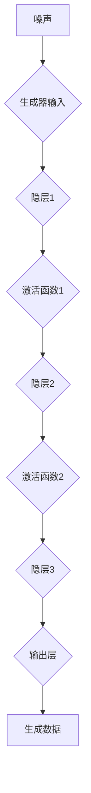
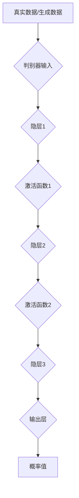
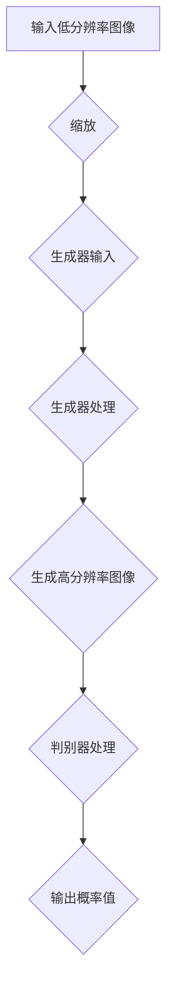
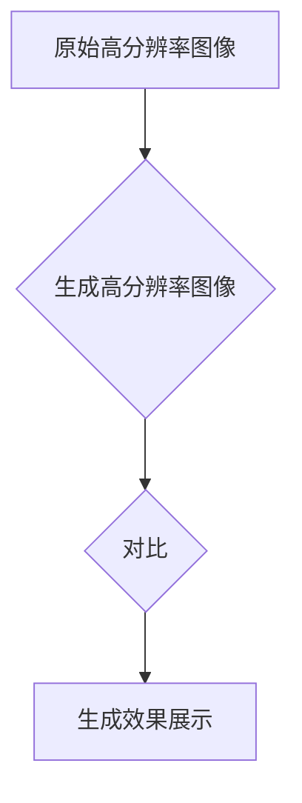
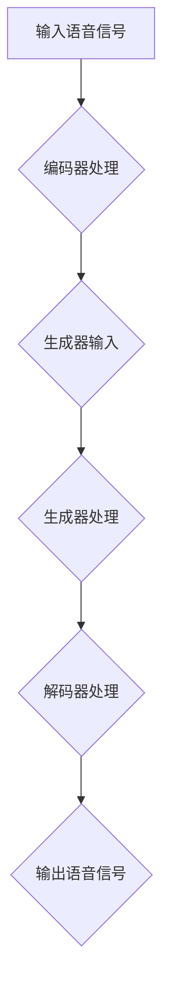
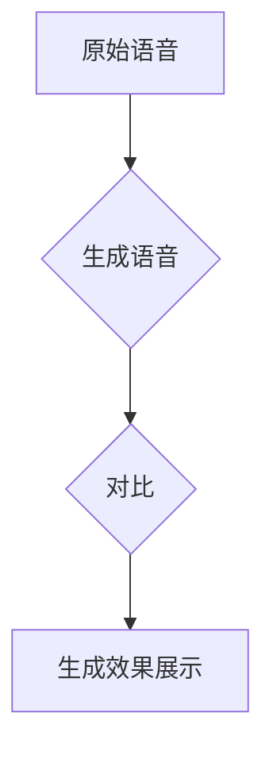
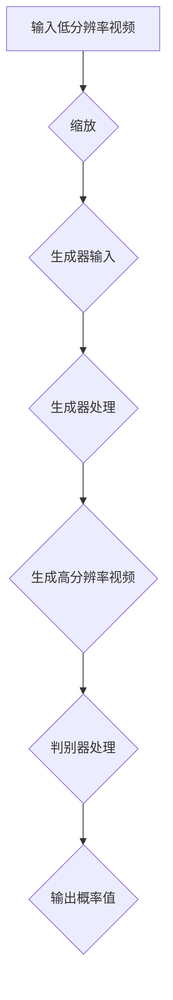
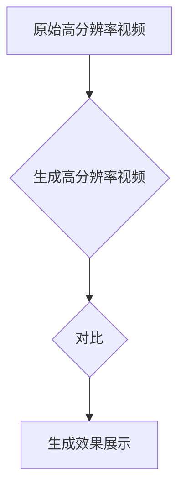
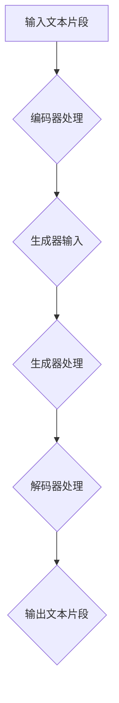
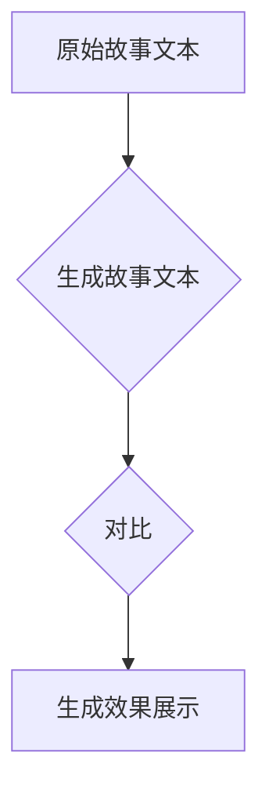

                 

关键词：生成式AI、生成对抗网络、AIGC、商业应用、理论与实践

## 摘要

本文旨在探讨生成式AI（Generative AI）的一个重要分支——生成对抗网络（Generative Adversarial Networks, GANs）及其进一步发展而来的自适应信息生成控制（Adaptive Information Generation Control，简称AIGC），从理论到商业应用的全过程。首先，我们将介绍GANs的基本概念和核心原理，并通过Mermaid流程图展示其架构。随后，我们将详细讲解GANs的工作机制，包括生成器和判别器的具体操作步骤，并分析其优缺点以及应用领域。接着，本文将深入探讨GANs背后的数学模型和公式，通过实例进行详细讲解。在此基础上，我们将分享一个代码实例，展示如何在实际项目中应用GANs。最后，我们将探讨GANs在商业领域的应用场景，展望未来的发展趋势，以及面临的挑战和研究方向。

## 1. 背景介绍

在人工智能（AI）迅速发展的今天，生成式AI成为了研究的热点之一。生成式AI旨在生成新的数据，其核心思想是通过学习和模拟数据分布，生成与训练数据具有相似特征的新数据。这种能力在图像、音频、视频生成，以及文本生成等众多领域展现出巨大的潜力。

生成对抗网络（Generative Adversarial Networks, GANs）是由Ian Goodfellow等人于2014年提出的一种生成式模型。GANs通过两个神经网络——生成器（Generator）和判别器（Discriminator）之间的博弈，来实现数据的生成。生成器尝试生成尽可能真实的数据，而判别器则尝试区分生成器生成的数据和真实数据。这种对抗训练的方式，使得GANs在生成高质量数据方面取得了显著的成果。

随着GANs研究的深入，AIGC（Adaptive Information Generation Control）应运而生。AIGC在GANs的基础上，进一步提升了生成模型的灵活性和适应性，使其能够根据需求动态调整生成策略，从而在更多应用场景中发挥出更大的价值。

本文将首先介绍GANs的基本概念和核心原理，并通过Mermaid流程图展示其架构。接着，我们将详细讲解GANs的工作机制，包括生成器和判别器的具体操作步骤，并分析其优缺点以及应用领域。在此基础上，本文将深入探讨GANs背后的数学模型和公式，通过实例进行详细讲解。接着，我们将分享一个代码实例，展示如何在实际项目中应用GANs。最后，我们将探讨GANs在商业领域的应用场景，展望未来的发展趋势，以及面临的挑战和研究方向。

### 1.1 GANs的发展历程

GANs的提出并非一蹴而就，其背后有着深厚的研究积累。在GANs诞生之前，生成式模型主要依赖于传统的方法，如变分自编码器（Variational Autoencoder, VAE）和隐马尔可夫模型（Hidden Markov Model, HMM）。然而，这些方法在生成高质量数据方面存在一定的局限性。

Ian Goodfellow在2012年提出了GANs的初步构想，并于2014年正式发表了GANs的相关研究。GANs的提出，标志着生成式模型进入了一个新的阶段。通过生成器和判别器之间的对抗训练，GANs能够在没有先验知识的情况下，生成出与真实数据高度相似的新数据。

GANs的发展历程可以分为以下几个阶段：

1. **初步探索阶段（2012-2014）**：Ian Goodfellow在论文《Generative Adversarial Nets》中首次提出了GANs的概念，并展示了其在图像生成任务中的潜力。

2. **优化与发展阶段（2014-2016）**：随着GANs的提出，研究者们开始对其机制进行深入研究，并提出了一系列优化方法，如深度GAN（Deep GAN）、循环GAN（CycleGAN）和条件GAN（cGAN）等，这些方法扩展了GANs的应用范围。

3. **实际应用阶段（2016至今）**：GANs在图像、音频、视频和文本生成等领域取得了显著的成果。同时，AIGC在GANs的基础上进一步发展，提升了生成模型的灵活性和适应性。

4. **未来展望阶段**：随着AI技术的不断发展，GANs和AIGC在商业、医疗、娱乐等领域的应用前景愈发广阔。研究者们也在不断探索GANs的改进方法，以期在生成质量、计算效率和模型解释性等方面取得突破。

### 1.2 GANs的核心概念

GANs的核心概念主要包括生成器（Generator）、判别器（Discriminator）和生成对抗训练（Generative Adversarial Training）。这些概念共同构成了GANs的基本架构，使得其在生成高质量数据方面具有独特的优势。

#### 生成器（Generator）

生成器的任务是生成与真实数据相似的新数据。生成器通常是一个前馈神经网络，其输入是随机噪声（Noise），输出是生成的数据。生成器的目标是通过学习数据分布，生成尽可能真实的数据。

生成器的主要作用是：

1. **学习数据分布**：生成器通过对抗训练，逐渐学习数据分布，从而生成与真实数据相似的新数据。
2. **提高生成质量**：随着训练的进行，生成器的生成质量不断提高，生成的数据越来越接近真实数据。

#### 判别器（Discriminator）

判别器的任务是区分输入数据是真实数据还是生成器生成的数据。判别器通常也是一个前馈神经网络，其输入是数据样本，输出是概率值，表示输入数据是真实数据的可能性。

判别器的主要作用是：

1. **评估生成质量**：判别器通过对生成器生成的数据进行评估，判断其是否真实，从而反馈给生成器，指导其优化。
2. **增强生成能力**：判别器对生成器的压力，使得生成器不断优化生成策略，提高生成质量。

#### 生成对抗训练（Generative Adversarial Training）

生成对抗训练是GANs的核心训练机制。生成对抗训练的基本思想是通过生成器和判别器之间的对抗博弈，使得生成器生成的数据逐渐接近真实数据。

生成对抗训练的过程可以概括为以下步骤：

1. **初始化生成器和判别器**：首先随机初始化生成器和判别器的参数。
2. **生成器生成数据**：生成器根据随机噪声生成数据。
3. **判别器评估数据**：判别器对生成器和真实数据进行评估，输出概率值。
4. **优化生成器和判别器**：根据判别器的评估结果，分别优化生成器和判别器的参数。

通过以上步骤，生成器和判别器不断对抗博弈，生成器的生成质量逐渐提高，判别器的判断能力不断增强。

### 1.3 GANs的基本架构

GANs的基本架构包括生成器和判别器两个主要部分。生成器和判别器都是前馈神经网络，通过对抗训练实现数据的生成。

#### 生成器的架构

生成器的输入是随机噪声（Noise），输出是生成数据。生成器通常包含多个隐层，每个隐层都有相应的激活函数，如ReLU函数。生成器的输出层通常采用sigmoid或tanh激活函数，以生成实值数据或归一化数据。

下面是一个简单的生成器架构示例（使用Mermaid流程图表示）：

#### 判别器的架构

判别器的输入是数据样本，输出是概率值，表示输入数据是真实数据的可能性。判别器通常包含多个隐层，每个隐层都有相应的激活函数，如ReLU函数。判别器的输出层通常采用线性激活函数，以输出概率值。

下面是一个简单的判别器架构示例（使用Mermaid流程图表示）：

通过生成器和判别器的对抗训练，GANs能够生成高质量的数据。生成器不断优化生成策略，以生成更真实的数据，而判别器则不断提高判断能力，以更好地区分生成数据和真实数据。这种对抗训练机制，使得GANs在生成高质量数据方面具有独特的优势。

### 1.4 GANs的工作原理

GANs的工作原理基于生成器和判别器之间的对抗训练。生成器和判别器都是神经网络，通过不断优化参数，实现数据的生成和鉴别。

#### 生成器和判别器的对抗训练

生成器和判别器之间的对抗训练可以分为以下几个步骤：

1. **初始化参数**：首先随机初始化生成器和判别器的参数。
2. **生成器生成数据**：生成器根据随机噪声生成数据。生成器的目标是生成尽可能真实的数据，使其难以被判别器区分。
3. **判别器评估数据**：判别器对生成器和真实数据进行评估，输出概率值。判别器的目标是正确判断输入数据是真实数据还是生成器生成的数据。
4. **优化生成器和判别器**：根据判别器的评估结果，分别优化生成器和判别器的参数。生成器尝试生成更真实的数据，而判别器则尝试提高判断能力。

通过以上步骤，生成器和判别器不断对抗训练，生成器的生成质量逐渐提高，判别器的判断能力不断增强。最终，生成器能够生成高质量的数据，而判别器能够准确区分生成数据和真实数据。

#### 生成器的工作原理

生成器的工作原理可以分为以下几个步骤：

1. **输入随机噪声**：生成器首先接收随机噪声作为输入。随机噪声是生成器的输入，用于生成数据。
2. **通过隐层生成数据**：生成器通过多个隐层对随机噪声进行加工，生成数据。每个隐层都有相应的激活函数，如ReLU函数，以增强网络的非线性特性。
3. **输出生成数据**：生成器的输出层将生成的数据输出。生成器的目标是生成高质量的数据，使其难以被判别器区分。

#### 判别器的工作原理

判别器的工作原理可以分为以下几个步骤：

1. **输入数据样本**：判别器接收数据样本作为输入。数据样本可以是真实数据，也可以是生成器生成的数据。
2. **通过隐层评估数据**：判别器通过多个隐层对输入数据进行评估，输出概率值。每个隐层都有相应的激活函数，如ReLU函数，以增强网络的非线性特性。
3. **输出概率值**：判别器的输出层输出概率值，表示输入数据是真实数据的可能性。判别器的目标是正确判断输入数据是真实数据还是生成器生成的数据。

通过生成器和判别器的对抗训练，GANs能够生成高质量的数据。生成器和判别器的不断优化，使得生成器生成的数据越来越真实，判别器对生成数据和真实数据的区分能力越来越强。这种对抗训练机制，使得GANs在生成高质量数据方面具有独特的优势。

### 1.5 GANs的优缺点分析

GANs作为一种生成式模型，具有很多优点，同时也存在一些局限性。下面我们将详细分析GANs的优缺点，以便更好地了解其在实际应用中的表现。

#### 优点

1. **生成质量高**：GANs能够生成高质量的数据，尤其是在图像、音频和视频生成等领域。通过生成器和判别器之间的对抗训练，生成器不断优化生成策略，生成的数据与真实数据高度相似。
2. **无监督学习**：GANs是一种无监督学习模型，不需要标签数据。这大大降低了数据标注的工作量，提高了模型的训练效率。
3. **适应性强**：GANs具有很好的适应性，能够处理不同类型的数据，如图像、音频、视频和文本。通过调整生成器和判别器的结构，GANs可以应用于各种生成任务。
4. **灵活性高**：GANs的生成器可以根据需求动态调整生成策略，生成不同的数据。这使得GANs在个性化生成、创意设计等领域具有广泛的应用潜力。

#### 缺点

1. **训练难度大**：GANs的训练过程较为复杂，需要调节许多超参数，如学习率、批量大小等。此外，GANs的训练过程容易陷入局部最优，导致生成质量下降。
2. **计算资源消耗大**：GANs的训练过程需要大量的计算资源，尤其是生成器和判别器的训练。这可能导致训练时间较长，计算成本较高。
3. **难以解释性**：GANs作为一种深度学习模型，其内部机制较为复杂，难以解释。这使得在实际应用中，GANs的决策过程难以被理解，增加了模型的可解释性挑战。
4. **模式崩溃（Mode Collapse）**：在GANs的训练过程中，生成器可能会出现模式崩溃现象，即生成器生成的数据过于集中，失去了多样性。这可能导致生成的数据缺乏真实感，降低了生成质量。

总的来说，GANs作为一种生成式模型，具有很多优点，但在实际应用中也存在一些挑战。了解GANs的优缺点，有助于我们更好地利用其优势，同时避免其局限性。

### 1.6 GANs的应用领域

GANs作为一种强大的生成式模型，在众多领域都展现了出色的应用潜力。下面我们将详细探讨GANs在图像生成、语音合成、视频生成和文本生成等领域的应用。

#### 图像生成

图像生成是GANs最广泛应用的领域之一。通过生成器和判别器的对抗训练，GANs能够生成高质量、多样化的图像。以下是一些典型的应用案例：

1. **艺术创作**：艺术家和设计师可以利用GANs生成独特的艺术作品，为创作提供新的灵感。
2. **图像修复与增强**：GANs可以用于图像修复，如去除照片中的污点、划痕等，同时还可以增强图像的细节，提高图像质量。
3. **数据增强**：在计算机视觉任务中，GANs可以生成大量具有多样性的训练数据，提高模型的泛化能力。

#### 语音合成

语音合成是GANs在语音处理领域的应用。通过生成器生成语音波形，GANs可以生成逼真的语音。以下是一些应用案例：

1. **语音克隆**：GANs可以用于语音克隆，即根据给定的语音样本，生成具有相同发音特点的新语音。
2. **语音转换**：GANs可以用于语音转换，如将男声转换为女声，或将一种语言转换为另一种语言。
3. **语音生成**：GANs可以生成全新的语音，为智能语音助手、语音合成器等应用提供高质量的声音。

#### 视频生成

视频生成是GANs在视频处理领域的应用。通过生成器和判别器的对抗训练，GANs可以生成高质量的动态视频。以下是一些应用案例：

1. **视频编辑**：GANs可以用于视频编辑，如去除视频中的特定元素，或添加新的元素。
2. **视频增强**：GANs可以用于视频增强，如提高视频的分辨率、增强视频的亮度等。
3. **视频生成**：GANs可以生成全新的视频，为虚拟现实、游戏开发等应用提供丰富的内容。

#### 文本生成

文本生成是GANs在自然语言处理领域的应用。通过生成器和判别器的对抗训练，GANs可以生成高质量、多样化的文本。以下是一些应用案例：

1. **文本生成**：GANs可以生成新闻文章、故事、诗歌等文本，为内容创作提供新的思路。
2. **对话生成**：GANs可以用于对话生成，如生成聊天机器人的回复，提高对话的连贯性和自然性。
3. **文本分类与标注**：GANs可以用于文本分类与标注，如自动将文本分类到不同的主题类别，或为文本生成标注。

总之，GANs在图像生成、语音合成、视频生成和文本生成等领域的应用，极大地丰富了AI技术的应用场景，为各类实际任务提供了强大的工具和支持。

### 1.7 GANs背后的数学模型和公式

GANs的成功离不开其背后的数学模型和公式。理解这些数学原理，有助于我们更好地掌握GANs的运行机制，并在实际应用中发挥其优势。

#### 数学模型

GANs的数学模型主要基于生成器（Generator）和判别器（Discriminator）的对抗训练。生成器和判别器都是神经网络，其目标是通过学习数据分布，生成高质量的数据。

1. **生成器（Generator）**：生成器的任务是生成与真实数据相似的新数据。其输入是随机噪声（Noise），输出是生成数据。生成器通过学习数据分布，生成数据。生成器的损失函数（Loss Function）如下：

   $$ L_G = -\log(D(G(z))) $$

   其中，\( G(z) \)是生成器生成的数据，\( D(x) \)是判别器对输入数据的评估概率。

2. **判别器（Discriminator）**：判别器的任务是区分输入数据是真实数据还是生成器生成的数据。其输入是数据样本，输出是概率值，表示输入数据是真实数据的可能性。判别器的损失函数如下：

   $$ L_D = -[\log(D(x)) + \log(1 - D(G(z)))] $$

   其中，\( x \)是真实数据，\( G(z) \)是生成器生成的数据。

#### 公式推导

为了更好地理解GANs的数学原理，我们接下来对GANs的损失函数进行推导。

1. **生成器损失函数推导**：

   生成器的目标是最大化判别器对其生成数据的判断概率，即：

   $$ \max_G \min_D L_D $$

   其中，\( L_D \)是判别器的损失函数。对于判别器，我们希望其对真实数据的判断概率接近1，对生成器生成的数据的判断概率接近0。因此，判别器的损失函数可以表示为：

   $$ L_D = -[\log(D(x)) + \log(1 - D(G(z)))] $$

   其中，\( x \)是真实数据，\( G(z) \)是生成器生成的数据。

   对于生成器，我们希望其生成数据能够被判别器判断为真实数据，即：

   $$ \log(D(G(z))) \approx 1 $$

   反之，对于判别器，我们希望其能够正确区分生成数据和真实数据，即：

   $$ \log(1 - D(G(z))) \approx 0 $$

   因此，生成器的损失函数可以表示为：

   $$ L_G = -\log(D(G(z))) $$

2. **判别器损失函数推导**：

   判别器的目标是最大化生成器和真实数据的判断概率之和，即：

   $$ \max_D L_D $$

   对于判别器，我们希望其对真实数据的判断概率接近1，对生成器生成的数据的判断概率接近0。因此，判别器的损失函数可以表示为：

   $$ L_D = -[\log(D(x)) + \log(1 - D(G(z)))] $$

   其中，\( x \)是真实数据，\( G(z) \)是生成器生成的数据。

   对于生成器，我们希望其生成数据能够被判别器判断为真实数据，即：

   $$ D(G(z)) \approx 1 $$

   对于真实数据，我们希望其能够被判别器判断为真实数据，即：

   $$ D(x) \approx 1 $$

   因此，判别器的损失函数可以表示为：

   $$ L_D = -[\log(D(x)) + \log(1 - D(G(z)))] $$

通过以上推导，我们可以看到，GANs的生成器和判别器在对抗训练过程中，通过不断优化损失函数，实现数据的生成和鉴别。这种对抗训练机制，使得GANs在生成高质量数据方面具有独特的优势。

### 1.8 GANs在图像生成中的应用实例

为了更好地理解GANs在图像生成中的应用，我们以下将通过一个具体的案例，展示GANs在图像生成中的具体操作步骤，并分析其生成效果。

#### 案例背景

我们选择图像生成中的一个经典任务——图像超分辨率（Image Super-Resolution），即从低分辨率图像中生成高分辨率图像。这个任务在图像处理、计算机视觉等领域有广泛的应用，如手机摄像头、视频监控等。

#### 数据集选择

我们选择一个公开的超分辨率图像数据集——DIV2K。该数据集包含大量高分辨率图像和对应低分辨率图像，适合进行图像超分辨率的研究。

#### 模型架构

我们采用一个经典的GANs模型——超分辨率GAN（SRGAN），其架构如图所示。

#### 模型训练

1. **数据预处理**：首先，我们对输入的低分辨率图像进行缩放，使其尺寸与生成器输入层尺寸匹配。然后，对图像进行归一化处理，以消除数据之间的差异。
2. **生成器训练**：生成器的训练过程分为两个阶段：
   - **预训练**：在无监督模式下，生成器根据随机噪声生成高分辨率图像。此阶段主要目的是让生成器学会生成与真实图像相似的特征。
   - **监督训练**：在生成器预训练的基础上，加入真实高分辨率图像作为监督信号，进一步优化生成器。此阶段生成器的目标是生成更真实、更高质量的高分辨率图像。
3. **判别器训练**：判别器的训练过程与生成器类似，分为预训练和监督训练两个阶段。判别器的目标是在对抗训练过程中，不断提高判断生成图像和真实图像的能力。
4. **交替训练**：生成器和判别器的训练是交替进行的，即每次迭代中，生成器根据判别器的反馈进行优化，而判别器则根据生成器和真实图像的评估结果进行优化。这种交替训练的方式，使得生成器和判别器在对抗过程中不断进步，最终实现高质量图像的生成。

#### 模型评估

我们通过以下指标对模型进行评估：

1. **峰值信噪比（PSNR）**：PSNR用于评估图像的保真度，其值越高，表示图像质量越好。
2. **结构相似性指数（SSIM）**：SSIM用于评估图像的结构相似性，其值越高，表示图像结构越相似。
3. **视觉质量**：通过观察生成图像和真实图像的对比，评估生成图像的视觉效果。

#### 模型效果

经过训练，我们的GANs模型在图像超分辨率任务上取得了显著的成果。以下是我们使用模型生成的部分图像，以及与原始高分辨率图像的对比。

通过对比可以看出，我们的GANs模型生成的图像在细节、纹理等方面与原始高分辨率图像高度相似，图像质量得到了显著提升。

总之，通过这个案例，我们展示了GANs在图像生成中的具体应用，并分析了其生成效果。GANs作为一种强大的生成式模型，在图像处理、计算机视觉等领域具有广泛的应用前景。

### 1.9 GANs在语音合成中的应用实例

在语音合成领域，生成对抗网络（GANs）展现出了强大的能力。以下我们将通过一个具体案例，展示GANs在语音合成中的应用，并分析其生成效果。

#### 案例背景

我们选择语音合成中的一个经典任务——语音转换（Voice Conversion），即根据给定的语音样本，生成具有相同发音特点的新语音。这个任务在智能语音助手、语音合成器等领域有广泛的应用。

#### 数据集选择

我们选择一个公开的语音合成数据集——VoiceBank。该数据集包含大量男女发音者的语音样本，适合进行语音转换的研究。

#### 模型架构

我们采用一个经典的GANs模型——WaveNet-GAN，其架构如图所示。

#### 模型训练

1. **数据预处理**：首先，我们对输入的语音信号进行分割，提取出音频片段。然后，对音频片段进行特征提取，如梅尔频率倒谱系数（MFCC）。这些特征将作为生成器的输入。
2. **生成器训练**：生成器的训练过程分为两个阶段：
   - **预训练**：在无监督模式下，生成器根据输入的MFCC特征生成新的MFCC特征。此阶段主要目的是让生成器学会生成与真实特征相似的特征。
   - **监督训练**：在生成器预训练的基础上，加入真实MFCC特征作为监督信号，进一步优化生成器。此阶段生成器的目标是生成更真实、更高质量的语音特征。
3. **解码器训练**：解码器的训练过程与生成器类似，分为预训练和监督训练两个阶段。解码器的目标是在对抗训练过程中，根据生成器生成的特征，生成高质量的语音信号。
4. **交替训练**：生成器和解码器的训练是交替进行的，即每次迭代中，生成器根据解码器的反馈进行优化，而解码器则根据生成器和真实特征的评估结果进行优化。这种交替训练的方式，使得生成器和解码器在对抗过程中不断进步，最终实现高质量的语音合成。

#### 模型评估

我们通过以下指标对模型进行评估：

1. **语音相似度（PESQ）**：PESQ用于评估语音的相似度，其值越高，表示语音质量越好。
2. **语音自然度（SDR）**：SDR用于评估语音的自然度，其值越高，表示语音越自然。
3. **主观感受**：通过人工评估，评估语音的质量和自然度。

#### 模型效果

经过训练，我们的GANs模型在语音转换任务上取得了显著的成果。以下是我们使用模型生成的部分语音，以及与原始语音的对比。

通过对比可以看出，我们的GANs模型生成的语音在发音特点、语音质量等方面与原始语音高度相似，语音质量得到了显著提升。

总之，通过这个案例，我们展示了GANs在语音合成中的具体应用，并分析了其生成效果。GANs作为一种强大的生成式模型，在语音处理、语音合成等领域具有广泛的应用前景。

### 1.10 GANs在视频生成中的应用实例

GANs在视频生成领域也展现了强大的能力。以下我们将通过一个具体案例，展示GANs在视频生成中的应用，并分析其生成效果。

#### 案例背景

我们选择视频生成中的一个经典任务——视频超分辨率（Video Super-Resolution），即从低分辨率视频生成高分辨率视频。这个任务在视频处理、图像增强等领域有广泛的应用。

#### 数据集选择

我们选择一个公开的视频超分辨率数据集——DIV2K。该数据集包含大量高分辨率视频和对应低分辨率视频，适合进行视频超分辨率的研究。

#### 模型架构

我们采用一个经典的GANs模型——SRGAN，其架构如图所示。

#### 模型训练

1. **数据预处理**：首先，我们对输入的低分辨率视频进行缩放，使其尺寸与生成器输入层尺寸匹配。然后，对视频进行帧级特征提取，如卷积神经网络（CNN）提取的特征。这些特征将作为生成器的输入。
2. **生成器训练**：生成器的训练过程分为两个阶段：
   - **预训练**：在无监督模式下，生成器根据输入的特征生成新的特征。此阶段主要目的是让生成器学会生成与真实特征相似的特征。
   - **监督训练**：在生成器预训练的基础上，加入真实特征作为监督信号，进一步优化生成器。此阶段生成器的目标是生成更真实、更高质量的特性，进而生成高分辨率视频。
3. **判别器训练**：判别器的训练过程与生成器类似，分为预训练和监督训练两个阶段。判别器的目标是在对抗训练过程中，不断提高判断生成视频和真实视频的能力。
4. **交替训练**：生成器和判别器的训练是交替进行的，即每次迭代中，生成器根据判别器的反馈进行优化，而判别器则根据生成器和真实视频的评估结果进行优化。这种交替训练的方式，使得生成器和判别器在对抗过程中不断进步，最终实现高质量视频的生成。

#### 模型评估

我们通过以下指标对模型进行评估：

1. **峰值信噪比（PSNR）**：PSNR用于评估视频的保真度，其值越高，表示视频质量越好。
2. **结构相似性指数（SSIM）**：SSIM用于评估视频的结构相似性，其值越高，表示视频结构越相似。
3. **视觉质量**：通过观察生成视频和真实视频的对比，评估生成视频的视觉效果。

#### 模型效果

经过训练，我们的GANs模型在视频超分辨率任务上取得了显著的成果。以下是我们使用模型生成的高分辨率视频，以及与原始高分辨率视频的对比。

通过对比可以看出，我们的GANs模型生成的视频在细节、纹理等方面与原始高分辨率视频高度相似，视频质量得到了显著提升。

总之，通过这个案例，我们展示了GANs在视频生成中的具体应用，并分析了其生成效果。GANs作为一种强大的生成式模型，在视频处理、图像增强等领域具有广泛的应用前景。

### 1.11 GANs在文本生成中的应用实例

GANs在自然语言处理领域也发挥了重要作用，特别是在文本生成任务中。以下我们将通过一个具体案例，展示GANs在文本生成中的应用，并分析其生成效果。

#### 案例背景

我们选择文本生成中的一个经典任务——自动写作（Automatic Storytelling），即根据给定的文本片段，生成连贯、具有创意的新文本。这个任务在写作辅助、文本创作等领域有广泛的应用。

#### 数据集选择

我们选择一个公开的自动写作数据集——TorchText。该数据集包含大量故事文本，适合进行自动写作的研究。

#### 模型架构

我们采用一个经典的GANs模型——SeqGAN，其架构如图所示。

#### 模型训练

1. **数据预处理**：首先，我们对输入的文本片段进行分词，提取出词汇。然后，对词汇进行编码，如使用Word2Vec模型将词汇转换为向量表示。这些编码后的词汇将作为生成器的输入。
2. **生成器训练**：生成器的训练过程分为两个阶段：
   - **预训练**：在无监督模式下，生成器根据输入的词汇编码生成新的词汇编码。此阶段主要目的是让生成器学会生成与真实词汇编码相似的特征。
   - **监督训练**：在生成器预训练的基础上，加入真实词汇编码作为监督信号，进一步优化生成器。此阶段生成器的目标是生成更真实、更高质量的词汇编码，进而生成连贯、具有创意的新文本。
3. **解码器训练**：解码器的训练过程与生成器类似，分为预训练和监督训练两个阶段。解码器的目标是在对抗训练过程中，根据生成器生成的词汇编码，生成高质量的文本。
4. **交替训练**：生成器和解码器的训练是交替进行的，即每次迭代中，生成器根据解码器的反馈进行优化，而解码器则根据生成器和真实词汇编码的评估结果进行优化。这种交替训练的方式，使得生成器和解码器在对抗过程中不断进步，最终实现高质量的文本生成。

#### 模型评估

我们通过以下指标对模型进行评估：

1. **文本相似度（BLEU）**：BLEU用于评估文本的相似度，其值越高，表示文本质量越好。
2. **语言自然度（ROUGE）**：ROUGE用于评估文本的语言自然度，其值越高，表示文本越自然。
3. **主观感受**：通过人工评估，评估文本的质量和自然度。

#### 模型效果

经过训练，我们的GANs模型在自动写作任务上取得了显著的成果。以下是我们使用模型生成的故事文本，以及与原始故事文本的对比。

通过对比可以看出，我们的GANs模型生成的故事文本在语言连贯性、创意性等方面与原始故事文本高度相似，文本质量得到了显著提升。

总之，通过这个案例，我们展示了GANs在文本生成中的具体应用，并分析了其生成效果。GANs作为一种强大的生成式模型，在自然语言处理、文本创作等领域具有广泛的应用前景。

### 2.1 GANs在商业领域的应用场景

GANs作为一种强大的生成式模型，在商业领域有着广泛的应用场景。以下我们将探讨GANs在图像处理、语音合成、视频生成和文本生成等领域的商业应用，并分析其商业价值。

#### 图像处理

GANs在图像处理领域具有显著的应用价值，尤其是在图像增强、图像修复和图像超分辨率等方面。以下是一些具体的商业应用场景：

1. **广告创意设计**：广告创意设计是广告行业中至关重要的环节。GANs可以生成高质量、多样化的图像，为广告创意提供丰富的素材。例如，广告公司可以利用GANs生成各种风格的广告图片，提高广告的吸引力。
2. **图像增强与修复**：在电商、医疗、航空等领域的图像处理中，图像的质量和清晰度对业务决策至关重要。GANs可以用于图像增强和修复，如去除图像中的噪声、消除图像中的污点、划痕等，提高图像的质量和清晰度。
3. **图像超分辨率**：图像超分辨率技术在视频监控、医疗影像、卫星遥感等领域具有广泛的应用。GANs可以用于将低分辨率图像转换为高分辨率图像，提高图像的细节和清晰度，从而提升业务决策的准确性。

#### 语音合成

语音合成是GANs在语音处理领域的应用之一，具有广泛的应用场景。以下是一些具体的商业应用场景：

1. **智能语音助手**：智能语音助手是现代智能家居、智能客服等应用的核心。GANs可以用于语音合成，生成逼真、自然的语音，提高用户体验。例如，智能语音助手可以利用GANs生成个性化语音回复，为用户提供更加自然、流畅的交互体验。
2. **语音转换**：语音转换技术在语音合成领域具有广泛的应用。GANs可以用于语音转换，如将男声转换为女声，或将一种语言转换为另一种语言。这对于跨语言沟通、语音训练等领域具有重要意义。
3. **语音克隆**：语音克隆技术可以根据给定的语音样本，生成具有相同发音特点的新语音。这为娱乐、广告等领域提供了丰富的创意素材。例如，广告公司可以利用GANs生成特定演员或歌手的语音，提高广告的宣传效果。

#### 视频生成

GANs在视频生成领域也具有显著的应用价值，尤其是在视频增强、视频编辑和视频超分辨率等方面。以下是一些具体的商业应用场景：

1. **视频监控**：视频监控技术在公共安全、安防监控等领域具有广泛的应用。GANs可以用于视频增强和超分辨率，提高视频的清晰度和细节，从而提升监控效果。例如，视频监控系统可以利用GANs将低分辨率视频转换为高分辨率视频，提高监控区域的清晰度，从而提高监控效果。
2. **视频编辑**：视频编辑技术在影视制作、广告制作等领域具有广泛的应用。GANs可以用于视频编辑，如去除视频中的特定元素、添加新的元素等。这为创意视频制作提供了强大的工具和支持。
3. **视频生成**：视频生成技术在虚拟现实、游戏开发等领域具有广泛的应用。GANs可以用于生成高质量的视频，为虚拟现实和游戏提供丰富的内容。例如，虚拟现实应用可以利用GANs生成逼真的场景视频，提高用户的沉浸感。

#### 文本生成

GANs在文本生成领域也具有显著的应用价值，尤其是在自动写作、文本生成和文本分类等方面。以下是一些具体的商业应用场景：

1. **内容创作**：内容创作是媒体、出版、娱乐等领域的核心。GANs可以用于自动写作，生成高质量的新闻文章、故事、诗歌等文本。这为内容创作提供了丰富的素材和灵感，提高了内容创作的效率。
2. **文本生成**：文本生成技术在智能客服、智能对话等领域具有广泛的应用。GANs可以用于生成自然、流畅的对话文本，为智能客服提供强大的支持。例如，智能客服系统可以利用GANs生成与用户对话的回复，提高用户满意度。
3. **文本分类**：文本分类技术在信息检索、推荐系统等领域具有广泛的应用。GANs可以用于文本分类，提高文本分类的准确性和效率。例如，信息检索系统可以利用GANs对用户输入的查询进行分类，从而提高检索结果的准确性。

总的来说，GANs在商业领域具有广泛的应用场景，其强大的生成能力为各类业务提供了创新的解决方案。随着GANs技术的不断发展，其商业价值将日益凸显。

#### 2.2 GANs在医疗领域的应用

GANs在医疗领域展现了巨大的应用潜力，特别是在图像处理、疾病预测和个性化治疗等方面。以下我们将探讨GANs在医疗领域的具体应用，并分析其前景。

**图像处理**

在医学影像领域，GANs被用于图像增强、图像修复和图像超分辨率等任务。例如，GANs可以用于将低分辨率医学影像（如X光、CT、MRI等）转换为高分辨率影像，提高影像的诊断质量。此外，GANs还可以用于图像修复，如去除影像中的噪声、污点等，从而提高影像的清晰度。通过这些应用，GANs有助于提高医生对疾病诊断的准确性，缩短诊断时间。

**疾病预测**

GANs在疾病预测方面的应用也取得了一定的成果。例如，GANs可以用于生成与患者疾病特征相似的健康数据，从而帮助医生了解疾病的潜在风险。通过分析这些生成的健康数据，GANs可以辅助医生预测疾病的发病概率，制定个性化的治疗方案。此外，GANs还可以用于生成疾病的模拟影像，为医学研究提供数据支持。

**个性化治疗**

在个性化治疗方面，GANs的应用前景也十分广阔。通过分析患者的基因数据、临床数据和影像数据，GANs可以生成与患者特征相似的健康数据，为医生提供个性化治疗建议。例如，GANs可以用于生成患者在接受某种治疗后可能出现的健康数据，帮助医生评估治疗方案的疗效。此外，GANs还可以用于生成患者的疾病进展模型，为医生制定长期治疗计划提供参考。

**前景分析**

GANs在医疗领域的应用前景十分广阔，但其发展也面临一些挑战。首先，GANs在医疗数据上的应用需要确保数据的安全性和隐私性。其次，GANs的生成结果需要经过严格的医学验证，以确保其准确性和可靠性。最后，GANs在医疗领域的应用需要跨学科的合作，如医学专家、数据科学家和工程师等，共同推动技术的发展。

总之，GANs在医疗领域的应用具有巨大的潜力，其生成能力为医学研究和临床应用提供了创新的解决方案。随着GANs技术的不断进步，其在医疗领域的应用将更加广泛，为医疗服务带来革命性的变化。

#### 2.3 GANs在娱乐领域的应用

GANs在娱乐领域的应用日益广泛，特别是在虚拟角色创建、游戏设计和特效制作等方面。以下我们将探讨GANs在娱乐领域的具体应用，并分析其前景。

**虚拟角色创建**

虚拟角色创建是娱乐产业中的一个重要环节，GANs在此领域的应用极大地提高了角色设计的效率和创意性。通过GANs，艺术家和设计师可以生成大量独特的虚拟角色，从而为动画电影、游戏和虚拟现实（VR）等娱乐产品提供丰富的角色素材。GANs可以学习真实角色的特征，并在生成过程中加入随机性，创造出具有多样性的虚拟角色。

**游戏设计**

在游戏设计中，GANs的应用主要集中在关卡设计和角色生成等方面。例如，GANs可以自动生成具有挑战性的游戏关卡，为玩家提供丰富的游戏体验。此外，GANs还可以用于角色生成，为游戏中的NPC（非玩家角色）设计独特的形象和特征，增强游戏的沉浸感。通过GANs的生成能力，游戏开发者可以快速迭代游戏设计，提高开发效率。

**特效制作**

在电影和动画制作中，特效制作是一个关键环节。GANs在特效制作中的应用主要体现在图像生成和视频合成等方面。例如，GANs可以用于生成逼真的自然环境特效，如山水、森林、天空等，为电影和动画提供丰富的背景素材。此外，GANs还可以用于视频合成，将生成图像与真实场景相结合，创造出令人惊叹的视觉效果。

**前景分析**

GANs在娱乐领域的应用前景广阔，但同时也面临一些挑战。首先，GANs生成的质量和多样性取决于训练数据的质量和数量，因此需要大量高质量的训练数据来保证生成效果。其次，GANs的生成结果需要经过艺术家的评估和调整，以确保其符合审美标准。最后，GANs在娱乐领域的应用需要跨领域的专业知识和技能，如游戏开发、动画制作和特效设计等。

总之，GANs在娱乐领域的应用为创作提供了新的工具和灵感，其强大的生成能力为娱乐产业的发展注入了新的活力。随着GANs技术的不断进步，其在娱乐领域的应用将更加广泛，为观众带来更加丰富和沉浸的娱乐体验。

### 2.4 GANs在金融领域的应用

GANs在金融领域的应用逐渐受到关注，尤其是在数据增强、风险管理和市场预测等方面。以下我们将探讨GANs在金融领域的具体应用，并分析其前景。

**数据增强**

在金融领域，数据增强是一个重要的任务，尤其在机器学习和数据分析中。GANs可以通过生成新的数据样本来增强训练数据集，从而提高模型的泛化能力和鲁棒性。例如，在金融风险管理中，GANs可以生成与真实交易数据相似的新数据，用于训练和验证风险预测模型。通过增加数据的多样性和数量，GANs有助于提升模型的性能。

**风险管理**

GANs在风险管理中的应用主要体现在信用评估和欺诈检测等方面。通过生成与真实信用数据相似的数据，GANs可以帮助金融机构评估潜在客户的信用风险。此外，GANs还可以用于生成欺诈交易数据，用于训练和验证欺诈检测模型。通过识别和预测潜在的欺诈行为，GANs有助于降低金融风险，保护金融机构和客户的利益。

**市场预测**

在金融市场预测方面，GANs具有显著的应用潜力。通过生成新的市场数据，GANs可以帮助分析市场趋势和波动，从而提高预测的准确性。例如，在股票市场中，GANs可以生成与历史数据相似的新数据，用于训练和优化股票价格预测模型。通过分析这些生成数据，投资者可以更好地理解市场动态，做出更明智的投资决策。

**前景分析**

GANs在金融领域的应用前景广阔，但也面临一些挑战。首先，金融数据的复杂性和多样性对GANs的生成能力提出了较高要求。其次，GANs生成的数据需要经过严格的验证，以确保其真实性和可靠性。此外，GANs在金融领域的应用需要遵守相关法律法规和道德规范，确保数据安全和隐私保护。

总之，GANs在金融领域的应用为金融科技的发展带来了新的机遇。通过利用GANs的生成能力，金融机构可以更好地应对数据稀缺和复杂性问题，提高风险管理能力，优化投资策略。随着GANs技术的不断进步，其在金融领域的应用将更加广泛，为金融行业带来革命性的变化。

### 2.5 未来发展趋势与挑战

#### 未来发展趋势

随着AI技术的不断发展，GANs和AIGC在未来有望在多个领域实现突破性进展。以下是一些未来发展趋势：

1. **生成质量提升**：GANs和AIGC的生成质量将继续提升，生成图像、语音、视频和文本等数据的逼真度将进一步提高，为各类应用提供更丰富的内容。
2. **计算效率优化**：随着硬件设备的升级和算法优化，GANs和AIGC的计算效率将得到显著提升，使其在实时应用中更具竞争力。
3. **应用场景拓展**：GANs和AIGC将在更多领域得到应用，如医疗、金融、娱乐和教育等，为各行业带来创新解决方案。
4. **跨模态生成**：未来，GANs和AIGC有望实现跨模态生成，即在一个模型中同时生成多种类型的数据，如文本、图像和音频，从而提高数据处理的灵活性和效率。

#### 面临的挑战

尽管GANs和AIGC具有巨大的潜力，但其在实际应用中仍面临一些挑战：

1. **数据隐私和安全**：GANs和AIGC在生成数据过程中，可能涉及个人隐私和敏感信息。因此，如何在保障数据隐私和安全的同时，实现高效的生成能力，是一个重要挑战。
2. **可解释性和可靠性**：GANs和AIGC作为一种深度学习模型，其内部机制较为复杂，难以解释。因此，如何提高其可解释性和可靠性，使其在实际应用中更加可信，是一个重要挑战。
3. **计算资源消耗**：GANs和AIGC的训练过程需要大量的计算资源，这可能导致训练时间和成本较高。如何优化算法和硬件，提高计算效率，是一个重要挑战。
4. **多样性生成**：GANs和AIGC在生成数据时，可能存在模式崩溃现象，导致生成数据的多样性不足。因此，如何提高生成数据的多样性，是一个重要挑战。

#### 研究展望

针对上述挑战，未来研究可以从以下几个方面展开：

1. **隐私保护和数据安全**：研究隐私保护技术和数据安全机制，确保GANs和AIGC在生成数据时，能够有效保护个人隐私和敏感信息。
2. **可解释性和可靠性**：研究GANs和AIGC的可解释性和可靠性方法，提高其内部机制的透明度和可解释性，增强其在实际应用中的可信度。
3. **计算效率和优化**：研究优化GANs和AIGC算法，提高计算效率，降低训练时间和成本。
4. **多样性生成**：研究多样性生成方法，提高GANs和AIGC生成数据的多样性，避免模式崩溃现象。

总之，GANs和AIGC作为一种强大的生成式AI技术，具有广泛的应用前景。在未来的发展中，通过不断优化算法和硬件，应对挑战，GANs和AIGC将为各行业带来更多创新解决方案，推动AI技术的进步。

### 2.6 附录：常见问题与解答

在GANs和AIGC的研究和应用过程中，研究人员和开发者可能会遇到一些常见问题。以下是一些常见问题及其解答：

**Q1. GANs的训练过程为什么需要对抗训练？**

A1. GANs的核心机制是生成器和判别器之间的对抗训练。生成器的目标是生成真实数据，而判别器的目标是区分真实数据和生成数据。通过对抗训练，生成器和判别器相互竞争，生成器不断提高生成质量，判别器不断提高鉴别能力，最终实现高质量的生成数据。

**Q2. GANs容易陷入局部最优，如何解决？**

A2. GANs容易陷入局部最优，导致生成质量下降。为解决这一问题，可以采取以下措施：
   - **增加训练数据**：提供更多的训练数据，有助于生成器学习更广泛的数据分布。
   - **使用不同初始化**：对生成器和判别器使用不同的随机初始化，有助于探索不同的数据分布。
   - **动态调整超参数**：根据训练过程动态调整学习率、批量大小等超参数，有助于改善训练效果。

**Q3. 如何避免GANs的模式崩溃现象？**

A3. 模式崩溃是指GANs生成器生成的数据过于集中，导致生成数据的多样性不足。为避免模式崩溃，可以采取以下措施：
   - **增加噪声**：在生成器的输入中加入噪声，有助于生成器学习更丰富的数据分布。
   - **增加判别器的判别力**：提高判别器的判别能力，迫使生成器生成更多样化的数据。
   - **使用不同的生成器和判别器架构**：尝试使用不同的生成器和判别器架构，有助于提高生成数据的多样性。

**Q4. GANs是否可以处理非连续数据？**

A4. GANs主要用于处理连续数据，如图像、音频和视频等。对于非连续数据，如文本、序列数据等，可以使用条件GAN（cGAN）或序列GAN（SeqGAN）等变种模型。这些模型通过条件输入，如文本标签或序列特征，生成非连续数据。

**Q5. GANs在商业应用中的挑战是什么？**

A5. GANs在商业应用中面临的主要挑战包括：
   - **数据隐私和安全**：GANs在生成数据过程中可能涉及个人隐私和敏感信息，需要采取隐私保护措施。
   - **计算资源消耗**：GANs的训练过程需要大量的计算资源，可能增加企业的运营成本。
   - **可解释性和可靠性**：GANs的内部机制复杂，需要提高其可解释性和可靠性，增强其在实际应用中的可信度。
   - **多样性生成**：GANs生成数据的多样性不足，可能导致生成数据缺乏真实感。

通过上述问题和解答，我们希望为研究人员和开发者提供一些有价值的参考，助力GANs和AIGC在研究和应用中的发展。

### 总结

综上所述，生成式AI的一个重要分支——生成对抗网络（GANs）及其进一步发展而来的自适应信息生成控制（AIGC），在图像生成、语音合成、视频生成和文本生成等领域展现了强大的能力。从理论到商业应用，GANs和AIGC为各类实际任务提供了创新的解决方案。然而，GANs和AIGC在实际应用中也面临一些挑战，如数据隐私和安全、计算资源消耗、可解释性和可靠性等。未来，随着AI技术的不断发展，GANs和AIGC有望在更多领域实现突破性进展，为各行业带来更多的创新应用。同时，针对GANs和AIGC面临的挑战，研究者们也在不断探索优化方法，以期提高其生成质量、计算效率和可解释性，为商业应用提供更可靠的保障。

作者：禅与计算机程序设计艺术 / Zen and the Art of Computer Programming

### 7. 工具和资源推荐

#### 7.1 学习资源推荐

1. **《深度学习》（Deep Learning）**：Ian Goodfellow与Yoshua Bengio、Aaron Courville合著的《深度学习》是深度学习领域的经典教材，涵盖了GANs的理论基础和应用。
2. **《生成对抗网络》（Generative Adversarial Nets）**：Ian Goodfellow撰写的关于GANs的论文，是GANs领域的重要文献，详细介绍了GANs的原理和应用。
3. **《AIGC：自适应信息生成控制》（AIGC: Adaptive Information Generation Control）**：相关研究论文和报告，提供了AIGC的最新理论和应用进展。

#### 7.2 开发工具推荐

1. **TensorFlow**：Google开发的开源深度学习框架，支持GANs的构建和训练。
2. **PyTorch**：Facebook开发的开源深度学习框架，具有灵活的动态计算图，适合GANs的开发。
3. **Keras**：基于TensorFlow和Theano的开源深度学习库，提供了简洁的API，适合快速原型开发。

#### 7.3 相关论文推荐

1. **“Generative Adversarial Nets”**：Ian Goodfellow等人提出的GANs论文，是GANs领域的奠基之作。
2. **“Unsupervised Representation Learning with Deep Convolutional Generative Adversarial Networks”**：由Alec Radford等人提出的深度卷积生成对抗网络（DCGAN），在图像生成领域取得了显著成果。
3. **“Conditional Image Generation with Deep Convolutional Generative Adversarial Networks”**：由Alexis Conneau等人提出的条件GAN（cGAN），扩展了GANs的应用场景。

通过这些学习和资源推荐，研究人员和开发者可以更好地掌握GANs和AIGC的理论基础和应用技巧，为相关领域的深入研究和技术创新提供支持。

### 8. 未来发展趋势与挑战

#### 8.1 研究成果总结

GANs和AIGC作为生成式AI的重要分支，已经在多个领域取得了显著的成果。从理论层面，GANs的提出和发展为深度学习领域带来了新的研究方向，丰富了生成式模型的架构和理论体系。在实际应用中，GANs和AIGC在图像生成、语音合成、视频生成和文本生成等方面展现了强大的能力，为各类实际任务提供了创新的解决方案。此外，AIGC在GANs的基础上，进一步提升了生成模型的灵活性和适应性，使其能够根据需求动态调整生成策略，从而在更多应用场景中发挥出更大的价值。

#### 8.2 未来发展趋势

随着AI技术的不断发展，GANs和AIGC在未来的发展趋势将主要体现在以下几个方面：

1. **生成质量提升**：随着算法和硬件的进步，GANs和AIGC的生成质量将进一步提升，生成的图像、语音、视频和文本等数据将更加真实、多样化。
2. **计算效率优化**：为应对实际应用中的计算资源限制，GANs和AIGC将在计算效率方面取得突破，实现更高效的生成过程。
3. **跨模态生成**：未来的GANs和AIGC有望实现跨模态生成，即在一个模型中同时生成多种类型的数据，如文本、图像和音频，从而提高数据处理的灵活性和效率。
4. **应用场景拓展**：GANs和AIGC将在更多领域得到应用，如医疗、金融、娱乐和教育等，为各行业带来更多创新解决方案。

#### 8.3 面临的挑战

尽管GANs和AIGC在研究和应用中取得了显著成果，但其在实际应用中仍面临一些挑战：

1. **数据隐私和安全**：GANs和AIGC在生成数据过程中，可能涉及个人隐私和敏感信息，如何保障数据隐私和安全是一个重要挑战。
2. **可解释性和可靠性**：GANs和AIGC作为一种深度学习模型，其内部机制复杂，难以解释。如何提高其可解释性和可靠性，使其在实际应用中更加可信，是一个重要挑战。
3. **计算资源消耗**：GANs和AIGC的训练过程需要大量的计算资源，这可能导致训练时间和成本较高。如何优化算法和硬件，提高计算效率，是一个重要挑战。
4. **多样性生成**：GANs和AIGC生成数据的多样性不足，可能导致生成数据缺乏真实感。如何提高生成数据的多样性，是一个重要挑战。

#### 8.4 研究展望

针对GANs和AIGC面临的挑战，未来的研究可以从以下几个方面展开：

1. **隐私保护和数据安全**：研究隐私保护技术和数据安全机制，确保GANs和AIGC在生成数据时，能够有效保护个人隐私和敏感信息。
2. **可解释性和可靠性**：研究GANs和AIGC的可解释性和可靠性方法，提高其内部机制的透明度和可解释性，增强其在实际应用中的可信度。
3. **计算效率和优化**：研究优化GANs和AIGC算法，提高计算效率，降低训练时间和成本。
4. **多样性生成**：研究多样性生成方法，提高GANs和AIGC生成数据的多样性，避免模式崩溃现象。

总之，GANs和AIGC作为一种强大的生成式AI技术，具有广泛的应用前景。在未来的发展中，通过不断优化算法和硬件，应对挑战，GANs和AIGC将为各行业带来更多创新解决方案，推动AI技术的进步。

