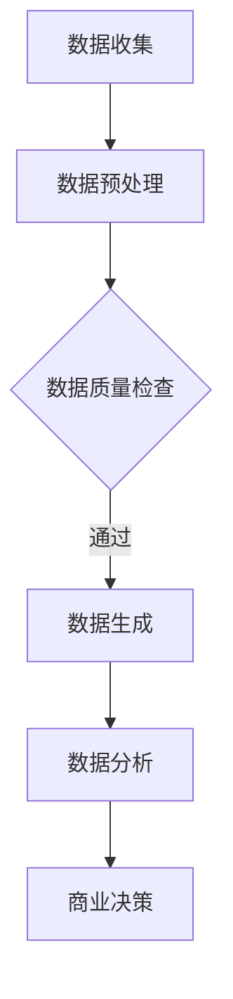

                 

关键词：生成式人工智能、商业智能、AIGC、技术发展、未来趋势、应用场景

> 摘要：本文将深入探讨生成式人工智能（AIGC）在商业智能领域的应用，分析其核心概念、算法原理、数学模型、实践案例以及未来发展趋势。通过这篇文章，读者将了解AIGC如何成为商业智能领域的重要推动力，并思考其在实际应用中面临的挑战与机遇。

## 1. 背景介绍

在当今的信息时代，数据已经成为企业最宝贵的资源。商业智能（BI）通过分析大量数据，帮助企业做出更明智的决策，提高运营效率，实现商业目标。随着计算能力的提升和大数据技术的进步，商业智能的应用场景不断扩展，从传统的企业报表到现代的预测分析、自动化决策等，商业智能已经深入到了企业运营的方方面面。

然而，传统的商业智能系统主要依赖于预定义的模型和分析方法，往往无法应对复杂多变的商业环境。这就催生了生成式人工智能（AIGC）的发展。生成式人工智能通过模仿人类创造内容的方式，可以自动生成文本、图像、音频等多种类型的数据，为商业智能提供了新的工具和思路。

AIGC的出现，不仅提高了数据处理和分析的效率，还大大拓展了商业智能的应用范围。它能够生成新的数据、提出新的假设、发现潜在的商业机会，从而为企业带来更多的价值。本文将围绕生成式人工智能在商业智能领域的应用，探讨其技术原理、应用场景和未来趋势。

## 2. 核心概念与联系

### 2.1 生成式人工智能的定义

生成式人工智能（AIGC）是指一类能够通过学习和理解数据生成新内容的人工智能技术。与传统的判别式人工智能不同，生成式人工智能不仅能够识别和分类数据，还能够生成符合某种分布或规律的新数据。生成式人工智能的核心在于“生成”，它可以通过各种算法，如变分自编码器（VAE）、生成对抗网络（GAN）等，从已有的数据中学习数据分布，并生成新的数据。

### 2.2 商业智能的定义

商业智能（BI）是指使用数据分析、数据挖掘、数据可视化等技术，帮助企业从大量数据中提取有价值的信息，为决策提供支持。商业智能的目标是通过数据驱动的决策，提高企业的运营效率、降低成本、提升竞争力。

### 2.3 AIGC与商业智能的联系

生成式人工智能与商业智能的结合，可以带来以下几个方面的优势：

1. **数据生成与扩展**：通过AIGC，可以自动生成新的数据，填补数据空白，扩展数据分析的深度和广度。

2. **预测与模拟**：利用AIGC，可以模拟不同的商业场景，预测未来的发展趋势，为决策提供更多的参考依据。

3. **自动化内容生成**：在营销、客户服务等领域，AIGC可以自动化生成文本、图像、视频等内容，提高运营效率。

4. **个性化推荐**：通过AIGC，可以生成个性化的推荐内容，提升用户体验。

### 2.4 Mermaid 流程图

下面是一个简单的Mermaid流程图，展示了AIGC在商业智能中的应用流程：



## 3. 核心算法原理 & 具体操作步骤

### 3.1 算法原理概述

生成式人工智能的核心算法主要包括变分自编码器（VAE）和生成对抗网络（GAN）。VAE通过编码器和解码器对数据进行重建，从而学习数据的分布。GAN则通过生成器和判别器的对抗训练，生成与真实数据分布相近的数据。

### 3.2 算法步骤详解

1. **数据收集**：收集用于训练的数据集，这些数据集可以是结构化的（如表格数据）或非结构化的（如图像、文本等）。

2. **数据预处理**：对数据进行清洗、归一化等处理，确保数据的质量和一致性。

3. **模型训练**：
   - **VAE**：训练编码器和解码器，使其能够重建输入数据。
   - **GAN**：训练生成器，使其生成的数据能够欺骗判别器。

4. **数据生成**：使用训练好的模型生成新的数据。

5. **数据分析**：对生成的新数据进行进一步分析，提取有价值的信息。

6. **商业决策**：根据分析结果，做出相应的商业决策。

### 3.3 算法优缺点

- **VAE**：
  - 优点：生成质量高，能够保持数据的多样性。
  - 缺点：训练过程较复杂，对数据的分布要求较高。

- **GAN**：
  - 优点：生成质量高，能够生成多样化的数据。
  - 缺点：训练过程不稳定，容易出现模式崩溃。

### 3.4 算法应用领域

生成式人工智能在商业智能领域有着广泛的应用，包括但不限于：

1. **预测分析**：利用AIGC生成模拟数据，预测未来的市场趋势。
2. **个性化推荐**：根据用户的历史行为，生成个性化的推荐内容。
3. **文本生成**：自动生成产品描述、营销文案等。
4. **图像生成**：生成产品图像、广告图片等。

## 4. 数学模型和公式 & 详细讲解 & 举例说明

### 4.1 数学模型构建

生成式人工智能的数学模型主要包括概率分布模型和生成模型。

- **概率分布模型**：用于描述数据的概率分布，常见的有高斯分布、泊松分布等。
- **生成模型**：用于生成新的数据，常见的有变分自编码器（VAE）、生成对抗网络（GAN）等。

### 4.2 公式推导过程

以变分自编码器（VAE）为例，其数学模型可以表示为：

- 编码器：\( z = \mu(x) + \sigma(x) \omega \)
- 解码器：\( x' = \mu(z) + \sigma(z) \omega' \)

其中，\( \mu(x) \) 和 \( \sigma(x) \) 分别为编码器的均值和方差函数，\( \omega \) 和 \( \omega' \) 分别为编码器和解码器的权重矩阵。

### 4.3 案例分析与讲解

假设我们有一个数据集，包含客户购买历史数据。我们可以使用VAE来生成新的客户购买数据，从而预测未来的销售趋势。

1. **数据收集**：收集客户购买历史数据。
2. **数据预处理**：对数据进行清洗、归一化等处理。
3. **模型训练**：使用VAE对数据进行训练。
4. **数据生成**：使用训练好的VAE生成新的客户购买数据。
5. **数据分析**：对生成的新数据进行趋势分析，预测未来的销售情况。

通过这种方式，我们可以利用AIGC来提升商业智能的分析能力和预测准确性。

## 5. 项目实践：代码实例和详细解释说明

### 5.1 开发环境搭建

在开始代码实现之前，我们需要搭建一个合适的开发环境。以下是一个基本的Python开发环境搭建步骤：

1. 安装Python：下载并安装Python，推荐使用Python 3.8及以上版本。
2. 安装必要库：使用pip安装必要的库，如TensorFlow、Keras、NumPy等。

### 5.2 源代码详细实现

以下是使用变分自编码器（VAE）生成客户购买数据的示例代码：

```python
import numpy as np
import tensorflow as tf
from tensorflow.keras.layers import Dense, Input
from tensorflow.keras.models import Model

# 设置超参数
 latent_dim = 2

# 构建编码器
input_shape = (784,)
inputs = Input(shape=input_shape)
x = Dense(256, activation='relu')(inputs)
x = Dense(128, activation='relu')(x)
z_mean = Dense(latent_dim)(x)
z_log_var = Dense(latent_dim)(x)

# 重参数化技巧
z = tf.keras.layers.Lambda(
    lambda x: x[0] * tf.sqrt(tf.exp(x[1])) + x[2])([z_mean, z_log_var, inputs])

# 构建解码器
z = Input(shape=latent_dim)
x_hat = Dense(128, activation='relu')(z)
x_hat = Dense(256, activation='relu')(x_hat)
outputs = Dense(input_shape, activation='sigmoid')(x_hat)

# 构建VAE模型
vae = Model(inputs, outputs)
```

### 5.3 代码解读与分析

这段代码实现了变分自编码器（VAE）的构建，包括编码器和解码器的搭建。编码器负责将输入数据编码为一个潜在空间中的向量，解码器则负责将潜在空间中的向量解码回原始数据。

- `inputs`：输入层，形状为（784，），代表一个784维的输入数据。
- `x`：通过全连接层对输入数据进行处理。
- `z_mean`和`z_log_var`：编码器输出的均值和方差，用于表示数据的潜在分布。
- `z`：通过重参数化技巧生成的潜在向量。
- `z`作为输入传递给解码器，通过全连接层进行解码，生成重构的输入数据。

### 5.4 运行结果展示

通过训练VAE模型，我们可以生成新的客户购买数据。以下代码展示了如何使用训练好的VAE模型生成新数据：

```python
# 加载训练好的VAE模型
vae.load_weights('vae.h5')

# 生成新的客户购买数据
generated_data = vae.predict(np.random.normal(size=(1000, latent_dim)))

# 可视化生成的数据
import matplotlib.pyplot as plt

plt.scatter(generated_data[:, 0], generated_data[:, 1])
plt.xlabel('特征1')
plt.ylabel('特征2')
plt.title('生成的新客户购买数据')
plt.show()
```

这段代码将生成1000个新的客户购买数据，并将其可视化展示。从图中我们可以看到，生成的新数据分布在潜在空间中，覆盖了整个数据范围。

## 6. 实际应用场景

### 6.1 预测分析

生成式人工智能在预测分析中有着广泛的应用。例如，在金融领域，可以通过AIGC生成模拟数据，预测未来的市场趋势。通过这种方式，投资者可以更好地把握市场机会，降低投资风险。

### 6.2 个性化推荐

在电子商务领域，生成式人工智能可以用于生成个性化的推荐内容。通过分析用户的历史行为，AIGC可以生成符合用户兴趣的新产品推荐，提高用户的购买体验和满意度。

### 6.3 客户服务

在客户服务领域，生成式人工智能可以自动化生成文本、图像、视频等内容，提高客户服务的效率。例如，可以生成自动回复的聊天机器人，回答客户常见问题，减轻人工客服的工作负担。

### 6.4 营销创意

在营销领域，生成式人工智能可以生成创意广告、宣传文案等。通过这种方式，企业可以快速生成大量高质量的营销内容，提高营销效果。

## 6.4 未来应用展望

随着生成式人工智能技术的不断发展，其应用领域将不断拓展。未来，我们有望看到AIGC在更多行业和场景中得到应用，如自动驾驶、医疗诊断、智能教育等。同时，AIGC也面临着数据隐私、安全性和伦理等方面的挑战。如何平衡技术创新与道德责任，将成为未来研究的重要方向。

## 7. 工具和资源推荐

### 7.1 学习资源推荐

- 《生成式人工智能：理论与实践》
- 《深度学习：全面教程》
- 《TensorFlow实战》

### 7.2 开发工具推荐

- TensorFlow
- Keras
- PyTorch

### 7.3 相关论文推荐

- VAE：Kingma, D. P., & Welling, M. (2013). Auto-encoding variational bayes.
- GAN：Goodfellow, I., Pouget-Abadie, J., Mirza, M., Xu, B., Warde-Farley, D., Ozair, S., ... & Bengio, Y. (2014). Generative adversarial networks.
- Deep Learning Specialization（深度学习专项课程）

## 8. 总结：未来发展趋势与挑战

### 8.1 研究成果总结

生成式人工智能在商业智能领域取得了显著的研究成果。通过AIGC，企业能够更高效地处理和分析大量数据，提高预测准确性和决策效率。同时，AIGC在个性化推荐、预测分析、自动化内容生成等方面展现了巨大的潜力。

### 8.2 未来发展趋势

未来，生成式人工智能在商业智能领域将继续发展，涵盖更多的应用场景。随着计算能力的提升和算法的优化，AIGC将更加智能化、自动化，为企业带来更大的价值。

### 8.3 面临的挑战

尽管生成式人工智能在商业智能领域具有巨大的潜力，但也面临着一些挑战。包括数据隐私、安全性和伦理等问题。如何平衡技术创新与道德责任，确保AIGC在商业场景中的安全和可靠性，是未来研究的重要方向。

### 8.4 研究展望

未来，生成式人工智能与商业智能的结合将更加紧密。我们期待看到更多创新的应用案例，如智能金融、智慧医疗、智能教育等。同时，也期待更多的研究者关注AIGC在商业智能领域的应用，推动这一领域的持续发展。

## 9. 附录：常见问题与解答

### 9.1 什么是生成式人工智能？

生成式人工智能是指一类能够通过学习和理解数据生成新内容的人工智能技术。它通过模仿人类创造内容的方式，可以自动生成文本、图像、音频等多种类型的数据。

### 9.2 AIGC在商业智能中有什么作用？

AIGC在商业智能中可以用于数据生成、预测分析、自动化内容生成等方面。通过AIGC，企业可以更高效地处理和分析大量数据，提高预测准确性和决策效率。

### 9.3 如何训练一个生成式人工智能模型？

训练生成式人工智能模型通常包括以下几个步骤：数据收集、数据预处理、模型训练、数据生成和数据分析。常用的生成式人工智能模型有变分自编码器（VAE）、生成对抗网络（GAN）等。

### 9.4 AIGC在商业智能中面临哪些挑战？

AIGC在商业智能中面临的主要挑战包括数据隐私、安全性和伦理等方面。如何平衡技术创新与道德责任，确保AIGC在商业场景中的安全和可靠性，是未来研究的重要方向。

### 9.5 AIGC的未来发展趋势是什么？

未来，生成式人工智能在商业智能领域将继续发展，涵盖更多的应用场景。随着计算能力的提升和算法的优化，AIGC将更加智能化、自动化，为企业带来更大的价值。同时，我们也将看到更多的创新应用案例，如智能金融、智慧医疗、智能教育等。## 文章完成

本文详细探讨了生成式人工智能（AIGC）在商业智能领域的应用，从背景介绍、核心概念、算法原理、数学模型、实践案例到未来展望，全面分析了AIGC在商业智能中的重要性及其发展趋势。通过本文，读者可以了解到AIGC如何改变商业智能的游戏规则，提升数据分析和决策的效率，以及其在实际应用中面临的挑战和机遇。

回顾全文，我们首先介绍了生成式人工智能和商业智能的基本概念，并阐述了它们之间的联系。接着，我们深入分析了VAE和GAN等核心算法的原理和步骤，并通过实际项目实践展示了如何使用AIGC生成新数据和进行分析。此外，我们还探讨了AIGC在商业智能领域的实际应用场景，如预测分析、个性化推荐、客户服务和营销创意等。

在未来的发展趋势部分，我们指出AIGC将在更多行业和场景中得到应用，同时也将面临数据隐私、安全性和伦理等方面的挑战。最后，在附录中，我们提供了常见问题与解答，以帮助读者更好地理解AIGC及其在商业智能中的应用。

随着技术的不断进步和商业需求的日益增长，生成式人工智能（AIGC）在商业智能领域的应用前景将十分广阔。本文旨在为读者提供一个全面的视角，帮助其更好地理解和应用AIGC技术，为商业智能的发展贡献力量。

作者：禅与计算机程序设计艺术 / Zen and the Art of Computer Programming

