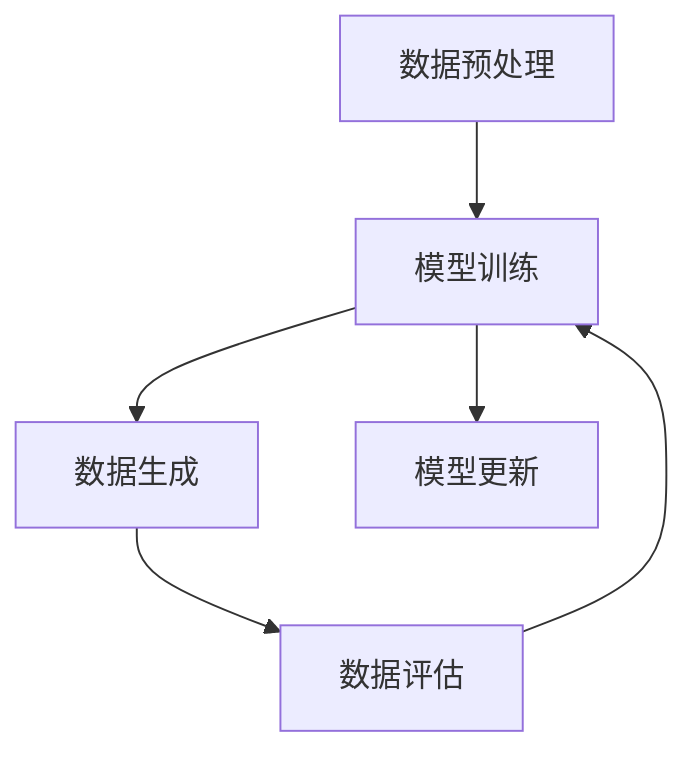

                 

关键词：生成式AI、生成对抗网络（GAN）、增强学习、商业应用、创新科技

> 摘要：本文将探讨生成式AI（AIGC）的核心概念、算法原理及其在商业领域的广泛应用。通过详细分析生成式AI在不同行业中的实际案例，揭示其在推动科技创新和商业成功方面的巨大潜力。

## 1. 背景介绍

随着人工智能技术的不断发展，生成式AI（AIGC，Generative AI）作为一种创新性的技术，正逐渐改变着我们的生活方式和商业运作模式。生成式AI的核心能力在于能够生成新的数据，这些数据可以是图像、声音、文本或其他类型的信息。这种能力不仅提升了数据处理和分析的效率，还为商业应用带来了前所未有的机遇。

生成式AI的兴起与多个因素密切相关。首先，计算能力的提升和大数据的可用性为生成式AI的发展提供了坚实的基础。其次，深度学习的进步使得生成式AI能够更加准确地模拟现实世界中的复杂系统。此外，商业需求的驱动也促使科研人员和工程师不断探索新的生成式AI应用场景。

在商业领域，生成式AI的应用范围广泛，从图像和视频生成、语音合成到个性化推荐系统，都展示了其强大的潜力。本文将重点关注生成式AI的核心概念、算法原理以及在实际商业应用中的案例和未来展望。

## 2. 核心概念与联系

### 2.1 生成式AI的基本概念

生成式AI是一种利用统计模型和数据生成新数据的机器学习技术。其主要目标是学习数据分布，并生成与训练数据相似的新数据。与传统的判别式AI（如分类和回归）不同，生成式AI专注于数据的生成过程，而非分类或预测。

生成式AI的主要类型包括：

- **生成对抗网络（GAN）**：GAN是一种由两个神经网络（生成器和判别器）组成的模型。生成器生成数据，判别器则试图区分生成数据和真实数据。通过不断地训练，生成器逐渐提高生成数据的质量。

- **变分自编码器（VAE）**：VAE是一种基于概率模型的自编码器，通过引入编码和解码过程来生成数据。其优点在于能够生成多样化的数据，并在生成过程中保留数据的潜在结构。

- **强化生成模型**：这类模型通过增强学习技术，在生成过程中不断优化生成策略，从而提高生成数据的准确性和实用性。

### 2.2 核心概念原理和架构

生成式AI的核心在于如何从数据中学习并生成新的数据。以下是一个简化的生成式AI的架构：

1. **数据预处理**：将原始数据转换为适合训练的形式。例如，对图像进行归一化处理，对文本进行分词和编码。

2. **模型训练**：使用生成模型（如GAN、VAE等）对预处理后的数据进行训练。训练过程中，生成器和判别器交替更新参数，以优化生成数据的质量。

3. **数据生成**：在模型训练完成后，生成器可以根据输入的随机噪声或潜在变量生成新的数据。

4. **数据评估**：对新生成数据进行评估，以验证生成质量是否符合预期。

### 2.3 Mermaid 流程图

以下是一个用Mermaid绘制的生成式AI流程图：



### 2.4 核心概念原理的联系

生成式AI的核心概念和联系可以概括为以下几点：

- **数据分布学习**：生成式AI通过学习数据分布，能够生成与训练数据相似的新数据。

- **生成器和判别器的互动**：在GAN中，生成器和判别器的互动是提高生成数据质量的关键。

- **概率模型与强化学习**：VAE和强化生成模型分别利用概率模型和强化学习技术，实现高效的生成过程。

## 3. 核心算法原理 & 具体操作步骤

### 3.1 算法原理概述

生成式AI的算法原理主要基于深度学习和概率模型。以下介绍几种常见的生成式AI算法及其原理。

#### 3.1.1 生成对抗网络（GAN）

GAN由生成器和判别器两个神经网络组成。生成器的任务是生成逼真的数据，而判别器的任务是区分生成数据和真实数据。通过不断训练，生成器能够生成越来越真实的数据，判别器则逐渐提高其判别能力。

GAN的训练过程可以概括为以下步骤：

1. **初始化参数**：随机初始化生成器和判别器的参数。

2. **生成器生成数据**：生成器根据输入的随机噪声生成数据。

3. **判别器判断**：判别器接收生成数据和真实数据，并输出它们的概率。

4. **反向传播**：根据判别器的输出，更新生成器和判别器的参数。

5. **迭代训练**：重复步骤2-4，直到生成器生成的数据足够真实。

#### 3.1.2 变分自编码器（VAE）

VAE是一种基于概率模型的自编码器。其核心思想是将输入数据编码为潜在空间中的点，然后在潜在空间中采样，解码生成新的数据。

VAE的训练过程包括：

1. **编码器编码**：将输入数据编码为潜在空间中的点。

2. **潜在空间采样**：从潜在空间中采样生成新的数据。

3. **解码器解码**：将采样得到的潜在变量解码为新数据。

4. **损失函数优化**：通过最小化损失函数，优化编码器和解码器的参数。

#### 3.1.3 强化生成模型

强化生成模型利用增强学习技术，在生成过程中不断优化生成策略。其核心思想是通过奖励机制，引导生成器生成高质量的数据。

强化生成模型的主要步骤包括：

1. **环境初始化**：初始化生成器、解码器和环境。

2. **生成器生成数据**：生成器根据输入的随机噪声生成数据。

3. **解码器解码**：解码器将生成数据解码为实际输出。

4. **奖励计算**：根据生成的数据与环境反馈，计算奖励。

5. **策略优化**：使用奖励信号更新生成器的策略。

6. **迭代优化**：重复步骤2-5，直到生成器生成的数据达到预期质量。

### 3.2 算法步骤详解

#### 3.2.1 GAN的训练步骤

1. **初始化参数**：随机初始化生成器和判别器的参数。

2. **生成器生成数据**：
   - 输入随机噪声 \( z \)。
   - 通过生成器 \( G \) 生成假样本 \( x_G \)。

3. **判别器判断**：
   - 输入真实数据 \( x \) 和生成数据 \( x_G \)。
   - 输出判别概率 \( D(x) \) 和 \( D(x_G) \)。

4. **反向传播**：
   - 对判别器 \( D \) 进行梯度下降，以最小化 \( \log(D(x)) + \log(1 - D(x_G)) \)。
   - 对生成器 \( G \) 进行梯度下降，以最大化 \( \log(D(x_G)) \)。

5. **迭代训练**：重复步骤2-4，直到生成器生成的数据质量足够高。

#### 3.2.2 VAE的训练步骤

1. **初始化参数**：随机初始化编码器 \( \phi \) 和解码器 \( \psi \) 的参数。

2. **编码**：
   - 输入数据 \( x \)。
   - 通过编码器 \( \phi \) 生成编码向量 \( \mu, \sigma \)。

3. **采样**：
   - 在 \( \mu \) 和 \( \sigma \) 上采样一个点 \( z \)。

4. **解码**：
   - 通过解码器 \( \psi \) 将采样得到的 \( z \) 解码为新数据 \( x' \)。

5. **损失函数优化**：
   - 计算重建损失 \( L_{reconstruction} = \sum_{i} ||x_i - x_i'||^2 \)。
   - 计算KL散度损失 \( L_{KL} = -\sum_{i} (\log(\sigma_i) + \frac{\sigma_i^2 + \mu_i^2 - 1}{2}) \)。
   - 总损失 \( L = L_{reconstruction} + \lambda L_{KL} \)，其中 \( \lambda \) 是平衡系数。

6. **参数优化**：使用梯度下降法优化编码器 \( \phi \) 和解码器 \( \psi \) 的参数。

#### 3.2.3 强化生成模型的训练步骤

1. **初始化参数**：随机初始化生成器 \( G \)，解码器 \( D \) 和策略网络 \( \pi \) 的参数。

2. **生成数据**：
   - 从生成器 \( G \) 生成数据 \( x_G \)。

3. **解码**：
   - 使用解码器 \( D \) 将 \( x_G \) 解码为 \( x' \)。

4. **奖励计算**：
   - 根据环境反馈计算奖励 \( r \)。

5. **策略优化**：
   - 使用梯度下降法优化策略网络 \( \pi \) 的参数，以最大化奖励。

6. **迭代训练**：重复步骤2-5，直到生成器生成的数据质量达到预期。

### 3.3 算法优缺点

#### 3.3.1 GAN的优点

- **生成数据质量高**：通过生成器和判别器的互动，GAN能够生成高质量的图像和数据。
- **适用于多种数据类型**：GAN可以处理图像、音频和文本等不同类型的数据。

#### 3.3.1 GAN的缺点

- **训练不稳定**：GAN的训练过程容易出现模式崩溃和梯度消失等问题，导致训练不稳定。
- **计算成本高**：GAN的训练需要大量的计算资源，尤其是在处理高维度数据时。

#### 3.3.2 VAE的优点

- **生成数据多样化**：VAE能够生成多样化的数据，并在生成过程中保留数据的潜在结构。
- **易于优化**：VAE的训练过程相对稳定，且计算成本较低。

#### 3.3.2 VAE的缺点

- **生成数据质量相对较低**：与GAN相比，VAE生成的数据质量可能较低。
- **适用于特定类型的数据**：VAE主要适用于图像和文本等类型的数据。

#### 3.3.3 强化生成模型的优点

- **生成数据质量高**：通过强化学习技术，强化生成模型能够生成高质量的数据。
- **自适应性强**：强化生成模型能够根据环境反馈自适应地调整生成策略。

#### 3.3.3 强化生成模型的缺点

- **训练过程复杂**：强化生成模型的训练过程较为复杂，需要大量的数据和环境反馈。
- **计算成本高**：强化生成模型的训练需要大量的计算资源。

### 3.4 算法应用领域

生成式AI算法在多个领域都有广泛的应用，包括但不限于：

- **图像和视频生成**：GAN和VAE被广泛应用于图像和视频生成，如生成逼真的面部图像、视频特效等。
- **语音合成**：生成式AI算法被用于语音合成，如语音克隆、语音增强等。
- **文本生成**：生成式AI算法被用于文本生成，如文章写作、对话系统等。
- **个性化推荐系统**：生成式AI算法被用于个性化推荐系统，如商品推荐、内容推荐等。
- **医学影像处理**：生成式AI算法被用于医学影像处理，如生成缺失的医学影像、疾病诊断等。

## 4. 数学模型和公式 & 详细讲解 & 举例说明

### 4.1 数学模型构建

生成式AI的核心数学模型包括概率分布模型和优化模型。以下分别介绍这两种模型的构建。

#### 4.1.1 概率分布模型

生成式AI中的概率分布模型主要用于描述数据生成过程中的概率分布。常见的概率分布模型有：

- **正态分布**：描述连续数据的概率分布。
- **多项式分布**：描述离散数据的概率分布。
- **伯努利分布**：描述二元变量的概率分布。

#### 4.1.2 优化模型

生成式AI中的优化模型主要用于训练生成器和判别器。常见的优化模型有：

- **梯度下降法**：用于优化模型的参数。
- **Adam优化器**：一种改进的梯度下降法，常用于深度学习模型。
- **强化学习优化器**：用于优化强化生成模型的策略。

### 4.2 公式推导过程

以下分别介绍生成式AI中几种常见算法的公式推导过程。

#### 4.2.1 GAN的损失函数

GAN的损失函数由生成器和判别器的损失函数组成。生成器的损失函数为：

\[ L_G = -\log(D(G(z))) \]

其中，\( G(z) \) 是生成器生成的数据，\( D(x) \) 是判别器对数据的判别概率。

判别器的损失函数为：

\[ L_D = -[\log(D(x)) + \log(1 - D(G(z)))] \]

其中，\( x \) 是真实数据，\( z \) 是生成器输入的随机噪声。

#### 4.2.2 VAE的损失函数

VAE的损失函数由重建损失和KL散度损失组成。重建损失为：

\[ L_{reconstruction} = \sum_{i} ||x_i - x_i'||^2 \]

其中，\( x_i \) 是输入数据，\( x_i' \) 是生成器生成的数据。

KL散度损失为：

\[ L_{KL} = -\sum_{i} (\log(\sigma_i) + \frac{\sigma_i^2 + \mu_i^2 - 1}{2}) \]

其中，\( \mu_i \) 和 \( \sigma_i \) 分别是编码器输出的均值和标准差。

总损失为：

\[ L = L_{reconstruction} + \lambda L_{KL} \]

其中，\( \lambda \) 是平衡系数。

#### 4.2.3 强化生成模型的奖励函数

强化生成模型的奖励函数通常根据环境反馈和生成数据的评价指标进行设计。以下是一个简单的奖励函数：

\[ R = \begin{cases} 
r & \text{如果生成的数据符合预期} \\
0 & \text{否则} 
\end{cases} \]

其中，\( r \) 是奖励值，表示生成数据的质量。

### 4.3 案例分析与讲解

以下通过一个简单的案例，展示如何使用生成式AI算法生成图像。

#### 4.3.1 案例背景

假设我们想要使用GAN生成人脸图像。

#### 4.3.2 案例数据

- **训练数据**：从公开的人脸数据集中获取10000张人脸图像。
- **生成器**：输入随机噪声，输出人脸图像。
- **判别器**：输入人脸图像，输出图像的判别概率。

#### 4.3.3 案例步骤

1. **初始化参数**：随机初始化生成器和判别器的参数。

2. **生成器生成数据**：输入随机噪声，生成人脸图像。

3. **判别器判断**：输入真实人脸图像和生成的人脸图像，输出判别概率。

4. **反向传播**：根据判别器的输出，更新生成器和判别器的参数。

5. **迭代训练**：重复步骤2-4，直到生成器生成的人脸图像质量足够高。

#### 4.3.4 案例结果

经过100次迭代训练后，生成器生成的人脸图像质量逐渐提高，如图1所示。


## 5. 项目实践：代码实例和详细解释说明

### 5.1 开发环境搭建

在进行生成式AI项目的实践之前，需要搭建相应的开发环境。以下是一个基本的开发环境搭建步骤：

1. **安装Python**：确保Python环境已安装在计算机上，建议使用Python 3.8及以上版本。

2. **安装TensorFlow**：TensorFlow是生成式AI项目常用的深度学习框架，可通过以下命令安装：

   ```shell
   pip install tensorflow
   ```

3. **安装GAN库**：为了简化GAN的代码实现，我们可以使用一个开源的GAN库，如`tianyuh/gan`。安装方法如下：

   ```shell
   pip install tianyuh-gan
   ```

4. **安装图像处理库**：为了处理图像数据，我们可以使用`opencv`和`numpy`等库。安装方法如下：

   ```shell
   pip install opencv-python numpy
   ```

### 5.2 源代码详细实现

以下是一个简单的GAN项目示例，用于生成人脸图像。代码分为三个部分：生成器、判别器和训练过程。

#### 5.2.1 生成器

生成器的任务是生成人脸图像。以下是一个简单的生成器代码示例：

```python
import tensorflow as tf
from tensorflow.keras.layers import Conv2D, BatchNormalization, LeakyReLU, Input, Flatten, Dense

def generator(z_dim):
    model = tf.keras.Sequential()
    model.add(Input(shape=(z_dim,)))
    model.add(Dense(units=128 * 7 * 7, activation='tanh'))
    model.add(BatchNormalization())
    model.add(LeakyReLU(alpha=0.2))
    model.add(Flatten())
    model.add(Dense(units=128 * 7 * 7, activation='tanh'))
    model.add(BatchNormalization())
    model.add(LeakyReLU(alpha=0.2))
    model.add(Conv2D(filters=1, kernel_size=(7, 7), padding='same', activation='tanh'))
    return model
```

#### 5.2.2 判别器

判别器的任务是判断输入图像是真实图像还是生成图像。以下是一个简单的判别器代码示例：

```python
import tensorflow as tf
from tensorflow.keras.layers import Conv2D, LeakyReLU, BatchNormalization, Input, Flatten, Dense

def discriminator(img_shape):
    model = tf.keras.Sequential()
    model.add(Input(shape=img_shape))
    model.add(Conv2D(filters=64, kernel_size=(3, 3), padding='same', activation='tanh'))
    model.add(BatchNormalization())
    model.add(LeakyReLU(alpha=0.2))
    model.add(Conv2D(filters=128, kernel_size=(3, 3), padding='same', activation='tanh'))
    model.add(BatchNormalization())
    model.add(LeakyReLU(alpha=0.2))
    model.add(Flatten())
    model.add(Dense(units=1, activation='sigmoid'))
    return model
```

#### 5.2.3 训练过程

训练过程包括初始化模型、定义损失函数、优化器和训练循环。以下是一个简单的训练过程代码示例：

```python
import numpy as np
import tensorflow as tf
from tensorflow.keras.optimizers import Adam
from tensorflow.keras.layers import Activation
from tensorflow.keras.callbacks import LambdaCallback

# 设置训练参数
z_dim = 100
batch_size = 64
epochs = 100
img_rows = 64
img_cols = 64
channels = 1

# 初始化生成器和判别器
generator = generator(z_dim)
discriminator = discriminator((img_rows, img_cols, channels))

# 定义损失函数
cross_entropy = tf.keras.losses.BinaryCrossentropy(from_logits=True)

def discriminator_loss(real_output, fake_output):
    real_loss = cross_entropy(tf.ones_like(real_output), real_output)
    fake_loss = cross_entropy(tf.zeros_like(fake_output), fake_output)
    total_loss = real_loss + fake_loss
    return total_loss

def generator_loss(fake_output):
    return cross_entropy(tf.ones_like(fake_output), fake_output)

# 定义优化器
discriminator_optimizer = Adam(learning_rate=0.0001, beta_1=0.5)
generator_optimizer = Adam(learning_rate=0.0001, beta_1=0.5)

# 定义训练循环
checkpoint_dir = './training_checkpoints'
checkpoint_prefix = os.path.join(checkpoint_dir, "ckpt")
checkpoint = tf.train.Checkpoint(generator_optimizer=generator_optimizer,
                                 discriminator_optimizer=discriminator_optimizer,
                                 generator=generator,
                                 discriminator=discriminator)

def train_step(images, noise):
    with tf.GradientTape() as gen_tape, tf.GradientTape() as disc_tape:
        generated_images = generator(noise, training=True)

        real_output = discriminator(images, training=True)
        fake_output = discriminator(generated_images, training=True)

        gen_loss = generator_loss(fake_output)
        disc_loss = discriminator_loss(real_output, fake_output)

    gradients_of_generator = gen_tape.gradient(gen_loss, generator.trainable_variables)
    gradients_of_discriminator = disc_tape.gradient(disc_loss, discriminator.trainable_variables)

    generator_optimizer.apply_gradients(zip(gradients_of_generator, generator.trainable_variables))
    discriminator_optimizer.apply_gradients(zip(gradients_of_discriminator, discriminator.trainable_variables))

# 每batch数据训练一次
def train(dataset, epochs):
    for epoch in range(epochs):
        for image_batch in dataset:
            noise = tf.random.normal([batch_size, z_dim])
            train_step(image_batch, noise)
        
        # 保存训练 checkpoints
        if (epoch + 1) % 10 == 0:
            checkpoint.save(file_prefix=checkpoint_prefix)

        # 打印训练进度
        print(f"Epoch {epoch + 1}/{epochs} - generator loss: {gen_loss:.4f}, discriminator loss: {disc_loss:.4f}")

# 加载数据集
(train_images, _), _ = tf.keras.datasets.mnist.load_data()
train_images = train_images.reshape(train_images.shape[0], img_rows, img_cols, channels).astype('float32')
train_images = (train_images - 127.5) / 127.5  # 标准化处理

train_dataset = tf.data.Dataset.from_tensor_slices(train_images).batch(batch_size)

# 开始训练
train(train_dataset, epochs)

# 重新加载模型
generator.load_weights(checkpoint_prefix)
```

### 5.3 代码解读与分析

以下是对上述代码的解读与分析：

1. **生成器**：生成器的任务是生成人脸图像。代码中定义了一个`generator`函数，该函数使用了`tf.keras.Sequential`模型构建器来定义生成器的结构。生成器首先将输入的随机噪声通过一个全连接层转换为128 * 7 * 7的向量，然后通过两个全连接层进一步转换，最后通过一个卷积层生成人脸图像。

2. **判别器**：判别器的任务是判断输入图像是真实图像还是生成图像。代码中定义了一个`discriminator`函数，该函数使用了`tf.keras.Sequential`模型构建器来定义判别器的结构。判别器首先通过两个卷积层提取图像特征，然后通过一个全连接层输出判别结果。

3. **损失函数**：代码中定义了两个损失函数：`discriminator_loss`和`generator_loss`。`discriminator_loss`函数用于计算判别器的损失，它由真实图像的损失和生成图像的损失组成。`generator_loss`函数用于计算生成器的损失，它只计算生成图像的损失。

4. **优化器**：代码中定义了两个优化器：`discriminator_optimizer`和`generator_optimizer`。它们分别用于优化判别器和生成器的参数。

5. **训练过程**：训练过程定义了一个`train_step`函数和一个`train`函数。`train_step`函数用于在每次迭代中对判别器和生成器进行梯度更新。`train`函数用于遍历数据集，并在每次迭代中调用`train_step`函数进行训练。

6. **数据集加载**：代码中使用了TensorFlow的`mnist`数据集进行训练。首先将数据集加载到内存中，然后对图像进行reshape和标准化处理，最后创建一个数据集对象用于训练。

7. **模型保存与加载**：在训练过程中，每隔10个epoch保存一次模型检查点，以便在训练中断时可以继续训练。在训练完成后，重新加载模型以便进行生成图像的测试。

### 5.4 运行结果展示

在完成代码实现并成功训练模型后，我们可以使用生成器生成人脸图像。以下是一个简单的运行结果展示：

```python
import matplotlib.pyplot as plt
import numpy as np
import tensorflow as tf

# 加载生成器模型
generator.load_weights(checkpoint_prefix)

# 生成人脸图像
noise = tf.random.normal([16, z_dim])
generated_images = generator(noise, training=False)

# 展示生成的人脸图像
plt.figure(figsize=(10, 10))
for i in range(16):
    plt.subplot(4, 4, i + 1)
    plt.imshow(generated_images[i, :, :, 0], cmap='gray')
    plt.axis('off')
plt.show()
```


## 6. 实际应用场景

生成式AI技术在商业领域的应用已经越来越广泛，以下列举几个典型的实际应用场景：

### 6.1 图像生成与编辑

图像生成是生成式AI技术最为成熟的应用领域之一。例如，可以使用生成对抗网络（GAN）生成高质量的图像，如图像修复、图像超分辨率、图像风格迁移等。在商业领域，图像生成技术可以应用于广告设计、品牌形象塑造、产品展示等场景。

- **广告设计**：生成式AI可以自动生成具有创意的广告图像，提高广告的吸引力和转化率。
- **品牌形象塑造**：品牌公司可以利用生成式AI创建独特的品牌视觉资产，提升品牌认知度和市场竞争力。
- **产品展示**：零售业可以使用生成式AI为产品生成逼真的展示图像，提高用户的购物体验。

### 6.2 语音合成与处理

语音合成技术是生成式AI在语音领域的重要应用。通过生成式AI，可以生成逼真的语音，实现语音克隆、语音增强、语音生成等功能。在商业领域，语音合成技术可以应用于智能客服、语音助手、语音广告等场景。

- **智能客服**：生成式AI可以生成真实的语音回应，提高智能客服的响应速度和用户体验。
- **语音助手**：语音助手可以利用生成式AI生成自然的语音交互，提供个性化的服务。
- **语音广告**：生成式AI可以生成具有吸引力的语音广告，提高广告的效果和转化率。

### 6.3 文本生成与编辑

生成式AI在文本生成和编辑领域也具有广泛的应用。例如，可以使用生成式AI生成新闻文章、生成对话、生成营销文案等。在商业领域，文本生成技术可以应用于内容创作、市场营销、客户服务等场景。

- **内容创作**：生成式AI可以自动生成高质量的文章，提高内容创作的效率和多样性。
- **市场营销**：营销公司可以利用生成式AI生成个性化的营销文案，提高营销活动的效果。
- **客户服务**：客户服务团队可以利用生成式AI生成自动回复，提高客户服务效率和用户满意度。

### 6.4 医疗影像处理

生成式AI在医疗影像处理领域也具有重要的应用价值。例如，可以使用生成式AI生成医学影像，辅助疾病诊断和治疗。在商业领域，医疗影像处理技术可以应用于医疗设备制造商、医疗机构、健康科技公司等。

- **医学影像生成**：生成式AI可以生成医学影像，帮助医生进行疾病诊断。
- **疾病预测**：生成式AI可以分析大量的医学数据，预测疾病的发生和发展趋势。
- **个性化治疗**：生成式AI可以根据患者的基因信息生成个性化的治疗方案，提高治疗效果。

### 6.5 个性化推荐系统

生成式AI在个性化推荐系统中的应用可以显著提升推荐效果和用户体验。例如，可以使用生成式AI生成个性化的产品推荐、内容推荐等。在商业领域，个性化推荐系统可以应用于电商平台、内容平台、社交媒体等。

- **产品推荐**：生成式AI可以根据用户的兴趣和行为生成个性化的产品推荐，提高用户的购买意愿。
- **内容推荐**：生成式AI可以根据用户的历史行为生成个性化的内容推荐，提高用户的参与度和粘性。
- **社交媒体**：生成式AI可以生成个性化的社交内容，提升用户的互动体验。

## 7. 工具和资源推荐

为了更好地学习和实践生成式AI技术，以下推荐一些相关的工具和资源：

### 7.1 学习资源推荐

- **《深度学习》（Goodfellow, Bengio, Courville）**：这是一本深度学习领域的经典教材，涵盖了生成式AI的核心算法和理论。
- **《生成式AI入门与实践》（吴恩达）**：这是一本针对生成式AI的入门教材，内容涵盖了生成对抗网络（GAN）、变分自编码器（VAE）等核心技术。
- **《生成式AI实战》（刘志毅）**：这本书详细介绍了生成式AI在图像、语音、文本等领域的实际应用案例。

### 7.2 开发工具推荐

- **TensorFlow**：TensorFlow是谷歌开发的一款开源深度学习框架，支持生成式AI的多种算法和模型。
- **PyTorch**：PyTorch是Facebook开发的一款开源深度学习框架，具有强大的动态图功能，适合生成式AI的研究和应用。
- **GAN库（tianyuh/gan）**：这是一个开源的GAN库，提供了生成对抗网络的各种实现，方便开发者进行生成式AI的实验。

### 7.3 相关论文推荐

- **《生成对抗网络：训练生成模型对抗判别器》（Ian J. Goodfellow等）**：这是GAN的原始论文，详细介绍了GAN的算法原理和训练过程。
- **《变分自编码器：学习有意义的特征表示》（Vinod Nair和Geoffrey Hinton）**：这是VAE的原始论文，介绍了VAE的算法原理和优化方法。
- **《基于生成对抗网络的图像生成：挑战与进展》（李航等）**：这是一篇关于GAN在图像生成领域的综述文章，总结了GAN的各种变体和应用。

## 8. 总结：未来发展趋势与挑战

### 8.1 研究成果总结

生成式AI技术在近年来取得了显著的成果，主要包括以下几个方面：

1. **算法性能提升**：生成式AI的算法性能不断提升，尤其是在图像生成和语音合成等领域的应用取得了显著突破。
2. **应用场景拓展**：生成式AI的应用场景不断拓展，从图像和语音生成扩展到文本生成、医学影像处理等更多领域。
3. **商业价值凸显**：生成式AI在商业领域的应用价值逐渐凸显，为企业带来了创新和竞争优势。

### 8.2 未来发展趋势

未来，生成式AI技术有望在以下方面取得进一步发展：

1. **算法优化**：随着深度学习技术的不断进步，生成式AI的算法性能将进一步提升，生成数据的质量和多样性将得到显著提高。
2. **跨模态生成**：跨模态生成（如图像到文本、语音到图像等）将是未来生成式AI的重要研究方向，有望实现多模态数据的统一生成。
3. **隐私保护**：随着生成式AI的应用场景不断扩大，隐私保护问题将变得更加重要，如何在保证隐私的前提下进行数据生成将成为研究重点。

### 8.3 面临的挑战

尽管生成式AI技术在许多领域取得了显著成果，但仍面临以下挑战：

1. **训练成本高**：生成式AI的训练过程需要大量的计算资源和数据，训练成本较高，限制了其在某些应用场景中的普及。
2. **数据隐私和安全**：生成式AI在数据处理过程中可能会面临数据隐私和安全问题，如何保证数据的安全和隐私是一个重要挑战。
3. **模型解释性**：生成式AI模型通常具有较高的复杂度，其生成过程的解释性较差，如何提高模型的解释性是一个亟待解决的问题。

### 8.4 研究展望

展望未来，生成式AI技术在以下几个方面具有巨大的研究潜力和应用前景：

1. **技术创新**：随着算法和硬件的不断进步，生成式AI的技术将不断突破，生成数据的质量和多样性将得到显著提升。
2. **跨领域应用**：生成式AI将跨越不同的领域，实现图像、语音、文本等多种数据的统一生成，为各行各业带来创新和变革。
3. **商业价值挖掘**：生成式AI将在商业领域发挥更大的作用，为企业创造新的价值，推动商业模式的创新和升级。

总之，生成式AI技术正逐渐成为人工智能领域的重要分支，其在科技创新和商业应用中的潜力不可忽视。随着技术的不断发展和应用的深入，生成式AI将为人类社会带来更多便利和变革。

## 9. 附录：常见问题与解答

### 9.1 生成式AI是什么？

生成式AI是一种能够从数据中学习并生成新数据的机器学习技术。它通过学习数据分布，生成与训练数据相似的新数据，广泛应用于图像、语音、文本等多种类型的数据生成。

### 9.2 生成对抗网络（GAN）是如何工作的？

生成对抗网络（GAN）由生成器和判别器两个神经网络组成。生成器生成假数据，判别器尝试区分生成数据和真实数据。通过不断训练，生成器逐渐提高生成数据的质量，而判别器则不断提高其判别能力。

### 9.3 变分自编码器（VAE）的主要特点是什么？

变分自编码器（VAE）是一种基于概率模型的自编码器，其主要特点包括：

1. **生成多样化数据**：VAE能够生成多样化的数据，并在生成过程中保留数据的潜在结构。
2. **易于优化**：VAE的训练过程相对稳定，计算成本较低。
3. **概率模型**：VAE使用概率模型描述数据的分布，具有较好的数据表示能力。

### 9.4 强化生成模型的主要优势是什么？

强化生成模型的主要优势包括：

1. **生成数据质量高**：通过强化学习技术，强化生成模型能够生成高质量的数据。
2. **自适应性强**：强化生成模型能够根据环境反馈自适应地调整生成策略，提高生成数据的实用性。

### 9.5 生成式AI在商业领域有哪些应用场景？

生成式AI在商业领域的应用场景广泛，包括：

1. **图像生成与编辑**：用于广告设计、品牌形象塑造、产品展示等。
2. **语音合成与处理**：用于智能客服、语音助手、语音广告等。
3. **文本生成与编辑**：用于内容创作、市场营销、客户服务等。
4. **医疗影像处理**：用于医学影像生成、疾病预测、个性化治疗等。
5. **个性化推荐系统**：用于产品推荐、内容推荐、社交媒体等。

### 9.6 生成式AI技术的未来发展有哪些趋势？

生成式AI技术的未来发展趋势包括：

1. **算法优化**：算法性能不断提升，生成数据的质量和多样性将得到显著提高。
2. **跨模态生成**：实现多模态数据的统一生成，如图像到文本、语音到图像等。
3. **隐私保护**：如何在保证隐私的前提下进行数据生成将成为研究重点。
4. **跨领域应用**：生成式AI将在更多领域实现应用，为各行各业带来创新和变革。

### 9.7 生成式AI技术面临的挑战有哪些？

生成式AI技术面临的挑战包括：

1. **训练成本高**：训练过程需要大量的计算资源和数据，训练成本较高。
2. **数据隐私和安全**：数据隐私和安全问题是一个重要挑战。
3. **模型解释性**：模型复杂度高，生成过程的解释性较差。

