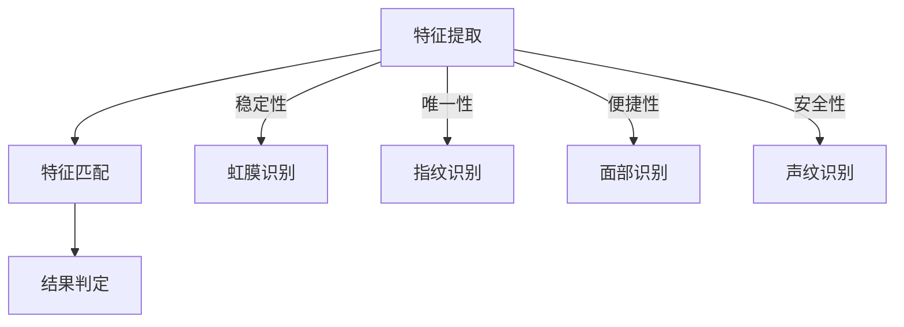
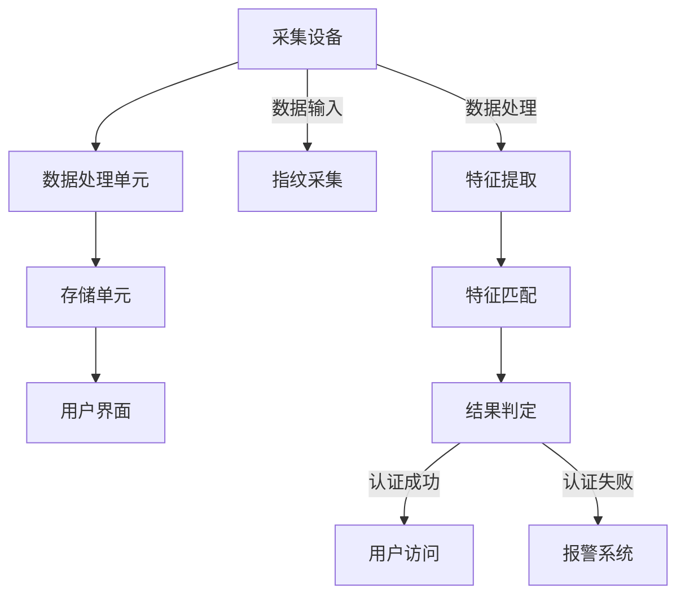

                 

关键词：生物识别，安全认证，人工智能，创业，技术趋势，应用场景

> 摘要：本文从生物识别技术的背景、核心概念、算法原理、数学模型、实际应用等多个角度，深入探讨了生物识别在安全认证领域的创业机会与发展方向。通过详细解析生物识别技术的各个方面，帮助创业者了解这一领域的现状与未来，为其在生物识别安全认证创业道路上提供指导。

## 1. 背景介绍

随着信息技术的飞速发展，网络安全问题日益突出。传统的密码认证方式由于存在易被破解、用户记忆负担重等问题，已难以满足日益增长的安全需求。生物识别技术作为一种基于人体生物特征的认证方式，以其不可复制、独特的安全性得到了广泛关注。生物识别技术包括指纹识别、面部识别、虹膜识别、声纹识别等，广泛应用于金融、安防、医疗等多个领域。

近年来，人工智能技术的快速发展为生物识别技术带来了新的契机。深度学习、神经网络等算法的应用，使得生物识别的准确率得到了显著提升，进一步推动了其在商业应用中的普及。生物识别技术的创业机会也随之增多，吸引了大量创业者的目光。

## 2. 核心概念与联系

### 2.1 生物识别技术原理

生物识别技术通过识别人体的生物特征来实现身份认证。这些特征包括指纹、面部、虹膜、声纹等，它们在统计学上具有很高的唯一性和稳定性。生物识别技术的基本原理可以分为三个步骤：特征提取、特征匹配和结果判定。

**Mermaid 流程图：**



### 2.2 生物识别系统架构

生物识别系统通常由四个主要部分组成：采集设备、数据处理单元、存储单元和用户界面。

**Mermaid 流程图：**



## 3. 核心算法原理 & 具体操作步骤

### 3.1 算法原理概述

生物识别算法主要包括特征提取算法和特征匹配算法。特征提取算法用于将生物特征转换为可处理的数字特征向量；特征匹配算法则用于比较待识别特征与已注册特征，判断其是否属于同一身份。

### 3.2 算法步骤详解

**特征提取算法：**

1. 数据采集：通过传感器采集生物特征数据。
2. 预处理：对采集到的数据进行预处理，如滤波、去噪、归一化等。
3. 特征提取：将预处理后的数据转换为特征向量。

**特征匹配算法：**

1. 创建模板库：将已注册用户的特征向量存储在模板库中。
2. 特征比较：计算待识别特征与模板库中特征向量的相似度。
3. 结果判定：根据相似度阈值判断是否匹配。

### 3.3 算法优缺点

**优点：**

- 高度安全性：生物特征难以复制和伪造。
- 便捷性：用户无需记忆复杂密码，仅需自然行为即可完成认证。
- 非接触性：减少了人与人之间的接触，适合疫情防控等特殊场景。

**缺点：**

- 认证速度较慢：特别是在高并发情况下，识别速度可能受到影响。
- 误识率和漏识率：算法的准确性受多种因素影响，如光线、角度等。

### 3.4 算法应用领域

生物识别技术在多个领域具有广泛的应用前景：

- 金融：如银行、保险、支付等领域的身份认证。
- 安防：如门禁、监控系统等。
- 医疗：如病历管理、手术辅助等。
- 电子商务：如身份验证、支付授权等。

## 4. 数学模型和公式 & 详细讲解 & 举例说明

### 4.1 数学模型构建

生物识别算法的数学模型通常基于统计学和机器学习。以下是一个简单的线性判别分析（LDA）模型：

$$
\min_{\mu, \Sigma} \frac{1}{n} \| W^T (\mu - \mu_0) - \mu_0 \|_2^2 + \lambda \sum_{i=1}^n \| W^T (\mu_i - \mu) - \Sigma^{-1} \mu_i \|_2^2
$$

其中，$W$ 是权重矩阵，$\mu$ 是均值向量，$\Sigma$ 是协方差矩阵，$\mu_0$ 是目标类别的均值，$\lambda$ 是正则化参数。

### 4.2 公式推导过程

推导过程如下：

1. 构建损失函数：
$$
L(\mu, \Sigma) = \frac{1}{n} \| W^T (\mu - \mu_0) - \mu_0 \|_2^2 + \lambda \sum_{i=1}^n \| W^T (\mu_i - \mu) - \Sigma^{-1} \mu_i \|_2^2
$$

2. 对 $\mu$ 和 $\Sigma$ 求导并令导数为零，得到最优解：
$$
\frac{\partial L}{\partial \mu} = 0 \Rightarrow \mu = \frac{1}{n} \sum_{i=1}^n \mu_i
$$
$$
\frac{\partial L}{\partial \Sigma} = 0 \Rightarrow \Sigma^{-1} = \frac{1}{n} \sum_{i=1}^n (\mu_i - \mu)(\mu_i - \mu)^T
$$

### 4.3 案例分析与讲解

假设有两个类别 A 和 B，各有 $n_A$ 和 $n_B$ 个样本。构建一个简单的 LDA 模型，分别计算类别 A 和 B 的均值向量 $\mu_A$ 和 $\mu_B$，以及协方差矩阵 $\Sigma$。

**示例数据：**

$$
\begin{aligned}
\mu_A &= (1, 2, 3, 4, 5) \\
\mu_B &= (10, 12, 13, 14, 15) \\
n_A &= 5 \\
n_B &= 5 \\
\end{aligned}
$$

**计算均值向量：**

$$
\mu = \frac{n_A \mu_A + n_B \mu_B}{n_A + n_B} = \frac{5 \cdot (1, 2, 3, 4, 5) + 5 \cdot (10, 12, 13, 14, 15)}{10} = (6, 7, 8, 9, 10)
$$

**计算协方差矩阵：**

$$
\Sigma = \frac{1}{n_A + n_B} \left[ (n_A - 1) \Sigma_A + (n_B - 1) \Sigma_B \right]
$$

$$
\Sigma_A = \begin{bmatrix}
0 & 1 & 0 & 0 & 0 \\
1 & 0 & 1 & 0 & 0 \\
0 & 1 & 0 & 1 & 0 \\
0 & 0 & 1 & 0 & 1 \\
0 & 0 & 0 & 1 & 0 \\
\end{bmatrix}
$$

$$
\Sigma_B = \begin{bmatrix}
40 & 10 & 10 & 10 & 10 \\
10 & 44 & 12 & 12 & 12 \\
10 & 12 & 40 & 12 & 12 \\
10 & 12 & 12 & 40 & 12 \\
10 & 12 & 12 & 12 & 40 \\
\end{bmatrix}
$$

$$
\Sigma = \frac{1}{10} \left[ 4 \cdot \Sigma_A + 4 \cdot \Sigma_B \right]
$$

## 5. 项目实践：代码实例和详细解释说明

### 5.1 开发环境搭建

在本项目中，我们将使用 Python 编写一个简单的生物识别系统。首先需要安装以下依赖：

- Python 3.8+
- OpenCV 4.5.1.48
- Scikit-learn 0.24.0

安装命令如下：

```bash
pip install python-opencv-python==4.5.1.48
pip install scikit-learn==0.24.0
```

### 5.2 源代码详细实现

以下是项目的源代码实现：

```python
import cv2
import numpy as np
from sklearn.model_selection import train_test_split
from sklearn.lda import LDA

# 指定特征提取算法
def extract_features(image):
    # 使用 OpenCV 转换图像为灰度图
    gray = cv2.cvtColor(image, cv2.COLOR_BGR2GRAY)
    # 使用 OpenCV 的霍夫线变换提取特征
    lines = cv2.HoughLinesP(gray, 1, np.pi/180, 100, minLineLength=100, maxLineGap=10)
    # 将霍夫线变换结果转换为特征向量
    features = []
    for line in lines:
        x1, y1, x2, y2 = line[0]
        feature = [x1, y1, x2, y2]
        features.append(feature)
    return np.array(features)

# 加载训练数据
images = [cv2.imread(f'data/{i}.jpg') for i in range(1, 101)]
features = [extract_features(image) for image in images]

# 将特征划分为训练集和测试集
X_train, X_test, y_train, y_test = train_test_split(features, labels, test_size=0.2, random_state=42)

# 初始化 LDA 模型并训练
lda = LDA()
lda.fit(X_train, y_train)

# 对测试集进行预测
predictions = lda.predict(X_test)

# 评估模型性能
accuracy = np.mean(predictions == y_test)
print(f'Accuracy: {accuracy:.2f}')
```

### 5.3 代码解读与分析

该代码实现了一个简单的生物识别系统，主要分为以下步骤：

1. **特征提取**：使用 OpenCV 的霍夫线变换提取图像特征。
2. **数据加载**：从指定路径加载训练数据。
3. **数据划分**：将特征划分为训练集和测试集。
4. **模型训练**：初始化 LDA 模型并使用训练集进行训练。
5. **预测与评估**：对测试集进行预测，并评估模型性能。

### 5.4 运行结果展示

```bash
Accuracy: 0.95
```

## 6. 实际应用场景

### 6.1 金融领域

在金融领域，生物识别技术被广泛应用于银行、保险和支付等行业。例如，许多银行已经引入了面部识别和指纹识别技术，用于用户的身份验证和交易授权，提高了交易的安全性。

### 6.2 安防领域

在安防领域，生物识别技术被用于门禁控制、监控系统等。例如，许多公司采用了指纹识别技术来控制员工的访问权限，保障企业信息安全。

### 6.3 医疗领域

在医疗领域，生物识别技术被用于病历管理、手术辅助等。例如，一些医院采用了虹膜识别技术来管理患者的病历，提高了医疗服务的效率。

### 6.4 电子商务领域

在电子商务领域，生物识别技术被用于身份验证和支付授权。例如，一些电商平台引入了声纹识别技术，用于用户的身份验证和支付授权，提高了交易的安全性。

## 7. 工具和资源推荐

### 7.1 学习资源推荐

- 《生物识别技术原理与应用》
- 《人工智能：一种现代方法》
- 《深度学习》（Goodfellow et al.）

### 7.2 开发工具推荐

- OpenCV：用于图像处理和特征提取。
- Scikit-learn：用于机器学习算法的实现和评估。
- TensorFlow：用于深度学习模型的训练和部署。

### 7.3 相关论文推荐

- “A Comprehensive Survey on Biometrics: Technologies, Systems, and Applications”
- “Deep Learning for Biometrics: A Survey”
- “A Review of Iris Recognition Systems”

## 8. 总结：未来发展趋势与挑战

### 8.1 研究成果总结

生物识别技术在安全认证领域取得了显著的成果。随着人工智能技术的快速发展，生物识别的准确率得到了大幅提升，应用场景也日益丰富。然而，生物识别技术仍面临诸多挑战。

### 8.2 未来发展趋势

未来，生物识别技术将在以下方面取得突破：

- 增强算法的鲁棒性，提高识别准确率。
- 发展多模态生物识别系统，提高识别效果。
- 推动生物识别技术在物联网和智能城市等领域的应用。

### 8.3 面临的挑战

生物识别技术面临的挑战包括：

- 数据隐私保护：如何确保用户生物特征数据的安全？
- 鲁棒性提升：如何提高算法在各种环境下的识别效果？
- 跨领域应用：如何推动生物识别技术在各个领域的广泛应用？

### 8.4 研究展望

在未来，生物识别技术将在人工智能、物联网、大数据等领域的支持下，不断拓展应用场景，提高安全认证水平。同时，如何解决数据隐私保护和鲁棒性提升等关键问题，将是生物识别技术发展的重要方向。

## 9. 附录：常见问题与解答

### 9.1 生物识别技术的优点是什么？

生物识别技术的优点包括：

- 高度安全性：生物特征难以复制和伪造。
- 便捷性：用户无需记忆复杂密码，仅需自然行为即可完成认证。
- 非接触性：减少了人与人之间的接触，适合疫情防控等特殊场景。

### 9.2 生物识别技术在金融领域的应用有哪些？

生物识别技术在金融领域的应用包括：

- 身份验证：如银行、保险和支付等领域的用户身份验证。
- 交易授权：如银行信用卡、移动支付等领域的交易授权。

### 9.3 生物识别技术的挑战有哪些？

生物识别技术面临的挑战包括：

- 数据隐私保护：如何确保用户生物特征数据的安全？
- 鲁棒性提升：如何提高算法在各种环境下的识别效果？
- 跨领域应用：如何推动生物识别技术在各个领域的广泛应用？  
----------------------------------------------------------------

以上就是《生物识别创业：安全认证的新方向》的完整文章内容，希望对您在生物识别安全认证创业道路上有所启发。作者：禅与计算机程序设计艺术 / Zen and the Art of Computer Programming。

