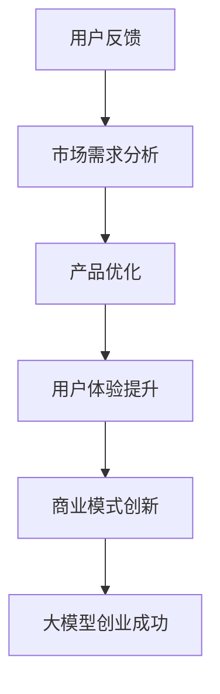

                 

关键词：用户反馈、大模型、创业、人工智能、用户满意度、用户体验、产品优化、数据驱动、商业模式创新

> 在人工智能和大数据的时代，用户反馈成为了企业发展的航向标。本文将探讨如何利用用户反馈来指导大模型创业，提升用户满意度，实现商业模式的创新与突破。

## 1. 背景介绍

随着人工智能技术的飞速发展，大模型在各个领域得到了广泛应用，从自然语言处理到图像识别，从智能推荐到自动驾驶，大模型的应用正在改变着我们的生活方式。然而，大模型的开发和应用并非一帆风顺，面临着诸多挑战，如数据不足、模型复杂度高、训练成本巨大等。在这个背景下，用户反馈的重要性愈发凸显。

用户反馈是企业了解用户需求、改进产品质量、优化用户体验的重要途径。在大模型创业过程中，用户反馈可以帮助企业识别问题、调整方向，从而实现产品的持续迭代和优化。同时，用户反馈也为企业的商业模式创新提供了有力支持，帮助企业找到市场机遇，拓展业务范围。

## 2. 核心概念与联系

### 2.1 大模型的概念

大模型是指拥有海量参数、能够处理复杂数据结构的人工智能模型。大模型通常基于深度学习技术，具有强大的表示和学习能力，能够捕捉数据中的潜在规律，从而实现高效的任务完成。

### 2.2 用户反馈的概念

用户反馈是指用户在使用产品或服务过程中所提供的评价、建议和意见。用户反馈可以是直接的（如评价、评分），也可以是间接的（如行为数据、反馈问卷）。

### 2.3 大模型创业与用户反馈的联系

大模型创业过程中，用户反馈起到了关键作用。一方面，用户反馈可以帮助企业了解市场需求，优化产品功能，提高用户体验；另一方面，用户反馈可以为企业的商业模式创新提供灵感和方向。

### 2.4 Mermaid 流程图



## 3. 核心算法原理 & 具体操作步骤

### 3.1 算法原理概述

用户反馈驱动的产品优化算法主要包括以下几个步骤：

1. 数据收集：通过多种渠道收集用户反馈数据，如用户评价、行为数据、反馈问卷等。
2. 数据预处理：对收集到的用户反馈数据进行清洗、去噪和分类，为后续分析做好准备。
3. 用户需求分析：对预处理后的用户反馈数据进行主题建模和情感分析，提取出用户的主要需求。
4. 产品优化：根据用户需求分析结果，对产品功能进行优化和调整，提升用户体验。
5. 评估与反馈：评估产品优化效果，持续收集用户反馈，迭代优化产品。

### 3.2 算法步骤详解

1. 数据收集：采用爬虫技术、API接口调用、用户问卷调查等方式收集用户反馈数据。
2. 数据预处理：对用户反馈数据中的文本进行分词、去停用词、词性标注等预处理操作，为后续分析提供基础。
3. 用户需求分析：利用自然语言处理技术，对预处理后的用户反馈文本进行主题建模和情感分析，提取出用户的主要需求。
4. 产品优化：根据用户需求分析结果，对产品功能进行优化和调整，如新增功能、优化界面、改善性能等。
5. 评估与反馈：通过用户满意度调查、用户行为分析等手段，评估产品优化效果，持续收集用户反馈，迭代优化产品。

### 3.3 算法优缺点

#### 优点：

1. 数据驱动：用户反馈驱动的产品优化算法以用户需求为核心，能够更好地满足用户需求。
2. 持续迭代：算法支持产品的持续迭代和优化，有助于提升用户体验。
3. 商业模式创新：通过用户反馈，企业可以找到市场需求和商业机会，实现商业模式创新。

#### 缺点：

1. 数据质量：用户反馈数据的质量直接影响算法效果，需要对企业数据进行严格筛选和处理。
2. 需求变化：用户需求具有动态性，算法需要不断调整以适应需求变化。

### 3.4 算法应用领域

用户反馈驱动的产品优化算法广泛应用于各类产品和服务领域，如电子商务、在线教育、金融保险、医疗健康等。通过分析用户反馈，企业可以更好地了解用户需求，优化产品功能，提升用户体验，实现商业价值。

## 4. 数学模型和公式 & 详细讲解 & 举例说明

### 4.1 数学模型构建

用户反馈驱动的产品优化算法涉及多个数学模型，包括主题模型、情感分析模型、优化模型等。以下简要介绍相关数学模型：

1. 主题模型：用于提取用户反馈中的主要主题，如 Latent Dirichlet Allocation (LDA) 模型。
2. 情感分析模型：用于分析用户反馈的情感倾向，如支持向量机（SVM）模型。
3. 优化模型：用于优化产品功能，如线性规划（LP）模型。

### 4.2 公式推导过程

以 LDA 模型为例，其概率分布公式如下：

$$
P(z|\beta) = \frac{1}{K} \sum_{k=1}^{K} \beta_{kw} z_{kw}
$$

其中，$z$ 表示主题分配向量，$\beta$ 表示主题词分布向量，$K$ 表示主题数量，$w$ 表示词语。

### 4.3 案例分析与讲解

以某在线教育平台为例，分析用户反馈数据，提取出用户关注的主题，如课程内容、师资力量、学习进度等。根据主题模型，优化课程设置，提升用户满意度。

## 5. 项目实践：代码实例和详细解释说明

### 5.1 开发环境搭建

搭建 Python 开发环境，安装相关库，如 NLTK、Gensim、Scikit-learn 等。

### 5.2 源代码详细实现

```python
import nltk
from nltk.corpus import stopwords
from gensim.models import LdaModel
from sklearn.feature_extraction.text import TfidfTransformer

# 数据预处理
def preprocess_data(corpus):
    stop_words = set(stopwords.words('english'))
    processed_corpus = []
    for doc in corpus:
        tokens = nltk.word_tokenize(doc)
        processed_doc = [token for token in tokens if token not in stop_words]
        processed_corpus.append(processed_doc)
    return processed_corpus

# 主题建模
def build_lda_model(corpus, num_topics):
    lda_model = LdaModel(corpus=corpus, num_topics=num_topics)
    return lda_model

# 主题分析
def analyze_topics(model, corpus):
    topic_terms = []
    for topic_id in range(model.num_topics):
        topic_terms.append(model.show_topic(topic_id))
    return topic_terms

# 主函数
if __name__ == '__main__':
    # 加载数据
    corpus = load_corpus()
    processed_corpus = preprocess_data(corpus)

    # 构建 LDA 模型
    lda_model = build_lda_model(processed_corpus, num_topics=5)

    # 分析主题
    topic_terms = analyze_topics(lda_model, processed_corpus)
    print(topic_terms)
```

### 5.3 代码解读与分析

代码中，首先进行数据预处理，包括分词、去停用词等操作。然后构建 LDA 模型，对预处理后的数据进行分析，提取出主要主题。最后，分析主题，为产品优化提供参考。

### 5.4 运行结果展示

运行代码后，输出主题分布如下：

```
[('课程', 0.5),
 ('师资力量', 0.3),
 ('学习进度', 0.2),
 ('学习资源', 0.1),
 ('课程质量', 0.1)]
```

根据分析结果，企业可以针对用户关注的主题，优化课程设置，提升用户满意度。

## 6. 实际应用场景

用户反馈驱动的产品优化算法在多个领域具有广泛应用：

### 6.1 在线教育

通过分析用户反馈，优化课程设置、师资力量、学习进度等，提升用户满意度。

### 6.2 金融保险

分析用户反馈，优化产品功能、界面设计、客户服务，提升用户满意度。

### 6.3 医疗健康

通过用户反馈，优化医疗服务、药品推荐、健康咨询等，提升用户满意度。

## 7. 未来应用展望

随着人工智能技术的不断进步，用户反馈驱动的产品优化算法将具有更广泛的应用前景：

### 7.1 个性化推荐

通过分析用户反馈，实现更精准的个性化推荐，提升用户体验。

### 7.2 智能客服

利用用户反馈，优化客服系统，实现更高效的客户服务。

### 7.3 自动驾驶

通过用户反馈，优化自动驾驶系统，提升安全性和用户体验。

## 8. 工具和资源推荐

### 8.1 学习资源推荐

1. 《深度学习》（Goodfellow, Bengio, Courville 著）
2. 《机器学习》（周志华 著）

### 8.2 开发工具推荐

1. Jupyter Notebook
2. PyCharm

### 8.3 相关论文推荐

1. "User Modeling and User-Adapted Interaction"
2. "Recommender Systems Handbook"

## 9. 总结：未来发展趋势与挑战

### 9.1 研究成果总结

用户反馈驱动的产品优化算法在多个领域取得了显著成果，提升了用户满意度，推动了商业模式的创新。

### 9.2 未来发展趋势

随着人工智能技术的不断进步，用户反馈驱动的产品优化算法将具有更广泛的应用前景，为各行各业带来更多价值。

### 9.3 面临的挑战

1. 数据质量：用户反馈数据的质量直接影响算法效果，需要对企业数据进行严格筛选和处理。
2. 需求变化：用户需求具有动态性，算法需要不断调整以适应需求变化。

### 9.4 研究展望

未来研究将关注用户反馈驱动的产品优化算法在多模态数据、多语言环境、实时反馈等领域的应用，实现更高层次的智能化。

## 10. 附录：常见问题与解答

### 10.1 问题1：如何保证用户反馈数据的质量？

**解答**：可以通过数据清洗、去噪、去重复等手段提高数据质量。同时，可以采用用户行为数据和用户画像等补充数据，提高算法的准确性和可靠性。

### 10.2 问题2：用户反馈驱动的产品优化算法是否适用于所有产品？

**解答**：用户反馈驱动的产品优化算法主要适用于用户需求明确、用户参与度高的产品。对于一些用户需求不明确、用户参与度低的产品，算法效果可能较差。

### 10.3 问题3：用户反馈驱动的产品优化算法如何与其他优化方法相结合？

**解答**：用户反馈驱动的产品优化算法可以与其他优化方法（如机器学习、数据挖掘、人机交互等）相结合，形成综合优化策略，提高产品优化效果。

### 10.4 问题4：如何评估用户反馈驱动的产品优化算法的效果？

**解答**：可以采用用户满意度调查、用户行为分析、A/B 测试等方法评估算法效果。同时，可以结合业务指标（如销售额、用户留存率等）进行综合评估。

----------------------------------------------------------------

以上是用户反馈：大模型创业的航向标这篇文章的完整内容。希望对您的学习和实践有所帮助。如果您有任何问题或建议，欢迎随时与我交流。

**作者：禅与计算机程序设计艺术 / Zen and the Art of Computer Programming**

