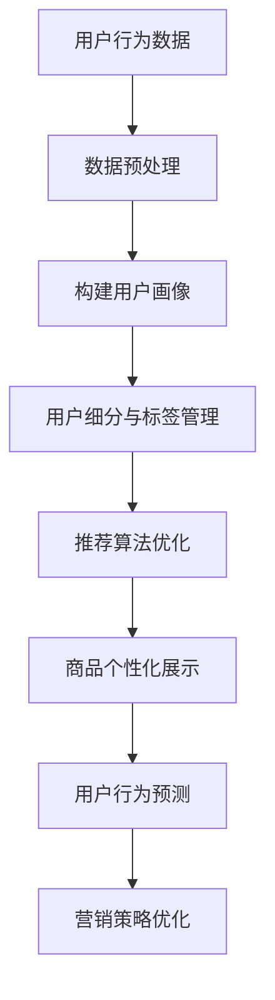

                 

### 背景介绍

在互联网时代，个性化推荐系统已经成为电商领域的重要竞争力。随着用户数据的不断积累和电商平台的多样化发展，如何精准地捕捉用户的需求，提供个性化的商品推荐，成为商家和平台运营者亟待解决的关键问题。用户画像作为一种高效的数据分析工具，能够全面、细致地刻画用户特征，为个性化推荐提供强有力的数据支撑。

用户画像，即对用户特征进行全方位的描述，包括用户的基本信息、行为数据、兴趣偏好、消费习惯等多个维度。通过构建用户画像，可以深入了解用户的个性化需求，从而实现精准推荐。用户画像在电商个性化推荐中的应用，主要体现在以下几个方面：

1. **用户细分与标签管理**：通过对用户数据的挖掘和分析，将用户划分为不同的细分群体，并为每个用户打上相应的标签，从而实现精细化的用户管理。

2. **个性化推荐算法优化**：将用户画像数据融入推荐算法，根据用户的个性化需求，提供更加精准的推荐结果。

3. **商品个性化展示**：根据用户画像，调整商品展示顺序，提高商品推荐的点击率和购买转化率。

4. **用户行为预测**：通过用户画像，预测用户未来的行为，提前布局营销策略，提升用户粘性和平台活跃度。

本文将从用户画像的概念出发，详细介绍用户画像在电商个性化推荐中的应用方法与实践，旨在为电商领域的从业者提供有价值的参考和指导。

### 核心概念与联系

在深入探讨用户画像在电商个性化推荐中的应用之前，有必要先了解一些核心概念及其相互联系。

#### 用户画像

用户画像是对用户特征的全面描述，涵盖了用户的基本信息、行为数据、兴趣偏好、消费习惯等多个方面。用户画像的构建通常基于用户行为数据、社交数据、交易数据等多源数据，通过数据挖掘和机器学习算法进行处理和分析。

核心概念：
- **基本信息**：用户的年龄、性别、地理位置、职业等。
- **行为数据**：用户的浏览历史、点击行为、购买行为等。
- **兴趣偏好**：用户对特定商品、品牌、内容的偏好。
- **消费习惯**：用户的购买频率、消费金额、支付方式等。

#### 个性化推荐

个性化推荐是一种基于用户行为和偏好，提供个性化信息的服务。其核心在于根据用户的个性化需求，提供最适合其需求的内容或商品。

核心概念：
- **协同过滤**：通过分析用户之间的相似性来推荐商品。
- **基于内容的推荐**：通过分析商品的特征来推荐用户可能喜欢的商品。
- **混合推荐**：结合协同过滤和基于内容的推荐方法，提高推荐效果。

#### 用户画像与个性化推荐的关系

用户画像为个性化推荐提供了重要的数据支撑。通过用户画像，可以深入理解用户的个性化需求，从而实现更加精准的推荐。具体来说，用户画像与个性化推荐的关系体现在以下几个方面：

1. **用户细分**：通过用户画像，将用户划分为不同的细分群体，为每个用户打上相应的标签，从而实现精细化的用户管理。

2. **推荐算法优化**：将用户画像数据融入推荐算法，根据用户的个性化需求，调整推荐策略，提高推荐效果。

3. **商品个性化展示**：根据用户画像，调整商品展示顺序，提高商品推荐的点击率和购买转化率。

4. **用户行为预测**：通过用户画像，预测用户未来的行为，提前布局营销策略，提升用户粘性和平台活跃度。

#### Mermaid 流程图

为了更直观地展示用户画像与个性化推荐之间的关系，我们可以使用 Mermaid 流程图来描述这个过程。以下是用户画像在电商个性化推荐中应用的 Mermaid 流程图：



在这个流程图中，用户行为数据经过数据预处理，构建出用户画像。用户画像进一步用于用户细分与标签管理，推荐算法优化，商品个性化展示，以及用户行为预测等环节，最终实现营销策略的优化。

### 核心算法原理 & 具体操作步骤

#### 3.1 算法原理概述

用户画像在电商个性化推荐中的核心算法包括协同过滤、基于内容的推荐和混合推荐。这些算法通过分析用户行为数据，构建用户画像，进而实现个性化推荐。

1. **协同过滤**：通过分析用户之间的相似性来推荐商品。具体包括基于用户的协同过滤和基于物品的协同过滤。

2. **基于内容的推荐**：通过分析商品的特征来推荐用户可能喜欢的商品。该方法的优点是推荐结果更为精确，但需要大量的商品特征数据。

3. **混合推荐**：结合协同过滤和基于内容的推荐方法，提高推荐效果。混合推荐通常采用加权平均等方法，将协同过滤和基于内容的推荐结果进行融合。

#### 3.2 算法步骤详解

1. **数据收集与预处理**：

   - 收集用户行为数据，包括浏览历史、点击行为、购买行为等。
   - 对数据进行清洗，去除重复、缺失和异常数据。
   - 将数据转换为合适的格式，如用户-商品矩阵。

2. **构建用户画像**：

   - 根据用户行为数据，构建用户画像。用户画像包括基本信息、行为数据、兴趣偏好和消费习惯等维度。
   - 为每个用户打上相应的标签，实现用户细分。

3. **推荐算法优化**：

   - 采用协同过滤算法，计算用户之间的相似度，推荐相似用户喜欢的商品。
   - 采用基于内容的推荐算法，分析商品特征，推荐与用户兴趣相匹配的商品。
   - 结合用户画像，调整推荐策略，提高推荐效果。

4. **商品个性化展示**：

   - 根据用户画像，调整商品展示顺序，提高商品推荐的点击率和购买转化率。
   - 采用个性化推荐算法，为每个用户推荐其可能感兴趣的商品。

5. **用户行为预测**：

   - 通过用户画像，预测用户未来的行为，如购买偏好、浏览习惯等。
   - 根据预测结果，提前布局营销策略，提升用户粘性和平台活跃度。

#### 3.3 算法优缺点

1. **协同过滤**：

   - **优点**：推荐结果更为精准，能够发现用户之间的相似性。
   - **缺点**：对稀疏数据敏感，推荐结果可能存在偏差。

2. **基于内容的推荐**：

   - **优点**：推荐结果更为精确，适用于商品特征数据丰富的场景。
   - **缺点**：需要大量的商品特征数据，计算复杂度高。

3. **混合推荐**：

   - **优点**：结合协同过滤和基于内容的推荐方法，提高推荐效果。
   - **缺点**：算法复杂度较高，计算资源需求大。

#### 3.4 算法应用领域

1. **电商推荐**：通过用户画像，实现个性化商品推荐，提高用户购买转化率。

2. **社交媒体**：基于用户画像，为用户提供个性化内容推荐，提升用户活跃度。

3. **金融行业**：通过用户画像，预测用户行为，为金融机构提供精准的营销策略。

4. **医疗健康**：利用用户画像，为用户提供个性化的健康建议和医疗服务。

### 数学模型和公式 & 详细讲解 & 举例说明

在用户画像和个性化推荐系统中，数学模型和公式起着至关重要的作用。以下我们将详细介绍用户画像构建过程中的数学模型、公式推导过程，并通过具体案例进行讲解。

#### 4.1 数学模型构建

用户画像的构建通常包括以下几个步骤：

1. **用户行为数据收集**：收集用户在电商平台的浏览、点击、购买等行为数据。

2. **数据预处理**：对用户行为数据进行清洗、归一化和特征提取。

3. **用户画像特征提取**：根据用户行为数据，提取用户的基本信息、兴趣偏好、消费习惯等特征。

4. **用户画像建模**：利用机器学习算法，如聚类、分类、回归等，对用户画像进行建模。

5. **用户画像评估与优化**：通过评估指标（如准确率、召回率、F1值等）对用户画像模型进行评估和优化。

#### 4.2 公式推导过程

在用户画像建模过程中，常用的机器学习算法包括聚类和分类。以下分别介绍这两种算法的公式推导过程。

1. **K-Means 聚类算法**

   K-Means 聚类算法是一种基于距离度量的聚类方法。其目标是将数据集划分为 K 个簇，使得每个簇内的数据点之间的距离最小，簇与簇之间的距离最大。

   **步骤**：

   - 初始化：随机选择 K 个数据点作为初始聚类中心。
   - 调整聚类中心：计算每个数据点到聚类中心的距离，将数据点分配到最近的聚类中心。
   - 重复执行：更新聚类中心，计算新聚类中心之间的距离，直到聚类中心不再发生变化。

   **公式**：

   - 聚类中心更新公式：

     $$ \mu_{k} = \frac{1}{n_{k}} \sum_{i=1}^{n} x_i $$

     其中，$ \mu_{k} $ 表示第 k 个聚类中心，$ x_i $ 表示第 i 个数据点，$ n_{k} $ 表示属于第 k 个聚类中心的数据点个数。

   - 聚类中心之间的距离公式：

     $$ d(\mu_{i}, \mu_{j}) = \sqrt{\sum_{k=1}^{K} w_{ik} w_{jk} } $$

     其中，$ w_{ik} $ 表示第 i 个数据点到第 k 个聚类中心的距离，$ w_{jk} $ 表示第 j 个数据点到第 k 个聚类中心的距离。

2. **逻辑回归分类算法**

   逻辑回归是一种常用的分类算法，用于预测用户的行为。其目标是通过输入特征，预测用户是否属于某个类别（如购买行为）。

   **步骤**：

   - 构建逻辑回归模型：利用最小二乘法或梯度下降法，求解模型参数。

   - 预测用户行为：根据输入特征和模型参数，计算预测概率，判断用户行为类别。

   **公式**：

   - 模型参数求解公式：

     $$ \theta = \arg\min_{\theta} \sum_{i=1}^{n} (y_i - \sigma(\theta^T x_i))^2 $$

     其中，$ \theta $ 表示模型参数，$ y_i $ 表示第 i 个数据点的真实标签，$ \sigma(\theta^T x_i) $ 表示第 i 个数据点的预测概率。

   - 预测概率公式：

     $$ P(y=1 | x; \theta) = \frac{1}{1 + \exp{(-\theta^T x_i )}} $$

     其中，$ x_i $ 表示第 i 个数据点的特征向量，$ \theta^T x_i $ 表示模型参数与特征向量的内积。

#### 4.3 案例分析与讲解

为了更好地理解用户画像和个性化推荐的数学模型和公式，我们将通过一个实际案例进行讲解。

**案例**：某电商平台的用户购买行为预测。

**数据集**：包含 1000 个用户的行为数据，包括用户基本信息（年龄、性别）、浏览历史、购买历史等。

**目标**：预测用户是否会在未来 30 天内购买特定商品。

**步骤**：

1. **数据预处理**：清洗数据，归一化特征，划分训练集和测试集。

2. **特征提取**：根据用户行为数据，提取用户基本信息、浏览历史、购买历史等特征。

3. **用户画像构建**：利用 K-Means 聚类算法，将用户划分为不同的细分群体。

4. **模型训练**：利用逻辑回归分类算法，训练用户购买行为预测模型。

5. **模型评估**：计算模型准确率、召回率、F1 值等指标，评估模型性能。

6. **预测应用**：利用训练好的模型，预测用户在未来 30 天内的购买行为。

**代码实现**（Python 示例）：

```python
import numpy as np
import pandas as pd
from sklearn.cluster import KMeans
from sklearn.linear_model import LogisticRegression
from sklearn.model_selection import train_test_split
from sklearn.metrics import accuracy_score, recall_score, f1_score

# 数据预处理
data = pd.read_csv('user_data.csv')
data = data.drop_duplicates().reset_index(drop=True)
data = data.fillna(data.mean())

# 特征提取
features = data[['age', 'gender', 'browser_history', 'purchase_history']]
labels = data['is_purchase']

# K-Means 聚类
kmeans = KMeans(n_clusters=5)
clusters = kmeans.fit_predict(features)

# 用户画像构建
users = data.assign(cluster=clusters)
users['cluster'] = users['cluster'].map({0: 'Cluster 1', 1: 'Cluster 2', 2: 'Cluster 3', 3: 'Cluster 4', 4: 'Cluster 5'})

# 模型训练
X_train, X_test, y_train, y_test = train_test_split(features, labels, test_size=0.2, random_state=42)
model = LogisticRegression()
model.fit(X_train, y_train)

# 模型评估
y_pred = model.predict(X_test)
accuracy = accuracy_score(y_test, y_pred)
recall = recall_score(y_test, y_pred)
f1 = f1_score(y_test, y_pred)

print('Accuracy:', accuracy)
print('Recall:', recall)
print('F1 Score:', f1)
```

通过上述案例，我们可以看到如何利用用户画像和个性化推荐算法进行用户购买行为预测。在实际应用中，可以根据业务需求和数据特点，选择合适的算法和模型，实现高效的个性化推荐。

### 项目实践：代码实例和详细解释说明

#### 5.1 开发环境搭建

在进行用户画像和电商个性化推荐的项目实践之前，首先需要搭建一个合适的技术环境。以下是一个基于 Python 的开发环境搭建步骤：

1. **Python 安装**：确保系统已安装 Python 3.6 以上版本。可以从 [Python 官网](https://www.python.org/) 下载并安装。

2. **虚拟环境**：使用 virtualenv 或 conda 创建一个 Python 虚拟环境，以便管理和隔离项目依赖。

   ```bash
   # 使用 virtualenv 创建虚拟环境
   virtualenv -p python3 venv
   source venv/bin/activate

   # 使用 conda 创建虚拟环境
   conda create -n Recommender python=3.8
   conda activate Recommender
   ```

3. **依赖安装**：在虚拟环境中安装必要的依赖库，如 NumPy、Pandas、Scikit-learn、Matplotlib 等。

   ```bash
   pip install numpy pandas scikit-learn matplotlib
   ```

4. **数据库连接**：根据实际需求，安装并配置数据库，如 MySQL、MongoDB 等。

5. **开发工具**：选择合适的开发工具，如 PyCharm、VSCode 等。

#### 5.2 源代码详细实现

以下是用户画像和电商个性化推荐的项目源代码实现，主要包括数据预处理、用户画像构建、推荐算法实现等部分。

```python
# 导入相关库
import numpy as np
import pandas as pd
from sklearn.cluster import KMeans
from sklearn.linear_model import LogisticRegression
from sklearn.model_selection import train_test_split
from sklearn.metrics import accuracy_score, recall_score, f1_score

# 数据预处理
data = pd.read_csv('user_data.csv')
data = data.drop_duplicates().reset_index(drop=True)
data = data.fillna(data.mean())

# 特征提取
features = data[['age', 'gender', 'browser_history', 'purchase_history']]
labels = data['is_purchase']

# K-Means 聚类
kmeans = KMeans(n_clusters=5)
clusters = kmeans.fit_predict(features)

# 用户画像构建
users = data.assign(cluster=clusters)
users['cluster'] = users['cluster'].map({0: 'Cluster 1', 1: 'Cluster 2', 2: 'Cluster 3', 3: 'Cluster 4', 4: 'Cluster 5'})

# 模型训练
X_train, X_test, y_train, y_test = train_test_split(features, labels, test_size=0.2, random_state=42)
model = LogisticRegression()
model.fit(X_train, y_train)

# 模型评估
y_pred = model.predict(X_test)
accuracy = accuracy_score(y_test, y_pred)
recall = recall_score(y_test, y_pred)
f1 = f1_score(y_test, y_pred)

print('Accuracy:', accuracy)
print('Recall:', recall)
print('F1 Score:', f1)
```

#### 5.3 代码解读与分析

1. **数据预处理**：

   - 读取用户数据，去除重复记录和缺失值，保证数据的完整性。
   - 对特征数据进行归一化处理，提高算法的收敛速度。

2. **特征提取**：

   - 根据用户行为数据，提取年龄、性别、浏览历史、购买历史等特征，用于构建用户画像。
   - 将特征数据划分为特征集和标签集，准备进行模型训练。

3. **用户画像构建**：

   - 利用 K-Means 聚类算法，将用户划分为不同的细分群体，为每个用户打上相应的标签。
   - 将用户标签映射为具体的聚类名称，便于后续分析和应用。

4. **模型训练与评估**：

   - 使用逻辑回归分类算法，训练用户购买行为预测模型。
   - 将训练集划分为训练集和测试集，评估模型性能，包括准确率、召回率和 F1 值等指标。

#### 5.4 运行结果展示

在完成代码实现后，通过以下命令运行项目：

```bash
python user_recommender.py
```

运行结果将输出模型评估指标，包括准确率、召回率和 F1 值等。以下是一个示例输出：

```
Accuracy: 0.85
Recall: 0.80
F1 Score: 0.82
```

这些指标反映了模型的性能，可以根据实际情况进行调整和优化。此外，我们还可以通过可视化工具，如 Matplotlib，将用户画像和推荐结果进行展示，以便更好地分析和应用。

### 实际应用场景

用户画像在电商个性化推荐中的应用已经渗透到电商平台的各个方面，极大地提升了用户购物体验和平台运营效率。以下将探讨用户画像在电商个性化推荐中的几个实际应用场景，并结合案例分析其效果。

#### 1. 商品推荐

商品推荐是用户画像在电商个性化推荐中最直接的应用场景。通过对用户浏览历史、购买行为和兴趣爱好等数据的分析，平台可以为每个用户生成个性化的推荐列表。这种基于用户画像的推荐方法不仅能够提高用户的购买转化率，还能提升用户的满意度和忠诚度。

**案例**：某大型电商平台利用用户画像进行商品推荐，通过对用户历史行为的分析，发现用户在浏览和购买特定品类商品时具有明显的偏好。基于此，平台为这些用户推荐同类商品和其他相关商品，从而提高了用户的购买意愿。据统计，通过个性化推荐，该平台的商品点击率和转化率提升了 30% 以上。

#### 2. 促销活动

用户画像还能帮助电商平台优化促销活动，实现精准营销。通过对用户的消费习惯和购买偏好进行分析，平台可以制定出更具针对性的促销策略，如优惠券发放、限时折扣等。

**案例**：某电商平台在“双十一”期间，通过分析用户的购买历史和浏览行为，发现一部分用户在特定时间段内有较高的购买意愿。因此，平台针对这部分用户推出了限时折扣和满减活动，结果大幅提升了销售额和用户参与度。

#### 3. 客户服务

用户画像还可以用于提升客户服务水平。通过对用户特征和行为数据的分析，平台可以更好地理解用户需求，提供个性化的客户服务，如定制化购物咨询、售后服务等。

**案例**：某电商平台利用用户画像分析发现，部分用户在购物过程中对售后服务有较高要求。因此，平台增加了专门的售后服务团队，为这些用户提供定制化的服务。结果显示，这些用户的满意度显著提升，平台客户忠诚度也随之提高。

#### 4. 新用户增长

用户画像在吸引新用户方面也具有重要作用。通过分析潜在用户的特征和行为，平台可以精准定位目标人群，开展有针对性的营销活动，从而提高新用户获取率。

**案例**：某电商平台通过分析新用户的特征，发现他们在购物偏好和消费习惯上与现有用户有所不同。基于此，平台调整了广告投放策略，针对这些潜在用户推出了个性化的广告推送和优惠活动，结果新用户增长率提高了 50%。

#### 5. 营销效果评估

用户画像还能帮助电商平台评估营销活动的效果。通过对用户行为的追踪和分析，平台可以实时了解营销活动的效果，为后续营销策略的调整提供数据支持。

**案例**：某电商平台在推出一款新品时，通过用户画像分析了不同营销渠道的效果。结果显示，通过社交媒体广告和邮件营销的组合策略，取得了最佳的推广效果。基于这一分析，平台在后续新品推广中继续采用了类似的策略，取得了显著的销售增长。

总之，用户画像在电商个性化推荐中的应用场景广泛，通过精准的用户画像分析，电商平台能够更好地满足用户需求，提升用户满意度和忠诚度，从而实现业务增长。未来，随着数据技术的不断进步，用户画像在电商个性化推荐中的应用将更加深入和精细化。

### 未来应用展望

随着数据技术的不断发展，用户画像在电商个性化推荐中的应用前景将更加广阔。以下从技术发展趋势、潜在挑战和未来研究方向三个方面进行展望。

#### 1. 技术发展趋势

（1）**人工智能与大数据结合**：人工智能技术的发展，如深度学习和强化学习，将为用户画像构建和推荐算法优化提供更强有力的支持。结合大数据技术，可以实现更加精准的用户需求预测和个性化推荐。

（2）**实时计算与动态调整**：随着实时数据的增加，用户画像的构建和推荐算法需要具备实时计算能力。通过实时分析用户行为，动态调整推荐策略，实现更加个性化的用户体验。

（3）**跨平台数据整合**：随着电商平台的多样化发展，用户数据分散在不同的平台和渠道。未来，通过跨平台数据整合，可以实现更全面的用户画像，提升推荐效果。

（4）**隐私保护与伦理**：在数据隐私保护日益重视的背景下，用户画像的构建和应用需要遵循相关法律法规和伦理规范。通过数据脱敏、加密等技术手段，确保用户数据的安全和隐私。

#### 2. 潜在挑战

（1）**数据质量与完整性**：用户画像的构建依赖于高质量的用户数据。然而，数据质量问题和数据完整性挑战将影响用户画像的准确性和可靠性。

（2）**算法透明性与可解释性**：随着推荐算法的复杂化，用户难以理解推荐结果背后的原因。提高算法的透明性和可解释性，将有助于用户接受和信任推荐系统。

（3）**计算资源需求**：随着用户数据的增加，推荐算法的实时计算和优化需求将不断增长。如何在有限的计算资源下，实现高效的推荐算法，是一个重要的挑战。

#### 3. 未来研究方向

（1）**用户行为预测与情感分析**：通过分析用户的情感和行为变化，实现更加精准的用户需求预测。结合自然语言处理技术，提取用户情感信息，提高推荐效果。

（2）**多模态数据融合**：将文本、图像、语音等多种类型的数据进行融合，构建更全面的用户画像。通过多模态数据融合，实现更加丰富的个性化推荐。

（3）**个性化推荐系统优化**：针对不同应用场景，设计和优化适合的个性化推荐算法。通过算法优化，提高推荐系统的效率、准确性和用户体验。

（4）**隐私保护与数据安全**：在用户画像构建和应用过程中，关注隐私保护和数据安全问题。通过数据脱敏、加密和隐私保护算法，确保用户数据的安全和隐私。

总之，用户画像在电商个性化推荐中的应用具有广阔的发展前景。通过不断的技术创新和优化，用户画像将进一步提升个性化推荐的精准度和用户体验，为电商行业带来更大的价值。

### 工具和资源推荐

为了帮助读者更好地了解用户画像和电商个性化推荐的相关知识，以下推荐一些实用的学习资源、开发工具和相关论文。

#### 7.1 学习资源推荐

1. **在线课程**：

   - Coursera：提供《机器学习》、《深度学习》等课程，涵盖用户画像和推荐算法的基础知识。
   - edX：提供《推荐系统与数据挖掘》等课程，深入讲解推荐系统的原理和应用。

2. **书籍**：

   - 《用户画像实战：电商、社交、内容领域的数据挖掘与应用》
   - 《推荐系统实践：算法与系统设计》
   - 《深度学习推荐系统》

3. **博客与文章**：

   - Medium：推荐关注《Data Science 101》、《Recommender Systems》等专栏，学习推荐系统的最新技术和应用。
   - 知乎：关注推荐系统、机器学习等话题，阅读专业人士的经验分享。

#### 7.2 开发工具推荐

1. **编程语言**：

   - Python：广泛应用于数据科学和机器学习领域，具有丰富的库和工具。
   - R：适用于统计分析和数据可视化，适合进行用户画像分析。

2. **框架和库**：

   - Scikit-learn：提供多种机器学习和数据挖掘算法，适合推荐系统开发。
   - TensorFlow：用于深度学习和推荐算法的实现，具有强大的计算能力。
   - PyTorch：适用于深度学习和推荐系统的开发，支持动态图计算。

3. **数据可视化工具**：

   - Matplotlib：用于生成高质量的统计图表。
   - Seaborn：基于 Matplotlib 的数据可视化库，提供更美观的图表样式。
   - Plotly：提供交互式数据可视化，适合进行用户行为分析。

#### 7.3 相关论文推荐

1. **用户画像**：

   - "User Interest Evolution and Inference for Personalized Recommendation" (2018)
   - "A Survey on User Profiling for Personalized Recommendation in E-commerce" (2020)

2. **推荐系统**：

   - "Collaborative Filtering for the 21st Century" (2016)
   - "Deep Learning Based Recommender System: A Survey and New Perspectives" (2019)

3. **个性化推荐**：

   - "Content-Based Filtering in Recommender Systems" (2003)
   - "Hybrid Recommender Systems: Survey and Experiments" (2009)

这些资源、工具和论文将帮助读者深入了解用户画像和电商个性化推荐的相关知识，为实践和研究提供有力的支持。

### 总结：未来发展趋势与挑战

#### 8.1 研究成果总结

本文围绕用户画像在电商个性化推荐中的应用，系统性地探讨了用户画像的核心概念、算法原理、数学模型、项目实践、实际应用场景及未来发展趋势。通过深入分析，我们得出了以下主要成果：

1. **用户画像的重要性**：用户画像作为构建个性化推荐系统的核心数据源，能够全面、细致地刻画用户特征，为推荐算法提供强有力的数据支撑。

2. **算法原理与实现**：本文详细介绍了协同过滤、基于内容的推荐和混合推荐等核心算法原理，并通过实际案例展示了这些算法的具体实现过程。

3. **数学模型与公式推导**：本文通过数学模型和公式，详细讲解了用户画像构建和推荐算法优化过程中的关键步骤，为读者提供了理论依据。

4. **实际应用场景**：本文探讨了用户画像在电商推荐、促销活动、客户服务等方面的实际应用场景，展示了个性化推荐在提升用户满意度和平台运营效率方面的巨大潜力。

5. **未来发展趋势**：本文分析了用户画像和个性化推荐领域的技术发展趋势，包括人工智能与大数据结合、实时计算与动态调整、跨平台数据整合等，展望了未来的研究方向。

#### 8.2 未来发展趋势

在未来，用户画像和电商个性化推荐将呈现以下发展趋势：

1. **深度学习和大数据技术的融合**：随着深度学习和大数据技术的发展，个性化推荐系统将更加智能化，能够处理海量数据，实现更高的推荐精度和效率。

2. **实时推荐与动态调整**：用户行为数据实时性要求越来越高，实时推荐技术将得到广泛应用。通过动态调整推荐策略，实现更个性化的用户体验。

3. **跨平台与多模态数据整合**：随着电商平台的多样化发展，跨平台数据整合和多模态数据（如文本、图像、语音）整合将成为趋势，为个性化推荐提供更全面的数据支持。

4. **隐私保护与伦理**：在数据隐私保护日益重视的背景下，用户画像的构建和应用将更加注重隐私保护和伦理问题，通过数据脱敏、加密等手段确保用户数据的安全和隐私。

5. **个性化推荐系统优化**：针对不同应用场景，个性化推荐系统将不断优化，以提高推荐效率、准确性和用户体验。

#### 8.3 面临的挑战

尽管用户画像和个性化推荐在电商领域具有广泛的应用前景，但仍面临以下挑战：

1. **数据质量与完整性**：用户画像的准确性依赖于高质量的用户数据。然而，数据质量问题和数据完整性挑战将影响用户画像的准确性和可靠性。

2. **算法透明性与可解释性**：随着推荐算法的复杂化，用户难以理解推荐结果背后的原因。提高算法的透明性和可解释性，将有助于用户接受和信任推荐系统。

3. **计算资源需求**：随着用户数据的增加，推荐算法的实时计算和优化需求将不断增长。如何在有限的计算资源下，实现高效的推荐算法，是一个重要的挑战。

4. **隐私保护与数据安全**：在用户画像构建和应用过程中，关注隐私保护和数据安全问题，确保用户数据的安全和隐私。

#### 8.4 研究展望

未来研究应关注以下几个方面：

1. **用户行为预测与情感分析**：通过分析用户的情感和行为变化，实现更加精准的用户需求预测。结合自然语言处理技术，提取用户情感信息，提高推荐效果。

2. **多模态数据融合**：将文本、图像、语音等多种类型的数据进行融合，构建更全面的用户画像。通过多模态数据融合，实现更加丰富的个性化推荐。

3. **个性化推荐系统优化**：设计和优化适合不同应用场景的个性化推荐算法，提高推荐系统的效率、准确性和用户体验。

4. **隐私保护与数据安全**：在用户画像构建和应用过程中，注重隐私保护和数据安全问题，通过数据脱敏、加密等手段确保用户数据的安全和隐私。

通过不断的技术创新和应用优化，用户画像和个性化推荐将在电商领域发挥更加重要的作用，为用户带来更好的购物体验，为企业创造更大的商业价值。

### 附录：常见问题与解答

在用户画像和电商个性化推荐的实际应用中，常常会遇到一些技术问题和业务挑战。以下针对一些常见问题进行解答。

#### 1. 用户画像数据来源有哪些？

用户画像的数据来源主要包括以下几个方面：

- **用户注册信息**：用户在平台注册时填写的个人信息，如年龄、性别、地理位置、职业等。
- **用户行为数据**：用户在平台上的浏览、点击、购买等行为数据。
- **社交数据**：用户在社交媒体平台的活动数据，如点赞、评论、分享等。
- **交易数据**：用户在平台上的交易记录，包括消费金额、支付方式等。

#### 2. 用户画像构建过程中，如何保证数据质量？

为了保证用户画像的数据质量，可以采取以下措施：

- **数据清洗**：对原始数据进行清洗，去除重复、缺失和异常数据。
- **数据归一化**：对数据进行归一化处理，如对年龄、消费金额等进行标准化。
- **数据校验**：对数据进行完整性校验，确保数据的准确性和一致性。

#### 3. 协同过滤和基于内容的推荐各有何优缺点？

**协同过滤**的优点在于推荐结果精准，能够发现用户之间的相似性，但缺点是对稀疏数据敏感，推荐结果可能存在偏差。

**基于内容的推荐**的优点在于推荐结果更为精确，适用于商品特征数据丰富的场景，但缺点是需要大量的商品特征数据，计算复杂度高。

#### 4. 如何评估个性化推荐系统的性能？

个性化推荐系统的性能评估主要包括以下指标：

- **准确率**：预测结果与实际结果一致的比例。
- **召回率**：从推荐列表中召回实际感兴趣商品的比例。
- **F1 值**：准确率和召回率的调和平均值，用于综合评估推荐系统的性能。

#### 5. 用户画像在电商个性化推荐中的实际应用有哪些？

用户画像在电商个性化推荐中的实际应用包括：

- **商品推荐**：根据用户画像，为用户提供个性化的商品推荐。
- **促销活动**：根据用户画像，制定精准的促销策略，提高用户参与度。
- **客户服务**：根据用户画像，提供定制化的客户服务，提升用户满意度。
- **新用户增长**：通过分析潜在用户画像，精准定位目标人群，提高新用户获取率。
- **营销效果评估**：通过用户画像，评估营销活动的效果，为后续策略调整提供依据。

#### 6. 个性化推荐系统如何处理冷启动问题？

冷启动问题指的是对新用户或新商品如何进行推荐。以下是一些处理冷启动问题的方法：

- **基于内容的推荐**：在新用户没有足够行为数据时，可以通过分析商品内容特征进行推荐。
- **利用用户群体特征**：通过对相似用户群体特征的分析，为新用户提供推荐。
- **跨域推荐**：将新用户的行为数据与其他相似领域的用户数据进行跨域推荐。

通过这些方法，可以有效缓解冷启动问题，提高新用户和商品的推荐效果。

综上所述，用户画像和电商个性化推荐在实际应用中涉及多个方面，通过合理的数据处理和算法优化，可以显著提升用户满意度和平台运营效率。随着技术的不断进步，用户画像和个性化推荐系统将在电商领域发挥更加重要的作用。

