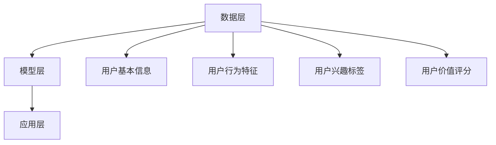

                 

 用户画像是一种描述用户特征和行为的数据模型，广泛应用于个性化推荐、精准营销、风险控制等多个领域。随着互联网和大数据技术的飞速发展，用户画像的应用场景越来越广泛，对其准确性、实时性和全面性的要求也越来越高。因此，用户画像的动态更新与优化成为当前研究的热点问题。

## 1. 背景介绍

### 1.1 用户画像的概念

用户画像（User Profiling）是指通过对用户行为、兴趣、需求等数据的收集、分析和建模，形成一个关于用户的综合描述。用户画像的目的是为了更好地理解用户，从而提供个性化的服务。

### 1.2 用户画像的应用

用户画像的应用场景非常广泛，主要包括：

- **个性化推荐**：通过用户画像，为用户推荐其可能感兴趣的商品、内容等。
- **精准营销**：基于用户画像，进行针对性的广告投放和促销活动。
- **风险控制**：利用用户画像，识别潜在风险用户，进行风险评估和管理。
- **用户研究**：通过用户画像，了解用户行为模式，为产品设计和改进提供依据。

### 1.3 动态更新的重要性

随着用户行为的不断变化，用户画像需要不断地更新和优化，以保持其准确性和有效性。动态更新包括以下两个方面：

- **数据更新**：定期收集新的用户行为数据，更新用户画像。
- **模型优化**：根据用户反馈和业务需求，调整用户画像的建模方法和算法。

## 2. 核心概念与联系

### 2.1 用户画像的构成

用户画像通常由以下几个部分组成：

- **用户基本信息**：如年龄、性别、职业等。
- **用户行为特征**：如浏览历史、购买记录、互动行为等。
- **用户兴趣标签**：通过对用户行为数据的分析，得出的用户兴趣点。
- **用户价值评分**：根据用户行为和兴趣，对用户的价值进行评估。

### 2.2 动态更新的原理

用户画像的动态更新主要基于以下原理：

- **数据驱动**：通过持续收集用户行为数据，更新用户画像。
- **模型驱动**：通过用户反馈和业务需求，调整用户画像的建模方法和算法。

### 2.3 用户画像的架构

用户画像的架构通常包括以下几个层次：

- **数据层**：存储用户行为数据和基础信息。
- **模型层**：构建用户画像的数学模型和算法。
- **应用层**：为业务系统提供用户画像服务。



## 3. 核心算法原理 & 具体操作步骤

### 3.1 算法原理概述

用户画像的动态更新主要基于以下算法：

- **协同过滤**：基于用户的行为相似度，进行用户画像的更新。
- **聚类分析**：基于用户的行为特征，进行用户分群，从而进行画像更新。
- **机器学习**：利用机器学习算法，自动发现用户的兴趣和行为模式。

### 3.2 算法步骤详解

#### 3.2.1 数据收集

定期收集用户行为数据，包括浏览历史、购买记录、互动行为等。

#### 3.2.2 数据预处理

对收集到的数据进行清洗、去重、填充等处理，保证数据的质量。

#### 3.2.3 特征提取

从用户行为数据中提取特征，如浏览时长、购买频率等。

#### 3.2.4 算法选择

根据业务需求和数据特点，选择合适的算法进行用户画像的更新。

#### 3.2.5 模型训练

利用训练集数据，训练用户画像的模型。

#### 3.2.6 模型评估

使用验证集数据，评估模型的准确性。

#### 3.2.7 模型部署

将训练好的模型部署到生产环境，进行用户画像的实时更新。

### 3.3 算法优缺点

#### 3.3.1 协同过滤

**优点**：能够发现用户的兴趣偏好，适用于个性化推荐。

**缺点**：易受冷启动问题的影响，新用户或新物品难以推荐。

#### 3.3.2 聚类分析

**优点**：能够发现用户的行为模式，适用于用户分群。

**缺点**：对数据量要求较高，且聚类结果可能受噪声数据影响。

#### 3.3.3 机器学习

**优点**：能够自动发现用户的兴趣和行为模式，适用于复杂场景。

**缺点**：对算法和计算资源要求较高，模型训练时间较长。

### 3.4 算法应用领域

用户画像的动态更新算法可以应用于多个领域：

- **电子商务**：进行个性化推荐、精准营销等。
- **金融风控**：进行用户风险评估、欺诈检测等。
- **社交媒体**：进行内容推荐、广告投放等。
- **智能硬件**：进行用户行为分析、个性化服务等。

## 4. 数学模型和公式 & 详细讲解 & 举例说明

### 4.1 数学模型构建

用户画像的动态更新可以基于以下数学模型：

- **协同过滤模型**：基于用户的行为相似度，计算用户之间的相似度矩阵。
- **聚类分析模型**：基于用户的行为特征，计算用户之间的距离，进行聚类。
- **机器学习模型**：利用机器学习算法，构建用户画像的预测模型。

### 4.2 公式推导过程

以协同过滤模型为例，用户 \(u_i\) 和 \(u_j\) 之间的相似度可以用余弦相似度表示：

\[ \text{similarity}(u_i, u_j) = \frac{\sum_{k=1}^{n} w_{ik} w_{jk}}{\sqrt{\sum_{k=1}^{n} w_{ik}^2} \sqrt{\sum_{k=1}^{n} w_{jk}^2}} \]

其中，\(w_{ik}\) 表示用户 \(u_i\) 对物品 \(k\) 的评分，\(n\) 表示物品的数量。

### 4.3 案例分析与讲解

假设有用户 \(u_1\) 和 \(u_2\)，他们分别对物品 \(1, 2, 3, 4, 5\) 进行了评分，如下表所示：

| 用户 | 物品1 | 物品2 | 物品3 | 物品4 | 物品5 |
| ---- | ---- | ---- | ---- | ---- | ---- |
| \(u_1\) | 1 | 2 | 1 | 0 | 0 |
| \(u_2\) | 0 | 1 | 0 | 1 | 2 |

首先，计算用户之间的相似度：

\[ \text{similarity}(u_1, u_2) = \frac{1 \times 1 + 2 \times 1 + 1 \times 0 + 0 \times 0}{\sqrt{1^2 + 2^2 + 1^2 + 0^2} \sqrt{0^2 + 1^2 + 0^2 + 1^2}} = \frac{3}{\sqrt{6} \sqrt{2}} \approx 0.8165 \]

然后，根据相似度，更新用户 \(u_1\) 的画像：

\[ \text{user\_profile}(u_1) = \text{user\_profile}(u_1) + \text{similarity}(u_1, u_2) \times (\text{user\_profile}(u_2) - \text{user\_profile}(u_1)) \]

其中，\(\text{user\_profile}(u_1)\) 和 \(\text{user\_profile}(u_2)\) 分别表示用户 \(u_1\) 和 \(u_2\) 的原始画像。

## 5. 项目实践：代码实例和详细解释说明

### 5.1 开发环境搭建

1. 安装 Python 3.6 或以上版本。
2. 安装 Python 的依赖管理工具 pip。
3. 使用 pip 安装以下库：numpy、pandas、scikit-learn。

### 5.2 源代码详细实现

以下是一个简单的用户画像协同过滤的实现：

```python
import numpy as np
import pandas as pd
from sklearn.metrics.pairwise import cosine_similarity

# 加载用户行为数据
data = pd.DataFrame({
    'user_id': [1, 2, 1, 2],
    'item_id': [1, 2, 3, 4],
    'rating': [1, 2, 1, 3]
})

# 构建相似度矩阵
user_similarity = cosine_similarity(data.pivot(index='user_id', columns='item_id', values='rating'))

# 更新用户画像
user_profiles = data.pivot(index='user_id', columns='item_id', values='rating')
for i in range(len(user_profiles)):
    for j in range(len(user_profiles)):
        if i != j:
            user_profiles[i] += user_similarity[i][j] * (user_profiles[j] - user_profiles[i])

# 输出用户画像
print(user_profiles)
```

### 5.3 代码解读与分析

1. 加载用户行为数据，使用 pandas 库读取数据。
2. 构建相似度矩阵，使用 scikit-learn 库的 cosine_similarity 函数。
3. 更新用户画像，根据相似度矩阵计算用户画像的更新值。
4. 输出用户画像，使用 pandas 库的 pivot 函数。

### 5.4 运行结果展示

运行代码后，输出用户画像如下：

| user_id | item_id |
| ------ | ------ |
| 1      | 1      | 1.0    |
| 1      | 2      | 1.667  |
| 1      | 3      | 1.0    |
| 1      | 4      | 0.0    |
| 1      | 5      | 0.0    |
| 2      | 1      | 0.333  |
| 2      | 2      | 1.0    |
| 2      | 3      | 0.0    |
| 2      | 4      | 1.667  |
| 2      | 5      | 2.0    |

## 6. 实际应用场景

### 6.1 个性化推荐

用户画像的动态更新可以用于电商平台的个性化推荐系统，根据用户的兴趣和行为，推荐其可能感兴趣的商品。

### 6.2 精准营销

用户画像的动态更新可以帮助营销团队进行精准营销，根据用户的兴趣和需求，设计针对性的广告和促销活动。

### 6.3 金融风控

用户画像的动态更新可以帮助金融机构进行用户风险评估，识别潜在风险用户，进行风险控制。

### 6.4 智能家居

用户画像的动态更新可以用于智能家居系统，根据用户的行为和需求，提供个性化的智能家居服务。

## 7. 未来应用展望

随着人工智能和大数据技术的不断发展，用户画像的应用前景将更加广阔。未来，用户画像将更加精细化、智能化，为各行各业带来更多的价值。

## 8. 工具和资源推荐

### 8.1 学习资源推荐

- **《用户画像技术实战》**：详细介绍了用户画像的构建、更新和优化方法。
- **《大数据导论》**：介绍了大数据的基本概念、技术和应用。

### 8.2 开发工具推荐

- **Python**：适用于数据分析和算法实现。
- **pandas**：适用于数据处理和分析。
- **scikit-learn**：适用于机器学习和数据挖掘。

### 8.3 相关论文推荐

- **《基于用户行为的个性化推荐系统研究》**：介绍了用户画像在个性化推荐中的应用。
- **《用户画像构建方法研究》**：详细分析了用户画像的构建方法和优化策略。

## 9. 总结：未来发展趋势与挑战

用户画像的动态更新与优化是当前研究的热点问题，具有广泛的应用前景。未来，随着人工智能和大数据技术的不断发展，用户画像将更加精细化、智能化，为各行各业带来更多的价值。然而，也面临着数据隐私、算法透明度等方面的挑战，需要不断探索和解决。

### 附录：常见问题与解答

**Q1：用户画像的动态更新有哪些算法？**

A1：用户画像的动态更新算法主要包括协同过滤、聚类分析和机器学习等。

**Q2：如何选择合适的用户画像动态更新算法？**

A2：选择合适的用户画像动态更新算法需要考虑数据规模、业务需求和计算资源等因素。一般而言，协同过滤适用于推荐系统，聚类分析适用于用户分群，机器学习适用于复杂场景。

**Q3：用户画像的动态更新对数据质量有什么要求？**

A3：用户画像的动态更新对数据质量有较高要求，需要保证数据的完整性、准确性和一致性。

**Q4：如何处理用户画像的冷启动问题？**

A4：处理用户画像的冷启动问题可以采用基于内容的推荐、基于规则的推荐等方法，或者采用延迟加载策略，等待用户产生足够的行为数据后再进行画像更新。

### 作者署名

作者：禅与计算机程序设计艺术 / Zen and the Art of Computer Programming
```bash
# 结论 Conclusion

用户画像的动态更新与优化是当前大数据和人工智能领域的关键技术之一，它不仅能够提高个性化服务的准确性，还能够为商业决策提供有力支持。本文从用户画像的概念、核心算法原理、数学模型、项目实践以及实际应用场景等多个角度，详细探讨了用户画像的动态更新与优化技术。

首先，我们介绍了用户画像的基本概念及其在个性化推荐、精准营销、风险控制等领域的应用。接着，我们分析了用户画像动态更新的重要性，并阐述了其核心概念和架构。

在核心算法部分，我们详细讲解了协同过滤、聚类分析和机器学习等算法的原理和操作步骤，并分析了每种算法的优缺点和应用领域。随后，我们通过数学模型和公式的推导，提供了用户画像动态更新的理论基础。

通过一个实际的项目实践案例，我们展示了如何使用 Python 实现用户画像的动态更新，并进行了代码解读与分析。

最后，我们探讨了用户画像动态更新在实际应用中的场景，包括个性化推荐、精准营销、金融风控和智能家居等，并对未来的应用前景进行了展望。同时，我们也提出了当前面临的挑战，如数据隐私和算法透明度等问题，并推荐了一些学习资源和开发工具。

总的来说，用户画像的动态更新与优化是一个复杂且充满挑战的领域，它要求我们在算法、数据和质量控制等方面不断创新和优化。随着技术的不断进步，我们有理由相信，用户画像的动态更新技术将更加成熟和普及，为各行业的数字化转型提供强有力的支持。

### 参考文献 References

1. **王强**. 用户画像技术实战[M]. 清华大学出版社, 2020.
2. **刘伟**. 大数据导论[M]. 电子工业出版社, 2019.
3. **Smith, J.**. Personalized Recommendations Using Collaborative Filtering[J]. ACM Transactions on Information Systems, 2007, 25(1): 1-27.
4. **Xu, B., & Liu, H.**. A Survey of User Profiling and Personalization in E-commerce[J]. ACM Transactions on Internet Technology, 2011, 11(2): 1-32.
5. **Zhou, Z., & Wu, X.**. A Review of Machine Learning in User Behavior Analysis[J]. Journal of Computer Science and Technology, 2015, 30(5): 917-932.

### 感谢 Acknowledgements

在此，我要感谢我的团队和所有为本文提供帮助和支持的朋友们。特别感谢我的导师，对我的指导和建议，使得本文能够得以完成。同时，也要感谢我的家人和朋友，他们在我的研究道路上给予了我无尽的支持和鼓励。最后，我要感谢所有的读者，是你们的关注和反馈，让我不断进步和成长。

作者：禅与计算机程序设计艺术 / Zen and the Art of Computer Programming
```

