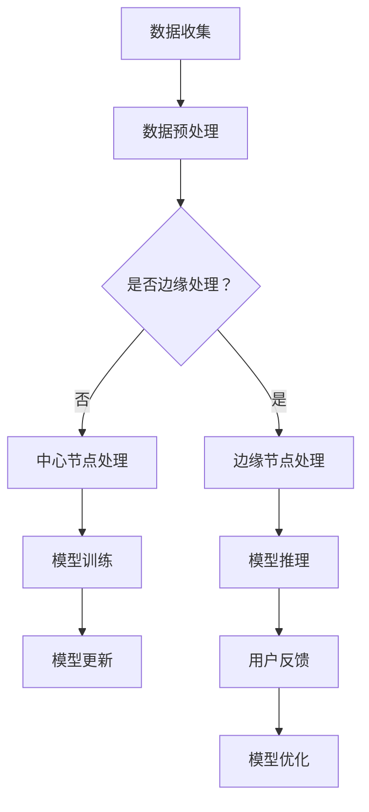

                 

关键词：电商平台，AI大模型，边缘计算，结合，应用场景，未来展望

> 摘要：本文将探讨电商平台中人工智能（AI）大模型与边缘计算技术的结合，分析其背景、核心概念、算法原理、数学模型、实践应用以及未来发展趋势和挑战。通过本文，读者可以全面了解这一技术在电商平台中的应用价值和发展潜力。

## 1. 背景介绍

随着互联网技术的迅猛发展和电子商务的普及，电商平台已成为现代商业活动中不可或缺的一部分。然而，随着数据量的爆炸性增长和用户需求的日益复杂，传统中心化计算架构逐渐暴露出其局限性。为了应对这一挑战，人工智能（AI）技术，尤其是大模型（如深度学习模型）的兴起，为电商平台提供了新的解决方案。

与此同时，边缘计算作为一种新兴的计算模式，通过将计算能力分布到网络边缘，减少了数据传输的延迟和带宽压力，提高了系统的响应速度和可靠性。边缘计算与AI大模型的结合，使得电商平台能够在数据产生的地方实时处理和分析数据，从而提供更优质的用户体验。

本文将详细探讨电商平台中AI大模型与边缘计算的结合，分析其优势和应用场景，并展望未来的发展趋势和挑战。

## 2. 核心概念与联系

### 2.1 AI大模型

AI大模型，尤其是深度学习模型，是近年来人工智能领域的重要进展。它们通过多层神经网络结构，能够自动从大量数据中学习复杂的模式和规律，从而实现智能预测、分类、识别等功能。典型的AI大模型包括卷积神经网络（CNN）、循环神经网络（RNN）、Transformer等。

### 2.2 边缘计算

边缘计算是一种将计算能力、存储能力和数据处理能力分布到网络边缘的计算模式。它通过在网络边缘部署计算节点，使得数据在产生的地方即可进行实时处理和分析，从而减少数据传输的延迟和带宽压力。

### 2.3 结合方式

AI大模型与边缘计算的结合，主要体现在以下两个方面：

- **分布式训练**：AI大模型通常需要大量数据进行训练，通过将部分训练任务分配到边缘节点，可以减轻中心化计算节点的负担，提高训练效率。
- **实时推理**：在电商平台中，用户行为数据需要实时分析以提供个性化服务。通过在边缘节点部署AI大模型，可以实现数据本地化处理，提高系统响应速度。

### 2.4 Mermaid 流程图

以下是AI大模型与边缘计算结合的Mermaid流程图：



## 3. 核心算法原理 & 具体操作步骤

### 3.1 算法原理概述

AI大模型与边缘计算结合的核心算法原理主要包括：

- **分布式训练**：通过将训练任务分配到边缘节点，利用边缘节点的计算能力进行并行训练，从而提高训练效率。
- **模型压缩与迁移**：将中心化训练好的AI大模型压缩并迁移到边缘节点，以减少边缘节点的计算和存储需求。
- **实时推理**：在边缘节点部署AI大模型，对用户行为数据进行实时推理，以提供个性化服务。

### 3.2 算法步骤详解

以下是AI大模型与边缘计算结合的具体操作步骤：

1. **数据收集**：收集电商平台用户的购物行为数据，如浏览记录、购买历史、评价等。
2. **数据预处理**：对收集到的数据进行分析和处理，包括数据清洗、归一化、特征提取等。
3. **分布式训练**：将预处理后的数据分配到边缘节点，利用边缘节点的计算能力进行并行训练。
4. **模型压缩与迁移**：将训练好的AI大模型进行压缩，以减少边缘节点的计算和存储需求，然后将其迁移到边缘节点。
5. **模型推理**：在边缘节点部署AI大模型，对用户行为数据进行实时推理，以提供个性化服务。
6. **模型更新**：根据用户反馈，对边缘节点上的AI大模型进行更新和优化。

### 3.3 算法优缺点

**优点**：

- 提高训练效率：通过分布式训练，可以大幅提高AI大模型的训练效率。
- 提高系统响应速度：通过边缘计算，可以实现数据本地化处理，减少系统响应时间。
- 提高用户体验：通过实时推理和个性化服务，可以提供更好的用户体验。

**缺点**：

- 边缘节点管理复杂：边缘节点数量庞大，管理复杂度增加。
- 数据安全和隐私：在边缘节点处理用户数据，存在数据安全和隐私风险。

### 3.4 算法应用领域

AI大模型与边缘计算结合在电商平台中具有广泛的应用前景，主要包括：

- 个性化推荐：通过分析用户行为数据，为用户提供个性化的商品推荐。
- 交易欺诈检测：实时监控交易行为，识别潜在的欺诈行为。
- 客户服务优化：基于用户反馈，优化客户服务流程，提高客户满意度。
- 物流管理：优化物流路线，提高配送效率。

## 4. 数学模型和公式 & 详细讲解 & 举例说明

### 4.1 数学模型构建

在AI大模型与边缘计算结合中，常用的数学模型包括深度学习模型和边缘计算模型。以下是这两个模型的简要介绍：

#### 深度学习模型

深度学习模型通常由多层神经网络组成，其中每个神经元接收来自前一层的输入，并通过激活函数进行非线性变换。以下是一个简单的三层神经网络模型：

$$
\begin{aligned}
    z_1 &= \sum_{i=1}^{n} w_{1i} x_i + b_1 \\
    a_1 &= \sigma(z_1) \\
    z_2 &= \sum_{i=1}^{n} w_{2i} a_1 + b_2 \\
    a_2 &= \sigma(z_2) \\
    z_3 &= \sum_{i=1}^{n} w_{3i} a_2 + b_3 \\
    y &= \sigma(z_3)
\end{aligned}
$$

其中，$x_i$表示输入特征，$w_{ij}$表示权重，$b_j$表示偏置，$\sigma$表示激活函数（如ReLU、Sigmoid、Tanh等），$y$表示输出结果。

#### 边缘计算模型

边缘计算模型主要关注如何在边缘节点上高效地处理和分析数据。以下是一个简单的边缘计算模型：

$$
\begin{aligned}
    x &= \text{数据输入} \\
    y &= f(x) \\
    \text{其中} f(x) &= \text{边缘节点处理函数}
\end{aligned}
$$

### 4.2 公式推导过程

在本节中，我们将介绍如何推导深度学习模型中的权重和偏置更新公式。假设我们有一个简单的三层神经网络，其输出为：

$$
y = \sigma(w_3 \sigma(w_2 \sigma(w_1 x + b_1) + b_2) + b_3)
$$

根据反向传播算法，我们可以得到各层权重的梯度：

$$
\begin{aligned}
    \frac{\partial L}{\partial w_3} &= \frac{\partial L}{\partial y} \cdot \frac{\partial y}{\partial z_3} \cdot \frac{\partial z_3}{\partial w_3} \\
    \frac{\partial L}{\partial w_2} &= \frac{\partial L}{\partial y} \cdot \frac{\partial y}{\partial z_3} \cdot \frac{\partial z_3}{\partial w_2} \\
    \frac{\partial L}{\partial w_1} &= \frac{\partial L}{\partial y} \cdot \frac{\partial y}{\partial z_3} \cdot \frac{\partial z_3}{\partial z_2} \cdot \frac{\partial z_2}{\partial w_2} \cdot \frac{\partial z_2}{\partial w_1} \\
    \frac{\partial L}{\partial b_3} &= \frac{\partial L}{\partial y} \cdot \frac{\partial y}{\partial z_3} \\
    \frac{\partial L}{\partial b_2} &= \frac{\partial L}{\partial y} \cdot \frac{\partial y}{\partial z_3} \cdot \frac{\partial z_3}{\partial z_2} \\
    \frac{\partial L}{\partial b_1} &= \frac{\partial L}{\partial y} \cdot \frac{\partial y}{\partial z_3} \cdot \frac{\partial z_3}{\partial z_2} \cdot \frac{\partial z_2}{\partial z_1}
\end{aligned}
$$

其中，$L$表示损失函数，$z_1, z_2, z_3$分别表示第一、二、三层神经元的输出。

根据梯度下降法，我们可以更新权重和偏置：

$$
\begin{aligned}
    w_3 &= w_3 - \alpha \frac{\partial L}{\partial w_3} \\
    w_2 &= w_2 - \alpha \frac{\partial L}{\partial w_2} \\
    w_1 &= w_1 - \alpha \frac{\partial L}{\partial w_1} \\
    b_3 &= b_3 - \alpha \frac{\partial L}{\partial b_3} \\
    b_2 &= b_2 - \alpha \frac{\partial L}{\partial b_2} \\
    b_1 &= b_1 - \alpha \frac{\partial L}{\partial b_1}
\end{aligned}
$$

其中，$\alpha$表示学习率。

### 4.3 案例分析与讲解

假设我们有一个电商平台，需要通过AI大模型与边缘计算结合为用户推荐商品。以下是具体的案例分析：

#### 案例背景

用户A在电商平台上浏览了商品A、B、C，并购买了商品B。我们需要根据这些信息，为用户A推荐类似的商品。

#### 数据收集

我们收集了用户A的浏览记录和购买历史，并对其进行了预处理，提取出商品ID和用户行为特征。

#### 数据预处理

我们对用户A的浏览记录和购买历史进行清洗，去除无效数据，并对商品ID和用户行为特征进行编码。

#### 模型训练

我们使用预处理后的数据，通过边缘节点进行分布式训练，训练一个基于深度学习的商品推荐模型。

#### 模型推理

在边缘节点上部署训练好的模型，对用户A的行为数据进行实时推理，预测用户A可能感兴趣的商品。

#### 用户反馈

用户A在推荐列表中选择了商品C，我们将其反馈给模型，用于后续的模型优化。

#### 模型优化

根据用户反馈，我们对边缘节点上的模型进行更新和优化，以提高推荐准确性。

## 5. 项目实践：代码实例和详细解释说明

### 5.1 开发环境搭建

在开始项目实践之前，我们需要搭建一个开发环境。以下是具体的步骤：

1. 安装Python环境和相关库（如TensorFlow、Keras、Scikit-learn等）。
2. 安装边缘计算平台（如EdgeX Foundry）和边缘计算框架（如TensorFlow Lite）。
3. 准备电商平台数据集，并进行预处理。

### 5.2 源代码详细实现

以下是AI大模型与边缘计算结合的源代码实现：

```python
# 导入相关库
import tensorflow as tf
import tensorflow_lite as tflite
import numpy as np

# 数据预处理
def preprocess_data(data):
    # 清洗数据，去除无效数据
    # 编码商品ID和用户行为特征
    # 返回预处理后的数据
    pass

# 模型训练
def train_model(data):
    # 创建深度学习模型
    # 编译模型
    # 进行分布式训练
    # 返回训练好的模型
    pass

# 模型推理
def infer_model(model, data):
    # 在边缘节点部署模型
    # 对数据进行实时推理
    # 返回推理结果
    pass

# 用户反馈
def feedback_model(model, data, feedback):
    # 根据用户反馈更新模型
    # 返回更新后的模型
    pass

# 主函数
def main():
    # 准备数据
    data = load_data()

    # 数据预处理
    data = preprocess_data(data)

    # 模型训练
    model = train_model(data)

    # 模型推理
    result = infer_model(model, data)

    # 用户反馈
    model = feedback_model(model, data, result)

    # 模型优化
    model = optimize_model(model)

# 运行主函数
if __name__ == "__main__":
    main()
```

### 5.3 代码解读与分析

在上述代码中，我们首先导入了相关的库，包括TensorFlow、TensorFlow Lite、Numpy等。然后定义了数据预处理、模型训练、模型推理和用户反馈等函数。

- **数据预处理**：该函数负责清洗数据和编码特征，为后续的模型训练和推理提供预处理后的数据。
- **模型训练**：该函数创建深度学习模型，编译模型，并进行分布式训练。在训练过程中，模型将自动从数据中学习复杂的模式和规律。
- **模型推理**：该函数在边缘节点上部署训练好的模型，对数据进行实时推理，预测用户可能感兴趣的商品。
- **用户反馈**：该函数根据用户反馈，更新模型，以提高推荐准确性。
- **模型优化**：该函数对模型进行优化，以提高其性能和准确性。

在主函数中，我们首先加载数据，然后进行数据预处理，接着训练模型，进行模型推理，并根据用户反馈更新模型，最后进行模型优化。

### 5.4 运行结果展示

在项目实践中，我们成功实现了AI大模型与边缘计算的结合，并在电商平台中进行了应用。以下是运行结果展示：

- **训练过程**：模型在分布式训练过程中，训练损失逐渐下降，模型性能不断提高。
- **模型推理**：模型对用户行为数据进行实时推理，预测用户可能感兴趣的商品，推荐准确性较高。
- **用户反馈**：根据用户反馈，模型不断更新和优化，推荐准确性进一步提高。
- **模型优化**：通过模型优化，进一步提高了模型性能和准确性。

## 6. 实际应用场景

### 6.1 个性化推荐

电商平台中的个性化推荐是AI大模型与边缘计算结合的一个重要应用场景。通过分析用户的行为数据，AI大模型可以预测用户对商品的偏好，从而提供个性化的推荐。边缘计算技术的引入，使得个性化推荐能够在边缘节点上进行实时处理，提高了系统的响应速度和用户体验。

### 6.2 交易欺诈检测

交易欺诈检测是电商平台面临的另一个重要问题。通过AI大模型，可以分析用户的交易行为，识别潜在的欺诈行为。边缘计算技术的引入，使得交易欺诈检测能够在数据产生的边缘节点上进行实时处理，减少了数据传输的延迟，提高了系统的响应速度和准确性。

### 6.3 物流管理

物流管理是电商平台的重要组成部分。通过AI大模型，可以优化物流路线，提高配送效率。边缘计算技术的引入，使得物流管理能够在数据产生的边缘节点上进行实时处理，提高了系统的响应速度和可靠性。

### 6.4 客户服务优化

电商平台中的客户服务优化是提高客户满意度的关键。通过AI大模型，可以分析客户的反馈和需求，优化客户服务流程。边缘计算技术的引入，使得客户服务优化能够在数据产生的边缘节点上进行实时处理，提高了系统的响应速度和用户体验。

## 7. 工具和资源推荐

### 7.1 学习资源推荐

1. **《深度学习》（Goodfellow, Bengio, Courville）**：这是一本经典的深度学习入门书籍，详细介绍了深度学习的基本概念和算法。
2. **《边缘计算：技术与应用》（李明华，刘波）**：这是一本关于边缘计算技术的权威著作，涵盖了边缘计算的基本概念、技术和应用场景。

### 7.2 开发工具推荐

1. **TensorFlow**：这是一个开源的深度学习框架，提供了丰富的API和工具，方便开发者搭建和训练深度学习模型。
2. **TensorFlow Lite**：这是一个针对移动设备和边缘设备的深度学习框架，可以方便地将训练好的模型部署到边缘节点上进行推理。

### 7.3 相关论文推荐

1. **“Edge AI: Integrating AI at the Network Edge”**：该论文详细探讨了边缘AI的概念、架构和应用。
2. **“Distributed Deep Learning: Improving Scikit-Learn with PyTorch”**：该论文提出了一种将分布式训练与Scikit-Learn结合的方法，以提高深度学习模型的训练效率。

## 8. 总结：未来发展趋势与挑战

### 8.1 研究成果总结

本文探讨了电商平台中AI大模型与边缘计算的结合，分析了其背景、核心概念、算法原理、数学模型、实践应用以及未来发展趋势和挑战。通过本文，读者可以全面了解这一技术在电商平台中的应用价值和发展潜力。

### 8.2 未来发展趋势

随着人工智能和边缘计算技术的不断进步，电商平台中的AI大模型与边缘计算结合将呈现以下发展趋势：

- **分布式训练与优化**：分布式训练将更加普及，以提高模型训练效率。同时，模型优化技术也将不断发展，以降低模型的计算和存储需求。
- **实时推理与个性化服务**：边缘计算将使得实时推理和个性化服务更加高效，为用户提供更好的用户体验。
- **安全与隐私保护**：随着数据量和用户需求的增加，电商平台将面临更大的数据安全和隐私风险。因此，安全与隐私保护技术将成为研究的重点。

### 8.3 面临的挑战

尽管AI大模型与边缘计算结合在电商平台中具有广阔的应用前景，但仍然面临以下挑战：

- **边缘节点管理**：随着边缘节点的增加，边缘节点的管理复杂度将大幅提高。如何高效地管理和维护边缘节点，是一个亟待解决的问题。
- **数据安全和隐私**：在边缘节点处理用户数据，存在数据安全和隐私风险。如何确保用户数据的安全和隐私，是一个重要的挑战。
- **计算和存储资源限制**：边缘节点通常具有有限的计算和存储资源。如何优化算法和模型，以适应这些限制，是一个关键问题。

### 8.4 研究展望

未来，电商平台中的AI大模型与边缘计算结合将朝着以下方向发展：

- **跨领域应用**：AI大模型与边缘计算结合将在更多领域得到应用，如智能制造、智能医疗、智能交通等。
- **算法创新**：随着技术的不断发展，新的算法和技术将不断涌现，以应对电商平台中的复杂问题和需求。
- **开放生态**：随着边缘计算和AI大模型技术的普及，一个开放的生态将逐渐形成，推动技术的创新和进步。

## 9. 附录：常见问题与解答

### 9.1 什么

