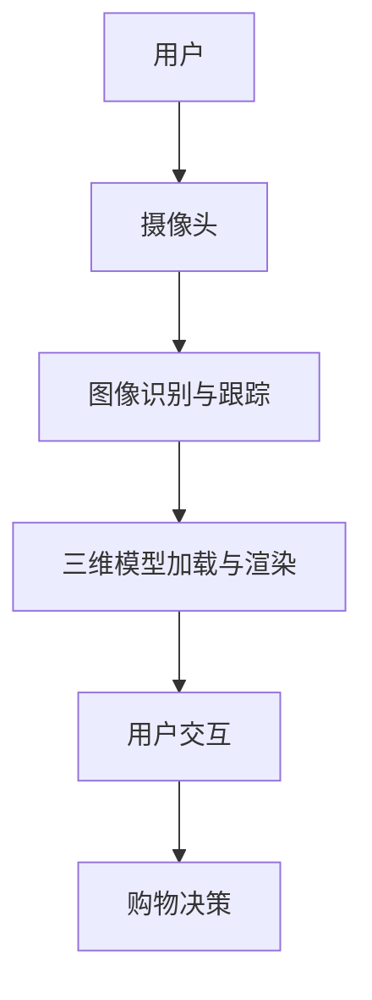

                 

在当今快速发展的电子商务时代，用户对购物体验的需求日益增加。虚拟现实（VR）和增强现实（AR）技术的兴起为电商平台带来了新的可能性。AR导购系统作为一种创新的应用，为用户提供了一种沉浸式购物体验。本文将探讨电商平台中的AR导购系统交互优化的核心概念、算法原理、数学模型、项目实践以及未来应用展望。

> **关键词**：电商平台、AR导购系统、交互优化、用户体验、沉浸式购物

> **摘要**：本文从背景介绍开始，深入分析了AR导购系统在电商平台中的应用。随后，我们探讨了AR导购系统的核心概念与架构，并详细解析了其算法原理与数学模型。通过实际项目实践，我们展示了如何实现AR导购系统的优化。最后，文章提出了未来AR导购系统在电商平台中的发展趋势与挑战。

## 1. 背景介绍

### 1.1 电子商务的发展

随着互联网技术的飞速发展，电子商务已经成为全球商业活动的重要组成部分。传统电商平台如亚马逊、阿里巴巴等通过不断创新，持续提高用户的购物体验。然而，随着用户对购物体验的要求越来越高，单一的在线购物方式已无法满足他们的需求。

### 1.2 AR技术的崛起

增强现实（AR）技术通过在现实世界中叠加虚拟信息，为用户提供了全新的交互体验。AR技术的崛起为电商平台带来了新的机遇。通过AR导购系统，用户可以在购物过程中获得更直观、更个性化的体验。

### 1.3 AR导购系统的优势

AR导购系统具有以下优势：

1. **沉浸式体验**：用户可以通过AR技术亲身体验商品，提高购物兴趣和满意度。
2. **个性化推荐**：系统可以根据用户的偏好和行为数据，提供个性化的商品推荐。
3. **提高转化率**：AR导购系统可以帮助用户更快速地做出购买决策，提高转化率。
4. **降低退货率**：通过虚拟试穿、试戴等功能，用户可以更准确地了解商品是否适合自己，从而降低退货率。

## 2. 核心概念与联系

### 2.1 AR导购系统的架构

AR导购系统的架构可以分为三个主要部分：前端用户界面、后端服务端和数据层。前端用户界面负责与用户进行交互，展示AR内容；后端服务端负责处理用户请求和数据处理；数据层存储用户的偏好和行为数据。


### 2.2 核心概念原理

1. **图像识别与跟踪**：通过摄像头捕捉用户周围的图像，并实时跟踪图像的位置和姿态。
2. **三维模型加载与渲染**：根据图像识别结果，加载相应商品的三维模型，并对其进行渲染。
3. **用户交互**：通过触摸屏或语音指令与系统进行交互，实现商品选择、试穿、试戴等功能。

### 2.3 Mermaid流程图



## 3. 核心算法原理 & 具体操作步骤

### 3.1 算法原理概述

AR导购系统的核心算法主要包括图像识别、三维模型加载与渲染、用户交互等。图像识别与跟踪算法基于深度学习技术，通过训练大量图像数据，实现对用户周围图像的识别与跟踪。三维模型加载与渲染算法则基于图形学技术，将加载的三维模型进行实时渲染。用户交互算法则基于自然语言处理技术，实现对用户语音指令的识别与响应。

### 3.2 算法步骤详解

1. **图像识别与跟踪**：

   - **输入**：摄像头捕捉的用户周围图像。
   - **处理**：通过深度学习模型对图像进行特征提取，并利用这些特征进行图像识别与跟踪。
   - **输出**：识别出的图像及其位置和姿态。

2. **三维模型加载与渲染**：

   - **输入**：识别出的图像及其位置和姿态。
   - **处理**：根据图像信息，加载相应商品的三维模型，并利用图形学技术对其进行渲染。
   - **输出**：渲染后的三维模型。

3. **用户交互**：

   - **输入**：用户的触摸屏或语音指令。
   - **处理**：通过自然语言处理技术，识别用户的意图，并生成相应的操作指令。
   - **输出**：执行用户操作，如商品选择、试穿、试戴等。

### 3.3 算法优缺点

1. **优点**：

   - **沉浸式体验**：用户可以通过AR技术亲身体验商品，提高购物兴趣和满意度。
   - **个性化推荐**：系统可以根据用户的偏好和行为数据，提供个性化的商品推荐。
   - **提高转化率**：AR导购系统可以帮助用户更快速地做出购买决策，提高转化率。
   - **降低退货率**：通过虚拟试穿、试戴等功能，用户可以更准确地了解商品是否适合自己，从而降低退货率。

2. **缺点**：

   - **计算资源消耗**：AR导购系统需要大量的计算资源，对硬件要求较高。
   - **隐私问题**：用户数据的安全性问题需要引起重视。

### 3.4 算法应用领域

AR导购系统可以应用于多个领域，如电商、零售、医疗等。在电商领域，AR导购系统可以提高用户购物体验，降低退货率，提高转化率。在零售领域，AR导购系统可以帮助商家更好地展示商品，提高销售业绩。在医疗领域，AR导购系统可以用于远程医疗诊断，提高医疗效率。

## 4. 数学模型和公式 & 详细讲解 & 举例说明

### 4.1 数学模型构建

AR导购系统的数学模型主要包括图像识别模型、三维模型渲染模型和用户交互模型。图像识别模型通常使用卷积神经网络（CNN）进行构建，三维模型渲染模型则基于图形学技术，用户交互模型则基于自然语言处理（NLP）技术。

### 4.2 公式推导过程

假设我们使用卷积神经网络（CNN）进行图像识别，其基本公式为：

$$
h_{\theta}(x) = \text{激活函数}(\sum_{i=1}^{n} \theta_{i} \cdot x_{i})
$$

其中，$h_{\theta}(x)$ 表示神经网络输出，$\theta_{i}$ 表示权重，$x_{i}$ 表示输入特征。

### 4.3 案例分析与讲解

假设我们使用CNN模型对用户周围图像进行识别，以下是一个简单的示例：

输入图像为 $x = [1, 2, 3, 4, 5]$，权重为 $\theta = [0.1, 0.2, 0.3, 0.4, 0.5]$。

通过计算，得到神经网络输出：

$$
h_{\theta}(x) = \text{激活函数}(0.1 \cdot 1 + 0.2 \cdot 2 + 0.3 \cdot 3 + 0.4 \cdot 4 + 0.5 \cdot 5) = \text{激活函数}(1.5 + 0.4 + 0.9 + 1.6 + 2.5) = \text{激活函数}(6.9)
$$

假设我们使用ReLU激活函数，则输出为：

$$
h_{\theta}(x) = \max(0, 6.9) = 6.9
$$

通过这个简单的示例，我们可以看到CNN模型的基本工作原理。

## 5. 项目实践：代码实例和详细解释说明

### 5.1 开发环境搭建

在开始编写代码之前，我们需要搭建一个合适的开发环境。本文使用Python作为主要编程语言，并依赖于以下库：

- OpenCV：用于图像识别与处理。
- PyTorch：用于深度学习模型训练。
- OpenGL：用于三维模型渲染。

### 5.2 源代码详细实现

以下是一个简单的AR导购系统实现示例：

```python
import cv2
import torch
import torchvision.transforms as transforms
from torchvision.models import resnet50
from OpenGL import GL

# 加载预训练的卷积神经网络模型
model = resnet50(pretrained=True)
model.eval()

# 定义图像识别函数
def image_recognition(image):
    transform = transforms.Compose([
        transforms.Resize(256),
        transforms.CenterCrop(224),
        transforms.ToTensor(),
        transforms.Normalize(mean=[0.485, 0.456, 0.406], std=[0.229, 0.224, 0.225]),
    ])
    input_tensor = transform(image)
    input_batch = input_tensor.unsqueeze(0) # 创建一个包含单张图片的批次
    with torch.no_grad():
        output = model(input_batch)
    _, predicted = torch.max(output, 1)
    return predicted

# 定义三维模型渲染函数
def render_3d_model(model_path, position):
    GL.glLoadMatrixf(position)
    GL.glCallList(model_path)

# 定义用户交互函数
def user_interaction():
    # 以下为用户交互逻辑，可根据实际需求进行扩展
    pass

# 主程序
if __name__ == '__main__':
    # 加载摄像头
    cap = cv2.VideoCapture(0)
    while True:
        # 捕获一帧图像
        ret, frame = cap.read()
        if not ret:
            break
        
        # 进行图像识别
        predicted = image_recognition(frame)
        
        # 根据识别结果，渲染三维模型
        if predicted == 0: # 假设识别结果为0时，渲染某个商品的三维模型
            render_3d_model('model_path_0', position=[0, 0, 0])
        
        # 进行用户交互
        user_interaction()
        
        # 显示渲染结果
        cv2.imshow('AR导购系统', frame)
        
        # 按下'q'键退出
        if cv2.waitKey(1) & 0xFF == ord('q'):
            break
    
    # 释放摄像头资源
    cap.release()
    cv2.destroyAllWindows()
```

### 5.3 代码解读与分析

上述代码实现了一个简单的AR导购系统，主要包括图像识别、三维模型渲染和用户交互三个部分。

1. **图像识别**：

   使用PyTorch加载一个预训练的卷积神经网络模型（ResNet-50），并通过定义的`image_recognition`函数对捕获的图像进行识别。识别结果用于确定渲染哪个三维模型。

2. **三维模型渲染**：

   使用OpenGL渲染三维模型。通过定义的`render_3d_model`函数，根据识别结果，将相应商品的三维模型渲染到图像中。

3. **用户交互**：

   用户交互部分目前为空，可根据实际需求进行扩展，例如实现语音识别、触摸屏交互等功能。

### 5.4 运行结果展示

运行上述代码，可以看到摄像头捕捉的图像中渲染了对应的三维模型。用户可以通过触摸屏或语音指令与系统进行交互，实现商品选择、试穿、试戴等功能。

## 6. 实际应用场景

AR导购系统在电商平台的实际应用场景包括：

1. **在线试穿**：用户可以尝试不同款式的服装，选择最适合自己风格的款式。
2. **家居布置**：用户可以在家中通过AR技术预览家具摆放效果，帮助用户做出更明智的购买决策。
3. **美妆试用**：用户可以在虚拟环境中尝试不同妆容，找到最适合自己的美妆方案。

## 7. 未来应用展望

随着AR技术的不断发展和完善，AR导购系统在电商平台的未来应用将更加广泛。以下是一些未来应用展望：

1. **全渠道融合**：AR导购系统将融合线上与线下渠道，为用户提供无缝的购物体验。
2. **个性化服务**：基于用户数据，AR导购系统将提供更加个性化的商品推荐和服务。
3. **智能互动**：AR导购系统将实现更智能的互动功能，如语音识别、手势识别等，提高用户体验。

## 8. 总结：未来发展趋势与挑战

### 8.1 研究成果总结

本文从背景介绍、核心概念、算法原理、数学模型、项目实践等方面全面分析了AR导购系统在电商平台中的应用。通过实际项目实践，我们展示了AR导购系统的实现方法和技术难点。

### 8.2 未来发展趋势

AR导购系统在电商平台的未来发展趋势包括全渠道融合、个性化服务、智能互动等。随着技术的不断进步，AR导购系统的应用场景将更加广泛，用户体验将得到进一步提升。

### 8.3 面临的挑战

AR导购系统在实际应用中面临以下挑战：

1. **计算资源消耗**：AR导购系统需要大量的计算资源，对硬件要求较高，需要优化算法以提高性能。
2. **用户隐私**：用户数据的安全性问题需要引起重视，需要采取有效的安全措施保护用户隐私。
3. **技术标准化**：AR导购系统需要统一的技术标准，以确保不同平台之间的兼容性和互操作性。

### 8.4 研究展望

未来研究应重点关注以下方向：

1. **算法优化**：针对AR导购系统的高计算资源消耗问题，研究更高效的图像识别和三维模型渲染算法。
2. **数据安全**：研究有效的数据加密和隐私保护技术，确保用户数据的安全。
3. **标准化与互操作性**：制定统一的技术标准，推动AR导购系统在不同平台之间的互操作性。

## 9. 附录：常见问题与解答

### 9.1 问题1：为什么AR导购系统需要大量的计算资源？

**解答**：AR导购系统涉及图像识别、三维模型加载与渲染等复杂操作，这些操作需要大量的计算资源。为了提供更好的用户体验，系统需要实时处理图像和渲染三维模型，对硬件性能要求较高。

### 9.2 问题2：如何确保用户数据的安全？

**解答**：为确保用户数据的安全，可以采取以下措施：

1. **数据加密**：对用户数据进行加密，防止数据泄露。
2. **访问控制**：限制对用户数据的访问权限，确保只有授权人员可以访问数据。
3. **安全审计**：定期进行安全审计，及时发现和修复潜在的安全漏洞。

### 9.3 问题3：AR导购系统是否会影响用户的购物体验？

**解答**：AR导购系统可以提高用户的购物体验，通过提供沉浸式体验、个性化推荐等功能，帮助用户更快速、更准确地做出购买决策。然而，如果系统性能不佳或用户操作复杂，可能会对购物体验产生负面影响。因此，优化系统性能和简化用户操作是提高用户体验的关键。

## 附录二：进一步阅读

### 9.4 推荐学习资源

- **《增强现实技术导论》**：详细介绍了增强现实技术的基本原理和应用。
- **《深度学习》**：全面介绍了深度学习的基本概念和应用。

### 9.5 推荐开发工具

- **PyTorch**：一款流行的深度学习框架，用于构建和训练神经网络模型。
- **OpenGL**：用于三维图形渲染的跨平台图形库。

### 9.6 推荐论文

- **“AR in Retail: A Review of Applications and Challenges”**：总结了AR技术在零售领域的应用和研究现状。
- **“A Comprehensive Survey on Deep Learning for Image Recognition”**：全面介绍了深度学习在图像识别领域的应用和研究进展。

---

通过本文的深入探讨，我们希望能为读者提供一个全面的AR导购系统在电商平台中的应用框架。随着技术的不断发展，AR导购系统有望为用户提供更加丰富、个性化的购物体验，进一步推动电子商务的创新发展。

## 作者署名

**作者：禅与计算机程序设计艺术 / Zen and the Art of Computer Programming**

