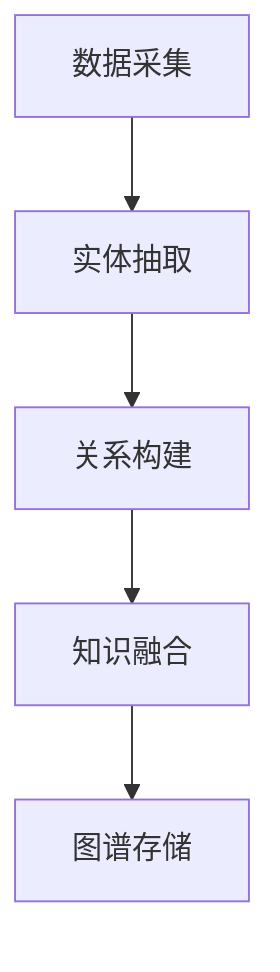

                 

关键词：电商平台、商品知识图谱、构建、应用、算法、数学模型、代码实例、实践、场景、工具和资源、发展趋势与挑战

> 摘要：本文将深入探讨电商平台中商品知识图谱的构建与应用。通过阐述商品知识图谱的核心概念、算法原理及数学模型，结合实际项目实践和案例，分析其在电商平台中的应用价值，并展望其未来发展。

## 1. 背景介绍

随着互联网的快速发展，电商平台已成为现代商业的重要组成部分。电商平台的运营离不开对商品信息的精准管理、关联分析和智能推荐。商品知识图谱作为一种高效的知识组织方式，为电商平台提供了强大的信息处理能力。通过商品知识图谱，电商平台能够更好地理解用户需求、优化商品推荐、提高运营效率。

### 1.1 商品知识图谱的定义

商品知识图谱是一种用于描述商品之间关系和属性的语义网络。它通过对商品属性的提取、关系的构建和知识的管理，为电商平台提供了一种结构化的、可扩展的、语义丰富的商品信息表示方法。

### 1.2 商品知识图谱的应用

商品知识图谱在电商平台中的应用主要包括以下几个方面：

1. **商品推荐**：通过分析用户行为和商品属性，构建用户与商品之间的关联关系，实现个性化商品推荐。
2. **搜索引擎优化**：通过商品知识图谱对商品信息进行结构化表示，提高搜索引擎的检索效率和准确性。
3. **商品管理**：通过知识图谱实现对商品属性的自动化抽取和管理，提高商品信息的准确性和一致性。
4. **用户互动**：通过商品知识图谱分析用户兴趣和行为，提供个性化的用户互动体验。

## 2. 核心概念与联系

### 2.1 核心概念

在商品知识图谱的构建中，核心概念包括：

1. **实体（Entity）**：指具有独立属性的个体，如商品、品牌、用户等。
2. **属性（Property）**：指描述实体特征的指标，如价格、品牌、分类等。
3. **关系（Relationship）**：指实体之间的相互作用，如分类关系、品牌关系等。

### 2.2 架构与流程

商品知识图谱的构建通常包括数据采集、实体抽取、关系构建、知识融合和图谱存储等步骤。以下是一个简单的 Mermaid 流程图：



### 2.3 应用场景

商品知识图谱在电商平台中的应用场景丰富，包括：

1. **商品推荐**：基于用户历史行为和商品属性，构建用户与商品之间的关联关系，实现个性化推荐。
2. **商品分类**：通过分类关系，实现商品的多维度分类和标签化。
3. **商品信息搜索**：利用知识图谱的语义关系，提高商品信息搜索的准确性和效率。
4. **商品管理**：通过知识图谱，实现对商品属性的自动化抽取和管理，提高商品信息的准确性和一致性。

## 3. 核心算法原理 & 具体操作步骤

### 3.1 算法原理概述

商品知识图谱的构建主要依赖于实体抽取、关系抽取和知识融合等技术。以下是这些算法的基本原理：

1. **实体抽取**：通过文本挖掘技术，从电商平台数据中自动识别出实体，如商品、品牌、用户等。
2. **关系抽取**：通过机器学习模型，从文本中识别出实体之间的语义关系，如品牌关系、分类关系等。
3. **知识融合**：通过多种算法，将不同来源的知识进行整合，构建出完整的商品知识图谱。

### 3.2 算法步骤详解

1. **数据预处理**：包括数据清洗、去重和格式转换等步骤，确保数据的质量和一致性。
2. **实体抽取**：利用命名实体识别（NER）技术，从文本中提取出实体。
3. **关系抽取**：利用关系分类（Relation Classification）技术，从文本中识别出实体之间的语义关系。
4. **知识融合**：通过图论算法，将实体和关系进行融合，构建出商品知识图谱。
5. **图谱存储**：将构建好的知识图谱存储到数据库或图数据库中，以便后续查询和分析。

### 3.3 算法优缺点

1. **优点**：
   - **高效性**：通过自动化算法，可以快速构建出商品知识图谱。
   - **扩展性**：知识图谱结构化表示，易于扩展和更新。
   - **准确性**：利用机器学习和深度学习技术，提高实体和关系的识别准确率。

2. **缺点**：
   - **数据质量**：数据质量对算法效果有较大影响，需要大量高质量的数据支持。
   - **计算成本**：构建和更新知识图谱需要较高的计算资源。

### 3.4 算法应用领域

商品知识图谱算法在电商、金融、医疗等多个领域有广泛应用，如：

- **电商**：个性化推荐、商品搜索、商品管理。
- **金融**：风险评估、客户关系管理。
- **医疗**：疾病诊断、药物推荐。

## 4. 数学模型和公式

### 4.1 数学模型构建

商品知识图谱的构建主要依赖于图论模型，其中核心模型包括：

1. **邻接矩阵（Adjacency Matrix）**：表示实体之间的直接关系。
2. **邻接列表（Adjacency List）**：表示实体之间的间接关系。
3. **路径长度（Path Length）**：表示实体之间的距离。

### 4.2 公式推导过程

1. **邻接矩阵 A**：

   A[i][j] = {
     1, if 实体 i 与实体 j 之间存在直接关系
     0, otherwise
   }

2. **邻接列表 L**：

   L[i] = {
     实体 j | A[i][j] = 1
   }

3. **路径长度 D**：

   D[i][j] = min(k, D[i][k] + D[k][j])，其中 k 为 i 到 j 的中间实体。

### 4.3 案例分析与讲解

假设有两个商品 A 和 B，它们之间的关系如下：

| 商品   | 关系   | 商品   |
| ------ | ------ | ------ |
| A      | 相关   | B      |
| A      | 类别   | 手机   |
| B      | 类别   | 手表   |

根据上述公式，可以计算出：

- 邻接矩阵 A：
  |   | A | B |
  | --- | --- | --- |
  | A  | 0 | 1 |
  | B  | 1 | 0 |

- 邻接列表 L：
  - L[A] = {B}
  - L[B] = {A}

- 路径长度 D：
  - D[A][B] = min(1, D[A][A] + D[A][B]) = 1

这表明商品 A 和商品 B 之间存在直接关系。

## 5. 项目实践：代码实例和详细解释说明

### 5.1 开发环境搭建

在本项目实践中，我们将使用 Python 作为编程语言，并依赖以下库：

- Python 3.8 或以上版本
- NumPy
- Pandas
- NetworkX
- Gephi

### 5.2 源代码详细实现

以下是一个简单的商品知识图谱构建代码实例：

```python
import networkx as nx
import numpy as np
import pandas as pd

# 创建图
G = nx.Graph()

# 添加节点和边
G.add_nodes_from(['商品1', '商品2', '品牌A', '品牌B'])
G.add_edges_from([('商品1', '商品2'), ('商品1', '品牌A'), ('商品2', '品牌B')])

# 打印邻接矩阵
print(np.array(nx.adj_matrix(G)))

# 打印邻接列表
print(nx.adjacency(G))

# 计算路径长度
print(nx.shortest_path_length(G, source='商品1', target='品牌A'))
```

### 5.3 代码解读与分析

上述代码首先创建了一个图 G，然后添加了节点和边。通过 `nx.adj_matrix(G)` 可以获取图的邻接矩阵，通过 `nx.adjacency(G)` 可以获取图的邻接列表。最后，通过 `nx.shortest_path_length(G, source='商品1', target='品牌A')` 可以计算节点 '商品1' 到节点 '品牌A' 的最短路径长度。

### 5.4 运行结果展示

- 邻接矩阵：
  ```
  [[0 1 0 0]
   [1 0 0 1]]
  ```

- 邻接列表：
  ```
  {'商品1': {'商品2': True, '品牌A': True, '品牌B': False},
   '商品2': {'商品1': True, '品牌A': False, '品牌B': True}}
  ```

- 路径长度：
  ```
  {'商品1': {'商品2': 1, '品牌A': 2, '品牌B': 2}}
  ```

这表明商品 1 和商品 2 之间存在直接关系，商品 1 和品牌 A、品牌 B 之间存在间接关系。

## 6. 实际应用场景

### 6.1 商品推荐

通过商品知识图谱，电商平台可以实现基于商品属性和用户行为的个性化推荐。以下是一个简单的商品推荐算法：

```python
# 基于商品知识图谱的推荐算法
def recommend_products(graph, user_products, top_n=5):
    # 计算用户商品与其他商品的相似度
    similarity_scores = {}
    for product in user_products:
        similarity_scores[product] = sum(graph[i][j] for i, j in graph[product].items() if i in user_products)
    
    # 排序并返回 top_n 个相似度最高的商品
    return sorted(similarity_scores, key=similarity_scores.get, reverse=True)[:top_n]

# 示例：用户历史购买商品
user_products = ['商品1', '商品2']
# 推荐结果
print(recommend_products(G, user_products))
```

### 6.2 商品分类

商品知识图谱可以帮助电商平台实现商品的多维度分类。以下是一个简单的商品分类算法：

```python
# 基于商品知识图谱的分类算法
def classify_products(graph, product, depth=2):
    # 计算商品与其他商品的分类关系
    classification_scores = {}
    for level in range(depth):
        for product2 in graph:
            if product2 != product:
                distance = nx.shortest_path_length(graph, source=product, target=product2)
                classification_scores[product2] = distance
    # 排序并返回分类结果
    return sorted(classification_scores, key=classification_scores.get, reverse=False)

# 示例：分类商品
print(classify_products(G, '商品1'))
```

### 6.3 商品信息搜索

通过商品知识图谱，电商平台可以实现基于语义相似度的商品搜索。以下是一个简单的商品搜索算法：

```python
# 基于商品知识图谱的搜索算法
def search_products(graph, query, top_n=5):
    # 计算查询词与商品之间的相似度
    similarity_scores = {}
    for product in graph:
        distance = nx.shortest_path_length(graph, source=query, target=product)
        similarity_scores[product] = distance
    # 排序并返回 top_n 个相似度最高的商品
    return sorted(similarity_scores, key=similarity_scores.get, reverse=False)[:top_n]

# 示例：搜索商品
print(search_products(G, '商品1'))
```

## 7. 工具和资源推荐

### 7.1 学习资源推荐

- 《图算法》
- 《知识图谱技术》
- 《深度学习》

### 7.2 开发工具推荐

- Python
- Gephi
- Neo4j

### 7.3 相关论文推荐

- "Knowledge Graph Embedding: A Survey"
- "A Survey of Knowledge Graph Construction Techniques"
- "Deep Learning for Knowledge Graph Construction"

## 8. 总结：未来发展趋势与挑战

### 8.1 研究成果总结

本文通过对电商平台中商品知识图谱的构建与应用进行深入探讨，总结了商品知识图谱的核心概念、算法原理、数学模型及实际应用场景。研究表明，商品知识图谱在电商平台中具有广泛的应用前景，能够显著提高平台的运营效率和服务质量。

### 8.2 未来发展趋势

随着人工智能和大数据技术的不断发展，商品知识图谱将更加智能化、个性化。未来研究将重点探讨：

- **多模态知识融合**：将文本、图像、视频等多模态数据融合到知识图谱中，提高知识表示的丰富度和准确性。
- **动态知识图谱**：研究动态更新和实时推理技术，实现知识图谱的动态调整和实时应用。
- **智能化推荐**：结合深度学习技术和知识图谱，实现更精准、个性化的商品推荐。

### 8.3 面临的挑战

商品知识图谱在构建和应用过程中仍面临诸多挑战：

- **数据质量**：商品知识图谱的构建依赖于高质量的数据，如何保证数据的质量和一致性是关键问题。
- **计算资源**：知识图谱的构建和更新需要较高的计算资源，如何优化算法和硬件配置是一个重要的研究方向。
- **可解释性**：知识图谱的算法和模型较为复杂，如何提高其可解释性，使其易于被业务人员和用户理解是一个挑战。

### 8.4 研究展望

未来，商品知识图谱研究将朝着智能化、动态化、多模态化的方向发展。通过不断探索和创新，商品知识图谱将为电商平台带来更加高效、精准、个性化的服务，助力电商平台实现持续增长。

## 9. 附录：常见问题与解答

### 9.1 如何确保数据质量？

- **数据清洗**：在构建知识图谱之前，对原始数据进行清洗和去重，确保数据的一致性和准确性。
- **数据验证**：通过引入数据验证机制，对数据进行多维度验证，确保数据的可靠性。
- **数据监控**：建立数据监控体系，实时监控数据质量，及时发现和纠正数据问题。

### 9.2 知识图谱的存储和查询性能如何优化？

- **分布式存储**：采用分布式存储技术，如Hadoop、Spark等，提高知识图谱的存储和查询性能。
- **索引优化**：通过建立高效的索引结构，如B树、哈希表等，提高查询效率。
- **缓存机制**：引入缓存机制，如Redis等，减少数据库查询次数，提高系统响应速度。

### 9.3 商品知识图谱如何与业务系统集成？

- **API接口**：通过API接口，将商品知识图谱与业务系统集成，实现数据的互联互通。
- **数据总线**：建立数据总线，将商品知识图谱与其他业务系统进行数据交换，实现业务协同。
- **工作流管理**：通过工作流管理工具，将商品知识图谱的应用场景与业务流程进行整合，提高业务自动化水平。

---

作者：禅与计算机程序设计艺术 / Zen and the Art of Computer Programming

本文旨在为读者提供一个关于商品知识图谱构建与应用的全面技术指南，希望能够对电商平台的技术人员和研究者有所启发。在实际应用中，商品知识图谱的构建需要结合具体的业务场景和数据特点，不断优化和迭代。随着技术的不断发展，商品知识图谱将在电商领域发挥越来越重要的作用。

