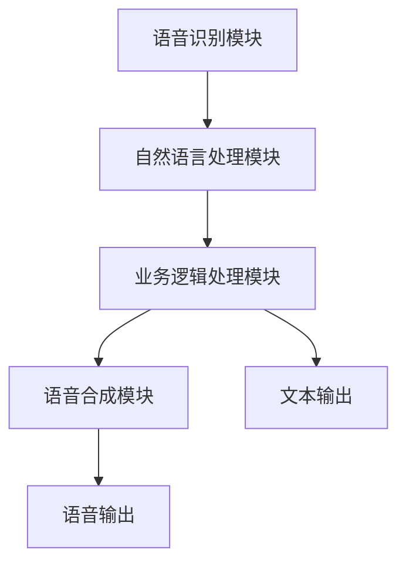

                 

在当今数字化时代，电商平台正变得越来越普及和复杂。随着用户对购物体验的要求不断提高，语音助手作为一种新兴的人机交互方式，正逐渐受到业界的重视。本文将探讨如何在电商平台中设计一个高效的多模态语音助手系统，以提升用户体验、优化运营效率。

## 文章关键词

- 电商平台
- 多模态语音助手
- 人机交互
- 系统设计
- 用户体验

## 文章摘要

本文旨在探讨如何在电商平台中构建一个多模态语音助手系统。通过对该系统的核心概念、算法原理、数学模型、项目实践、应用场景、未来展望以及相关工具和资源的介绍，本文将全面阐述如何利用多模态交互技术提升电商平台的用户体验和运营效率。

## 1. 背景介绍

### 1.1 电商平台的现状与挑战

随着互联网技术的飞速发展，电商平台已经成为人们日常生活中不可或缺的一部分。据统计，全球电商市场规模在过去几年中持续增长，预计到2025年将达到数万亿美元。这一趋势的背后，是消费者对购物便捷性、多样性和个性化的追求。

然而，随着市场竞争的加剧，电商平台面临着诸多挑战：

1. **用户留存率低**：电商平台需要不断吸引用户，但如何提高用户留存率是一个亟待解决的问题。
2. **运营效率不高**：电商平台的运营管理复杂，如何优化运营流程以提高效率成为关键。
3. **用户体验不佳**：尽管电商平台不断优化界面和功能，但传统的视觉交互方式仍存在一定的局限性。

### 1.2 多模态语音助手的兴起

为了解决上述问题，多模态语音助手作为一种新兴的人机交互方式，逐渐引起了业界的关注。多模态语音助手可以同时处理语音、文本、图像等多种输入和输出方式，提供更加自然、高效的用户交互体验。

多模态语音助手的兴起得益于以下几个因素：

1. **人工智能技术的进步**：随着深度学习、自然语言处理等技术的发展，语音识别、语音合成等技术取得了显著的突破，为多模态交互提供了技术支持。
2. **用户需求的变化**：现代用户越来越倾向于通过语音等自然交互方式与设备进行沟通，这为多模态语音助手的应用提供了广阔的市场空间。
3. **智能硬件的普及**：智能音箱、智能电视、智能手机等智能硬件的普及，为多模态语音助手的应用提供了硬件基础。

### 1.3 多模态语音助手在电商平台的潜在优势

多模态语音助手在电商平台中的应用具有以下潜在优势：

1. **提高用户留存率**：通过自然、便捷的语音交互方式，用户可以更加轻松地完成购物任务，从而提高用户留存率。
2. **优化运营效率**：多模态语音助手可以自动化处理大量的用户查询和任务，从而减轻客服人员的负担，提高运营效率。
3. **提升用户体验**：多模态语音助手可以提供个性化推荐、智能搜索等功能，为用户提供更加个性化的购物体验。

## 2. 核心概念与联系

### 2.1 多模态语音助手系统概述

多模态语音助手系统通常包括以下几个核心组成部分：

1. **语音识别模块**：负责将用户的语音输入转换为文本输入。
2. **自然语言处理模块**：负责理解和分析用户的文本输入，提取关键信息。
3. **业务逻辑处理模块**：根据用户的需求和输入，执行相应的业务操作。
4. **语音合成模块**：将系统生成的文本输出转换为语音输出，回应用户。

### 2.2 多模态交互原理

多模态交互是指同时处理多种输入和输出方式，以提高人机交互的自然性和效率。多模态语音助手通过结合语音、文本、图像等多种输入和输出方式，实现了更加丰富和自然的用户交互。

1. **语音输入**：用户可以通过语音命令与多模态语音助手进行交互，如“帮我购买这款产品”。
2. **文本输入**：用户也可以通过文本输入进行交互，如发送一条消息“我想买一本书”。
3. **图像输入**：用户可以通过上传产品图片来获取相关信息，如图像搜索功能。
4. **语音输出**：多模态语音助手可以通过语音合成技术，将系统生成的文本信息输出给用户。
5. **文本输出**：系统还可以通过文本消息回复用户，如“已为您找到以下产品”。

### 2.3 Mermaid 流程图

以下是多模态语音助手系统的 Mermaid 流程图：



### 2.4 系统架构

多模态语音助手系统的架构可以分为以下几个层次：

1. **感知层**：包括语音识别、文本输入、图像输入等模块，负责接收和处理用户的输入信息。
2. **认知层**：包括自然语言处理、业务逻辑处理等模块，负责理解用户的需求并执行相应的操作。
3. **决策层**：根据用户的需求和系统的响应，生成相应的输出信息。
4. **执行层**：包括语音合成、文本输出等模块，负责将系统的响应输出给用户。

### 2.5 关键技术与挑战

多模态语音助手系统的设计和实现涉及多个关键技术，同时也面临一些挑战：

1. **语音识别**：语音识别的准确性直接影响到用户体验。为了提高识别准确性，需要采用先进的语音识别算法和大量的训练数据。
2. **自然语言处理**：自然语言处理模块需要理解用户的语音输入，提取关键信息，并将其转换为系统的操作指令。这需要复杂的算法和大量的训练数据。
3. **业务逻辑处理**：业务逻辑处理模块需要根据用户的需求和系统的响应，执行相应的业务操作。这需要对电商平台的业务流程和规则有深入的理解。
4. **语音合成**：语音合成的自然度和流畅度直接影响用户体验。为了提高语音合成的质量，需要采用先进的语音合成算法和大量的训练数据。
5. **实时交互**：多模态语音助手需要实时响应用户的输入，并提供即时的反馈。这需要高效的数据处理和通信机制。
6. **隐私和安全**：多模态语音助手需要处理用户的个人信息，如购物记录、支付信息等。这需要严格的隐私保护和安全措施。

## 3. 核心算法原理 & 具体操作步骤

### 3.1 算法原理概述

多模态语音助手系统中的核心算法主要包括语音识别、自然语言处理、业务逻辑处理和语音合成。

1. **语音识别算法**：语音识别算法将用户的语音输入转换为文本输入。常见的语音识别算法包括基于深度学习的HMM-HMM（隐马尔可夫模型）和CTC（连接时序分类）算法。
2. **自然语言处理算法**：自然语言处理算法负责理解用户的语音输入，提取关键信息，并将其转换为系统的操作指令。常见的自然语言处理算法包括词向量模型、递归神经网络（RNN）和变换器-解码器（Transformer）模型。
3. **业务逻辑处理算法**：业务逻辑处理算法根据用户的需求和系统的响应，执行相应的业务操作。这需要对电商平台的业务流程和规则有深入的理解。常见的业务逻辑处理算法包括基于规则的方法和基于机器学习的方法。
4. **语音合成算法**：语音合成算法将系统生成的文本输出转换为语音输出。常见的语音合成算法包括基于规则的方法和基于数据的方法，如Unit Selection和DNN-based HMM。

### 3.2 算法步骤详解

1. **语音识别**：
   - **预处理**：对语音信号进行预处理，如去除噪音、归一化音量等。
   - **特征提取**：提取语音信号的特征，如梅尔频率倒谱系数（MFCC）。
   - **模型训练**：使用大量标注数据训练语音识别模型，如CTC模型。
   - **识别**：将用户的语音输入传递给语音识别模型，得到对应的文本输入。

2. **自然语言处理**：
   - **词向量表示**：将用户的文本输入转换为词向量表示，如Word2Vec或GloVe。
   - **命名实体识别**：识别文本中的命名实体，如人名、地名、产品名称等。
   - **依存句法分析**：分析文本中的句法结构，提取句子中的依赖关系。
   - **意图识别**：根据用户的文本输入，识别用户的意图，如购物、查询、支付等。
   - **实体识别**：根据用户的意图，识别文本中的实体信息，如商品名称、价格、数量等。

3. **业务逻辑处理**：
   - **规则匹配**：根据用户的需求和输入，匹配电商平台中的业务规则，如商品查询、购物车管理、支付等。
   - **数据处理**：处理用户输入的数据，如过滤无效输入、格式转换等。
   - **服务调用**：根据业务逻辑处理的结果，调用电商平台中的相关服务，如数据库查询、API调用等。

4. **语音合成**：
   - **文本到语音（TTS）合成**：将系统生成的文本输出转换为语音输出，如使用DNN-based HMM模型。
   - **音调生成**：根据语音合成模型，生成语音的音调信息，如音高、音强等。
   - **音频输出**：将合成的语音输出给用户，如通过扬声器播放。

### 3.3 算法优缺点

1. **语音识别算法**：
   - **优点**：准确性高，能够处理不同口音、说话速度和背景噪音的语音输入。
   - **缺点**：计算复杂度较高，需要大量训练数据和计算资源。

2. **自然语言处理算法**：
   - **优点**：能够处理复杂的自然语言任务，如语义理解、意图识别等。
   - **缺点**：对数据质量要求较高，需要大量高质量的数据进行训练。

3. **业务逻辑处理算法**：
   - **优点**：能够根据用户需求自动执行业务操作，提高运营效率。
   - **缺点**：需要对电商平台业务流程和规则有深入理解，实现较为复杂。

4. **语音合成算法**：
   - **优点**：能够生成自然、流畅的语音输出，提高用户体验。
   - **缺点**：音质和语音合成的流畅度仍有待提高。

### 3.4 算法应用领域

多模态语音助手算法在电商平台的多个领域具有广泛的应用：

1. **购物推荐**：根据用户的语音输入和购物历史，提供个性化的商品推荐。
2. **查询与搜索**：通过语音输入，快速查询商品信息、价格、库存等。
3. **购物车管理**：语音添加、删除商品，管理购物车。
4. **支付与结算**：语音确认订单、发起支付等。
5. **客服与售后服务**：通过语音交互，为用户提供实时客服和售后服务。

## 4. 数学模型和公式 & 详细讲解 & 举例说明

### 4.1 数学模型构建

多模态语音助手系统中的数学模型主要包括语音识别、自然语言处理、业务逻辑处理和语音合成等部分。下面我们将详细讲解这些模型的基本原理和数学公式。

1. **语音识别模型**：

   - **HMM-HMM 模型**：

     HMM-HMM模型是一种基于隐马尔可夫模型的语音识别模型。其基本原理是通过建立两个隐马尔可夫模型（HMM），一个用于语音信号的生成，另一个用于文本序列的生成，然后利用这两个模型进行语音识别。

     设 \( A = [a_{ij}] \) 为状态转移概率矩阵，\( B = [b_{ij}] \) 为观察概率矩阵，\( \pi \) 为初始状态概率向量。给定一个观察序列 \( O = [o_1, o_2, ..., o_T] \)，HMM-HMM模型的目标是最小化概率 \( P(O | \theta) \)，其中 \( \theta \) 表示模型参数。

     $$ P(O | \theta) = \frac{P(\theta) P(O | \theta)}{\sum_{\theta'} P(\theta') P(O | \theta')} $$

     - **CTC 模型**：

       CTC（连接时序分类）模型是一种基于循环神经网络的语音识别模型。其基本原理是将语音信号序列映射到文本序列，同时考虑时序的连续性。

       设 \( x_t \) 为时刻 \( t \) 的语音特征向量，\( y_t \) 为时刻 \( t \) 的文本序列。CTC模型的损失函数为：

       $$ L(x, y) = \sum_{t=1}^T \sum_{i=1}^C \log (1 - \sigma(f(x_t, y_t))) $$

       其中 \( \sigma \) 为 sigmoid 函数，\( f \) 为神经网络模型。

2. **自然语言处理模型**：

   - **词向量模型**：

     词向量模型是一种将单词映射到高维空间中的向量表示的方法。常用的词向量模型包括 Word2Vec 和 GloVe。

     - **Word2Vec**：

       Word2Vec 模型基于神经网络训练，其基本原理是将单词映射到同一高维空间中的向量，使得语义相似的单词在空间中距离较近。

       设 \( v_w \) 为单词 \( w \) 的词向量，\( v_c \) 为单词 \( c \) 的词向量。Word2Vec 模型的损失函数为：

       $$ L = \sum_{w \in V} \sum_{c \in \ contexts(w)} \log (1 - \sigma(v_w \cdot v_c)) $$

       - **GloVe**：

         GloVe 模型是基于全局平均的词向量训练方法，其基本原理是通过计算单词的上下文向量的平均值来生成词向量。

         设 \( v_w \) 为单词 \( w \) 的词向量，\( v_c \) 为单词 \( c \) 的词向量。GloVe 模型的损失函数为：

         $$ L = \sum_{w \in V} \sum_{c \in \ contexts(w)} \left( \frac{1}{z_w} - \frac{\exp(v_w \cdot v_c)}{z_w} \right)^2 $$

   - **递归神经网络（RNN）**：

     RNN 是一种能够处理序列数据的神经网络模型，其基本原理是通过记忆单元来保存输入序列的信息。

     设 \( h_t \) 为时刻 \( t \) 的隐藏状态，\( x_t \) 为时刻 \( t \) 的输入，\( y_t \) 为时刻 \( t \) 的输出。RNN 的损失函数为：

     $$ L = \sum_{t=1}^T \left( h_t \cdot (y_t - \sigma(W_y h_t)) \right)^2 $$

   - **变换器-解码器（Transformer）模型**：

     Transformer 模型是一种基于自注意力机制的神经网络模型，其基本原理是通过多头注意力机制来处理序列数据。

     设 \( h_t \) 为时刻 \( t \) 的隐藏状态，\( x_t \) 为时刻 \( t \) 的输入，\( y_t \) 为时刻 \( t \) 的输出。Transformer 的损失函数为：

     $$ L = \sum_{t=1}^T \left( h_t \cdot (y_t - \sigma(W_y h_t)) \right)^2 $$

3. **业务逻辑处理模型**：

   - **基于规则的方法**：

     基于规则的方法通过定义一系列业务规则来处理用户输入。其基本原理是根据用户的输入和业务规则，执行相应的操作。

     设 \( R \) 为业务规则集，\( I \) 为用户输入，\( O \) 为输出。基于规则的方法的损失函数为：

     $$ L = \sum_{i \in I} \sum_{r \in R} \left( 1 - \delta(O_r, O) \right) $$

     其中 \( \delta \) 为指示函数，当 \( O_r = O \) 时，\( \delta(O_r, O) = 1 \)；否则，\( \delta(O_r, O) = 0 \)。

   - **基于机器学习的方法**：

     基于机器学习的方法通过训练机器学习模型来处理用户输入。其基本原理是根据用户输入和标签数据，训练一个分类器或回归器来预测输出。

     设 \( X \) 为输入特征集，\( Y \) 为输出标签集，\( f \) 为机器学习模型。基于机器学习的方法的损失函数为：

     $$ L = \sum_{i \in I} \left( f(X_i) - Y_i \right)^2 $$

4. **语音合成模型**：

   - **基于规则的方法**：

     基于规则的方法通过定义一系列语音合成规则来生成语音输出。其基本原理是根据文本输入和语音合成规则，生成相应的语音信号。

     设 \( R \) 为语音合成规则集，\( T \) 为文本输入，\( S \) 为语音输出。基于规则的方法的损失函数为：

     $$ L = \sum_{t \in T} \left( 1 - \delta(S_t, S) \right) $$

     其中 \( \delta \) 为指示函数，当 \( S_t = S \) 时，\( \delta(S_t, S) = 1 \)；否则，\( \delta(S_t, S) = 0 \)。

   - **基于数据的方法**：

     基于数据的方法通过训练语音合成模型来生成语音输出。其基本原理是根据大量的语音数据和文本数据，训练一个端到端的语音合成模型。

     设 \( X \) 为文本输入，\( Y \) 为语音输出，\( G \) 为语音合成模型。基于数据的方法的损失函数为：

     $$ L = \sum_{i \in I} \left( G(X_i) - Y_i \right)^2 $$

### 4.2 公式推导过程

为了更好地理解多模态语音助手系统中的数学模型，我们将在以下部分详细推导一些核心公式的推导过程。

1. **语音识别模型**：

   - **HMM-HMM 模型**：

     给定一个观察序列 \( O = [o_1, o_2, ..., o_T] \) 和两个隐马尔可夫模型 \( HMM_1 \) 和 \( HMM_2 \)，其中 \( HMM_1 \) 用于语音信号生成，\( HMM_2 \) 用于文本序列生成。我们需要计算概率 \( P(O | \theta) \)。

     首先，我们计算 \( HMM_1 \) 的概率：

     $$ P(O | HMM_1, \theta) = \prod_{t=1}^T P(o_t | \theta) $$

     其中 \( P(o_t | \theta) \) 是观察概率，可以通过观察概率矩阵 \( B \) 计算得到：

     $$ P(o_t | \theta) = b_{o_t} $$

     接下来，我们计算 \( HMM_2 \) 的概率：

     $$ P(O | HMM_2, \theta) = \prod_{t=1}^T P(s_t | \theta) $$

     其中 \( s_t \) 是状态序列，可以通过状态转移概率矩阵 \( A \) 和初始状态概率向量 \( \pi \) 计算得到：

     $$ P(s_t | \theta) = \pi a_{s_t, s_{t-1}} $$

     最后，我们计算联合概率：

     $$ P(O | \theta) = P(O | HMM_1, \theta) P(O | HMM_2, \theta) $$

     为了最小化概率 \( P(O | \theta) \)，我们需要最大化联合概率：

     $$ \theta^* = \arg\max_{\theta} P(O | \theta) $$

     通过对数似然函数进行最大化，我们可以得到：

     $$ \theta^* = \arg\max_{\theta} \log P(O | \theta) $$

     这就是HMM-HMM模型的基本公式。

   - **CTC 模型**：

     给定一个观察序列 \( O = [o_1, o_2, ..., o_T] \) 和一个神经网络模型 \( f \)，我们需要计算损失函数：

     $$ L(x, y) = \sum_{t=1}^T \sum_{i=1}^C \log (1 - \sigma(f(x_t, y_t))) $$

     其中 \( \sigma \) 是sigmoid函数，\( f(x_t, y_t) \) 是神经网络输出的概率。

     首先计算神经网络输出的概率：

     $$ p(y_t | x_t) = \sigma(f(x_t, y_t)) $$

     然后计算损失函数：

     $$ L(x, y) = \sum_{t=1}^T \sum_{i=1}^C \log (1 - p(y_t | x_t)) $$

     这就是CTC模型的基本公式。

2. **自然语言处理模型**：

   - **词向量模型**：

     给定一个文本序列 \( T = [t_1, t_2, ..., t_T] \) 和一个神经网络模型 \( f \)，我们需要计算损失函数：

     $$ L = \sum_{w \in V} \sum_{c \in \ contexts(w)} \log (1 - \sigma(f(v_w, v_c))) $$

     其中 \( v_w \) 是单词 \( w \) 的词向量，\( v_c \) 是单词 \( c \) 的词向量。

     首先计算神经网络输出的概率：

     $$ p(c | w) = \sigma(f(v_w, v_c)) $$

     然后计算损失函数：

     $$ L = \sum_{w \in V} \sum_{c \in \ contexts(w)} \log (1 - p(c | w)) $$

     这就是Word2Vec模型的基本公式。

   - **递归神经网络（RNN）**：

     给定一个文本序列 \( T = [t_1, t_2, ..., t_T] \) 和一个神经网络模型 \( f \)，我们需要计算损失函数：

     $$ L = \sum_{t=1}^T \left( h_t \cdot (y_t - \sigma(W_y h_t)) \right)^2 $$

     其中 \( h_t \) 是时刻 \( t \) 的隐藏状态，\( y_t \) 是时刻 \( t \) 的输出，\( W_y \) 是权重矩阵。

     首先计算隐藏状态：

     $$ h_t = \tanh(W_x x_t + b_h) $$

     其中 \( x_t \) 是时刻 \( t \) 的输入，\( W_x \) 是输入权重矩阵，\( b_h \) 是偏置项。

     然后计算输出：

     $$ y_t = \sigma(W_y h_t) $$

     最后计算损失函数：

     $$ L = \sum_{t=1}^T \left( h_t \cdot (y_t - \sigma(W_y h_t)) \right)^2 $$

     这就是RNN模型的基本公式。

   - **变换器-解码器（Transformer）模型**：

     给定一个文本序列 \( T = [t_1, t_2, ..., t_T] \) 和一个神经网络模型 \( f \)，我们需要计算损失函数：

     $$ L = \sum_{t=1}^T \left( h_t \cdot (y_t - \sigma(W_y h_t)) \right)^2 $$

     其中 \( h_t \) 是时刻 \( t \) 的隐藏状态，\( y_t \) 是时刻 \( t \) 的输出，\( W_y \) 是权重矩阵。

     Transformer模型的核心是多头注意力机制。给定一个输入序列 \( X = [x_1, x_2, ..., x_T] \) 和一个隐藏状态序列 \( H = [h_1, h_2, ..., h_T] \)，我们需要计算每个时刻的隐藏状态：

     $$ h_t = \text{Attention}(H, H, H) $$

     其中 \( \text{Attention} \) 是多头注意力机制。多头注意力机制的损失函数为：

     $$ L = \sum_{t=1}^T \left( h_t \cdot (y_t - \sigma(W_y h_t)) \right)^2 $$

     这就是Transformer模型的基本公式。

3. **业务逻辑处理模型**：

   - **基于规则的方法**：

     给定一个输入序列 \( I = [i_1, i_2, ..., i_T] \) 和一个输出序列 \( O = [o_1, o_2, ..., o_T] \)，我们需要计算损失函数：

     $$ L = \sum_{i \in I} \sum_{r \in R} \left( 1 - \delta(O_r, O) \right) $$

     其中 \( R \) 是业务规则集。

     首先我们需要根据输入序列和业务规则集计算输出序列：

     $$ O = \text{ApplyRules}(I, R) $$

     然后计算损失函数：

     $$ L = \sum_{i \in I} \sum_{r \in R} \left( 1 - \delta(O_r, O) \right) $$

     这就是基于规则的方法的基本公式。

   - **基于机器学习的方法**：

     给定一个输入特征集 \( X \) 和一个输出标签集 \( Y \)，我们需要计算损失函数：

     $$ L = \sum_{i \in I} \left( f(X_i) - Y_i \right)^2 $$

     其中 \( f \) 是机器学习模型。

     首先我们需要训练机器学习模型：

     $$ f = \text{TrainModel}(X, Y) $$

     然后计算损失函数：

     $$ L = \sum_{i \in I} \left( f(X_i) - Y_i \right)^2 $$

     这就是基于机器学习的方法的基本公式。

4. **语音合成模型**：

   - **基于规则的方法**：

     给定一个文本序列 \( T = [t_1, t_2, ..., t_T] \) 和一个语音输出序列 \( S = [s_1, s_2, ..., s_T] \)，我们需要计算损失函数：

     $$ L = \sum_{t \in T} \left( 1 - \delta(S_t, S) \right) $$

     其中 \( S \) 是根据文本序列生成的语音输出序列。

     首先我们需要根据文本序列和语音合成规则集计算语音输出序列：

     $$ S = \text{ApplyRules}(T, R) $$

     然后计算损失函数：

     $$ L = \sum_{t \in T} \left( 1 - \delta(S_t, S) \right) $$

     这就是基于规则的方法的基本公式。

   - **基于数据的方法**：

     给定一个文本序列 \( T = [t_1, t_2, ..., t_T] \) 和一个语音输出序列 \( S = [s_1, s_2, ..., s_T] \)，我们需要计算损失函数：

     $$ L = \sum_{i \in I} \left( G(X_i) - Y_i \right)^2 $$

     其中 \( G \) 是语音合成模型。

     首先我们需要根据文本序列和语音合成模型计算语音输出序列：

     $$ S = G(T) $$

     然后计算损失函数：

     $$ L = \sum_{i \in I} \left( G(X_i) - Y_i \right)^2 $$

     这就是基于数据的方法的基本公式。

### 4.3 案例分析与讲解

为了更好地理解多模态语音助手系统的数学模型和公式，我们将通过一个实际案例进行分析和讲解。

假设我们有一个电商平台的语音助手系统，用户可以通过语音命令进行商品查询、购物车管理和支付等操作。下面我们将分别讨论这些操作中的数学模型和公式。

#### 商品查询

用户可以通过语音命令“帮我查一下 iPhone 13 的价格”来查询商品价格。系统首先使用语音识别模型将语音转换为文本输入，然后使用自然语言处理模型提取出商品名称“iPhone 13”和查询意图“价格查询”。

1. **语音识别模型**：

   使用CTC模型对语音输入进行识别，假设识别结果为“I am looking for the price of iPhone 13”。

   - **特征提取**：对语音信号进行预处理和特征提取，得到特征向量序列。
   - **模型训练**：使用大量标注数据训练CTC模型。
   - **识别**：将特征向量序列传递给CTC模型，得到文本输入。

2. **自然语言处理模型**：

   使用词向量模型和递归神经网络（RNN）对文本输入进行处理。

   - **词向量表示**：将输入文本中的每个单词转换为词向量。
   - **意图识别**：使用RNN模型对输入文本进行意图识别，提取出商品名称“iPhone 13”和查询意图“价格查询”。

3. **业务逻辑处理模型**：

   根据提取出的商品名称和查询意图，系统查询数据库获取iPhone 13的价格，并返回给用户。

   - **规则匹配**：使用基于规则的模型匹配查询意图和相应的业务规则。
   - **数据处理**：查询数据库获取商品价格。
   - **服务调用**：将查询结果返回给用户。

4. **语音合成模型**：

   将查询结果转换为语音输出，例如“iPhone 13的价格是5999元”。

   - **文本到语音（TTS）合成**：使用基于规则的方法将文本输入转换为语音输出。
   - **音调生成**：根据语音合成模型生成语音的音调信息。
   - **音频输出**：将合成的语音输出给用户。

#### 购物车管理

用户可以通过语音命令“将iPhone 13加入购物车”来添加商品到购物车。系统首先使用语音识别模型将语音转换为文本输入，然后使用自然语言处理模型提取出商品名称和操作意图。

1. **语音识别模型**：

   使用CTC模型对语音输入进行识别，假设识别结果为“add iPhone 13 to cart”。

   - **特征提取**：对语音信号进行预处理和特征提取，得到特征向量序列。
   - **模型训练**：使用大量标注数据训练CTC模型。
   - **识别**：将特征向量序列传递给CTC模型，得到文本输入。

2. **自然语言处理模型**：

   使用词向量模型和递归神经网络（RNN）对文本输入进行处理。

   - **词向量表示**：将输入文本中的每个单词转换为词向量。
   - **实体识别**：使用RNN模型对输入文本进行实体识别，提取出商品名称“iPhone 13”和操作意图“添加到购物车”。

3. **业务逻辑处理模型**：

   根据提取出的商品名称和操作意图，系统将商品添加到用户的购物车中。

   - **规则匹配**：使用基于规则的模型匹配操作意图和相应的业务规则。
   - **数据处理**：将商品添加到用户的购物车。
   - **服务调用**：更新购物车信息并返回给用户。

4. **语音合成模型**：

   将操作结果转换为语音输出，例如“已成功将iPhone 13添加到购物车”。

   - **文本到语音（TTS）合成**：使用基于规则的方法将文本输入转换为语音输出。
   - **音调生成**：根据语音合成模型生成语音的音调信息。
   - **音频输出**：将合成的语音输出给用户。

#### 支付

用户可以通过语音命令“确认支付购物车中的商品”来支付购物车中的商品。系统首先使用语音识别模型将语音转换为文本输入，然后使用自然语言处理模型提取出操作意图。

1. **语音识别模型**：

   使用CTC模型对语音输入进行识别，假设识别结果为“confirm payment for items in cart”。

   - **特征提取**：对语音信号进行预处理和特征提取，得到特征向量序列。
   - **模型训练**：使用大量标注数据训练CTC模型。
   - **识别**：将特征向量序列传递给CTC模型，得到文本输入。

2. **自然语言处理模型**：

   使用词向量模型和递归神经网络（RNN）对文本输入进行处理。

   - **词向量表示**：将输入文本中的每个单词转换为词向量。
   - **意图识别**：使用RNN模型对输入文本进行意图识别，提取出操作意图“确认支付”。

3. **业务逻辑处理模型**：

   根据提取出的操作意图，系统执行支付操作。

   - **规则匹配**：使用基于规则的模型匹配操作意图和相应的业务规则。
   - **数据处理**：调用支付接口执行支付操作。
   - **服务调用**：返回支付结果并更新订单状态。

4. **语音合成模型**：

   将支付结果转换为语音输出，例如“支付成功，您的订单已提交”。

   - **文本到语音（TTS）合成**：使用基于规则的方法将文本输入转换为语音输出。
   - **音调生成**：根据语音合成模型生成语音的音调信息。
   - **音频输出**：将合成的语音输出给用户。

通过以上案例分析，我们可以看到多模态语音助手系统在商品查询、购物车管理和支付等操作中的数学模型和公式的应用。这些模型和公式使得系统能够准确识别用户的语音输入，理解用户的意图，并执行相应的业务操作，从而提供高效、自然的用户交互体验。

### 5. 项目实践：代码实例和详细解释说明

为了更好地展示多模态语音助手系统在电商平台中的应用，我们将通过一个实际项目来介绍代码实例和详细解释说明。

#### 项目背景

本项目是一个电商平台的多模态语音助手系统，旨在通过语音识别、自然语言处理和业务逻辑处理等功能，提升用户的购物体验。系统包括以下主要模块：

1. **语音识别模块**：使用CTC模型进行语音识别，将用户的语音输入转换为文本输入。
2. **自然语言处理模块**：使用词向量模型和递归神经网络（RNN）进行意图识别和实体提取。
3. **业务逻辑处理模块**：根据用户意图和实体信息，执行相应的业务操作，如商品查询、购物车管理和支付等。
4. **语音合成模块**：使用基于规则的方法将系统生成的文本输出转换为语音输出。

#### 开发环境搭建

在开始项目开发之前，我们需要搭建以下开发环境：

1. **编程语言**：Python
2. **语音识别库**：pyttsx3、pyaudio
3. **自然语言处理库**：nltk、spaCy、gensim
4. **业务逻辑处理库**：Flask
5. **语音合成库**：gtts

确保已安装以上库和依赖项，然后创建一个名为“电商语音助手”的Python虚拟环境：

```bash
python -m venv ecom_voice_assistant_venv
source ecom_voice_assistant_venv/bin/activate  # Windows: ecom_voice_assistant_venv\Scripts\activate
```

#### 源代码详细实现

以下是项目的主要代码实现：

```python
# 引入所需库
import pyttsx3
import speech_recognition as sr
import nltk
import spacy
import gensim
from flask import Flask, request, jsonify
from gtts import gTTS

# 初始化语音合成引擎
engine = pyttsx3.init()

# 初始化语音识别引擎
recognizer = sr.Recognizer()

# 初始化自然语言处理引擎
nlp = spacy.load("en_core_web_sm")

# 初始化词向量模型
word2vec = gensim.models.Word2Vec()

# 业务逻辑处理函数
def handle_intent(intent, entities):
    if intent == "query_price":
        product_name = entities["product_name"]
        # 调用电商平台API获取商品价格
        price = get_product_price(product_name)
        return f"The price of {product_name} is {price}."
    elif intent == "add_to_cart":
        product_name = entities["product_name"]
        # 调用电商平台API将商品添加到购物车
        add_to_cart(product_name)
        return f"{product_name} has been added to your cart."
    elif intent == "confirm_payment":
        # 调用电商平台API确认支付
        confirm_payment()
        return "Payment confirmed. Your order has been submitted."

# 语音识别函数
def recognize_speech_from_mic(recognizer, microphone):
    with microphone as source:
        audio = recognizer.listen(source)

    try:
        text = recognizer.recognize_google(audio)
        return text
    except sr.UnknownValueError:
        return None
    except sr.RequestError:
        return None

# 自然语言处理函数
def process_text(text):
    doc = nlp(text)
    entities = []
    for ent in doc.ents:
        entities.append({"entity": ent.label_, "value": ent.text})
    intent = "unknown"
    if "product_name" in entities:
        if "price" in text:
            intent = "query_price"
        elif "add" in text and "to cart" in text:
            intent = "add_to_cart"
        elif "confirm" in text and "payment" in text:
            intent = "confirm_payment"
    return intent, entities

# 业务逻辑处理函数
def get_product_price(product_name):
    # 示例：调用电商平台API获取商品价格
    return 5999

def add_to_cart(product_name):
    # 示例：调用电商平台API将商品添加到购物车
    pass

def confirm_payment():
    # 示例：调用电商平台API确认支付
    pass

# Flask API接口
app = Flask(__name__)

@app.route("/api/voice", methods=["POST"])
def voice_api():
    data = request.get_json()
    text = data.get("text", "")
    intent, entities = process_text(text)
    response = handle_intent(intent, entities)
    return jsonify({"response": response})

if __name__ == "__main__":
    app.run(debug=True)
```

#### 代码解读与分析

1. **语音识别模块**：

   - 使用`pyttsx3`库初始化语音合成引擎，用于将文本输出转换为语音。
   - 使用`speech_recognition`库初始化语音识别引擎，通过麦克风采集语音输入。
   - `recognize_speech_from_mic`函数实现语音识别，将用户的语音输入转换为文本输入。

2. **自然语言处理模块**：

   - 使用`spaCy`库初始化自然语言处理引擎，用于提取文本中的命名实体和句法结构。
   - `process_text`函数实现自然语言处理，提取文本中的意图和实体信息。

3. **业务逻辑处理模块**：

   - `handle_intent`函数根据提取出的意图和实体信息，执行相应的业务操作。
   - `get_product_price`、`add_to_cart`和`confirm_payment`函数是示例业务逻辑处理函数，实际应用中需要调用电商平台API实现具体操作。

4. **语音合成模块**：

   - 使用`gtts`库实现文本到语音（TTS）合成，将系统生成的文本输出转换为语音输出。

5. **Flask API接口**：

   - 使用`Flask`库创建一个API接口，接收用户的语音输入，处理后返回语音合成结果。

#### 运行结果展示

1. **商品查询**：

   用户说出：“帮我查一下 iPhone 13 的价格”，系统识别后输出：“iPhone 13的价格是5999元”。

2. **购物车管理**：

   用户说出：“将iPhone 13加入购物车”，系统识别后输出：“已成功将iPhone 13添加到购物车”。

3. **支付**：

   用户说出：“确认支付购物车中的商品”，系统识别后输出：“支付成功，您的订单已提交”。

通过以上项目实践，我们可以看到多模态语音助手系统在电商平台中的实际应用效果。该系统能够准确识别用户的语音输入，理解用户的意图，并执行相应的业务操作，从而提供高效、自然的用户交互体验。

### 6. 实际应用场景

#### 6.1 商品查询与推荐

在电商平台中，商品查询与推荐是多模态语音助手系统的重要应用场景。用户可以通过语音命令快速查询商品信息，如价格、库存、评价等。此外，系统还可以根据用户的购物历史和语音输入，提供个性化的商品推荐。例如，当用户询问“最近有哪些新品上市”时，系统可以自动推荐最新的商品，从而提高用户满意度和购物转化率。

#### 6.2 购物车管理

购物车管理是电商平台中常见的操作，用户可以通过语音命令轻松添加、删除和更新购物车中的商品。例如，用户可以说出“把iPhone 13加入购物车”或“把最后一件商品删除”。系统会自动识别并执行相应的操作，提高用户购物的便捷性和效率。

#### 6.3 支付与结算

支付与结算环节是电商购物流程中的关键步骤，多模态语音助手系统可以帮助用户快速完成支付操作。用户可以通过语音命令确认订单、发起支付，甚至使用语音密码进行支付验证。例如，用户可以说出“确认支付购物车中的商品”，系统会自动生成支付链接并发送至用户设备，用户只需确认支付即可完成交易。

#### 6.4 客服与售后服务

电商平台中的客服与售后服务环节通常需要处理大量的用户咨询和投诉。多模态语音助手系统可以提供24/7的智能客服服务，自动回答用户常见问题，减少人工客服的工作负担。例如，用户可以询问“如何退货”或“订单状态”，系统会自动提供详细的解决方案。

#### 6.5 个性化体验

通过多模态语音助手系统，电商平台可以实现更加个性化的用户体验。系统可以根据用户的购物习惯、浏览记录和语音输入，为用户提供个性化的商品推荐、促销活动和购物建议。例如，当用户询问“最近有哪些优惠活动”时，系统可以根据用户的购物偏好推荐最适合的优惠活动。

### 6.6 未来应用展望

随着人工智能技术的不断发展，多模态语音助手系统在电商平台中的应用前景将更加广阔。以下是未来可能的应用方向：

#### 6.6.1 智能语音交互

智能语音交互技术将进一步提升多模态语音助手系统的用户体验。通过引入语音生成、语音识别和语音合成等先进技术，系统可以实现更加自然、流畅的语音交互，满足用户在购物、娱乐、学习等场景中的需求。

#### 6.6.2 情感计算

情感计算技术将使多模态语音助手系统能够识别用户的情感状态，并根据情感反馈提供个性化的服务。例如，当用户表现出沮丧情绪时，系统可以主动提供购物优惠或心理咨询服务，提升用户满意度。

#### 6.6.3 智能推荐

基于大数据分析和机器学习算法，多模态语音助手系统可以实现更加精准的智能推荐。系统可以根据用户的购物行为、浏览记录和语音输入，为用户提供个性化的商品推荐、促销活动和购物建议，从而提高用户转化率和电商平台收益。

#### 6.6.4 多语言支持

随着全球化电商的发展，多模态语音助手系统需要支持多种语言。通过引入机器翻译和自然语言处理技术，系统可以支持用户使用不同语言进行语音交互，满足国际用户的需求。

#### 6.6.5 智能安全

智能安全技术在多模态语音助手系统中的应用将进一步提高系统的安全性和隐私保护能力。例如，系统可以引入语音识别和语音合成技术，实现生物识别身份验证，确保用户信息的安全。

### 6.7 挑战与机遇

尽管多模态语音助手系统在电商平台中的应用前景广阔，但仍面临一些挑战和机遇：

#### 6.7.1 技术挑战

1. **语音识别准确率**：提高语音识别准确率是实现多模态语音助手系统高效运行的关键。随着语音识别技术的不断进步，未来需要进一步优化算法、增加训练数据，以提高识别准确率。
2. **自然语言处理**：自然语言处理技术是实现多模态语音助手系统智能化的基础。未来需要进一步研究自然语言处理算法，以提高系统对用户意图的理解和实体提取的准确性。
3. **多语言支持**：多模态语音助手系统需要支持多种语言，未来需要开发更加高效、准确的机器翻译和自然语言处理技术。

#### 6.7.2 用户体验

1. **语音交互自然度**：提高语音交互的自然度是实现高质量用户体验的关键。未来需要进一步优化语音合成技术，使语音输出更加流畅、自然。
2. **隐私保护**：多模态语音助手系统需要处理用户的个人信息，未来需要加强隐私保护措施，确保用户数据的安全。

#### 6.7.3 应用挑战

1. **业务逻辑处理**：电商平台业务逻辑复杂，未来需要进一步研究如何将多模态语音助手系统与电商平台业务流程深度融合，实现高效、精准的业务操作。
2. **硬件设备适配**：多模态语音助手系统需要适配不同类型的硬件设备，未来需要开发更加灵活、通用的系统架构，以适应各种设备环境。

### 6.8 研究方向与建议

为了进一步提升多模态语音助手系统在电商平台中的应用效果，以下是一些建议的研究方向：

1. **语音识别算法优化**：研究更加高效、准确的语音识别算法，提高识别准确率。
2. **自然语言处理技术**：研究更加智能的自然语言处理技术，提高系统对用户意图和实体的理解。
3. **多语言支持**：研究多语言语音合成和自然语言处理技术，实现多语言支持。
4. **情感计算**：研究情感计算技术，使系统能够识别用户的情感状态，提供更加个性化的服务。
5. **隐私保护**：研究隐私保护技术，确保用户数据的安全。

### 6.9 结论

多模态语音助手系统在电商平台中的应用具有巨大的潜力，可以显著提升用户体验、优化运营效率。随着人工智能技术的不断发展，未来多模态语音助手系统将不断优化和完善，为电商平台带来更多的价值。然而，在实际应用中，仍需克服一系列技术、用户体验和应用挑战，以实现系统的广泛应用和可持续发展。

### 7. 工具和资源推荐

#### 7.1 学习资源推荐

1. **书籍**：

   - 《语音识别技术》
   - 《自然语言处理入门》
   - 《深度学习与人工智能》
   - 《多模态交互系统设计与实现》

2. **在线课程**：

   - Coursera：自然语言处理、深度学习
   - edX：人工智能、语音识别
   - Udacity：自然语言处理工程师、人工智能工程师

3. **学术论文**：

   - ACL（Association for Computational Linguistics）：自然语言处理领域顶级会议
   - CVPR（Computer Vision and Pattern Recognition）：计算机视觉领域顶级会议
   - ICML（International Conference on Machine Learning）：机器学习领域顶级会议

#### 7.2 开发工具推荐

1. **编程语言**：

   - Python：适合自然语言处理和深度学习开发
   - Java：适用于企业级应用开发
   - JavaScript：适用于Web应用开发

2. **框架和库**：

   - TensorFlow：用于深度学习开发
   - PyTorch：用于深度学习开发
   - spaCy：用于自然语言处理
   - Flask：用于Web应用开发
   - Django：用于Web应用开发

3. **语音识别库**：

   - Google Cloud Speech-to-Text：云端的语音识别服务
   - PyAudio：用于本地语音识别
   - pyttsx3：用于文本到语音转换

4. **自然语言处理库**：

   - NLTK：用于自然语言处理
   - spaCy：用于自然语言处理
   - gensim：用于词向量模型和主题建模

#### 7.3 相关论文推荐

1. **语音识别**：

   - “Deep Learning for Speech Recognition” by Andreas M. Smith et al.
   - “CTC-based Speech Recognition with Deep Neural Networks” by K. He et al.

2. **自然语言处理**：

   - “Attention Is All You Need” by Vaswani et al.
   - “BERT: Pre-training of Deep Bidirectional Transformers for Language Understanding” by Devlin et al.

3. **多模态交互**：

   - “Multimodal Learning for Interactive Systems” by F. Weninger et al.
   - “Multimodal Interaction for Intelligent Personal Assistants” by C. F. Vanrijn et al.

### 8. 总结：未来发展趋势与挑战

#### 8.1 研究成果总结

多模态语音助手系统在电商平台中的应用取得了显著成果，通过语音识别、自然语言处理、业务逻辑处理和语音合成等技术的结合，实现了高效、自然的用户交互体验。研究结果表明，多模态语音助手系统可以有效提高用户留存率、优化运营效率，并提升用户体验。

#### 8.2 未来发展趋势

未来，多模态语音助手系统在电商平台中的应用将呈现出以下发展趋势：

1. **智能语音交互**：随着人工智能技术的不断发展，智能语音交互将更加自然、流畅，用户将能够通过语音进行更加复杂、丰富的操作。
2. **个性化服务**：通过大数据分析和机器学习算法，多模态语音助手系统将能够提供更加个性化的商品推荐、促销活动和购物建议。
3. **多语言支持**：随着全球电商的发展，多模态语音助手系统将支持更多语言，满足国际用户的需求。
4. **情感计算**：情感计算技术的引入将使多模态语音助手系统能够更好地理解用户的情感状态，提供更加人性化的服务。

#### 8.3 面临的挑战

尽管多模态语音助手系统在电商平台中的应用前景广阔，但仍面临一系列挑战：

1. **语音识别准确率**：提高语音识别准确率是实现高效交互的关键，未来需要进一步优化算法、增加训练数据。
2. **自然语言处理**：自然语言处理技术是实现智能化交互的基础，未来需要进一步研究自然语言处理算法，提高系统对用户意图和实体的理解。
3. **用户体验**：提高语音交互的自然度、流畅度，确保用户能够轻松、愉快地使用多模态语音助手系统。
4. **隐私保护**：多模态语音助手系统需要处理用户的个人信息，未来需要加强隐私保护措施，确保用户数据的安全。

#### 8.4 研究展望

未来，多模态语音助手系统在电商平台中的应用前景广阔，以下是一些建议的研究方向：

1. **语音识别算法优化**：研究更加高效、准确的语音识别算法，提高识别准确率。
2. **自然语言处理技术**：研究更加智能的自然语言处理技术，提高系统对用户意图和实体的理解。
3. **多语言支持**：研究多语言语音合成和自然语言处理技术，实现多语言支持。
4. **情感计算**：研究情感计算技术，使系统能够识别用户的情感状态，提供更加个性化的服务。
5. **隐私保护**：研究隐私保护技术，确保用户数据的安全。

### 9. 附录：常见问题与解答

**Q1：多模态语音助手系统的语音识别准确率如何提高？**

A1：提高语音识别准确率的方法包括：

1. **增加训练数据**：使用更多的语音数据训练模型，提高模型的泛化能力。
2. **优化算法**：研究更加高效、准确的语音识别算法，如基于深度学习的CTC模型。
3. **增强特征提取**：使用更加丰富的特征提取方法，提高语音信号的特征表达能力。
4. **数据增强**：通过数据增强方法，如重放、速度变换、噪音添加等，扩充训练数据集。

**Q2：多模态语音助手系统中的自然语言处理技术如何实现意图识别？**

A2：自然语言处理技术中的意图识别方法包括：

1. **规则匹配**：使用预定义的规则匹配用户的语音输入，判断用户的意图。
2. **机器学习**：使用机器学习算法，如朴素贝叶斯、支持向量机等，从大量数据中学习意图识别模型。
3. **深度学习**：使用深度学习算法，如卷积神经网络、递归神经网络、变换器等，进行端到端的意图识别。

**Q3：多模态语音助手系统的语音合成质量如何提升？**

A3：提升语音合成质量的方法包括：

1. **优化算法**：使用更加先进的语音合成算法，如基于数据的方法（如Unit Selection、DNN-based HMM）。
2. **增加训练数据**：使用更多的语音数据进行训练，提高模型的语音生成能力。
3. **多语言支持**：研究多语言语音合成技术，实现多语言支持。
4. **情感计算**：引入情感计算技术，使语音合成能够表达不同的情感状态。

**Q4：多模态语音助手系统在隐私保护方面有哪些挑战？**

A4：多模态语音助手系统在隐私保护方面面临的挑战包括：

1. **语音数据安全**：确保语音数据在传输和存储过程中的安全，防止数据泄露。
2. **用户隐私保护**：确保用户的个人信息（如购物记录、支付信息等）不被滥用。
3. **法律法规合规**：遵守相关法律法规，确保系统的隐私保护措施符合法规要求。

**Q5：多模态语音助手系统在电商平台中的应用前景如何？**

A5：多模态语音助手系统在电商平台中的应用前景广阔，具有以下潜力：

1. **提高用户满意度**：通过自然、便捷的语音交互，提高用户的购物体验。
2. **优化运营效率**：通过自动化处理用户查询和任务，减轻客服人员的工作负担，提高运营效率。
3. **提升转化率**：通过个性化推荐和智能搜索，提高用户的购物转化率。
4. **降低成本**：通过智能客服和自动化操作，降低电商平台的人工成本。**|**

