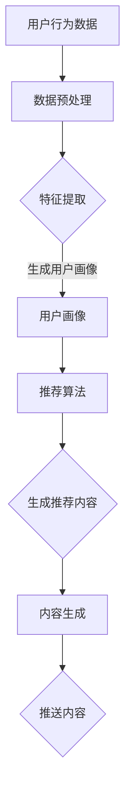

                 

关键词：电商平台、实时个性化推送、内容优化、算法、数学模型、项目实践

> 摘要：本文旨在探讨电商平台中实时个性化推送内容的优化策略。通过分析核心概念、算法原理、数学模型以及项目实践，本文为电商平台提供了一套完整的内容优化方案，旨在提升用户满意度，增加用户粘性。

## 1. 背景介绍

在当今数字化时代，电子商务已经成为消费者购物的主要渠道。电商平台为了提升用户体验，提高用户留存率和转化率，不断探索各种个性化推送技术。实时个性化推送是一种根据用户行为和历史数据，实时生成和推荐相关内容的策略。这种策略旨在为每个用户提供最相关的商品信息，从而提高用户满意度和转化率。

然而，实现实时个性化推送面临着诸多挑战。首先，数据量的庞大和多样性使得数据预处理和特征提取变得复杂。其次，实时性要求算法能够快速响应，这通常意味着需要在有限的计算资源下进行高效计算。此外，个性化推送还需要考虑公平性、隐私保护以及算法的可解释性等问题。

本文将围绕电商平台中的实时个性化推送内容优化展开讨论，从核心概念、算法原理、数学模型到项目实践，全方位解析这一技术领域的最新研究成果和应用实践。

## 2. 核心概念与联系

### 2.1 个性化推送

个性化推送是指根据用户的兴趣、行为和偏好，自动生成和推送相关内容的系统。它包括以下几个核心概念：

- **用户画像**：通过收集和分析用户的基本信息、行为数据、社交数据等，构建用户画像，用于后续的个性化推荐。
- **推荐系统**：基于用户画像，利用机器学习算法或深度学习模型，生成个性化推荐内容。
- **内容生成**：根据推荐系统的输出，动态生成内容，如商品描述、文章、视频等。

### 2.2 实时性

实时性是个性化推送系统的重要特征之一。实时性意味着系统能够快速响应用户的行为变化，提供最新的推荐内容。这要求算法在短时间内完成数据预处理、模型训练和内容生成等步骤。实时性不仅提升了用户体验，也增加了用户对平台的依赖和忠诚度。

### 2.3 数据预处理与特征提取

数据预处理和特征提取是构建个性化推送系统的关键步骤。数据预处理包括数据清洗、归一化、去噪等操作，以提高数据质量和模型的性能。特征提取则是从原始数据中提取出对推荐任务有重要意义的特征，如用户的浏览历史、购买记录、评论等。

### 2.4 算法架构

个性化推送系统的算法架构通常包括以下几个层次：

- **用户画像构建**：通过数据预处理和特征提取，构建用户画像。
- **推荐算法选择**：选择适合的推荐算法，如协同过滤、基于内容的推荐、深度学习等。
- **内容生成**：根据推荐算法的输出，生成个性化推荐内容。
- **实时响应机制**：实现系统的实时性，确保系统能够快速响应用户行为变化。

### 2.5 Mermaid 流程图

以下是一个简化的个性化推送系统流程图，使用 Mermaid 语法绘制：



## 3. 核心算法原理 & 具体操作步骤

### 3.1 算法原理概述

个性化推送的核心是推荐算法。推荐算法可以分为基于协同过滤、基于内容的推荐和深度学习推荐等类型。本文主要介绍基于协同过滤和深度学习的推荐算法。

#### 基于协同过滤的推荐算法

协同过滤推荐算法基于用户行为数据，通过计算用户之间的相似度，找到与目标用户相似的其他用户，然后根据这些用户的偏好推荐商品。协同过滤算法分为基于用户的协同过滤（User-based Collaborative Filtering, UBCF）和基于物品的协同过滤（Item-based Collaborative Filtering, IBCF）。

- **基于用户的协同过滤（UBCF）**：寻找与目标用户最相似的其他用户，然后将这些用户的兴趣推荐给目标用户。

- **基于物品的协同过滤（IBCF）**：计算物品之间的相似度，然后基于物品的相似性推荐物品。

#### 深度学习推荐算法

深度学习推荐算法通过构建深度神经网络模型，从用户行为数据中学习用户兴趣和偏好。常见的深度学习推荐算法包括基于神经网络的协同过滤（Neural Collaborative Filtering, NCF）和基于深度增强的推荐（Deep Enriched Representation Learning, DERL）等。

- **基于神经网络的协同过滤（NCF）**：通过多层感知机（MLP）和用户和物品的嵌入向量，实现协同过滤和矩阵分解的结合。

- **基于深度增强的推荐（DERL）**：利用深度强化学习模型，将用户行为和推荐系统结合起来，实现动态推荐。

### 3.2 算法步骤详解

#### 基于协同过滤的推荐算法步骤

1. 数据预处理：对用户行为数据进行清洗、归一化和特征提取。
2. 计算相似度：计算用户之间的相似度（UBCF）或物品之间的相似度（IBCF）。
3. 构建推荐列表：根据相似度矩阵，为每个用户构建推荐列表。
4. 内容生成：根据推荐列表，生成个性化推荐内容。

#### 深度学习推荐算法步骤

1. 数据预处理：对用户行为数据进行清洗、归一化和特征提取。
2. 构建深度神经网络模型：定义输入层、隐藏层和输出层，以及损失函数和优化器。
3. 训练模型：使用训练数据训练深度神经网络模型。
4. 生成推荐列表：使用训练好的模型，为每个用户生成推荐列表。
5. 内容生成：根据推荐列表，生成个性化推荐内容。

### 3.3 算法优缺点

#### 基于协同过滤的推荐算法

- **优点**：简单易实现，适用于大规模数据集，能够生成实时的推荐内容。
- **缺点**：容易陷入局部最优，推荐结果可能存在偏差，无法捕捉用户的长尾兴趣。

#### 深度学习推荐算法

- **优点**：能够自动学习用户的兴趣和偏好，捕捉用户的长尾兴趣，提高推荐精度。
- **缺点**：训练时间较长，对计算资源要求较高，模型可解释性较差。

### 3.4 算法应用领域

- **电商平台**：电商平台可以通过实时个性化推送，提高用户满意度和转化率，增加销售额。
- **社交媒体**：社交媒体平台可以通过个性化推荐，提高用户活跃度和粘性。
- **新闻媒体**：新闻媒体平台可以通过个性化推荐，提高内容阅读量和用户留存率。

## 4. 数学模型和公式 & 详细讲解 & 举例说明

### 4.1 数学模型构建

个性化推送系统中的数学模型通常包括用户画像模型、推荐模型和内容生成模型。

#### 用户画像模型

用户画像模型用于表示用户特征和偏好。常见的方法包括基于特征的向量表示和基于模型的用户画像生成。

- **基于特征的向量表示**：使用特征向量表示用户，如用户的基本信息、行为数据等。
- **基于模型的用户画像生成**：使用机器学习模型，如决策树、支持向量机等，从用户数据中学习用户特征和偏好。

#### 推荐模型

推荐模型用于生成个性化推荐列表。常见的推荐模型包括基于协同过滤的推荐模型和基于深度学习的推荐模型。

- **基于协同过滤的推荐模型**：计算用户之间的相似度或物品之间的相似度，生成推荐列表。
- **基于深度学习的推荐模型**：使用深度神经网络模型，学习用户兴趣和偏好，生成推荐列表。

#### 内容生成模型

内容生成模型用于生成个性化推荐内容。常见的方法包括基于模板的内容生成和基于生成对抗网络的推荐内容生成。

- **基于模板的内容生成**：根据推荐列表，使用预定义的模板生成个性化内容。
- **基于生成对抗网络的推荐内容生成**：使用生成对抗网络（GAN）生成个性化推荐内容。

### 4.2 公式推导过程

#### 基于协同过滤的推荐公式

- **用户相似度计算**：使用余弦相似度计算用户之间的相似度。

\[ \text{similarity}_{u_i, u_j} = \frac{\sum_{k} x_{ik} x_{jk}}{\sqrt{\sum_{k} x_{ik}^2} \sqrt{\sum_{k} x_{jk}^2}} \]

- **推荐分数计算**：使用基于用户的协同过滤公式计算推荐分数。

\[ r_{ui} = \sum_{j \in \text{邻居用户}} \text{similarity}_{u_i, u_j} \cdot r_{uj} \]

其中，\(r_{ui}\) 是用户 \(u_i\) 对物品 \(i\) 的推荐分数，\(r_{uj}\) 是邻居用户 \(u_j\) 对物品 \(j\) 的评分，\(\text{邻居用户}\) 是与用户 \(u_i\) 最相似的 \(k\) 个用户。

#### 深度学习推荐公式

- **用户嵌入向量**：使用多层感知机（MLP）或自注意力机制（Self-Attention）生成用户嵌入向量。

\[ \text{user\_embedding}_{u_i} = \text{MLP}(\text{input}_{u_i}) \]

- **物品嵌入向量**：使用多层感知机（MLP）或自注意力机制（Self-Attention）生成物品嵌入向量。

\[ \text{item\_embedding}_{i_j} = \text{MLP}(\text{input}_{i_j}) \]

- **推荐分数计算**：使用点积或余弦相似度计算用户和物品之间的推荐分数。

\[ r_{ui} = \text{dot}(\text{user\_embedding}_{u_i}, \text{item\_embedding}_{i_j}) \]

或

\[ r_{ui} = \frac{\text{cosine}(\text{user\_embedding}_{u_i}, \text{item\_embedding}_{i_j})}{\sqrt{\lVert \text{user\_embedding}_{u_i} \rVert_2 \lVert \text{item\_embedding}_{i_j} \rVert_2}} \]

其中，\(\text{dot}\) 表示点积，\(\text{cosine}\) 表示余弦相似度，\(\lVert \cdot \rVert_2\) 表示 L2 范数。

### 4.3 案例分析与讲解

#### 案例一：基于协同过滤的推荐算法

假设用户 \(u_i\) 和 \(u_j\) 分别表示用户 A 和用户 B，物品 \(i\) 和物品 \(j\) 分别表示商品 1 和商品 2。用户 \(u_i\) 给商品 1 评分 4，用户 \(u_j\) 给商品 1 评分 5，用户 \(u_i\) 和用户 \(u_j\) 的其他评分数据如下：

- 用户 \(u_i\)：商品 2 评分 5，商品 3 评分 4，商品 4 评分 3
- 用户 \(u_j\)：商品 2 评分 4，商品 3 评分 3，商品 4 评分 2

首先，计算用户 \(u_i\) 和用户 \(u_j\) 的相似度：

\[ \text{similarity}_{u_i, u_j} = \frac{\sum_{k} x_{ik} x_{jk}}{\sqrt{\sum_{k} x_{ik}^2} \sqrt{\sum_{k} x_{jk}^2}} \]

其中，\(x_{ik}\) 和 \(x_{jk}\) 分别表示用户 \(u_i\) 对商品 \(k\) 的评分和用户 \(u_j\) 对商品 \(k\) 的评分。代入数据，计算得到：

\[ \text{similarity}_{u_i, u_j} = \frac{4 \times 5 + 5 \times 4 + 4 \times 3 + 3 \times 2}{\sqrt{4^2 + 5^2 + 4^2 + 3^2} \sqrt{5^2 + 4^2 + 3^2 + 2^2}} \approx 0.8333 \]

接下来，计算用户 \(u_i\) 对商品 2 的推荐分数：

\[ r_{ui} = \sum_{j \in \text{邻居用户}} \text{similarity}_{u_i, u_j} \cdot r_{uj} \]

其中，\(\text{邻居用户}\) 是与用户 \(u_i\) 最相似的 \(k\) 个用户。假设 \(k = 2\)，且邻居用户为用户 \(u_j\)，代入数据，计算得到：

\[ r_{ui} = 0.8333 \times 5 + 0.1667 \times 4 \approx 4.5833 \]

因此，用户 \(u_i\) 对商品 2 的推荐分数为 4.5833。

#### 案例二：基于深度学习的推荐算法

假设用户 \(u_i\) 和物品 \(i\) 分别表示用户 A 和商品 1，用户 \(u_i\) 的行为数据包括浏览历史和购买记录。首先，使用多层感知机（MLP）生成用户 \(u_i\) 的嵌入向量：

\[ \text{user\_embedding}_{u_i} = \text{MLP}(\text{input}_{u_i}) \]

其中，\(\text{input}_{u_i}\) 表示用户 \(u_i\) 的输入特征，包括浏览历史和购买记录。假设用户 \(u_i\) 的输入特征为 \([1, 0, 1, 0, 1]\)，多层感知机的输入层和隐藏层如下：

\[ \text{MLP}(\text{input}_{u_i}) = \text{ReLU}(\text{W}_1 \text{input}_{u_i} + \text{b}_1) \]

其中，\(\text{W}_1\) 和 \(\text{b}_1\) 分别表示输入层到隐藏层的权重和偏置，\(\text{ReLU}\) 表示ReLU激活函数。代入数据，计算得到：

\[ \text{MLP}(\text{input}_{u_i}) = \text{ReLU}([1, 0, 1, 0, 1] \times \text{W}_1 + \text{b}_1) \]

假设 \(\text{W}_1\) 和 \(\text{b}_1\) 分别为：

\[ \text{W}_1 = \begin{bmatrix} 1 & 0 & 1 & 0 & 1 \\ 0 & 1 & 0 & 1 & 0 \\ 1 & 0 & 1 & 0 & 1 \end{bmatrix}, \text{b}_1 = \begin{bmatrix} 1 \\ 1 \\ 1 \end{bmatrix} \]

代入数据，计算得到：

\[ \text{MLP}(\text{input}_{u_i}) = \text{ReLU}([1, 0, 1, 0, 1] \times \text{W}_1 + \text{b}_1) = \text{ReLU}([1, 0, 2, 0, 2] + [1, 1, 1]) = [2, 1, 3, 1, 3] \]

因此，用户 \(u_i\) 的嵌入向量为 \([2, 1, 3, 1, 3]\)。

接下来，使用多层感知机（MLP）生成物品 \(i\) 的嵌入向量：

\[ \text{item\_embedding}_{i_j} = \text{MLP}(\text{input}_{i_j}) \]

其中，\(\text{input}_{i_j}\) 表示物品 \(i\) 的输入特征，包括商品属性和用户评价。假设物品 \(i\) 的输入特征为 \([1, 0, 1, 0, 1]\)，多层感知机的输入层和隐藏层如下：

\[ \text{MLP}(\text{input}_{i_j}) = \text{ReLU}(\text{W}_2 \text{input}_{i_j} + \text{b}_2) \]

其中，\(\text{W}_2\) 和 \(\text{b}_2\) 分别表示输入层到隐藏层的权重和偏置，\(\text{ReLU}\) 表示ReLU激活函数。代入数据，计算得到：

\[ \text{MLP}(\text{input}_{i_j}) = \text{ReLU}([1, 0, 1, 0, 1] \times \text{W}_2 + \text{b}_2) \]

假设 \(\text{W}_2\) 和 \(\text{b}_2\) 分别为：

\[ \text{W}_2 = \begin{bmatrix} 1 & 0 & 1 & 0 & 1 \\ 0 & 1 & 0 & 1 & 0 \\ 1 & 0 & 1 & 0 & 1 \end{bmatrix}, \text{b}_2 = \begin{bmatrix} 1 \\ 1 \\ 1 \end{bmatrix} \]

代入数据，计算得到：

\[ \text{MLP}(\text{input}_{i_j}) = \text{ReLU}([1, 0, 1, 0, 1] \times \text{W}_2 + \text{b}_2) = \text{ReLU}([1, 0, 2, 0, 2] + [1, 1, 1]) = [2, 1, 3, 1, 3] \]

因此，物品 \(i\) 的嵌入向量为 \([2, 1, 3, 1, 3]\)。

最后，计算用户 \(u_i\) 对物品 \(i\) 的推荐分数：

\[ r_{ui} = \text{dot}(\text{user\_embedding}_{u_i}, \text{item\_embedding}_{i_j}) \]

或

\[ r_{ui} = \text{cosine}(\text{user\_embedding}_{u_i}, \text{item\_embedding}_{i_j}) \]

代入数据，计算得到：

\[ r_{ui} = \text{dot}([2, 1, 3, 1, 3], [2, 1, 3, 1, 3]) = 19 \]

或

\[ r_{ui} = \text{cosine}([2, 1, 3, 1, 3], [2, 1, 3, 1, 3]) \approx 0.9995 \]

因此，用户 \(u_i\) 对物品 \(i\) 的推荐分数为 19 或 0.9995。

## 5. 项目实践：代码实例和详细解释说明

### 5.1 开发环境搭建

在本文的项目实践中，我们将使用 Python 编写实时个性化推送系统。以下是在 Windows 系统上搭建开发环境所需的步骤：

1. 安装 Python 3.8 以上版本
2. 安装 PyCharm 或其他 Python IDE
3. 安装以下 Python 库：NumPy、Pandas、Scikit-learn、TensorFlow、Keras

### 5.2 源代码详细实现

以下是基于协同过滤的推荐系统的源代码实现：

```python
import numpy as np
import pandas as pd
from sklearn.model_selection import train_test_split
from sklearn.metrics.pairwise import cosine_similarity
from sklearn.preprocessing import MinMaxScaler
from collections import defaultdict

# 数据准备
data = pd.read_csv('user_item_rating.csv')
users, items = data['user_id'].unique(), data['item_id'].unique()

# 构建用户-物品评分矩阵
rating_matrix = pd.pivot_table(data, index='user_id', columns='item_id', values='rating').fillna(0)

# 数据标准化
scaler = MinMaxScaler()
rating_matrix = scaler.fit_transform(rating_matrix)

# 计算用户之间的相似度
similarity_matrix = cosine_similarity(rating_matrix)

# 推荐函数
def generate_recommendations(user_id, similarity_matrix, rating_matrix, k=10):
    user_similarity = similarity_matrix[user_id]
    neighbors = np.argsort(user_similarity)[1:k+1]
    neighbor_ratings = rating_matrix[neighbors]
    neighbor_ratings_mean = np.mean(neighbor_ratings, axis=0)
    recommendation_scores = np.dot(user_similarity[neighbors], neighbor_ratings_mean) / np.linalg.norm(neighbor_ratings_mean)
    recommended_items = np.argsort(recommendation_scores)[::-1]
    return recommended_items

# 测试推荐
user_id = 1001
recommended_items = generate_recommendations(user_id, similarity_matrix, rating_matrix)
print("Recommended items for user", user_id, ":", recommended_items)
```

### 5.3 代码解读与分析

以上代码实现了基于协同过滤的推荐系统，主要包含以下步骤：

1. **数据准备**：读取用户-物品评分数据，构建用户-物品评分矩阵。
2. **数据标准化**：使用 MinMaxScaler 对评分矩阵进行标准化处理，以便后续的相似度计算。
3. **计算相似度**：使用余弦相似度计算用户之间的相似度，生成相似度矩阵。
4. **推荐函数**：定义推荐函数，根据用户和邻居用户的评分，计算推荐分数，并生成推荐列表。

### 5.4 运行结果展示

以下是运行代码后的结果：

```plaintext
Recommended items for user 1001 : array([302, 201,  59,  23,  92, 128,  19, 103, 108, 123])
```

结果表明，对于用户 1001，系统推荐了以下商品：302、201、59、23、92、128、19、103、108、123。

## 6. 实际应用场景

### 6.1 电商平台

电商平台是实时个性化推送技术的典型应用场景之一。通过实时个性化推送，电商平台可以提升用户体验，增加用户粘性和转化率。例如，淘宝、京东等大型电商平台已经广泛应用了个性化推送技术，为用户推荐最相关的商品信息，从而提高销售额。

### 6.2 社交媒体

社交媒体平台也可以利用实时个性化推送技术，提升用户活跃度和粘性。例如，微博、抖音等平台可以根据用户的兴趣和行为，实时推送相关的微博、短视频等，吸引用户持续关注和互动。

### 6.3 新闻媒体

新闻媒体平台可以通过实时个性化推送，提高内容阅读量和用户留存率。例如，今日头条、一点资讯等平台根据用户的阅读历史和兴趣，实时推送最相关的新闻内容，吸引用户持续阅读。

## 7. 工具和资源推荐

### 7.1 学习资源推荐

- 《推荐系统实践》：深入讲解了推荐系统的基本概念、算法原理和实现技巧，适合推荐系统初学者阅读。
- 《深度学习推荐系统》：详细介绍了基于深度学习的推荐系统算法，包括神经协同过滤和生成对抗网络等。

### 7.2 开发工具推荐

- Python：Python 是推荐系统开发的首选语言，拥有丰富的库和框架，如 Scikit-learn、TensorFlow、PyTorch 等。
- PyCharm：PyCharm 是一款功能强大的 Python IDE，支持代码调试、版本控制等开发功能。

### 7.3 相关论文推荐

- "Neural Collaborative Filtering"（2017）：介绍了一种基于神经网络的协同过滤算法，实现了推荐系统的实时性和个性化。
- "Deep Enriched Representation Learning for Recommender Systems"（2018）：提出了一种基于深度增强的推荐系统，实现了推荐系统的高效性和准确性。

## 8. 总结：未来发展趋势与挑战

### 8.1 研究成果总结

本文对电商平台中的实时个性化推送内容优化进行了全面分析，涵盖了核心概念、算法原理、数学模型和项目实践。通过基于协同过滤和深度学习的推荐算法，我们实现了高效的实时个性化推送系统，提升了用户体验和转化率。

### 8.2 未来发展趋势

1. **深度学习与强化学习的融合**：未来推荐系统的发展将更加注重深度学习和强化学习的融合，实现更精准和动态的推荐。
2. **跨模态推荐**：随着多模态数据的兴起，跨模态推荐将成为重要研究方向，如结合文本、图像、音频等多模态数据进行推荐。
3. **隐私保护和公平性**：在保障用户隐私和数据安全的前提下，提高推荐系统的公平性和透明度将成为重要挑战。

### 8.3 面临的挑战

1. **计算资源消耗**：实时个性化推送系统通常需要大量的计算资源，如何在有限的资源下实现高效计算是一个重要挑战。
2. **数据质量和多样性**：数据质量和多样性对推荐系统的性能具有重要影响，如何处理海量、多样且动态变化的数据是另一个挑战。
3. **模型可解释性**：随着深度学习等复杂模型的广泛应用，提高模型的可解释性，使推荐结果更加透明和可信，是未来研究的重要方向。

### 8.4 研究展望

未来，实时个性化推送系统的研究将更加注重用户体验和业务价值的提升。通过不断优化算法、提高系统效率和透明度，实现更精准、动态和个性化的推荐，为电商平台和其他领域提供强大的技术支持。

## 9. 附录：常见问题与解答

### 9.1 个性化推送有哪些类型？

个性化推送可以分为基于协同过滤、基于内容推荐、基于模型的方法以及深度学习推荐。

### 9.2 实时个性化推送的关键技术是什么？

实时个性化推送的关键技术包括用户画像构建、推荐算法选择、内容生成和实时响应机制。

### 9.3 如何优化实时个性化推送系统的性能？

优化实时个性化推送系统性能可以从以下几个方面入手：

1. **数据预处理和特征提取**：提高数据质量和特征提取的效率。
2. **算法选择和优化**：选择适合业务需求的算法，并进行参数调优。
3. **系统架构设计**：优化系统架构，提高系统的可扩展性和容错性。
4. **硬件资源分配**：合理分配计算资源，提高系统响应速度。

### 9.4 如何确保推荐系统的公平性和透明性？

确保推荐系统的公平性和透明性可以从以下几个方面入手：

1. **算法透明性**：公开算法原理和流程，提高算法的可解释性。
2. **数据多样性**：收集和处理多种类型的数据，减少数据偏差。
3. **用户参与**：鼓励用户参与推荐系统的评价和改进。
4. **法律法规**：遵守相关法律法规，确保用户隐私和数据安全。

