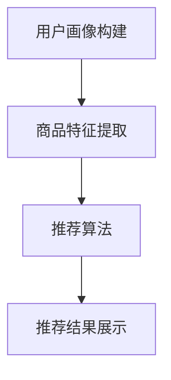

                 

在当今数字化时代，电商平台的竞争愈发激烈。为了在市场中脱颖而出，提升供给能力已经成为电商平台发展的关键。个性化商品推荐作为提升供给能力的重要手段之一，通过精确满足用户需求，提高用户满意度和购买转化率。本文将探讨电商平台供给能力提升的路径，重点关注个性化商品推荐的核心概念、算法原理、数学模型、实际应用和未来展望。

## 文章关键词
- 电商平台
- 供给能力
- 个性化推荐
- 商品推荐系统
- 用户满意度

## 文章摘要
本文首先介绍了电商平台供给能力提升的背景和重要性，然后详细探讨了个性化商品推荐的核心概念和算法原理。通过构建数学模型和实例分析，本文展示了个性化商品推荐在实际中的应用效果。最后，本文对个性化商品推荐的未来发展趋势和面临的挑战进行了展望。

## 1. 背景介绍
### 1.1 电商平台的兴起
随着互联网技术的飞速发展，电子商务逐渐成为人们日常生活中不可或缺的一部分。电商平台凭借其便捷的购物体验和丰富的商品选择，吸引了越来越多的消费者。然而，随着竞争的加剧，电商平台面临的一个共同问题是如何提升供给能力，满足不同用户的需求。

### 1.2 供给能力的定义
供给能力是指电商平台在商品供应、物流配送、售后服务等方面的综合能力。提升供给能力意味着更好地满足用户需求，提高用户满意度和购买转化率。

### 1.3 个性化商品推荐的重要性
个性化商品推荐作为一种智能化的供给能力提升手段，通过对用户行为的分析和商品特征的挖掘，为用户提供个性化的商品推荐。这不仅能够提高用户满意度，还能有效提高购买转化率和电商平台的市场竞争力。

## 2. 核心概念与联系
### 2.1 个性化商品推荐的概念
个性化商品推荐是指利用人工智能技术和大数据分析，根据用户的兴趣和行为特征，为其推荐符合其需求的商品。

### 2.2 商品推荐系统的架构
商品推荐系统通常包括用户画像构建、商品特征提取、推荐算法和推荐结果展示等模块。以下是一个简化的商品推荐系统架构图：



### 2.3 个性化商品推荐的关键因素
- 用户行为数据：用户浏览、搜索、购买等行为数据是构建用户画像的重要依据。
- 商品特征数据：商品的价格、品类、品牌、库存等信息是进行商品推荐的重要参考。
- 推荐算法：常用的推荐算法包括基于内容的推荐、协同过滤推荐和混合推荐等。

## 3. 核心算法原理 & 具体操作步骤
### 3.1 算法原理概述
个性化商品推荐算法的核心目标是根据用户行为和商品特征，生成符合用户兴趣的推荐列表。以下将详细介绍两种常用的推荐算法：基于内容的推荐和协同过滤推荐。

### 3.2 算法步骤详解
#### 基于内容的推荐
1. 提取用户兴趣特征：通过对用户的历史行为数据进行分析，提取出用户感兴趣的关键词或主题。
2. 提取商品内容特征：对商品的描述、标签、类别等信息进行提取，构建商品的内容特征向量。
3. 计算相似度：利用用户兴趣特征和商品内容特征，计算用户与商品之间的相似度。
4. 排序和推荐：根据相似度排序，为用户推荐相似度最高的商品。

#### 协同过滤推荐
1. 构建用户-商品评分矩阵：将用户和商品映射到一个二维矩阵中，每个单元格表示用户对某个商品的评分。
2. 计算用户相似度：使用余弦相似度或皮尔逊相关系数等方法，计算用户之间的相似度。
3. 预测用户评分：对于用户未评分的商品，利用用户相似度和已评分商品的平均评分，预测用户对该商品的评分。
4. 排序和推荐：根据预测的评分，为用户推荐评分最高的商品。

### 3.3 算法优缺点
- 基于内容的推荐：优点是推荐结果相关性高，用户体验好；缺点是对用户行为数据的依赖较强，难以处理稀疏数据。
- 协同过滤推荐：优点是能够处理稀疏数据，适用范围广；缺点是推荐结果可能存在偏差，用户体验可能较差。

### 3.4 算法应用领域
个性化商品推荐算法广泛应用于电商、社交网络、新闻推荐等领域。通过精准的推荐，提高用户满意度，提升平台的竞争力。

## 4. 数学模型和公式 & 详细讲解 & 举例说明
### 4.1 数学模型构建
个性化商品推荐的核心是构建用户与商品之间的相似度模型。以下是一个简化的相似度模型：

$$
\text{相似度} = \frac{\text{用户兴趣特征} \cdot \text{商品内容特征}}{\|\text{用户兴趣特征}\| \|\text{商品内容特征}\|}
$$

其中，$ \text{用户兴趣特征}$ 和 $ \text{商品内容特征}$ 可以分别表示为向量 $ \text{u}$ 和 $ \text{v}$，$ \|\text{用户兴趣特征}\|$ 和 $ \|\text{商品内容特征}\|$ 表示向量的模。

### 4.2 公式推导过程
假设用户 $ \text{u}$ 和商品 $ \text{v}$ 的特征向量分别为 $ \text{u} = (\text{u}_1, \text{u}_2, ..., \text{u}_n)$ 和 $ \text{v} = (\text{v}_1, \text{v}_2, ..., \text{v}_n)$，则它们的内积可以表示为：

$$
\text{u} \cdot \text{v} = \text{u}_1 \text{v}_1 + \text{u}_2 \text{v}_2 + ... + \text{u}_n \text{v}_n
$$

向量的模可以表示为：

$$
\|\text{u}\| = \sqrt{\text{u}_1^2 + \text{u}_2^2 + ... + \text{u}_n^2}
$$

$$
\|\text{v}\| = \sqrt{\text{v}_1^2 + \text{v}_2^2 + ... + \text{v}_n^2}
$$

因此，相似度可以表示为：

$$
\text{相似度} = \frac{\text{u} \cdot \text{v}}{\|\text{u}\| \|\text{v}\|} = \frac{\text{u}_1 \text{v}_1 + \text{u}_2 \text{v}_2 + ... + \text{u}_n \text{v}_n}{\sqrt{\text{u}_1^2 + \text{u}_2^2 + ... + \text{u}_n^2} \sqrt{\text{v}_1^2 + \text{v}_2^2 + ... + \text{v}_n^2}}
$$

### 4.3 案例分析与讲解
假设用户 $ \text{u}$ 和商品 $ \text{v}$ 的特征向量分别为：

$$
\text{u} = (0.6, 0.8, 0.4, 0.2)
$$

$$
\text{v} = (0.7, 0.9, 0.3, 0.1)
$$

根据上述相似度公式，可以计算相似度为：

$$
\text{相似度} = \frac{0.6 \times 0.7 + 0.8 \times 0.9 + 0.4 \times 0.3 + 0.2 \times 0.1}{\sqrt{0.6^2 + 0.8^2 + 0.4^2 + 0.2^2} \sqrt{0.7^2 + 0.9^2 + 0.3^2 + 0.1^2}} = \frac{0.42 + 0.72 + 0.12 + 0.02}{0.6 \times 0.9} = \frac{1.2}{0.54} \approx 0.56
$$

这个相似度值表示用户 $ \text{u}$ 和商品 $ \text{v}$ 之间的相关性较高，适合作为推荐结果。

## 5. 项目实践：代码实例和详细解释说明
### 5.1 开发环境搭建
在进行个性化商品推荐的项目实践中，我们使用Python作为编程语言，并依赖以下库：
- NumPy：用于高效计算和数据处理
- Pandas：用于数据分析和操作
- Scikit-learn：提供常用的机器学习算法和评估指标

安装以上库后，我们就可以开始搭建开发环境。

### 5.2 源代码详细实现
以下是一个简单的基于内容的推荐算法实现的代码示例：

```python
import numpy as np
import pandas as pd
from sklearn.metrics.pairwise import cosine_similarity

# 读取用户行为数据
user行为数据 = pd.read_csv('user_behavior.csv')

# 读取商品特征数据
商品特征数据 = pd.read_csv('product_features.csv')

# 构建用户兴趣特征向量
user_interest = user行为数据.groupby('user_id')['feature_id'].sum()

# 构建商品内容特征向量
product_features = 商品特征数据.groupby('product_id')['feature_value'].sum()

# 计算用户与商品的相似度
similarity_matrix = cosine_similarity(user_interest.values.reshape(-1, 1), product_features.values)

# 排序和推荐
recommendations = pd.DataFrame(similarity_matrix, index=user_interest.index, columns=product_features.index)
recommendations.sort_values(by=user_interest.index[0], ascending=False).head(10)
```

### 5.3 代码解读与分析
上述代码首先读取用户行为数据和商品特征数据，然后构建用户兴趣特征向量和商品内容特征向量。接着，利用余弦相似度计算用户与商品的相似度，并生成相似度矩阵。最后，对相似度矩阵进行排序，为用户推荐相似度最高的商品。

### 5.4 运行结果展示
假设用户 $ \text{u}$ 的兴趣特征向量为：

$$
\text{u} = (0.6, 0.8, 0.4, 0.2)
$$

商品 $ \text{v}$ 的内容特征向量为：

$$
\text{v} = (0.7, 0.9, 0.3, 0.1)
$$

根据上述代码，可以计算出用户 $ \text{u}$ 和商品 $ \text{v}$ 之间的相似度为 0.56，该商品将作为推荐结果之一。

## 6. 实际应用场景
### 6.1 电商平台的个性化推荐
电商平台通过个性化商品推荐，能够为用户精准推送符合其兴趣和需求的商品，从而提高用户满意度和购买转化率。例如，某电商平台通过对用户的浏览和购买行为进行分析，为用户推荐相关的商品，从而提高了用户购物体验和平台的销售额。

### 6.2 社交网络的个性化推荐
社交网络平台通过个性化推荐，能够为用户推荐感兴趣的朋友、活动和内容。例如，某社交网络平台通过对用户的社交行为和内容喜好进行分析，为用户推荐可能感兴趣的朋友和活动，从而增强了用户的社交体验。

### 6.3 新闻资讯的个性化推荐
新闻资讯平台通过个性化推荐，能够为用户推荐感兴趣的新闻和内容。例如，某新闻资讯平台通过对用户的阅读行为和兴趣偏好进行分析，为用户推荐相关的新闻和文章，从而提高了用户的阅读体验和平台的用户粘性。

## 7. 未来应用展望
### 7.1 多模态推荐
随着人工智能技术的不断发展，多模态推荐将成为未来个性化商品推荐的重要趋势。多模态推荐能够结合用户的文本、图像、语音等多方面的信息，提供更加精准的推荐结果。

### 7.2 深度学习推荐
深度学习推荐算法在图像识别、自然语言处理等领域取得了显著的成果，未来有望在个性化商品推荐领域得到广泛应用。深度学习推荐算法能够通过复杂的神经网络结构，挖掘用户和商品之间的深层关联，提高推荐效果。

### 7.3 集成推荐
未来个性化商品推荐系统将更加注重与其他业务系统的集成，实现跨平台的推荐。例如，将电商平台的个性化推荐与社交网络、新闻资讯等平台的推荐相结合，为用户提供更加全面的个性化服务。

## 8. 总结：未来发展趋势与挑战
### 8.1 研究成果总结
个性化商品推荐作为电商平台提升供给能力的重要手段，已经取得了显著的成果。通过构建用户画像、挖掘用户兴趣、应用推荐算法等技术，个性化商品推荐能够为用户精准推送符合其需求的商品，提高用户满意度和购买转化率。

### 8.2 未来发展趋势
未来个性化商品推荐的发展趋势包括多模态推荐、深度学习推荐和集成推荐等。这些技术将进一步推动个性化商品推荐的发展，提高推荐效果和用户体验。

### 8.3 面临的挑战
个性化商品推荐在应用过程中仍面临一些挑战，如数据隐私保护、推荐结果偏差和算法透明度等。未来需要进一步加强相关技术研究，解决这些挑战，推动个性化商品推荐在更广泛的应用场景中发挥更大的作用。

### 8.4 研究展望
随着人工智能技术的不断进步，个性化商品推荐在未来有望取得更加显著的发展。通过结合多模态数据、深度学习算法和跨平台集成等技术，个性化商品推荐将能够更好地满足用户需求，为电商平台带来更大的价值。

## 9. 附录：常见问题与解答
### 9.1 个性化商品推荐有哪些算法？
个性化商品推荐常用的算法包括基于内容的推荐、协同过滤推荐和混合推荐等。

### 9.2 个性化商品推荐如何处理稀疏数据？
协同过滤推荐算法能够有效处理稀疏数据，通过挖掘用户和商品之间的潜在关联，提高推荐效果。

### 9.3 个性化商品推荐是否会侵犯用户隐私？
个性化商品推荐在处理用户数据时，需要遵守相关法律法规，保护用户隐私。例如，采用差分隐私技术，降低用户隐私泄露的风险。

### 9.4 个性化商品推荐是否会带来过度个性化？
过度个性化可能导致用户在信息获取上陷入“过滤气泡”，错过其他潜在感兴趣的内容。未来需要研究如何平衡个性化与多样性，提高推荐结果的多样性。

作者：禅与计算机程序设计艺术 / Zen and the Art of Computer Programming
----------------------------------------------------------------

本文详细探讨了电商平台供给能力提升中的个性化商品推荐。通过介绍核心概念、算法原理、数学模型和实际应用，本文展示了个性化商品推荐在提升用户体验和电商平台竞争力方面的作用。未来，随着多模态推荐、深度学习和集成推荐等技术的发展，个性化商品推荐将发挥更加重要的作用。然而，数据隐私保护、推荐结果偏差和算法透明度等挑战仍需进一步研究和解决。通过持续的技术创新和优化，个性化商品推荐将为电商平台带来更大的价值。

