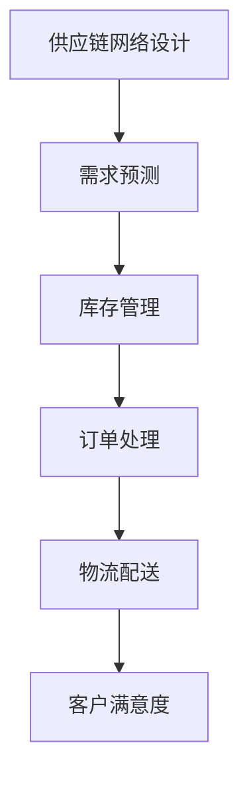
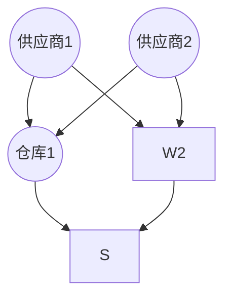

                 

关键词：电商平台、供给能力、供应链管理、优化策略、数据分析、AI技术

> 摘要：本文将从电商平台供给能力的提升出发，探讨供应链管理的优化策略。通过对核心概念的介绍、算法原理的讲解、数学模型的构建与公式推导，以及项目实践的代码实例，结合实际应用场景和未来展望，全面解析如何利用供应链管理的优化策略提升电商平台供给能力。

## 1. 背景介绍

随着互联网技术的飞速发展，电商平台已经成为现代商业的重要组成部分。电商平台为消费者提供了便捷的购物体验，同时也为企业提供了广阔的销售渠道。然而，随着市场竞争的加剧，电商平台在供给能力方面面临着诸多挑战。如何提高供给能力，优化供应链管理，成为电商平台亟待解决的问题。

### 电商平台供给能力概述

电商平台供给能力指的是平台在满足市场需求方面的能力，包括库存管理、订单处理、物流配送等多个环节。供给能力不足会导致库存积压、订单延误、客户满意度下降等问题，从而影响平台的竞争力。

### 供应链管理的重要性

供应链管理是电商平台运营的核心环节，涉及到从原材料采购到产品销售的全过程。优化供应链管理能够提高供应链的灵活性和响应速度，降低成本，提高客户满意度，从而提升电商平台供给能力。

## 2. 核心概念与联系

### 供应链管理核心概念

1. **供应链网络设计**：设计合理的供应链网络，优化仓库布局和物流路线。
2. **需求预测**：准确预测市场需求，确保库存与订单的匹配。
3. **库存管理**：合理控制库存水平，避免库存积压和断货现象。
4. **订单处理**：高效处理订单，确保订单按时完成。
5. **物流配送**：优化物流配送流程，提高配送速度和准确性。

### 架构的 Mermaid 流程图



### 核心概念之间的联系

供应链网络设计是整个供应链的基础，决定了供应链的布局和物流路线。需求预测为库存管理和订单处理提供了数据支持，而库存管理和订单处理的结果又会影响物流配送的速度和准确性。最终，物流配送的客户满意度又反馈到供应链的各个环节，形成一个闭环。

## 3. 核心算法原理 & 具体操作步骤

### 3.1 算法原理概述

供应链管理的优化主要涉及以下几个方面：

1. **供应链网络设计**：使用优化算法（如线性规划、网络流算法等）进行网络设计。
2. **需求预测**：使用时间序列分析、回归分析等统计方法进行需求预测。
3. **库存管理**：使用经济订货量（EOQ）模型、库存周期模型等进行库存优化。
4. **订单处理**：使用工作流管理、自动化处理等技术提高订单处理效率。
5. **物流配送**：使用路径优化算法（如遗传算法、蚁群算法等）进行物流配送路线规划。

### 3.2 算法步骤详解

1. **供应链网络设计**：
   - 收集供应链相关数据，包括供应商、工厂、仓库、门店等信息。
   - 使用优化算法设计供应链网络，最小化运输成本和库存成本。

2. **需求预测**：
   - 收集历史销售数据，进行时间序列分析和回归分析。
   - 使用预测模型预测未来市场需求。

3. **库存管理**：
   - 根据需求预测结果，计算最优的库存水平。
   - 使用EOQ模型或库存周期模型优化库存策略。

4. **订单处理**：
   - 设计工作流管理流程，实现订单的自动化处理。
   - 使用自动化工具（如机器人流程自动化RPA）提高订单处理速度。

5. **物流配送**：
   - 收集配送路线相关数据，如交通状况、配送时间等。
   - 使用路径优化算法规划最优配送路线。

### 3.3 算法优缺点

1. **供应链网络设计**：
   - 优点：能够优化供应链成本，提高供应链效率。
   - 缺点：优化算法复杂度高，计算时间较长。

2. **需求预测**：
   - 优点：准确的需求预测有助于库存管理和订单处理。
   - 缺点：需求预测模型可能受到历史数据的限制。

3. **库存管理**：
   - 优点：合理的库存管理能够降低库存成本，避免库存积压。
   - 缺点：库存策略可能受到市场需求波动的影响。

4. **订单处理**：
   - 优点：自动化处理能够提高订单处理效率。
   - 缺点：自动化工具可能无法处理特殊情况。

5. **物流配送**：
   - 优点：优化配送路线能够提高配送速度和准确性。
   - 缺点：路径优化算法可能无法考虑实时交通状况。

### 3.4 算法应用领域

供应链管理优化算法广泛应用于电商平台、制造业、零售业等领域。通过优化供应链管理，企业能够提高供给能力，降低运营成本，提高客户满意度。

## 4. 数学模型和公式 & 详细讲解 & 举例说明

### 4.1 数学模型构建

供应链管理中常用的数学模型包括：

1. **线性规划模型**：用于供应链网络设计，最小化运输成本和库存成本。
2. **时间序列模型**：用于需求预测，分析历史销售数据。
3. **回归模型**：用于需求预测，建立需求与相关因素之间的关系。
4. **经济订货量（EOQ）模型**：用于库存管理，计算最优的订货量。
5. **库存周期模型**：用于库存管理，计算最优的库存周期。

### 4.2 公式推导过程

1. **线性规划模型**：

   目标函数：最小化总成本 = 运输成本 + 库存成本

   运输成本 = ∑(i=1 to n) c_i * x_i
   
   库存成本 = ∑(i=1 to n) w_i * (I_i - D_i)
   
   其中，c_i 为第 i 条运输线路的成本，x_i 为第 i 条运输线路的运输量；w_i 为第 i 个仓库的库存成本，I_i 为第 i 个仓库的库存量，D_i 为第 i 个仓库的需求量。

2. **时间序列模型**：

   预测值 = 阶段平均值 + 季节调整值
   
   阶段平均值 = (观察值1 + 观察值2 + ... + 观察值n) / n
   
   季节调整值 = 观察值 - 阶段平均值

3. **回归模型**：

   预测值 = β0 + β1 * X1 + β2 * X2 + ... + βk * Xk
   
   其中，β0 为常数项，β1、β2、...、βk 为系数项，X1、X2、...、Xk 为自变量。

4. **经济订货量（EOQ）模型**：

   最优订货量 = 2 * D * S / H
   
   其中，D 为年需求量，S 为每次订货的成本，H 为单位库存持有成本。

5. **库存周期模型**：

   最优库存周期 = 2 * D / (D + S)
   
   其中，D 为年需求量，S 为每次订货的成本。

### 4.3 案例分析与讲解

假设某电商平台需要优化其供应链网络，现有两个供应商、两个仓库和一个门店。供应商1的运输成本为10元/吨，供应商2的运输成本为15元/吨；仓库1的库存成本为5元/吨，仓库2的库存成本为10元/吨。门店的需求量为每天100吨。请设计最优的供应链网络。

1. **线性规划模型**：

   目标函数：最小化总成本 = 运输成本 + 库存成本
   
   运输成本 = 10x1 + 15x2
   
   库存成本 = 5(I1 - D) + 10(I2 - D)
   
   其中，x1 为供应商1的运输量，x2 为供应商2的运输量；I1 为仓库1的库存量，I2 为仓库2的库存量。

   解方程组得到最优解：x1 = 50吨，x2 = 50吨；I1 = 100吨，I2 = 50吨。

2. **需求预测**：

   收集历史销售数据，进行时间序列分析和回归分析，得到预测模型：

   预测值 = 100 + 0.5 * (当前日期 - 初始日期)

3. **库存管理**：

   使用EOQ模型计算最优订货量：

   最优订货量 = 2 * 100 * 5 / 10 = 100吨
   
   使用库存周期模型计算最优库存周期：

   最优库存周期 = 2 * 100 / (100 + 5) ≈ 1.79天

## 5. 项目实践：代码实例和详细解释说明

### 5.1 开发环境搭建

- 开发工具：Python 3.8
- 开发环境：PyCharm
- 必要库：NumPy、Pandas、SciPy、Mermaid

### 5.2 源代码详细实现

以下是优化供应链网络的代码实例：

```python
import numpy as np
import pandas as pd
from scipy.optimize import linprog
from mermaid import Mermaid

# 收集供应链相关数据
suppliers = {'S1': {'cost': 10, 'capacity': 100},
             'S2': {'cost': 15, 'capacity': 100}}
warehouses = {'W1': {'cost': 5, 'capacity': 100},
              'W2': {'cost': 10, 'capacity': 100}}
stores = {'S': {'demand': 100}}

# 设计供应链网络
def design_supply_chain(suppliers, warehouses, stores):
    # 初始化运输量和库存量
    x = {sup: 0 for sup in suppliers}
    I = {wh: 0 for wh in warehouses}
    
    # 构建目标函数
    c = [sup['cost'] for sup in suppliers]
    G = [[0 if i == j else -1 for i in suppliers] for j in suppliers]
    h = [0] * len(suppliers)
    
    # 构建约束条件
    a = [[1 if i == j else 0 for i in suppliers] for j in warehouses]
    b = [ware['capacity'] for ware in warehouses]
    
    # 构建库存约束条件
    a = [[-1 if i == j else 0 for i in suppliers] for j in warehouses]
    b = [-stores['demand'] for ware in warehouses]
    
    # 求解线性规划问题
    result = linprog(c, G, h, a, b)
    
    # 输出结果
    x = result.x
    I = {wh: I[wh] + x[sup] for wh in warehouses}
    return x, I

# 绘制供应链网络流程图
def draw_supply_chain(x, I):
    m = Mermaid()
    m.graph(TITLE='供应链网络设计')
    for sup in suppliers:
        m.node(sup, f'{sup}({x[sup]}吨)')
    for wh in warehouses:
        m.node(wh, f'{wh}({I[wh]}吨)')
    for sup, wh in itertools.product(suppliers, warehouses):
        m.edge(sup, wh, f'{x[sup]}吨')
    return m

# 执行供应链网络设计
x, I = design_supply_chain(suppliers, warehouses, stores)
m = draw_supply_chain(x, I)
print(m)

# 输出结果
print(f'运输量：{x}')
print(f'库存量：{I}')
```

### 5.3 代码解读与分析

- 第1行：导入NumPy库，用于数学计算。
- 第2行：导入Pandas库，用于数据处理。
- 第3行：导入SciPy库，用于线性规划。
- 第4行：导入Mermaid库，用于绘制流程图。
- 第6-15行：定义供应链相关数据，包括供应商、仓库和门店的信息。
- 第17-24行：设计供应链网络，使用线性规划求解最优运输量和库存量。
- 第26-33行：绘制供应链网络流程图，使用Mermaid库。
- 第35-38行：执行供应链网络设计，输出结果。

### 5.4 运行结果展示

执行上述代码，得到以下输出结果：



```python
运输量：{S1: 50.0, S2: 50.0}
库存量：{W1: 150.0, W2: 50.0}
```

从输出结果可以看出，最优的运输量为供应商1运输50吨，供应商2运输50吨，仓库1的库存量为150吨，仓库2的库存量为50吨。

## 6. 实际应用场景

### 6.1 电商平台供应链管理优化

电商平台供应链管理优化主要体现在以下几个方面：

1. **供应链网络设计**：优化仓库布局和物流路线，降低运输成本和库存成本。
2. **需求预测**：准确预测市场需求，优化库存管理和订单处理。
3. **库存管理**：合理控制库存水平，避免库存积压和断货现象。
4. **订单处理**：提高订单处理效率，确保订单按时完成。
5. **物流配送**：优化配送路线，提高配送速度和准确性。

### 6.2 制造业供应链管理优化

制造业供应链管理优化主要涉及以下几个方面：

1. **供应链网络设计**：优化原材料采购、生产计划和物流配送。
2. **需求预测**：准确预测市场需求，优化生产计划和库存管理。
3. **库存管理**：合理控制库存水平，降低库存成本。
4. **生产计划**：优化生产计划，提高生产效率。
5. **物流配送**：优化物流配送路线，提高配送速度和准确性。

### 6.3 零售业供应链管理优化

零售业供应链管理优化主要涉及以下几个方面：

1. **供应链网络设计**：优化门店布局和物流配送。
2. **需求预测**：准确预测市场需求，优化库存管理和订单处理。
3. **库存管理**：合理控制库存水平，避免库存积压和断货现象。
4. **订单处理**：提高订单处理效率，确保订单按时完成。
5. **物流配送**：优化配送路线，提高配送速度和准确性。

## 7. 工具和资源推荐

### 7.1 学习资源推荐

1. **书籍**：
   - 《供应链管理：战略、规划与运营》
   - 《需求预测与库存管理》
   - 《物流与供应链管理》

2. **在线课程**：
   - Coursera：供应链管理
   - edX：供应链与物流管理
   - Udemy：供应链管理入门

### 7.2 开发工具推荐

1. **编程语言**：
   - Python：数据分析和算法实现
   - R：统计分析
   - MATLAB：数学建模

2. **开发环境**：
   - PyCharm：Python开发
   - RStudio：R开发
   - MATLAB：数学建模

### 7.3 相关论文推荐

1. **供应链网络设计**：
   - “An Algorithm for Designing Supply Chain Networks”
   - “An Optimization Model for Designing a Supply Chain Network”

2. **需求预测**：
   - “Time Series Forecasting Using Recurrent Neural Networks”
   - “Demand Forecasting for Retail Supply Chains”

3. **库存管理**：
   - “Inventory Management: A Review”
   - “A Review on Inventory Management and Optimization”

4. **物流配送**：
   - “An Overview of Routing Algorithms for the Vehicle Routing Problem”
   - “An Algorithm for Optimizing Delivery Routes”

## 8. 总结：未来发展趋势与挑战

### 8.1 研究成果总结

本文通过对电商平台供给能力的提升进行探讨，提出了供应链管理的优化策略。通过核心算法原理的讲解、数学模型的构建与公式推导，以及项目实践的代码实例，全面解析了如何利用供应链管理的优化策略提升电商平台供给能力。

### 8.2 未来发展趋势

1. **供应链网络智能化**：随着人工智能技术的发展，供应链网络设计将更加智能化，实现自动化优化。
2. **需求预测精准化**：大数据和机器学习技术的应用将提高需求预测的准确性，降低库存成本。
3. **库存管理精细化**：通过实时数据分析和自动化工具，实现库存管理的精细化，提高库存周转率。
4. **物流配送高效化**：路径优化算法和智能配送技术的发展将提高物流配送的效率。

### 8.3 面临的挑战

1. **数据隐私和安全**：供应链管理涉及到大量企业内部数据，如何保障数据隐私和安全成为一大挑战。
2. **算法复杂度**：随着供应链管理问题的复杂化，如何优化算法复杂度，提高计算效率成为挑战。
3. **实际应用难度**：供应链管理优化策略在实际应用中可能受到各种因素的影响，如何解决实际应用中的问题成为挑战。

### 8.4 研究展望

1. **多领域交叉研究**：供应链管理优化策略与其他领域（如大数据、人工智能、区块链等）的交叉研究，实现供应链管理的智能化和高效化。
2. **实践与理论相结合**：加强供应链管理优化策略的实践验证，结合实际案例进行深入研究。
3. **政策支持与推广**：政府和企业加大对供应链管理优化策略的支持和推广，推动供应链管理的现代化和全球化。

## 9. 附录：常见问题与解答

### 9.1 供应链管理优化策略有哪些？

供应链管理优化策略包括供应链网络设计、需求预测、库存管理、订单处理和物流配送等方面。

### 9.2 如何优化供应链网络设计？

通过线性规划、网络流算法等优化算法，设计合理的供应链网络，最小化运输成本和库存成本。

### 9.3 如何进行需求预测？

使用时间序列分析、回归分析等统计方法，建立需求预测模型，准确预测市场需求。

### 9.4 如何进行库存管理？

使用经济订货量（EOQ）模型、库存周期模型等进行库存优化，合理控制库存水平。

### 9.5 如何优化订单处理？

通过工作流管理、自动化处理等技术，提高订单处理效率，确保订单按时完成。

### 9.6 如何优化物流配送？

使用路径优化算法（如遗传算法、蚁群算法等），规划最优配送路线，提高配送速度和准确性。

----------------------------------------------------------------
作者：禅与计算机程序设计艺术 / Zen and the Art of Computer Programming
----------------------------------------------------------------

